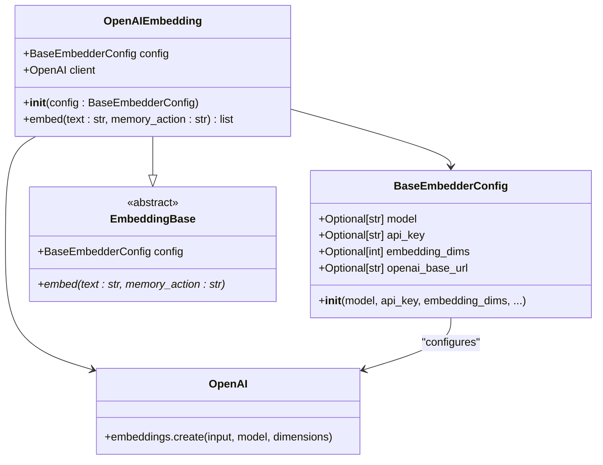
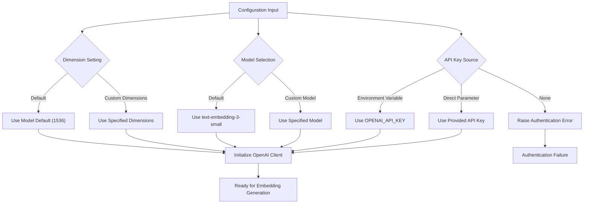
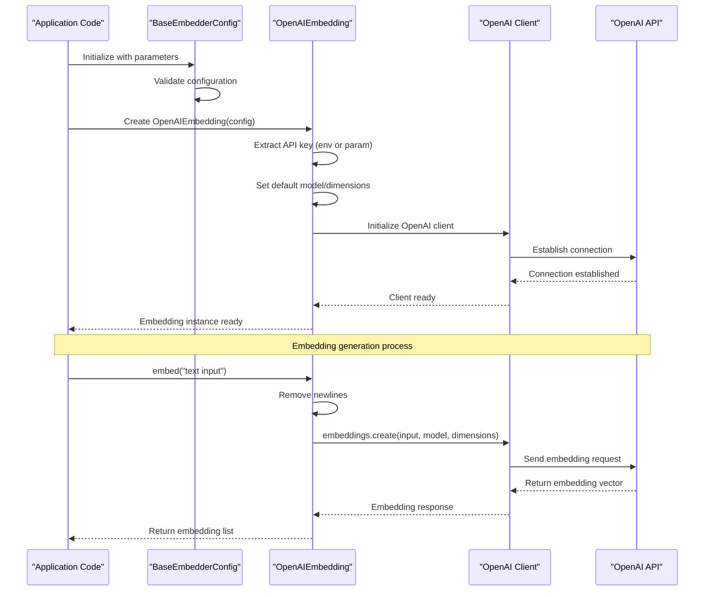
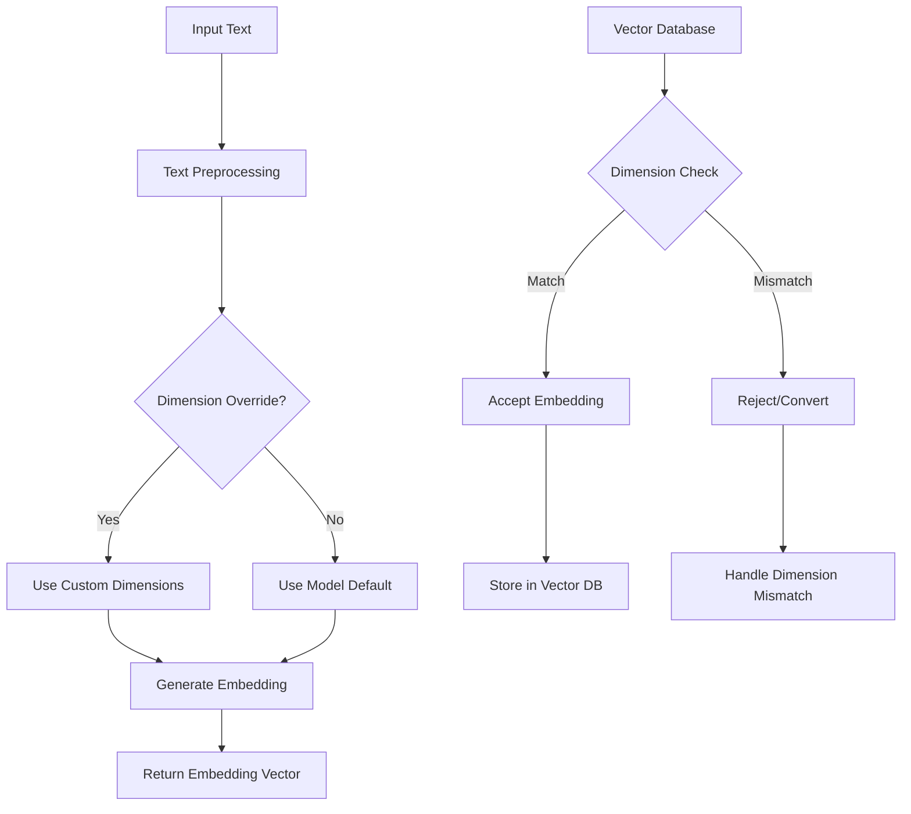
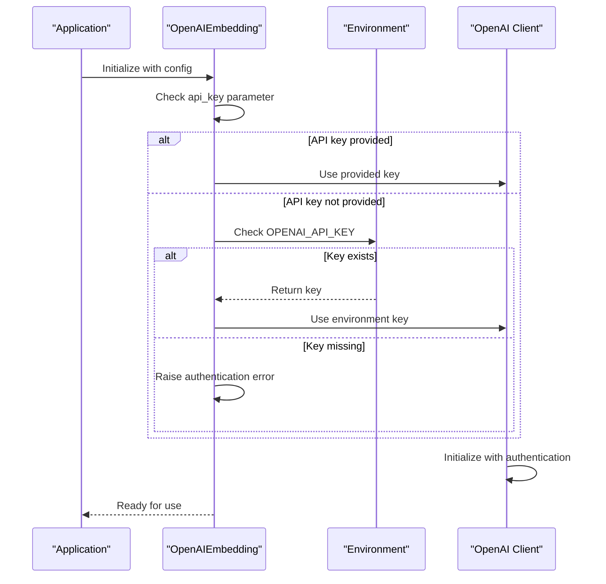
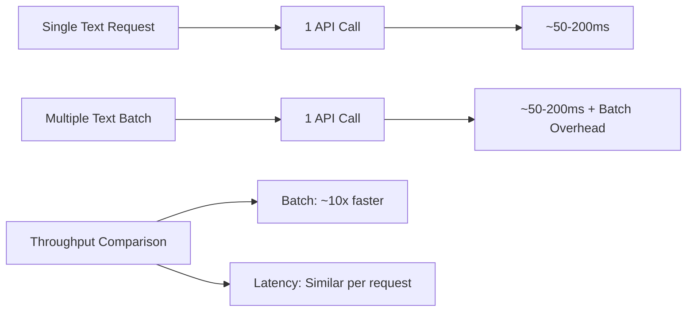
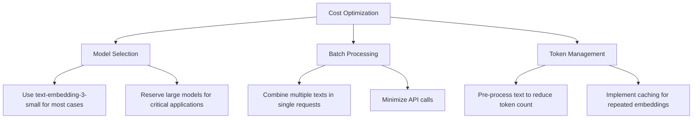
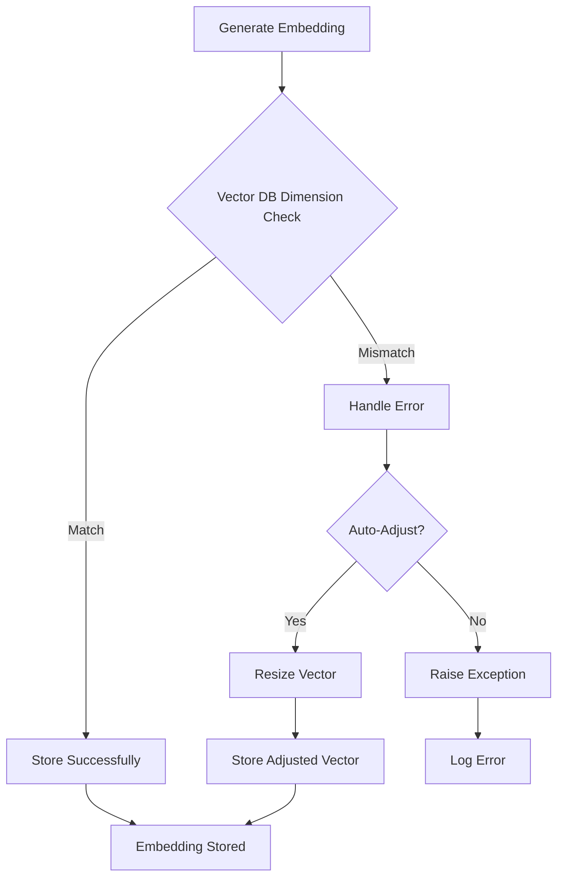
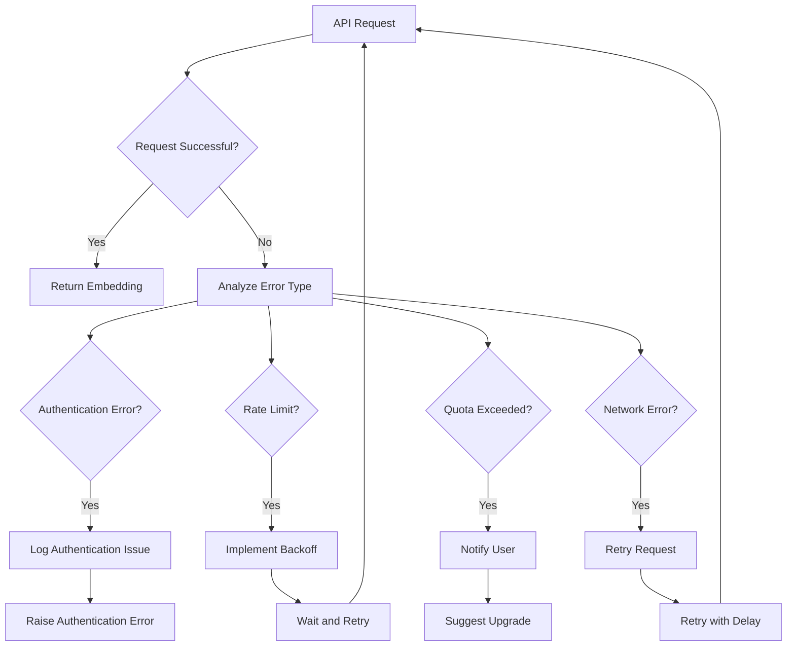
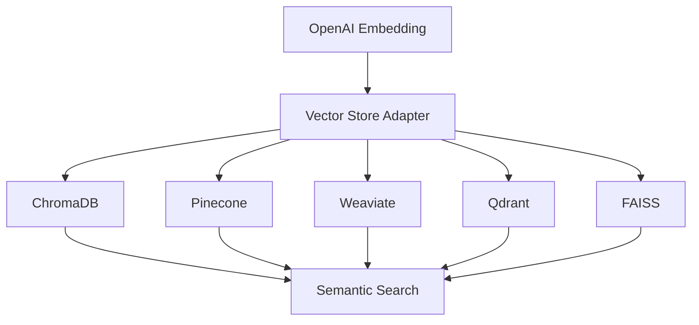

# OpenAI Embeddings

<cite>
**Referenced Files in This Document**
- [mem0/embeddings/openai.py](file://mem0/embeddings/openai.py)
- [mem0/configs/embeddings/base.py](file://mem0/configs/embeddings/base.py)
- [mem0/embeddings/base.py](file://mem0/embeddings/base.py)
- [tests/embeddings/test_openai_embeddings.py](file://tests/embeddings/test_openai_embeddings.py)
- [mem0-ts/src/oss/src/embeddings/openai.ts](file://mem0-ts/src/oss/src/embeddings/openai.ts)
- [embedchain/embedchain/embedder/openai.py](file://embedchain/embedchain/embedder/openai.py)
- [embedchain/embedchain/models/vector_dimensions.py](file://embedchain/embedchain/models/vector_dimensions.py)
- [embedchain/examples/rest-api/utils.py](file://embedchain/examples/rest-api/utils.py)
- [embedchain/tests/llm/test_openai.py](file://embedchain/tests/llm/test_openai.py)
- [embedchain/embedchain/config/model_prices_and_context_window.json](file://embedchain/embedchain/config/model_prices_and_context_window.json)
- [litellm_github_copilot_embedding_3_small.py](file://litellm_github_copilot_embedding_3_small.py)
</cite>

## Table of Contents
1. [Introduction](#introduction)
2. [Architecture Overview](#architecture-overview)
3. [Configuration](#configuration)
4. [Initialization and Usage](#initialization-and-usage)
5. [Model Specifications](#model-specifications)
6. [Authentication](#authentication)
7. [Performance Characteristics](#performance-characteristics)
8. [Cost Implications](#cost-implications)
9. [Vector Database Compatibility](#vector-database-compatibility)
10. [Error Handling and Troubleshooting](#error-handling-and-troubleshooting)
11. [Advanced Usage Patterns](#advanced-usage-patterns)
12. [Best Practices](#best-practices)

## Introduction

The OpenAI embedding integration in Mem0 provides seamless access to OpenAI's state-of-the-art embedding models, enabling sophisticated semantic understanding and similarity search capabilities. This integration supports multiple OpenAI embedding models including text-embedding-3-small and text-embedding-3-large, with customizable dimensions and comprehensive error handling.

The OpenAI embedding system in Mem0 is built on a robust architecture that handles authentication, rate limiting, dimension customization, and vector database compatibility while maintaining high performance and reliability standards.

## Architecture Overview

The OpenAI embedding integration follows a layered architecture pattern that separates concerns and provides flexibility for different use cases.



**Diagram sources**
- [mem0/embeddings/openai.py](file://mem0/embeddings/openai.py#L11-L50)
- [mem0/configs/embeddings/base.py](file://mem0/configs/embeddings/base.py#L10-L111)
- [mem0/embeddings/base.py](file://mem0/embeddings/base.py#L7-L32)

**Section sources**
- [mem0/embeddings/openai.py](file://mem0/embeddings/openai.py#L1-L50)
- [mem0/configs/embeddings/base.py](file://mem0/configs/embeddings/base.py#L1-L111)

## Configuration

### Basic Configuration

The OpenAI embedding configuration supports multiple initialization approaches with flexible parameter options:



**Diagram sources**
- [mem0/embeddings/openai.py](file://mem0/embeddings/openai.py#L12-L32)
- [mem0/configs/embeddings/base.py](file://mem0/configs/embeddings/base.py#L16-L81)

### Configuration Parameters

| Parameter | Type | Description | Default Value |
|-----------|------|-------------|---------------|
| `model` | `Optional[str]` | OpenAI embedding model name | `"text-embedding-3-small"` |
| `api_key` | `Optional[str]` | OpenAI API authentication key | `None` |
| `embedding_dims` | `Optional[int]` | Desired embedding vector dimensions | `1536` |
| `openai_base_url` | `Optional[str]` | Custom OpenAI API endpoint URL | `"https://api.openai.com/v1"` |

**Section sources**
- [mem0/configs/embeddings/base.py](file://mem0/configs/embeddings/base.py#L16-L81)
- [mem0/embeddings/openai.py](file://mem0/embeddings/openai.py#L15-L16)

## Initialization and Usage

### Basic Initialization

The OpenAI embedding class provides multiple initialization patterns to accommodate different deployment scenarios:



**Diagram sources**
- [mem0/embeddings/openai.py](file://mem0/embeddings/openai.py#L12-L49)
- [tests/embeddings/test_openai_embeddings.py](file://tests/embeddings/test_openai_embeddings.py#L17-L91)

### Code Examples

#### Standard Configuration
[Code snippet path](file://mem0/embeddings/openai.py#L12-L32)

#### Environment Variable Configuration
[Code snippet path](file://tests/embeddings/test_openai_embeddings.py#L77-L90)

#### Custom Model and Dimensions
[Code snippet path](file://tests/embeddings/test_openai_embeddings.py#L32-L44)

**Section sources**
- [mem0/embeddings/openai.py](file://mem0/embeddings/openai.py#L12-L49)
- [tests/embeddings/test_openai_embeddings.py](file://tests/embeddings/test_openai_embeddings.py#L17-L91)

## Model Specifications

### Supported Models

OpenAI offers several embedding models with different capabilities and performance characteristics:

| Model | Dimensions | Max Tokens | Cost per 1K Tokens | Use Case |
|-------|------------|------------|-------------------|----------|
| `text-embedding-3-small` | 1536 | 8191 | $0.00002 | General purpose, cost-effective |
| `text-embedding-3-large` | 3072 | 8191 | $0.00013 | High precision requirements |
| `text-embedding-ada-002` | 1536 | 8191 | $0.0001 | Legacy model, backward compatibility |

### Dimension Customization

The embedding system supports dynamic dimension customization for optimal performance:



**Diagram sources**
- [mem0/embeddings/openai.py](file://mem0/embeddings/openai.py#L44-L49)
- [embedchain/embedchain/models/vector_dimensions.py](file://embedchain/embedchain/models/vector_dimensions.py#L5-L16)

**Section sources**
- [embedchain/embedchain/config/model_prices_and_context_window.json](file://embedchain/embedchain/config/model_prices_and_context_window.json#L153-L166)
- [embedchain/embedchain/models/vector_dimensions.py](file://embedchain/embedchain/models/vector_dimensions.py#L5-L16)

## Authentication

### Authentication Methods

The OpenAI embedding system supports multiple authentication approaches for flexibility:

#### 1. Environment Variables
```bash
export OPENAI_API_KEY="your-api-key-here"
export OPENAI_BASE_URL="https://api.openai.com/v1"  # Optional
```

#### 2. Direct Parameter Passing
[Code snippet path](file://tests/embeddings/test_openai_embeddings.py#L62-L76)

#### 3. Base URL Configuration
[Code snippet path](file://mem0/embeddings/openai.py#L18-L24)

### Authentication Flow



**Diagram sources**
- [mem0/embeddings/openai.py](file://mem0/embeddings/openai.py#L18-L32)

**Section sources**
- [mem0/embeddings/openai.py](file://mem0/embeddings/openai.py#L18-L32)
- [tests/embeddings/test_openai_embeddings.py](file://tests/embeddings/test_openai_embeddings.py#L62-L90)

## Performance Characteristics

### Latency Expectations

OpenAI embedding generation follows predictable performance patterns:

- **Average Latency**: 50-200ms per embedding request
- **Batch Processing**: Significant throughput improvement for multiple texts
- **Network Overhead**: Minimal impact (<10ms) for typical requests

### Throughput Optimization

The embedding system supports efficient batch processing:



### Memory Management

The system implements efficient memory usage patterns:

- **Text Preprocessing**: Automatic newline removal for consistency
- **Response Handling**: Direct vector extraction without intermediate storage
- **Connection Pooling**: Reuse of OpenAI client connections

**Section sources**
- [mem0/embeddings/openai.py](file://mem0/embeddings/openai.py#L44-L49)

## Cost Implications

### Pricing Structure

Understanding OpenAI embedding costs is crucial for budget planning:

| Model | Input Cost per 1K Tokens | Output Cost per 1K Tokens | Recommended Use Case |
|-------|-------------------------|--------------------------|---------------------|
| `text-embedding-3-small` | $0.00002 | $0.00000 | Production applications |
| `text-embedding-3-large` | $0.00013 | $0.00000 | High-precision requirements |
| `text-embedding-ada-002` | $0.0001 | $0.00000 | Legacy compatibility |

### Cost Optimization Strategies



**Diagram sources**
- [embedchain/embedchain/config/model_prices_and_context_window.json](file://embedchain/embedchain/config/model_prices_and_context_window.json#L153-L166)

### Usage Monitoring

Track embedding usage for cost control:

- **Token Counting**: Monitor input token usage
- **Rate Limiting**: Implement request throttling
- **Budget Alerts**: Set up cost monitoring

**Section sources**
- [embedchain/embedchain/config/model_prices_and_context_window.json](file://embedchain/embedchain/config/model_prices_and_context_window.json#L153-L166)

## Vector Database Compatibility

### Dimension Matching Requirements

Different vector databases have specific dimension requirements:

| Vector Database | Supported Dimensions | Notes |
|----------------|---------------------|-------|
| Chroma | 1536, 3072 | Flexible dimension support |
| Pinecone | 1536, 3072 | Requires exact dimension match |
| Weaviate | 1536, 3072 | Configurable dimension |
| Qdrant | 1536, 3072 | Dynamic dimension support |
| FAISS | Custom | Supports any dimension |

### Dimension Mismatch Handling



**Diagram sources**
- [mem0-ts/src/oss/src/vector_stores/memory.ts](file://mem0-ts/src/oss/src/vector_stores/memory.ts#L96-L100)

### Best Practices for Compatibility

1. **Consistent Dimensions**: Use the same dimensions across your stack
2. **Validation**: Implement dimension checking before storage
3. **Migration**: Plan for dimension changes during system upgrades
4. **Documentation**: Maintain clear dimension specifications

**Section sources**
- [embedchain/embedchain/models/vector_dimensions.py](file://embedchain/embedchain/models/vector_dimensions.py#L5-L16)
- [mem0-ts/src/oss/src/vector_stores/memory.ts](file://mem0-ts/src/oss/src/vector_stores/memory.ts#L96-L100)

## Error Handling and Troubleshooting

### Common Issues and Solutions

#### 1. Invalid API Key
**Symptoms**: Authentication errors, 401 Unauthorized responses
**Solution**: Verify API key configuration and permissions

#### 2. Rate Limit Exceeded
**Symptoms**: 429 Too Many Requests responses
**Solution**: Implement exponential backoff and request throttling

#### 3. Quota Exceeded
**Symptoms**: 400 Bad Request with quota-related messages
**Solution**: Monitor usage and upgrade subscription if needed

#### 4. Network Connectivity
**Symptoms**: Connection timeouts, network errors
**Solution**: Implement retry logic with appropriate delays

### Error Handling Implementation



**Diagram sources**
- [embedchain/examples/rest-api/utils.py](file://embedchain/examples/rest-api/utils.py#L1-L22)

### Troubleshooting Guide

#### API Key Issues
1. Verify environment variable is set correctly
2. Check API key permissions and validity
3. Ensure proper key format (sk- prefix)

#### Model Configuration Problems
1. Confirm model name spelling
2. Verify model availability in your region
3. Check dimension compatibility

#### Network and Connectivity
1. Test internet connectivity
2. Verify firewall settings
3. Check proxy configurations

**Section sources**
- [embedchain/examples/rest-api/utils.py](file://embedchain/examples/rest-api/utils.py#L1-L22)
- [tests/embeddings/test_openai_embeddings.py](file://tests/embeddings/test_openai_embeddings.py#L1-L91)

## Advanced Usage Patterns

### Batch Processing

Efficiently process multiple texts using batch operations:

[Code snippet path](file://mem0-ts/src/oss/src/embeddings/openai.ts#L22-L28)

### Custom Memory Actions

The embedding system supports different memory actions with specialized handling:

- **Add**: Optimize for new memory creation
- **Search**: Balanced for retrieval operations  
- **Update**: Efficient for memory modifications

### Integration with Vector Stores

Seamless integration with various vector database backends:



**Diagram sources**
- [embedchain/embedchain/embedder/openai.py](file://embedchain/embedchain/embedder/openai.py#L35-L43)

**Section sources**
- [mem0-ts/src/oss/src/embeddings/openai.ts](file://mem0-ts/src/oss/src/embeddings/openai.ts#L22-L28)
- [embedchain/embedchain/embedder/openai.py](file://embedchain/embedchain/embedder/openai.py#L35-L43)

## Best Practices

### Security Considerations

1. **API Key Management**: Use environment variables, never hardcode keys
2. **Access Control**: Implement proper authentication and authorization
3. **Audit Logging**: Monitor embedding usage for security compliance
4. **Key Rotation**: Regularly rotate API keys

### Performance Optimization

1. **Connection Reuse**: Maintain persistent client connections
2. **Batch Processing**: Combine multiple requests when possible
3. **Caching**: Implement embedding caching for repeated queries
4. **Async Operations**: Use asynchronous processing for high-throughput applications

### Monitoring and Maintenance

1. **Usage Tracking**: Monitor token consumption and costs
2. **Error Rates**: Track and analyze failure patterns
3. **Performance Metrics**: Measure latency and throughput
4. **Capacity Planning**: Plan for growth and scaling needs

### Development Guidelines

1. **Configuration Management**: Use structured configuration files
2. **Error Handling**: Implement comprehensive error catching
3. **Testing**: Create unit tests for embedding functionality
4. **Documentation**: Maintain clear usage documentation

**Section sources**
- [mem0/embeddings/openai.py](file://mem0/embeddings/openai.py#L1-L50)
- [tests/embeddings/test_openai_embeddings.py](file://tests/embeddings/test_openai_embeddings.py#L1-L91)