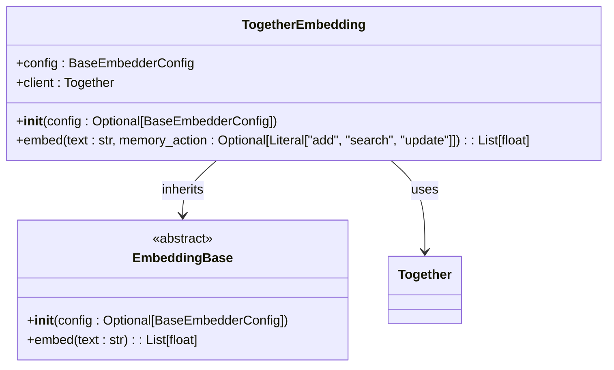
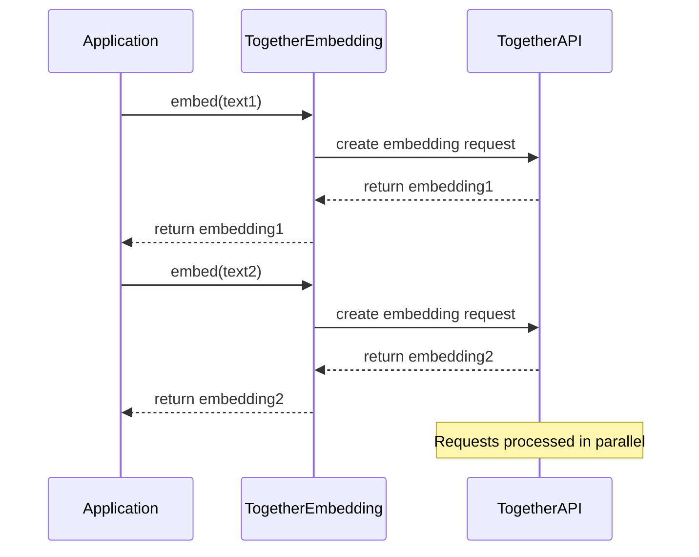
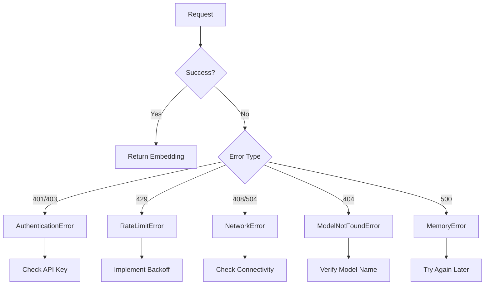

# Together AI Embeddings

<cite>
**Referenced Files in This Document**   
- [together.py](file://mem0/embeddings/together.py)
- [together.yaml](file://embedchain/configs/together.yaml)
- [together.ipynb](file://embedchain/notebooks/together.ipynb)
- [vector_dimensions.py](file://embedchain/embedchain/models/vector_dimensions.py)
- [base.py](file://mem0/configs/embeddings/base.py)
- [exceptions.py](file://mem0/exceptions.py)
- [utils.py](file://mem0/client/utils.py)
</cite>

## Table of Contents
1. [Introduction](#introduction)
2. [Configuration and Initialization](#configuration-and-initialization)
3. [Model Selection and Advantages](#model-selection-and-advantages)
4. [Batch Request Handling](#batch-request-handling)
5. [Performance Considerations](#performance-considerations)
6. [Error Handling and Common Issues](#error-handling-and-common-issues)
7. [Optimal Model Selection Guidance](#optimal-model-selection-guidance)
8. [Conclusion](#conclusion)

## Introduction
This document provides comprehensive guidance on integrating Together AI embedding models into applications. It covers configuration, initialization, performance optimization, and troubleshooting for the TogetherEmbedding class. The documentation focuses on using open-source models hosted on Together's infrastructure, particularly the default model togethercomputer/m2-bert-80M-8k-retrieval, and explains how to leverage these models for efficient text embedding generation.

## Configuration and Initialization
The TogetherEmbedding class is configured through the BaseEmbedderConfig object, which allows setting the API key, model identifier, and embedding dimensions. The implementation automatically falls back to environment variables when explicit configuration is not provided.

Initialization follows a standard pattern where the API key can be provided either through the configuration object or via the TOGETHER_API_KEY environment variable. The default model is set to "togethercomputer/m2-bert-80M-8k-retrieval" if no alternative is specified in the configuration. The embedding dimensions are configured to 768 by default, which aligns with the output dimensionality of the default BERT-based model.

**Diagram sources**
- [together.py](file://mem0/embeddings/together.py#L10-L31)

**Section sources**
- [together.py](file://mem0/embeddings/together.py#L10-L31)
- [base.py](file://mem0/configs/embeddings/base.py#L77-L110)

## Model Selection and Advantages
Together AI offers several advantages for embedding model deployment, particularly through its infrastructure hosting of open-source models. The primary benefits include cost efficiency, customization options, and access to specialized models optimized for specific tasks like retrieval.

The default model, togethercomputer/m2-bert-80M-8k-retrieval, is specifically designed for retrieval tasks with an 8k token context window, making it suitable for processing long documents or complex queries. This model represents a balance between computational efficiency and embedding quality, with a 768-dimensional output space that provides sufficient representational capacity while maintaining reasonable storage and computation requirements.

Other models available through Together AI offer different trade-offs between speed, accuracy, and resource requirements. The infrastructure provides GPU acceleration by default, ensuring low-latency responses even for computationally intensive models. Users can customize their deployment by selecting from various model architectures and sizes based on their specific use case requirements.

**Section sources**
- [together.py](file://mem0/embeddings/together.py#L14-L17)
- [together.yaml](file://embedchain/configs/together.yaml#L1-L7)

## Batch Request Handling
While the current implementation of TogetherEmbedding provides a single-text embedding interface through the embed() method, batch processing can be achieved through application-level parallelization. The underlying Together client library supports batch operations, but this functionality is not directly exposed in the current wrapper implementation.

For efficient batch processing, applications should implement concurrent requests to the embedding service, taking advantage of Together AI's ability to handle multiple requests in parallel. This approach maximizes throughput and reduces overall processing time compared to sequential processing of individual texts.

The framework's design follows the Embedder interface pattern seen in other implementations, which typically include both embed() and embedBatch() methods. Although the embedBatch() method is not currently implemented in the TogetherEmbedding class, the interface design suggests that batch functionality could be added in future versions to provide more efficient bulk processing capabilities.

**Diagram sources**
- [together.py](file://mem0/embeddings/together.py#L20-L31)
- [base.ts](file://mem0-ts/src/oss/src/embeddings/base.ts#L1-L4)

**Section sources**
- [together.py](file://mem0/embeddings/together.py#L20-L31)
- [openai.ts](file://mem0-ts/src/oss/src/embeddings/openai.ts#L22-L28)
- [google.ts](file://mem0-ts/src/oss/src/embeddings/google.ts#L23-L30)

## Performance Considerations
Performance optimization for Together AI embeddings involves several key factors: GPU acceleration, request queuing, and model warm-up times. The infrastructure automatically provides GPU acceleration, which significantly reduces inference latency compared to CPU-based processing.

Request queuing is managed by the Together AI platform, which handles incoming requests efficiently even under high load conditions. However, applications should implement appropriate rate limiting and retry logic to avoid overwhelming the service and to handle temporary capacity constraints.

Model warm-up times are typically minimal since the models are hosted on dedicated infrastructure and remain loaded in memory. However, cold starts may occur after periods of inactivity, resulting in slightly increased latency for the first few requests. Applications with strict latency requirements should consider implementing periodic "keep-alive" requests to maintain model readiness.

The 768-dimensional embedding vectors produced by the default model strike a balance between representational richness and computational efficiency. Higher-dimensional models may provide better semantic separation but at the cost of increased storage requirements and slower similarity computations in downstream applications.

**Section sources**
- [together.py](file://mem0/embeddings/together.py#L17-L18)
- [vector_dimensions.py](file://embedchain/embedchain/models/vector_dimensions.py#L1-L16)

## Error Handling and Common Issues
The integration includes comprehensive error handling for common issues that may arise during embedding generation. The most frequent problems include model loading failures, API rate limiting, and network timeouts.

Model loading failures typically occur when an invalid model identifier is specified or when the requested model is not available on the Together AI platform. These errors are usually returned as HTTP 404 or 400 responses and can be resolved by verifying the model name against the available catalog.

API rate limiting is indicated by HTTP 429 responses, which include Retry-After headers specifying when additional requests can be made. The client automatically captures rate limit information and provides appropriate debug details to facilitate implementation of exponential backoff strategies.

Network timeouts and connectivity issues are handled through structured exception hierarchies that distinguish between different types of network problems. Timeout exceptions (HTTP 408) suggest connectivity problems or server overload, while connection errors indicate issues with establishing a connection to the service.

**Diagram sources**
- [exceptions.py](file://mem0/exceptions.py#L422-L503)
- [utils.py](file://mem0/client/utils.py#L45-L115)

**Section sources**
- [exceptions.py](file://mem0/exceptions.py#L422-L503)
- [utils.py](file://mem0/client/utils.py#L45-L115)
- [together.py](file://mem0/embeddings/together.py#L28-L30)

## Optimal Model Selection Guidance
Selecting the optimal model from Together's catalog requires balancing embedding quality, processing speed, and cost considerations. For general-purpose applications, the default togethercomputer/m2-bert-80M-8k-retrieval model provides an excellent starting point with its 768-dimensional output and 8k token context window.

Applications requiring higher precision in semantic similarity may benefit from larger models with higher-dimensional outputs, though this comes at increased computational cost. Conversely, latency-sensitive applications might prefer smaller models that provide faster response times with acceptable accuracy trade-offs.

The model selection should also consider the nature of the input data. For technical or domain-specific content, specialized models fine-tuned on relevant corpora may outperform general-purpose models. The 8k context window of the default model makes it particularly suitable for processing long documents, code files, or detailed product descriptions.

When evaluating models, consider both the embedding generation latency and the quality of downstream tasks such as retrieval accuracy or clustering effectiveness. A model that produces slightly slower embeddings but significantly improves application-level performance may represent a better overall choice.

**Section sources**
- [together.py](file://mem0/embeddings/together.py#L14-L17)
- [vector_dimensions.py](file://embedchain/embedchain/models/vector_dimensions.py#L1-L16)
- [together.yaml](file://embedchain/configs/together.yaml#L1-L7)

## Conclusion
The Together AI embedding integration provides a robust solution for generating high-quality text embeddings with the flexibility of open-source models hosted on scalable infrastructure. By understanding the configuration options, performance characteristics, and error handling mechanisms, developers can effectively leverage these capabilities in their applications. The default configuration offers a solid foundation, while the ability to customize model selection and parameters allows for optimization based on specific use case requirements.