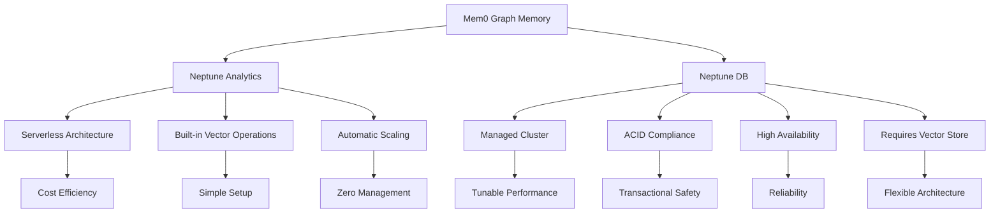
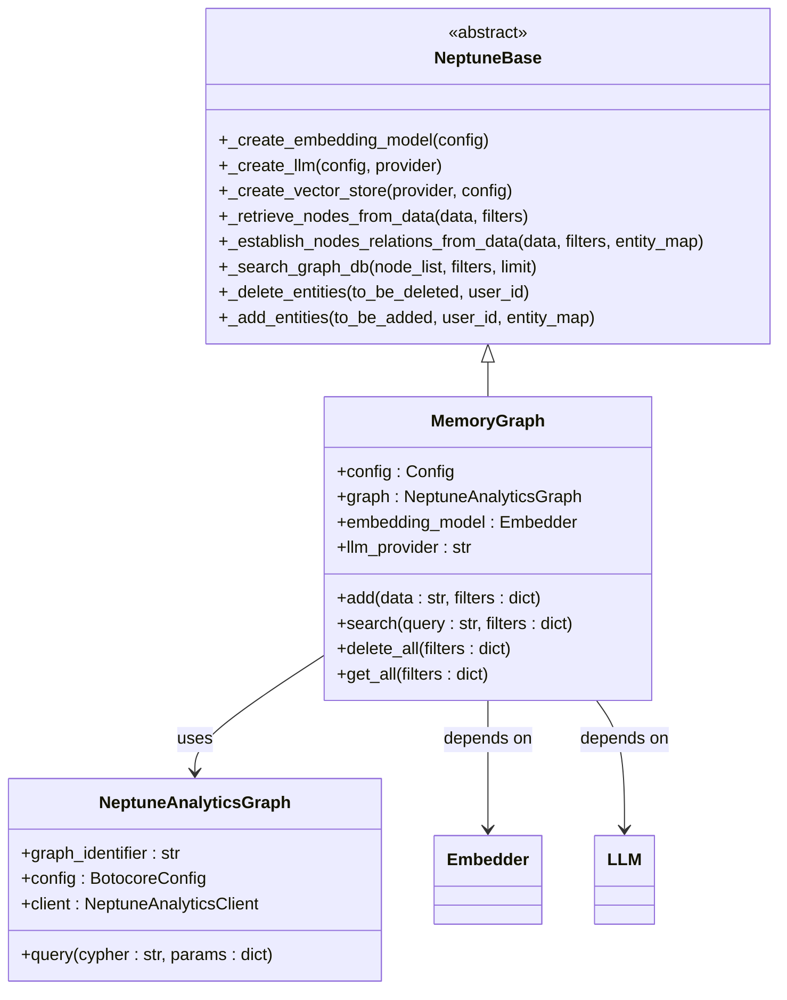
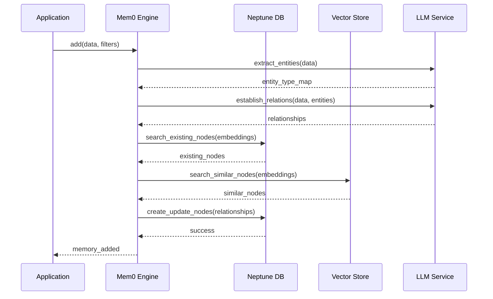
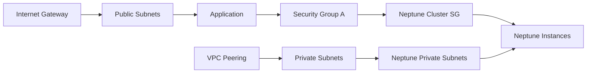
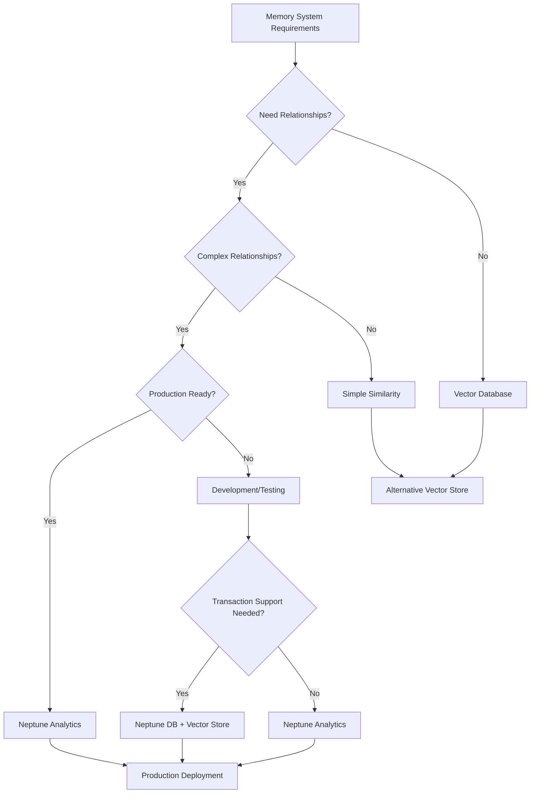

# Graph Stores

<cite>
**Referenced Files in This Document**
- [mem0/graphs/neptune/base.py](file://mem0/graphs/neptune/base.py)
- [mem0/graphs/neptune/neptunedb.py](file://mem0/graphs/neptune/neptunedb.py)
- [mem0/graphs/neptune/neptunegraph.py](file://mem0/graphs/neptune/neptunegraph.py)
- [mem0/configs/vector_stores/neptune.py](file://mem0/configs/vector_stores/neptune.py)
- [mem0/memory/graph_memory.py](file://mem0/memory/graph_memory.py)
- [mem0/graphs/utils.py](file://mem0/graphs/utils.py)
- [mem0/graphs/tools.py](file://mem0/graphs/tools.py)
- [examples/graph-db-demo/neptune-example.ipynb](file://examples/graph-db-demo/neptune-example.ipynb)
- [examples/graph-db-demo/neptune-db-example.ipynb](file://examples/graph-db-demo/neptune-db-example.ipynb)
- [mem0/configs/graphs/configs.py](file://mem0/configs/graphs/configs.py)
- [mem0/exceptions.py](file://mem0/exceptions.py)
</cite>

## Table of Contents
1. [Introduction](#introduction)
2. [Supported Graph Store Providers](#supported-graph-store-providers)
3. [Neptune Analytics Integration](#neptune-analytics-integration)
4. [Neptune DB Integration](#neptune-db-integration)
5. [Configuration Parameters](#configuration-parameters)
6. [Authentication Methods](#authentication-methods)
7. [Endpoint Setup](#endpoint-setup)
8. [Query Patterns](#query-patterns)
9. [Code Examples](#code-examples)
10. [Use Cases](#use-cases)
11. [Performance Optimization](#performance-optimization)
12. [Common Issues and Troubleshooting](#common-issues-and-troubleshooting)
13. [Graph vs Vector Database Comparison](#graph-vs-vector-database-comparison)
14. [Best Practices](#best-practices)

## Introduction

Mem0 provides comprehensive support for graph-based memory storage through multiple AWS Neptune variants, enabling sophisticated relationship-based memory management. The graph store architecture allows for semantic understanding of user interactions, enabling contextual awareness and relationship traversal patterns that traditional vector databases cannot achieve.

Graph stores in Mem0 serve as the foundation for intelligent memory systems that can understand and maintain complex relationships between entities, making them ideal for applications requiring deep semantic understanding and contextual recall.

## Supported Graph Store Providers

Mem0 supports two primary AWS Neptune variants for graph memory storage:

### Neptune Analytics
- **Purpose**: Serverless graph analytics engine
- **Use Case**: Production-ready analytics with built-in vector operations
- **Features**: Automatic scaling, serverless architecture, vector similarity search
- **Integration**: Native OpenCypher support with vector operations

### Neptune DB
- **Purpose**: Managed graph database cluster
- **Use Case**: High-performance transactional workloads
- **Features**: ACID compliance, high availability, customizable clusters
- **Integration**: Requires separate vector store for embeddings

### Provider Comparison



**Diagram sources**
- [mem0/graphs/neptune/base.py](file://mem0/graphs/neptune/base.py#L25-L498)
- [mem0/graphs/neptune/neptunegraph.py](file://mem0/graphs/neptune/neptunegraph.py#L14-L475)
- [mem0/graphs/neptune/neptunedb.py](file://mem0/graphs/neptune/neptunedb.py#L15-L512)

## Neptune Analytics Integration

Neptune Analytics provides a serverless graph analytics engine that seamlessly integrates with Mem0's memory system. This variant is ideal for production deployments requiring minimal operational overhead.

### Architecture Overview



**Diagram sources**
- [mem0/graphs/neptune/base.py](file://mem0/graphs/neptune/base.py#L25-L498)
- [mem0/graphs/neptune/neptunegraph.py](file://mem0/graphs/neptune/neptunegraph.py#L14-L475)

### Key Features

- **Serverless Operation**: Automatic scaling without capacity planning
- **Built-in Vector Operations**: Native support for vector similarity search
- **OpenCypher Compatibility**: Standard graph query language support
- **AWS Integration**: Seamless IAM authentication and VPC configuration

**Section sources**
- [mem0/graphs/neptune/neptunegraph.py](file://mem0/graphs/neptune/neptunegraph.py#L14-L475)
- [mem0/configs/vector_stores/neptune.py](file://mem0/configs/vector_stores/neptune.py#L11-L28)

## Neptune DB Integration

Neptune DB offers a managed graph database cluster suitable for high-performance transactional workloads and complex graph operations.

### Architecture Pattern



**Diagram sources**
- [mem0/graphs/neptune/neptunedb.py](file://mem0/graphs/neptune/neptunedb.py#L15-L512)
- [mem0/memory/graph_memory.py](file://mem0/memory/graph_memory.py#L75-L92)

### Requirements

- **Separate Vector Store**: Neptune DB doesn't store vectors internally
- **Compatible Vector Dimensions**: Embedding model dimensions must match vector store configuration
- **Network Connectivity**: Proper VPC and security group configuration

**Section sources**
- [mem0/graphs/neptune/neptunedb.py](file://mem0/graphs/neptune/neptunedb.py#L15-L512)
- [examples/graph-db-demo/neptune-db-example.ipynb](file://examples/graph-db-demo/neptune-db-example.ipynb#L1-L460)

## Configuration Parameters

### Neptune Analytics Configuration

| Parameter | Type | Description | Default |
|-----------|------|-------------|---------|
| `collection_name` | string | Collection name for vector storage | "mem0" |
| `endpoint` | string | Graph identifier in format `neptune-graph://<graphid>` | Required |

### Neptune DB Configuration

| Parameter | Type | Description | Default |
|-----------|------|-------------|---------|
| `endpoint` | string | Host endpoint in format `neptune-db://<host>` | Required |
| `collection_name` | string | Vector store collection name | Optional |
| `base_label` | boolean | Use `__Entity__` as base node label | false |

### Common Configuration Options

| Parameter | Type | Description | Environment Variable |
|-----------|------|-------------|---------------------|
| `app_id` | string | Application identifier for AWS SDK | `NEPTUNE_APP_ID` |
| `base_label` | boolean | Enable base entity labeling | `NEPTUNE_BASE_LABEL` |
| `llm.provider` | string | LLM provider for graph operations | `LLM_PROVIDER` |
| `llm.config` | dict | LLM configuration parameters | N/A |

**Section sources**
- [mem0/configs/vector_stores/neptune.py](file://mem0/configs/vector_stores/neptune.py#L11-L28)
- [mem0/configs/graphs/configs.py](file://mem0/configs/graphs/configs.py#L44-L73)

## Authentication Methods

### IAM Roles and Permissions

Mem0 supports multiple authentication methods for Neptune integration:

#### 1. IAM Role Authentication (Recommended)

```python
# AWS IAM Role Configuration
config = {
    "graph_store": {
        "provider": "neptune",
        "config": {
            "endpoint": "neptune-graph://your-graph-id",
            "app_id": "Mem0Application"
        }
    },
    "llm": {
        "provider": "aws_bedrock",
        "config": {
            "model": "anthropic.claude-3-sonnet-20240229-v1:0"
        }
    }
}
```

#### 2. AWS Credentials

```python
# Using explicit AWS credentials
config = {
    "graph_store": {
        "provider": "neptune",
        "config": {
            "endpoint": "neptune-graph://your-graph-id",
            "app_id": "Mem0Application"
        }
    },
    "llm": {
        "provider": "aws_bedrock",
        "config": {
            "model": "anthropic.claude-3-sonnet-20240229-v1:0",
            "aws_access_key_id": "YOUR_ACCESS_KEY",
            "aws_secret_access_key": "YOUR_SECRET_KEY",
            "aws_region": "us-west-2"
        }
    }
}
```

### IAM Policy Requirements

For Neptune Analytics:
```json
{
    "Version": "2012-10-17",
    "Statement": [
        {
            "Effect": "Allow",
            "Action": [
                "neptune-graph:GetGraphMetadata",
                "neptune-graph:ExecuteOpenCypherQuery",
                "neptune-graph:ResetGraph"
            ],
            "Resource": "arn:aws:neptune-graph:*:*:graph/*"
        }
    ]
}
```

For Neptune DB:
```json
{
    "Version": "2012-10-17",
    "Statement": [
        {
            "Effect": "Allow",
            "Action": [
                "neptune-db:Connect",
                "neptune-db:DescribeDBClusters",
                "neptune-db:DescribeDBInstances"
            ],
            "Resource": "*"
        }
    ]
}
```

**Section sources**
- [mem0/configs/llms/aws_bedrock.py](file://mem0/configs/llms/aws_bedrock.py#L90-L109)
- [mem0/llms/aws_bedrock.py](file://mem0/llms/aws_bedrock.py#L75-L106)

## Endpoint Setup

### Neptune Analytics Endpoint Format

```python
# Correct endpoint format for Neptune Analytics
endpoint = "neptune-graph://g-1234567890abcdef"
```

### Neptune DB Endpoint Format

```python
# Correct endpoint format for Neptune DB
endpoint = "neptune-db://your-cluster-endpoint.cluster-123456789012.us-west-2.neptune.amazonaws.com"
```

### VPC Configuration

#### Security Group Configuration



#### Network Access Patterns

1. **Direct VPC Access**: Applications in the same VPC
2. **VPC Peering**: Cross-VPC communication
3. **PrivateLink**: Secure private access
4. **VPN/TGW**: Site-to-site connectivity

**Section sources**
- [mem0/configs/graphs/configs.py](file://mem0/configs/graphs/configs.py#L59-L73)
- [examples/graph-db-demo/neptune-example.ipynb](file://examples/graph-db-demo/neptune-example.ipynb#L129-L158)

## Query Patterns

### Entity Extraction Queries

```cypher
// Extract entities from text
MATCH (n {user_id: $user_id})
WHERE n.embedding IS NOT NULL
WITH n, 
     round(2 * vector.similarity.cosine(n.embedding, $embedding) - 1, 4) AS similarity
WHERE similarity >= $threshold
RETURN n.name AS entity, similarity
ORDER BY similarity DESC
LIMIT 1
```

### Relationship Establishment Queries

```cypher
// Establish relationships between entities
MERGE (source {name: $source, user_id: $user_id})
ON CREATE SET source.created = timestamp(),
              source.mentions = 1
ON MATCH SET source.mentions = source.mentions + 1

MERGE (destination {name: $destination, user_id: $destination_type})
ON CREATE SET destination.created = timestamp(),
              destination.mentions = 1

MERGE (source)-[r:$relationship]->(destination)
ON CREATE SET r.created = timestamp(),
              r.mentions = 1
ON MATCH SET r.mentions = r.mentions + 1
RETURN source.name, type(r), destination.name
```

### Vector Similarity Search

```cypher
// Vector similarity search with ranking
CALL neptune.algo.vectors.distanceByEmbedding(
    $embedding,
    node,
    {metric: "CosineSimilarity"}
) YIELD distance
WITH node, distance AS similarity
WHERE similarity >= $threshold
CALL {
    WITH node
    MATCH (node)-[r]->(other)
    RETURN node.name AS source, type(r) AS relationship, other.name AS target
    UNION ALL
    WITH node
    MATCH (other)-[r]->(node)
    RETURN other.name AS source, type(r) AS relationship, node.name AS target
}
WITH DISTINCT source, relationship, target, similarity
RETURN source, relationship, target, similarity
ORDER BY similarity DESC
LIMIT $limit
```

**Section sources**
- [mem0/graphs/neptune/neptunegraph.py](file://mem0/graphs/neptune/neptunegraph.py#L334-L474)
- [mem0/graphs/neptune/neptunedb.py](file://mem0/graphs/neptune/neptunedb.py#L370-L511)

## Code Examples

### Basic Neptune Analytics Configuration

```python
from mem0 import Memory

# Configure for Neptune Analytics
config = {
    "embedder": {
        "provider": "aws_bedrock",
        "config": {
            "model": "amazon.titan-embed-text-v2:0",
            "embedding_dims": 1024
        }
    },
    "llm": {
        "provider": "aws_bedrock",
        "config": {
            "model": "anthropic.claude-3-sonnet-20240229-v1:0",
            "temperature": 0.1,
            "max_tokens": 2000
        }
    },
    "vector_store": {
        "provider": "neptune",
        "config": {
            "endpoint": "neptune-graph://your-graph-identifier"
        }
    },
    "graph_store": {
        "provider": "neptune",
        "config": {
            "endpoint": "neptune-graph://your-graph-identifier"
        }
    }
}

# Initialize memory
m = Memory.from_config(config_dict=config)
```

### Neptune DB with Separate Vector Store

```python
import boto3
from opensearchpy import RequestsHttpConnection, AWSV4SignerAuth

# Configure AWS credentials
credentials = boto3.Session().get_credentials()
region = "us-west-2"
auth = AWSV4SignerAuth(credentials, region)

# Neptune DB configuration
config = {
    "embedder": {
        "provider": "aws_bedrock",
        "config": {
            "model": "amazon.titan-embed-text-v2:0"
        }
    },
    "llm": {
        "provider": "aws_bedrock",
        "config": {
            "model": "anthropic.claude-3-sonnet-20240229-v1:0"
        }
    },
    "vector_store": {
        "provider": "opensearch",
        "config": {
            "collection_name": "mem0ai_text_summaries",
            "host": "your-opensearch-domain.us-west-2.es.amazonaws.com",
            "port": 443,
            "http_auth": auth,
            "use_ssl": True,
            "verify_certs": True,
            "connection_class": RequestsHttpConnection
        }
    },
    "graph_store": {
        "provider": "neptunedb",
        "config": {
            "endpoint": "neptune-db://your-neptune-host",
            "collection_name": "mem0ai_neptune_entities"
        }
    }
}
```

### Environment Variables Configuration

```bash
# AWS Configuration
export AWS_ACCESS_KEY_ID=your_access_key
export AWS_SECRET_ACCESS_KEY=your_secret_key
export AWS_DEFAULT_REGION=us-west-2

# Neptune Configuration
export NEPTUNE_ENDPOINT=neptune-graph://your-graph-id
export NEPTUNE_APP_ID=Mem0Application

# Memory Configuration
export LLM_PROVIDER=aws_bedrock
export EMBEDDER_PROVIDER=aws_bedrock
```

**Section sources**
- [examples/graph-db-demo/neptune-example.ipynb](file://examples/graph-db-demo/neptune-example.ipynb#L129-L158)
- [examples/graph-db-demo/neptune-db-example.ipynb](file://examples/graph-db-demo/neptune-db-example.ipynb#L130-L178)

## Use Cases

### 1. Knowledge Graph Construction

```python
# Example: Building a professional knowledge graph
messages = [
    {"role": "user", "content": "My name is John and I work as a software engineer at Acme Corp."},
    {"role": "assistant", "content": "Got it, John works as a software engineer at Acme Corp."},
    {"role": "user", "content": "I specialize in Python development and cloud architecture."},
    {"role": "assistant", "content": "Noted that John specializes in Python and cloud architecture."}
]

# Store knowledge graph
m.add(messages, user_id="john_doe")

# Query relationships
results = m.search("What does John work on?", user_id="john_doe")
# Returns: [{"source": "John", "relationship": "works_as", "destination": "software_engineer"}]
```

### 2. Relationship Traversal

```python
# Example: Finding connections between people
messages = [
    {"role": "user", "content": "Alice knows Bob and Carol"},
    {"role": "assistant", "content": "Alice knows Bob and Carol"},
    {"role": "user", "content": "Bob works with Dave at TechCorp"},
    {"role": "assistant", "content": "Bob works with Dave at TechCorp"}
]

m.add(messages, user_id="company_network")

# Find indirect connections
results = m.search("Who is connected to Alice?", user_id="company_network")
# Returns: ["Bob", "Carol", "Dave"] (with relationship context)
```

### 3. Contextual Memory Management

```python
# Example: Managing project-related memories
project_messages = [
    {"role": "user", "content": "We're working on a machine learning project"},
    {"role": "assistant", "content": "Project involves machine learning and data science"},
    {"role": "user", "content": "Our team includes data scientists and ML engineers"},
    {"role": "assistant", "content": "Team composition includes data scientists and ML engineers"}
]

m.add(project_messages, user_id="ml_project", metadata={"project": "ML_Project_2024"})

# Search with context filtering
contextual_results = m.search("What team members are involved?", 
                             user_id="ml_project", 
                             filters={"project": "ML_Project_2024"})
```

### 4. Semantic Understanding

```python
# Example: Understanding user preferences
preferences = [
    {"role": "user", "content": "I prefer technical books over fiction"},
    {"role": "assistant", "content": "User prefers technical books over fiction"},
    {"role": "user", "content": "I enjoy books about AI and machine learning"},
    {"role": "assistant", "content": "Specific interest in AI and ML literature"}
]

m.add(preferences, user_id="book_reader")

# Semantic search for recommendations
recommendations = m.search("What book genres should I explore?", user_id="book_reader")
# Returns: ["technical_books", "AI", "machine_learning"] with confidence scores
```

**Section sources**
- [examples/graph-db-demo/neptune-example.ipynb](file://examples/graph-db-demo/neptune-example.ipynb#L177-L404)
- [examples/graph-db-demo/neptune-db-example.ipynb](file://examples/graph-db-demo/neptune-db-example.ipynb#L192-L424)

## Performance Optimization

### 1. Query Optimization Strategies

#### Index Management
```python
# Create appropriate indexes for optimal performance
# Neptune Analytics automatically creates vector indices
# Neptune DB requires manual index management

# For Neptune DB vector search optimization
CREATE VECTOR INDEX ON (n:Entity) OPTIONS {
    "similarity_metric": "cosine",
    "dimensions": 1024
}
```

#### Query Pattern Optimization
```python
# Optimize similarity thresholds
threshold = 0.7  # Adjust based on precision/recall requirements
limit = 100      # Limit results to reduce latency

# Use appropriate filters to reduce search space
filters = {
    "user_id": "specific_user",
    "timestamp": {"$gte": "2024-01-01"}
}
```

### 2. Caching Strategies

```python
# Implement caching for frequently accessed entities
from functools import lru_cache

@lru_cache(maxsize=1000)
def get_entity_embeddings(entity_name, user_id):
    # Query vector store for cached embeddings
    return vector_store.search(
        query="",
        vectors=embedding_model.embed(entity_name),
        limit=1,
        filters={"name": entity_name, "user_id": user_id}
    )

# Cache graph traversal results
@lru_cache(maxsize=500)
def get_related_entities(entity_name, relationship_type, depth=2):
    # Perform graph traversal with caching
    return graph.query("""
        MATCH (n {name: $name})-[:*1..$depth]->(related)
        WHERE type(r) = $relationship_type
        RETURN DISTINCT related.name
    """, params={"name": entity_name, "relationship_type": relationship_type, "depth": depth})
```

### 3. Batch Operations

```python
# Optimize bulk operations
def batch_add_memories(messages_list, user_id):
    # Group similar operations
    entities_to_process = []
    relationships_to_create = []
    
    for messages in messages_list:
        # Extract entities and relationships
        entities, relationships = process_messages(messages)
        entities_to_process.extend(entities)
        relationships_to_create.extend(relationships)
    
    # Batch vector insertion
    vector_store.batch_insert(
        vectors=[embeddings],
        payloads=[payloads],
        ids=[ids]
    )
    
    # Batch graph operations
    graph.batch_query([
        "MERGE (n {name: $name}) SET n.mentions = n.mentions + 1",
        "MERGE (n)-[r:$rel]->(m) SET r.mentions = r.mentions + 1"
    ])
```

### 4. Monitoring and Metrics

```python
# Performance monitoring
import time
import logging

class GraphStoreMonitor:
    def __init__(self):
        self.metrics = {
            "query_latency": [],
            "cache_hit_rate": 0,
            "vector_search_accuracy": []
        }
    
    def timed_query(self, query_func, *args, **kwargs):
        start_time = time.time()
        try:
            result = query_func(*args, **kwargs)
            latency = time.time() - start_time
            self.metrics["query_latency"].append(latency)
            return result
        except Exception as e:
            latency = time.time() - start_time
            self.log_error(f"Query failed: {e}", latency)
            raise
    
    def log_performance_metrics(self):
        avg_latency = sum(self.metrics["query_latency"]) / len(self.metrics["query_latency"])
        logging.info(f"Average query latency: {avg_latency:.3f}s")
        logging.info(f"Cache hit rate: {self.metrics['cache_hit_rate']:.2f}%")
```

**Section sources**
- [mem0/graphs/neptune/base.py](file://mem0/graphs/neptune/base.py#L353-L498)
- [mem0/memory/graph_memory.py](file://mem0/memory/graph_memory.py#L131-L150)

## Common Issues and Troubleshooting

### 1. Connectivity Issues

#### Problem: Connection Timeout
```python
# Symptoms: Connection refused or timeout errors
# Solution: Check VPC configuration and security groups

# Verify network connectivity
try:
    graph.query("RETURN 1")
except Exception as e:
    print(f"Connection error: {e}")
    # Check VPC peering, security groups, and endpoint configuration
```

#### Problem: SSL Certificate Verification
```python
# Symptoms: SSL verification failures
# Solution: Configure SSL settings appropriately

# For Neptune DB with SSL
config = {
    "graph_store": {
        "provider": "neptunedb",
        "config": {
            "endpoint": "neptune-db://your-endpoint",
            "ssl_verify": True  # or False for testing
        }
    }
}
```

### 2. IAM Permission Errors

#### Problem: Unauthorized Access
```python
# Symptoms: 403 Forbidden or UnauthorizedOperation errors
# Solution: Verify IAM permissions

# Required permissions for Neptune Analytics:
{
    "Version": "2012-10-17",
    "Statement": [
        {
            "Effect": "Allow",
            "Action": [
                "neptune-graph:GetGraphMetadata",
                "neptune-graph:ExecuteOpenCypherQuery",
                "neptune-graph:ResetGraph"
            ],
            "Resource": "*"
        }
    ]
}
```

#### Problem: Missing Bedrock Permissions
```python
# Symptoms: Bedrock access denied
# Solution: Grant Bedrock model access

# IAM policy for Bedrock access
{
    "Version": "2012-10-17",
    "Statement": [
        {
            "Effect": "Allow",
            "Action": [
                "bedrock:InvokeModel",
                "bedrock:InvokeModelWithResponseStream"
            ],
            "Resource": "arn:aws:bedrock:*::foundation-model/*"
        }
    ]
}
```

### 3. VPC Configuration Challenges

#### Problem: Cross-VPC Access Denied
```python
# Symptoms: Cannot reach Neptune from application VPC
# Solution: Configure VPC peering or transit gateway

# Example VPC peering configuration
# 1. Create VPC peering connection
# 2. Update route tables in both VPCs
# 3. Configure security groups for cross-VPC traffic
```

#### Problem: Private Subnet Access Issues
```python
# Symptoms: Cannot access Neptune from private subnets
# Solution: Use VPC endpoints or NAT gateways

# Configure VPC endpoint for Neptune
# 1. Create VPC endpoint for neptune-db
# 2. Update route tables to use endpoint
# 3. Configure security group rules
```

### 4. Vector Dimension Mismatches

#### Problem: Embedding Dimension Mismatch
```python
# Symptoms: Vector operations fail with dimension errors
# Solution: Ensure embedding dimensions match

# Check embedding model dimensions
embedding_model = EmbedderFactory.create("aws_bedrock", {
    "model": "amazon.titan-embed-text-v2:0",
    "embedding_dims": 1024  # Must match vector store dimensions
})
```

### 5. Query Performance Issues

#### Problem: Slow Graph Queries
```python
# Symptoms: Queries taking too long
# Solution: Optimize query patterns and indexing

# Optimize query with proper filters
optimized_query = """
MATCH (n {user_id: $user_id})-[:*1..2]->(related)
WHERE n.embedding IS NOT NULL
WITH n, related, 
     vector.similarity.cosine(n.embedding, $query_embedding) AS similarity
WHERE similarity >= 0.7
RETURN n.name, related.name, similarity
ORDER BY similarity DESC
LIMIT 50
"""
```

### Error Handling Patterns

```python
# Comprehensive error handling
from mem0.exceptions import GraphStoreError, VectorStoreError

def robust_graph_operation(operation_func, *args, **kwargs):
    try:
        return operation_func(*args, **kwargs)
    except GraphStoreError as e:
        logger.error(f"Graph store operation failed: {e}")
        # Implement retry logic or fallback
        return handle_graph_error(e)
    except VectorStoreError as e:
        logger.error(f"Vector store operation failed: {e}")
        # Handle vector store specific issues
        return handle_vector_error(e)
    except Exception as e:
        logger.error(f"Unexpected error: {e}")
        raise
```

**Section sources**
- [mem0/exceptions.py](file://mem0/exceptions.py#L297-L333)
- [mem0/llms/aws_bedrock.py](file://mem0/llms/aws_bedrock.py#L86-L106)

## Graph vs Vector Database Comparison

### Decision Matrix

| Aspect | Graph Database | Vector Database | Neptune Analytics | Neptune DB |
|--------|---------------|-----------------|-------------------|------------|
| **Primary Use Case** | Relationship modeling | Similarity search | Analytics + Vector | Transactional + Vector |
| **Query Language** | OpenCypher | SQL-like | OpenCypher | Gremlin/Cypher |
| **Scalability** | Horizontal | Vertical | Serverless | Managed clusters |
| **Cost Model** | Per-instance | Per-query | Pay-per-use | Reserved/On-demand |
| **Latency** | Medium-High | Low | Medium | Medium |
| **Complexity** | Medium | Low | Medium | High |
| **Best For** | Complex relationships | Simple similarity | Analytics | Transactions |

### When to Choose Each Option

#### Use Graph Databases When:
- **Complex Relationship Modeling**: Need to understand intricate connections between entities
- **Hierarchical Data**: Working with nested or hierarchical structures
- **Path Finding**: Requiring shortest path or traversal algorithms
- **Semantic Understanding**: Need to understand context and relationships deeply
- **Multi-hop Queries**: Performing queries across multiple relationship levels

#### Use Vector Databases When:
- **Simple Similarity**: Basic similarity search without relationships
- **High Throughput**: Need massive concurrent queries
- **Simple Filtering**: Basic metadata-based filtering
- **Real-time Recommendations**: Fast recommendation systems
- **Large Scale**: Massive scale with simple operations

#### Neptune-Specific Considerations



### Migration Patterns

#### From Vector to Graph Database
```python
# Phase 1: Start with vector store
initial_config = {
    "vector_store": {
        "provider": "pinecone",
        "config": {...}
    }
}

# Phase 2: Add graph capabilities
enhanced_config = {
    "vector_store": {
        "provider": "pinecone",
        "config": {...}
    },
    "graph_store": {
        "provider": "neptune",
        "config": {
            "endpoint": "neptune-graph://migration-graph"
        }
    }
}

# Phase 3: Full graph integration
full_config = {
    "vector_store": {
        "provider": "neptune",
        "config": {
            "endpoint": "neptune-graph://production-graph"
        }
    },
    "graph_store": {
        "provider": "neptune",
        "config": {
            "endpoint": "neptune-graph://production-graph"
        }
    }
}
```

**Section sources**
- [mem0/memory/graph_memory.py](file://mem0/memory/graph_memory.py#L28-L699)
- [mem0/graphs/neptune/base.py](file://mem0/graphs/neptune/base.py#L25-L498)

## Best Practices

### 1. Configuration Management

#### Environment-Based Configuration
```python
import os
from typing import Dict, Any

def get_neptune_config(environment: str = "development") -> Dict[str, Any]:
    """Get Neptune configuration based on environment."""
    
    base_config = {
        "embedder": {
            "provider": "aws_bedrock",
            "config": {
                "model": "amazon.titan-embed-text-v2:0",
                "embedding_dims": 1024
            }
        },
        "llm": {
            "provider": "aws_bedrock",
            "config": {
                "model": "anthropic.claude-3-sonnet-20240229-v1:0",
                "temperature": 0.1
            }
        }
    }
    
    if environment == "production":
        base_config.update({
            "graph_store": {
                "provider": "neptune",
                "config": {
                    "endpoint": os.getenv("PROD_NEPTUNE_ENDPOINT"),
                    "app_id": "Mem0Production"
                }
            },
            "vector_store": {
                "provider": "neptune",
                "config": {
                    "endpoint": os.getenv("PROD_NEPTUNE_ENDPOINT")
                }
            }
        })
    else:
        base_config.update({
            "graph_store": {
                "provider": "neptune",
                "config": {
                    "endpoint": os.getenv("DEV_NEPTUNE_ENDPOINT"),
                    "app_id": "Mem0Development"
                }
            },
            "vector_store": {
                "provider": "neptune",
                "config": {
                    "endpoint": os.getenv("DEV_NEPTUNE_ENDPOINT")
                }
            }
        })
    
    return base_config
```

### 2. Data Modeling Guidelines

#### Entity Classification Strategy
```python
# Define consistent entity types
ENTITY_TYPES = {
    "PERSON": ["person", "user", "customer", "employee"],
    "ORGANIZATION": ["company", "organization", "business", "institution"],
    "PRODUCT": ["product", "service", "item", "feature"],
    "CONCEPT": ["concept", "idea", "theory", "principle"],
    "RELATIONSHIP": ["works_with", "manages", "reports_to", "collaborates_with"]
}

# Consistent naming conventions
def normalize_entity_name(name: str) -> str:
    """Normalize entity names for consistency."""
    return name.lower().replace(" ", "_")

def classify_entity(entity: str) -> str:
    """Classify entity type based on predefined categories."""
    normalized = normalize_entity_name(entity)
    
    for entity_type, keywords in ENTITY_TYPES.items():
        if any(keyword in normalized for keyword in keywords):
            return entity_type
    
    return "UNKNOWN"
```

### 3. Performance Optimization

#### Query Optimization Patterns
```python
class GraphOptimization:
    """Graph query optimization utilities."""
    
    @staticmethod
    def optimize_search_query(query: str, filters: dict) -> tuple:
        """Optimize search query with appropriate filters."""
        optimized_filters = {}
        
        # Apply user-level filtering
        if "user_id" in filters:
            optimized_filters["user_id"] = filters["user_id"]
        
        # Add temporal filtering if available
        if "timestamp" in filters:
            optimized_filters["timestamp"] = filters["timestamp"]
        
        # Add agent filtering if present
        if "agent_id" in filters:
            optimized_filters["agent_id"] = filters["agent_id"]
        
        # Optimize vector search parameters
        search_params = {
            "threshold": 0.7,  # Configurable similarity threshold
            "limit": 100,      # Reasonable result limit
            "filters": optimized_filters
        }
        
        return search_params
    
    @staticmethod
    def batch_process_entities(entities: list) -> dict:
        """Batch process entities for efficient graph operations."""
        batch_operations = {
            "create_nodes": [],
            "create_relationships": [],
            "update_properties": []
        }
        
        for entity in entities:
            if entity["type"] == "new":
                batch_operations["create_nodes"].append(entity)
            elif entity["type"] == "existing":
                batch_operations["update_properties"].append(entity)
            elif entity["relationship"]:
                batch_operations["create_relationships"].append(entity)
        
        return batch_operations
```

### 4. Monitoring and Observability

#### Comprehensive Monitoring Setup
```python
import logging
from datetime import datetime
from typing import Dict, Any

class GraphStoreMonitor:
    """Monitor graph store performance and health."""
    
    def __init__(self):
        self.logger = logging.getLogger(__name__)
        self.metrics = {
            "query_count": 0,
            "average_latency": 0,
            "error_count": 0,
            "cache_hits": 0,
            "cache_misses": 0
        }
    
    def track_query(self, query_type: str, latency: float, success: bool = True):
        """Track individual query performance."""
        self.metrics["query_count"] += 1
        
        if success:
            # Update average latency
            current_avg = self.metrics["average_latency"]
            count = self.metrics["query_count"]
            self.metrics["average_latency"] = ((current_avg * (count - 1)) + latency) / count
        else:
            self.metrics["error_count"] += 1
        
        self.logger.info(f"Query {query_type}: {latency:.3f}s {'✓' if success else '✗'}")
    
    def track_cache_operation(self, hit: bool):
        """Track cache hit/miss operations."""
        if hit:
            self.metrics["cache_hits"] += 1
        else:
            self.metrics["cache_misses"] += 1
    
    def get_health_report(self) -> Dict[str, Any]:
        """Generate health report for monitoring."""
        total_queries = self.metrics["query_count"]
        cache_hit_rate = (self.metrics["cache_hits"] / total_queries * 100) if total_queries > 0 else 0
        
        return {
            "timestamp": datetime.utcnow().isoformat(),
            "total_queries": total_queries,
            "average_latency": self.metrics["average_latency"],
            "error_rate": (self.metrics["error_count"] / total_queries * 100) if total_queries > 0 else 0,
            "cache_hit_rate": cache_hit_rate,
            "status": "healthy" if self.metrics["error_count"] == 0 else "degraded"
        }
```

### 5. Security Best Practices

#### Access Control Implementation
```python
class GraphSecurity:
    """Security controls for graph store access."""
    
    @staticmethod
    def enforce_user_isolation(user_id: str, query: str) -> str:
        """Enforce user isolation in graph queries."""
        # Add user_id filter to all queries
        if "WHERE" in query:
            return query.replace("WHERE", f"WHERE n.user_id = '{user_id}' AND")
        else:
            return query.replace("MATCH", f"MATCH (n {{user_id: '{user_id}'}})")
    
    @staticmethod
    def validate_entity_permissions(user_id: str, entity: dict) -> bool:
        """Validate user permissions for entity operations."""
        # Check if user has access to entity
        if entity.get("user_id") != user_id:
            logger.warning(f"User {user_id} attempting unauthorized access to entity {entity}")
            return False
        
        # Additional permission checks can be added here
        return True
    
    @staticmethod
    def audit_graph_operations(operation: str, user_id: str, entity: dict):
        """Audit graph store operations."""
        audit_log = {
            "timestamp": datetime.utcnow().isoformat(),
            "user_id": user_id,
            "operation": operation,
            "entity": {
                "name": entity.get("name"),
                "type": entity.get("type"),
                "user_id": entity.get("user_id")
            },
            "ip_address": get_client_ip(),  # Implement IP logging
            "user_agent": get_user_agent()  # Implement user agent logging
        }
        
        # Log to security audit system
        security_logger.info(audit_log)
```

### 6. Testing and Validation

#### Graph Store Testing Strategy
```python
import unittest
from mem0 import Memory

class NeptuneGraphTests(unittest.TestCase):
    """Test suite for Neptune graph store functionality."""
    
    def setUp(self):
        """Set up test configuration."""
        self.config = {
            "graph_store": {
                "provider": "neptune",
                "config": {
                    "endpoint": os.getenv("TEST_NEPTUNE_ENDPOINT"),
                    "app_id": "Mem0Test"
                }
            },
            "llm": {
                "provider": "aws_bedrock",
                "config": {
                    "model": "anthropic.claude-3-sonnet-20240229-v1:0"
                }
            }
        }
        self.memory = Memory.from_config(self.config)
    
    def test_entity_extraction(self):
        """Test entity extraction functionality."""
        test_message = "John works at Acme Corp as a software engineer"
        entities = self.memory._retrieve_nodes_from_data(test_message, {"user_id": "test_user"})
        
        self.assertIn("john", entities)
        self.assertIn("acme_corp", entities)
        self.assertIn("software_engineer", entities)
    
    def test_relationship_creation(self):
        """Test relationship creation between entities."""
        test_entities = [
            {"source": "john", "relationship": "works_at", "destination": "acme_corp"},
            {"source": "john", "relationship": "has_role", "destination": "software_engineer"}
        ]
        
        result = self.memory._establish_nodes_relations_from_data(
            "John works at Acme Corp as a software engineer",
            {"user_id": "test_user"},
            {"john": "person", "acme_corp": "organization", "software_engineer": "role"}
        )
        
        self.assertEqual(len(result), 2)
        self.assertEqual(result[0]["source"], "john")
        self.assertEqual(result[0]["relationship"], "works_at")
        self.assertEqual(result[0]["destination"], "acme_corp")
    
    def test_search_functionality(self):
        """Test graph search functionality."""
        # Add test data
        test_data = [
            {"role": "user", "content": "John works at Acme Corp"},
            {"role": "assistant", "content": "John works at Acme Corp"}
        ]
        self.memory.add(test_data, user_id="test_user")
        
        # Search for relationships
        results = self.memory.search("Where does John work?", user_id="test_user")
        
        self.assertTrue(len(results) > 0)
        self.assertEqual(results[0]["source"], "john")
        self.assertEqual(results[0]["relationship"], "works_at")
        self.assertEqual(results[0]["destination"], "acme_corp")
```

**Section sources**
- [mem0/graphs/utils.py](file://mem0/graphs/utils.py#L1-L98)
- [mem0/graphs/tools.py](file://mem0/graphs/tools.py#L1-L372)

## Conclusion

Mem0's graph store integration with AWS Neptune provides a powerful foundation for sophisticated memory management systems. The dual support for Neptune Analytics and Neptune DB enables organizations to choose the optimal solution based on their specific requirements for scalability, performance, and operational complexity.

Key benefits of using graph stores in Mem0 include:

- **Semantic Understanding**: Deep comprehension of relationships and context
- **Contextual Awareness**: Ability to maintain complex relationship graphs
- **Intelligent Retrieval**: Advanced search capabilities beyond simple similarity
- **Scalable Architecture**: Both serverless and managed deployment options
- **Production Ready**: Robust error handling and monitoring capabilities

The comprehensive configuration options, authentication methods, and performance optimization strategies covered in this documentation provide the foundation for successful Neptune integration in production environments. Whether building conversational AI systems, knowledge graphs, or relationship-aware applications, Mem0's graph store capabilities offer the flexibility and power needed for sophisticated memory management.

For further details and updates, refer to the official AWS Neptune documentation and Mem0 GitHub repository.