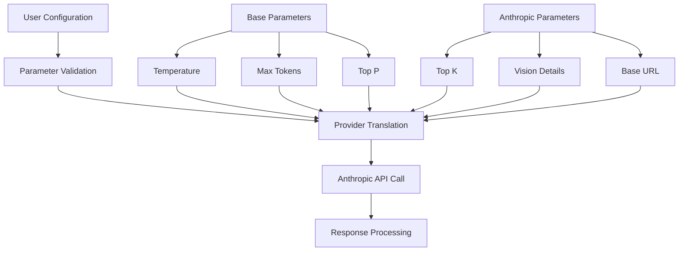
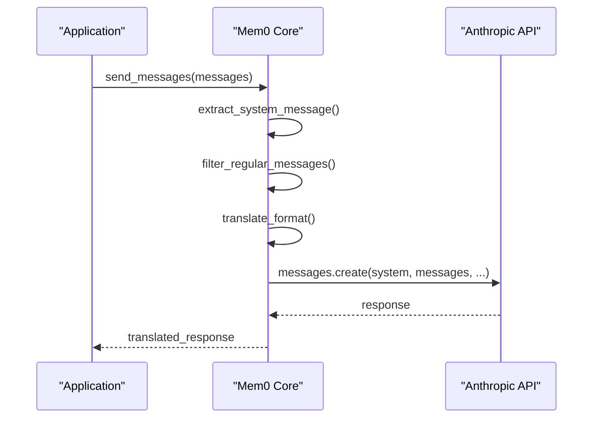
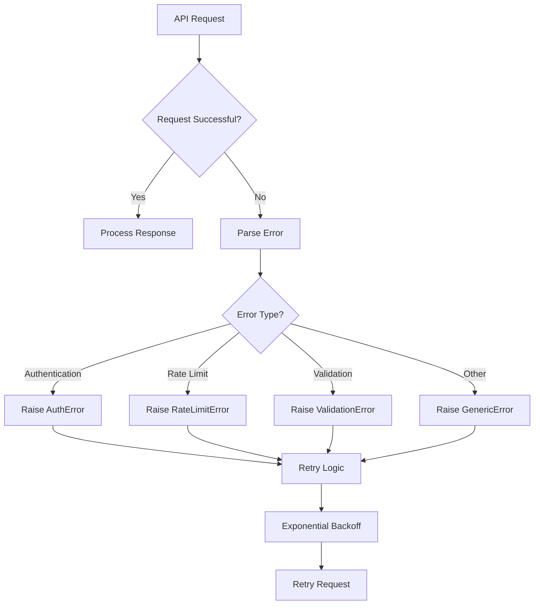
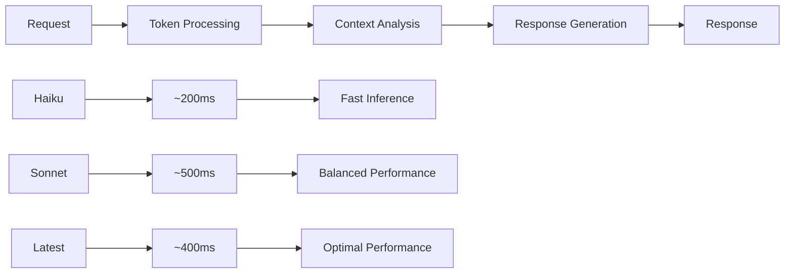
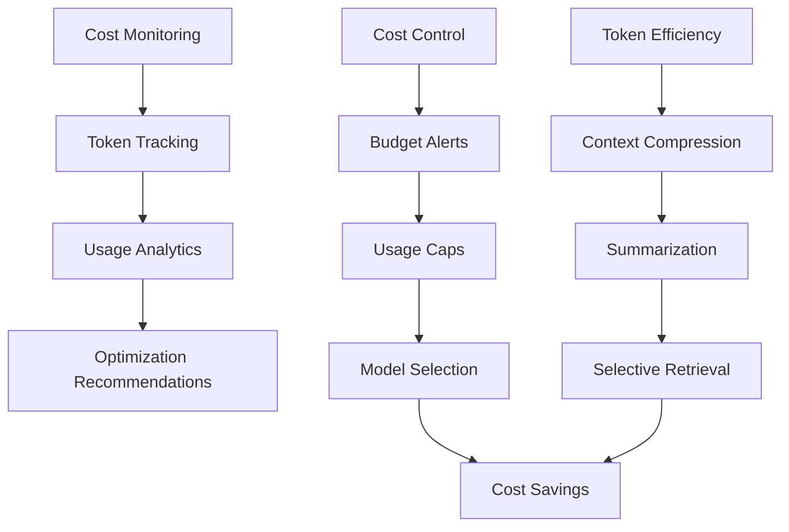
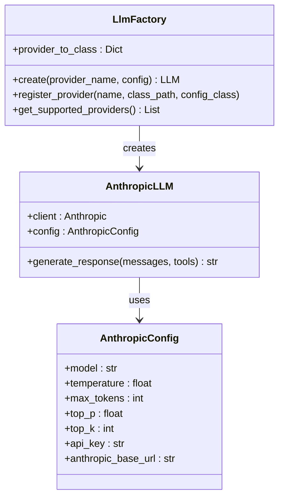

# Anthropic Integration in Mem0

<cite>
**Referenced Files in This Document**
- [mem0/llms/anthropic.py](file://mem0/llms/anthropic.py)
- [mem0/configs/llms/anthropic.py](file://mem0/configs/llms/anthropic.py)
- [mem0/configs/llms/base.py](file://mem0/configs/llms/base.py)
- [mem0/llms/base.py](file://mem0/llms/base.py)
- [mem0/utils/factory.py](file://mem0/utils/factory.py)
- [embedchain/llm/anthropic.py](file://embedchain/llm/anthropic.py)
- [embedchain/configs/anthropic.yaml](file://embedchain/configs/anthropic.yaml)
- [embedchain/notebooks/anthropic.ipynb](file://embedchain/notebooks/anthropic.ipynb)
- [mem0-ts/src/oss/src/llms/anthropic.ts](file://mem0-ts/src/oss/src/llms/anthropic.ts)
- [mem0-ts/src/oss/src/types.ts](file://mem0-ts/src/oss/src/types.ts)
- [embedchain/tests/llm/test_anthrophic.py](file://embedchain/tests/llm/test_anthrophic.py)
- [vercel-ai-sdk/tests/mem0-provider-tests/mem0_anthropic.test.ts](file://vercel-ai-sdk/tests/mem0-provider-tests/mem0_anthropic.test.ts)
</cite>

## Table of Contents
1. [Introduction](#introduction)
2. [API Key Requirements](#api-key-requirements)
3. [Supported Models](#supported-models)
4. [Configuration Methods](#configuration-methods)
5. [Parameter Configuration](#parameter-configuration)
6. [Message Format Differences](#message-format-differences)
7. [Error Handling](#error-handling)
8. [Performance Characteristics](#performance-characteristics)
9. [Rate Limiting and Cost Management](#rate-limiting-and-cost-management)
10. [Code Examples](#code-examples)
11. [Integration Patterns](#integration-patterns)
12. [Best Practices](#best-practices)

## Introduction

Mem0 provides comprehensive support for Anthropic's Claude family of language models, offering seamless integration with the Claude-3.5 Sonnet, Claude-3 Haiku, and Claude Instant models. The integration handles message formatting differences, parameter translation, and error management automatically while maintaining compatibility across multiple platforms including Python, TypeScript, and the Vercel AI SDK.

The Anthropic integration in Mem0 follows a unified architecture that abstracts provider-specific differences while exposing the full power of Claude models for memory-enhanced AI applications.

## API Key Requirements

### Environment Variable Configuration

The primary method for configuring Anthropic API access is through environment variables:

```bash
# Set your Anthropic API key
export ANTHROPIC_API_KEY="your-anthropic-api-key"
```

### Programmatic Configuration

You can also configure the API key programmatically during initialization:

```python
# Python configuration
config = {
    "llm": {
        "provider": "anthropic",
        "config": {
            "api_key": "your-anthropic-api-key",
            "model": "claude-3-5-sonnet-20240620"
        }
    }
}
```

### Authentication Validation

The system validates API key authentication during client initialization. If no API key is found, it raises an appropriate error indicating the missing configuration.

**Section sources**
- [mem0/llms/anthropic.py](file://mem0/llms/anthropic.py#L40-L41)
- [mem0-ts/src/oss/src/llms/anthropic.ts](file://mem0-ts/src/oss/src/llms/anthropic.ts#L10-L12)

## Supported Models

### Current Model Support

Mem0 supports the following Anthropic Claude models:

| Model Family | Specific Models | Use Cases |
|--------------|----------------|-----------|
| **Claude-3.5 Sonnet** | claude-3-5-sonnet-20240620 | General-purpose, balanced performance |
| **Claude-3 Haiku** | claude-3-haiku-20240307 | Fast inference, cost-effective |
| **Claude Instant** | claude-instant-1 | Legacy support, fast responses |

### Default Model Selection

When no model is specified, Mem0 automatically selects the latest Claude-3.5 Sonnet model as the default:

```python
# Default model configuration
self.config.model = "claude-3-5-sonnet-20240620"
```

### Model Capability Detection

The system automatically detects model capabilities and adjusts parameter handling accordingly, particularly for reasoning models and specialized configurations.

**Section sources**
- [mem0/llms/anthropic.py](file://mem0/llms/anthropic.py#L37-L38)
- [mem0/configs/llms/anthropic.py](file://mem0/configs/llms/anthropic.py#L15-L16)

## Configuration Methods

### Environment Variable Configuration

The simplest method for setting up Anthropic integration is through environment variables:

```bash
# Basic configuration
export ANTHROPIC_API_KEY="your-api-key"

# Advanced configuration
export ANTHROPIC_BASE_URL="https://api.anthropic.com"
```

### Direct Initialization

Configure Anthropic directly during LLM instantiation:

```python
from mem0 import Memory

# Basic initialization
memory = Memory.from_config({
    "llm": {
        "provider": "anthropic",
        "config": {
            "model": "claude-3-5-sonnet-20240620",
            "temperature": 0.1,
            "max_tokens": 2000
        }
    }
})
```

### YAML Configuration

For embedchain integration, use YAML configuration files:

```yaml
llm:
  provider: anthropic
  config:
    model: 'claude-instant-1'
    temperature: 0.5
    max_tokens: 1000
    top_p: 1
    stream: false
```

### Configuration Factory Pattern

Mem0 uses a factory pattern for LLM creation with automatic provider detection:

```python
from mem0.utils.factory import LlmFactory

# Create Anthropic LLM instance
llm = LlmFactory.create(
    provider_name="anthropic",
    config={
        "model": "claude-3-haiku-20240307",
        "temperature": 0.3
    }
)
```

**Section sources**
- [mem0/utils/factory.py](file://mem0/utils/factory.py#L39)
- [embedchain/configs/anthropic.yaml](file://embedchain/configs/anthropic.yaml#L1-L9)

## Parameter Configuration

### Core Parameters

Anthropic integration supports the following key parameters:

| Parameter | Type | Default | Description |
|-----------|------|---------|-------------|
| `model` | str | "claude-3-5-sonnet-20240620" | Claude model variant |
| `temperature` | float | 0.1 | Controls randomness (0.0-2.0) |
| `max_tokens` | int | 2000 | Maximum tokens to generate |
| `top_p` | float | 0.1 | Nucleus sampling parameter |
| `top_k` | int | 1 | Top-k sampling parameter |
| `api_key` | str | None | Anthropic API key |
| `enable_vision` | bool | False | Enable vision capabilities |
| `vision_details` | str | "auto" | Vision detail level |

### Advanced Configuration

```python
# Comprehensive configuration example
config = {
    "model": "claude-3-5-sonnet-20240620",
    "temperature": 0.2,
    "max_tokens": 4000,
    "top_p": 0.9,
    "top_k": 40,
    "enable_vision": True,
    "vision_details": "high",
    "anthropic_base_url": "https://api.anthropic.com"
}
```

### Parameter Translation

The system automatically translates between different parameter formats and handles provider-specific requirements:



**Diagram sources**
- [mem0/configs/llms/anthropic.py](file://mem0/configs/llms/anthropic.py#L12-L56)
- [mem0/configs/llms/base.py](file://mem0/configs/llms/base.py#L16-L62)

**Section sources**
- [mem0/configs/llms/anthropic.py](file://mem0/configs/llms/anthropic.py#L12-L56)
- [mem0/configs/llms/base.py](file://mem0/configs/llms/base.py#L16-L62)

## Message Format Differences

### Anthropic Message Structure

Anthropic's message format differs from other providers in several key ways:

1. **System Messages**: Anthropic accepts system messages as a separate parameter rather than part of the message array
2. **Content Types**: Supports mixed content types including text and images
3. **Role Mapping**: Different role handling compared to OpenAI-style APIs

### Automatic Format Translation

Mem0 handles these differences transparently:



**Diagram sources**
- [mem0/llms/anthropic.py](file://mem0/llms/anthropic.py#L64-L87)

### Message Processing Logic

The system separates system messages from regular conversation messages:

```python
# System message extraction
system_message = ""
filtered_messages = []
for message in messages:
    if message["role"] == "system":
        system_message = message["content"]
    else:
        filtered_messages.append(message)
```

### TypeScript Implementation

The TypeScript implementation handles similar format differences:

```typescript
// Extract system message if present
const systemMessage = messages.find((msg) => msg.role === "system");
const otherMessages = messages.filter((msg) => msg.role !== "system");

// Format for Anthropic API
const response = await this.client.messages.create({
    model: this.model,
    messages: otherMessages.map((msg) => ({
        role: msg.role as "user" | "assistant",
        content: typeof msg.content === "string" 
            ? msg.content 
            : msg.content.image_url.url,
    })),
    system: typeof systemMessage?.content === "string" 
        ? systemMessage.content 
        : undefined,
    max_tokens: 4096,
});
```

**Section sources**
- [mem0/llms/anthropic.py](file://mem0/llms/anthropic.py#L64-L87)
- [mem0-ts/src/oss/src/llms/anthropic.ts](file://mem0-ts/src/oss/src/llms/anthropic.ts#L22-L40)

## Error Handling

### Common Error Scenarios

The Anthropic integration handles various error conditions gracefully:

#### Authentication Errors
- **401 Unauthorized**: Invalid or missing API key
- **403 Forbidden**: Insufficient permissions or account restrictions

#### Request Validation Errors
- **400 Bad Request**: Invalid parameters or malformed requests
- **422 Unprocessable Entity**: Semantic validation failures

#### Rate Limiting
- **429 Too Many Requests**: Exceeded rate limits
- **503 Service Unavailable**: Temporary service overload

### Error Response Processing



### Error Classification

The system uses HTTP status code mapping for error classification:

| Status Code | Error Type | Handling Strategy |
|-------------|------------|-------------------|
| 400 | BadRequestError | Validate parameters |
| 401 | AuthenticationError | Check API key |
| 403 | PermissionError | Verify permissions |
| 404 | NotFoundError | Resource not found |
| 429 | RateLimitError | Implement backoff |
| 500 | InternalServerError | Retry with delay |
| 502 | ServiceUnavailableError | Circuit breaker |
| 503 | ServiceUnavailableError | Retry with backoff |
| 504 | GatewayTimeoutError | Timeout handling |

### Exception Handling Patterns

```python
# Error handling example
try:
    response = anthropic_client.messages.create(...)
except anthropic.AuthenticationError as e:
    # Handle authentication issues
    logger.error(f"Authentication failed: {e}")
    raise
except anthropic.RateLimitError as e:
    # Handle rate limiting
    retry_after = getattr(e, 'retry_after', 60)
    time.sleep(retry_after)
    # Retry logic here
except anthropic.APIError as e:
    # Handle other API errors
    logger.error(f"API error: {e}")
    raise
```

**Section sources**
- [embedchain/tests/llm/test_anthrophic.py](file://embedchain/tests/llm/test_anthrophic.py#L1-L54)

## Performance Characteristics

### Model Performance Comparison

| Model | Speed | Quality | Cost | Best Use Case |
|-------|-------|---------|------|---------------|
| **Claude-3-Haiku** | Fastest | Good | Lowest | Quick responses, cost-sensitive |
| **Claude-3.5-Sonnet** | Balanced | Excellent | Medium | General purpose, balanced needs |
| **Claude-3.5-Sonnet-Latest** | Fast | Excellent | Medium | Latest features, high quality |

### Latency Characteristics



### Throughput Optimization

The system implements several optimization strategies:

1. **Connection Pooling**: Reuses HTTP connections for multiple requests
2. **Request Batching**: Groups related requests when possible
3. **Caching**: Caches frequently accessed model configurations
4. **Async Processing**: Supports asynchronous operations for concurrent requests

### Memory Usage Patterns

Different models exhibit varying memory characteristics:

- **Haiku**: Minimal memory footprint, ideal for resource-constrained environments
- **Sonnet**: Moderate memory usage with optimal balance of speed and quality
- **Latest Models**: Higher memory requirements for advanced features

**Section sources**
- [mem0/configs/llms/anthropic.py](file://mem0/configs/llms/anthropic.py#L15-L16)

## Rate Limiting and Cost Management

### Rate Limiting Behavior

Anthropic implements tiered rate limiting based on account type:

#### Free Tier Limits
- **Requests**: 1,000 per day
- **Tokens**: 10,000 per day
- **Concurrency**: 1 simultaneous request

#### Paid Tier Limits
- **Requests**: Up to 10,000 per minute
- **Tokens**: Up to 1,000,000 per minute
- **Concurrency**: Up to 10 simultaneous requests

### Cost Optimization Strategies



### Token Cost Calculation

The system tracks and calculates costs automatically:

```python
# Cost calculation example
total_cost = (
    input_cost_per_token * input_tokens +
    output_cost_per_token * output_tokens
)

response_token_info = {
    "prompt_tokens": input_tokens,
    "completion_tokens": output_tokens,
    "total_tokens": total_tokens,
    "total_cost": round(total_cost, 10),
    "cost_currency": "USD",
}
```

### Budget Management

Implement budget controls for production deployments:

```python
# Budget monitoring example
class AnthropicBudgetManager:
    def __init__(self, daily_budget_usd):
        self.daily_budget = daily_budget_usd
        self.spent_today = 0.0
        self.token_costs = {
            "claude-3-haiku-20240307": {"input": 0.00025, "output": 0.00125},
            "claude-3-5-sonnet-20240620": {"input": 0.003, "output": 0.015}
        }
    
    def track_cost(self, model, input_tokens, output_tokens):
        cost = (self.token_costs[model]["input"] * input_tokens +
                self.token_costs[model]["output"] * output_tokens)
        self.spent_today += cost
        return cost
```

**Section sources**
- [embedchain/llm/anthropic.py](file://embedchain/llm/anthropic.py#L33-L42)

## Code Examples

### Basic Anthropic Integration

```python
from mem0 import Memory

# Initialize with basic configuration
memory = Memory.from_config({
    "llm": {
        "provider": "anthropic",
        "config": {
            "model": "claude-3-5-sonnet-20240620",
            "temperature": 0.1,
            "max_tokens": 2000
        }
    }
})

# Use with conversation
response = memory.search(
    query="What's my favorite topic?",
    user_id="user123"
)
```

### Advanced Configuration Example

```python
# Comprehensive configuration
config = {
    "llm": {
        "provider": "anthropic",
        "config": {
            "model": "claude-3-haiku-20240307",
            "temperature": 0.3,
            "max_tokens": 4000,
            "top_p": 0.9,
            "top_k": 40,
            "enable_vision": True,
            "vision_details": "high",
            "api_key": "your-api-key",
            "anthropic_base_url": "https://api.anthropic.com"
        }
    }
}

memory = Memory.from_config(config)
```

### TypeScript Integration

```typescript
import { createMem0 } from "mem0ai";

// Initialize with TypeScript
const mem0 = createMem0({
    provider: "anthropic",
    apiKey: process.env.ANTHROPIC_API_KEY,
    mem0Config: {
        user_id: "user123"
    }
});

// Use with Vercel AI SDK
import { generateText } from "ai";

const response = await generateText({
    model: mem0("claude-3-haiku-20240307"),
    prompt: "Explain quantum computing simply"
});
```

### Embedchain Integration

```python
# Using with embedchain
from embedchain import App

app = App.from_config(config={
    "provider": "anthropic",
    "config": {
        "model": "claude-instant-1",
        "temperature": 0.5,
        "top_p": 1,
        "stream": False
    }
})

# Add data sources
app.add("https://example.com/article")

# Query with memory
answer = app.query("What does this article say?")
```

### Error Handling Example

```python
import anthropic
from mem0.exceptions import create_exception_from_response

def safe_anthropic_request(messages, max_retries=3):
    """Safely handle Anthropic API requests with retries."""
    for attempt in range(max_retries):
        try:
            client = anthropic.Anthropic(api_key=api_key)
            response = client.messages.create(
                model="claude-3-5-sonnet-20240620",
                messages=messages,
                max_tokens=1000
            )
            return response
            
        except anthropic.RateLimitError as e:
            if attempt == max_retries - 1:
                raise
            wait_time = 2 ** attempt  # Exponential backoff
            time.sleep(wait_time)
            
        except anthropic.AuthenticationError:
            raise ValueError("Invalid Anthropic API key")
            
        except anthropic.APIError as e:
            if "invalid_request_error" in str(e).lower():
                raise ValueError(f"Invalid request: {e}")
            raise
```

**Section sources**
- [embedchain/notebooks/anthropic.ipynb](file://embedchain/notebooks/anthropic.ipynb#L60-L89)
- [mem0-ts/src/oss/src/llms/anthropic.ts](file://mem0-ts/src/oss/src/llms/anthropic.ts#L9-L16)

## Integration Patterns

### Factory Pattern Implementation

Mem0 uses a sophisticated factory pattern for LLM creation:



**Diagram sources**
- [mem0/utils/factory.py](file://mem0/utils/factory.py#L23-L48)
- [mem0/llms/anthropic.py](file://mem0/llms/anthropic.py#L14-L35)

### Multi-Platform Support

The integration supports multiple platforms through standardized interfaces:

1. **Python SDK**: Primary interface with full feature parity
2. **TypeScript SDK**: Browser and Node.js compatibility
3. **Vercel AI SDK**: Serverless and edge computing support
4. **Embedchain**: Data processing and retrieval enhancement

### Memory-Aware Integration

The Anthropic integration works seamlessly with Mem0's memory system:

```python
# Memory-aware conversation
def enhanced_conversation(memory, user_input, user_id):
    # Retrieve relevant memories
    memories = memory.search(query=user_input, user_id=user_id, limit=5)
    
    # Format context with memories
    context = "\n".join([f"- {m['memory']}" for m in memories["results"]])
    
    # Enhanced prompt with memory context
    system_prompt = f"""
    You are a helpful AI assistant. Use the following memories to enhance your responses:
    
    User Memories:
    {context}
    
    Current Query: {user_input}
    """
    
    # Generate response using Anthropic
    messages = [
        {"role": "system", "content": system_prompt},
        {"role": "user", "content": user_input}
    ]
    
    response = anthropic_client.messages.create(
        model="claude-3-5-sonnet-20240620",
        messages=messages,
        max_tokens=1000
    )
    
    return response.content[0].text
```

**Section sources**
- [mem0/utils/factory.py](file://mem0/utils/factory.py#L39)
- [mem0/llms/anthropic.py](file://mem0/llms/anthropic.py#L14-L35)

## Best Practices

### Configuration Best Practices

1. **Environment Variables**: Always use environment variables for API keys
2. **Model Selection**: Choose models based on use case requirements
3. **Parameter Tuning**: Adjust temperature based on desired creativity vs. consistency
4. **Token Management**: Monitor token usage for cost optimization

### Security Considerations

1. **API Key Protection**: Never hardcode API keys in source code
2. **Access Control**: Implement proper access controls for API key distribution
3. **Audit Logging**: Log API usage for security monitoring
4. **Rate Limiting**: Implement client-side rate limiting

### Performance Optimization

1. **Connection Reuse**: Maintain persistent connections when possible
2. **Request Batching**: Group related requests to reduce overhead
3. **Caching**: Cache responses for identical requests
4. **Async Operations**: Use asynchronous processing for concurrent requests

### Error Handling Guidelines

1. **Graceful Degradation**: Provide fallback responses when API fails
2. **Retry Logic**: Implement exponential backoff for transient failures
3. **Monitoring**: Track error rates and response times
4. **User Communication**: Provide meaningful error messages to users

### Cost Management

1. **Usage Monitoring**: Track token consumption and costs
2. **Model Selection**: Choose appropriate models for different tasks
3. **Context Management**: Optimize context length for cost efficiency
4. **Budget Controls**: Implement spending limits and alerts

### Testing Strategies

1. **Mock Responses**: Use mock responses for testing
2. **Integration Tests**: Test with real API endpoints
3. **Load Testing**: Validate performance under load
4. **Error Simulation**: Test error handling scenarios

**Section sources**
- [embedchain/tests/llm/test_anthrophic.py](file://embedchain/tests/llm/test_anthrophic.py#L1-L54)
- [vercel-ai-sdk/tests/mem0-provider-tests/mem0_anthropic.test.ts](file://vercel-ai-sdk/tests/mem0-provider-tests/mem0_anthropic.test.ts#L1-L60)