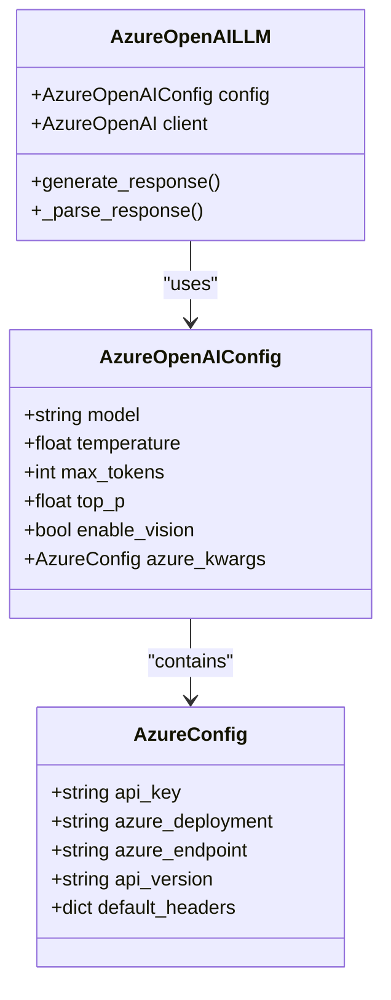
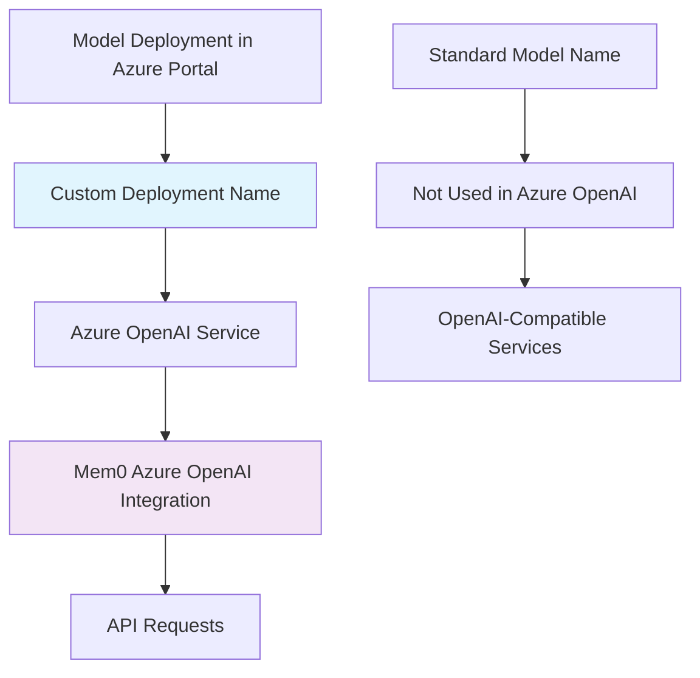
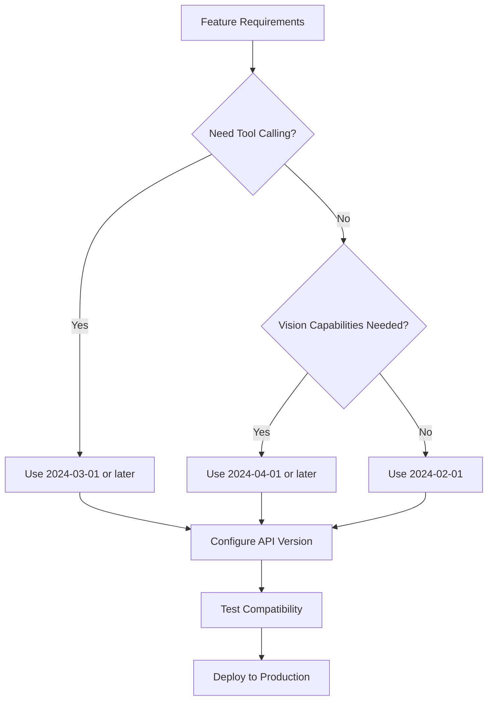
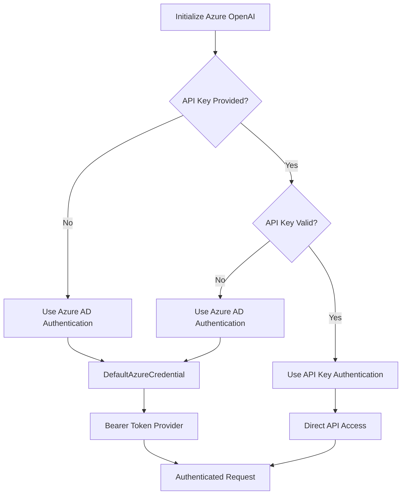
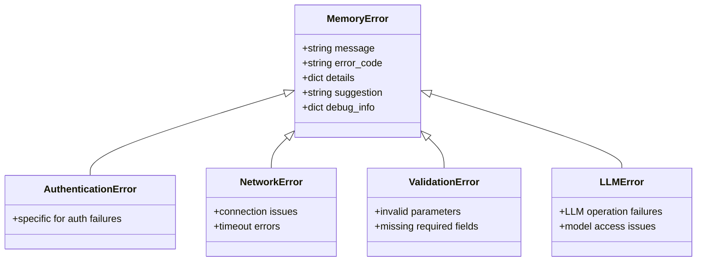

# Azure OpenAI Integration in Mem0

<cite>
**Referenced Files in This Document**
- [azure.py](file://mem0/configs/llms/azure.py)
- [azure_openai.py](file://mem0/llms/azure_openai.py)
- [azure_openai.yaml](file://embedchain/notebooks/azure_openai.yaml)
- [azure_openai.py](file://embedchain/embedchain/llm/azure_openai.py)
- [azure_openai.py](file://embedchain/embedchain/embedder/azure_openai.py)
- [base.py](file://mem0/configs/base.py)
- [exceptions.py](file://mem0/exceptions.py)
- [test_azure_openai.py](file://tests/llms/test_azure_openai.py)
- [azure-openai.ipynb](file://embedchain/notebooks/azure-openai.ipynb)
</cite>

## Table of Contents
1. [Introduction](#introduction)
2. [Configuration Overview](#configuration-overview)
3. [API Key and Endpoint Configuration](#api-key-and-endpoint-configuration)
4. [Deployment Name Requirements](#deployment-name-requirements)
5. [API Version Specification](#api-version-specification)
6. [Initialization Examples](#initialization-examples)
7. [Environment Variables](#environment-variables)
8. [Authentication Methods](#authentication-methods)
9. [Error Handling](#error-handling)
10. [Network Configuration](#network-configuration)
11. [Enterprise Compliance](#enterprise-compliance)
12. [Best Practices](#best-practices)
13. [Troubleshooting](#troubleshooting)

## Introduction

Mem0 provides comprehensive support for Azure OpenAI integration, enabling seamless access to Azure's AI capabilities through both LLM (Language Model) and embedding services. The integration supports multiple authentication methods, flexible configuration options, and robust error handling mechanisms designed for enterprise-grade deployments.

Azure OpenAI in Mem0 operates through two primary approaches:
- **Deployment-based model access**: Using custom deployment names for specific model instances
- **Direct model names**: Utilizing standard OpenAI model identifiers with Azure infrastructure

## Configuration Overview

Mem0's Azure OpenAI configuration system is built around a hierarchical structure that supports both LLM and embedding configurations with extensive customization options.



**Diagram sources**
- [azure.py](file://mem0/configs/llms/azure.py#L7-L58)
- [azure_openai.py](file://mem0/llms/azure_openai.py#L16-L142)
- [base.py](file://mem0/configs/base.py#L64-L86)

**Section sources**
- [azure.py](file://mem0/configs/llms/azure.py#L1-L58)
- [base.py](file://mem0/configs/base.py#L64-L86)

## API Key and Endpoint Configuration

### Basic Configuration Structure

Azure OpenAI integration requires four essential configuration parameters:

| Parameter | Description | Required | Environment Variable |
|-----------|-------------|----------|---------------------|
| `api_key` | Azure OpenAI API key for authentication | Yes* | `LLM_AZURE_OPENAI_API_KEY` |
| `azure_deployment` | Custom deployment name for the model | Yes | `LLM_AZURE_DEPLOYMENT` |
| `azure_endpoint` | Azure OpenAI service endpoint URL | Yes | `LLM_AZURE_ENDPOINT` |
| `api_version` | API version specification | Yes | `LLM_AZURE_API_VERSION` |

*Note: Either API key or Azure AD authentication can be used

### Configuration Methods

#### Method 1: Direct Configuration Object

```python
from mem0.configs.llms import AzureOpenAIConfig

config = AzureOpenAIConfig(
    model="gpt-4o",
    temperature=0.1,
    max_tokens=2000,
    azure_kwargs={
        "api_key": "your-api-key",
        "azure_deployment": "your-deployment-name",
        "azure_endpoint": "https://your-resource.openai.azure.com/",
        "api_version": "2024-02-01"
    }
)
```

#### Method 2: Environment Variables

```python
import os
from mem0.configs.llms import AzureOpenAIConfig

# Set environment variables
os.environ["LLM_AZURE_OPENAI_API_KEY"] = "your-api-key"
os.environ["LLM_AZURE_DEPLOYMENT"] = "your-deployment-name"
os.environ["LLM_AZURE_ENDPOINT"] = "https://your-resource.openai.azure.com/"
os.environ["LLM_AZURE_API_VERSION"] = "2024-02-01"

# Configuration will automatically use environment variables
config = AzureOpenAIConfig(model="gpt-4o")
```

**Section sources**
- [azure_openai.py](file://mem0/llms/azure_openai.py#L42-L47)
- [azure.py](file://mem0/configs/llms/azure.py#L13-L58)

## Deployment Name Requirements

### Understanding Deployment Names

Azure OpenAI uses deployment names as the primary identifier for accessing specific model instances. Unlike traditional model names, deployment names are custom identifiers assigned during model deployment in the Azure portal.



### Deployment Name vs Model Name

| Aspect | Azure OpenAI | Standard OpenAI |
|--------|--------------|-----------------|
| **Identifier Type** | Custom deployment name | Standard model identifier |
| **Configuration** | Required in azure_kwargs | Not applicable |
| **Access Pattern** | Uses deployment_name parameter | Uses model parameter |
| **Flexibility** | Supports multiple models per deployment | Single model per deployment |

### Deployment Name Best Practices

1. **Naming Convention**: Use descriptive names like `gpt-4o-production` or `text-embedding-prod`
2. **Version Control**: Include version numbers in deployment names for tracking
3. **Environment Separation**: Use different deployment names for dev/staging/prod environments
4. **Resource Management**: Match deployment names with resource group organization

**Section sources**
- [azure_openai.py](file://mem0/llms/azure_openai.py#L43-L45)
- [azure_openai.py](file://embedchain/embedchain/llm/azure_openai.py#L23-L24)

## API Version Specification

### Supported API Versions

Azure OpenAI supports multiple API versions, each offering different features and capabilities:

| API Version | Release Date | Key Features |
|-------------|--------------|--------------|
| `2024-02-01` | February 2024 | Initial Azure OpenAI support |
| `2024-03-01` | March 2024 | Enhanced tool calling, structured outputs |
| `2024-04-01` | April 2024 | Improved vision capabilities |
| `2024-05-01` | May 2024 | Streaming improvements |
| `2024-06-01` | June 2024 | Advanced function calling |

### Version Selection Guidelines



### API Version Configuration

```python
# Latest stable version
config = AzureOpenAIConfig(
    azure_kwargs={
        "api_version": "2024-06-01"
    }
)

# Specific version for feature requirements
config = AzureOpenAIConfig(
    azure_kwargs={
        "api_version": "2024-03-01"  # For tool calling features
    }
)
```

**Section sources**
- [azure_openai.py](file://embedchain/embedchain/llm/azure_openai.py#L28-L29)
- [azure_openai.py](file://mem0/llms/azure_openai.py#L46)

## Initialization Examples

### Basic LLM Initialization

```python
from mem0 import Memory
from mem0.configs.llms import AzureOpenAIConfig

# Complete configuration
config = AzureOpenAIConfig(
    model="gpt-4o",
    temperature=0.1,
    max_tokens=2000,
    top_p=0.1,
    azure_kwargs={
        "api_key": "your-api-key",
        "azure_deployment": "gpt-4o-deployment",
        "azure_endpoint": "https://your-resource.openai.azure.com/",
        "api_version": "2024-06-01"
    }
)

memory = Memory(config=config)
```

### Advanced Configuration with Custom Parameters

```python
from mem0.configs.llms import AzureOpenAIConfig

# Advanced configuration with vision and streaming
config = AzureOpenAIConfig(
    model="gpt-4o",
    temperature=0.3,
    max_tokens=1500,
    top_p=0.9,
    top_k=40,
    enable_vision=True,
    vision_details="high",
    azure_kwargs={
        "api_key": "your-api-key",
        "azure_deployment": "gpt-4o-vision",
        "azure_endpoint": "https://your-resource.openai.azure.com/",
        "api_version": "2024-06-01",
        "default_headers": {
            "X-Custom-Header": "custom-value"
        }
    }
)
```

### Embedding Configuration

```python
from embedchain import App
from embedchain.config import BaseEmbedderConfig

# Embedding configuration
embedder_config = BaseEmbedderConfig(
    model="text-embedding-ada-002",
    azure_kwargs={
        "api_key": "your-api-key",
        "azure_deployment": "text-embedding-deployment",
        "azure_endpoint": "https://your-resource.openai.azure.com/",
        "api_version": "2024-06-01"
    }
)

# Create app with embedding configuration
app = App.from_config(
    config={
        "embedder": {
            "provider": "azure_openai",
            "config": embedder_config
        }
    }
)
```

**Section sources**
- [azure.py](file://mem0/configs/llms/azure.py#L13-L58)
- [azure_openai.py](file://embedchain/embedchain/embedder/azure_openai.py#L10-L27)

## Environment Variables

### Standard Environment Variables

Mem0 supports comprehensive environment variable configuration for Azure OpenAI:

| Variable | Purpose | Example Value |
|----------|---------|---------------|
| `LLM_AZURE_OPENAI_API_KEY` | API authentication key | `your-api-key-here` |
| `LLM_AZURE_DEPLOYMENT` | Model deployment name | `gpt-4o-deployment` |
| `LLM_AZURE_ENDPOINT` | Azure service endpoint | `https://your-resource.openai.azure.com/` |
| `LLM_AZURE_API_VERSION` | API version specification | `2024-06-01` |

### Embedding-Specific Variables

| Variable | Purpose | Example Value |
|----------|---------|---------------|
| `EMBEDDING_AZURE_OPENAI_API_KEY` | Embedding API key | `embedding-api-key` |
| `EMBEDDING_AZURE_DEPLOYMENT` | Embedding deployment name | `text-embedding-deployment` |
| `EMBEDDING_AZURE_ENDPOINT` | Embedding endpoint | `https://your-resource.openai.azure.com/` |
| `EMBEDDING_AZURE_API_VERSION` | Embedding API version | `2024-06-01` |

### Environment Variable Priority

The configuration follows this priority order (highest to lowest):
1. **Direct configuration parameters** (highest priority)
2. **Specific provider environment variables** (e.g., `EMBEDDING_AZURE_*`)
3. **Generic environment variables** (e.g., `LLM_AZURE_*`)
4. **Default values** (lowest priority)

**Section sources**
- [azure_openai.py](file://mem0/llms/azure_openai.py#L42-L47)
- [azure_openai.py](file://embedchain/embedchain/embedder/azure_openai.py#L16-L19)

## Authentication Methods

### API Key Authentication

The most straightforward authentication method using Azure OpenAI API keys:

```python
from mem0.configs.llms import AzureOpenAIConfig

config = AzureOpenAIConfig(
    azure_kwargs={
        "api_key": "your-actual-api-key",
        "azure_deployment": "deployment-name",
        "azure_endpoint": "https://resource.openai.azure.com/",
        "api_version": "2024-06-01"
    }
)
```

### Azure Active Directory Authentication

For enterprise environments, Azure AD authentication provides enhanced security:

```python
from mem0.configs.llms import AzureOpenAIConfig

# No API key provided - triggers Azure AD authentication
config = AzureOpenAIConfig(
    azure_kwargs={
        "azure_deployment": "deployment-name",
        "azure_endpoint": "https://resource.openai.azure.com/",
        "api_version": "2024-06-01"
    }
)
```

### Authentication Detection Logic



**Diagram sources**
- [azure_openai.py](file://mem0/llms/azure_openai.py#L49-L58)

### Placeholder API Key Detection

The system automatically detects placeholder API keys and switches to Azure AD authentication:

```python
# These trigger Azure AD authentication
config = AzureOpenAIConfig(
    azure_kwargs={
        "api_key": "",  # Empty string
        "api_key": "your-api-key",  # Placeholder
        "api_key": None  # Not provided
    }
)
```

**Section sources**
- [azure_openai.py](file://mem0/llms/azure_openai.py#L49-L58)

## Error Handling

### Common Error Scenarios

Mem0 provides structured error handling for Azure OpenAI integration with specific exception types for different failure modes.



**Diagram sources**
- [exceptions.py](file://mem0/exceptions.py#L34-L503)

### Error Categories and Solutions

| Error Type | Common Causes | Solution |
|------------|---------------|----------|
| `AuthenticationError` | Invalid API key, expired credentials | Verify API key and regenerate if needed |
| `NetworkError` | Connection timeouts, DNS issues | Check network connectivity and endpoint accessibility |
| `ValidationError` | Missing deployment name, invalid parameters | Ensure all required configuration is provided |
| `LLMError` | Model not found, quota exceeded | Verify deployment exists and check usage limits |

### Error Handling Implementation

```python
from mem0.exceptions import AuthenticationError, NetworkError, ValidationError, LLMError

try:
    memory = Memory(config=config)
    response = memory.query("Your question here")
    
except AuthenticationError as e:
    print(f"Authentication failed: {e.message}")
    print(f"Suggestion: {e.suggestion}")
    # Implement retry logic or credential refresh
    
except NetworkError as e:
    print(f"Network connectivity issue: {e.message}")
    print(f"Debug info: {e.debug_info}")
    # Implement exponential backoff
    
except ValidationError as e:
    print(f"Configuration error: {e.message}")
    print(f"Details: {e.details}")
    # Fix configuration parameters
    
except LLMError as e:
    print(f"LLM operation failed: {e.message}")
    print(f"Error code: {e.error_code}")
    # Handle model-specific issues
```

### HTTP Status Code Mapping

Mem0 automatically maps HTTP status codes to appropriate exception types:

| HTTP Status | Exception Type | Common Cause |
|-------------|----------------|--------------|
| 400 | `ValidationError` | Invalid request parameters |
| 401 | `AuthenticationError` | Invalid or missing API key |
| 403 | `AuthenticationError` | Insufficient permissions |
| 404 | `MemoryNotFoundError` | Deployment not found |
| 429 | `RateLimitError` | Rate limit exceeded |
| 500 | `MemoryError` | Internal server error |
| 502 | `NetworkError` | Bad gateway |
| 503 | `NetworkError` | Service unavailable |
| 504 | `NetworkError` | Gateway timeout |

**Section sources**
- [exceptions.py](file://mem0/exceptions.py#L424-L503)
- [test_azure_openai.py](file://tests/llms/test_azure_openai.py#L206-L258)

## Network Configuration

### Regional Considerations

Azure OpenAI services are available in multiple regions with specific characteristics:

| Region | Availability | Latency | Compliance |
|--------|--------------|---------|------------|
| East US | Full | Low | Global |
| West Europe | Full | Medium | GDPR |
| Japan East | Full | Medium | Local |
| Australia East | Full | High | Local |

### Private Endpoint Configuration

For enterprise deployments requiring network isolation:

```python
from mem0.configs.llms import AzureOpenAIConfig

# Configure private endpoint access
config = AzureOpenAIConfig(
    azure_kwargs={
        "azure_endpoint": "https://private-endpoint.internal.company.com/",
        "api_version": "2024-06-01",
        "default_headers": {
            "X-Private-Endpoint": "true",
            "Authorization": "Bearer your-private-token"
        }
    }
)
```

### Network Security Best Practices

1. **VNet Integration**: Deploy Azure OpenAI within Virtual Networks
2. **Private Links**: Use Azure Private Link for secure connectivity
3. **Firewall Rules**: Configure IP restrictions and firewall policies
4. **DNS Configuration**: Set up private DNS zones for internal resolution
5. **Monitoring**: Implement network monitoring and alerting

### Proxy Configuration

```python
from mem0.configs.llms import AzureOpenAIConfig

# Configure HTTP client with proxy settings
config = AzureOpenAIConfig(
    http_client_proxies={
        "http://": "http://proxy.company.com:8080",
        "https://": "https://proxy.company.com:8080"
    },
    azure_kwargs={
        "azure_endpoint": "https://your-resource.openai.azure.com/",
        "api_version": "2024-06-01"
    }
)
```

**Section sources**
- [azure_openai.py](file://mem0/llms/azure_openai.py#L24-L25)

## Enterprise Compliance

### Data Residency Requirements

Azure OpenAI supports various data residency and compliance frameworks:

| Framework | Coverage | Implementation |
|-----------|----------|----------------|
| GDPR | European data protection | Data processing agreements |
| HIPAA | Healthcare data | Business associate agreements |
| SOC 2 | Security controls | Regular audits |
| ISO 27001 | Information security | Certification |
| FedRAMP | US government | Authority to operate |

### Compliance Configuration

```python
from mem0.configs.llms import AzureOpenAIConfig

# Compliance-focused configuration
config = AzureOpenAIConfig(
    azure_kwargs={
        "azure_endpoint": "https://compliant-region.openai.azure.com/",
        "api_version": "2024-06-01",
        "default_headers": {
            "X-Compliance-Region": "eu-west-1",
            "X-Data-Residency": "true",
            "X-Audit-Log": "enabled"
        }
    }
)
```

### Audit and Monitoring

```python
# Enable audit logging for compliance
config = AzureOpenAIConfig(
    azure_kwargs={
        "default_headers": {
            "X-Audit-Enabled": "true",
            "X-Compliance-ID": "compliance-123",
            "X-Timestamp": "2024-01-01T00:00:00Z"
        }
    }
)
```

### Enterprise Deployment Checklist

- ✅ Azure AD integration
- ✅ Private endpoint configuration
- ✅ Network isolation setup
- ✅ Compliance framework alignment
- ✅ Audit logging enabled
- ✅ Backup and disaster recovery
- ✅ Monitoring and alerting
- ✅ Access control policies

## Best Practices

### Configuration Management

1. **Environment Separation**: Use different deployment names for development, staging, and production
2. **Secret Management**: Store API keys securely using Azure Key Vault or similar solutions
3. **Version Pinning**: Specify exact API versions for reproducible deployments
4. **Fallback Strategies**: Implement graceful degradation for service interruptions

### Performance Optimization

```python
# Optimized configuration for production
config = AzureOpenAIConfig(
    model="gpt-4o",
    temperature=0.1,  # Conservative temperature for consistency
    max_tokens=1000,  # Reasonable token limit
    top_p=0.1,        # Efficient sampling
    azure_kwargs={
        "api_version": "2024-06-01",
        "default_headers": {
            "X-Optimization": "true",
            "X-Cache-Control": "max-age=3600"
        }
    }
)
```

### Resource Management

1. **Token Limits**: Monitor and set appropriate max_tokens values
2. **Rate Limiting**: Implement client-side rate limiting
3. **Connection Pooling**: Reuse connections for improved performance
4. **Caching**: Cache embeddings and responses where appropriate

### Security Hardening

```python
# Security-focused configuration
config = AzureOpenAIConfig(
    azure_kwargs={
        "api_version": "2024-06-01",
        "default_headers": {
            "X-Security-Context": "production",
            "X-Request-ID": "unique-request-id",
            "X-Compliance": "strict"
        }
    }
)
```

## Troubleshooting

### Common Issues and Solutions

#### Issue 1: Resource Not Found (404 Error)

**Symptoms**: Deployment not found or model unavailable

**Causes**:
- Incorrect deployment name
- Deployment deleted or renamed
- Wrong Azure region

**Solution**:
```python
# Verify deployment exists
config = AzureOpenAIConfig(
    azure_kwargs={
        "azure_deployment": "correct-deployment-name",  # Double-check this
        "azure_endpoint": "https://correct-resource.openai.azure.com/",
        "api_version": "2024-06-01"
    }
)
```

#### Issue 2: Invalid API Version

**Symptoms**: Feature not available or version mismatch

**Causes**:
- Unsupported API version
- Feature not available in selected version

**Solution**:
```python
# Use supported API version
config = AzureOpenAIConfig(
    azure_kwargs={
        "api_version": "2024-06-01"  # Latest stable version
    }
)
```

#### Issue 3: Unauthorized Access

**Symptoms**: Authentication failures or 401 errors

**Causes**:
- Invalid or expired API key
- Missing Azure AD permissions
- Incorrect endpoint URL

**Solution**:
```python
# Check authentication
config = AzureOpenAIConfig(
    azure_kwargs={
        "api_key": "your-actual-api-key",  # Verify this is correct
        "azure_endpoint": "https://your-resource.openai.azure.com/",  # Verify endpoint
        "api_version": "2024-06-01"
    }
)
```

### Diagnostic Tools

```python
# Enable debug logging
import logging
logging.basicConfig(level=logging.DEBUG)

# Test configuration
def test_azure_config(config):
    try:
        memory = Memory(config=config)
        test_response = memory.query("Test query")
        print("Configuration successful")
        return True
    except Exception as e:
        print(f"Configuration failed: {e}")
        return False
```

### Service Availability

Azure OpenAI is currently available in the following regions:

- **North America**: East US, South Central US, West US 2
- **Europe**: West Europe, France Central, Sweden Central
- **Asia Pacific**: Australia East, Japan East, Singapore
- **Government Cloud**: US Gov Virginia, US Gov Iowa

**Section sources**
- [test_azure_openai.py](file://tests/llms/test_azure_openai.py#L206-L258)
- [azure_openai.py](file://mem0/llms/azure_openai.py#L49-L58)