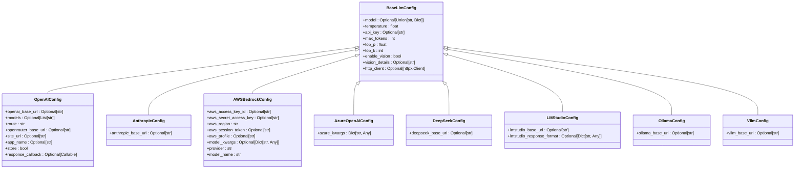

# LLM Providers

<cite>
**Referenced Files in This Document**   
- [openai.py](file://mem0/configs/llms/openai.py)
- [anthropic.py](file://mem0/configs/llms/anthropic.py)
- [aws_bedrock.py](file://mem0/configs/llms/aws_bedrock.py)
- [azure.py](file://mem0/configs/llms/azure.py)
- [deepseek.py](file://mem0/configs/llms/deepseek.py)
- [lmstudio.py](file://mem0/configs/llms/lmstudio.py)
- [ollama.py](file://mem0/configs/llms/ollama.py)
- [vllm.py](file://mem0/configs/llms/vllm.py)
- [base.py](file://mem0/configs/llms/base.py)
- [anthropic.yaml](file://embedchain/configs/anthropic.yaml)
- [aws_bedrock.yaml](file://embedchain/configs/aws_bedrock.yaml)
- [azure_openai.yaml](file://embedchain/configs/azure_openai.yaml)
- [deepseek.yaml](file://mem0/configs/llms/deepseek.py)
- [lmstudio.yaml](file://mem0/configs/llms/lmstudio.py)
- [ollama.yaml](file://embedchain/configs/ollama.yaml)
- [vllm.yaml](file://embedchain/configs/vllm.yaml)
</cite>

## Table of Contents
1. [Introduction](#introduction)
2. [Provider Configuration Overview](#provider-configuration-overview)
3. [OpenAI](#openai)
4. [Anthropic](#anthropic)
5. [AWS Bedrock](#aws-bedrock)
6. [Azure OpenAI](#azure-openai)
7. [DeepSeek](#deepseek)
8. [LM Studio](#lm-studio)
9. [Ollama](#ollama)
10. [vLLM](#vllm)
11. [Configuration Best Practices](#configuration-best-practices)
12. [Troubleshooting Guide](#troubleshooting-guide)
13. [Provider Selection Guide](#provider-selection-guide)

## Introduction
This document provides comprehensive documentation for all supported LLM providers in Mem0. It covers configuration requirements, initialization patterns, and best practices for OpenAI, Anthropic, AWS Bedrock, Azure OpenAI, DeepSeek, LM Studio, Ollama, and vLLM. The documentation includes details on API key management, endpoint configuration, model specifications, and region settings where applicable. It also addresses rate limiting, token usage tracking, fallback strategies, and common integration issues.

**Section sources**
- [base.py](file://mem0/configs/llms/base.py#L1-L63)

## Provider Configuration Overview
Mem0 implements a modular configuration system for LLM providers, with each provider having its own configuration class that inherits from a common base. The base configuration defines shared parameters across all providers, while provider-specific configurations add unique settings.

The configuration system follows these principles:
- **Inheritance-based design**: Each provider extends `BaseLlmConfig` to inherit common parameters
- **Environment variable support**: API keys and endpoints can be configured via environment variables
- **Flexible initialization**: Configurations can be set programmatically or through YAML files
- **Provider-specific parameters**: Each provider has unique configuration options tailored to its API

Common parameters across all providers include:
- `model`: Model identifier
- `temperature`: Controls output randomness (0.0-2.0)
- `max_tokens`: Maximum tokens to generate
- `top_p`: Nucleus sampling parameter (0.0-1.0)
- `top_k`: Top-k sampling parameter (1-40)
- `enable_vision`: Enables vision capabilities
- `vision_details`: Level of detail for vision processing
- `http_client_proxies`: Proxy configuration



**Diagram sources**
- [base.py](file://mem0/configs/llms/base.py#L7-L63)
- [openai.py](file://mem0/configs/llms/openai.py#L6-L80)
- [anthropic.py](file://mem0/configs/llms/anthropic.py#L6-L57)
- [aws_bedrock.py](file://mem0/configs/llms/aws_bedrock.py#L7-L193)
- [azure.py](file://mem0/configs/llms/azure.py#L7-L58)
- [deepseek.py](file://mem0/configs/llms/deepseek.py#L6-L57)
- [lmstudio.py](file://mem0/configs/llms/lmstudio.py#L6-L60)
- [ollama.py](file://mem0/configs/llms/ollama.py#L6-L57)
- [vllm.py](file://mem0/configs/llms/vllm.py#L6-L57)

**Section sources**
- [base.py](file://mem0/configs/llms/base.py#L1-L63)

## OpenAI
The OpenAI provider configuration supports both standard OpenAI API and OpenRouter integration. It provides extensive customization options for API endpoints and routing strategies.

### Configuration Parameters
- `api_key`: OpenAI API key (can be set via OPENAI_API_KEY environment variable)
- `openai_base_url`: Custom API endpoint (default: https://api.openai.com/v1)
- `model`: Model identifier (e.g., "gpt-4o-mini", "gpt-3.5-turbo")
- `models`: List of models for OpenRouter fallback
- `route`: OpenRouter routing strategy ("fallback", "loadbalance", "priority")
- `openrouter_base_url`: OpenRouter API endpoint
- `site_url`: Your application's website URL for OpenRouter
- `app_name`: Application name for OpenRouter
- `store`: Whether to store usage data with OpenRouter

### Environment Variables
```bash
export OPENAI_API_KEY="your-api-key"
export OPENAI_BASE_URL="https://api.openai.com/v1"  # Optional custom endpoint
```

### Code Example
```python
from mem0.configs.llms.openai import OpenAIConfig

# Initialize with API key
config = OpenAIConfig(
    model="gpt-4o-mini",
    api_key="your-api-key",
    temperature=0.7,
    max_tokens=2000
)

# Initialize with environment variables (recommended)
config = OpenAIConfig(
    model="gpt-4o-mini",
    temperature=0.7
)

# OpenRouter configuration
config = OpenAIConfig(
    models=["gpt-4o-mini", "claude-3-5-sonnet"],
    route="fallback",
    site_url="https://yourapp.com",
    app_name="MyApp"
)
```

### YAML Configuration
```yaml
llm:
  provider: openai
  config:
    model: gpt-4o-mini
    temperature: 0.7
    max_tokens: 2000
    openai_base_url: https://api.openai.com/v1
```

**Section sources**
- [openai.py](file://mem0/configs/llms/openai.py#L6-L80)

## Anthropic
The Anthropic provider configuration supports the Claude series of models with standard LLM parameters and customizable API endpoints.

### Configuration Parameters
- `api_key`: Anthropic API key (can be set via ANTHROPIC_API_KEY environment variable)
- `anthropic_base_url`: Custom API endpoint (default: https://api.anthropic.com)
- `model`: Model identifier (e.g., "claude-3-5-sonnet-20240620", "claude-3-opus-20240229")
- `temperature`: Controls output randomness
- `max_tokens`: Maximum tokens to generate

### Environment Variables
```bash
export ANTHROPIC_API_KEY="your-api-key"
export ANTHROPIC_BASE_URL="https://api.anthropic.com"  # Optional custom endpoint
```

### Code Example
```python
from mem0.configs.llms.anthropic import AnthropicConfig

# Initialize with API key
config = AnthropicConfig(
    model="claude-3-5-sonnet-20240620",
    api_key="your-api-key",
    temperature=0.5,
    max_tokens=2000
)

# Initialize with environment variables
config = AnthropicConfig(
    model="claude-3-5-sonnet-20240620"
)
```

### YAML Configuration
```yaml
llm:
  provider: anthropic
  config:
    model: claude-3-5-sonnet-20240620
    temperature: 0.5
    max_tokens: 2000
    anthropic_base_url: https://api.anthropic.com
```

**Section sources**
- [anthropic.py](file://mem0/configs/llms/anthropic.py#L6-L57)

## AWS Bedrock
The AWS Bedrock provider configuration supports multiple foundation models from different providers through AWS's unified API.

### Configuration Parameters
- `model`: Bedrock model identifier (e.g., "anthropic.claude-3-5-sonnet-20240620-v1:0")
- `aws_access_key_id`: AWS access key (optional, uses AWS credentials chain)
- `aws_secret_access_key`: AWS secret key (optional, uses AWS credentials chain)
- `aws_region`: AWS region for Bedrock service
- `aws_session_token`: AWS session token for temporary credentials
- `aws_profile`: AWS profile name for credentials
- `model_kwargs`: Additional model-specific parameters
- `provider`: Extracted from model identifier (anthropic, amazon, cohere, etc.)
- `model_name`: Model name without provider prefix

### Environment Variables
```bash
export AWS_ACCESS_KEY_ID="your-access-key"
export AWS_SECRET_ACCESS_KEY="your-secret-key"
export AWS_SESSION_TOKEN="your-session-token"  # For temporary credentials
export AWS_PROFILE="your-profile-name"  # For named profiles
export AWS_REGION="us-west-2"  # Default region
```

### Code Example
```python
from mem0.configs.llms.aws_bedrock import AWSBedrockConfig

# Initialize with AWS credentials
config = AWSBedrockConfig(
    model="anthropic.claude-3-5-sonnet-20240620-v1:0",
    aws_access_key_id="your-access-key",
    aws_secret_access_key="your-secret-key",
    aws_region="us-west-2",
    temperature=0.5,
    max_tokens=2000
)

# Initialize with AWS credentials chain (recommended)
config = AWSBedrockConfig(
    model="anthropic.claude-3-5-sonnet-20240620-v1:0",
    aws_region="us-west-2"
)

# With model-specific parameters
config = AWSBedrockConfig(
    model="amazon.titan-text-express-v1",
    model_kwargs={
        "stop_sequences": ["\n\nHuman:"],
        "temperature": 0.7
    }
)
```

### YAML Configuration
```yaml
llm:
  provider: aws_bedrock
  config:
    model: anthropic.claude-3-5-sonnet-20240620-v1:0
    aws_region: us-west-2
    temperature: 0.5
    max_tokens: 2000
```

### Model Format Validation
The AWS Bedrock configuration validates model identifiers follow the format `provider.model-name`. Supported providers include:
- `anthropic`: Claude models
- `amazon`: Titan models
- `cohere`: Command models
- `meta`: Llama models
- `mistral`: Mistral models
- `ai21`: J2 models

**Section sources**
- [aws_bedrock.py](file://mem0/configs/llms/aws_bedrock.py#L7-L193)

## Azure OpenAI
The Azure OpenAI provider configuration supports Azure's managed OpenAI service with deployment-specific settings.

### Configuration Parameters
- `api_key`: Azure OpenAI API key
- `model`: Model deployment name in Azure
- `azure_kwargs`: Azure-specific configuration dictionary containing:
  - `azure_endpoint`: Azure OpenAI service endpoint
  - `api_version`: API version (e.g., "2024-02-15-preview")
  - `azure_deployment`: Deployment name for the model

### Environment Variables
```bash
export AZURE_OPENAI_API_KEY="your-api-key"
export AZURE_OPENAI_ENDPOINT="https://your-resource.openai.azure.com"
```

### Code Example
```python
from mem0.configs.llms.azure import AzureOpenAIConfig

# Initialize with Azure configuration
config = AzureOpenAIConfig(
    model="gpt-4o-mini-deployment",
    api_key="your-api-key",
    azure_kwargs={
        "azure_endpoint": "https://your-resource.openai.azure.com",
        "api_version": "2024-02-15-preview",
        "azure_deployment": "gpt-4o-mini-deployment"
    },
    temperature=0.7,
    max_tokens=2000
)
```

### YAML Configuration
```yaml
llm:
  provider: azure_openai
  config:
    model: gpt-4o-mini-deployment
    azure_kwargs:
      azure_endpoint: https://your-resource.openai.azure.com
      api_version: 2024-02-15-preview
      azure_deployment: gpt-4o-mini-deployment
    temperature: 0.7
    max_tokens: 2000
```

**Section sources**
- [azure.py](file://mem0/configs/llms/azure.py#L7-L58)

## DeepSeek
The DeepSeek provider configuration supports DeepSeek's LLM API with standard parameters and customizable endpoints.

### Configuration Parameters
- `api_key`: DeepSeek API key (can be set via DEEPSEEK_API_KEY environment variable)
- `deepseek_base_url`: Custom API endpoint (default: https://api.deepseek.com/v1)
- `model`: Model identifier (e.g., "deepseek-chat", "deepseek-coder")
- `temperature`: Controls output randomness
- `max_tokens`: Maximum tokens to generate

### Environment Variables
```bash
export DEEPSEEK_API_KEY="your-api-key"
export DEEPSEEK_BASE_URL="https://api.deepseek.com/v1"  # Optional custom endpoint
```

### Code Example
```python
from mem0.configs.llms.deepseek import DeepSeekConfig

# Initialize with API key
config = DeepSeekConfig(
    model="deepseek-chat",
    api_key="your-api-key",
    temperature=0.7,
    max_tokens=2000
)

# Initialize with environment variables
config = DeepSeekConfig(
    model="deepseek-chat"
)
```

### YAML Configuration
```yaml
llm:
  provider: deepseek
  config:
    model: deepseek-chat
    temperature: 0.7
    max_tokens: 2000
    deepseek_base_url: https://api.deepseek.com/v1
```

**Section sources**
- [deepseek.py](file://mem0/configs/llms/deepseek.py#L6-L57)

## LM Studio
The LM Studio provider configuration supports local LLM serving through LM Studio's API interface.

### Configuration Parameters
- `api_key`: LM Studio API key (optional, defaults to empty string)
- `lmstudio_base_url`: LM Studio server URL (default: http://localhost:1234/v1)
- `lmstudio_response_format`: Response format configuration
- `model`: Model identifier loaded in LM Studio
- `temperature`: Controls output randomness
- `max_tokens`: Maximum tokens to generate

### Environment Variables
```bash
export LMSTUDIO_API_KEY="your-api-key"  # Optional
export LMSTUDIO_BASE_URL="http://localhost:1234/v1"  # Optional custom URL
```

### Code Example
```python
from mem0.configs.llms.lmstudio import LMStudioConfig

# Initialize with default settings (connects to localhost:1234)
config = LMStudioConfig(
    model="llama-3-8b-instruct",
    temperature=0.7,
    max_tokens=2000
)

# Initialize with custom server URL
config = LMStudioConfig(
    model="llama-3-8b-instruct",
    lmstudio_base_url="http://192.168.1.100:1234/v1"
)

# With response format
config = LMStudioConfig(
    model="llama-3-8b-instruct",
    lmstudio_response_format={
        "type": "json_object"
    }
)
```

### YAML Configuration
```yaml
llm:
  provider: lmstudio
  config:
    model: llama-3-8b-instruct
    temperature: 0.7
    max_tokens: 2000
    lmstudio_base_url: http://localhost:1234/v1
```

**Section sources**
- [lmstudio.py](file://mem0/configs/llms/lmstudio.py#L6-L60)

## Ollama
The Ollama provider configuration supports local LLM serving through Ollama's API interface.

### Configuration Parameters
- `api_key`: Ollama API key (optional, defaults to empty string)
- `ollama_base_url`: Ollama server URL (default: http://localhost:11434)
- `model`: Model identifier loaded in Ollama (e.g., "llama3", "mistral", "phi3")
- `temperature`: Controls output randomness
- `max_tokens`: Maximum tokens to generate

### Environment Variables
```bash
export OLLAMA_API_KEY="your-api-key"  # Optional
export OLLAMA_HOST="http://localhost:11434"  # Optional custom URL
```

### Code Example
```python
from mem0.configs.llms.ollama import OllamaConfig

# Initialize with default settings (connects to localhost:11434)
config = OllamaConfig(
    model="llama3",
    temperature=0.7,
    max_tokens=2000
)

# Initialize with custom server URL
config = OllamaConfig(
    model="llama3",
    ollama_base_url="http://192.168.1.100:11434"
)
```

### YAML Configuration
```yaml
llm:
  provider: ollama
  config:
    model: llama3
    temperature: 0.7
    max_tokens: 2000
    ollama_base_url: http://localhost:11434
```

**Section sources**
- [ollama.py](file://mem0/configs/llms/ollama.py#L6-L57)

## vLLM
The vLLM provider configuration supports high-performance LLM serving through vLLM's OpenAI-compatible API.

### Configuration Parameters
- `api_key`: vLLM API key (optional, defaults to empty string)
- `vllm_base_url`: vLLM server URL (default: http://localhost:8000/v1)
- `model`: Model identifier loaded in vLLM
- `temperature`: Controls output randomness
- `max_tokens`: Maximum tokens to generate

### Environment Variables
```bash
export VLLM_API_KEY="your-api-key"  # Optional
export VLLM_BASE_URL="http://localhost:8000/v1"  # Optional custom URL
```

### Code Example
```python
from mem0.configs.llms.vllm import VllmConfig

# Initialize with default settings (connects to localhost:8000)
config = VllmConfig(
    model="meta-llama/Llama-3-8b-chat-hf",
    temperature=0.7,
    max_tokens=2000
)

# Initialize with custom server URL
config = VllmConfig(
    model="meta-llama/Llama-3-8b-chat-hf",
    vllm_base_url="http://192.168.1.100:8000/v1"
)
```

### YAML Configuration
```yaml
llm:
  provider: vllm
  config:
    model: meta-llama/Llama-3-8b-chat-hf
    temperature: 0.7
    max_tokens: 2000
    vllm_base_url: http://localhost:8000/v1
```

**Section sources**
- [vllm.py](file://mem0/configs/llms/vllm.py#L6-L57)

## Configuration Best Practices
This section outlines best practices for configuring LLM providers in Mem0 applications.

### Environment Variable Usage
Always prefer environment variables over hardcoded API keys for security and flexibility:

```python
# Recommended: Use environment variables
config = OpenAIConfig(model="gpt-4o-mini")

# Not recommended: Hardcoded API key
config = OpenAIConfig(
    model="gpt-4o-mini", 
    api_key="sk-..."
)
```

### Error Handling
Implement proper error handling for authentication and connectivity issues:

```python
try:
    config = OpenAIConfig(model="gpt-4o-mini")
    # Use the configuration
except Exception as e:
    print(f"Failed to initialize LLM configuration: {e}")
    # Fallback to alternative provider or default settings
```

### Fallback Strategies
Configure fallback providers for high availability:

```python
# Primary: OpenAI, Fallback: Anthropic
try:
    llm_config = OpenAIConfig(model="gpt-4o-mini")
except:
    llm_config = AnthropicConfig(model="claude-3-5-sonnet-20240620")
```

### Rate Limiting and Token Usage
Monitor and manage rate limits and token usage:

```python
# Configure conservative settings for high-volume applications
config = OpenAIConfig(
    model="gpt-4o-mini",
    temperature=0.3,
    max_tokens=1000,  # Lower max tokens to reduce costs
    top_p=0.9
)
```

### Local vs. Cloud Providers
Choose appropriate providers based on use case:

- **Cloud providers (OpenAI, Anthropic, Azure)**: Best for production applications requiring high reliability and performance
- **Local providers (Ollama, vLLM, LM Studio)**: Best for development, testing, and applications requiring data privacy
- **Hybrid approach**: Use cloud providers for production and local providers for development

**Section sources**
- [base.py](file://mem0/configs/llms/base.py#L1-L63)
- [openai.py](file://mem0/configs/llms/openai.py#L6-L80)
- [anthropic.py](file://mem0/configs/llms/anthropic.py#L6-L57)
- [aws_bedrock.py](file://mem0/configs/llms/aws_bedrock.py#L7-L193)

## Troubleshooting Guide
This section addresses common issues encountered when configuring LLM providers.

### Authentication Errors
**Symptoms**: Authentication failed, Invalid API key, Unauthorized access
**Solutions**:
1. Verify API key is correct and has appropriate permissions
2. Check environment variables are properly set
3. Ensure API key is not expired
4. Verify the correct environment variable name for each provider

```bash
# Verify environment variables
echo $OPENAI_API_KEY
echo $ANTHROPIC_API_KEY
echo $AWS_ACCESS_KEY_ID
```

### Timeout Issues
**Symptoms**: Connection timeout, Request timeout, Gateway timeout
**Solutions**:
1. Check network connectivity to the provider
2. Verify the API endpoint URL is correct
3. For local providers, ensure the server is running
4. Increase timeout settings if supported

### Version Compatibility
**Symptoms**: API not found, Invalid parameter, Method not supported
**Solutions**:
1. Verify provider SDK/library versions are compatible
2. Check API version requirements (especially for Azure OpenAI)
3. Update to the latest Mem0 version
4. Consult provider documentation for breaking changes

### Region and Endpoint Issues
**Symptoms**: Region not supported, Endpoint not found
**Solutions**:
1. Verify the region is supported by the provider
2. For AWS Bedrock, use supported regions (us-east-1, us-west-2, etc.)
3. For Azure OpenAI, ensure the endpoint matches your deployment region
4. Check for typos in endpoint URLs

### Local Provider Issues
**Symptoms**: Connection refused, Service not available
**Solutions**:
1. Ensure the local server (Ollama, vLLM, LM Studio) is running
2. Verify the correct port is being used
3. Check firewall settings allow connections
4. Confirm the model is loaded in the local server

**Section sources**
- [base.py](file://mem0/configs/llms/base.py#L1-L63)
- [openai.py](file://mem0/configs/llms/openai.py#L6-L80)
- [anthropic.py](file://mem0/configs/llms/anthropic.py#L6-L57)
- [aws_bedrock.py](file://mem0/configs/llms/aws_bedrock.py#L7-L193)
- [azure.py](file://mem0/configs/llms/azure.py#L7-L58)
- [lmstudio.py](file://mem0/configs/llms/lmstudio.py#L6-L60)
- [ollama.py](file://mem0/configs/llms/ollama.py#L6-L57)
- [vllm.py](file://mem0/configs/llms/vllm.py#L6-L57)

## Provider Selection Guide
This guide helps you choose the right LLM provider based on your specific requirements.

### Cost vs. Performance
| Provider | Cost Efficiency | Performance | Best Use Cases |
|---------|----------------|------------|---------------|
| **OpenAI** | Medium | High | Production applications, high-quality responses |
| **Anthropic** | Medium | High | Safety-focused applications, complex reasoning |
| **AWS Bedrock** | Medium | High | AWS ecosystem integration, multi-provider access |
| **Azure OpenAI** | Medium | High | Microsoft ecosystem, enterprise applications |
| **DeepSeek** | High | Medium | Cost-sensitive applications, Chinese language support |
| **Ollama** | High (free) | Medium | Local development, privacy-sensitive applications |
| **vLLM** | High (free) | High | High-throughput local serving, research |
| **LM Studio** | High (free) | Medium | Desktop applications, local experimentation |

### Decision Factors
**Choose cloud providers when**:
- You need high reliability and uptime
- Your application is in production
- You require the latest model capabilities
- You don't have infrastructure to run local models

**Choose local providers when**:
- Data privacy is a concern
- You want to avoid API costs
- You need offline capabilities
- You're in development or testing phase

**Choose AWS Bedrock when**:
- You're already using AWS services
- You want access to multiple foundation models
- You need enterprise-grade security and compliance

**Choose Azure OpenAI when**:
- You're in the Microsoft ecosystem
- You need enterprise support and SLAs
- You're building applications for enterprise customers

### Hybrid Approach
Consider a hybrid approach that combines multiple providers:
- Use cloud providers for production traffic
- Use local providers for development and testing
- Implement fallback strategies across providers
- Route requests based on cost, performance, or availability

```python
# Example: Hybrid configuration
import os

def get_llm_config():
    environment = os.getenv("ENVIRONMENT", "development")
    
    if environment == "production":
        return OpenAIConfig(model="gpt-4o-mini")
    else:
        try:
            return OllamaConfig(model="llama3")
        except:
            return OpenAIConfig(model="gpt-3.5-turbo")
```

**Section sources**
- [base.py](file://mem0/configs/llms/base.py#L1-L63)
- [openai.py](file://mem0/configs/llms/openai.py#L6-L80)
- [anthropic.py](file://mem0/configs/llms/anthropic.py#L6-L57)
- [aws_bedrock.py](file://mem0/configs/llms/aws_bedrock.py#L7-L193)
- [azure.py](file://mem0/configs/llms/azure.py#L7-L58)
- [deepseek.py](file://mem0/configs/llms/deepseek.py#L6-L57)
- [lmstudio.py](file://mem0/configs/llms/lmstudio.py#L6-L60)
- [ollama.py](file://mem0/configs/llms/ollama.py#L6-L57)
- [vllm.py](file://mem0/configs/llms/vllm.py#L6-L57)