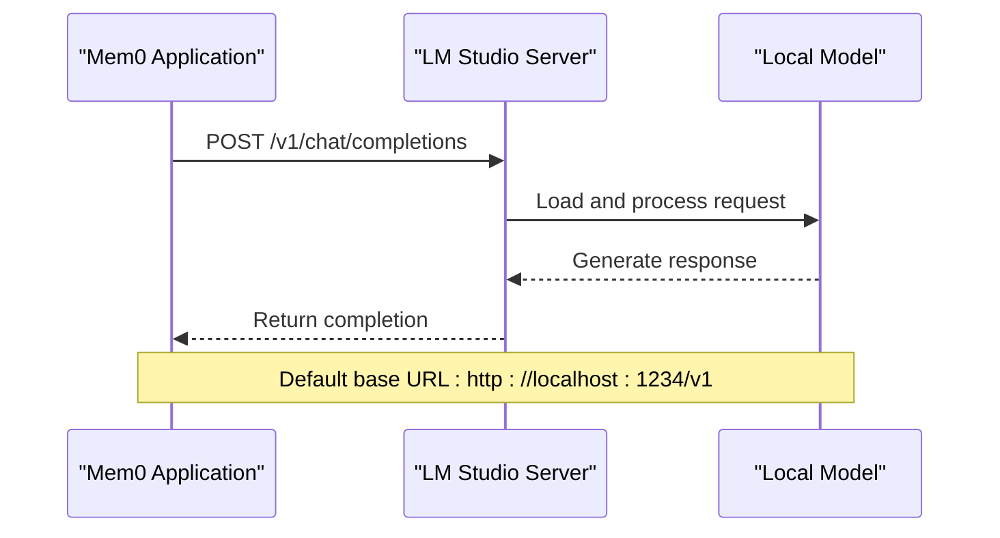
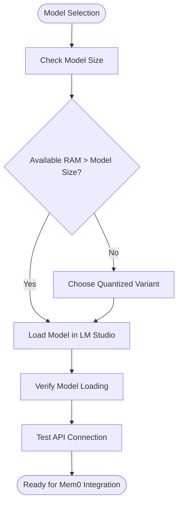
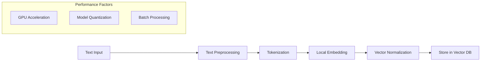
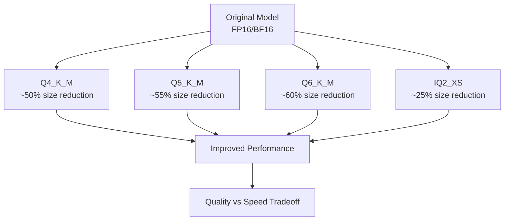

# LM Studio Integration Documentation

<cite>
**Referenced Files in This Document**
- [mem0/configs/llms/lmstudio.py](file://mem0/configs/llms/lmstudio.py)
- [mem0/llms/lmstudio.py](file://mem0/llms/lmstudio.py)
- [mem0/embeddings/lmstudio.py](file://mem0/embeddings/lmstudio.py)
- [tests/llms/test_lm_studio.py](file://tests/llms/test_lm_studio.py)
- [tests/embeddings/test_lm_studio_embeddings.py](file://tests/embeddings/test_lm_studio_embeddings.py)
- [LLM.md](file://LLM.md)
</cite>

## Table of Contents
1. [Introduction](#introduction)
2. [Prerequisites and Requirements](#prerequisites-and-requirements)
3. [Local Server Configuration](#local-server-configuration)
4. [Model Loading and Management](#model-loading-and-management)
5. [LM Studio LLM Configuration](#lm-studio-llm-configuration)
6. [LM Studio Embeddings Configuration](#lm-studio-embeddings-configuration)
7. [Code Examples and Usage Patterns](#code-examples-and-usage-patterns)
8. [Error Handling and Troubleshooting](#error-handling-and-troubleshooting)
9. [Performance Considerations](#performance-considerations)
10. [Security Considerations](#security-considerations)
11. [Community Resources and Documentation](#community-resources-and-documentation)

## Introduction

LM Studio is a powerful desktop application that enables local deployment and management of large language models (LLMs). Mem0 provides seamless integration with LM Studio, allowing you to leverage local models for both text generation and embedding tasks while maintaining privacy and reducing latency.

This integration supports various model formats including GGUF, allows fine-tuning of inference parameters, and provides robust error handling for common deployment scenarios.

## Prerequisites and Requirements

### System Requirements

Before integrating LM Studio with Mem0, ensure your system meets the following requirements:

- **Operating System**: Windows 10/11, macOS 10.15+, or Linux (Ubuntu 18.04+)
- **RAM**: Minimum 8GB, recommended 16GB+ for larger models
- **GPU**: NVIDIA GPU with CUDA support (optional but recommended)
- **Storage**: At least 10GB free space for model downloads and caching
- **Python**: Python 3.8 or higher

### LM Studio Installation

1. Download and install LM Studio from the official website
2. Launch LM Studio and configure your preferred model repositories
3. Ensure the local server is running before connecting Mem0

### Model Compatibility

Mem0 supports models in the following formats through LM Studio:
- GGUF (GGML Universal Format)
- GGML (GPT-Generated Model Library)
- Various quantized variants (Q4_K_M, IQ2_M, etc.)

## Local Server Configuration

### Default Endpoint Configuration

LM Studio provides a local API server that Mem0 connects to by default:



**Diagram sources**
- [mem0/configs/llms/lmstudio.py](file://mem0/configs/llms/lmstudio.py#L58)
- [mem0/llms/lmstudio.py](file://mem0/llms/lmstudio.py#L39)

### Custom Base URL Configuration

You can customize the LM Studio server endpoint by specifying a custom base URL:

| Parameter | Type | Default | Description |
|-----------|------|---------|-------------|
| `lmstudio_base_url` | string | `"http://localhost:1234/v1"` | Custom LM Studio API endpoint |

**Section sources**
- [mem0/configs/llms/lmstudio.py](file://mem0/configs/llms/lmstudio.py#L58)

### Server Status Verification

Before establishing connections, ensure LM Studio is running:

```python
# Verify LM Studio server availability
import requests

def check_lm_studio_status(base_url="http://localhost:1234"):
    try:
        response = requests.get(f"{base_url}/v1/models")
        return response.status_code == 200
    except requests.exceptions.ConnectionError:
        return False
```

## Model Loading and Management

### Model Selection and Loading

LM Studio provides a comprehensive model management interface. Before connecting Mem0, ensure your desired model is:

1. **Downloaded**: Available in LM Studio's model library
2. **Loaded**: Active in the LM Studio interface
3. **Running**: Model is actively serving requests

### Supported Model Formats

Mem0 integrates with LM Studio's model ecosystem:

| Model Type | Example | Quantization | Memory Requirements |
|------------|---------|--------------|-------------------|
| Text Generation | Meta-Llama-3.1-70B-Instruct | IQ2_M, Q4_K_M | 14GB+ |
| Embeddings | nomic-embed-text-v1.5 | f16 | 4GB+ |
| Chat Models | Mistral-7B-Instruct | Q4_K_M | 6GB+ |

### Model Configuration Best Practices



**Section sources**
- [mem0/llms/lmstudio.py](file://mem0/llms/lmstudio.py#L35-L37)
- [mem0/embeddings/lmstudio.py](file://mem0/embeddings/lmstudio.py#L12-L13)

## LM Studio LLM Configuration

### Basic Configuration

Initialize LM Studio LLM with default settings:

```python
from mem0.configs.llms.lmstudio import LMStudioConfig
from mem0.llms.lmstudio import LMStudioLLM

# Basic configuration
config = LMStudioConfig(
    model="lmstudio-community/Meta-Llama-3.1-8B-Instruct-GGUF/Meta-Llama-3.1-8B-Instruct-Q4_K_M.gguf",
    temperature=0.7,
    max_tokens=1000,
    top_p=0.9
)

llm = LMStudioLLM(config)
```

### Advanced Configuration Options

| Parameter | Type | Default | Description |
|-----------|------|---------|-------------|
| `model` | string | Auto-selected | Specific model identifier |
| `temperature` | float | 0.1 | Controls randomness (0.0-1.0) |
| `max_tokens` | int | 2000 | Maximum tokens to generate |
| `top_p` | float | 0.1 | Nucleus sampling parameter |
| `top_k` | int | 1 | Top-k sampling parameter |
| `enable_vision` | bool | False | Enable vision capabilities |
| `vision_details` | string | "auto" | Vision detail level |
| `api_key` | string | "lm-studio" | Authentication key |
| `lmstudio_base_url` | string | "http://localhost:1234/v1" | API endpoint |
| `lmstudio_response_format` | dict | None | Custom response format |

### Custom Response Formats

Configure specific response formats for different use cases:

```python
# JSON object response
json_config = LMStudioConfig(
    model="your-model",
    lmstudio_response_format={"type": "json_object"}
)

# JSON schema response
schema_config = LMStudioConfig(
    model="your-model",
    lmstudio_response_format={
        "type": "json_schema",
        "json_schema": {
            "name": "response_schema",
            "schema": {
                "type": "object",
                "properties": {
                    "answer": {"type": "string"},
                    "confidence": {"type": "number"}
                }
            }
        }
    }
)
```

**Section sources**
- [mem0/configs/llms/lmstudio.py](file://mem0/configs/llms/lmstudio.py#L12-L59)
- [mem0/llms/lmstudio.py](file://mem0/llms/lmstudio.py#L12-L41)

## LM Studio Embeddings Configuration

### Embedding Model Setup

Configure LM Studio for embedding tasks:

```python
from mem0.configs.embeddings.base import BaseEmbedderConfig
from mem0.embeddings.lmstudio import LMStudioEmbedding

# Configure embedding model
embedding_config = BaseEmbedderConfig(
    model="nomic-ai/nomic-embed-text-v1.5-GGUF/nomic-embed-text-v1.5.f16.gguf",
    embedding_dims=1536,
    lmstudio_base_url="http://localhost:1234/v1"
)

embedder = LMStudioEmbedding(embedding_config)
```

### Embedding Dimensions and Compatibility

| Model | Dimensions | Format | Use Case |
|-------|------------|--------|----------|
| nomic-embed-text-v1.5 | 1536 | f16 | General purpose |
| sentence-transformers | 768 | fp32 | Sentence similarity |
| all-MiniLM | 384 | int8 | Lightweight applications |

### Embedding Performance Optimization



**Diagram sources**
- [mem0/embeddings/lmstudio.py](file://mem0/embeddings/lmstudio.py#L19-L29)

**Section sources**
- [mem0/embeddings/lmstudio.py](file://mem0/embeddings/lmstudio.py#L9-L29)

## Code Examples and Usage Patterns

### Basic Text Generation

```python
from mem0.configs.llms.lmstudio import LMStudioConfig
from mem0.llms.lmstudio import LMStudioLLM

# Initialize LLM
config = LMStudioConfig(
    model="lmstudio-community/Meta-Llama-3.1-8B-Instruct-GGUF/Meta-Llama-3.1-8B-Instruct-Q4_K_M.gguf",
    temperature=0.7,
    max_tokens=500
)

llm = LMStudioLLM(config)

# Generate response
messages = [
    {"role": "system", "content": "You are a helpful assistant."},
    {"role": "user", "content": "Explain quantum computing in simple terms."}
]

response = llm.generate_response(messages)
print(response)
```

### Structured Output Generation

```python
from mem0.configs.llms.lmstudio import LMStudioConfig

# Configure for structured output
config = LMStudioConfig(
    model="your-model",
    lmstudio_response_format={
        "type": "json_object"
    }
)

llm = LMStudioLLM(config)

messages = [
    {"role": "system", "content": "Extract information in JSON format."},
    {"role": "user", "content": "John Smith, 30, lives in New York."}
]

response = llm.generate_response(messages)
print(response)  # Returns structured JSON
```

### Memory Integration Example

```python
from mem0 import Memory
from mem0.configs.llms.lmstudio import LMStudioConfig

# Configure memory with LM Studio
memory_config = {
    "llm": {
        "provider": "lmstudio",
        "config": {
            "model": "lmstudio-community/Meta-Llama-3.1-70B-Instruct-GGUF/Meta-Llama-3.1-70B-Instruct-IQ2_M.gguf",
            "temperature": 0.1,
            "max_tokens": 1000
        }
    },
    "embedder": {
        "provider": "lmstudio",
        "config": {
            "model": "nomic-ai/nomic-embed-text-v1.5-GGUF/nomic-embed-text-v1.5.f16.gguf"
        }
    }
}

memory = Memory(config=memory_config)

# Add and retrieve memories
memory.add("User prefers coffee over tea.", user_id="user123")
results = memory.search("beverage preferences", user_id="user123")
```

### Tool Calling with LM Studio

```python
from mem0.configs.llms.lmstudio import LMStudioConfig

# Define tools
tools = [
    {
        "type": "function",
        "function": {
            "name": "get_weather",
            "description": "Get weather information for a location",
            "parameters": {
                "type": "object",
                "properties": {
                    "location": {"type": "string"},
                    "unit": {"type": "string", "enum": ["celsius", "fahrenheit"]}
                }
            }
        }
    }
]

config = LMStudioConfig(
    model="your-model-with-function-calling",
    temperature=0.0
)

llm = LMStudioLLM(config)

messages = [
    {"role": "user", "content": "What's the weather like in San Francisco?"}
]

response = llm.generate_response(
    messages=messages,
    tools=tools,
    tool_choice="auto"
)

print(response)  # Contains tool calls if applicable
```

**Section sources**
- [tests/llms/test_lm_studio.py](file://tests/llms/test_lm_studio.py#L20-L72)
- [tests/embeddings/test_lm_studio_embeddings.py](file://tests/embeddings/test_lm_studio_embeddings.py#L18-L29)

## Error Handling and Troubleshooting

### Common Connection Issues

#### Connection Refused Error

**Symptoms**: `ConnectionRefusedError` or timeout errors

**Causes**:
- LM Studio server not running
- Incorrect base URL configuration
- Port conflicts (default: 1234)

**Solutions**:
```python
import requests

def diagnose_connection(base_url="http://localhost:1234"):
    try:
        # Check if server is running
        response = requests.get(f"{base_url}/v1/models", timeout=5)
        if response.status_code == 200:
            print("✓ LM Studio server is running")
            return True
        else:
            print(f"✗ Unexpected response: {response.status_code}")
            return False
    except requests.exceptions.ConnectTimeout:
        print("✗ Connection timeout - check if LM Studio is running")
        return False
    except requests.exceptions.ConnectionError:
        print("✗ Connection refused - LM Studio may not be running")
        return False

# Verify connection before proceeding
if not diagnose_connection():
    print("Please start LM Studio and ensure it's listening on port 1234")
```

#### Model Not Loaded Error

**Symptoms**: `ModelNotFoundError` or empty model lists

**Causes**:
- Model not downloaded
- Model not loaded in LM Studio
- Insufficient memory

**Solutions**:
```python
def check_model_availability(base_url="http://localhost:1234"):
    try:
        response = requests.get(f"{base_url}/v1/models")
        models = response.json().get('data', [])
        
        if not models:
            print("✗ No models available. Please load a model in LM Studio.")
            return False
        
        print(f"✓ Available models: {[m['id'] for m in models]}")
        return True
        
    except Exception as e:
        print(f"✗ Error checking models: {e}")
        return False
```

### Request Validation Errors

#### Invalid Parameters

**Common Issues**:
- Temperature out of range (0.0-1.0)
- Max tokens too high for model context
- Invalid response format specification

**Prevention**:
```python
def validate_lmstudio_config(config_dict):
    """Validate LM Studio configuration parameters"""
    errors = []
    
    # Temperature validation
    if 'temperature' in config_dict:
        temp = config_dict['temperature']
        if not 0.0 <= temp <= 1.0:
            errors.append(f"Temperature must be between 0.0 and 1.0, got {temp}")
    
    # Max tokens validation
    if 'max_tokens' in config_dict:
        max_tokens = config_dict['max_tokens']
        if max_tokens <= 0:
            errors.append(f"Max tokens must be positive, got {max_tokens}")
    
    # Model validation
    if 'model' in config_dict and not config_dict['model']:
        errors.append("Model cannot be empty")
    
    return errors
```

### Memory and Resource Issues

#### Out of Memory Errors

**Symptoms**: `OutOfMemoryError` or slow response times

**Solutions**:
1. Use quantized model variants (Q4_K_M, IQ2_M)
2. Reduce batch sizes
3. Close other applications
4. Increase virtual memory

#### Performance Degradation

**Monitoring**:
```python
import psutil
import time

def monitor_resources():
    """Monitor system resources during inference"""
    cpu_percent = psutil.cpu_percent(interval=1)
    memory = psutil.virtual_memory()
    disk_usage = psutil.disk_usage('/')
    
    print(f"CPU: {cpu_percent}%")
    print(f"Memory: {memory.percent}% ({memory.available / 1024**2:.1f}MB free)")
    print(f"Disk: {disk_usage.percent}%")
    
    return {
        'cpu_percent': cpu_percent,
        'memory_percent': memory.percent,
        'available_memory_mb': memory.available / 1024**2
    }
```

### Debugging Tools

#### Enable Verbose Logging

```python
import logging

# Enable debug logging for LM Studio integration
logging.basicConfig(level=logging.DEBUG)
logger = logging.getLogger(__name__)

# Monitor API requests
import http.client as http_client
http_client.HTTPConnection.debuglevel = 1
```

#### Request/Response Inspection

```python
def inspect_api_request(client, **kwargs):
    """Inspect API requests for debugging"""
    print("API Request Parameters:")
    for key, value in kwargs.items():
        print(f"  {key}: {value}")
    
    try:
        response = client.chat.completions.create(**kwargs)
        print("✓ Request successful")
        print(f"Response length: {len(response.choices[0].message.content)}")
        return response
    except Exception as e:
        print(f"✗ Request failed: {e}")
        raise
```

**Section sources**
- [mem0/llms/lmstudio.py](file://mem0/llms/lmstudio.py#L41-L42)

## Performance Considerations

### Hardware Requirements

#### GPU Memory Requirements

| Model Size | Quantization | Recommended GPU | Minimum VRAM |
|------------|--------------|-----------------|--------------|
| 7B parameters | Q4_K_M | GTX 1660 Ti | 6GB |
| 7B parameters | FP16 | RTX 3060 | 8GB |
| 13B parameters | Q4_K_M | RTX 3070 | 10GB |
| 70B parameters | IQ2_M | RTX 4090 | 16GB |

#### CPU Considerations

- **Multi-core support**: Enable parallel processing
- **Cache optimization**: Ensure adequate L3 cache
- **Memory bandwidth**: Faster RAM improves performance

### Quantization Options

#### Available Quantization Levels



#### Quantization Impact

| Quantization | Size Reduction | Quality Loss | Speed Improvement |
|--------------|----------------|--------------|-------------------|
| FP16 | 100% | Minimal | Baseline |
| Q4_K_M | ~50% | Low | 2-3x faster |
| Q5_K_M | ~55% | Very Low | 2.5-3.5x faster |
| IQ2_M | ~25% | Moderate | 1.5-2x faster |

### Optimization Strategies

#### Model Loading Optimization

```python
from mem0.configs.llms.lmstudio import LMStudioConfig

# Optimize model loading
config = LMStudioConfig(
    model="lmstudio-community/Meta-Llama-3.1-8B-Instruct-GGUF/Meta-Llama-3.1-8B-Instruct-Q4_K_M.gguf",
    # Use quantized models for better performance
    temperature=0.1,  # Lower temperature for consistency
    max_tokens=512,   # Reasonable context window
    top_p=0.9         # Balanced sampling
)
```

#### Batch Processing

```python
def batch_process_messages(llm, messages_list, batch_size=5):
    """Process multiple message batches efficiently"""
    results = []
    
    for i in range(0, len(messages_list), batch_size):
        batch = messages_list[i:i+batch_size]
        batch_results = []
        
        for messages in batch:
            try:
                result = llm.generate_response(messages)
                batch_results.append(result)
            except Exception as e:
                print(f"Error processing batch {i}: {e}")
                batch_results.append(None)
        
        results.extend(batch_results)
        # Small delay between batches to prevent resource exhaustion
        time.sleep(0.1)
    
    return results
```

#### Caching Strategies

```python
from functools import lru_cache
import hashlib

class LMStudioCache:
    def __init__(self, max_size=1000):
        self.cache = {}
        self.max_size = max_size
    
    def _hash_key(self, messages, **kwargs):
        """Create hash key for caching"""
        key_data = str(messages) + str(kwargs)
        return hashlib.md5(key_data.encode()).hexdigest()
    
    def get(self, messages, **kwargs):
        key = self._hash_key(messages, **kwargs)
        return self.cache.get(key)
    
    def set(self, messages, result, **kwargs):
        if len(self.cache) >= self.max_size:
            # Remove oldest entry
            oldest_key = next(iter(self.cache))
            del self.cache[oldest_key]
        
        key = self._hash_key(messages, **kwargs)
        self.cache[key] = result
```

### Network and Latency Optimization

#### Local Network Configuration

```python
# Optimize local network settings
import socket

def optimize_network_settings():
    """Optimize network settings for local LM Studio"""
    # Increase buffer sizes
    socket.setdefaulttimeout(30)
    
    # Disable unnecessary network features
    # This is platform-dependent and may require system-level configuration
```

#### Connection Pooling

```python
from openai import OpenAI
import threading

class OptimizedLMStudioClient:
    def __init__(self, base_url="http://localhost:1234/v1"):
        self.client = OpenAI(base_url=base_url, api_key="lm-studio")
        self.session_pool = []
        self.pool_lock = threading.Lock()
    
    def get_session(self):
        with self.pool_lock:
            if not self.session_pool:
                return OpenAI(base_url="http://localhost:1234/v1", api_key="lm-studio")
            return self.session_pool.pop()
    
    def release_session(self, session):
        with self.pool_lock:
            if len(self.session_pool) < 10:  # Limit pool size
                self.session_pool.append(session)
```

**Section sources**
- [LLM.md](file://LLM.md#L1261-L1309)

## Security Considerations

### Local Model Security

#### Model Access Control

LM Studio provides several security mechanisms:

1. **API Key Protection**: Default key "lm-studio" can be changed
2. **Local Network Binding**: Server binds to localhost by default
3. **File Permissions**: Model files protected by OS permissions

#### Secure Configuration

```python
from mem0.configs.llms.lmstudio import LMStudioConfig

# Secure configuration with custom API key
secure_config = LMStudioConfig(
    model="your-model",
    api_key="your-custom-strong-key",  # Change default key
    lmstudio_base_url="http://localhost:1234/v1",  # Explicit localhost binding
    # Disable unnecessary features
    enable_vision=False,
    top_k=1
)
```

### Network Security

#### Localhost Binding

```python
# Ensure LM Studio binds only to localhost
def verify_localhost_binding(base_url="http://localhost:1234"):
    """Verify server is bound to localhost only"""
    import socket
    
    try:
        # Check if server responds to localhost
        sock = socket.socket(socket.AF_INET, socket.SOCK_STREAM)
        sock.settimeout(2)
        result = sock.connect_ex(('127.0.0.1', 1234))
        sock.close()
        
        if result == 0:
            print("✓ Server bound to localhost only")
            return True
        else:
            print("✗ Server may be accessible from external networks")
            return False
            
    except Exception as e:
        print(f"✗ Error verifying binding: {e}")
        return False
```

#### Firewall Configuration

```bash
# Windows PowerShell
netsh advfirewall firewall add rule name="LM Studio API" dir=in action=allow protocol=TCP localport=1234

# Linux (UFW)
sudo ufw allow 1234/tcp comment "LM Studio API"

# macOS
sudo pfctl -f /etc/pf.conf
echo "block in quick proto tcp from any to any port 1234" >> /etc/pf.conf
```

### Data Privacy

#### Local Processing Benefits

- **No data transmission**: All processing occurs locally
- **Model confidentiality**: Private models remain on-device
- **Compliance**: Suitable for sensitive environments

#### Data Handling Best Practices

```python
def sanitize_input(text):
    """Sanitize input before sending to LM Studio"""
    # Remove potentially sensitive information
    import re
    sanitized = re.sub(r'\b\d{3}-\d{2}-\d{4}\b', '[SSN]', text)
    sanitized = re.sub(r'\b\d{4}[- ]?\d{4}[- ]?\d{4}[- ]?\d{4}\b', '[CARD]', sanitized)
    return sanitized

def secure_memory_management():
    """Secure memory handling for sensitive data"""
    import gc
    import weakref
    
    # Clear sensitive data from memory
    sensitive_data = ["password", "api_key", "secret"]
    for data in sensitive_data:
        del data
    gc.collect()
```

### Monitoring and Auditing

#### Activity Logging

```python
import logging
from datetime import datetime

class LMStudioLogger:
    def __init__(self, log_file="lmstudio_activity.log"):
        self.logger = logging.getLogger("lmstudio")
        handler = logging.FileHandler(log_file)
        formatter = logging.Formatter('%(asctime)s - %(message)s')
        handler.setFormatter(formatter)
        self.logger.addHandler(handler)
        self.logger.setLevel(logging.INFO)
    
    def log_request(self, model, tokens, duration):
        self.logger.info(f"Model: {model}, Tokens: {tokens}, Duration: {duration:.2f}s")
    
    def log_error(self, error_type, details):
        self.logger.error(f"Error: {error_type}, Details: {details}")

# Usage
logger = LMStudioLogger()

try:
    # Your LM Studio code here
    pass
except Exception as e:
    logger.log_error(type(e).__name__, str(e))
```

#### Resource Monitoring

```python
import psutil
import time

class SecurityMonitor:
    def __init__(self):
        self.alert_thresholds = {
            'cpu_percent': 90,
            'memory_percent': 95,
            'disk_percent': 90
        }
    
    def check_security(self):
        """Check for security-related resource issues"""
        alerts = []
        
        # Check system resources
        cpu = psutil.cpu_percent(interval=1)
        memory = psutil.virtual_memory()
        disk = psutil.disk_usage('/')
        
        if cpu > self.alert_thresholds['cpu_percent']:
            alerts.append(f"High CPU usage: {cpu}%")
        
        if memory.percent > self.alert_thresholds['memory_percent']:
            alerts.append(f"High memory usage: {memory.percent}%")
        
        if disk.percent > self.alert_thresholds['disk_percent']:
            alerts.append(f"High disk usage: {disk.percent}%")
        
        return alerts
```

## Community Resources and Documentation

### Official Documentation

- **LM Studio Website**: https://lmstudio.ai/
- **GitHub Repository**: https://github.com/LMStudio-AI/LMStudio
- **Documentation Hub**: Comprehensive guides and tutorials

### Model Repositories

#### Popular Model Sources

1. **LM Studio Community Models**
   - Repository: `lmstudio-community/`
   - Examples: Meta-Llama-3.1 series, Mistral models

2. **Hugging Face Hub**
   - Compatible GGUF models
   - Community contributions

3. **Local Model Storage**
   - Custom model uploads
   - Personal model collections

### Community Support

#### Forums and Discussion

- **Discord Community**: Real-time support and discussions
- **GitHub Issues**: Bug reports and feature requests
- **Reddit Subreddits**: Community discussions and tips

#### Best Practices Sharing

```python
# Community-contributed optimization tips
community_optimizations = {
    "quantization": {
        "best_for": "speed",
        "models": ["Meta-Llama-3.1-8B-Instruct-Q4_K_M.gguf"],
        "tradeoffs": "Minimal quality loss"
    },
    "memory_management": {
        "strategy": "quantized_models + batch_processing",
        "expected_performance": "2-3x improvement"
    }
}
```

### Integration Examples

#### Production Deployment

```python
from mem0.configs.llms.lmstudio import LMStudioConfig
from mem0.llms.lmstudio import LMStudioLLM
import threading
import queue

class ProductionLMStudioClient:
    def __init__(self, model="default-model", max_concurrent=5):
        self.config = LMStudioConfig(
            model=model,
            temperature=0.1,
            max_tokens=2000
        )
        self.llm = LMStudioLLM(self.config)
        self.request_queue = queue.Queue()
        self.worker_threads = []
        self.max_concurrent = max_concurrent
        
        # Start worker threads
        for _ in range(max_concurrent):
            thread = threading.Thread(target=self._worker)
            thread.daemon = True
            thread.start()
            self.worker_threads.append(thread)
    
    def _worker(self):
        while True:
            try:
                request = self.request_queue.get()
                if request is None:
                    break
                messages, callback = request
                result = self.llm.generate_response(messages)
                callback(result)
            except Exception as e:
                print(f"Worker error: {e}")
            finally:
                self.request_queue.task_done()
    
    def generate_async(self, messages, callback):
        self.request_queue.put((messages, callback))
    
    def shutdown(self):
        for _ in range(self.max_concurrent):
            self.request_queue.put(None)
        for thread in self.worker_threads:
            thread.join()
```

#### Testing and Validation

```python
import unittest
from unittest.mock import Mock, patch

class TestLMStudioIntegration(unittest.TestCase):
    def setUp(self):
        self.config = LMStudioConfig(
            model="test-model",
            temperature=0.7
        )
        self.llm = LMStudioLLM(self.config)
    
    @patch('mem0.llms.lmstudio.OpenAI')
    def test_basic_generation(self, mock_openai):
        # Setup mock response
        mock_completion = Mock()
        mock_completion.choices = [Mock(message=Mock(content="Test response"))]
        mock_openai.return_value.chat.completions.create.return_value = mock_completion
        
        # Test generation
        messages = [{"role": "user", "content": "Hello"}]
        result = self.llm.generate_response(messages)
        
        # Verify results
        self.assertEqual(result, "Test response")
        mock_openai.return_value.chat.completions.create.assert_called_once()
    
    def test_error_handling(self):
        # Test error handling scenario
        with patch.object(self.llm.client, 'chat', side_effect=Exception("Connection error")):
            with self.assertRaises(Exception):
                self.llm.generate_response([{"role": "user", "content": "Test"}])

if __name__ == '__main__':
    unittest.main()
```

### Performance Benchmarking

#### Comparative Analysis

```python
import time
import pandas as pd

def benchmark_lmstudio_models(models_to_test):
    """Benchmark different LM Studio models"""
    results = []
    
    for model in models_to_test:
        config = LMStudioConfig(model=model, temperature=0.1)
        llm = LMStudioLLM(config)
        
        # Warm-up
        warmup_messages = [{"role": "user", "content": "Hello"}]
        llm.generate_response(warmup_messages)
        
        # Benchmark
        start_time = time.time()
        for _ in range(10):
            llm.generate_response(warmup_messages)
        end_time = time.time()
        
        avg_time = (end_time - start_time) / 10
        results.append({
            'model': model,
            'avg_response_time': avg_time,
            'throughput': 10 / (end_time - start_time)
        })
    
    return pd.DataFrame(results)

# Usage
models = [
    "lmstudio-community/Meta-Llama-3.1-8B-Instruct-GGUF/Meta-Llama-3.1-8B-Instruct-Q4_K_M.gguf",
    "lmstudio-community/Meta-Llama-3.1-70B-Instruct-GGUF/Meta-Llama-3.1-70B-Instruct-IQ2_M.gguf"
]

benchmark_results = benchmark_lmstudio_models(models)
print(benchmark_results)
```

This comprehensive documentation provides everything needed to successfully integrate LM Studio with Mem0, from basic setup to advanced optimization and security considerations. The examples and troubleshooting guides ensure smooth deployment in production environments while maintaining the privacy and performance benefits of local model inference.