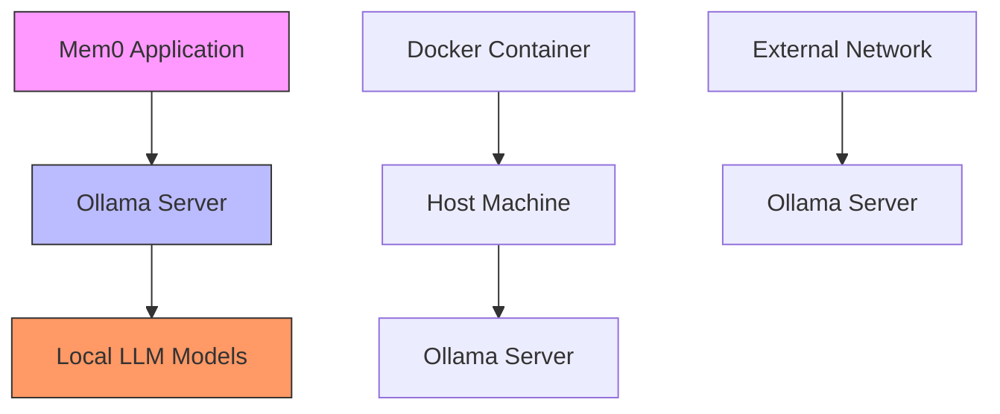
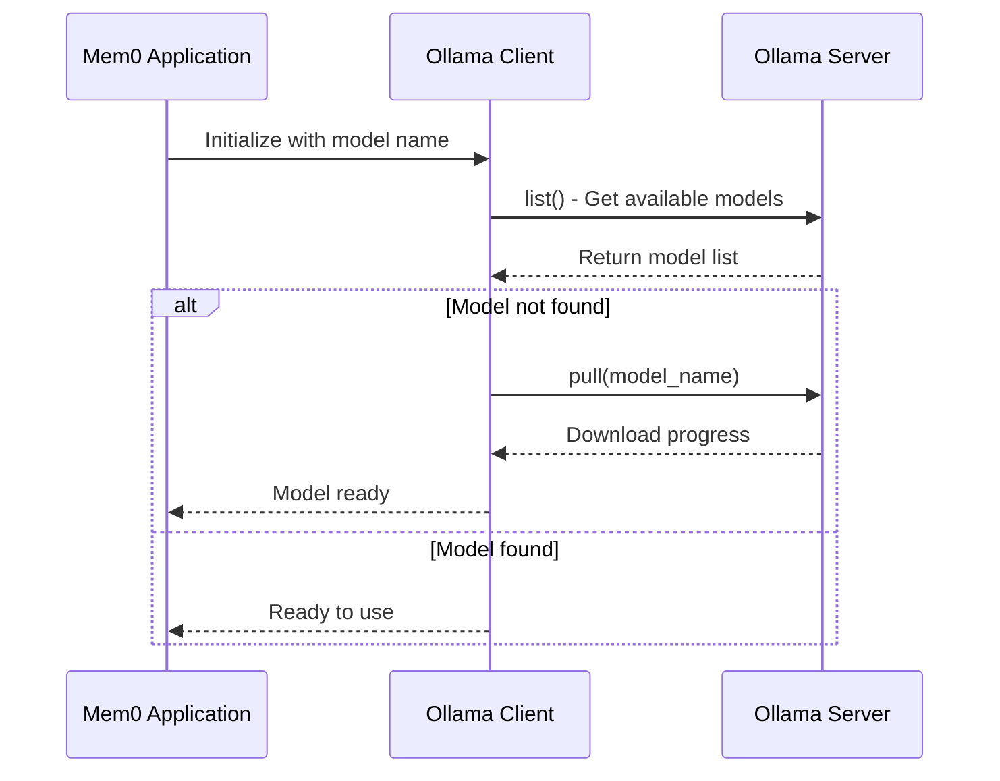
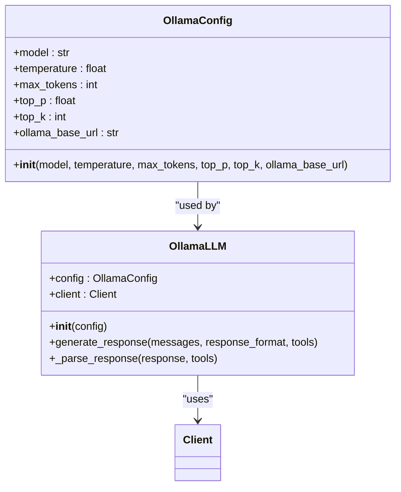
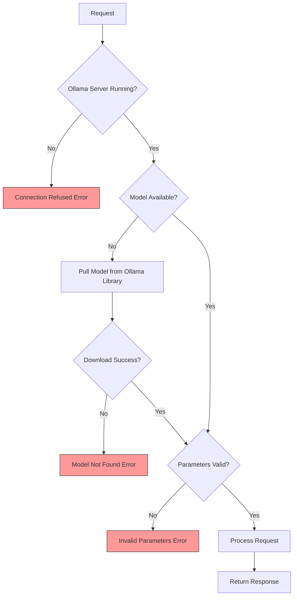
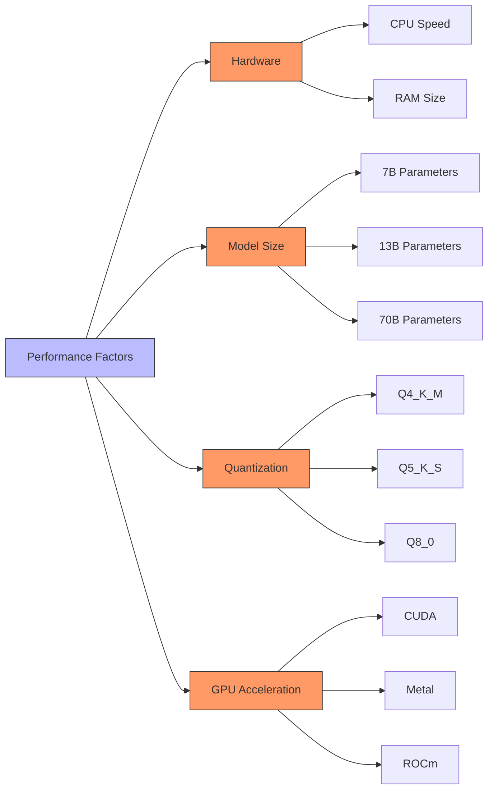
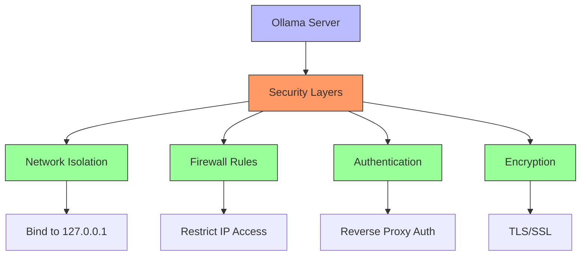
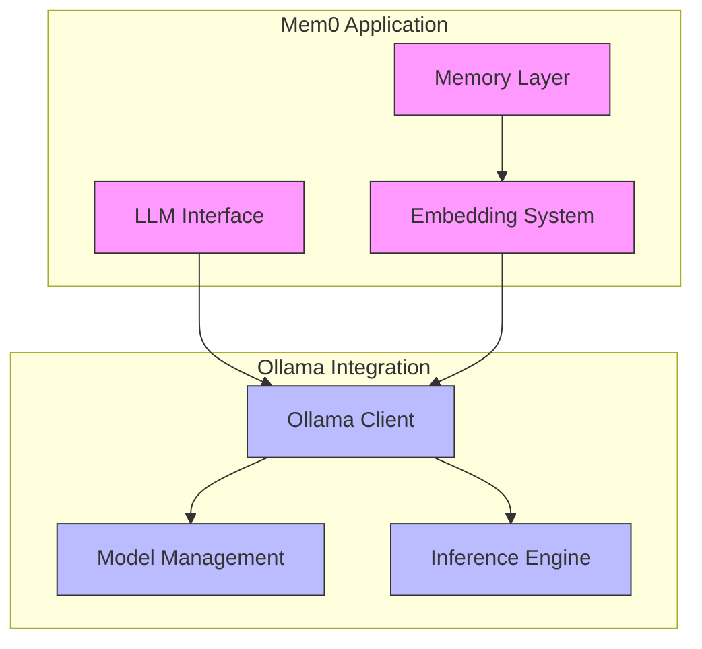

# Ollama

<cite>
**Referenced Files in This Document**   
- [ollama.py](file://mem0/llms/ollama.py)
- [ollama.py](file://mem0/embeddings/ollama.py)
- [ollama.py](file://embedchain/embedchain/llm/ollama.py)
- [ollama.py](file://embedchain/embedchain/embedder/ollama.py)
- [ollama.py](file://mem0-ts/src/oss/src/llms/ollama.ts)
- [ollama.py](file://mem0-ts/src/oss/src/embeddings/ollama.ts)
- [ollama.yaml](file://embedchain/configs/ollama.yaml)
- [ollama.ipynb](file://embedchain/notebooks/ollama.ipynb)
- [test_ollama.py](file://tests/llms/test_ollama.py)
- [test_ollama_embeddings.py](file://tests/embeddings/test_ollama_embeddings.py)
- [ollama.py](file://mem0/configs/llms/ollama.py)
- [memory.py](file://openmemory/api/app/utils/memory.py)
</cite>

## Table of Contents
1. [Introduction](#introduction)
2. [Ollama Server Configuration](#ollama-server-configuration)
3. [Model Management](#model-management)
4. [Ollama LLM Initialization](#ollama-llm-initialization)
5. [Error Handling](#error-handling)
6. [Performance Considerations](#performance-considerations)
7. [Security Considerations](#security-considerations)
8. [Configuration Examples](#configuration-examples)
9. [Integration with Mem0](#integration-with-mem0)

## Introduction

Ollama integration in Mem0 enables local inference with large language models, providing a privacy-preserving and cost-effective solution for AI applications. This documentation covers the complete integration process, from server configuration to advanced usage patterns. The integration supports both language models (LLMs) and embedding models, allowing for comprehensive AI functionality without relying on external APIs.

The Ollama integration in Mem0 is designed to work seamlessly with various models including llama2, mistral, and other models available in the Ollama library. The system automatically handles model downloading, local storage, and inference execution, making it easy to deploy AI applications with minimal setup.

**Section sources**
- [ollama.py](file://mem0/llms/ollama.py#L1-L115)
- [ollama.py](file://mem0/embeddings/ollama.py#L1-L54)

## Ollama Server Configuration

Ollama must be running as a service to enable integration with Mem0. The default endpoint is `http://localhost:11434`, which is automatically configured in the Ollama client. This endpoint can be customized using the `ollama_base_url` parameter in the configuration.

The Ollama server can be started by running the `ollama serve` command after installation. Once running, the server exposes a REST API that Mem0 uses to communicate with the models. The server must remain active during the entire operation of the Mem0 application.

For Docker environments, special considerations are needed to ensure proper connectivity between containers. The system automatically detects Docker environments and adjusts the host URL accordingly, using `host.docker.internal` on Docker Desktop for Mac/Windows or the Docker bridge gateway IP on Linux systems.



**Diagram sources**
- [ollama.py](file://mem0/llms/ollama.py#L39)
- [memory.py](file://openmemory/api/app/utils/memory.py#L50-L100)

**Section sources**
- [ollama.py](file://mem0/llms/ollama.py#L39)
- [memory.py](file://openmemory/api/app/utils/memory.py#L50-L100)

## Model Management

Model management in Ollama integration involves specifying model names and ensuring they are available locally. Common models supported include `llama2`, `mistral`, `llama3.1:70b`, and `nomic-embed-text`. The model name is specified in the configuration, and if not provided, default models are used (`llama3.1:70b` for LLMs and `nomic-embed-text` for embeddings).

Models are pulled automatically when they are not found locally. The system checks the list of available local models using the Ollama client's `list()` method and compares it with the requested model. If the model is not present, it is automatically pulled using the `pull()` method.

The Ollama CLI provides commands for manual model management:
- `ollama pull <model_name>` - Download a model from the Ollama library
- `ollama run <model_name>` - Run a model and test its functionality
- `ollama list` - List all locally available models
- `ollama serve` - Start the Ollama server



**Diagram sources**
- [ollama.py](file://mem0/llms/ollama.py#L30-L37)
- [ollama.py](file://mem0/embeddings/ollama.py#L34-L41)

**Section sources**
- [ollama.py](file://mem0/llms/ollama.py#L30-L37)
- [ollama.py](file://mem0/embeddings/ollama.py#L34-L41)

## Ollama LLM Initialization

Initializing the Ollama LLM in Mem0 involves configuring custom parameters such as temperature, num_ctx (max_tokens), and repeat_penalty (top_p). These parameters control the behavior of the language model during inference.

The initialization process accepts a configuration object that extends the base LLM configuration with Ollama-specific parameters. Key parameters include:
- `model`: The model name to use (e.g., "llama2", "mistral")
- `temperature`: Controls randomness in responses (default: 0.1)
- `max_tokens`: Maximum tokens to generate (default: 2000)
- `top_p`: Nucleus sampling parameter (default: 0.1)
- `top_k`: Top-k sampling parameter (default: 1)
- `ollama_base_url`: Custom Ollama server URL (default: None)

The configuration is automatically converted to Ollama's expected format, where parameters like `max_tokens` are mapped to `num_predict` in the Ollama API.



**Diagram sources**
- [ollama.py](file://mem0/configs/llms/ollama.py#L6-L57)
- [ollama.py](file://mem0/llms/ollama.py#L13-L115)

**Section sources**
- [ollama.py](file://mem0/configs/llms/ollama.py#L6-L57)
- [ollama.py](file://mem0/llms/ollama.py#L13-L115)

## Error Handling

The Ollama integration includes comprehensive error handling for common issues that may arise during operation. The system is designed to provide clear error messages and recovery strategies for various failure scenarios.

Connection issues are handled by validating that the Ollama server is running and accessible. If a connection cannot be established, the system raises a clear error message indicating that the Ollama service must be running. This typically manifests as a "connection refused" error when the server is not active on the expected port.

Model-related errors are handled through pre-flight checks. When a model is specified that does not exist locally, the system automatically attempts to pull it from the Ollama library. If the model name is invalid or the download fails, appropriate error messages are provided. The system checks for model availability using the `list()` method before attempting inference.

Invalid parameter errors are caught during configuration validation. The system validates that all parameters are within acceptable ranges and of the correct type. For example, temperature values are validated to be between 0 and 1, and token limits are checked for reasonable values.



**Diagram sources**
- [ollama.py](file://mem0/llms/ollama.py#L30-L37)
- [ollama.py](file://mem0/embeddings/ollama.py#L34-L41)

**Section sources**
- [ollama.py](file://mem0/llms/ollama.py#L30-L37)
- [ollama.py](file://mem0/embeddings/ollama.py#L34-L41)

## Performance Considerations

Local inference with Ollama offers several performance advantages and considerations. The primary benefit is reduced latency compared to cloud-based APIs, as requests do not need to traverse the internet. However, performance is dependent on local hardware capabilities, particularly GPU availability and memory.

GPU acceleration is supported through Ollama's built-in GPU integration. When available, Ollama automatically utilizes GPU resources for faster inference. The performance improvement can be substantial, with GPU-accelerated inference often being several times faster than CPU-only execution.

Model quantization levels significantly impact performance and resource usage. Ollama supports various quantization levels (e.g., 4-bit, 8-bit) that reduce model size and memory requirements at the cost of some accuracy. Smaller quantized models can run on systems with limited RAM and provide faster response times.

Memory management is critical for optimal performance. Large models require significant RAM, and running multiple models simultaneously can exhaust system resources. It's recommended to close unused applications and ensure adequate swap space when running large models.



**Diagram sources**
- [ollama.py](file://mem0/llms/ollama.py#L103-L108)
- [ollama.py](file://mem0/embeddings/ollama.py#L52)

**Section sources**
- [ollama.py](file://mem0/llms/ollama.py#L103-L108)
- [ollama.py](file://mem0/embeddings/ollama.py#L52)

## Security Considerations

Security is a critical aspect of Ollama server deployment. When exposing Ollama servers, several security considerations must be addressed to prevent unauthorized access and potential vulnerabilities.

By default, Ollama runs on localhost (127.0.0.1), which restricts access to the local machine only. This provides a secure default configuration that prevents external access. If remote access is required, the server should be configured with proper authentication and encryption.

Network exposure should be minimized. If the Ollama server must be accessible from external networks, it should be protected by a firewall and ideally placed behind a reverse proxy with TLS encryption. The server should not be exposed directly to the internet without proper security measures.

Authentication mechanisms should be implemented when sharing the server across multiple users or applications. While Ollama does not have built-in authentication, external authentication can be implemented using reverse proxies or API gateways.



**Diagram sources**
- [memory.py](file://openmemory/api/app/utils/memory.py#L50-L100)
- [ollama.py](file://mem0/llms/ollama.py#L39)

**Section sources**
- [memory.py](file://openmemory/api/app/utils/memory.py#L50-L100)

## Configuration Examples

Configuration examples demonstrate how to set up Ollama integration in Mem0 with various parameters. The configuration can be specified in YAML files, Python code, or through the API.

For YAML configuration, the `ollama.yaml` file provides a template with default settings:

```yaml
llm:
  provider: ollama
  config:
    model: 'llama2'
    temperature: 0.5
    top_p: 1
    stream: true
    base_url: http://localhost:11434

embedder:
  provider: ollama
  config:
    model: 'mxbai-embed-large:latest'
    base_url: http://localhost:11434
```

In Python code, the configuration can be created programmatically:

```python
from mem0.configs.llms.ollama import OllamaConfig
from mem0.llms.ollama import OllamaLLM

config = OllamaConfig(
    model="llama3.1:70b",
    temperature=0.7,
    max_tokens=2000,
    top_p=0.9,
    ollama_base_url="http://localhost:11434"
)

llm = OllamaLLM(config)
```

**Section sources**
- [ollama.yaml](file://embedchain/configs/ollama.yaml#L1-L15)
- [ollama.py](file://mem0/configs/llms/ollama.py#L6-L57)

## Integration with Mem0

The integration of Ollama with Mem0 provides a complete local AI solution that combines language understanding with persistent memory. This integration enables AI applications to maintain context across conversations while preserving user privacy.

The integration works at multiple levels:
- LLM integration for natural language processing and generation
- Embedding integration for semantic search and memory retrieval
- Configuration system for easy setup and customization

The system automatically handles the lifecycle of Ollama models, including downloading, caching, and cleanup. This ensures that models are available when needed without requiring manual intervention.



**Diagram sources**
- [ollama.py](file://mem0/llms/ollama.py#L13-L115)
- [ollama.py](file://mem0/embeddings/ollama.py#L24-L54)

**Section sources**
- [ollama.py](file://mem0/llms/ollama.py#L13-L115)
- [ollama.py](file://mem0/embeddings/ollama.py#L24-L54)