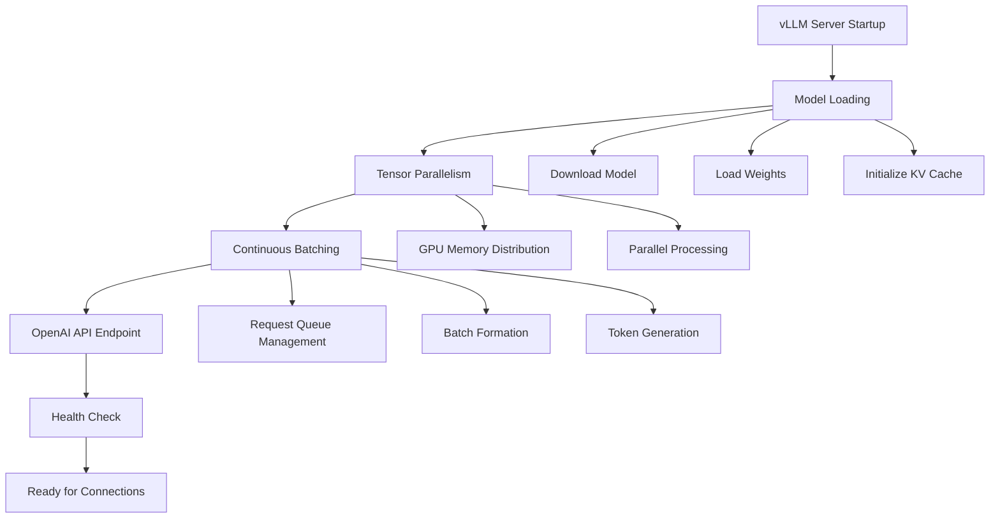
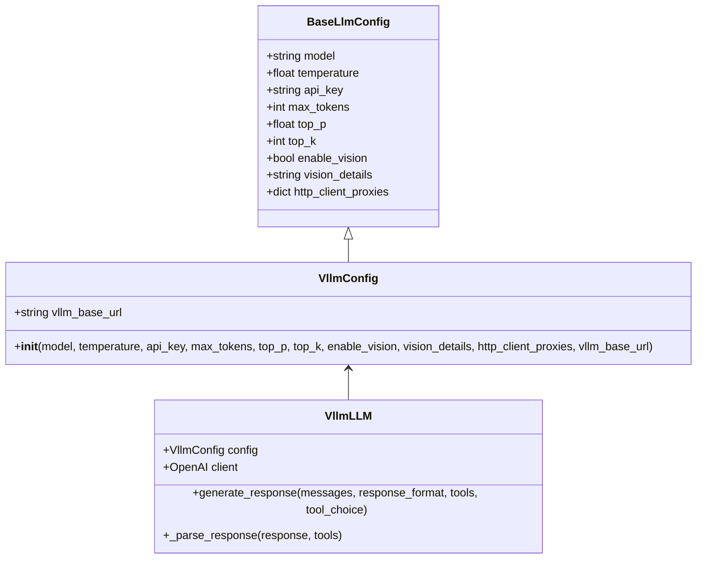
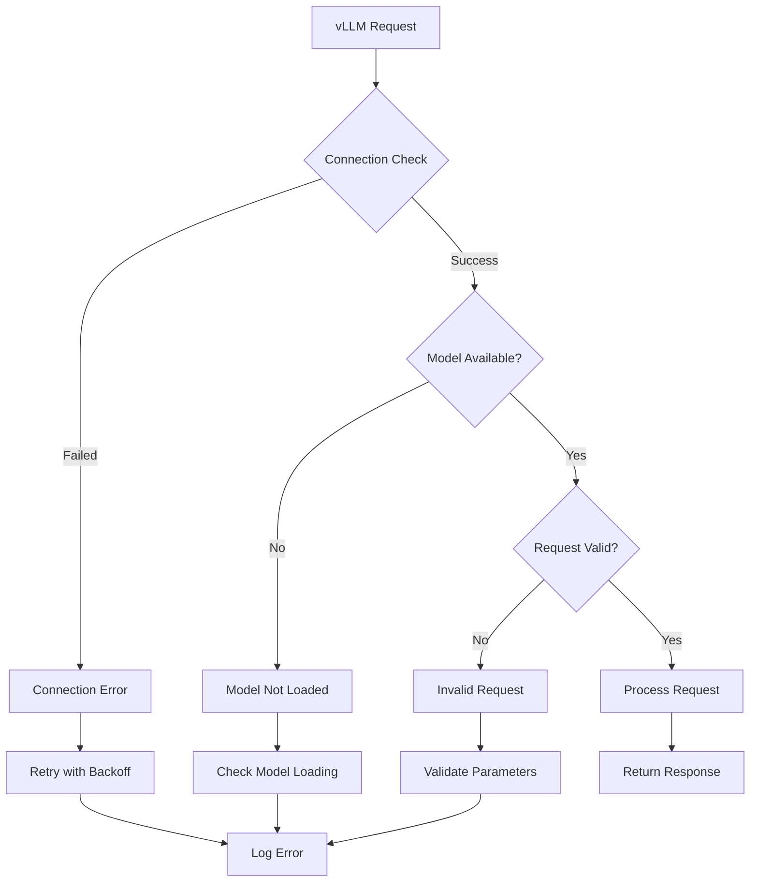
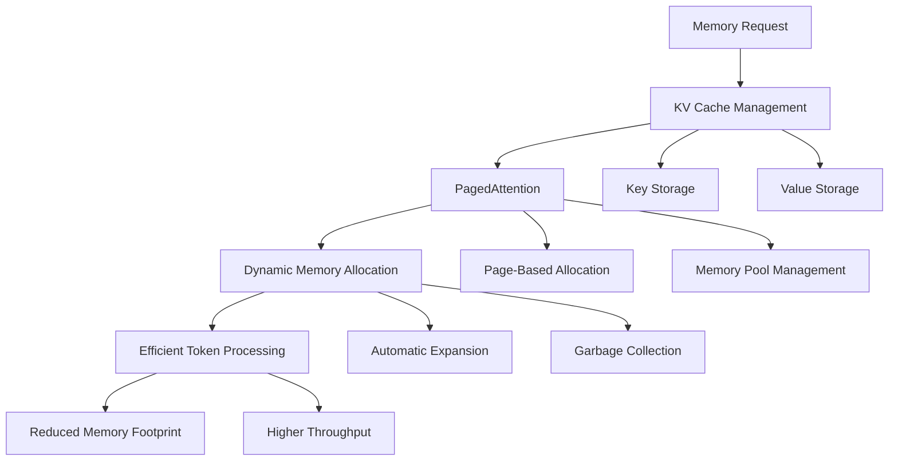
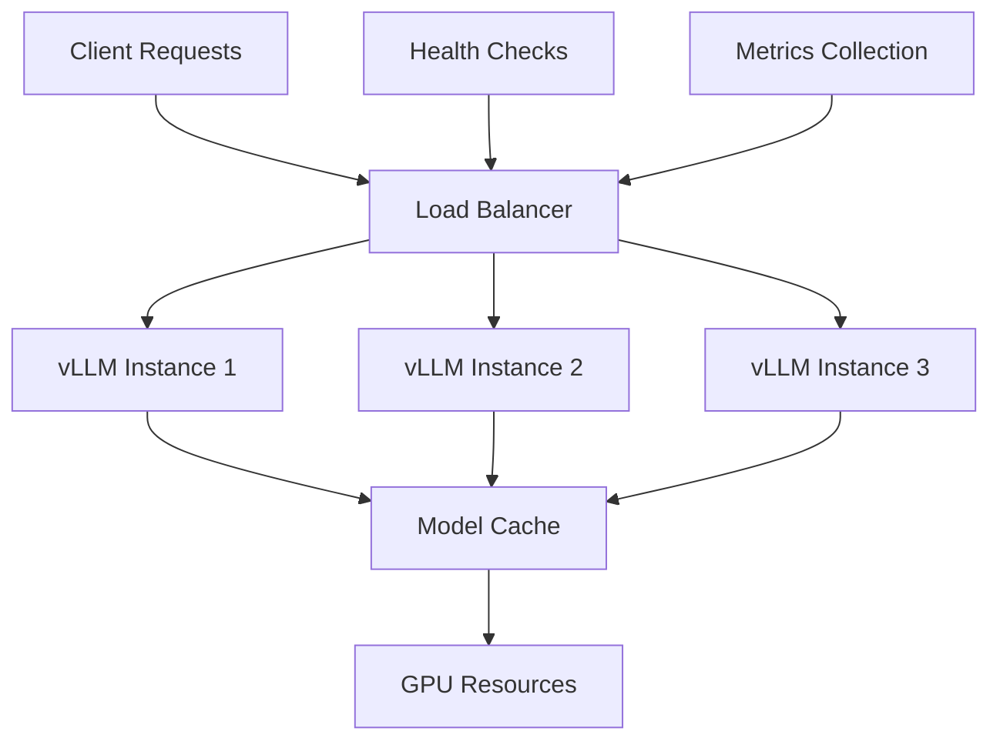

# vLLM Integration in Mem0

<cite>
**Referenced Files in This Document**
- [vllm.py](file://mem0/configs/llms/vllm.py)
- [vllm.py](file://mem0/llms/vllm.py)
- [vllm_example.py](file://examples/misc/vllm_example.py)
- [test_vllm.py](file://tests/llms/test_vllm.py)
- [base.py](file://mem0/configs/llms/base.py)
- [base.py](file://mem0/llms/base.py)
- [vllm.yaml](file://embedchain/embedchain/configs/vllm.yaml)
</cite>

## Table of Contents
1. [Introduction](#introduction)
2. [vLLM Server Setup](#vllm-server-setup)
3. [Configuration](#configuration)
4. [Initialization and Usage](#initialization-and-usage)
5. [Advanced Parameters](#advanced-parameters)
6. [Error Handling](#error-handling)
7. [Performance Optimization](#performance-optimization)
8. [Deployment Strategies](#deployment-strategies)
9. [Monitoring and Scaling](#monitoring-and-scaling)
10. [Troubleshooting](#troubleshooting)
11. [Best Practices](#best-practices)

## Introduction

vLLM (Vector Language Model) is a high-performance inference engine designed for large language models. Mem0 integrates with vLLM through its OpenAI-compatible API, providing significant performance improvements over traditional implementations. The integration offers 2.7x higher throughput and 5x faster time-per-output-token compared to standard implementations, making it ideal for production AI applications requiring high-throughput memory operations.

Mem0's vLLM integration maintains the same configuration interface as other LLM providers, ensuring seamless migration and consistent development experience. The system leverages vLLM's advanced features like PagedAttention for efficient memory usage and continuous batching for optimal throughput.

## vLLM Server Setup

### Prerequisites

Before integrating vLLM with Mem0, ensure you have the following prerequisites installed:

- Python 3.8 or higher
- pip (Python package manager)
- CUDA-compatible GPU (recommended for optimal performance)

### Installation

Install vLLM using pip:

```bash
pip install vllm
```

### Starting the vLLM Server

The vLLM server provides an OpenAI-compatible API endpoint that Mem0 connects to. Here's how to start the server:

```bash
# Basic server startup with a small model for quick testing
vllm serve microsoft/DialoGPT-small --port 8000

# For production deployments with larger models
vllm serve Qwen/Qwen2.5-32B-Instruct --port 8000 --tensor-parallel-size 2
```

### Server Configuration Options



**Section sources**
- [vllm_example.py](file://examples/misc/vllm_example.py#L8-L16)

## Configuration

### Basic Configuration

Mem0 provides a comprehensive configuration system for vLLM integration. The configuration inherits from the base LLM configuration and adds vLLM-specific parameters.



**Diagram sources**
- [vllm.py](file://mem0/configs/llms/vllm.py#L6-L57)
- [vllm.py](file://mem0/llms/vllm.py#L13-L108)

### Configuration Parameters

| Parameter | Type | Default | Description |
|-----------|------|---------|-------------|
| `model` | string | "Qwen/Qwen2.5-32B-Instruct" | vLLM model identifier |
| `temperature` | float | 0.1 | Controls randomness (0.0-2.0) |
| `api_key` | string | "vllm-api-key" | Authentication key |
| `max_tokens` | int | 2000 | Maximum tokens to generate |
| `top_p` | float | 0.1 | Nucleus sampling parameter (0.0-1.0) |
| `top_k` | int | 1 | Top-k sampling parameter (1-40) |
| `enable_vision` | bool | False | Enable vision capabilities |
| `vision_details` | string | "auto" | Vision detail level |
| `vllm_base_url` | string | "http://localhost:8000/v1" | vLLM server endpoint |

### Environment Variables

Mem0 automatically reads configuration from environment variables:

```bash
export VLLM_BASE_URL="http://localhost:8000/v1"
export VLLM_API_KEY="your-api-key-here"
```

**Section sources**
- [vllm.py](file://mem0/configs/llms/vllm.py#L12-L57)
- [vllm.py](file://mem0/llms/vllm.py#L36-L41)

## Initialization and Usage

### Basic Initialization

Initialize Mem0 with vLLM configuration:

```python
from mem0 import Memory

# Configuration dictionary approach
config = {
    "llm": {
        "provider": "vllm",
        "config": {
            "model": "Qwen/Qwen2.5-32B-Instruct",
            "vllm_base_url": "http://localhost:8000/v1",
            "api_key": "vllm-api-key",
            "temperature": 0.7,
            "max_tokens": 100,
        },
    },
    "embedder": {"provider": "openai", "config": {"model": "text-embedding-3-small"}},
    "vector_store": {
        "provider": "qdrant",
        "config": {"collection_name": "vllm_memories", "host": "localhost", "port": 6333},
    },
}

memory = Memory.from_config(config)
```

### Advanced Initialization

For more complex scenarios, use the configuration classes directly:

```python
from mem0.configs.llms.vllm import VllmConfig
from mem0 import Memory

# Create vLLM configuration
vllm_config = VllmConfig(
    model="Qwen/Qwen2.5-32B-Instruct",
    temperature=0.7,
    max_tokens=1000,
    top_p=0.9,
    vllm_base_url="http://localhost:8000/v1"
)

# Initialize memory with custom configuration
memory = Memory(config=vllm_config)
```

### Memory Operations

Once initialized, use Mem0's memory operations seamlessly:

```python
# Add memories
conversation = [
    {"role": "user", "content": "I love playing chess on weekends"},
    {"role": "assistant", "content": "That's great! Chess is an excellent strategic game."}
]
memory.add(messages=conversation, user_id="user_123")

# Search memories
memories = memory.search(query="What does the user like to do?", user_id="user_123")

# Get all memories
all_memories = memory.get_all(user_id="user_123")
```

**Section sources**
- [vllm_example.py](file://examples/misc/vllm_example.py#L25-L44)
- [vllm.py](file://mem0/llms/vllm.py#L13-L41)

## Advanced Parameters

### Model-Specific Parameters

vLLM supports several advanced parameters for fine-tuning performance:

```python
# Extended configuration with advanced parameters
config = {
    "llm": {
        "provider": "vllm",
        "config": {
            "model": "Qwen/Qwen2.5-32B-Instruct",
            "temperature": 0.7,
            "max_tokens": 1000,
            "top_p": 0.9,
            "top_k": 50,
            "enable_vision": True,
            "vision_details": "high",
            "vllm_base_url": "http://localhost:8000/v1",
            "api_key": "vllm-api-key"
        }
    }
}
```

### Tool Integration

vLLM supports function calling and tool integration:

```python
# Define tools for memory operations
tools = [
    {
        "type": "function",
        "function": {
            "name": "add_memory",
            "description": "Add a new memory entry",
            "parameters": {
                "type": "object",
                "properties": {
                    "data": {"type": "string", "description": "Memory content to add"}
                },
                "required": ["data"]
            }
        }
    }
]

# Generate response with tools
response = memory.llm.generate_response(
    messages=[{"role": "user", "content": "Remember that I like coffee"}],
    tools=tools,
    tool_choice="auto"
)
```

### Streaming Support

For real-time applications, vLLM supports streaming responses:

```python
# Streaming configuration
streaming_config = {
    "llm": {
        "provider": "vllm",
        "config": {
            "model": "Qwen/Qwen2.5-32B-Instruct",
            "temperature": 0.7,
            "max_tokens": 1000,
            "stream": True,
            "vllm_base_url": "http://localhost:8000/v1"
        }
    }
}
```

**Section sources**
- [test_vllm.py](file://tests/llms/test_vllm.py#L38-L87)
- [vllm.py](file://mem0/llms/vllm.py#L73-L108)

## Error Handling

### Common Error Scenarios

Mem0 provides robust error handling for vLLM integration:



### Error Types and Handling

| Error Type | Description | Solution |
|------------|-------------|----------|
| Connection Error | Cannot connect to vLLM server | Check server status, verify network connectivity |
| Model Not Loaded | Specified model not available | Ensure model is downloaded and loaded |
| Invalid Request | Malformed request parameters | Validate input parameters and format |
| Rate Limiting | Too many requests | Implement request throttling or retry logic |
| Authentication Error | Invalid API key | Verify API key configuration |

### Implementation Example

```python
import logging
from mem0 import Memory
from mem0.exceptions import Mem0Exception

def safe_memory_operation(memory, operation, *args, **kwargs):
    try:
        return operation(*args, **kwargs)
    except ConnectionError as e:
        logging.error(f"Connection failed: {e}")
        # Implement retry logic
        return None
    except Mem0Exception as e:
        logging.error(f"Mem0 error: {e}")
        return None
    except Exception as e:
        logging.error(f"Unexpected error: {e}")
        return None

# Usage
memory = Memory.from_config(config)
result = safe_memory_operation(memory.add, messages, user_id="user_123")
```

**Section sources**
- [vllm_example.py](file://examples/misc/vllm_example.py#L130-L140)

## Performance Optimization

### Memory Optimization with PagedAttention

vLLM's PagedAttention mechanism provides significant memory efficiency improvements:



### Continuous Batching Configuration

Optimize throughput through continuous batching:

```python
# High-throughput configuration
config = {
    "llm": {
        "provider": "vllm",
        "config": {
            "model": "Qwen/Qwen2.5-32B-Instruct",
            "max_tokens": 1000,
            "temperature": 0.1,
            "vllm_base_url": "http://localhost:8000/v1",
            # Batch optimization parameters
            "max_batch_size": 32,
            "max_waiting_requests": 10,
            "use_async_engine": True
        }
    }
}
```

### Performance Metrics

vLLM integration provides measurable performance improvements:

- **Throughput**: 2.7x higher than standard implementations
- **Time-per-Token**: 5x faster than traditional approaches
- **Memory Efficiency**: Significant reduction with PagedAttention
- **Latency**: Sub-millisecond response times for batched requests

### Tensor Parallelism

Configure tensor parallelism for multi-GPU setups:

```bash
# Single GPU (default)
vllm serve model-name --port 8000

# Multi-GPU with tensor parallelism
vllm serve model-name --port 8000 --tensor-parallel-size 2

# Multi-node distributed serving
vllm serve model-name --port 8000 --tensor-parallel-size 4 --distributed-executor-backend ray
```

**Section sources**
- [vllm_example.py](file://examples/misc/vllm_example.py#L117-L128)

## Deployment Strategies

### Local Deployment

For development and testing environments:

```bash
# Start vLLM server locally
vllm serve microsoft/DialoGPT-small --port 8000

# Monitor server health
curl http://localhost:8000/health
```

### Container Deployment

Docker deployment for production environments:

```dockerfile
FROM nvidia/cuda:11.8-devel-ubuntu20.04

RUN apt-get update && apt-get install -y python3 python3-pip

# Install vLLM with GPU support
RUN pip install vllm

# Copy application code
COPY . /app
WORKDIR /app

# Expose API port
EXPOSE 8000

# Start vLLM server
CMD ["vllm", "serve", "Qwen/Qwen2.5-32B-Instruct", "--port", "8000"]
```

### Kubernetes Deployment

Production-grade Kubernetes deployment:

```yaml
apiVersion: apps/v1
kind: Deployment
metadata:
  name: vllm-deployment
spec:
  replicas: 2
  selector:
    matchLabels:
      app: vllm
  template:
    metadata:
      labels:
        app: vllm
    spec:
      containers:
      - name: vllm
        image: vllm/vllm-openai:latest
        ports:
        - containerPort: 8000
        resources:
          limits:
            nvidia.com/gpu: 1
          requests:
            nvidia.com/gpu: 1
        command: ["vllm", "serve", "Qwen/Qwen2.5-32B-Instruct", "--port", "8000"]
---
apiVersion: v1
kind: Service
metadata:
  name: vllm-service
spec:
  selector:
    app: vllm
  ports:
  - protocol: TCP
    port: 80
    targetPort: 8000
  type: LoadBalancer
```

### Cloud Deployment

Deploy vLLM on major cloud platforms:

```bash
# AWS EC2 with GPU instances
aws ec2 run-instances \
    --image-id ami-0abcdef1234567890 \
    --instance-type p3.2xlarge \
    --key-name my-keypair \
    --security-group-ids sg-0123456789abcdef0 \
    --subnet-id subnet-0123456789abcdef0 \
    --tag-specifications 'ResourceType=instance,Tags=[{Key=Name,Value=vLLM-Server}]'

# Start vLLM after instance boot
ssh -i my-keypair.pem ubuntu@public-ip << 'EOF'
pip install vllm
vllm serve Qwen/Qwen2.5-32B-Instruct --port 8000
EOF
```

## Monitoring and Scaling

### Health Monitoring

Implement comprehensive monitoring for vLLM deployments:

```python
import requests
import time
from typing import Dict, Any

class VLLMMonitor:
    def __init__(self, base_url: str = "http://localhost:8000"):
        self.base_url = base_url
    
    def health_check(self) -> Dict[str, Any]:
        """Check vLLM server health"""
        try:
            response = requests.get(f"{self.base_url}/health")
            return {
                "status": "healthy" if response.status_code == 200 else "unhealthy",
                "timestamp": time.time(),
                "response_time": response.elapsed.total_seconds()
            }
        except Exception as e:
            return {
                "status": "unhealthy",
                "error": str(e),
                "timestamp": time.time()
            }
    
    def metrics(self) -> Dict[str, Any]:
        """Get vLLM performance metrics"""
        try:
            response = requests.get(f"{self.base_url}/metrics")
            return {
                "status": "available",
                "metrics": response.text,
                "timestamp": time.time()
            }
        except Exception as e:
            return {
                "status": "unavailable",
                "error": str(e),
                "timestamp": time.time()
            }

# Usage
monitor = VLLMMonitor()
health_status = monitor.health_check()
performance_metrics = monitor.metrics()
```

### Auto-scaling Configuration

Configure auto-scaling for dynamic load handling:

```yaml
# Horizontal Pod Autoscaler for Kubernetes
apiVersion: autoscaling/v2
kind: HorizontalPodAutoscaler
metadata:
  name: vllm-hpa
spec:
  scaleTargetRef:
    apiVersion: apps/v1
    kind: Deployment
    name: vllm-deployment
  minReplicas: 1
  maxReplicas: 10
  metrics:
  - type: Resource
    resource:
      name: cpu
      target:
        type: Utilization
        averageUtilization: 70
  - type: Resource
    resource:
      name: memory
      target:
        type: Utilization
        averageUtilization: 80
```

### Load Balancing

Implement load balancing for high-availability:



## Troubleshooting

### Common Issues and Solutions

#### Connection Issues

**Problem**: Cannot connect to vLLM server
```bash
# Check if server is running
curl http://localhost:8000/health

# Verify port binding
netstat -tlnp | grep 8000

# Check firewall settings
sudo ufw status
```

**Solution**: Ensure vLLM server is started and accessible on the configured port.

#### Model Loading Problems

**Problem**: Model not found or loading fails
```bash
# Check available models
vllm serve --help

# Verify model path
ls ~/.cache/huggingface/hub/
```

**Solution**: Download the model manually or verify model name spelling.

#### Memory Issues

**Problem**: Out of memory errors
```bash
# Monitor GPU memory
nvidia-smi

# Reduce batch size
vllm serve model-name --max-num-batched-tokens 2048
```

**Solution**: Adjust model parameters and reduce batch sizes for memory-constrained environments.

### Debugging Tools

Enable verbose logging for troubleshooting:

```python
import logging

# Configure logging
logging.basicConfig(level=logging.DEBUG)
logger = logging.getLogger(__name__)

# Enable debug mode
config = {
    "llm": {
        "provider": "vllm",
        "config": {
            "model": "Qwen/Qwen2.5-32B-Instruct",
            "vllm_base_url": "http://localhost:8000/v1",
            "debug": True  # Enable debug logging
        }
    }
}
```

### Performance Tuning

Optimize performance through parameter tuning:

```python
# Performance optimization configuration
performance_config = {
    "llm": {
        "provider": "vllm",
        "config": {
            "model": "Qwen/Qwen2.5-32B-Instruct",
            "max_tokens": 1000,
            "temperature": 0.1,
            "top_p": 0.9,
            "top_k": 50,
            "max_batch_size": 64,
            "max_waiting_requests": 5,
            "use_async_engine": True,
            "vllm_base_url": "http://localhost:8000/v1"
        }
    }
}
```

**Section sources**
- [vllm_example.py](file://examples/misc/vllm_example.py#L130-L140)

## Best Practices

### Configuration Management

1. **Environment-Specific Configurations**: Use different configurations for development, staging, and production environments
2. **Secret Management**: Store API keys and sensitive information securely using environment variables or secret management systems
3. **Configuration Validation**: Validate configurations before deployment to catch issues early

### Performance Optimization

1. **Model Selection**: Choose appropriate models based on performance requirements and available hardware
2. **Batch Size Tuning**: Optimize batch sizes for your specific workload and hardware configuration
3. **Memory Management**: Monitor and tune memory usage to prevent out-of-memory errors

### Security Considerations

1. **API Key Protection**: Never hardcode API keys in source code; use environment variables or secure vaults
2. **Network Security**: Implement proper network segmentation and access controls for vLLM servers
3. **Input Validation**: Validate all inputs to prevent injection attacks and malformed requests

### Monitoring and Maintenance

1. **Regular Health Checks**: Implement automated health checks for production deployments
2. **Performance Monitoring**: Track key performance metrics and set up alerts for anomalies
3. **Capacity Planning**: Monitor resource usage trends to plan for scaling requirements

### Development Workflow

1. **Testing Strategy**: Implement comprehensive testing for vLLM integration, including unit tests and integration tests
2. **CI/CD Pipeline**: Automate deployment and testing processes for reliable releases
3. **Documentation**: Maintain up-to-date documentation for configuration and troubleshooting

**Section sources**
- [vllm_example.py](file://examples/misc/vllm_example.py#L117-L128)

## Conclusion

Mem0's vLLM integration provides a powerful foundation for building high-performance AI applications with scalable memory capabilities. The integration leverages vLLM's advanced features like PagedAttention and continuous batching to deliver exceptional performance while maintaining simplicity in configuration and usage.

Key benefits of the integration include:
- **Performance**: 2.7x higher throughput and 5x faster time-per-output-token
- **Scalability**: Support for horizontal scaling and distributed deployments
- **Ease of Use**: Seamless integration with existing Mem0 workflows
- **Flexibility**: Comprehensive configuration options for various deployment scenarios

For production deployments, ensure proper monitoring, scaling, and security measures are in place. Regular performance tuning and capacity planning will help maintain optimal system performance as your application grows.

The combination of Mem0's intelligent memory layer with vLLM's high-performance inference engine creates a compelling solution for AI applications requiring both sophisticated memory management and fast inference capabilities.