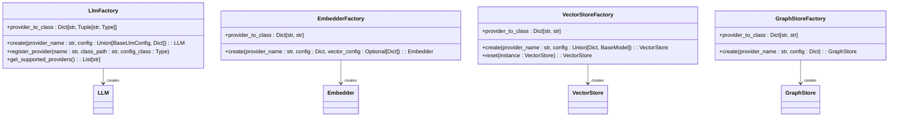
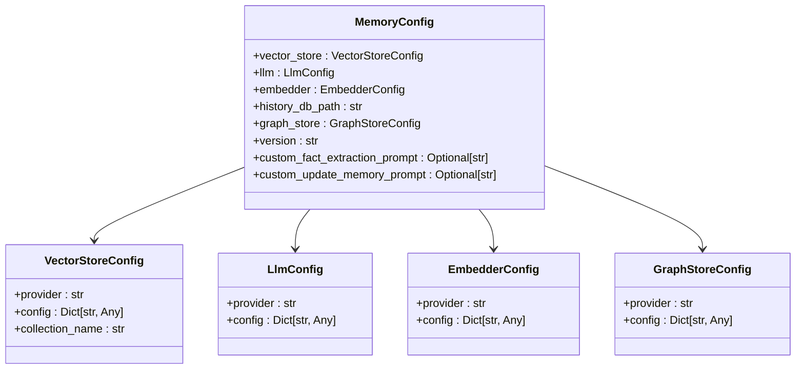
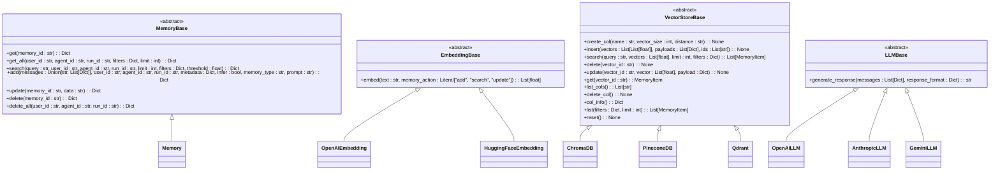
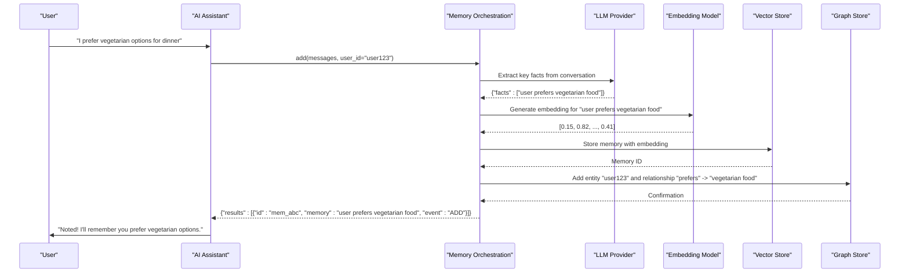
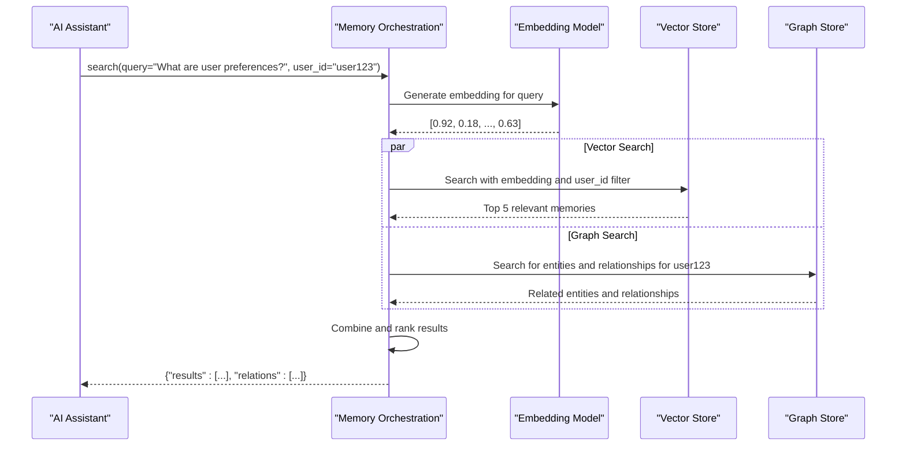
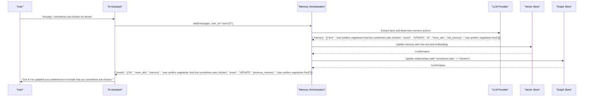
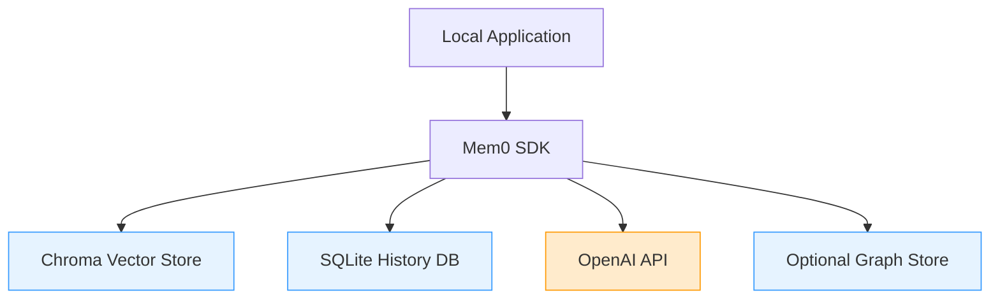
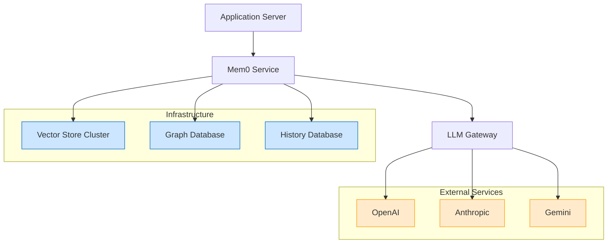
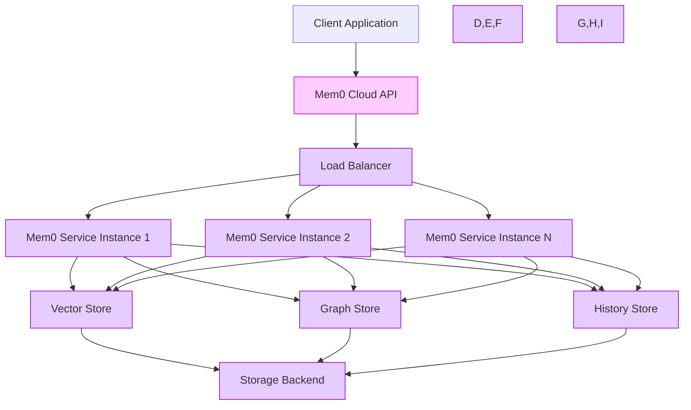

# Architecture and Design

<cite>
**Referenced Files in This Document**   
- [main.py](file://mem0/memory/main.py)
- [factory.py](file://mem0/utils/factory.py)
- [base.py](file://mem0/memory/base.py)
- [base.py](file://mem0/embeddings/base.py)
- [base.py](file://mem0/vector_stores/base.py)
- [base.py](file://mem0/llms/base.py)
- [MemoryClient.py](file://mem0/client/main.py)
- [base.py](file://mem0/configs/base.py)
- [enums.py](file://mem0/configs/enums.py)
</cite>

## Table of Contents
1. [Introduction](#introduction)
2. [Core Components](#core-components)
3. [Architectural Patterns](#architectural-patterns)
4. [Component Interactions and Data Flows](#component-interactions-and-data-flows)
5. [Infrastructure Requirements](#infrastructure-requirements)
6. [Scalability Considerations](#scalability-considerations)
7. [Deployment Topology Options](#deployment-topology-options)
8. [Cross-Cutting Concerns](#cross-cutting-concerns)
9. [Technology Stack and Dependencies](#technology-stack-and-dependencies)
10. [Conclusion](#conclusion)

## Introduction

The Mem0 system is an intelligent memory layer designed to enhance AI assistants and agents with personalized, long-term memory capabilities. The architecture enables AI systems to remember user preferences, adapt to individual needs, and continuously learn over time. Mem0 supports various applications including AI assistants, customer support systems, healthcare applications, and productivity tools by providing a robust memory orchestration framework.

The system is built with extensibility and flexibility in mind, supporting multiple LLM providers, vector databases, and embedding models through a plugin architecture. This documentation provides a comprehensive overview of the Mem0 architecture, detailing its core components, design patterns, data flows, and deployment considerations.

## Core Components

The Mem0 system consists of several core components that work together to provide memory orchestration capabilities for AI applications. These components include memory orchestration, LLM integration, vector storage, graph storage, and history tracking.

The memory orchestration component serves as the central coordinator, managing the lifecycle of memories across different storage backends. It handles operations such as adding, retrieving, searching, updating, and deleting memories while ensuring consistency across the system. The LLM integration component enables interaction with various language model providers, allowing the system to extract key facts from conversations and determine appropriate memory operations.

Vector storage provides semantic search capabilities through embedding-based retrieval, while graph storage maintains relationships between entities and memories for contextual understanding. History tracking preserves the evolution of memories over time, enabling audit trails and temporal analysis of memory changes.

**Section sources**
- [main.py](file://mem0/memory/main.py#L1-L800)
- [base.py](file://mem0/memory/base.py#L1-L64)

## Architectural Patterns

### Factory Pattern for Provider Creation

The Mem0 system implements the Factory Pattern to manage the creation of various provider instances, including LLMs, embedders, vector stores, and graph stores. This pattern centralizes the instantiation logic and provides a consistent interface for creating different types of components.

The `LlmFactory`, `EmbedderFactory`, `VectorStoreFactory`, and `GraphStoreFactory` classes encapsulate the creation logic for their respective components. Each factory maintains a mapping between provider names and their corresponding class paths, allowing for dynamic instantiation based on configuration.

**Diagram sources**
- [factory.py](file://mem0/utils/factory.py#L23-L224)

### Dependency Injection for Configuration

Mem0 employs Dependency Injection to manage configuration across its components. The system uses Pydantic models to define configuration schemas, which are then injected into components during initialization. This approach promotes loose coupling and makes the system more testable and configurable.

The `MemoryConfig` class serves as the central configuration container, aggregating settings for vector stores, LLMs, embedders, and graph stores. These configurations are injected into the respective components through constructor parameters, allowing for easy customization and extension.

**Diagram sources**
- [base.py](file://mem0/configs/base.py#L29-L63)

### Abstract Base Classes for Extensibility

The system utilizes Abstract Base Classes (ABCs) to define interfaces for key components, ensuring consistent implementation across different providers. These abstract classes establish contracts that concrete implementations must follow, promoting interoperability and maintainability.

The core abstract classes include `MemoryBase`, `EmbeddingBase`, `VectorStoreBase`, and `LLMBase`. Each defines the essential methods that concrete implementations must provide, enabling the system to work with various providers through a uniform interface.

**Diagram sources**
- [base.py](file://mem0/memory/base.py#L4-L64)
- [base.py](file://mem0/embeddings/base.py#L7-L32)
- [base.py](file://mem0/vector_stores/base.py#L4-L59)
- [base.py](file://mem0/llms/base.py)

### Plugin Architecture for New Providers

Mem0 implements a plugin architecture that allows for easy integration of new providers for LLMs, embedders, vector stores, and graph stores. This extensible design enables the system to support a wide range of third-party services without modifying core functionality.

The architecture relies on the factory pattern and configuration-driven instantiation, where new providers can be added by registering them with the appropriate factory and providing the necessary configuration. This approach follows the Open/Closed Principle, allowing the system to be extended without modification.

```mermaid
graph TD
A[Application] --> B[Memory Orchestration]
B --> C[LLM Factory]
B --> D[Embedder Factory]
B --> E[Vector Store Factory]
B --> F[Graph Store Factory]
C --> G[OpenAI LLM]
C --> H[Anthropic LLM]
C --> I[Gemini LLM]
C --> J[Azure OpenAI LLM]
C --> K[Custom LLM Provider]
D --> L[OpenAI Embedder]
D --> M[HuggingFace Embedder]
D --> N[Azure OpenAI Embedder]
D --> O[Custom Embedder Provider]
E --> P[Chroma Vector Store]
E --> Q[Pinecone Vector Store]
E --> R[Qdrant Vector Store]
E --> S[Custom Vector Store Provider]
F --> T[Memgraph]
F --> U[Neptune]
F --> V[Kuzu]
F --> W[Custom Graph Store Provider]
style K stroke:#f66,stroke-width:2px
style O stroke:#f66,stroke-width:2px
style S stroke:#f66,stroke-width:2px
style W stroke:#f66,stroke-width:2px
classDef custom stroke:#f66,stroke-width:2px;
class K,O,S,W custom;
click K "Registering New Providers" "Custom providers can be registered with the factories"
click O "Registering New Providers" "Custom providers can be registered with the factories"
click S "Registering New Providers" "Custom providers can be registered with the factories"
click W "Registering New Providers" "Custom providers can be registered with the factories"
```

**Diagram sources**
- [factory.py](file://mem0/utils/factory.py#L23-L224)

## Component Interactions and Data Flows

### Memory Creation Flow

The memory creation process in Mem0 involves multiple components working together to extract, store, and relate information from conversations. When a user interacts with an AI assistant, the system processes the conversation to create or update relevant memories.

**Diagram sources**
- [main.py](file://mem0/memory/main.py#L195-L308)

### Memory Retrieval Flow

When an AI assistant needs to access a user's memories, the system retrieves relevant information from both vector and graph stores to provide comprehensive context. This dual-retrieval approach combines semantic search with relationship-based context.

**Diagram sources**
- [main.py](file://mem0/memory/main.py#L644-L718)

### Memory Update Flow

The memory update process allows the system to modify existing memories based on new information from conversations. This flow demonstrates how Mem0 can refine and evolve memories over time.

**Diagram sources**
- [main.py](file://mem0/memory/main.py#L195-L308)

## Infrastructure Requirements

The Mem0 system has specific infrastructure requirements to ensure optimal performance and reliability. These requirements vary based on the deployment scenario and scale of usage.

For the core memory orchestration component, the system requires a Python runtime environment (3.8+) with sufficient memory to handle concurrent operations. The exact memory requirements depend on the vector store provider and the volume of data being processed.

Vector storage requirements vary significantly by provider:
- **Chroma**: Lightweight, suitable for development and small-scale deployments, runs in-memory or with persistent storage
- **Pinecone**: Cloud-based, requires API connectivity, scales automatically based on usage
- **Qdrant**: Can run as a standalone service, requires dedicated resources for production workloads
- **Weaviate**: Full-featured vector database, requires more substantial resources for optimal performance

Graph storage options have their own requirements:
- **Memgraph**: High-performance graph database, requires dedicated server resources
- **Neptune**: AWS-managed graph service, scales automatically
- **Kuzu**: Lightweight graph database, suitable for smaller datasets

The system also requires access to LLM providers (OpenAI, Anthropic, Gemini, etc.) through their respective APIs, which necessitates stable internet connectivity and appropriate authentication credentials.

**Section sources**
- [main.py](file://mem0/memory/main.py#L131-L169)
- [factory.py](file://mem0/utils/factory.py#L23-L224)

## Scalability Considerations

Mem0 is designed with scalability in mind, employing several strategies to handle increasing loads and data volumes. The architecture supports both vertical and horizontal scaling approaches depending on the deployment scenario.

The system uses concurrent.futures.ThreadPoolExecutor for parallel processing of vector store and graph store operations, allowing for efficient handling of multiple operations simultaneously. This approach maximizes resource utilization and reduces latency for memory operations.

For data storage scalability, the choice of vector store provider is critical:
- Cloud-based providers like Pinecone and Weaviate offer automatic scaling
- Self-hosted solutions like Qdrant and Chroma can be deployed in clustered configurations
- The factory pattern allows for easy switching between providers based on scalability needs

The system also implements efficient memory management through:
- Connection pooling for database operations
- Caching of frequently accessed configurations
- Batch operations for bulk memory updates
- Asynchronous processing capabilities for high-throughput scenarios

The API versioning system (v1.0, v1.1) allows for gradual migration to improved data formats and response structures without breaking existing integrations, supporting long-term scalability of the platform.

**Section sources**
- [main.py](file://mem0/memory/main.py#L283-L291)
- [main.py](file://mem0/memory/main.py#L577-L585)

## Deployment Topology Options

Mem0 supports multiple deployment topologies to accommodate different use cases and infrastructure requirements. These options range from simple local deployments to complex distributed architectures.

### Local Development Deployment

For development and testing, Mem0 can be deployed locally with minimal dependencies. This topology uses lightweight storage backends and connects to cloud-based LLM providers.

### Production Self-Hosted Deployment

For production environments, Mem0 can be self-hosted with dedicated infrastructure for each component, providing greater control over performance and data privacy.

### Fully Managed Cloud Deployment

For organizations preferring a fully managed solution, Mem0 offers a hosted platform with automatic updates, analytics, and enterprise security features.

**Diagram sources**
- [main.py](file://mem0/memory/main.py#L131-L169)
- [client/main.py](file://mem0/client/main.py#L24-L491)

## Cross-Cutting Concerns

### Security

Mem0 addresses security through multiple layers of protection:
- API key authentication for client access
- User ID hashing for privacy
- Secure transmission of data via HTTPS
- Environment variable protection for sensitive credentials
- Input validation to prevent injection attacks

The system implements role-based access control through user, agent, and run identifiers, ensuring that memories are properly scoped and isolated. The client SDK includes automatic API key validation and secure storage mechanisms.

### Monitoring

The architecture includes comprehensive telemetry capabilities for monitoring system performance and usage patterns. The `capture_event` function in the telemetry module tracks key operations, providing insights into:
- API usage patterns
- Performance metrics
- Error rates
- User engagement

These telemetry events can be integrated with analytics platforms like PostHog for detailed monitoring and analysis.

### Disaster Recovery

Mem0 supports disaster recovery through:
- Regular backups of history databases
- Replication capabilities in supported vector stores
- Configuration persistence
- Graceful degradation when external services are unavailable

The system's modular design allows for component replacement in case of failure, and the use of standard interfaces ensures compatibility with alternative providers.

**Section sources**
- [main.py](file://mem0/memory/main.py#L28-L28)
- [telemetry.py](file://mem0/memory/telemetry.py)
- [client/main.py](file://mem0/client/main.py#L14-L15)

## Technology Stack and Dependencies

The Mem0 system is built on a modern technology stack with carefully selected dependencies to ensure reliability and performance.

### Core Dependencies

| Component | Technology | Version Compatibility |
|---------|-----------|---------------------|
| Language | Python | 3.8+ |
| Configuration | Pydantic | 2.0+ |
| HTTP Client | httpx | 0.23+ |
| Database | SQLite | Built-in |
| Type Hints | typing | Built-in |

### LLM Providers

The system supports multiple LLM providers with the following compatibility:

| Provider | Package | Version |
|---------|--------|--------|
| OpenAI | openai | 1.0+ |
| Anthropic | anthropic | 0.7+ |
| Google Gemini | google-generativeai | 0.3+ |
| Azure OpenAI | openai | 1.0+ |
| Groq | groq | 0.1+ |
| Together AI | together | 0.5+ |

### Vector Store Providers

| Provider | Package | Version |
|---------|--------|--------|
| Chroma | chromadb | 0.4+ |
| Pinecone | pinecone-client | 2.2+ |
| Qdrant | qdrant-client | 1.0+ |
| Weaviate | weaviate-client | 3.15+ |
| Milvus | pymilvus | 2.0+ |
| Elasticsearch | elasticsearch | 8.0+ |
| OpenSearch | opensearch-py | 2.0+ |
| PGVector | pgvector | 0.1+ |
| Redis | redis | 4.0+ |
| Valkey | valkey | 5.0+ |
| FAISS | faiss-cpu/faiss-gpu | 1.7+ |
| LanceDB | lancedb | 0.3+ |
| Azure AI Search | azure-search-documents | 11.0+ |
| Supabase | supabase | 1.0+ |
| Upstash Vector | upstash-vector | 0.1+ |
| Vertex AI Vector Search | google-cloud-aiplatform | 1.20+ |
| Databricks | databricks-vectorsearch | 0.2+ |
| MongoDB | pymongo | 4.0+ |
| S3 Vectors | boto3 | 1.26+ |
| Baidu VectorDB | qianfan | 0.1+ |
| Neptune Analytics | gremlinpython | 3.6+ |

### Embedding Providers

| Provider | Package | Version |
|---------|--------|--------|
| OpenAI | openai | 1.0+ |
| Hugging Face | transformers | 4.0+ |
| Azure OpenAI | openai | 1.0+ |
| Google Vertex AI | google-cloud-aiplatform | 1.20+ |
| Together AI | together | 0.5+ |
| Ollama | ollama | 0.1+ |
| LM Studio | openai | 1.0+ |
| AWS Bedrock | boto3 | 1.26+ |
| GitHub Copilot | copilot-chat | 0.1+ |

### Graph Store Providers

| Provider | Package | Version |
|---------|--------|--------|
| Memgraph | memgraph | 2.0+ |
| Neptune | gremlinpython | 3.6+ |
| Kuzu | kuzu | 0.2+ |

The dependency management is handled through Poetry, with version constraints specified in pyproject.toml to ensure compatibility across the ecosystem.

**Section sources**
- [pyproject.toml](file://pyproject.toml)
- [factory.py](file://mem0/utils/factory.py#L23-L224)

## Conclusion

The Mem0 system presents a comprehensive architecture for AI memory orchestration, combining multiple storage paradigms with flexible provider integration. The design emphasizes extensibility through the Factory Pattern, clean configuration management via Dependency Injection, and maintainability through Abstract Base Classes.

The system's plugin architecture allows for seamless integration of new providers, making it adaptable to evolving technology landscapes. The dual storage approach with vector and graph databases provides both semantic search capabilities and relationship-based context, enabling sophisticated memory management for AI applications.

With support for multiple deployment topologies, from local development to fully managed cloud services, Mem0 can accommodate various use cases and organizational requirements. The comprehensive telemetry and monitoring capabilities ensure that the system can be effectively managed in production environments.

The technology stack leverages proven, widely-adopted libraries while maintaining flexibility to integrate with emerging technologies. This balanced approach positions Mem0 as a robust foundation for building AI applications with persistent, personalized memory capabilities.