# Component Relationships

<cite>
**Referenced Files in This Document**
- [mem0/memory/main.py](file://mem0/memory/main.py)
- [mem0/client/main.py](file://mem0/client/main.py)
- [mem0/memory/base.py](file://mem0/memory/base.py)
- [mem0/memory/storage.py](file://mem0/memory/storage.py)
- [mem0/utils/factory.py](file://mem0/utils/factory.py)
- [mem0/configs/base.py](file://mem0/configs/base.py)
- [mem0/embeddings/base.py](file://mem0/embeddings/base.py)
- [mem0/vector_stores/base.py](file://mem0/vector_stores/base.py)
- [mem0/llms/base.py](file://mem0/llms/base.py)
- [mem0/graphs/tools.py](file://mem0/graphs/tools.py)
- [mem0/memory/utils.py](file://mem0/memory/utils.py)
- [mem0/memory/telemetry.py](file://mem0/memory/telemetry.py)
- [mem0/exceptions.py](file://mem0/exceptions.py)
</cite>

## Table of Contents
1. [Introduction](#introduction)
2. [Architecture Overview](#architecture-overview)
3. [Core Components](#core-components)
4. [Memory Orchestrator](#memory-orchestrator)
5. [Component Interaction Flow](#component-interaction-flow)
6. [Data Flow Patterns](#data-flow-patterns)
7. [Error Handling and Fallback Mechanisms](#error-handling-and-fallback-mechanisms)
8. [Telemetry and Monitoring](#telemetry-and-monitoring)
9. [Component Dependencies](#component-dependencies)
10. [Performance Considerations](#performance-considerations)
11. [Conclusion](#conclusion)

## Introduction

The Mem0 architecture implements a sophisticated memory management system that orchestrates multiple specialized components to provide intelligent memory operations. At its core, the system consists of a Memory orchestrator that coordinates with Large Language Models (LLMs), embedders, vector stores, graph stores, and history storage to manage contextual memory across applications.

This document explores how these components interact, the data flow patterns during memory operations, and the robust error handling mechanisms that ensure system reliability even when individual components fail.

## Architecture Overview

The Mem0 system follows a modular architecture where each component has a specific responsibility:

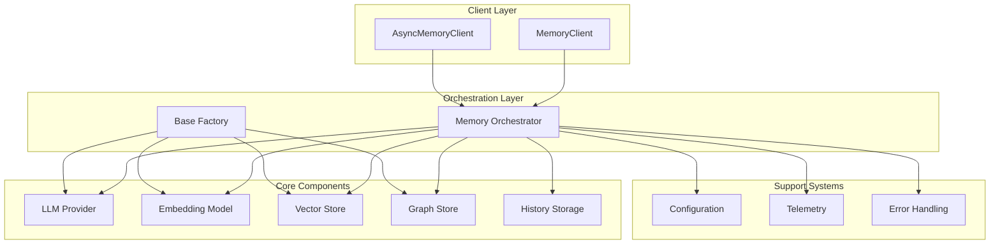

**Diagram sources**
- [mem0/client/main.py](file://mem0/client/main.py#L24-L106)
- [mem0/memory/main.py](file://mem0/memory/main.py#L131-L168)
- [mem0/utils/factory.py](file://mem0/utils/factory.py#L23-L224)

## Core Components

### Memory Orchestrator (Memory Class)

The Memory orchestrator serves as the central coordination hub, managing the lifecycle of memory operations across all components. It inherits from MemoryBase and implements the primary memory management interface.

**Key Responsibilities:**
- Coordinate memory creation, retrieval, search, and deletion operations
- Manage component initialization and configuration
- Orchestrate concurrent operations across vector stores and graph stores
- Handle metadata management and filtering
- Provide unified API for memory operations

**Section sources**
- [mem0/memory/main.py](file://mem0/memory/main.py#L131-L168)
- [mem0/memory/base.py](file://mem0/memory/base.py#L4-L64)

### LLM Provider System

The LLM provider system handles natural language processing tasks including fact extraction, memory updates, and structured response generation.

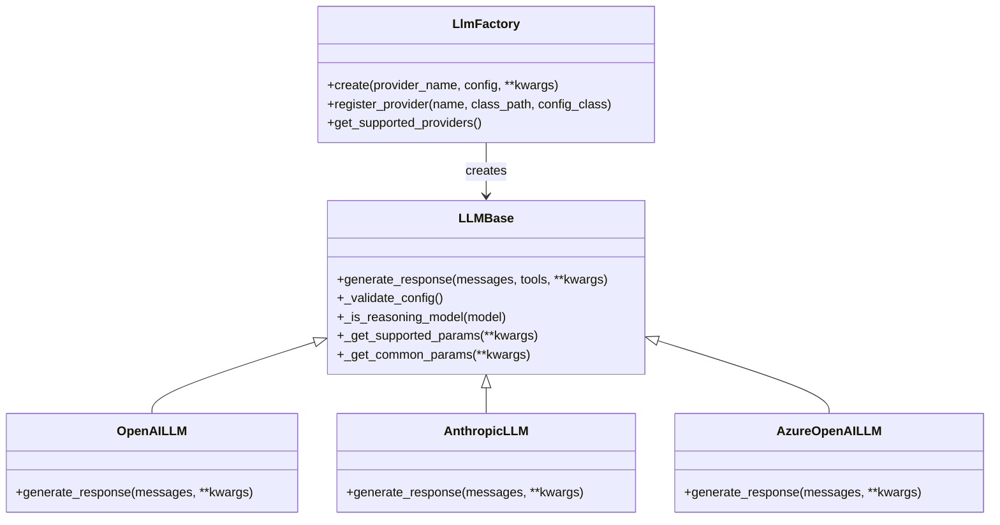

**Diagram sources**
- [mem0/llms/base.py](file://mem0/llms/base.py#L7-L132)
- [mem0/utils/factory.py](file://mem0/utils/factory.py#L23-L129)

**Section sources**
- [mem0/llms/base.py](file://mem0/llms/base.py#L7-L132)
- [mem0/utils/factory.py](file://mem0/utils/factory.py#L23-L129)

### Embedding System

The embedding system converts textual content into numerical vectors for semantic search and similarity operations.

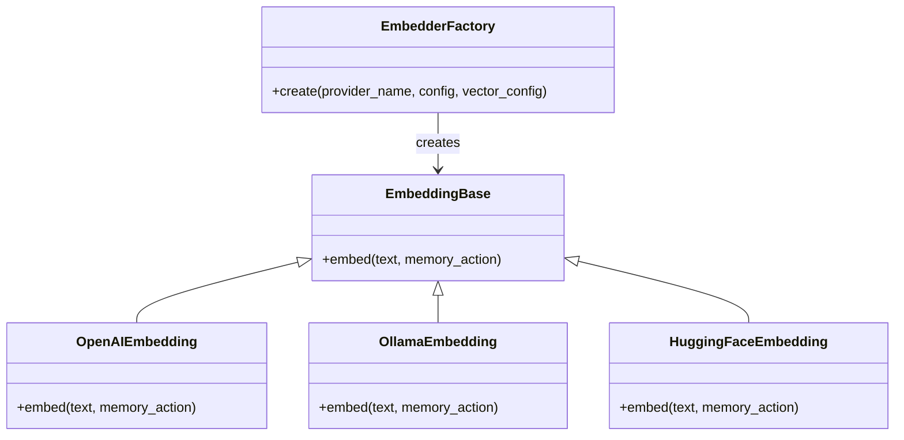

**Diagram sources**
- [mem0/embeddings/base.py](file://mem0/embeddings/base.py#L7-L32)
- [mem0/utils/factory.py](file://mem0/utils/factory.py#L131-L156)

**Section sources**
- [mem0/embeddings/base.py](file://mem0/embeddings/base.py#L7-L32)
- [mem0/utils/factory.py](file://mem0/utils/factory.py#L131-L156)

### Vector Store System

The vector store system manages the persistent storage and retrieval of vector embeddings with support for various backend implementations.

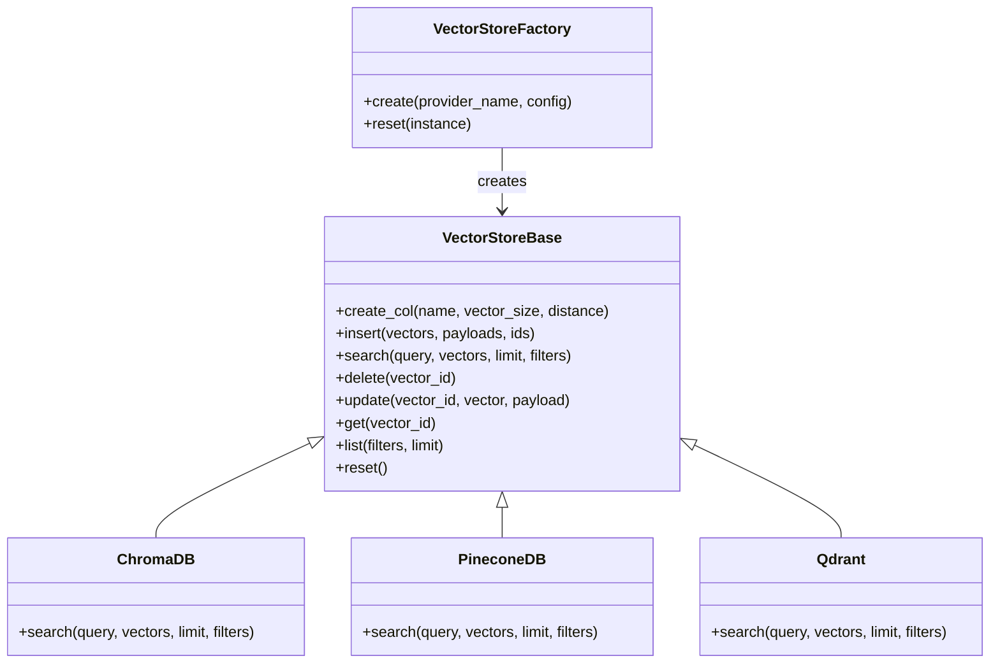

**Diagram sources**
- [mem0/vector_stores/base.py](file://mem0/vector_stores/base.py#L4-L59)
- [mem0/utils/factory.py](file://mem0/utils/factory.py#L159-L195)

**Section sources**
- [mem0/vector_stores/base.py](file://mem0/vector_stores/base.py#L4-L59)
- [mem0/utils/factory.py](file://mem0/utils/factory.py#L159-L195)

### Graph Store System

The graph store system manages knowledge graphs for relationship-based memory operations and entity recognition.

**Section sources**
- [mem0/utils/factory.py](file://mem0/utils/factory.py#L202-L224)
- [mem0/graphs/tools.py](file://mem0/graphs/tools.py#L1-L372)

### History Storage

The history storage system maintains audit trails and change logs for memory operations.

**Section sources**
- [mem0/memory/storage.py](file://mem0/memory/storage.py#L10-L219)

## Memory Orchestrator

The Memory orchestrator (Memory class) serves as the central coordination point for all memory operations. It manages the lifecycle of memory operations and ensures proper coordination between all components.

### Initialization and Configuration

The orchestrator initializes all required components during construction:

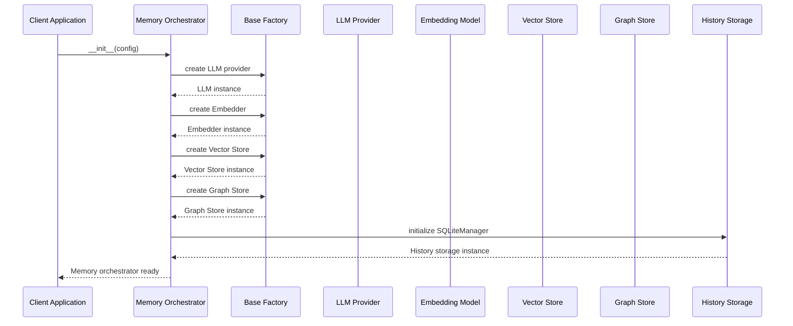

**Diagram sources**
- [mem0/memory/main.py](file://mem0/memory/main.py#L131-L168)
- [mem0/utils/factory.py](file://mem0/utils/factory.py#L23-L224)

### Core Operation Methods

The orchestrator provides several key methods for memory management:

**Section sources**
- [mem0/memory/main.py](file://mem0/memory/main.py#L195-L800)

## Component Interaction Flow

### Memory Addition Workflow

When adding new memories, the orchestrator coordinates multiple components in a sophisticated workflow:

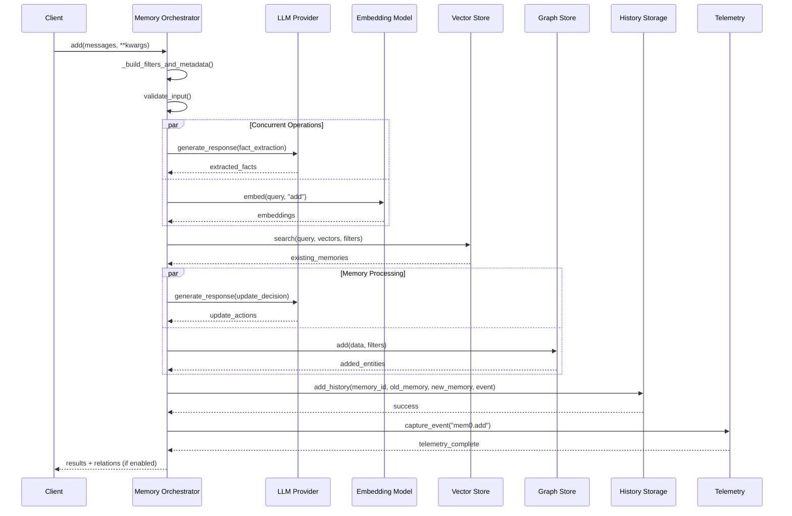

**Diagram sources**
- [mem0/memory/main.py](file://mem0/memory/main.py#L283-L481)
- [mem0/memory/telemetry.py](file://mem0/memory/telemetry.py#L73-L90)

### Memory Search Workflow

Memory search operations demonstrate the orchestrator's ability to coordinate multiple data sources:

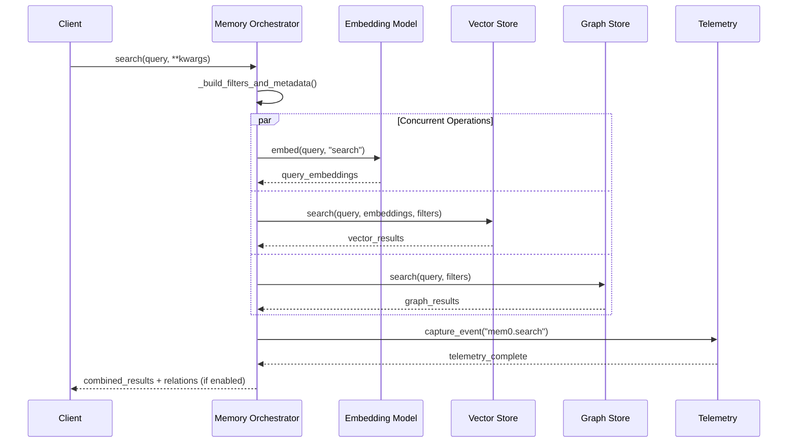

**Diagram sources**
- [mem0/memory/main.py](file://mem0/memory/main.py#L692-L707)
- [mem0/memory/telemetry.py](file://mem0/memory/telemetry.py#L73-L90)

**Section sources**
- [mem0/memory/main.py](file://mem0/memory/main.py#L692-L707)

## Data Flow Patterns

### Structured Data Processing

The orchestrator implements sophisticated data processing patterns to handle various input formats:

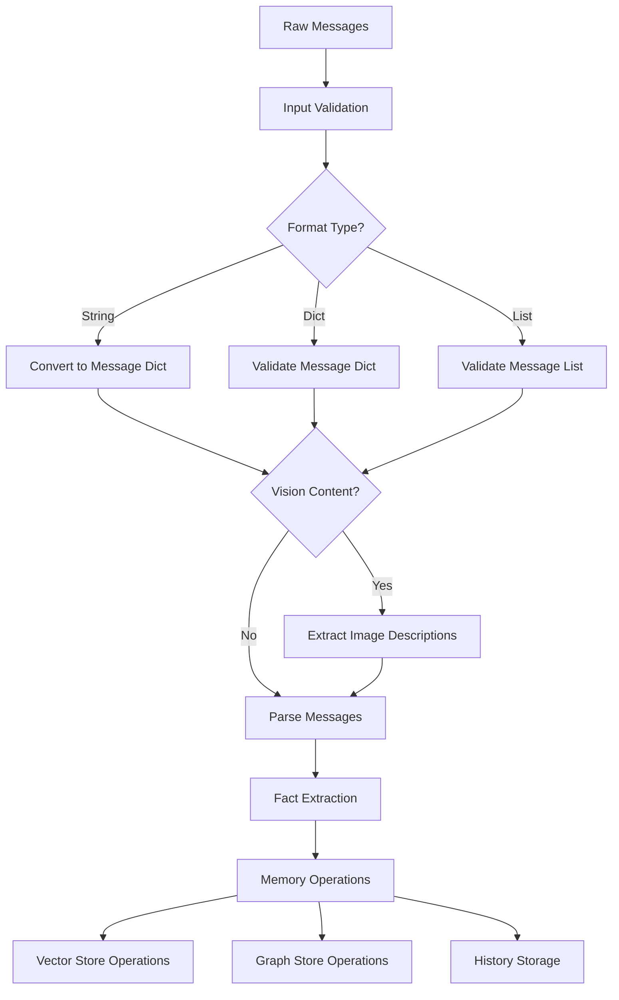

**Diagram sources**
- [mem0/memory/main.py](file://mem0/memory/main.py#L260-L282)
- [mem0/memory/utils.py](file://mem0/memory/utils.py#L90-L117)

**Section sources**
- [mem0/memory/utils.py](file://mem0/memory/utils.py#L90-L117)

### Metadata Management

The orchestrator implements comprehensive metadata management for session scoping and filtering:

**Section sources**
- [mem0/memory/main.py](file://mem0/memory/main.py#L46-L124)

## Error Handling and Fallback Mechanisms

### Exception Hierarchy

The system implements a comprehensive exception hierarchy for different failure scenarios:

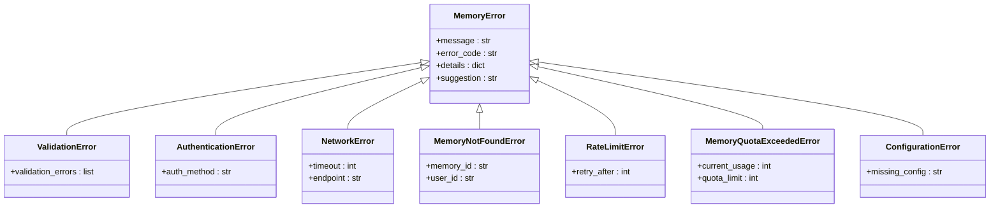

**Diagram sources**
- [mem0/exceptions.py](file://mem0/exceptions.py#L140-L466)

### Fallback Strategies

The orchestrator implements several fallback strategies for component failures:

**Section sources**
- [mem0/exceptions.py](file://mem0/exceptions.py#L424-L466)

### Error Recovery Patterns

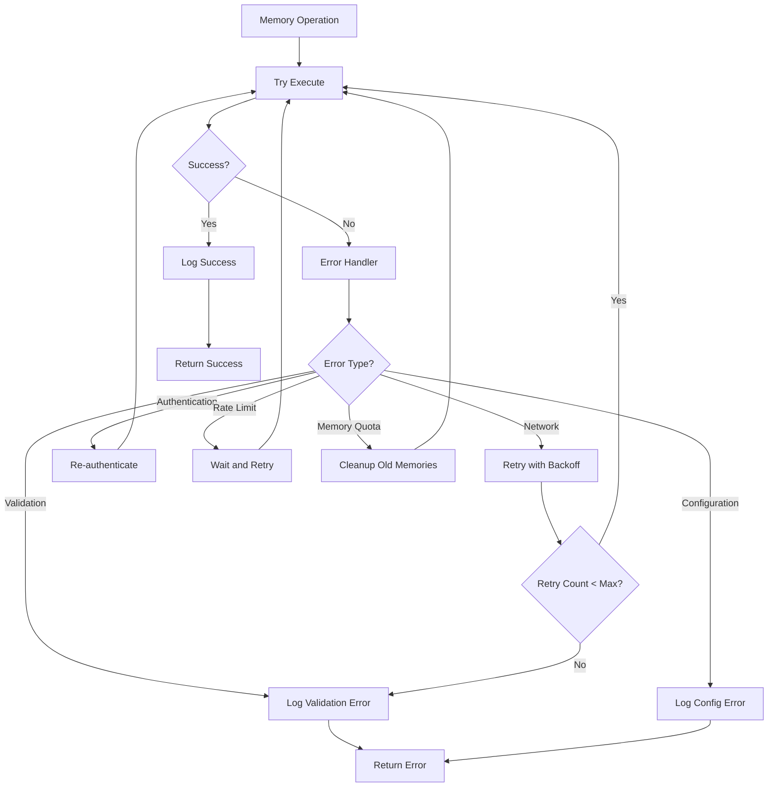

**Section sources**
- [mem0/client/utils.py](file://mem0/client/utils.py#L102-L115)

## Telemetry and Monitoring

### Event Capture System

The orchestrator implements comprehensive telemetry for monitoring and debugging:

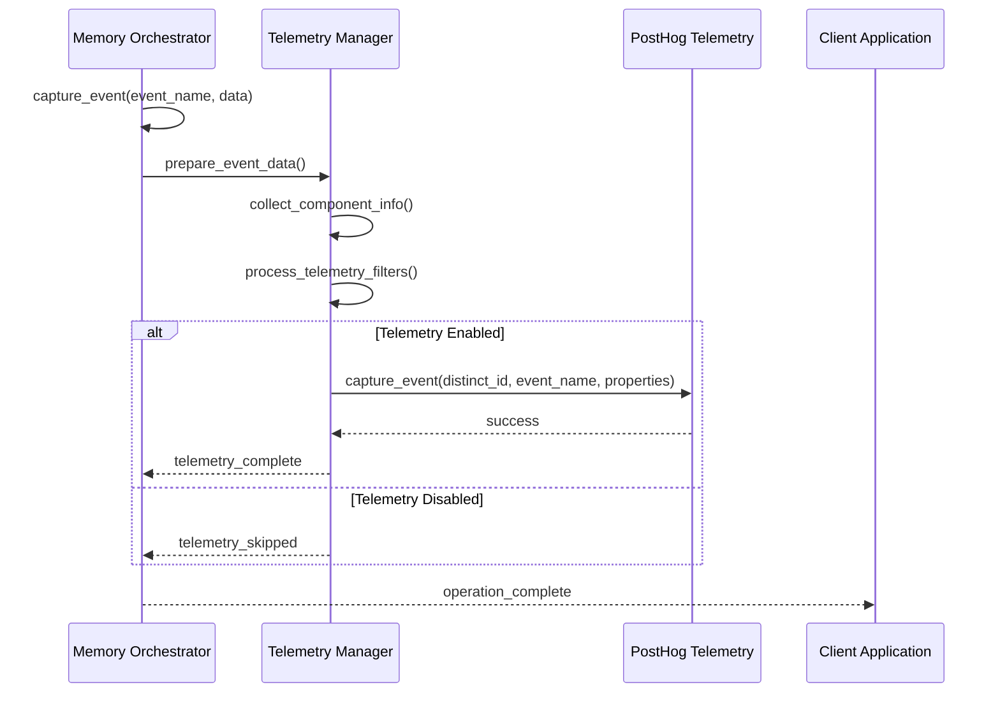

**Diagram sources**
- [mem0/memory/telemetry.py](file://mem0/memory/telemetry.py#L73-L90)

### Performance Monitoring

The system tracks various performance metrics:

**Section sources**
- [mem0/memory/telemetry.py](file://mem0/memory/telemetry.py#L73-L90)
- [mem0/memory/utils.py](file://mem0/memory/utils.py#L120-L135)

## Component Dependencies

### Factory Pattern Implementation

The orchestrator uses factory patterns to manage component creation and dependencies:

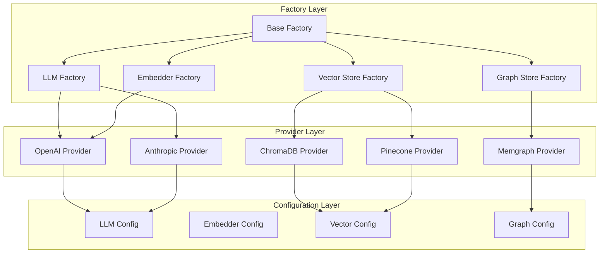

**Diagram sources**
- [mem0/utils/factory.py](file://mem0/utils/factory.py#L23-L224)

### Configuration Management

The system uses a hierarchical configuration approach:

**Section sources**
- [mem0/configs/base.py](file://mem0/configs/base.py#L16-L86)

## Performance Considerations

### Concurrent Operations

The orchestrator implements concurrent processing for improved performance:

**Section sources**
- [mem0/memory/main.py](file://mem0/memory/main.py#L283-L291)
- [mem0/memory/main.py](file://mem0/memory/main.py#L577-L589)

### Caching Strategies

The system implements multiple caching layers:

- **Embedding Caching**: Prevents redundant embedding calculations
- **Vector Search Caching**: Reduces computational overhead for repeated queries
- **LLM Response Caching**: Minimizes API calls for identical requests

### Resource Management

The orchestrator implements resource cleanup and management:

**Section sources**
- [mem0/memory/storage.py](file://mem0/memory/storage.py#L200-L219)

## Conclusion

The Mem0 architecture demonstrates a sophisticated approach to memory management through careful orchestration of specialized components. The Memory orchestrator serves as the central coordination point, managing complex workflows that involve LLMs, embedders, vector stores, graph stores, and history storage.

Key architectural strengths include:

- **Modular Design**: Each component has clear responsibilities and well-defined interfaces
- **Robust Error Handling**: Comprehensive exception hierarchy with fallback strategies
- **Concurrent Processing**: Parallel execution of independent operations for improved performance
- **Extensible Architecture**: Factory patterns enable easy addition of new providers
- **Comprehensive Monitoring**: Telemetry system provides visibility into system operations
- **Flexible Configuration**: Hierarchical configuration system supports diverse deployment scenarios

The system's design enables reliable memory operations across various use cases while maintaining flexibility for future enhancements and integrations. The clear separation of concerns and well-defined interfaces ensure maintainability and extensibility as the system evolves.