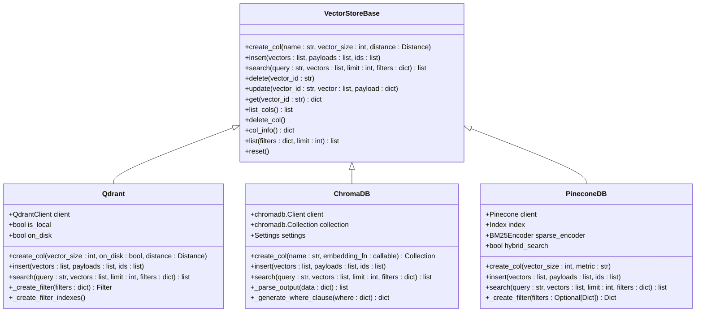

# Embedder and Vector Store

<cite>
**Referenced Files in This Document**
- [mem0/embeddings/base.py](file://mem0/embeddings/base.py)
- [mem0/embeddings/openai.py](file://mem0/embeddings/openai.py)
- [mem0/embeddings/huggingface.py](file://mem0/embeddings/huggingface.py)
- [mem0/embeddings/azure_openai.py](file://mem0/embeddings/azure_openai.py)
- [mem0/embeddings/vertexai.py](file://mem0/embeddings/vertexai.py)
- [mem0/configs/embeddings/base.py](file://mem0/configs/embeddings/base.py)
- [mem0/vector_stores/base.py](file://mem0/vector_stores/base.py)
- [mem0/vector_stores/qdrant.py](file://mem0/vector_stores/qdrant.py)
- [mem0/vector_stores/chroma.py](file://mem0/vector_stores/chroma.py)
- [mem0/vector_stores/pinecone.py](file://mem0/vector_stores/pinecone.py)
- [mem0/memory/main.py](file://mem0/memory/main.py)
- [mem0/configs/base.py](file://mem0/configs/base.py)
</cite>

## Table of Contents
1. [Introduction](#introduction)
2. [Embedder Architecture](#embedder-architecture)
3. [Vector Store Architecture](#vector-store-architecture)
4. [Embedder Implementations](#embedder-implementations)
5. [Vector Store Implementations](#vector-store-implementations)
6. [Memory Operations](#memory-operations)
7. [Performance Considerations](#performance-considerations)
8. [Configuration Patterns](#configuration-patterns)
9. [Usage Examples](#usage-examples)
10. [Troubleshooting Guide](#troubleshooting-guide)

## Introduction

The mem0 framework provides a sophisticated embedding and vector store system that enables semantic memory capabilities through text-to-vector conversion and efficient similarity search. This system consists of two primary components: embedders that convert text into numerical vectors, and vector stores that efficiently manage and retrieve these embeddings for semantic search operations.

The architecture supports multiple embedding providers (OpenAI, HuggingFace, Azure OpenAI, Vertex AI, etc.) and various vector database backends (Qdrant, Chroma, Pinecone, FAISS, etc.), providing flexibility for different deployment scenarios and performance requirements.

## Embedder Architecture

The embedder system follows a hierarchical design pattern with a base abstract class defining the interface and concrete implementations for specific providers.


**Diagram sources**
- [mem0/embeddings/base.py](file://mem0/embeddings/base.py#L7-L32)
- [mem0/embeddings/openai.py](file://mem0/embeddings/openai.py#L11-L50)
- [mem0/embeddings/huggingface.py](file://mem0/embeddings/huggingface.py#L15-L42)
- [mem0/embeddings/azure_openai.py](file://mem0/embeddings/azure_openai.py#L13-L56)
- [mem0/embeddings/vertexai.py](file://mem0/embeddings/vertexai.py#L13-L54)

### Base Embedder Interface

The [`EmbeddingBase`](file://mem0/embeddings/base.py#L7-L32) class defines the core interface for all embedding providers:

- **Initialization**: Accepts a configuration object and initializes the embedding provider
- **Embed Method**: Converts text to vector embeddings with optional memory action context
- **Memory Action Support**: Differentiates between embeddings for memory addition, search, and updates

**Section sources**
- [mem0/embeddings/base.py](file://mem0/embeddings/base.py#L7-L32)

## Vector Store Architecture

Vector stores provide the infrastructure for efficient storage and retrieval of embeddings with support for similarity search, filtering, and metadata management.



**Diagram sources**
- [mem0/vector_stores/base.py](file://mem0/vector_stores/base.py#L4-L59)
- [mem0/vector_stores/qdrant.py](file://mem0/vector_stores/qdrant.py#L22-L271)
- [mem0/vector_stores/chroma.py](file://mem0/vector_stores/chroma.py#L23-L268)
- [mem0/vector_stores/pinecone.py](file://mem0/vector_stores/pinecone.py#L25-L383)

**Section sources**
- [mem0/vector_stores/base.py](file://mem0/vector_stores/base.py#L4-L59)

## Embedder Implementations

### OpenAI Embeddings

The OpenAI embedder provides access to OpenAI's embedding models with support for custom dimensions and base URLs.

**Key Features:**
- Supports multiple OpenAI embedding models (text-embedding-3-small, text-embedding-3-large)
- Configurable embedding dimensions (defaults to model-specific values)
- Customizable API base URLs for compatibility with OpenAI-compatible services
- Automatic newline normalization for consistent embeddings

**Configuration Parameters:**
- `model`: Embedding model identifier
- `api_key`: OpenAI API key or environment variable
- `embedding_dims`: Desired embedding dimensionality
- `openai_base_url`: Custom API endpoint URL

**Section sources**
- [mem0/embeddings/openai.py](file://mem0/embeddings/openai.py#L11-L50)

### HuggingFace Embeddings

Supports both local and remote HuggingFace embedding models with Sentence Transformers and TEI (Text Embedding Inference) backends.

**Key Features:**
- Dual-mode operation: local Sentence Transformers or remote TEI
- Automatic dimension detection for local models
- Configurable model parameters and kwargs
- Optimized for privacy-sensitive deployments

**Configuration Parameters:**
- `model`: Local model identifier or default model
- `huggingface_base_url`: TEI server endpoint
- `model_kwargs`: Model-specific configuration parameters

**Section sources**
- [mem0/embeddings/huggingface.py](file://mem0/embeddings/huggingface.py#L15-L42)

### Azure OpenAI Embeddings

Provides enterprise-grade embedding capabilities with Azure Cognitive Services integration.

**Key Features:**
- Azure AD authentication support
- Flexible credential management
- Deployment-specific model selection
- Enterprise security compliance

**Configuration Parameters:**
- `azure_deployment`: Target deployment identifier
- `azure_endpoint`: Azure service endpoint
- `api_version`: API version specification
- `api_key`: Authentication key or automatic credential detection

**Section sources**
- [mem0/embeddings/azure_openai.py](file://mem0/embeddings/azure_openai.py#L13-L56)

### Vertex AI Embeddings

Google Cloud Platform integration for embedding generation with specialized task types.

**Key Features:**
- Task-specific embedding types (SEMANTIC_SIMILARITY, CLASSIFICATION, etc.)
- Custom output dimensionality support
- GCP authentication integration
- Scalable cloud deployment

**Section sources**
- [mem0/embeddings/vertexai.py](file://mem0/embeddings/vertexai.py#L13-L54)

## Vector Store Implementations

### Qdrant Vector Store

High-performance vector database with advanced filtering and persistence capabilities.

**Key Features:**
- Persistent storage with on-disk indexing
- Advanced filtering with payload indexes
- Cosine similarity by default
- Local and remote deployment support

**Advanced Capabilities:**
- Automatic payload index creation for common filter fields
- Configurable distance metrics (Cosine, Euclidean, Dot)
- Efficient batch operations
- Real-time updates and deletions

**Section sources**
- [mem0/vector_stores/qdrant.py](file://mem0/vector_stores/qdrant.py#L22-L271)

### ChromaDB Vector Store

Lightweight, easy-to-deploy vector database with built-in embedding functions.

**Key Features:**
- Built-in embedding function support
- Local and server deployment modes
- Cloud-native architecture
- Automatic collection management

**Configuration Options:**
- Local file-based storage
- Remote server connectivity
- ChromaDB Cloud integration
- Custom embedding functions

**Section sources**
- [mem0/vector_stores/chroma.py](file://mem0/vector_stores/chroma.py#L23-L268)

### Pinecone Vector Store

Managed vector database with hybrid search capabilities.

**Key Features:**
- Hybrid dense-sparse search
- Serverless and pod-based deployments
- Automatic batch processing
- Advanced filtering support

**Hybrid Search:**
- Dense vectors for semantic similarity
- Sparse vectors for keyword matching
- BM25 encoder integration
- Balanced scoring algorithms

**Section sources**
- [mem0/vector_stores/pinecone.py](file://mem0/vector_stores/pinecone.py#L25-L383)

## Memory Operations

The memory system orchestrates embedding generation and vector store operations through the main Memory class.


**Diagram sources**
- [mem0/memory/main.py](file://mem0/memory/main.py#L195-L800)

### Memory Addition Process

The memory addition process involves several stages:

1. **Message Processing**: Messages are parsed and validated
2. **Fact Extraction**: LLM extracts key facts from conversations
3. **Embedding Generation**: Facts are converted to vector embeddings
4. **Similarity Search**: Existing memories are searched for relevance
5. **Update Decision**: LLM determines whether to add, update, or delete memories
6. **Storage**: Results are persisted to vector stores

**Section sources**
- [mem0/memory/main.py](file://mem0/memory/main.py#L310-L481)

### Memory Search Process

Memory search operations leverage semantic similarity to find relevant memories:

1. **Query Embedding**: Search query is converted to vector
2. **Similarity Search**: Vector store performs nearest neighbor search
3. **Filtering**: Results are filtered by metadata criteria
4. **Threshold Application**: Results below similarity threshold are excluded
5. **Ranking**: Results are scored and ordered by relevance

**Section sources**
- [mem0/memory/main.py](file://mem0/memory/main.py#L720-L756)

## Performance Considerations

### Dimensionality Management

Embedding dimensionality significantly impacts both performance and accuracy:

**Dimensionality Trade-offs:**
- **Low Dimensions (64-128)**: Faster computation, lower accuracy, smaller storage
- **Medium Dimensions (256-512)**: Balanced performance/accuracy, moderate storage
- **High Dimensions (768+)**: Higher accuracy, slower computation, larger storage

**Optimization Strategies:**
- Use provider-specific optimal dimensions
- Consider downstream application requirements
- Monitor storage and computational costs

### Indexing Strategies

Different vector stores employ various indexing approaches:

**Qdrant Indexing:**
- HNSW (Hierarchical Navigable Small World) algorithm
- Configurable graph size and M parameters
- Persistent disk storage support

**FAISS Indexing:**
- IVF (Inverted File) indices for large datasets
- PQ (Product Quantization) for compression
- GPU acceleration support

**ChromaDB Indexing:**
- HNSW algorithm with configurable parameters
- Automatic index optimization
- Persistent storage with WAL

### Query Latency Optimization

**Latency Factors:**
- Network round-trips to embedding providers
- Vector store query performance
- Batch processing efficiency
- Caching strategies

**Optimization Techniques:**
- Concurrent embedding generation
- Batch vector operations
- Result caching for repeated queries
- Connection pooling for vector stores

## Configuration Patterns

### Embedder Configuration

Common configuration patterns for embedders:

```python
# OpenAI Configuration
openai_config = {
    "model": "text-embedding-3-small",
    "embedding_dims": 1536,
    "api_key": "your-api-key"
}

# HuggingFace Configuration  
hf_config = {
    "model": "sentence-transformers/all-MiniLM-L6-v2",
    "embedding_dims": 384,
    "model_kwargs": {"device": "cuda"}
}

# Azure OpenAI Configuration
azure_config = {
    "azure_deployment": "your-deployment",
    "azure_endpoint": "https://your-resource.openai.azure.com/",
    "api_version": "2024-02-15-preview"
}
```

### Vector Store Configuration

Vector store configurations vary by provider:

```python
# Qdrant Configuration
qdrant_config = {
    "collection_name": "memories",
    "embedding_model_dims": 1536,
    "host": "localhost",
    "port": 6333,
    "on_disk": True
}

# ChromaDB Configuration
chroma_config = {
    "collection_name": "memories",
    "path": "./chroma_db",
    "persist_directory": "./chroma_db"
}

# Pinecone Configuration
pinecone_config = {
    "collection_name": "memories", 
    "api_key": "your-api-key",
    "environment": "us-west-2",
    "serverless_config": {
        "cloud": "aws",
        "region": "us-west-2"
    }
}
```

**Section sources**
- [mem0/configs/embeddings/base.py](file://mem0/configs/embeddings/base.py#L10-L111)
- [mem0/configs/base.py](file://mem0/configs/base.py#L29-L86)

## Usage Examples

### Basic Memory Operations

```python
from mem0 import Memory

# Initialize memory with configurations
memory = Memory.from_config({
    "embedder": {
        "provider": "openai",
        "config": {
            "model": "text-embedding-3-small",
            "api_key": "your-api-key"
        }
    },
    "vector_store": {
        "provider": "qdrant",
        "config": {
            "collection_name": "memories",
            "host": "localhost",
            "port": 6333
        }
    }
})

# Add memories
messages = [
    {"role": "user", "content": "My favorite color is blue"},
    {"role": "assistant", "content": "Got it! Blue is a great choice."}
]

result = memory.add(
    messages=messages,
    user_id="user123",
    agent_id="agent456"
)

# Search memories
results = memory.search(
    query="favorite color",
    user_id="user123",
    limit=5,
    threshold=0.7
)
```

### Advanced Filtering and Thresholding

```python
# Memory search with advanced filtering
results = memory.search(
    query="project deadline",
    user_id="user123",
    agent_id="project_manager",
    run_id="run_001",
    filters={
        "project_type": "software",
        "priority": {"gte": 3}
    },
    limit=10,
    threshold=0.6
)

# Memory listing with pagination
all_memories = memory.get_all(
    user_id="user123",
    agent_id="agent456",
    filters={
        "created_at": {"gte": "2024-01-01"},
        "category": "work"
    },
    limit=100
)
```

### Memory Update and Deletion

```python
# Update existing memory
update_result = memory.update(
    memory_id="mem_123",
    data="My favorite color is now green"
)

# Delete specific memory
delete_result = memory.delete(memory_id="mem_456")

# Bulk deletion
memory.delete_all(user_id="user123")
```

## Troubleshooting Guide

### Common Embedding Issues

**API Key Problems:**
- Verify API keys are correctly configured
- Check environment variable names
- Ensure proper permissions for embedding providers

**Dimension Mismatch:**
- Confirm embedding dimensions match vector store expectations
- Check provider-specific dimension limits
- Validate model compatibility

**Rate Limiting:**
- Implement exponential backoff for API calls
- Monitor usage quotas
- Consider batching embedding requests

### Vector Store Connectivity

**Connection Issues:**
- Verify network connectivity to vector store endpoints
- Check firewall and security group settings
- Validate authentication credentials

**Performance Problems:**
- Monitor query latency trends
- Check index optimization settings
- Review batch processing configurations

**Data Integrity:**
- Verify embedding consistency across sessions
- Check for data corruption in vector stores
- Monitor storage utilization

### Memory Operation Failures

**Inference Errors:**
- Validate LLM model availability
- Check prompt engineering effectiveness
- Monitor response parsing accuracy

**Storage Failures:**
- Verify vector store capacity
- Check for concurrent access conflicts
- Monitor transaction logs

**Section sources**
- [mem0/memory/main.py](file://mem0/memory/main.py#L244-L290)