# Graph Store Integration

<cite>
**Referenced Files in This Document**
- [mem0/graphs/neptune/base.py](file://mem0/graphs/neptune/base.py)
- [mem0/graphs/neptune/neptunedb.py](file://mem0/graphs/neptune/neptunedb.py)
- [mem0/graphs/neptune/neptunegraph.py](file://mem0/graphs/neptune/neptunegraph.py)
- [mem0/memory/graph_memory.py](file://mem0/memory/graph_memory.py)
- [mem0/graphs/tools.py](file://mem0/graphs/tools.py)
- [mem0/graphs/utils.py](file://mem0/graphs/utils.py)
- [mem0/graphs/configs.py](file://mem0/graphs/configs.py)
- [mem0/memory/storage.py](file://mem0/memory/storage.py)
- [tests/memory/test_neptune_memory.py](file://tests/memory/test_neptune_memory.py)
- [examples/graph-db-demo/neptune-example.ipynb](file://examples/graph-db-demo/neptune-example.ipynb)
</cite>

## Table of Contents
1. [Introduction](#introduction)
2. [Architecture Overview](#architecture-overview)
3. [Base Graph Interface](#base-graph-interface)
4. [Neptune Implementation](#neptune-implementation)
5. [Memory Storage and Retrieval](#memory-storage-and-retrieval)
6. [Procedural Memory Modeling](#procedural-memory-modeling)
7. [Graph Queries and Traversal](#graph-queries-and-traversal)
8. [Schema Design and Performance](#schema-design-and-performance)
9. [Consistency with Vector Store Updates](#consistency-with-vector-store-updates)
10. [Use Cases and Value Proposition](#use-cases-and-value-proposition)
11. [Implementation Examples](#implementation-examples)
12. [Troubleshooting and Best Practices](#troubleshooting-and-best-practices)

## Introduction

Mem0's graph store integration represents a sophisticated approach to memory management that combines the strengths of graph databases with vector similarity search. This hybrid architecture enables the system to represent complex relationships between memories while maintaining efficient retrieval capabilities through vector embeddings.

The graph store serves as the backbone for storing and querying relationships between entities, allowing Mem0 to understand contextual connections that go beyond simple keyword matching. By modeling memories as nodes and relationships as edges, the system can traverse semantic networks to retrieve relevant information in context.

## Architecture Overview

The graph store architecture in Mem0 follows a layered approach that separates concerns between data persistence, query execution, and memory management:

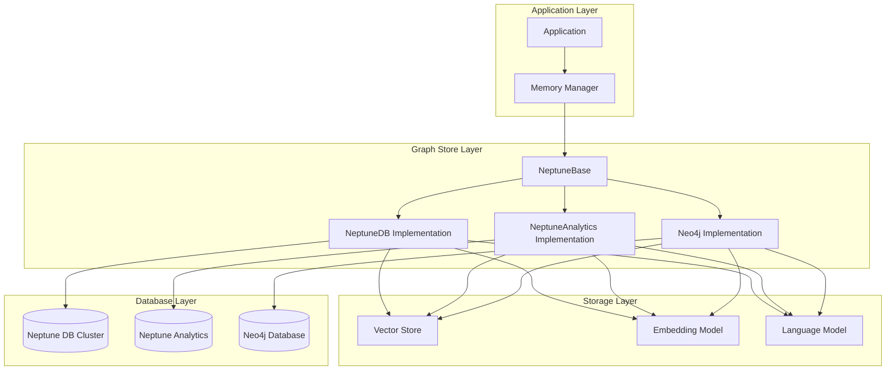

**Diagram sources**
- [mem0/graphs/neptune/base.py](file://mem0/graphs/neptune/base.py#L25-L498)
- [mem0/memory/graph_memory.py](file://mem0/memory/graph_memory.py#L29-L699)

**Section sources**
- [mem0/graphs/neptune/base.py](file://mem0/graphs/neptune/base.py#L25-L498)
- [mem0/memory/graph_memory.py](file://mem0/memory/graph_memory.py#L29-L699)

## Base Graph Interface

The `NeptuneBase` class serves as the abstract foundation for all graph store implementations, defining a standardized interface for memory operations:

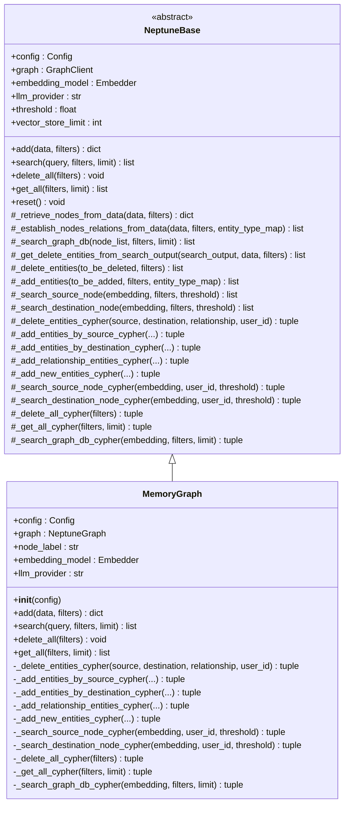

**Diagram sources**
- [mem0/graphs/neptune/base.py](file://mem0/graphs/neptune/base.py#L25-L498)
- [mem0/graphs/neptune/neptunedb.py](file://mem0/graphs/neptune/neptunedb.py#L15-L512)

The base interface defines several key operations:

### Core Operations

**Memory Addition (`add`)**: Processes raw text data to extract entities and relationships, then stores them as graph nodes and edges. The process involves:
- Entity extraction using LLM-powered tools
- Relationship establishment between entities  
- Vector embedding generation for similarity search
- Graph persistence with conflict resolution

**Memory Search (`search`)**: Performs hybrid retrieval combining vector similarity and graph traversal:
- Entity extraction from query
- Vector similarity search for candidate nodes
- Graph traversal to find related relationships
- Re-ranking using BM25 scoring for relevance

**Memory Management**: Provides CRUD operations for graph entities:
- Entity deletion with cascade effects
- Bulk operations for cleanup
- Complete graph reset functionality

**Section sources**
- [mem0/graphs/neptune/base.py](file://mem0/graphs/neptune/base.py#L58-L498)

## Neptune Implementation

Mem0 supports two flavors of Amazon Neptune for graph storage, each optimized for different use cases:

### Neptune DB Implementation

The Neptune DB implementation is designed for high-performance graph analytics with vector similarity capabilities:

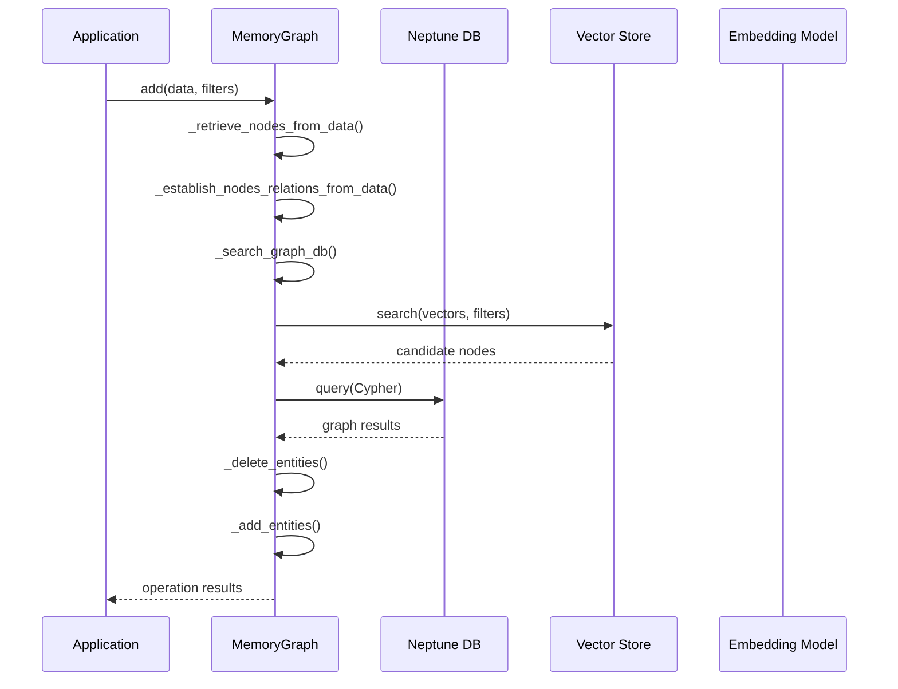

**Diagram sources**
- [mem0/graphs/neptune/neptunedb.py](file://mem0/graphs/neptune/neptunedb.py#L15-L512)

Key features of the Neptune DB implementation:
- **Vector Integration**: Native vector similarity search using cosine similarity
- **Scalability**: Supports large-scale graph operations with cluster deployments
- **ACID Compliance**: Ensures transactional consistency for memory operations
- **Indexing**: Optimized indexing for fast entity lookups and relationship traversals

### Neptune Analytics Implementation

The Neptune Analytics implementation focuses on analytical workloads with built-in vector operations:

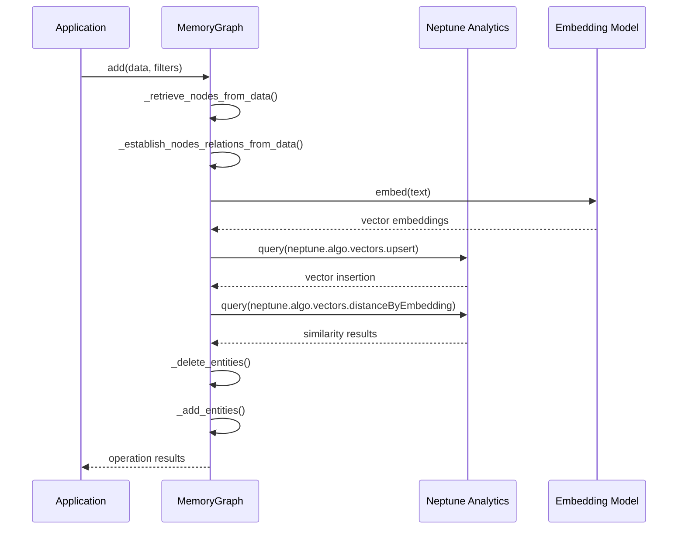

**Diagram sources**
- [mem0/graphs/neptune/neptunegraph.py](file://mem0/graphs/neptune/neptunegraph.py#L14-L475)

Key features of the Neptune Analytics implementation:
- **Built-in Vector Operations**: Uses `neptune.algo.vectors` functions for similarity
- **Advanced Analytics**: Supports complex graph algorithms and pattern matching
- **Real-time Processing**: Optimized for analytical queries and real-time insights
- **Integration**: Seamless integration with AWS analytics ecosystem

**Section sources**
- [mem0/graphs/neptune/neptunedb.py](file://mem0/graphs/neptune/neptunedb.py#L15-L512)
- [mem0/graphs/neptune/neptunegraph.py](file://mem0/graphs/neptune/neptunegraph.py#L14-L475)

## Memory Storage and Retrieval

### Entity and Relationship Extraction

The graph store uses sophisticated LLM-powered tools to extract entities and establish relationships:

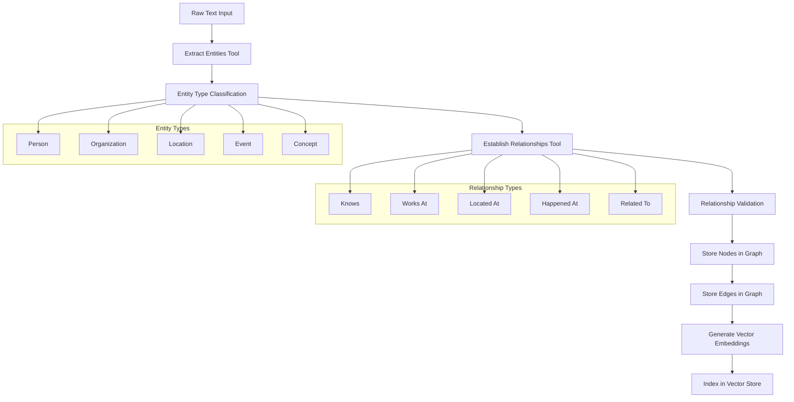

**Diagram sources**
- [mem0/graphs/tools.py](file://mem0/graphs/tools.py#L85-L150)
- [mem0/graphs/utils.py](file://mem0/graphs/utils.py#L35-L55)

### Memory Persistence Strategy

The graph store employs a dual-layer persistence strategy combining graph and vector storage:

| Component | Purpose | Storage Format | Query Pattern |
|-----------|---------|----------------|---------------|
| **Graph Nodes** | Entity storage with metadata | JSON payloads with embeddings | Cypher MATCH queries |
| **Graph Edges** | Relationship storage | Relationship types and weights | Cypher traversal queries |
| **Vector Store** | Similarity search | High-dimensional vectors | Vector similarity search |
| **Metadata Index** | Fast lookups | Composite indexes | Filtered queries |

**Section sources**
- [mem0/graphs/tools.py](file://mem0/graphs/tools.py#L1-L372)
- [mem0/graphs/utils.py](file://mem0/graphs/utils.py#L1-L98)

## Procedural Memory Modeling

### Node Representation

In Mem0's graph store, memories are represented as nodes with rich metadata:

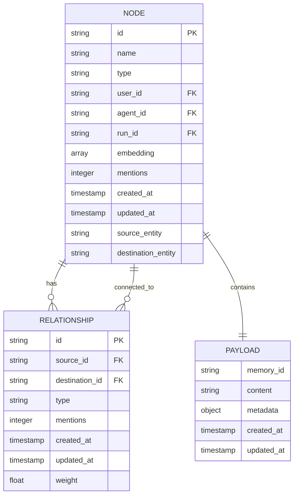

**Diagram sources**
- [mem0/graphs/neptune/neptunedb.py](file://mem0/graphs/neptune/neptunedb.py#L111-L122)
- [mem0/graphs/neptune/neptunegraph.py](file://mem0/graphs/neptune/neptunegraph.py#L93-L112)

### Edge Representation

Relationships between memories are modeled as typed edges with temporal and contextual attributes:

| Edge Attribute | Description | Use Case |
|----------------|-------------|----------|
| **Type** | Relationship classification (e.g., "knows", "works_at", "related_to") | Semantic filtering and traversal |
| **Weight** | Strength of relationship (calculated from similarity scores) | Ranking and relevance scoring |
| **Timestamp** | Creation/modification time | Temporal queries and freshness |
| **Mentions** | Frequency of occurrence | Popularity and importance ranking |
| **Source/Destination** | Connected entities | Graph traversal and navigation |

### Contextual Relationships

The graph store maintains contextual relationships that enable sophisticated memory retrieval:

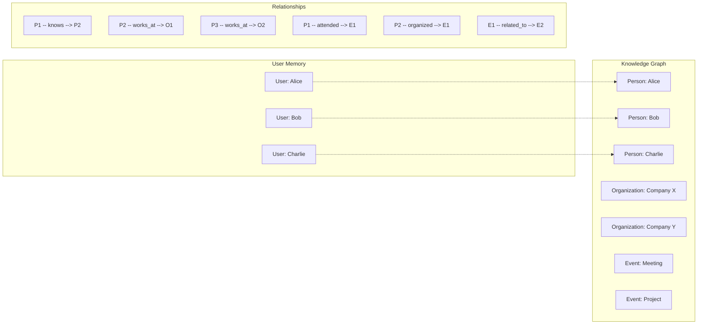

**Diagram sources**
- [mem0/memory/graph_memory.py](file://mem0/memory/graph_memory.py#L195-L226)

**Section sources**
- [mem0/graphs/neptune/neptunedb.py](file://mem0/graphs/neptune/neptunedb.py#L111-L331)
- [mem0/graphs/neptune/neptunegraph.py](file://mem0/graphs/neptune/neptunegraph.py#L93-L311)

## Graph Queries and Traversal

### Cypher Query Patterns

The graph store uses optimized Cypher queries for efficient memory retrieval:

#### Entity Lookup Query
```cypher
MATCH (n {name: $entity_name, user_id: $user_id})
WHERE n.embedding IS NOT NULL
WITH n, 
     round(2 * vector.similarity.cosine(n.embedding, $embedding) - 1, 4) AS similarity
WHERE similarity >= $threshold
RETURN n.name AS entity, similarity
ORDER BY similarity DESC
LIMIT 1
```

#### Relationship Traversal Query
```cypher
MATCH (n {user_id: $user_id})-[r]->(m)
WHERE n.name IN $node_names
CALL {
    WITH n
    MATCH (n)-[r]->(m) 
    RETURN n.name AS source, id(n) AS source_id, 
           type(r) AS relationship, id(r) AS relation_id, 
           m.name AS destination, id(m) AS destination_id
    UNION ALL
    WITH n
    MATCH (m)-[r]->(n) 
    RETURN m.name AS source, id(m) AS source_id, 
           type(r) AS relationship, id(r) AS relation_id, 
           n.name AS destination, id(n) AS destination_id
}
RETURN DISTINCT source, relationship, destination
ORDER BY similarity DESC
LIMIT $limit
```

### Hybrid Search Strategy

The graph store implements a hybrid search strategy that combines vector similarity with graph traversal:

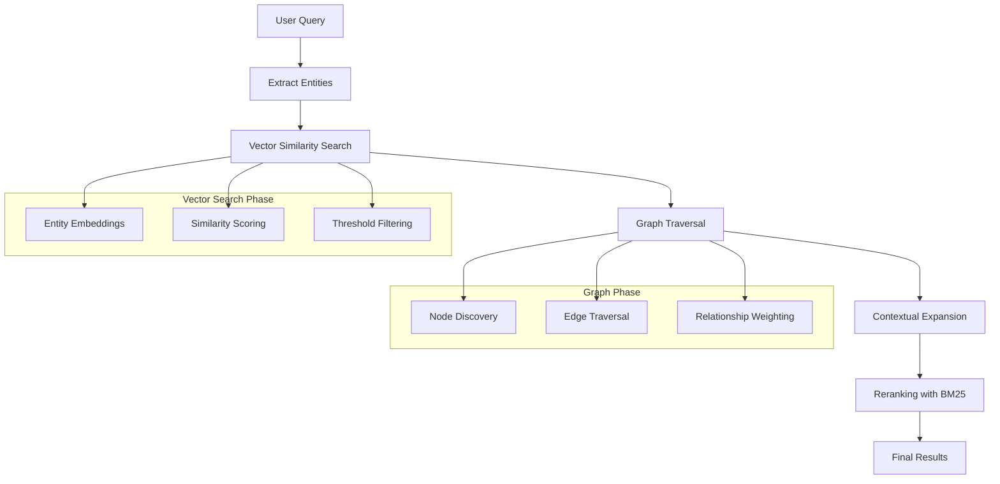

**Diagram sources**
- [mem0/graphs/neptune/base.py](file://mem0/graphs/neptune/base.py#L353-L422)

### Query Performance Optimization

The graph store employs several optimization techniques:

| Technique | Implementation | Benefit |
|-----------|----------------|---------|
| **Composite Indexing** | Multi-column indexes on `(name, user_id)` | Faster entity lookups |
| **Vector Indexing** | Approximate nearest neighbor search | Scalable similarity queries |
| **Query Caching** | Result caching for repeated queries | Reduced latency |
| **Batch Operations** | Bulk processing of related operations | Improved throughput |
| **Connection Pooling** | Reusable database connections | Better resource utilization |

**Section sources**
- [mem0/graphs/neptune/neptunedb.py](file://mem0/graphs/neptune/neptunedb.py#L370-L512)
- [mem0/graphs/neptune/neptunegraph.py](file://mem0/graphs/neptune/neptunegraph.py#L324-L475)

## Schema Design and Performance

### Graph Schema Evolution

The graph store schema is designed for flexibility and scalability:

```mermaid
erDiagram
ENTITY {
string ~id PK
string name
string type
string user_id
string agent_id
string run_id
array embedding
integer mentions
timestamp created_at
timestamp updated_at
}
RELATIONSHIP {
string ~id PK
string source_id FK
string destination_id FK
string type
integer mentions
timestamp created_at
timestamp updated_at
float weight
}
METADATA {
string memory_id
string content
object payload
timestamp created_at
timestamp updated_at
}
ENTITY ||--o{ RELATIONSHIP : "source"
ENTITY ||--o{ RELATIONSHIP : "destination"
ENTITY ||--|| METADATA : "contains"
```

**Diagram sources**
- [mem0/graphs/neptune/neptunedb.py](file://mem0/graphs/neptune/neptunedb.py#L111-L122)
- [mem0/graphs/neptune/neptunegraph.py](file://mem0/graphs/neptune/neptunegraph.py#L93-L112)

### Performance Considerations

#### Indexing Strategy
- **Single Column Indexes**: `user_id`, `name` for basic filtering
- **Composite Indexes**: `(name, user_id)` for entity lookups
- **Vector Indexes**: Optimized for high-dimensional similarity search
- **Relationship Indexes**: `(source_id, relationship_type)` for traversal

#### Query Optimization
- **Early Termination**: Limit results at query execution time
- **Parallel Processing**: Concurrent execution of independent queries
- **Result Streaming**: Incremental result delivery for large datasets
- **Query Planning**: Cost-based optimization for complex traversals

#### Scalability Patterns
- **Partitioning**: User-based partitioning for multi-tenant scenarios
- **Sharding**: Horizontal scaling across multiple graph instances
- **Caching**: Intelligent caching of frequently accessed patterns
- **Compression**: Efficient storage of dense vectors and metadata

**Section sources**
- [mem0/graphs/configs.py](file://mem0/graphs/configs.py#L44-L106)

## Consistency with Vector Store Updates

### Synchronization Mechanisms

The graph store maintains consistency with vector store updates through several mechanisms:

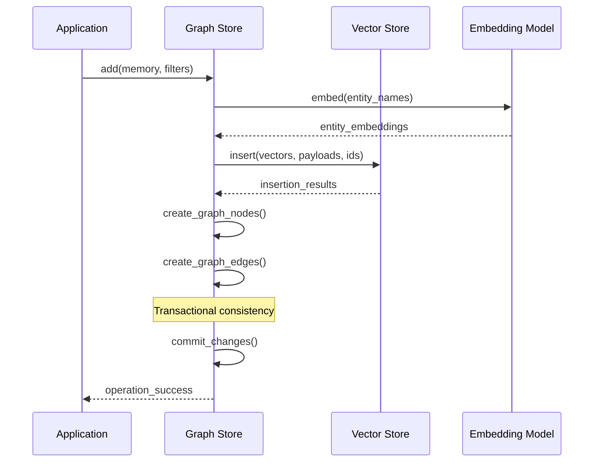

**Diagram sources**
- [mem0/graphs/neptune/neptunedb.py](file://mem0/graphs/neptune/neptunedb.py#L118-L122)
- [mem0/graphs/neptune/neptunegraph.py](file://mem0/graphs/neptune/neptunegraph.py#L111-L113)

### Conflict Resolution

The system handles conflicts between graph and vector store updates:

| Conflict Type | Resolution Strategy | Implementation |
|---------------|-------------------|----------------|
| **Entity Mismatch** | Merge with conflict detection | Compare embeddings and metadata |
| **Relationship Conflicts** | Timestamp-based resolution | Latest timestamp wins |
| **Vector Inconsistency** | Re-embedding and sync | Regenerate embeddings from latest text |
| **Deletion Conflicts** | Cascade deletion protection | Prevent orphaned relationships |

### Atomic Operations

Critical operations are wrapped in atomic transactions to ensure consistency:

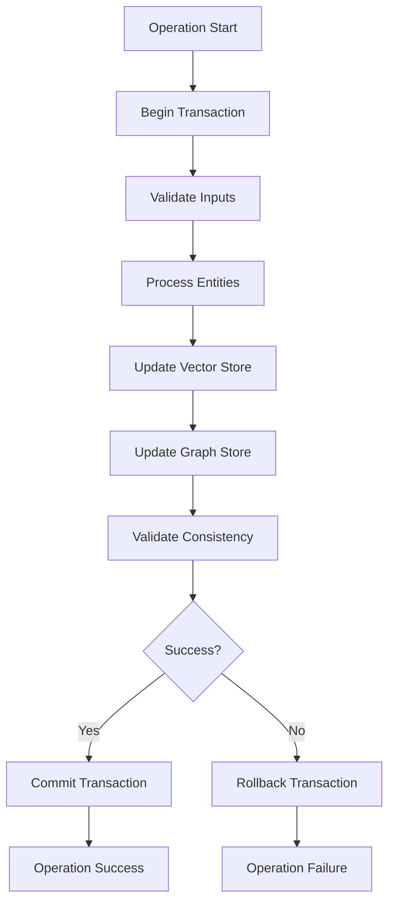

**Diagram sources**
- [mem0/graphs/neptune/base.py](file://mem0/graphs/neptune/base.py#L58-L74)

**Section sources**
- [mem0/graphs/neptune/neptunedb.py](file://mem0/graphs/neptune/neptunedb.py#L118-L122)
- [mem0/graphs/neptune/neptunegraph.py](file://mem0/graphs/neptune/neptunegraph.py#L111-L113)

## Use Cases and Value Proposition

### Graph Storage Advantages Over Vector-Only Approaches

The graph store provides significant advantages in scenarios requiring relational understanding:

#### 1. **Semantic Relationship Discovery**
- **Problem**: Vector-only approaches struggle with explicit relationship understanding
- **Solution**: Graph store captures and queries explicit semantic relationships
- **Example**: "Alice works at Company X" vs. "Company X employs Alice"

#### 2. **Context-Aware Retrieval**
- **Problem**: Flat vector search lacks contextual awareness
- **Solution**: Graph traversal considers relationship context and strength
- **Example**: Finding related projects through organizational hierarchy

#### 3. **Multi-Hop Reasoning**
- **Problem**: Vector similarity doesn't support complex reasoning paths
- **Solution**: Graph traversal enables multi-hop relationship exploration
- **Example**: Finding indirect connections through intermediaries

#### 4. **Temporal Relationship Tracking**
- **Problem**: Vector stores lack temporal semantics
- **Solution**: Graph edges carry timestamps and temporal metadata
- **Example**: Tracking relationship evolution over time

### Real-World Use Cases

#### Customer Support Enhancement
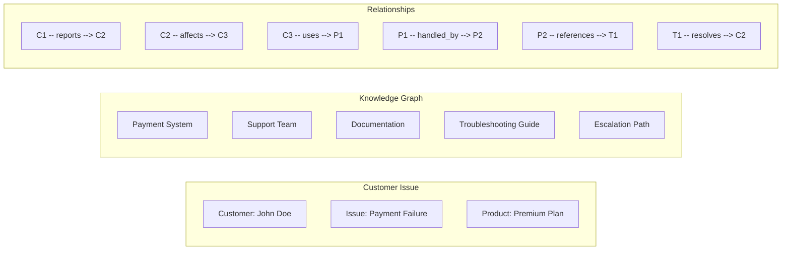

#### Knowledge Management
- **Scenario**: Organizational knowledge base with complex interconnections
- **Benefit**: Graph store enables semantic search across hierarchical knowledge
- **Example**: Finding relevant documentation through product categories and teams

#### Recommendation Systems
- **Scenario**: Personalized content recommendations
- **Benefit**: Graph relationships provide richer context than collaborative filtering
- **Example**: Recommending articles based on user interests and peer recommendations

#### Anomaly Detection
- **Scenario**: Identifying unusual patterns in user behavior
- **Benefit**: Graph store detects anomalies through relationship patterns
- **Example**: Unusual cross-department collaboration patterns

**Section sources**
- [examples/graph-db-demo/neptune-example.ipynb](file://examples/graph-db-demo/neptune-example.ipynb#L1-L200)

## Implementation Examples

### Basic Neptune Integration

Here's a complete example of setting up Mem0 with Neptune graph storage:

```python
# Configuration setup
config = {
    "embedder": {
        "provider": "aws_bedrock",
        "config": {
            "model": "amazon.titan-embed-text-v2:0",
            "embedding_dims": 1024
        }
    },
    "llm": {
        "provider": "aws_bedrock",
        "config": {
            "model": "anthropic.claude-3-sonnet-20241022-v1:0",
            "temperature": 0.1,
            "max_tokens": 2000
        }
    },
    "vector_store": {
        "provider": "neptune",
        "config": {
            "endpoint": "neptune-graph://your-graph-identifier"
        }
    },
    "graph_store": {
        "provider": "neptune",
        "config": {
            "endpoint": "neptune-graph://your-graph-identifier"
        }
    }
}

# Initialize memory system
from mem0 import Memory
m = Memory.from_config(config_dict=config)

# Add memories with automatic graph construction
user_id = "alice"
m.add("Alice works at TechCorp as a software engineer", {"user_id": user_id})
m.add("Bob works at TechCorp as a product manager", {"user_id": user_id})
m.add("Alice and Bob collaborate on the AI project", {"user_id": user_id})

# Retrieve related memories with graph context
results = m.search("Find colleagues working at TechCorp", {"user_id": user_id})
```

### Advanced Graph Queries

```python
# Complex relationship traversal
def find_collaborators(user_id, target_department):
    # Extract entities from query
    entities = m._retrieve_nodes_from_data(
        f"Find collaborators in {target_department}", 
        {"user_id": user_id}
    )
    
    # Graph traversal for multi-hop relationships
    query = f"""
    MATCH (u {{user_id: $user_id}})-[:WORKS_AT]->(dept {{name: $department}})
    MATCH (dept)<-[:WORKS_AT]-(colleague)
    WHERE colleague <> u
    RETURN colleague.name AS collaborator, dept.name AS department
    LIMIT 10
    """
    
    results = m.graph.query(query, {
        "user_id": user_id,
        "department": target_department
    })
    
    return results

# Usage
collaborators = find_collaborators("alice", "Engineering")
```

### Custom Relationship Types

```python
# Define custom relationship patterns
custom_prompt = """
4. When extracting relationships, use these specific types:
   - 'MENTORED_BY': When one person teaches/trains another
   - 'CO_AUTHORED_WITH': When people work together on publications
   - 'MENTIONED_IN': When entities appear together in the same context
"""

# Configure graph store with custom prompt
config["graph_store"]["custom_prompt"] = custom_prompt

# Add memories with custom relationship types
m = Memory.from_config(config_dict=config)
m.add("Dr. Smith mentored Alice in machine learning", {"user_id": "alice"})
m.add("Alice and Bob co-authored the ML paper", {"user_id": "alice"})
```

**Section sources**
- [examples/graph-db-demo/neptune-example.ipynb](file://examples/graph-db-demo/neptune-example.ipynb#L120-L200)
- [tests/memory/test_neptune_memory.py](file://tests/memory/test_neptune_memory.py#L140-L339)

## Troubleshooting and Best Practices

### Common Issues and Solutions

#### 1. **Performance Degradation**
**Symptoms**: Slow query response times, timeouts
**Causes**: 
- Insufficient indexing
- Large graph traversal depth
- Memory pressure in vector operations

**Solutions**:
- Implement composite indexes on `(name, user_id)`
- Limit traversal depth in complex queries
- Monitor and optimize vector store performance

#### 2. **Memory Consistency Issues**
**Symptoms**: Inconsistent graph-state after operations
**Causes**:
- Race conditions in concurrent operations
- Vector-store synchronization failures
- Transaction isolation problems

**Solutions**:
- Use atomic transactions for critical operations
- Implement proper error handling and retry logic
- Monitor transaction conflicts and adjust isolation levels

#### 3. **Embedding Mismatches**
**Symptoms**: Incorrect entity matching despite similar text
**Causes**:
- Embedding model inconsistencies
- Text preprocessing differences
- Dimension mismatches

**Solutions**:
- Standardize text preprocessing across systems
- Verify embedding model consistency
- Implement embedding validation checks

### Performance Optimization Guidelines

#### Query Optimization
- **Index Strategy**: Create indexes on frequently queried attributes
- **Query Planning**: Use explain plans to optimize complex traversals
- **Batch Operations**: Group related operations for better throughput
- **Caching**: Implement intelligent caching for repeated queries

#### Resource Management
- **Connection Pooling**: Reuse database connections efficiently
- **Memory Management**: Monitor and limit memory usage in vector operations
- **Storage Optimization**: Regular cleanup of unused graph data
- **Monitoring**: Implement comprehensive monitoring and alerting

#### Scaling Strategies
- **Partitioning**: Distribute data across multiple graph instances
- **Load Balancing**: Implement request routing for high availability
- **Backup Strategy**: Regular backups with point-in-time recovery
- **Disaster Recovery**: Cross-region replication for business continuity

### Security Considerations

#### Access Control
- **User Isolation**: Ensure proper separation between user data
- **Role-Based Access**: Implement fine-grained permissions
- **Audit Logging**: Track all graph store operations
- **Encryption**: Encrypt data at rest and in transit

#### Data Protection
- **Data Validation**: Validate all input data before graph operations
- **Sanitization**: Sanitize user input to prevent injection attacks
- **Backup Security**: Secure backup storage and encryption
- **Compliance**: Ensure compliance with data protection regulations

**Section sources**
- [tests/memory/test_neptune_memory.py](file://tests/memory/test_neptune_memory.py#L1-L389)
- [mem0/memory/storage.py](file://mem0/memory/storage.py#L1-L219)