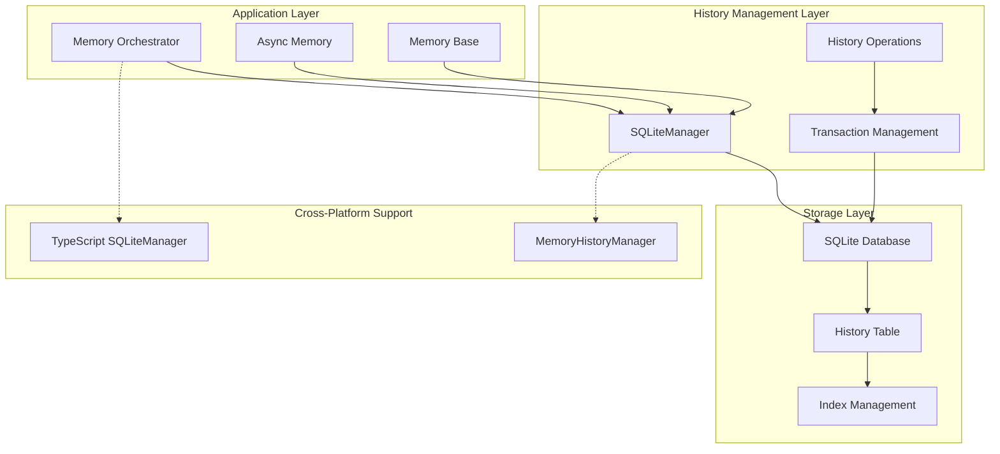
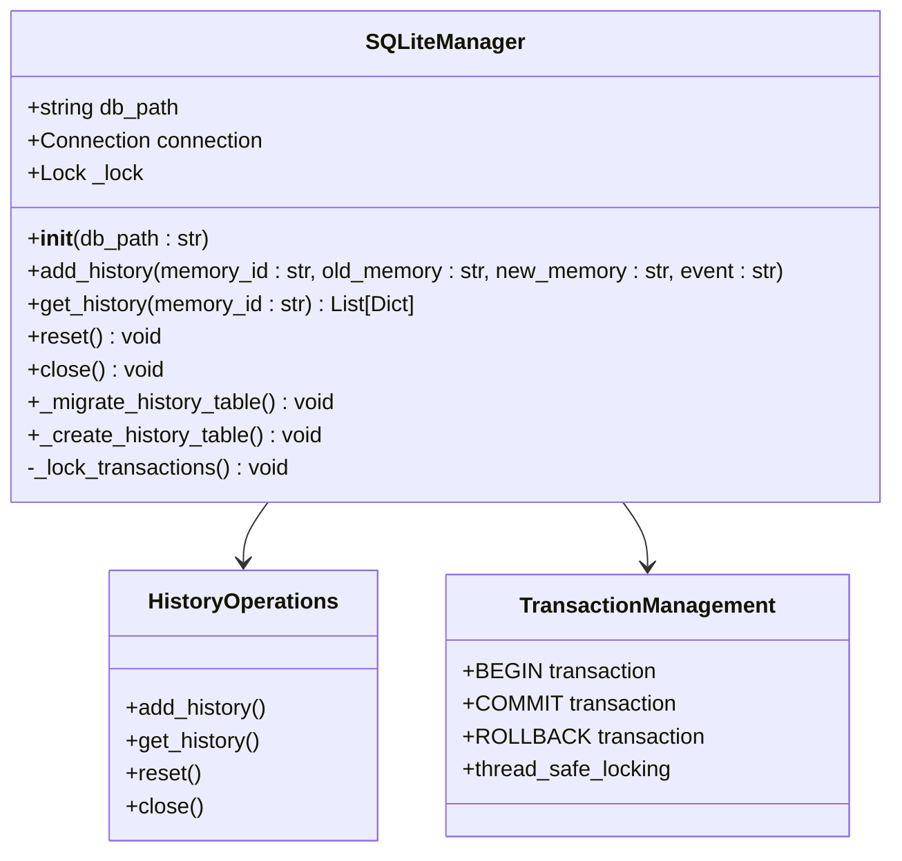
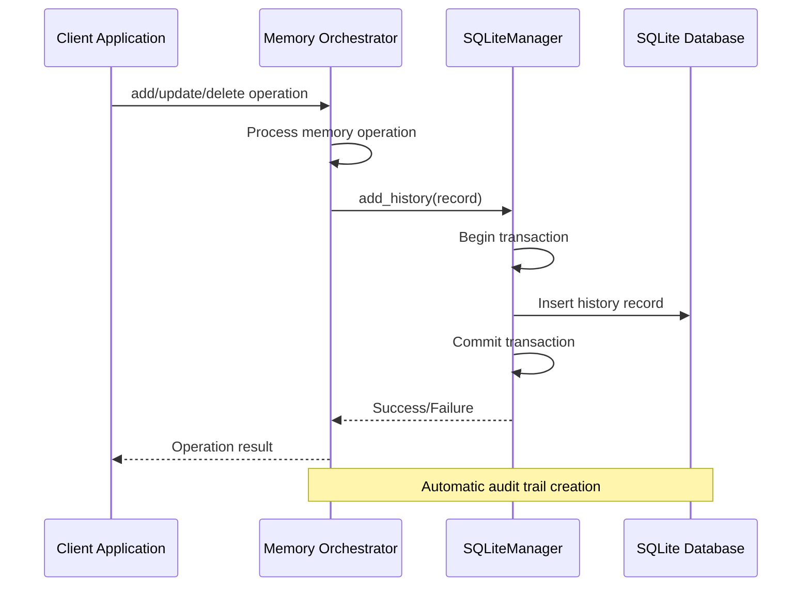
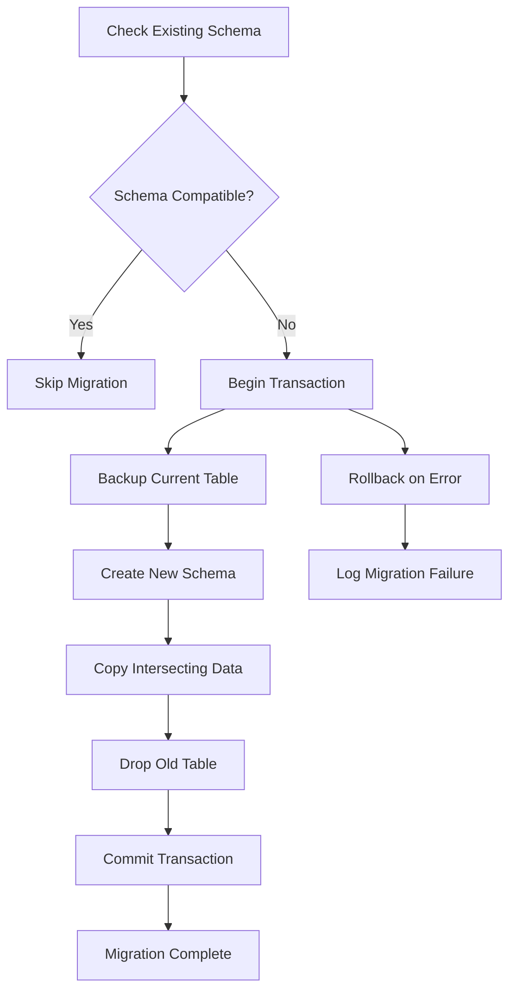
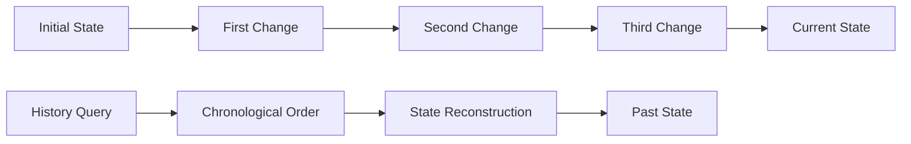

# History Storage

<cite>
**Referenced Files in This Document**
- [storage.py](file://mem0/memory/storage.py)
- [main.py](file://mem0/memory/main.py)
- [base.py](file://mem0/memory/base.py)
- [utils.py](file://mem0/memory/utils.py)
- [base.ts](file://mem0-ts/src/oss/src/storage/base.ts)
- [SQLiteManager.ts](file://mem0-ts/src/oss/src/storage/SQLiteManager.ts)
- [MemoryHistoryManager.ts](file://mem0-ts/src/oss/src/storage/MemoryHistoryManager.ts)
- [test_storage.py](file://tests/memory/test_storage.py)
- [base.py](file://mem0/configs/base.py)
</cite>

## Table of Contents
1. [Introduction](#introduction)
2. [Architecture Overview](#architecture-overview)
3. [SQLite Manager Implementation](#sqlite-manager-implementation)
4. [Schema Design](#schema-design)
5. [Integration with Memory Orchestrator](#integration-with-memory-orchestrator)
6. [History Operations](#history-operations)
7. [Migration and Compatibility](#migration-and-compatibility)
8. [Performance Considerations](#performance-considerations)
9. [Querying and Reconstruction](#querying-and-reconstruction)
10. [Debugging and Compliance](#debugging-and-compliance)
11. [Troubleshooting Guide](#troubleshooting-guide)
12. [Conclusion](#conclusion)

## Introduction

The history storage mechanism in MEM0 serves as a comprehensive audit trail system that maintains a complete record of all memory changes throughout the system's lifecycle. This mechanism enables debugging capabilities, compliance requirements, and rollback functionality by tracking every create, update, and delete operation with detailed metadata and timestamps.

The system employs SQLite as the underlying database engine, providing reliable persistence while maintaining excellent performance characteristics for historical queries. The architecture is designed to handle high-frequency write operations typical in memory management scenarios while ensuring data integrity and enabling efficient historical reconstruction.

## Architecture Overview

The history storage system follows a layered architecture that separates concerns between data persistence, business logic, and application integration:



**Diagram sources**
- [storage.py](file://mem0/memory/storage.py#L9-L219)
- [main.py](file://mem0/memory/main.py#L131-L1045)
- [base.ts](file://mem0-ts/src/oss/src/storage/base.ts#L1-L14)

The architecture ensures loose coupling between the memory management system and the history storage, allowing for independent evolution of both components while maintaining seamless integration.

**Section sources**
- [storage.py](file://mem0/memory/storage.py#L9-L219)
- [main.py](file://mem0/memory/main.py#L131-L1045)

## SQLite Manager Implementation

The core of the history storage system is the `SQLiteManager` class, which provides thread-safe database operations with comprehensive transaction management:



**Diagram sources**
- [storage.py](file://mem0/memory/storage.py#L9-L219)

### Thread Safety and Concurrency

The SQLiteManager implements robust thread safety mechanisms using Python's `threading.Lock` to ensure atomic operations across multiple concurrent memory operations. Each database operation is wrapped in a transaction block to maintain data consistency.

### Database Connection Management

The system supports both in-memory and persistent database configurations. The default configuration uses an in-memory SQLite database (`:memory:`) for testing and development environments, while production deployments utilize persistent databases stored on disk.

**Section sources**
- [storage.py](file://mem0/memory/storage.py#L9-L219)

## Schema Design

The history table schema is designed to capture comprehensive metadata about each memory change while maintaining optimal query performance:

| Column Name | Data Type | Constraints | Description |
|-------------|-----------|-------------|-------------|
| id | TEXT | PRIMARY KEY | Unique identifier for each history record |
| memory_id | TEXT | NOT NULL | Reference to the affected memory item |
| old_memory | TEXT | NULLABLE | Previous content before change |
| new_memory | TEXT | NULLABLE | Updated content after change |
| event | TEXT | NOT NULL | Operation type: ADD, UPDATE, DELETE |
| created_at | DATETIME | NOT NULL | Timestamp of record creation |
| updated_at | DATETIME | NULLABLE | Timestamp of last modification |
| is_deleted | INTEGER | DEFAULT 0 | Soft deletion flag (0=false, 1=true) |
| actor_id | TEXT | NULLABLE | Identifier of the entity making the change |
| role | TEXT | NULLABLE | Role of the actor (user, system, etc.) |

### Index Strategy

The schema includes strategic indexing to optimize common query patterns:

- **Primary Key Index**: Automatically created on the `id` column for fast lookups
- **Foreign Key Index**: Implicit index on `memory_id` for efficient history queries
- **Composite Index**: Combined index on `(memory_id, created_at)` for chronological ordering

### Data Types and Validation

The schema enforces strict data type constraints to ensure data integrity:

- **TEXT**: Used for all string fields to accommodate variable-length content
- **DATETIME**: Standardized timestamp format for temporal queries
- **INTEGER**: Boolean-like fields use integer values (0/1) for SQLite compatibility

**Section sources**
- [storage.py](file://mem0/memory/storage.py#L105-L117)

## Integration with Memory Orchestrator

The history storage system integrates seamlessly with the main memory orchestrator through well-defined interfaces and automatic triggers:



**Diagram sources**
- [main.py](file://mem0/memory/main.py#L841-L978)
- [storage.py](file://mem0/memory/storage.py#L125-L166)

### Write Operation Triggers

Every memory modification automatically triggers a corresponding history record creation:

1. **Create Operations**: Records `NULL` as old_memory with new content as new_memory
2. **Update Operations**: Captures both previous and new content values
3. **Delete Operations**: Preserves the deleted content with soft deletion flag

### Metadata Propagation

The system automatically propagates relevant metadata from memory operations to history records, including actor identification and role information for accountability.

**Section sources**
- [main.py](file://mem0/memory/main.py#L841-L978)

## History Operations

The SQLiteManager provides comprehensive operations for managing historical records:

### Adding History Records

The `add_history` method creates new entries with automatic timestamp generation and unique identifier assignment:

```python
# Example usage pattern
self.db.add_history(
    memory_id=memory_id,
    old_memory=previous_content,
    new_memory=new_content,
    event="UPDATE",
    created_at=timestamp,
    actor_id=actor_identifier,
    role=user_role
)
```

### Retrieving History

The `get_history` method provides chronological ordering with support for filtering by memory ID:

```python
# Chronological ordering implementation
ORDER BY created_at ASC, DATETIME(updated_at) ASC
```

### Batch Operations

The system efficiently handles batch operations through transaction management, ensuring atomicity for multiple history record creations.

**Section sources**
- [storage.py](file://mem0/memory/storage.py#L125-L196)

## Migration and Compatibility

The system includes sophisticated migration capabilities to handle schema evolution while preserving existing data:



**Diagram sources**
- [storage.py](file://mem0/memory/storage.py#L17-L97)

### Migration Process

The migration system handles schema evolution transparently:

1. **Detection**: Identifies existing tables with outdated schemas
2. **Backup**: Creates temporary backups of existing data
3. **Transformation**: Applies schema updates while preserving compatible data
4. **Validation**: Ensures data integrity after migration
5. **Cleanup**: Removes obsolete table structures

### Backward Compatibility

The system maintains backward compatibility through graceful degradation and fallback mechanisms, ensuring that older clients can continue operating even when schema changes occur.

**Section sources**
- [storage.py](file://mem0/memory/storage.py#L17-L97)

## Performance Considerations

The history storage system is designed with performance optimization in mind, balancing audit requirements with operational efficiency:

### Write Performance

- **Batch Inserts**: Multiple history records can be inserted within a single transaction
- **Asynchronous Operations**: Non-blocking write operations prevent system bottlenecks
- **Connection Pooling**: Efficient database connection management reduces overhead

### Read Performance

- **Indexed Queries**: Strategic indexing optimizes common query patterns
- **Chronological Ordering**: Pre-sorted data minimizes runtime sorting costs
- **Selective Retrieval**: Filtered queries reduce result set sizes

### Storage Optimization

- **Compression**: SQLite's built-in compression reduces storage requirements
- **Archival Strategies**: Configurable retention policies for historical data
- **Index Maintenance**: Automated index optimization prevents fragmentation

### Scalability Patterns

The system supports horizontal scaling through:

- **Partitioning**: Large datasets can be partitioned by time periods
- **Sharding**: Multiple database instances for high-volume scenarios
- **Caching**: Frequently accessed history data cached in memory

**Section sources**
- [storage.py](file://mem0/memory/storage.py#L125-L196)

## Querying and Reconstruction

The history storage system enables sophisticated querying and historical reconstruction capabilities:

### Basic History Queries

```python
# Retrieve complete history for a memory
history_records = db.get_history(memory_id="mem_123")

# Query with filtering
filtered_history = db.get_history(memory_id="mem_123")
```

### Historical Reconstruction

The system enables complete reconstruction of memory states at any point in time:



**Diagram sources**
- [storage.py](file://mem0/memory/storage.py#L168-L196)

### State Reconciliation

The system supports state reconciliation across multiple memory operations, enabling:

- **Conflict Resolution**: Identifying and resolving conflicting changes
- **Version Comparison**: Comparing different historical states
- **Change Tracking**: Detailed audit trails for compliance requirements

**Section sources**
- [storage.py](file://mem0/memory/storage.py#L168-L196)

## Debugging and Compliance

The history storage system provides comprehensive capabilities for debugging and regulatory compliance:

### Debugging Features

- **Change Auditing**: Complete audit trails for all modifications
- **Actor Tracking**: Identification of who made specific changes
- **Temporal Analysis**: Understanding change patterns over time
- **Root Cause Analysis**: Identifying the origin of issues

### Compliance Support

The system meets regulatory requirements through:

- **Immutable Records**: Preventable modification of historical data
- **Timestamp Accuracy**: Precise timing information for audit purposes
- **Access Controls**: Granular permissions for history data
- **Retention Policies**: Configurable data retention requirements

### Monitoring and Alerting

Built-in monitoring capabilities include:

- **Operation Metrics**: Tracking of history operation frequencies
- **Performance Indicators**: Query response times and throughput
- **Error Reporting**: Comprehensive error logging and alerting
- **Capacity Planning**: Historical growth trends for resource planning

**Section sources**
- [storage.py](file://mem0/memory/storage.py#L125-L196)

## Troubleshooting Guide

Common issues and their resolutions:

### Database Connection Issues

**Problem**: SQLite database connection failures
**Solution**: Verify database file permissions and disk space availability

### Performance Degradation

**Problem**: Slow history queries
**Solution**: Review index usage and consider schema optimization

### Data Integrity Issues

**Problem**: Corrupted history records
**Solution**: Implement data validation and repair procedures

### Migration Failures

**Problem**: Schema migration errors
**Solution**: Review migration logs and restore from backup if necessary

**Section sources**
- [storage.py](file://mem0/memory/storage.py#L17-L97)
- [test_storage.py](file://tests/memory/test_storage.py#L11-L281)

## Conclusion

The history storage mechanism in MEM0 represents a sophisticated approach to maintaining comprehensive audit trails while optimizing for performance and usability. Through its SQLite-based architecture, robust transaction management, and seamless integration with the memory orchestrator, the system provides essential capabilities for debugging, compliance, and system reliability.

The system's design emphasizes both functional completeness and operational efficiency, ensuring that the overhead of maintaining historical records remains minimal while providing maximum value for system monitoring and recovery scenarios. Future enhancements may include advanced analytics capabilities, real-time streaming of history events, and enhanced archival strategies for long-term data retention.