# LLM Integration

<cite>
**Referenced Files in This Document**   
- [base.py](file://mem0/llms/base.py)
- [openai.py](file://mem0/llms/openai.py)
- [anthropic.py](file://mem0/llms/anthropic.py)
- [azure_openai.py](file://mem0/llms/azure_openai.py)
- [openai_structured.py](file://mem0/llms/openai_structured.py)
- [gemini.py](file://mem0/llms/gemini.py)
- [litellm.py](file://mem0/llms/litellm.py)
- [base.py](file://mem0/configs/llms/base.py)
- [openai.py](file://mem0/configs/llms/openai.py)
- [anthropic.py](file://mem0/configs/llms/anthropic.py)
- [azure.py](file://mem0/configs/llms/azure.py)
- [factory.py](file://mem0/utils/factory.py)
- [prompts.py](file://mem0/configs/prompts.py)
- [utils.py](file://mem0/memory/utils.py)
- [exceptions.py](file://mem0/exceptions.py)
</cite>

## Table of Contents
1. [Introduction](#introduction)
2. [LLM Base Class Architecture](#llm-base-class-architecture)
3. [Provider-Specific Implementations](#provider-specific-implementations)
4. [Configuration System](#configuration-system)
5. [LLM Factory and Provider Creation](#llm-factory-and-provider-creation)
6. [Prompt Management and Memory Inference](#prompt-management-and-memory-inference)
7. [Structured Output Handling](#structured-output-handling)
8. [Error Recovery and Rate Limiting](#error-recovery-and-rate-limiting)
9. [Token Optimization and Performance](#token-optimization-and-performance)
10. [Standard vs Structured LLM Implementations](#standard-vs-structured-llm-implementations)

## Introduction

Mem0 provides a comprehensive integration framework for various LLM providers through its modular LLM component. The system is designed to abstract the complexities of different LLM APIs while providing a consistent interface for memory management, fact extraction, and structured output generation. This documentation details the architecture of the LLM integration system, focusing on the abstract base class, provider implementations, configuration management, and key operational aspects such as prompt handling, structured output processing, and error recovery mechanisms.

The LLM component serves as the cognitive engine for Mem0's memory system, responsible for extracting facts from conversations, determining memory updates, and generating responses based on stored knowledge. The architecture supports multiple providers including OpenAI, Anthropic, Azure OpenAI, and others, with a factory pattern that enables seamless switching between providers based on configuration.

**Section sources**
- [base.py](file://mem0/llms/base.py#L1-L132)
- [factory.py](file://mem0/utils/factory.py#L23-L119)

## LLM Base Class Architecture

The LLM integration system is built around an abstract base class `LLMBase` defined in `mem0/llms/base.py`. This base class provides common functionality and enforces a consistent interface across all LLM providers. The architecture follows the Abstract Base Class (ABC) pattern, ensuring that all provider implementations adhere to a standardized contract.

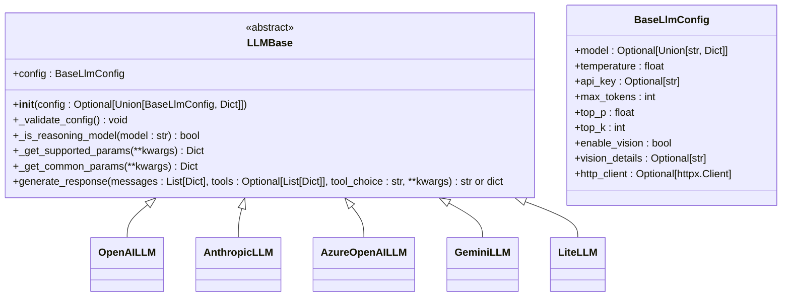

**Diagram sources **
- [base.py](file://mem0/llms/base.py#L7-L132)
- [base.py](file://mem0/configs/llms/base.py#L7-L63)

The `LLMBase` class implements several key features:

1. **Configuration Handling**: The constructor accepts configuration in multiple formats (direct config object, dictionary, or None for defaults) and converts it to a standardized configuration object.

2. **Model Type Detection**: The `_is_reasoning_model` method identifies models like GPT-5 series or reasoning models that have different parameter requirements, allowing the system to filter unsupported parameters.

3. **Parameter Management**: The `_get_supported_params` method dynamically filters parameters based on the model type, ensuring compatibility with reasoning models that don't support certain parameters like temperature or max_tokens.

4. **Common Parameter Generation**: The `_get_common_params` method consolidates standard LLM parameters (temperature, max_tokens, top_p) from the configuration, providing a foundation for provider-specific implementations.

The base class enforces the implementation of the `generate_response` abstract method, which all provider-specific classes must implement. This method defines the core interface for generating responses from the LLM, accepting messages, tools, and additional parameters.

**Section sources**
- [base.py](file://mem0/llms/base.py#L7-L132)

## Provider-Specific Implementations

Mem0 implements provider-specific LLM classes that inherit from the `LLMBase` class, each tailored to the specific API requirements of their respective providers. These implementations handle provider-specific authentication, parameter formatting, and response parsing.

### OpenAI Implementation

The `OpenAILLM` class in `mem0/llms/openai.py` provides integration with OpenAI's API, including support for OpenRouter as an alternative endpoint. The implementation handles API key management, base URL configuration, and response parsing for both standard and tool-calling responses.

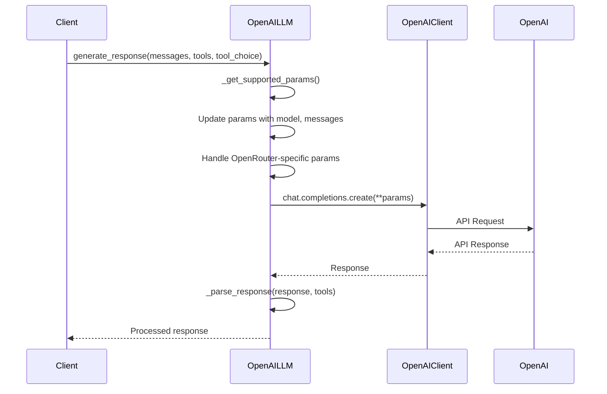

**Diagram sources **
- [openai.py](file://mem0/llms/openai.py#L14-L148)

### Anthropic Implementation

The `AnthropicLLM` class in `mem0/llms/anthropic.py` implements integration with Anthropic's API. A key feature of this implementation is the separation of system messages from other messages, as Anthropic's API requires the system message to be passed separately from the conversation history.

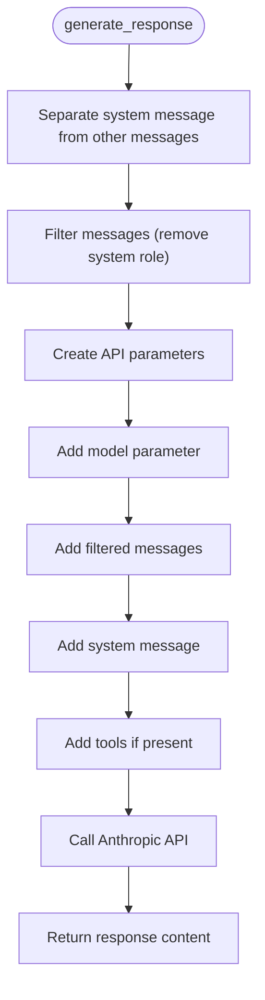

**Diagram sources **
- [anthropic.py](file://mem0/llms/anthropic.py#L14-L88)

### Azure OpenAI Implementation

The `AzureOpenAILLM` class in `mem0/llms/azure_openai.py` provides integration with Azure OpenAI services, supporting both API key authentication and Azure Active Directory authentication. The implementation handles Azure-specific configuration through the `azure_kwargs` parameter.

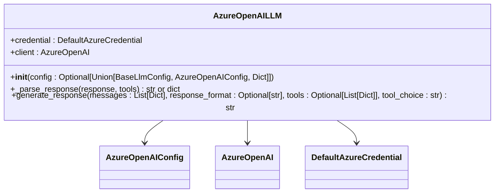

**Diagram sources **
- [azure_openai.py](file://mem0/llms/azure_openai.py#L16-L142)

### Gemini Implementation

The `GeminiLLM` class in `mem0/llms/gemini.py` implements integration with Google's Gemini API. This implementation includes specialized methods for reformatting messages and tools to match Gemini's API requirements, as well as parsing the unique response structure returned by the API.

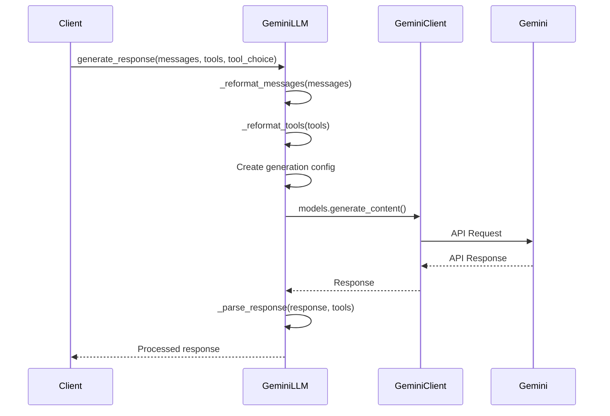

**Diagram sources **
- [gemini.py](file://mem0/llms/gemini.py#L14-L202)

**Section sources**
- [openai.py](file://mem0/llms/openai.py#L14-L148)
- [anthropic.py](file://mem0/llms/anthropic.py#L14-L88)
- [azure_openai.py](file://mem0/llms/azure_openai.py#L16-L142)
- [gemini.py](file://mem0/llms/gemini.py#L14-L202)

## Configuration System

Mem0 employs a hierarchical configuration system that combines a base configuration class with provider-specific extensions. This design allows for both common parameters across all LLMs and specialized parameters for individual providers.

### Base Configuration

The `BaseLlmConfig` class in `mem0/configs/llms/base.py` defines the common parameters used by all LLM providers:

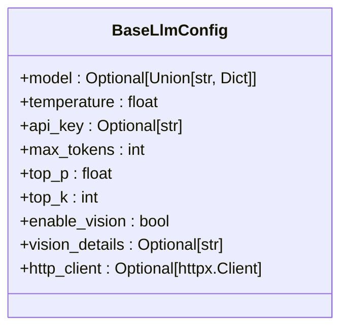

**Diagram sources **
- [base.py](file://mem0/configs/llms/base.py#L7-L63)

These parameters include:
- **model**: The identifier for the specific LLM to use
- **temperature**: Controls randomness in output (0.0 to 2.0)
- **api_key**: Authentication key for the LLM provider
- **max_tokens**: Maximum tokens to generate in the response
- **top_p**: Nucleus sampling parameter for diversity control
- **top_k**: Top-k sampling parameter for token selection
- **enable_vision**: Flag to enable vision capabilities
- **vision_details**: Level of detail for vision processing
- **http_client**: HTTP client configuration with proxy support

### Provider-Specific Configurations

Each provider extends the base configuration with additional parameters specific to that provider:

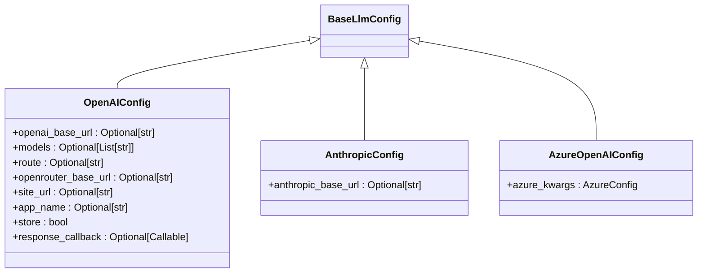

**Diagram sources **
- [openai.py](file://mem0/configs/llms/openai.py#L6-L80)
- [anthropic.py](file://mem0/configs/llms/anthropic.py#L6-L57)
- [azure.py](file://mem0/configs/llms/azure.py#L7-L58)

The `OpenAIConfig` adds parameters for OpenRouter integration, including:
- **openai_base_url**: Custom base URL for OpenAI API
- **models**: List of models for OpenRouter routing
- **route**: OpenRouter routing strategy
- **site_url** and **app_name**: Attribution for OpenRouter usage
- **response_callback**: Function to monitor LLM responses

The `AzureOpenAIConfig` uses an `azure_kwargs` parameter that contains Azure-specific configuration options like deployment name, endpoint, and API version, allowing for flexible Azure OpenAI configuration.

**Section sources**
- [base.py](file://mem0/configs/llms/base.py#L7-L63)
- [openai.py](file://mem0/configs/llms/openai.py#L6-L80)
- [anthropic.py](file://mem0/configs/llms/anthropic.py#L6-L57)
- [azure.py](file://mem0/configs/llms/azure.py#L7-L58)

## LLM Factory and Provider Creation

The LLM factory system in `mem0/utils/factory.py` provides a centralized mechanism for creating LLM instances based on configuration. This factory pattern enables dynamic provider selection and consistent configuration handling across the application.

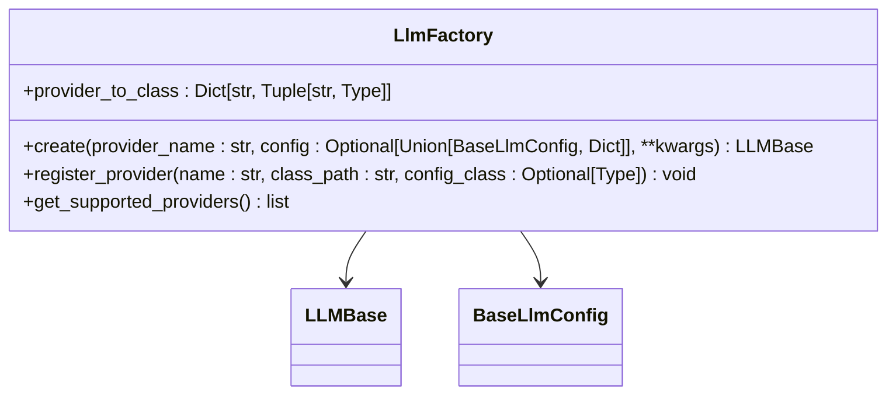

**Diagram sources **
- [factory.py](file://mem0/utils/factory.py#L23-L119)

The factory maintains a mapping of provider names to their corresponding class paths and configuration classes:

```python
provider_to_class = {
    "ollama": ("mem0.llms.ollama.OllamaLLM", OllamaConfig),
    "openai": ("mem0.llms.openai.OpenAILLM", OpenAIConfig),
    "anthropic": ("mem0.llms.anthropic.AnthropicLLM", AnthropicConfig),
    "azure_openai": ("mem0.llms.azure_openai.AzureOpenAILLM", AzureOpenAIConfig),
    "openai_structured": ("mem0.llms.openai_structured.OpenAIStructuredLLM", OpenAIConfig),
    # ... other providers
}
```

The `create` method handles several key responsibilities:
1. **Provider Validation**: Checks if the requested provider is supported
2. **Configuration Handling**: Accepts configuration in multiple formats (None, dict, or config object) and converts it to the appropriate provider-specific config class
3. **Dynamic Instantiation**: Loads the LLM class dynamically and creates an instance with the processed configuration

This factory system enables flexible provider selection through configuration, allowing users to switch between LLM providers without changing code, simply by modifying the provider name in the configuration.

**Section sources**
- [factory.py](file://mem0/utils/factory.py#L23-L119)

## Prompt Management and Memory Inference

Mem0 employs a sophisticated prompt management system for fact extraction and memory inference, using carefully crafted prompts to guide the LLM in extracting relevant information from conversations and determining appropriate memory updates.

### Fact Extraction Prompts

The system uses the `FACT_RETRIEVAL_PROMPT` defined in `mem0/configs/prompts.py` to extract facts from conversations. This prompt instructs the LLM to identify and extract specific types of information:

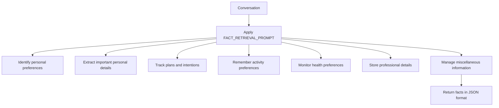

**Diagram sources **
- [prompts.py](file://mem0/configs/prompts.py#L14-L59)

The prompt includes detailed instructions and examples for each type of information to extract, ensuring consistent fact extraction across different conversations. The system also supports custom fact extraction prompts through the `custom_fact_extraction_prompt` configuration option.

### Memory Update Prompts

For determining how to update the memory based on newly extracted facts, Mem0 uses the `DEFAULT_UPDATE_MEMORY_PROMPT` which guides the LLM through four possible operations:

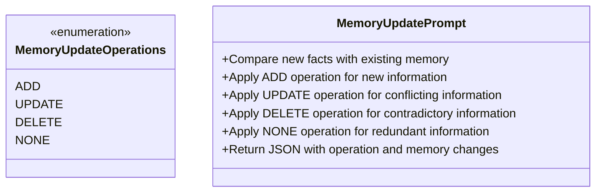

**Diagram sources **
- [prompts.py](file://mem0/configs/prompts.py#L61-L209)

The memory update process follows these steps:
1. Retrieve existing memories from the vector store
2. Extract new facts from the current conversation
3. Present both existing memories and new facts to the LLM with the update prompt
4. Receive a JSON response specifying which memories to add, update, delete, or leave unchanged
5. Apply the changes to the memory system

The system uses the `get_update_memory_messages` function to construct the appropriate prompt with the current memory state and new facts, ensuring the LLM has all necessary context to make informed decisions about memory updates.

**Section sources**
- [prompts.py](file://mem0/configs/prompts.py#L14-L346)
- [utils.py](file://mem0/memory/utils.py#L7-L21)
- [main.py](file://mem0/memory/main.py#L348-L365)

## Structured Output Handling

Mem0 implements robust structured output handling to ensure reliable parsing of LLM responses, particularly for JSON-formatted outputs used in fact extraction and memory updates.

### Response Parsing

Each LLM implementation includes a `_parse_response` method that processes the raw API response into a standardized format. For providers that support tool calling (like OpenAI), this method extracts both the content and any tool calls from the response:

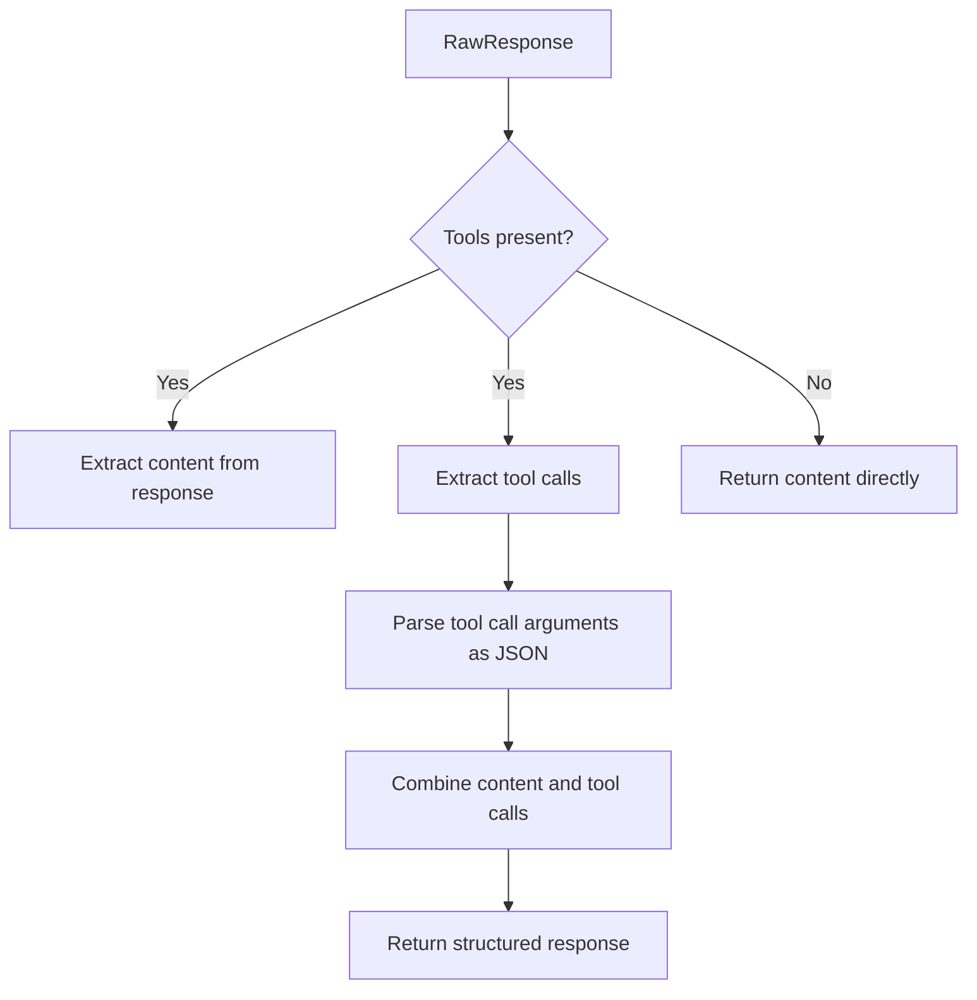

**Diagram sources **
- [openai.py](file://mem0/llms/openai.py#L53-L82)
- [azure_openai.py](file://mem0/llms/azure_openai.py#L70-L99)
- [gemini.py](file://mem0/llms/gemini.py#L24-L67)

The parsing process includes:
- Extracting the main content from the response
- Processing any tool/function calls, including parsing arguments from JSON strings
- Handling different response formats across providers
- Removing code block markers from responses when necessary

### JSON Extraction and Cleaning

The system includes utility functions in `mem0/memory/utils.py` to handle JSON extraction and cleaning:

```python
def extract_json(text):
    """
    Extracts JSON content from a string, removing enclosing triple backticks and optional 'json' tag if present.
    If no code block is found, returns the text as-is.
    """
    text = text.strip()
    match = re.search(r"```(?:json)?\s*(.*?)\s*```", text, re.DOTALL)
    if match:
        json_str = match.group(1)
    else:
        json_str = text  # assume it's raw JSON
    return json_str

def remove_code_blocks(content: str) -> str:
    """
    Removes enclosing code block markers ```[language] and ``` from a given string.
    """
    pattern = r"^```[a-zA-Z0-9]*\n([\s\S]*?)\n```$"
    match = re.match(pattern, content.strip())
    match_res = match.group(1).strip() if match else content.strip()
    return re.sub(r"<think>.*?</think>", "", match_res, flags=re.DOTALL).strip()
```

These functions ensure that JSON responses are properly extracted from code blocks and cleaned of any extraneous formatting, enabling reliable parsing of structured outputs.

**Section sources**
- [openai.py](file://mem0/llms/openai.py#L53-L82)
- [azure_openai.py](file://mem0/llms/azure_openai.py#L70-L99)
- [gemini.py](file://mem0/llms/gemini.py#L24-L67)
- [utils.py](file://mem0/memory/utils.py#L51-L62)

## Error Recovery and Rate Limiting

Mem0 implements comprehensive error handling and recovery mechanisms to ensure reliable operation despite the inherent unreliability of external LLM APIs.

### Exception Hierarchy

The system defines a structured exception hierarchy in `mem0/exceptions.py` that maps HTTP status codes to specific exception types:

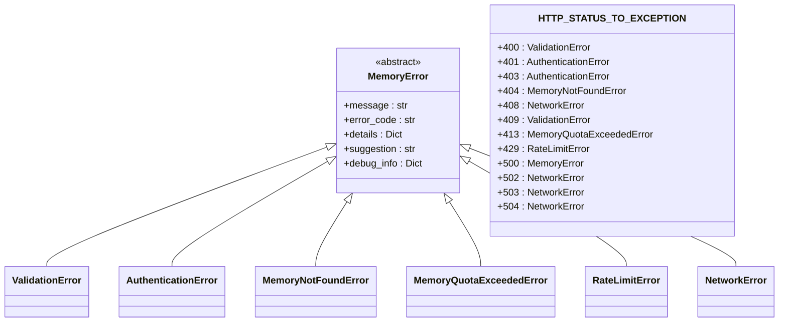

**Diagram sources **
- [exceptions.py](file://mem0/exceptions.py#L424-L439)

### Error Creation and Handling

The `create_exception_from_response` function converts HTTP responses into appropriate exception types with helpful suggestions:

```python
def create_exception_from_response(
    status_code: int,
    response_text: str,
    error_code: Optional[str] = None,
    details: Optional[Dict[str, Any]] = None,
    debug_info: Optional[Dict[str, Any]] = None,
) -> MemoryError:
    """Create an appropriate exception based on HTTP response."""
    exception_class = HTTP_STATUS_TO_EXCEPTION.get(status_code, MemoryError)
    
    # Generate error code if not provided
    if not error_code:
        error_code = f"HTTP_{status_code}"
    
    # Create appropriate suggestion based on status code
    suggestions = {
        400: "Please check your request parameters and try again",
        401: "Please check your API key and authentication credentials",
        403: "You don't have permission to perform this operation",
        404: "The requested resource was not found",
        408: "Request timed out. Please try again",
        409: "Resource conflict. Please check your request",
        413: "Request too large. Please reduce the size of your request",
        422: "Invalid request data. Please check your input",
        429: "Rate limit exceeded. Please wait before making more requests",
        500: "Internal server error. Please try again later",
        502: "Service temporarily unavailable. Please try again later",
        503: "Service unavailable. Please try again later",
        504: "Gateway timeout. Please try again later",
    }
    
    suggestion = suggestions.get(status_code, "Please try again later")
    
    return exception_class(
        message=response_text or f"HTTP {status_code} error",
        error_code=error_code,
        details=details or {},
        suggestion=suggestion,
        debug_info=debug_info or {},
    )
```

### Rate Limiting and Retry Logic

The system includes rate limiting and retry mechanisms to handle API rate limits gracefully. When a rate limit error (HTTP 429) is encountered, the system can extract retry information from response headers:

```python
# In client error handling
if e.response.status_code == 429:
    retry_after = e.response.headers.get("Retry-After")
    if retry_after:
        try:
            debug_info["retry_after"] = int(retry_after)
        except ValueError:
            pass
    
    # Add rate limit headers if available
    for header in ["X-RateLimit-Limit", "X-RateLimit-Remaining", "X-RateLimit-Reset"]:
        value = e.response.headers.get(header)
        if value:
            debug_info[header.lower()] = value
```

The documentation also references a `rate_limit_retry` decorator that implements exponential backoff for rate-limited requests:

```python
@rate_limit_retry()
def safe_memory_add(memory, content, user_id):
    return memory.add(content, user_id=user_id)
```

This decorator would implement exponential backoff with a configurable number of retries, allowing the system to automatically recover from temporary rate limiting.

**Section sources**
- [exceptions.py](file://mem0/exceptions.py#L422-L503)
- [utils.py](file://mem0/client/utils.py#L45-L74)

## Token Optimization and Performance

Mem0 implements several strategies for token optimization and performance improvement in its LLM interactions.

### Reasoning Model Detection

The system includes logic to detect reasoning models (like GPT-5 series or o1 models) that have different parameter requirements:

```python
def _is_reasoning_model(self, model: str) -> bool:
    """
    Check if the model is a reasoning model or GPT-5 series that doesn't support certain parameters.
    
    Args:
        model: The model name to check
        
    Returns:
        bool: True if the model is a reasoning model or GPT-5 series
    """
    reasoning_models = {
        "o1", "o1-preview", "o3-mini", "o3",
        "gpt-5", "gpt-5o", "gpt-5o-mini", "gpt-5o-micro",
    }
    
    if model.lower() in reasoning_models:
        return True
    
    model_lower = model.lower()
    if any(reasoning_model in model_lower for reasoning_model in ["gpt-5", "o1", "o3"]):
        return True
        
    return False
```

When a reasoning model is detected, the system filters out unsupported parameters like temperature and max_tokens, ensuring compatibility with these advanced models.

### Parameter Filtering

The `_get_supported_params` method dynamically filters parameters based on the model type:

```python
def _get_supported_params(self, **kwargs) -> Dict:
    """
    Get parameters that are supported by the current model.
    Filters out unsupported parameters for reasoning models and GPT-5 series.
    
    Args:
        **kwargs: Additional parameters to include
        
    Returns:
        Dict: Filtered parameters dictionary
    """
    model = getattr(self.config, 'model', '')
    
    if self._is_reasoning_model(model):
        supported_params = {}
        
        if "messages" in kwargs:
            supported_params["messages"] = kwargs["messages"]
        if "response_format" in kwargs:
            supported_params["response_format"] = kwargs["response_format"]
        if "tools" in kwargs:
            supported_params["tools"] = kwargs["tools"]
        if "tool_choice" in kwargs:
            supported_params["tool_choice"] = kwargs["tool_choice"]
            
        return supported_params
    else:
        # For regular models, include all common parameters
        return self._get_common_params(**kwargs)
```

This ensures that only supported parameters are sent to the LLM API, preventing errors and improving efficiency.

### Vision Processing Optimization

For models with vision capabilities, the system includes optimized processing for image inputs:

```python
def get_image_description(image_obj, llm, vision_details):
    """
    Get the description of the image
    """
    if isinstance(image_obj, str):
        messages = [
            {
                "role": "user",
                "content": [
                    {
                        "type": "text",
                        "text": "A user is providing an image. Provide a high level description of the image and do not include any additional text.",
                    },
                    {"type": "image_url", "image_url": {"url": image_obj, "detail": vision_details}},
                ],
            },
        ]
    else:
        messages = [image_obj]

    response = llm.generate_response(messages=messages)
    return response
```

The system uses a concise prompt focused on high-level description, minimizing token usage while still extracting useful information from images.

**Section sources**
- [base.py](file://mem0/llms/base.py#L43-L65)
- [base.py](file://mem0/llms/base.py#L67-L95)
- [utils.py](file://mem0/memory/utils.py#L65-L87)

## Standard vs Structured LLM Implementations

Mem0 distinguishes between standard LLM implementations and structured LLM implementations, each serving different purposes in the memory system.

### Standard LLM Implementations

Standard implementations (like `OpenAILLM`, `AnthropicLLM`) are designed for general-purpose text generation and tool calling. They inherit from `LLMBase` and implement the full `generate_response` interface with support for tools and flexible response formats.

Key characteristics:
- Support for tool/function calling
- Flexible response format handling
- Comprehensive parameter support
- Used for general conversation and complex reasoning tasks

### Structured LLM Implementations

Structured implementations (like `OpenAIStructuredLLM`, `AzureOpenAIStructuredLLM`) are optimized for reliable JSON output generation. These implementations use the beta `parse` method from the OpenAI API to ensure valid JSON responses.

```mermaid
classDiagram
LLMBase <|-- OpenAILLM
LLMBase <|-- OpenAIStructuredLLM
class OpenAIStructuredLLM {
+generate_response(messages : List[Dict], response_format : Optional[str], tools : Optional[List[Dict]], tool_choice : str) str
}
OpenAIStructuredLLM --> "beta.chat.completions.parse"
```

**Diagram sources **
- [openai_structured.py](file://mem0/llms/openai_structured.py#L10-L53)

The structured implementations have several key differences:
1. **Simplified Interface**: They use the `beta.chat.completions.parse` method which guarantees valid JSON output according to a schema.
2. **Reduced Parameter Set**: They include only essential parameters, focusing on reliability over flexibility.
3. **Optimized for Structured Output**: They are specifically designed for tasks requiring reliable JSON parsing, such as fact extraction and memory updates.
4. **Default to Latest Structured Models**: They default to the latest models optimized for structured output (e.g., "gpt-4o-2024-08-06").

The choice between standard and structured implementations depends on the use case:
- Use structured implementations when reliable JSON output is critical (fact extraction, memory updates)
- Use standard implementations when flexibility and tool calling are needed (general conversation, complex reasoning)

This distinction allows Mem0 to optimize for both reliability in structured tasks and flexibility in general-purpose tasks.

**Section sources**
- [openai.py](file://mem0/llms/openai.py#L14-L148)
- [openai_structured.py](file://mem0/llms/openai_structured.py#L10-L53)
- [azure_openai_structured.py](file://mem0/llms/azure_openai_structured.py)