# Memory Orchestrator

<cite>
**Referenced Files in This Document**
- [mem0/memory/main.py](file://mem0/memory/main.py)
- [mem0/client/main.py](file://mem0/client/main.py)
- [mem0/utils/factory.py](file://mem0/utils/factory.py)
- [mem0/configs/base.py](file://mem0/configs/base.py)
- [mem0/memory/base.py](file://mem0/memory/base.py)
- [mem0/memory/storage.py](file://mem0/memory/storage.py)
- [mem0/exceptions.py](file://mem0/exceptions.py)
</cite>

## Table of Contents
1. [Introduction](#introduction)
2. [Architecture Overview](#architecture-overview)
3. [Core Components](#core-components)
4. [Configuration System](#configuration-system)
5. [Memory Operations Lifecycle](#memory-operations-lifecycle)
6. [Async/Sync Execution Paths](#async-sync-execution-paths)
7. [Error Handling and Fallback Strategies](#error-handling-and-fallback-strategies)
8. [Integration Patterns](#integration-patterns)
9. [Performance Considerations](#performance-considerations)
10. [Troubleshooting Guide](#troubleshooting-guide)
11. [Conclusion](#conclusion)

## Introduction

The Memory orchestrator in `main.py` serves as the central coordination hub for all memory operations within the Mem0 system. It acts as the primary interface between users and the underlying memory infrastructure, seamlessly integrating LLMs for fact extraction and inference, embedders for vectorization, vector stores for semantic search, graph stores for relationship mapping, and storage backends for history tracking.

This orchestrator implements both synchronous and asynchronous execution patterns, providing flexibility for different use cases while maintaining consistency in the memory management lifecycle. The system is designed with modularity and extensibility in mind, allowing for easy integration of new components and providers.

## Architecture Overview

The Memory orchestrator follows a layered architecture pattern with clear separation of concerns:

**Diagram sources**
- [mem0/memory/main.py](file://mem0/memory/main.py#L131-L170)
- [mem0/client/main.py](file://mem0/client/main.py#L24-L106)
- [mem0/utils/factory.py](file://mem0/utils/factory.py#L23-L224)

**Section sources**
- [mem0/memory/main.py](file://mem0/memory/main.py#L131-L170)
- [mem0/client/main.py](file://mem0/client/main.py#L24-L106)

## Core Components

### Memory Class (Synchronous)

The `Memory` class serves as the primary synchronous orchestrator, implementing the core memory operations with thread-based parallelism for optimal performance:

**Diagram sources**
- [mem0/memory/main.py](file://mem0/memory/main.py#L131-L170)
- [mem0/configs/base.py](file://mem0/configs/base.py#L29-L61)

### AsyncMemory Class (Asynchronous)

The `AsyncMemory` class provides fully asynchronous operations using asyncio for non-blocking execution:

**Diagram sources**
- [mem0/memory/main.py](file://mem0/memory/main.py#L1009-L1911)

**Section sources**
- [mem0/memory/main.py](file://mem0/memory/main.py#L131-L170)
- [mem0/memory/main.py](file://mem0/memory/main.py#L1009-L1911)

## Configuration System

The configuration system provides flexible and extensible setup for all memory components through the `MemoryConfig` class:

### Configuration Injection Pattern

The orchestrator uses a factory-based approach for component instantiation:

**Diagram sources**
- [mem0/utils/factory.py](file://mem0/utils/factory.py#L23-L224)
- [mem0/memory/main.py](file://mem0/memory/main.py#L137-L157)

### Component Factory Implementation

Each factory implements a standardized interface for component creation:

| Factory | Purpose | Key Features |
|---------|---------|--------------|
| `EmbedderFactory` | Creates embedding models | Supports multiple providers, dimension handling |
| `VectorStoreFactory` | Creates vector databases | Handles various vector DB types, reset functionality |
| `LlmFactory` | Creates language models | Provider-specific configs, vision support |
| `GraphStoreFactory` | Creates graph databases | Flexible graph store selection |

**Section sources**
- [mem0/utils/factory.py](file://mem0/utils/factory.py#L23-L224)
- [mem0/memory/main.py](file://mem0/memory/main.py#L137-L157)

## Memory Operations Lifecycle

### Add Operation Lifecycle

The `add` operation demonstrates the orchestrator's coordination capabilities:

```mermaid
sequenceDiagram
participant Client as Client
participant Memory as Memory Orchestrator
participant Embedder as Embedding Model
participant VectorStore as Vector Database
participant GraphStore as Graph Database
participant Storage as History Storage
Client->>Memory : add(messages, user_id, agent_id, ...)
Memory->>Memory : _build_filters_and_metadata()
Memory->>Memory : validate_input_parameters()
alt Procedural Memory
Memory->>Memory : _create_procedural_memory()
Memory-->>Client : Procedural Memory Result
else Standard Memory
par Parallel Processing
Memory->>Embedder : embed(messages, "add")
Embedder-->>Memory : Embeddings
and
Memory->>GraphStore : add(data, filters)
GraphStore-->>Memory : Entities Added
end
Memory->>VectorStore : insert(vectors, ids, payloads)
Memory->>Storage : add_history(memory_id, old_data, new_data, "ADD")
Memory-->>Client : Memory Addition Results
end
```

**Diagram sources**
- [mem0/memory/main.py](file://mem0/memory/main.py#L195-L308)
- [mem0/memory/main.py](file://mem0/memory/main.py#L1135-L1158)

### Search Operation Lifecycle

The search operation showcases the orchestrator's ability to coordinate multiple data sources:

**Diagram sources**
- [mem0/memory/main.py](file://mem0/memory/main.py#L644-L718)
- [mem0/memory/main.py](file://mem0/memory/main.py#L1514-L1591)

**Section sources**
- [mem0/memory/main.py](file://mem0/memory/main.py#L195-L308)
- [mem0/memory/main.py](file://mem0/memory/main.py#L644-L718)

## Async/Sync Execution Paths

### Synchronous Path Implementation

The synchronous path uses ThreadPoolExecutor for CPU-intensive operations:

**Diagram sources**
- [mem0/memory/main.py](file://mem0/memory/main.py#L283-L290)

### Asynchronous Path Implementation

The asynchronous path uses asyncio for non-blocking execution:

**Diagram sources**
- [mem0/memory/main.py](file://mem0/memory/main.py#L1135-L1140)
- [mem0/memory/main.py](file://mem0/memory/main.py#L1339-L1346)

### Execution Strategy Comparison

| Aspect | Synchronous | Asynchronous |
|--------|-------------|--------------|
| **Concurrency Model** | ThreadPoolExecutor | asyncio |
| **CPU-bound Tasks** | Offloaded to threads | Blocked on I/O |
| **Network-bound Tasks** | Thread blocking | Non-blocking |
| **Resource Usage** | Higher thread overhead | Lower resource usage |
| **Scalability** | Limited by thread pool | Better scalability |
| **Error Handling** | Thread-local exceptions | Coroutine-based |

**Section sources**
- [mem0/memory/main.py](file://mem0/memory/main.py#L283-L290)
- [mem0/memory/main.py](file://mem0/memory/main.py#L1135-L1140)

## Error Handling and Fallback Strategies

### Exception Hierarchy

The orchestrator implements a comprehensive exception hierarchy for robust error handling:

**Diagram sources**
- [mem0/exceptions.py](file://mem0/exceptions.py#L34-L466)

### Fallback Strategies

The orchestrator implements several fallback mechanisms:

1. **Component Failure Fallback**: Continue operation with disabled components
2. **Provider Switching**: Automatic fallback to alternative providers
3. **Degraded Mode**: Reduced functionality when components fail
4. **Circuit Breaker**: Prevent cascading failures

**Diagram sources**
- [mem0/exceptions.py](file://mem0/exceptions.py#L442-L466)

**Section sources**
- [mem0/exceptions.py](file://mem0/exceptions.py#L34-L466)

## Integration Patterns

### LLM Integration for Fact Extraction

The orchestrator integrates LLMs for intelligent fact extraction and memory inference:

**Diagram sources**
- [mem0/memory/main.py](file://mem0/memory/main.py#L349-L474)

### Graph Store Integration

The orchestrator coordinates with graph stores for relationship mapping:

**Diagram sources**
- [mem0/memory/main.py](file://mem0/memory/main.py#L483-L492)

### Storage Backend Integration

The orchestrator manages multiple storage backends through the SQLiteManager:

**Diagram sources**
- [mem0/memory/storage.py](file://mem0/memory/storage.py#L10-L219)

**Section sources**
- [mem0/memory/main.py](file://mem0/memory/main.py#L349-L474)
- [mem0/memory/main.py](file://mem0/memory/main.py#L483-L492)
- [mem0/memory/storage.py](file://mem0/memory/storage.py#L10-L219)

## Performance Considerations

### Optimization Strategies

The orchestrator implements several performance optimization techniques:

1. **Parallel Processing**: Concurrent execution of independent operations
2. **Connection Pooling**: Reuse database connections
3. **Embedding Caching**: Cache frequently used embeddings
4. **Batch Operations**: Group multiple operations together
5. **Lazy Loading**: Load components only when needed

### Memory Management

### Scalability Patterns

| Pattern | Implementation | Benefits |
|---------|----------------|----------|
| **Connection Pooling** | SQLiteManager with thread-safe connections | Reduced connection overhead |
| **Async Processing** | asyncio for I/O-bound operations | Better resource utilization |
| **Component Lazy Loading** | Factory pattern for component instantiation | Faster startup times |
| **Batch Operations** | Group multiple vector operations | Improved throughput |

## Troubleshooting Guide

### Common Issues and Solutions

#### Configuration Validation Errors

**Problem**: Invalid configuration parameters
**Solution**: Use `MemoryConfig` validation with proper provider configurations

#### Memory Operation Failures

**Problem**: Operations fail due to component unavailability
**Solution**: Implement circuit breaker pattern and fallback strategies

#### Performance Issues

**Problem**: Slow memory operations
**Solution**: Enable async processing and optimize embedding caching

#### Graph Store Integration Issues

**Problem**: Graph operations fail silently
**Solution**: Check component availability and enable graph store conditionally

### Debugging Techniques

1. **Enable Debug Logging**: Set log level to DEBUG for detailed operation traces
2. **Monitor Component Health**: Track component availability and response times
3. **Validate Configuration**: Use configuration validation before initialization
4. **Test Component Isolation**: Test individual components separately

**Section sources**
- [mem0/exceptions.py](file://mem0/exceptions.py#L34-L466)
- [mem0/memory/main.py](file://mem0/memory/main.py#L131-L170)

## Conclusion

The Memory orchestrator in `main.py` represents a sophisticated and well-architected system for managing complex memory operations. Its modular design, comprehensive error handling, and support for both synchronous and asynchronous execution patterns make it suitable for a wide range of applications.

Key strengths of the orchestrator include:

- **Modular Architecture**: Clear separation of concerns with factory-based component creation
- **Flexible Execution**: Support for both sync and async patterns
- **Robust Error Handling**: Comprehensive exception hierarchy and fallback strategies
- **Extensible Design**: Easy integration of new providers and components
- **Performance Optimization**: Parallel processing and caching mechanisms

The orchestrator successfully abstracts the complexity of coordinating multiple memory systems while providing a clean and intuitive interface for developers. Its design patterns and implementation strategies serve as excellent examples for building scalable memory management systems in AI applications.