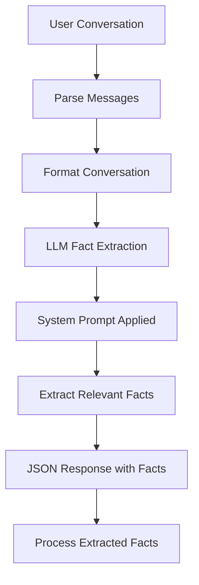
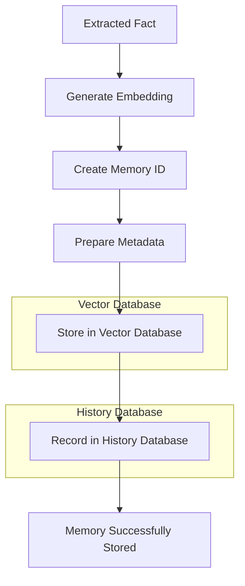
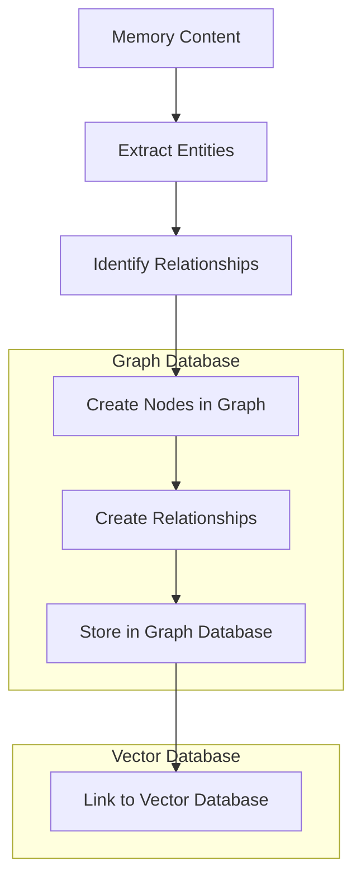
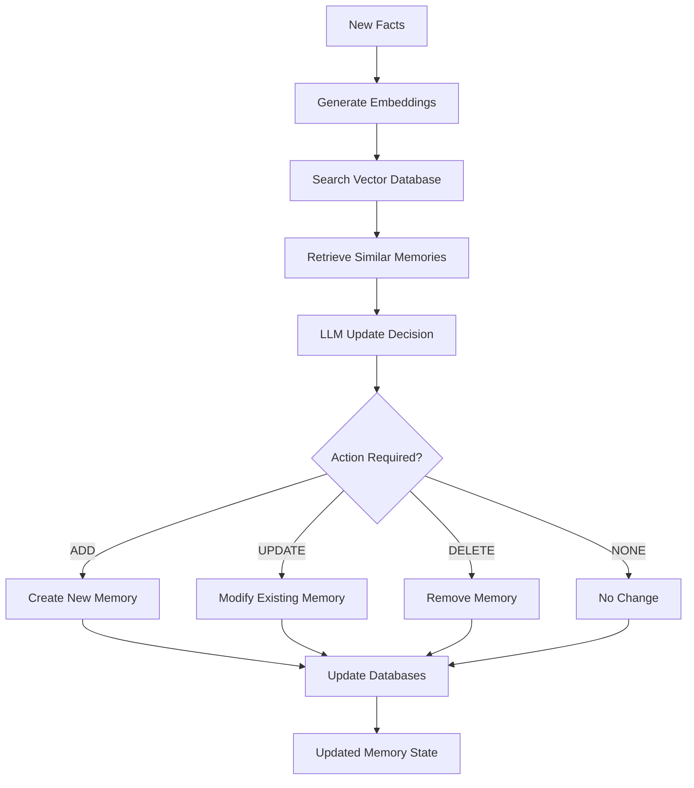
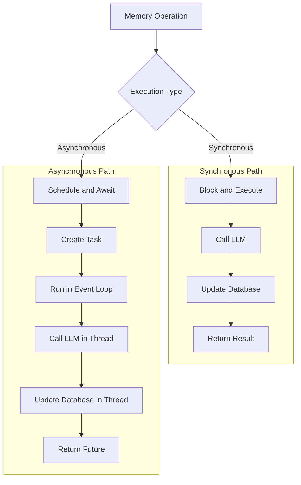
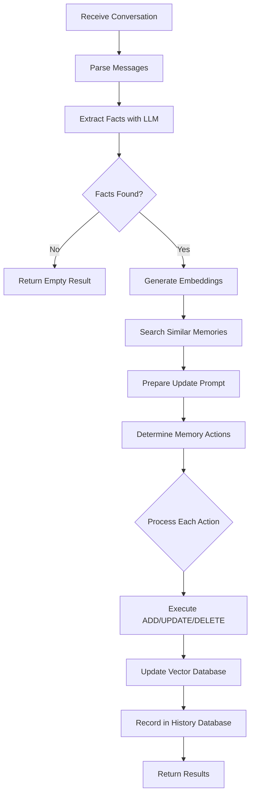
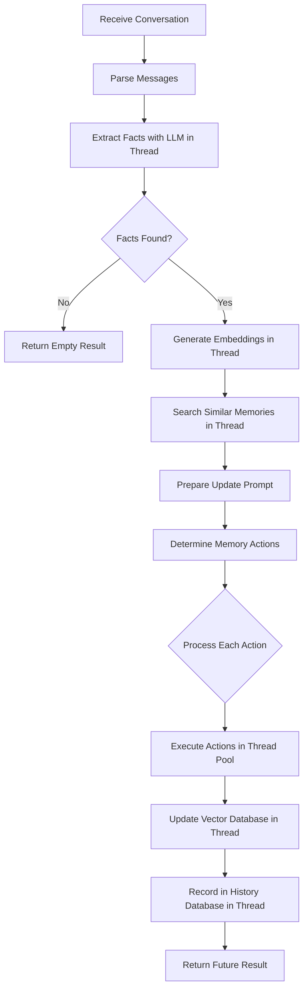

# Data Flow

<cite>
**Referenced Files in This Document**   
- [main.py](file://mem0/memory/main.py)
- [prompts.py](file://mem0/configs/prompts.py)
- [base.py](file://mem0/embeddings/base.py)
- [vector_stores/base.py](file://mem0/vector_stores/base.py)
- [storage.py](file://mem0/memory/storage.py)
- [utils.py](file://mem0/memory/utils.py)
- [kuzu_memory.py](file://mem0/memory/kuzu_memory.py)
</cite>

## Table of Contents
1. [Introduction](#introduction)
2. [Memory Lifecycle Overview](#memory-lifecycle-overview)
3. [Fact Extraction Process](#fact-extraction-process)
4. [Vectorization and Storage](#vectorization-and-storage)
5. [Graph Database Integration](#graph-database-integration)
6. [Memory Retrieval and Update](#memory-retrieval-and-update)
7. [Procedural Memory and Multi-Level Management](#procedural-memory-and-multi-level-management)
8. [Synchronous and Asynchronous Execution](#synchronous-and-asynchronous-execution)
9. [Data Transformation and Metadata Preservation](#data-transformation-and-metadata-preservation)
10. [Flowcharts of Execution Paths](#flowcharts-of-execution-paths)

## Introduction
The Mem0 system implements a sophisticated memory management architecture that processes user conversations to extract, store, and retrieve meaningful memories. This documentation details the complete data flow within the Mem0 system, tracing the lifecycle of a memory item from ingestion through fact extraction, vectorization, storage, retrieval, and update. The system leverages Large Language Models (LLMs) to extract key facts from conversations, generates embeddings using various embedding models, and stores these in vector databases for efficient similarity search. Additionally, graph databases maintain relationships between memories, enabling complex relationship queries. The system supports procedural memory and multi-level memory management across User, Session, and Agent contexts, providing a comprehensive memory solution for AI applications.

## Memory Lifecycle Overview
The Mem0 system follows a comprehensive lifecycle for memory items, beginning with ingestion of user conversations and ending with updated memory states. When a conversation is received, the system first parses the messages to extract relevant content. It then uses an LLM to identify and extract meaningful facts from the conversation based on predefined criteria such as personal preferences, important details, plans, and professional information. These extracted facts are converted into vector embeddings using a configured embedding model. The system searches the vector database for similar existing memories to determine whether the new facts should be added as new memories, update existing ones, or be deleted due to contradictions. After processing, the memory state is updated in both the vector database and an SQLite history database that maintains an audit trail of all memory changes. The system also supports storing procedural memories that capture the complete interaction history between a user and an AI agent.

**Section sources**
- [main.py](file://mem0/memory/main.py#L195-L227)
- [prompts.py](file://mem0/configs/prompts.py#L14-L59)

## Fact Extraction Process
The fact extraction process in Mem0 begins with parsing user conversations to create a structured representation of the dialogue. The system uses the `parse_messages` function to convert conversation messages into a formatted string that preserves the role and content of each message. This formatted conversation is then used as input to an LLM with a specialized system prompt designed to extract meaningful facts. The FACT_RETRIEVAL_PROMPT guides the LLM to identify specific types of information including personal preferences, important personal details, plans and intentions, activity preferences, health and wellness preferences, professional details, and miscellaneous information. The LLM responds with a JSON object containing an array of extracted facts. This process handles various edge cases, such as returning an empty facts array when no relevant information is found, and ensures that only user and assistant messages are considered while ignoring system messages. The extraction process is language-aware, detecting the input language and preserving facts in the same language.

**Diagram sources **
- [main.py](file://mem0/memory/main.py#L348-L365)
- [utils.py](file://mem0/memory/utils.py#L7-L20)
- [prompts.py](file://mem0/configs/prompts.py#L14-L59)

## Vectorization and Storage
The vectorization and storage component of Mem0 converts extracted facts into numerical representations and stores them in a vector database for efficient retrieval. For each extracted fact, the system generates embeddings using a configured embedding model through the `embed` method of the embedding provider. The embedding process takes into account the memory action (add, search, or update) to potentially use different embedding strategies for different operations. These embeddings are then stored in a vector database along with metadata that includes identifiers for user, agent, and session (run_id), creation timestamp, and other contextual information. The system supports multiple vector database providers through a factory pattern, including Chroma, Pinecone, Qdrant, Weaviate, and others. Each memory item is assigned a unique UUID and stored with its embedding vector and metadata payload. Additionally, the system maintains a local SQLite database that records the history of all memory operations, including additions, updates, and deletions, providing an audit trail for memory changes.

**Diagram sources **
- [main.py](file://mem0/memory/main.py#L376-L381)
- [base.py](file://mem0/embeddings/base.py#L21-L31)
- [base.py](file://mem0/vector_stores/base.py#L11-L13)
- [storage.py](file://mem0/memory/storage.py#L126-L167)

## Graph Database Integration
Mem0 integrates graph database functionality to maintain relationships between memories, enabling complex relationship queries and knowledge graph capabilities. When enabled, the system can store memories in a graph database alongside the vector database, creating nodes for entities and edges for relationships between them. The system supports multiple graph database providers including Kuzu, Memgraph, Neptune, and Neo4j, with a factory pattern for provider selection. When adding memories, the system can extract entities and relationships from the memory content and create corresponding nodes and edges in the graph database. For example, a memory stating "Alice knows Bob" would create nodes for Alice and Bob with a "knows" relationship between them. The graph database allows for traversing relationships, finding connected entities, and performing complex pattern matching queries that would be difficult with vector search alone. The system maintains consistency between the vector and graph databases, ensuring that memory operations are reflected in both storage systems when graph functionality is enabled.

**Diagram sources **
- [kuzu_memory.py](file://mem0/memory/kuzu_memory.py#L29-L46)
- [main.py](file://mem0/memory/main.py#L130-L158)
- [utils.py](file://mem0/memory/utils.py#L23-L32)

## Memory Retrieval and Update
The memory retrieval and update process in Mem0 involves searching for relevant memories, determining appropriate actions, and updating the memory state. When new facts are extracted from a conversation, the system searches the vector database for similar existing memories using the generated embeddings. For each new fact, the system retrieves the top similar memories (typically limited to 5 results) and presents both the existing memories and new facts to an LLM with a specialized update prompt. This prompt guides the LLM to decide whether each new fact should be added as a new memory, update an existing memory, delete a contradictory memory, or require no change. The decision logic considers factors such as whether the information is new, whether it contradicts existing information, or whether it provides additional detail that should be merged with existing memories. The system then executes the determined actions, updating the vector database and recording the changes in the history database. During retrieval, the system can search memories based on various filters including user_id, agent_id, and run_id, allowing for scoped memory access within specific contexts.

**Diagram sources **
- [main.py](file://mem0/memory/main.py#L375-L425)
- [prompts.py](file://mem0/configs/prompts.py#L61-L345)
- [storage.py](file://mem0/memory/storage.py#L126-L167)

## Procedural Memory and Multi-Level Management
Mem0 supports procedural memory and multi-level memory management across User, Session, and Agent contexts. Procedural memory captures the complete interaction history between a user and an AI agent, preserving every output produced by the agent verbatim. This is particularly useful for multi-step tasks where the agent needs to maintain context across multiple interactions. The system uses a specialized procedural memory prompt that instructs the LLM to create a comprehensive summary containing all necessary details for task continuation. The memory system supports three levels of scoping: User level (across all sessions for a user), Session level (within a specific conversation session identified by run_id), and Agent level (specific to a particular AI agent). These scopes are implemented through metadata fields (user_id, run_id, agent_id) that are attached to each memory item and used as filters during search operations. This multi-level approach allows for flexible memory management, where memories can be isolated to specific contexts or shared across contexts as needed. The system validates that at least one identifier (user_id, agent_id, or run_id) is provided for all memory operations to ensure proper scoping.

**Section sources**
- [main.py](file://mem0/memory/main.py#L879-L907)
- [prompts.py](file://mem0/configs/prompts.py#L211-L222)
- [main.py](file://mem0/memory/main.py#L46-L124)

## Synchronous and Asynchronous Execution
The Mem0 system supports both synchronous and asynchronous execution paths for memory operations, providing flexibility for different application requirements. The synchronous path blocks the calling thread until the memory operation is complete, returning the result directly. This is implemented through methods like `add` and `update` in the Memory class, which perform all steps sequentially. The asynchronous path uses Python's asyncio framework to perform operations in a non-blocking manner, allowing other tasks to proceed while memory operations are in progress. This is implemented through the AsyncMemory class, which provides async counterparts to all memory operations. The system uses `asyncio.to_thread` to run blocking operations (like LLM calls and database operations) in separate threads, preventing them from blocking the event loop. Both execution paths follow the same logical flow but differ in their implementation details. The system captures telemetry events for both sync and async operations, distinguishing between them in the event data. This dual execution model allows developers to choose the appropriate approach based on their application's architecture and performance requirements.

**Diagram sources **
- [main.py](file://mem0/memory/main.py#L348-L365)
- [main.py](file://mem0/memory/main.py#L1210-L1214)
- [main.py](file://mem0/memory/main.py#L1724-L1737)

## Data Transformation and Metadata Preservation
Throughout the memory lifecycle, Mem0 preserves metadata and transforms data appropriately at each stage. When a memory is created, the system generates comprehensive metadata including user_id, agent_id, run_id (session), creation timestamp, and a hash of the memory content. This metadata is stored alongside the memory in both the vector database and history database, enabling filtered searches and audit trails. During fact extraction, the system maintains the original language of the input and preserves it in the extracted facts. When updating memories, the system records both the old and new memory content in the history database, providing a complete change log. The system also handles special content types like images by first generating a textual description using a vision-capable LLM before processing it as a regular memory. All JSON responses from LLMs are carefully parsed, with code block markers removed and proper error handling implemented to manage invalid JSON. The metadata preservation system supports custom metadata provided by applications, allowing for extensible memory categorization and filtering beyond the built-in fields.

**Section sources**
- [main.py](file://mem0/memory/main.py#L1727-L1731)
- [utils.py](file://mem0/memory/utils.py#L35-L47)
- [storage.py](file://mem0/memory/storage.py#L143-L162)

## Flowcharts of Execution Paths
The following flowcharts illustrate the complete synchronous and asynchronous execution paths for memory operations in the Mem0 system.

### Synchronous Execution Path

**Diagram sources **
- [main.py](file://mem0/memory/main.py#L348-L425)

### Asynchronous Execution Path

**Diagram sources **
- [main.py](file://mem0/memory/main.py#L1210-L1263)