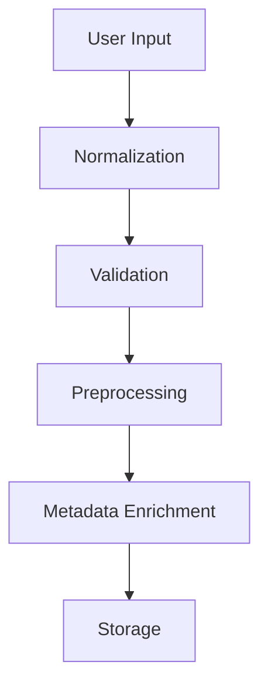
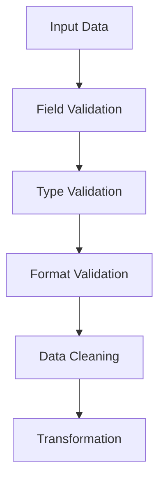
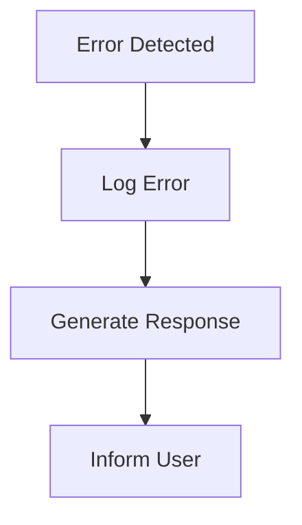

# Data Ingestion

<cite>
**Referenced Files in This Document**   
- [main.py](file://mem0/memory/main.py)
- [base.py](file://mem0/memory/base.py)
- [utils.py](file://mem0/memory/utils.py)
- [exceptions.py](file://mem0/exceptions.py)
- [base.py](file://mem0/configs/base.py)
- [setup.py](file://mem0/memory/setup.py)
- [main.py](file://mem0/client/main.py)
</cite>

## Table of Contents
1. [Introduction](#introduction)
2. [Ingestion Workflow](#ingestion-workflow)
3. [Input Sources and Normalization](#input-sources-and-normalization)
4. [Validation and Preprocessing](#validation-and-preprocessing)
5. [Metadata Enrichment](#metadata-enrichment)
6. [Error Handling](#error-handling)
7. [Memory Class Orchestration](#memory-class-orchestration)
8. [Configuration Parameters](#configuration-parameters)
9. [Common Ingestion Issues](#common-ingestion-issues)
10. [Troubleshooting and Best Practices](#troubleshooting-and-best-practices)

## Introduction
The Mem0 data ingestion workflow is designed to efficiently process user inputs from various sources, normalize them, and store them in a structured format for retrieval and analysis. This document provides a comprehensive overview of the ingestion process, including validation, preprocessing, metadata enrichment, and error handling mechanisms.

**Section sources**
- [main.py](file://mem0/memory/main.py#L1-L1911)
- [base.py](file://mem0/memory/base.py#L1-L64)

## Ingestion Workflow
The data ingestion workflow in Mem0 begins with receiving user inputs from various sources such as APIs, SDKs, and UIs. These inputs are then normalized and processed through a series of steps to ensure data integrity and consistency. The workflow involves validation, preprocessing, and metadata enrichment before the data is stored in the memory system.

**Diagram sources **
- [main.py](file://mem0/memory/main.py#L196-L308)
- [utils.py](file://mem0/memory/utils.py#L11-L20)

## Input Sources and Normalization
User inputs can be received from various sources including APIs, SDKs, and UIs. These inputs are normalized to ensure consistency in format and structure. The normalization process involves converting different input formats into a standardized format that can be easily processed by the system.

**Section sources**
- [main.py](file://mem0/memory/main.py#L207-L239)
- [utils.py](file://mem0/memory/utils.py#L11-L20)

## Validation and Preprocessing
The validation process ensures that the input data meets the required criteria and is free from errors. This includes checking for required fields, data types, and format compliance. Preprocessing involves cleaning and transforming the data to prepare it for storage and analysis.

**Diagram sources **
- [main.py](file://mem0/memory/main.py#L267-L272)
- [exceptions.py](file://mem0/exceptions.py#L138-L159)

## Metadata Enrichment
Metadata enrichment involves adding additional information to the input data to enhance its context and usability. This includes adding timestamps, user identifiers, and other relevant metadata that can be used for filtering and searching.

**Section sources**
- [main.py](file://mem0/memory/main.py#L245-L250)
- [setup.py](file://mem0/memory/setup.py#L21-L32)

## Error Handling
The system includes robust error handling mechanisms to manage malformed data and other ingestion issues. Errors are logged and appropriate responses are generated to inform the user of any issues encountered during the ingestion process.

**Diagram sources **
- [exceptions.py](file://mem0/exceptions.py#L34-L503)
- [main.py](file://mem0/memory/main.py#L363-L369)

## Memory Class Orchestration
The Memory class plays a central role in orchestrating the ingestion process. It manages the flow of data from input to storage, ensuring that all steps are executed in the correct order and that data integrity is maintained throughout the process.

**Section sources**
- [main.py](file://mem0/memory/main.py#L131-L168)
- [base.py](file://mem0/memory/base.py#L4-L64)

## Configuration Parameters
Configuration parameters allow users to customize the ingestion process according to their specific needs. These parameters include settings for validation rules, preprocessing steps, and metadata enrichment options.

**Section sources**
- [base.py](file://mem0/configs/base.py#L29-L62)
- [main.py](file://mem0/memory/main.py#L132-L149)

## Common Ingestion Issues
Common issues encountered during data ingestion include rate limiting, authentication failures, and payload size constraints. These issues are managed through various mechanisms such as retry logic, authentication checks, and payload size validation.

**Section sources**
- [exceptions.py](file://mem0/exceptions.py#L115-L136)
- [main.py](file://mem0/memory/main.py#L111-L117)

## Troubleshooting and Best Practices
To ensure reliable data intake, it is important to follow best practices such as validating input data, handling errors gracefully, and monitoring the ingestion process for any issues. Troubleshooting common issues involves checking configuration settings, verifying data formats, and ensuring proper authentication.

**Section sources**
- [main.py](file://mem0/memory/main.py#L168-L169)
- [exceptions.py](file://mem0/exceptions.py#L424-L439)