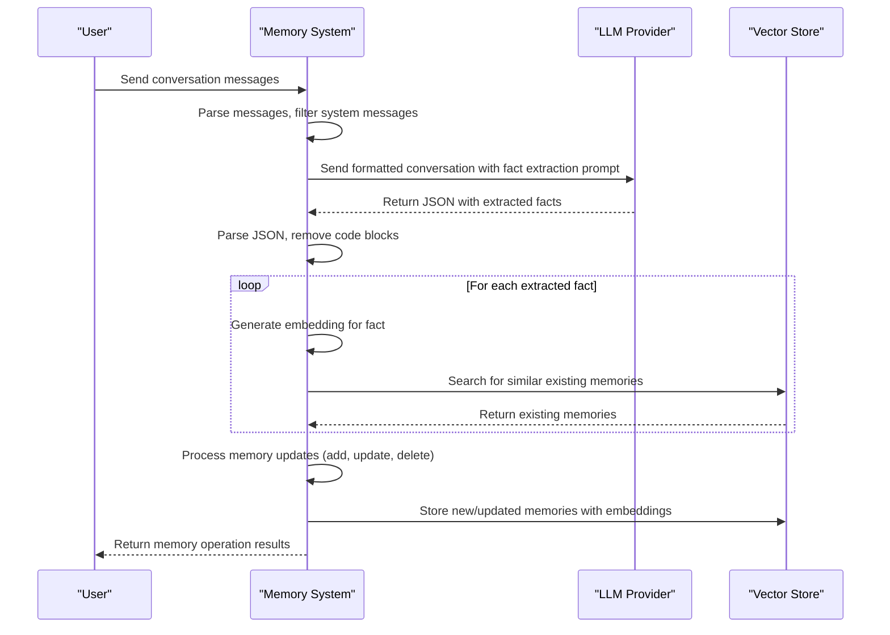
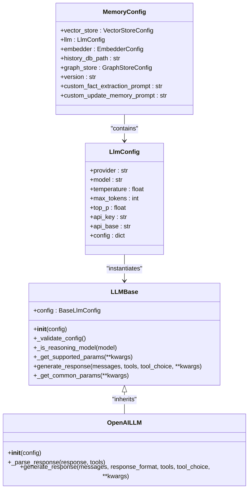
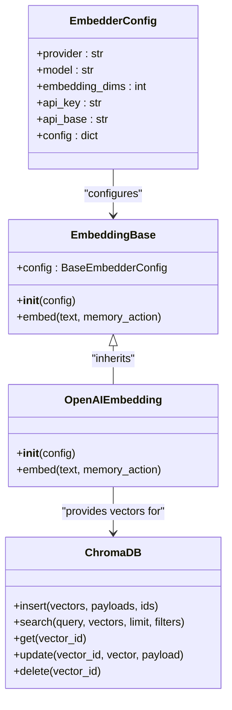

# Data Processing

<cite>
**Referenced Files in This Document**   
- [main.py](file://mem0/memory/main.py)
- [prompts.py](file://mem0/configs/prompts.py)
- [base.py](file://mem0/llms/base.py)
- [openai.py](file://mem0/llms/openai.py)
- [base.py](file://mem0/embeddings/base.py)
- [openai.py](file://mem0/embeddings/openai.py)
- [chroma.py](file://mem0/vector_stores/chroma.py)
- [utils.py](file://mem0/memory/utils.py)
</cite>

## Table of Contents
1. [Introduction](#introduction)
2. [Fact Extraction Pipeline](#fact-extraction-pipeline)
3. [Prompt Templating and LLM Configuration](#prompt-templating-and-llm-configuration)
4. [Embedding Generation](#embedding-generation)
5. [Procedural Memory Derivation](#procedural-memory-derivation)
6. [Performance Considerations](#performance-considerations)
7. [Error Handling and Robustness](#error-handling-and-robustness)
8. [Conclusion](#conclusion)

## Introduction
The data processing stage in Mem0's architecture is responsible for transforming raw conversational inputs into structured, persistent memories. This process involves several key components: fact extraction using Large Language Models (LLMs), embedding generation via configured embedder models, and the creation of both factual and procedural memories. The system is designed to be highly configurable, allowing users to customize prompts, select different LLM providers, and configure vector storage backends. This document details the complete data processing pipeline, from ingestion of conversations to the final storage of memories in vector databases.

**Section sources**
- [main.py](file://mem0/memory/main.py#L1-L200)

## Fact Extraction Pipeline
The fact extraction pipeline is the core mechanism by which Mem0 identifies and extracts meaningful information from conversations. The process begins with the parsing of input messages, where system messages are filtered out and user and assistant messages are formatted into a coherent input for the LLM. The pipeline then invokes a configured LLM with a specialized prompt designed to extract facts about user preferences, personal details, plans, and other relevant information.

The LLM processes the conversation and returns a JSON response containing extracted facts. These facts are then validated and parsed, with any code blocks removed from the response. For each extracted fact, the system generates an embedding using the configured embedder model. These embeddings are used to search for similar existing memories in the vector store, enabling the system to identify potential updates or contradictions to existing knowledge.

The pipeline handles both synchronous and asynchronous processing, with the asynchronous version using `asyncio.to_thread` to offload blocking operations like LLM calls and vector searches. This ensures that the system can handle multiple memory operations efficiently without blocking the main execution thread.

**Diagram sources **
- [main.py](file://mem0/memory/main.py#L347-L384)
- [utils.py](file://mem0/memory/utils.py#L7-L20)

**Section sources**
- [main.py](file://mem0/memory/main.py#L316-L425)
- [utils.py](file://mem0/memory/utils.py#L7-L20)

## Prompt Templating and LLM Configuration
Mem0 provides a flexible system for prompt templating and LLM configuration, allowing users to customize the behavior of the memory system. The fact extraction process is driven by a system prompt defined in `FACT_RETRIEVAL_PROMPT`, which instructs the LLM to extract specific types of information from conversations, including personal preferences, important details, plans, and professional information.

Users can override the default prompt by providing a `custom_fact_extraction_prompt` in the memory configuration. This allows for domain-specific customization of the fact extraction process. For example, a healthcare application might use a custom prompt that emphasizes medical history and treatment preferences, while a financial application might focus on investment goals and risk tolerance.

The LLM configuration is managed through the `MemoryConfig` class, which specifies the LLM provider, model, and various generation parameters such as temperature, max tokens, and top_p. The system supports multiple LLM providers through a factory pattern, with specific implementations for OpenAI, Azure OpenAI, Anthropic, and others. Each LLM provider implementation inherits from the `LLMBase` class, which provides common functionality and parameter validation.

When making LLM calls, the system uses the `_get_supported_params` method to filter parameters based on the specific model being used. This is particularly important for reasoning models like OpenAI's o1 series, which do not support certain parameters like temperature. The system automatically handles these differences, ensuring compatibility across different model types.

**Diagram sources **
- [main.py](file://mem0/memory/main.py#L29-L62)
- [base.py](file://mem0/llms/base.py#L7-L132)
- [openai.py](file://mem0/llms/openai.py#L14-L148)

**Section sources**
- [prompts.py](file://mem0/configs/prompts.py#L14-L58)
- [main.py](file://mem0/memory/main.py#L135-L146)
- [base.py](file://mem0/llms/base.py#L7-L132)

## Embedding Generation
Embedding generation is a critical component of Mem0's data processing pipeline, enabling semantic search and similarity detection across memories. The system uses a configurable embedder model to convert text facts into high-dimensional vector representations. The embedding process is managed by the `EmbeddingBase` class, which serves as an abstract base class for all embedder implementations.

The system supports multiple embedding providers, including OpenAI, Azure OpenAI, Hugging Face, and others, through a factory pattern implemented in `EmbedderFactory`. Each embedder implementation must provide an `embed` method that takes a text string and returns a vector embedding. The OpenAI embedder, for example, uses the `text-embedding-3-small` model by default, with a dimensionality of 1536.

When generating embeddings, the system first normalizes the input text by replacing newlines with spaces to ensure compatibility with the embedding model. The embedding is then generated by calling the appropriate API endpoint with the processed text. These embeddings are used for multiple purposes: storing new memories, searching for similar existing memories, and enabling semantic retrieval of information.

The embedding configuration is integrated with the vector store configuration, ensuring that the dimensionality of the embeddings matches the requirements of the vector database. This integration is particularly important when using different vector store backends like Chroma, Pinecone, or Weaviate, each of which may have specific requirements for embedding dimensions.

**Diagram sources **
- [base.py](file://mem0/embeddings/base.py#L7-L32)
- [openai.py](file://mem0/embeddings/openai.py#L11-L50)
- [chroma.py](file://mem0/vector_stores/chroma.py#L23-L200)

**Section sources**
- [base.py](file://mem0/embeddings/base.py#L7-L32)
- [openai.py](file://mem0/embeddings/openai.py#L11-L50)

## Procedural Memory Derivation
Procedural memory in Mem0 represents higher-level summaries of user interactions and workflows, capturing the sequence of actions and decisions made during a conversation. Unlike factual memories, which store discrete pieces of information, procedural memories capture the process or procedure that emerged from the interaction.

The creation of procedural memory is handled by the `_create_procedural_memory` method, which takes a series of messages and generates a comprehensive summary of the interaction. This process uses a specialized system prompt defined in `PROCEDURAL_MEMORY_SYSTEM_PROMPT`, which instructs the LLM to create a detailed summary that includes every output produced by the agent, ensuring that no information is lost.

The procedural memory generation process follows a structured format that includes an overview of the task objective and progress status, followed by a chronological sequence of numbered steps. Each step includes the agent action, the exact result of that action, and embedded metadata such as key findings, navigation history, errors encountered, and the current context after the action.

This detailed structure ensures that the procedural memory contains all necessary information for the agent to continue a task without ambiguity. The generated procedural memory is then stored as a regular memory with a special metadata flag indicating its procedural type. This allows the system to distinguish between factual and procedural memories during retrieval and use.

**Section sources**
- [main.py](file://mem0/memory/main.py#L870-L907)
- [prompts.py](file://mem0/configs/prompts.py#L211-L288)

## Performance Considerations
The data processing pipeline in Mem0 is designed with several performance considerations to ensure efficient operation and scalability. One of the primary concerns is token usage optimization, as LLM API costs are directly tied to the number of tokens processed. The system addresses this by carefully managing the size of inputs sent to the LLM, using appropriate model selection (e.g., `gpt-4o-mini` as the default), and implementing efficient prompt engineering to minimize unnecessary token consumption.

Processing latency is another critical performance factor, particularly in interactive applications where users expect timely responses. The system mitigates latency through asynchronous processing, allowing multiple operations to proceed concurrently without blocking the main execution thread. The use of `asyncio.to_thread` for blocking operations like LLM calls and vector searches ensures that the system can handle multiple memory operations efficiently.

Memory management is also a key consideration, with the system implementing garbage collection hints and resource cleanup to prevent memory leaks during prolonged operation. The vector store operations are optimized for performance, with batch operations used where possible to reduce the number of API calls and network round trips.

The system also provides configuration options for performance tuning, such as the ability to adjust the number of similar memories retrieved during searches (controlled by the `limit` parameter) and the option to use different embedding models with varying speed/accuracy trade-offs. These configuration options allow users to balance performance requirements with accuracy and cost considerations based on their specific use case.

**Section sources**
- [main.py](file://mem0/memory/main.py#L316-L425)
- [base.py](file://mem0/llms/base.py#L115-L132)

## Error Handling and Robustness
Robust error handling is essential for maintaining the reliability of Mem0's data processing pipeline, particularly when dealing with external LLM APIs that may experience failures or return unexpected responses. The system implements comprehensive error handling at multiple levels to ensure graceful degradation and prevent cascading failures.

When processing LLM responses, the system includes try-catch blocks to handle JSON parsing errors that may occur if the LLM returns malformed JSON. In such cases, the system logs the error and continues processing with an empty list of facts, preventing a single malformed response from disrupting the entire memory update process.

The system also handles LLM API failures gracefully, with appropriate error logging and fallback mechanisms. For example, if an LLM call fails, the system logs the error but does not propagate it up the call stack, allowing the memory operation to continue with the information that was successfully extracted.

To address the issue of hallucinations during memory inference, the system implements several safeguards. The fact extraction prompt is carefully designed to minimize hallucinations by instructing the LLM to only extract information explicitly mentioned in the conversation. Additionally, the system validates extracted facts against existing memories, helping to identify and filter out potentially hallucinated information.

The system also includes input validation to prevent common errors, such as requiring at least one of `user_id`, `agent_id`, or `run_id` to be provided for memory operations. This validation is implemented in the `_build_filters_and_metadata` function, which raises a `Mem0ValidationError` with detailed information if validation fails.

**Section sources**
- [main.py](file://mem0/memory/main.py#L363-L368)
- [main.py](file://mem0/memory/main.py#L409-L411)
- [main.py](file://mem0/memory/main.py#L418-L422)

## Conclusion
The data processing stage in Mem0's architecture represents a sophisticated pipeline for transforming conversational inputs into structured, persistent memories. By leveraging configurable LLMs, customizable prompts, and efficient embedding generation, the system is able to extract meaningful information from conversations and store it in a way that enables semantic retrieval and contextual understanding.

The modular design of the system, with its clear separation of concerns between fact extraction, embedding generation, and memory storage, allows for extensive customization and extension. Users can tailor the system to their specific needs by configuring different LLM providers, customizing prompts for domain-specific knowledge extraction, and selecting appropriate vector storage backends.

The implementation demonstrates careful attention to performance, reliability, and usability, with features like asynchronous processing, comprehensive error handling, and detailed configuration options. These design choices ensure that Mem0 can be effectively deployed in a wide range of applications, from simple personal assistants to complex enterprise systems requiring robust memory management capabilities.