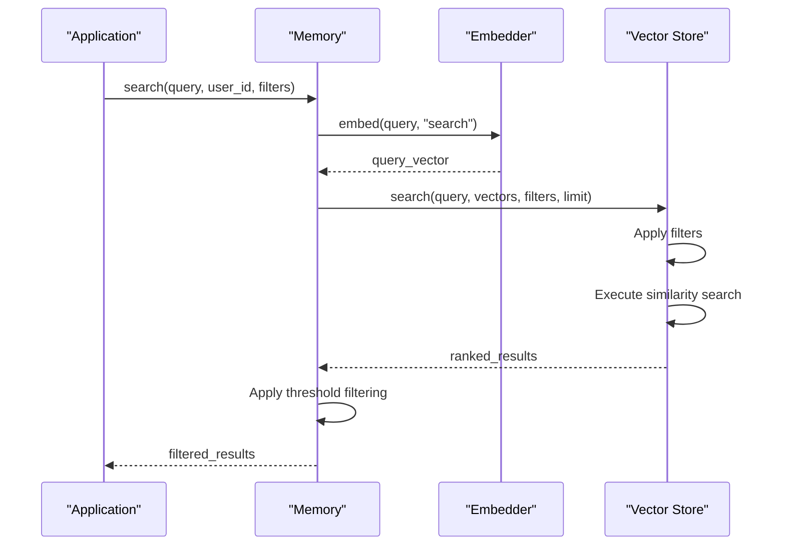
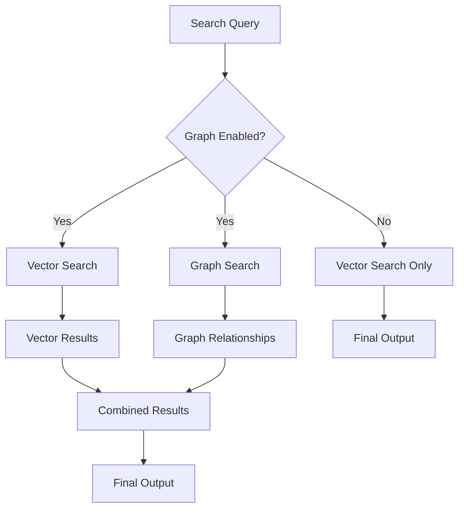

# Data Retrieval

<cite>
**Referenced Files in This Document**   
- [main.py](file://mem0/memory/main.py)
- [base.py](file://mem0/vector_stores/base.py)
- [graph_memory.py](file://mem0/memory/graph_memory.py)
- [memgraph_memory.py](file://mem0/memory/memgraph_memory.py)
- [cache_config.py](file://embedchain/embedchain/config/cache_config.py)
- [configs.py](file://mem0/vector_stores/configs.py)
- [chroma.py](file://mem0/vector_stores/chroma.py)
- [pinecone.py](file://mem0/vector_stores/pinecone.py)
- [redis.py](file://mem0/vector_stores/redis.py)
- [valkey.py](file://mem0/vector_stores/valkey.py)
- [milvus.py](file://mem0/vector_stores/milvus.py)
- [supabase.ts](file://mem0-ts/src/oss/src/vector_stores/supabase.ts)
- [redis.ts](file://mem0-ts/src/oss/src/vector_stores/redis.ts)
- [base.ts](file://mem0-ts/src/oss/src/embeddings/base.ts)
</cite>

## Table of Contents
1. [Introduction](#introduction)
2. [Semantic Vector Search](#semantic-vector-search)
3. [Hybrid Retrieval with Graph Traversal](#hybrid-retrieval-with-graph-traversal)
4. [Filtering and Relevance Scoring](#filtering-and-relevance-scoring)
5. [Retrieval Parameters](#retrieval-parameters)
6. [Performance Considerations](#performance-considerations)
7. [Troubleshooting Guide](#troubleshooting-guide)

## Introduction
The Mem0 data retrieval system implements a sophisticated hybrid approach that combines semantic vector search with graph-based context traversal to deliver highly relevant memory results. This system enables intelligent retrieval of information by leveraging both semantic similarity and contextual relationships between memories. The retrieval process begins with a search query that triggers semantic matching against vector databases using configurable similarity thresholds, then enhances results through graph traversal to identify contextually related memories. This documentation details the complete retrieval architecture, including filtering mechanisms, relevance scoring, performance optimization, and troubleshooting guidance.

## Semantic Vector Search

The core of Mem0's retrieval system is its semantic vector search capability, which uses embedding models to convert text queries into high-dimensional vectors for similarity matching against stored memory vectors. The search process begins when a query is passed to the `search` method in the Memory class, which orchestrates the retrieval workflow.



**Diagram sources**
- [main.py](file://mem0/memory/main.py#L644-L718)
- [base.py](file://mem0/vector_stores/base.py#L16-L18)

The vector search process follows these steps:
1. The input query is converted to a vector representation using the configured embedding model
2. The system queries the vector database for similar vectors based on cosine similarity
3. Results are filtered by user, agent, or run identifiers to ensure proper scoping
4. Retrieved memories are scored by similarity and ranked accordingly
5. Results are filtered by the configured similarity threshold before returning

The vector search implementation is abstracted through the `VectorStoreBase` interface, allowing support for multiple vector database providers including Chroma, Pinecone, Qdrant, and others. Each provider implements the `search` method according to its specific API while maintaining a consistent interface.

**Section sources**
- [main.py](file://mem0/memory/main.py#L644-L718)
- [base.py](file://mem0/vector_stores/base.py#L16-L18)

## Hybrid Retrieval with Graph Traversal

Mem0 enhances its retrieval capabilities through a hybrid approach that combines vector search with graph traversal to identify contextually related memories. When the graph store is enabled, the system performs parallel searches in both the vector database and the graph database, then combines the results to provide a comprehensive view of relevant memories and their relationships.



**Diagram sources**
- [main.py](file://mem0/memory/main.py#L692-L706)
- [graph_memory.py](file://mem0/memory/graph_memory.py#L95-L129)

The graph-based retrieval process works as follows:

1. **Entity Extraction**: The system uses an LLM to extract entities and their types from the search query
2. **Vector Similarity Search**: The graph database performs vector similarity searches on nodes to find semantically similar entities
3. **Relationship Traversal**: For each matching node, the system traverses incoming and outgoing relationships to identify connected entities
4. **Result Reranking**: Retrieved relationships are reranked using BM25 algorithm based on relevance to the original query
5. **Context Enrichment**: The final results include both the directly retrieved memories and their contextual relationships

The graph search implementation in `MemoryGraph.search` method demonstrates this process:

```python
def search(self, query, filters, limit=100):
    entity_type_map = self._retrieve_nodes_from_data(query, filters)
    search_output = self._search_graph_db(node_list=list(entity_type_map.keys()), filters=filters)
    
    if not search_output:
        return []
        
    search_outputs_sequence = [[item["source"], item["relationship"], item["destination"]] for item in search_output]
    bm25 = BM25Okapi(search_outputs_sequence)
    
    tokenized_query = query.split(" ")
    reranked_results = bm25.get_top_n(tokenized_query, search_outputs_sequence, n=5)
    
    search_results = []
    for item in reranked_results:
        search_results.append({"source": item[0], "relationship": item[1], "destination": item[2]})
        
    return search_results
```

This hybrid approach allows Mem0 to return not only memories that are semantically similar to the query but also related memories that provide additional context, creating a richer and more comprehensive retrieval experience.

**Section sources**
- [main.py](file://mem0/memory/main.py#L692-L706)
- [graph_memory.py](file://mem0/memory/graph_memory.py#L95-L129)
- [memgraph_memory.py](file://mem0/memory/memgraph_memory.py#L562-L629)

## Filtering and Relevance Scoring

Mem0 implements a comprehensive filtering and relevance scoring system to ensure precise and meaningful retrieval results. The system applies multiple layers of filtering and scoring to deliver the most relevant memories for a given query.

### Filtering Mechanisms

The retrieval system supports several filtering dimensions:

1. **Scope Filters**: Memories are automatically scoped to specific users, agents, or runs through metadata fields (`user_id`, `agent_id`, `run_id`)
2. **Custom Filters**: Additional key-value filters can be applied to search queries for more granular control
3. **Actor Filters**: Results can be filtered by actor identity when messages contain explicit actor references
4. **Threshold Filtering**: Results are filtered by similarity score against a configurable threshold

The filtering system is implemented in the `_build_filters_and_metadata` helper function, which constructs both the storage metadata template and query filters based on the provided identifiers:

```python
def _build_filters_and_metadata(
    *,  # Enforce keyword-only arguments
    user_id: Optional[str] = None,
    agent_id: Optional[str] = None,
    run_id: Optional[str] = None,
    actor_id: Optional[str] = None,
    input_metadata: Optional[Dict[str, Any]] = None,
    input_filters: Optional[Dict[str, Any]] = None,
) -> tuple[Dict[str, Any], Dict[str, Any]]:
    """
    Constructs metadata for storage and filters for querying based on session and actor identifiers.
    """
    base_metadata_template = deepcopy(input_metadata) if input_metadata else {}
    effective_query_filters = deepcopy(input_filters) if input_filters else {}

    # Add all provided session ids
    if user_id:
        base_metadata_template["user_id"] = user_id
        effective_query_filters["user_id"] = user_id

    if agent_id:
        base_metadata_template["agent_id"] = agent_id
        effective_query_filters["agent_id"] = agent_id

    if run_id:
        base_metadata_template["run_id"] = run_id
        effective_query_filters["run_id"] = run_id

    # Optional actor filter
    resolved_actor_id = actor_id or effective_query_filters.get("actor_id")
    if resolved_actor_id:
        effective_query_filters["actor_id"] = resolved_actor_id

    return base_metadata_template, effective_query_filters
```

### Relevance Scoring and Ranking

Mem0 employs a multi-stage relevance scoring and ranking process:

1. **Vector Similarity Scoring**: The primary relevance score is based on cosine similarity between the query vector and stored memory vectors
2. **BM25 Reranking**: For graph-based results, BM25 algorithm is used to rerank relationships based on term frequency and inverse document frequency
3. **Threshold Filtering**: Results with similarity scores below the configured threshold are excluded from the final results
4. **Final Ranking**: Results are returned in descending order of relevance score

The relevance scoring is implemented in the `_search_vector_store` method:

```python
def _search_vector_store(self, query, filters, limit, threshold: Optional[float] = None):
    embeddings = self.embedding_model.embed(query, "search")
    memories = self.vector_store.search(query=query, vectors=embeddings, limit=limit, filters=filters)

    original_memories = []
    for mem in memories:
        memory_item_dict = MemoryItem(
            id=mem.id,
            memory=mem.payload.get("data", ""),
            score=mem.score,
        ).model_dump()

        # Apply threshold filtering
        if threshold is None or mem.score >= threshold:
            original_memories.append(memory_item_dict)

    return original_memories
```

The system returns results with scores normalized to the range [0,1], where higher scores indicate greater similarity to the query. This scoring system enables applications to implement custom ranking logic or display confidence indicators to users.

**Section sources**
- [main.py](file://mem0/memory/main.py#L46-L124)
- [main.py](file://mem0/memory/main.py#L720-L756)

## Retrieval Parameters

Mem0 provides several configurable parameters that control the behavior and output of the retrieval process. These parameters allow fine-tuning of search results to meet specific application requirements.

### Key Retrieval Parameters

| Parameter | Type | Default | Description |
|---------|------|---------|-------------|
| `query` | string | Required | The search query text |
| `user_id` | string | None | Filter results by user identifier |
| `agent_id` | string | None | Filter results by agent identifier |
| `run_id` | string | None | Filter results by run identifier |
| `limit` | integer | 100 | Maximum number of results to return |
| `filters` | dictionary | None | Additional custom key-value filters |
| `threshold` | float | None | Minimum similarity score for inclusion (0-1) |

### Examples of Parameter Usage

**Basic search with user scoping:**
```python
results = memory.search("What did I discuss about project timelines?", user_id="user_123")
```

**Search with custom filters and threshold:**
```python
results = memory.search(
    "customer feedback",
    user_id="user_123",
    filters={"actor_id": "support_agent"},
    limit=10,
    threshold=0.7
)
```

**Graph-enhanced search:**
```python
results = memory.search(
    "relationships between team members",
    user_id="user_123",
    enable_graph=True
)
```

The `threshold` parameter is particularly important for controlling result quality. A higher threshold (e.g., 0.8-0.9) returns only very similar memories, reducing noise but potentially missing relevant results. A lower threshold (e.g., 0.5-0.6) returns more results including those with partial relevance, increasing recall but potentially including less relevant memories.

The `limit` parameter controls the maximum number of results returned, helping to manage response size and performance. For applications requiring pagination, this parameter can be used in conjunction with offset-based retrieval patterns.

**Section sources**
- [main.py](file://mem0/memory/main.py#L644-L664)

## Performance Considerations

Mem0's retrieval system incorporates several performance optimizations to ensure fast and efficient query processing, even with large memory datasets.

### Query Latency Optimization

The system employs parallel execution to minimize query latency:

```python
with concurrent.futures.ThreadPoolExecutor() as executor:
    future_memories = executor.submit(self._search_vector_store, query, effective_filters, limit, threshold)
    future_graph_entities = (
        executor.submit(self.graph.search, query, effective_filters, limit) if self.enable_graph else None
    )
    
    concurrent.futures.wait(
        [future_memories, future_graph_entities] if future_graph_entities else [future_memories]
    )
    
    original_memories = future_memories.result()
    graph_entities = future_graph_entities.result() if future_graph_entities else None
```

This parallel execution ensures that vector search and graph traversal (when enabled) occur simultaneously, reducing overall response time.

### Index Optimization

Different vector database providers implement various indexing strategies for optimal search performance:

**ChromaDB** uses HNSW (Hierarchical Navigable Small World) indexing for approximate nearest neighbor search:
```python
def search(self, query: str, vectors: List[list], limit: int = 5, filters: Optional[Dict] = None) -> List[OutputData]:
    where_clause = self._generate_where_clause(filters) if filters else None
    results = self.collection.query(query_embeddings=vectors, where=where_clause, n_results=limit)
    final_results = self._parse_output(results)
    return final_results
```

**Pinecone** supports both dense and sparse vector indexing for hybrid search:
```python
def insert(self, vectors: List[List[float]], payloads: Optional[List[Dict]] = None, ids: Optional[List[Union[str, int]]] = None):
    if self.hybrid_search and self.sparse_encoder and "text" in payload:
        sparse_vector = self.sparse_encoder.encode_documents(payload["text"])
        vector_record["sparse_values"] = sparse_vector
```

### Caching Strategies

Mem0 incorporates caching at multiple levels to improve performance:

1. **Vector Cache**: Frequently accessed vectors can be cached in memory
2. **Query Result Cache**: Recent query results are cached based on similarity
3. **Embedding Cache**: Generated embeddings are cached to avoid redundant computation

The caching behavior is configurable through cache settings:

```python
class CacheInitConfig(BaseConfig):
    """
    This is a cache init config. Used to initialize a cache.
    
    :param similarity_threshold: a threshold ranged from 0 to 1 to filter search results with similarity score higher \
     than the threshold. When it is 0, there is no hits. When it is 1, all search results will be returned as hits.
    :type similarity_threshold: float
    :param auto_flush: it will be automatically flushed every time xx pieces of data are added, default to 20
    :type auto_flush: int
    """
    
    def __init__(
        self,
        similarity_threshold: Optional[float] = 0.8,
        auto_flush: Optional[int] = 20,
    ):
        if similarity_threshold < 0 or similarity_threshold > 1:
            raise ValueError(f"similarity_threshold {similarity_threshold} should be between 0 and 1")
            
        self.similarity_threshold = similarity_threshold
        self.auto_flush = auto_flush
```

The `similarity_threshold` parameter controls how similar a cached result must be to a new query to be considered a hit, balancing cache effectiveness with result freshness.

### Vector Store Performance Characteristics

Different vector store implementations have varying performance characteristics:

| Vector Store | Index Type | Search Latency | Scalability | Notes |
|-------------|------------|--------------|-------------|-------|
| Chroma | HNSW | Low | Medium | Good for small to medium datasets |
| Pinecone | HNSW | Low | High | Cloud-optimized, handles large datasets |
| Qdrant | HNSW | Low | High | Memory-efficient, good for high-dimensional vectors |
| Redis/Valkey | FLAT/HNSW | Very Low | Medium | In-memory performance, ideal for low-latency requirements |
| Milvus | HNSW/IVF | Low | Very High | Enterprise-grade, handles massive datasets |

For optimal performance, select a vector store that matches your data size, query patterns, and latency requirements. Redis/Valkey provides the fastest response times for smaller datasets, while Pinecone and Milvus are better suited for very large-scale deployments.

**Section sources**
- [main.py](file://mem0/memory/main.py#L692-L701)
- [cache_config.py](file://embedchain/embedchain/config/cache_config.py#L44-L76)
- [chroma.py](file://mem0/vector_stores/chroma.py#L143-L161)
- [pinecone.py](file://mem0/vector_stores/pinecone.py#L138-L158)
- [redis.py](file://mem0/vector_stores/redis.py#L145-L157)
- [valkey.py](file://mem0/vector_stores/valkey.py#L413-L431)
- [milvus.py](file://mem0/vector_stores/milvus.py#L139-L143)

## Troubleshooting Guide

This section addresses common issues encountered during data retrieval in Mem0 and provides guidance for diagnosis and resolution.

### Low Recall Issues

**Symptoms**: Fewer results than expected, potentially missing relevant memories.

**Possible Causes and Solutions**:
1. **High similarity threshold**: The threshold may be set too high, filtering out relevant but less similar memories.
   - **Solution**: Lower the `threshold` parameter (e.g., from 0.8 to 0.6) to increase recall.
   
2. **Overly restrictive filters**: Scope filters may be too narrow.
   - **Solution**: Review and adjust `user_id`, `agent_id`, and `run_id` filters, or remove unnecessary custom filters.

3. **Insufficient data**: The memory database may not contain enough relevant information.
   - **Solution**: Ensure memories have been properly added to the system before searching.

4. **Embedding model mismatch**: The embedding model may not be capturing semantic meaning effectively.
   - **Solution**: Try a different embedding provider (e.g., switch from `openai` to `huggingface`).

### Irrelevant Results

**Symptoms**: Results include memories that are not relevant to the query.

**Possible Causes and Solutions**:
1. **Low similarity threshold**: The threshold may be too low, allowing dissimilar memories to be included.
   - **Solution**: Increase the `threshold` parameter (e.g., from 0.5 to 0.7) to improve precision.

2. **Poor query formulation**: The search query may be too broad or ambiguous.
   - **Solution**: Use more specific and detailed queries that clearly express the desired information.

3. **Inadequate memory organization**: Memories may not be properly scoped or categorized.
   - **Solution**: Ensure consistent use of `user_id`, `agent_id`, and other scoping identifiers when adding memories.

4. **Suboptimal embedding model**: The current embedding model may not be capturing semantic distinctions well.
   - **Solution**: Experiment with different embedding providers that may better capture the nuances of your data.

### Timeout Errors

**Symptoms**: Search operations fail with timeout errors or take excessively long to complete.

**Possible Causes and Solutions**:
1. **Large result sets**: The `limit` parameter may be set too high, causing the database to process excessive data.
   - **Solution**: Reduce the `limit` parameter to a more reasonable value (e.g., from 100 to 20).

2. **Network connectivity issues**: There may be connectivity problems with the vector database.
   - **Solution**: Check network connectivity and database availability. Implement retry logic with exponential backoff.

3. **Database performance issues**: The vector database may be under heavy load or improperly configured.
   - **Solution**: Monitor database performance metrics and consider scaling the database instance.

4. **Complex queries with graph traversal**: Graph-enhanced searches can be more resource-intensive.
   - **Solution**: Disable graph search (`enable_graph=False`) for time-sensitive operations, or implement query timeouts.

### Configuration and Implementation Best Practices

1. **Set appropriate thresholds**: Balance recall and precision by tuning the similarity threshold based on your use case:
   - High precision use cases (e.g., medical information): threshold = 0.8-0.9
   - High recall use cases (e.g., research exploration): threshold = 0.5-0.6

2. **Use proper scoping**: Always specify appropriate `user_id`, `agent_id`, or `run_id` to limit search scope and improve performance.

3. **Monitor performance**: Implement logging and monitoring to track query latency and success rates.

4. **Implement caching**: Leverage the built-in caching mechanisms to improve response times for frequent queries.

5. **Choose the right vector store**: Select a vector database provider that matches your performance requirements and deployment environment.

6. **Handle errors gracefully**: Implement proper error handling and retry mechanisms for robust operation.

**Section sources**
- [main.py](file://mem0/memory/main.py#L644-L718)
- [cache_config.py](file://embedchain/embedchain/config/cache_config.py#L44-L76)
- [exceptions.py](file://mem0/exceptions.py#L263-L303)