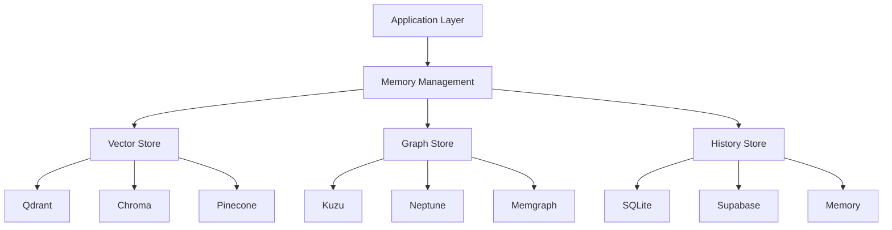
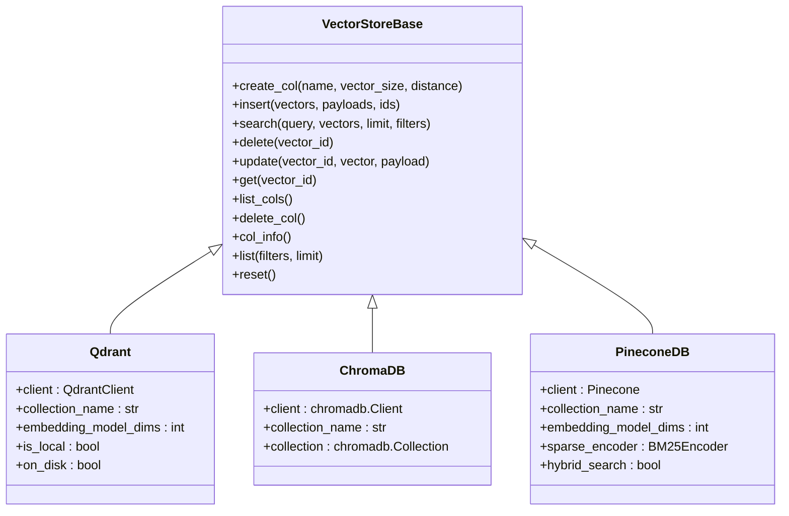
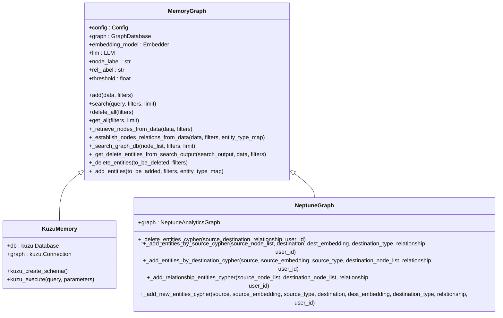
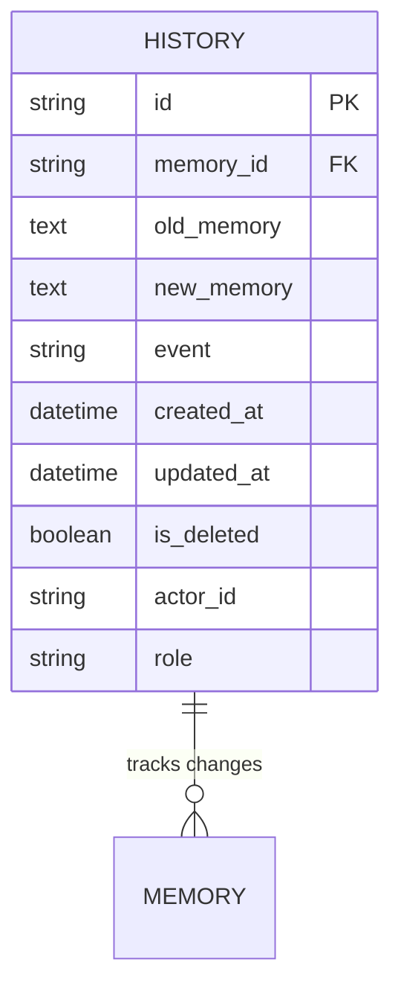
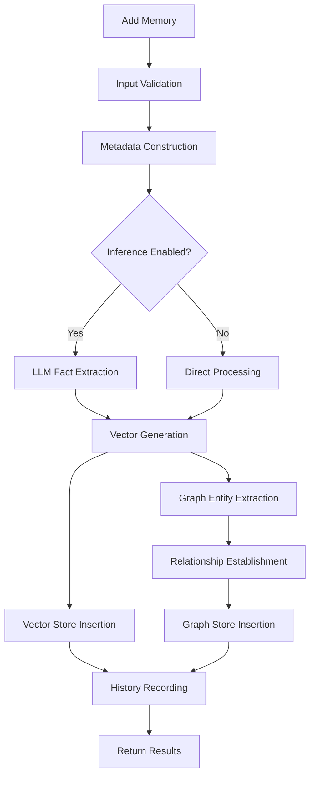
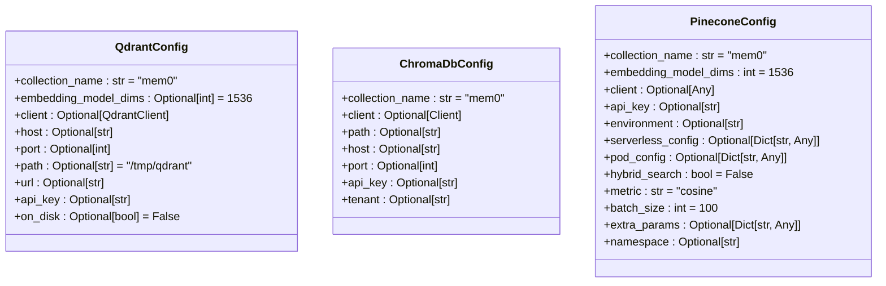
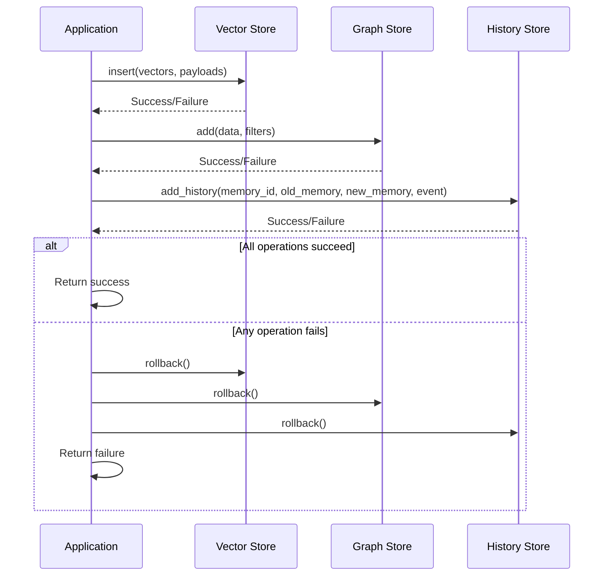
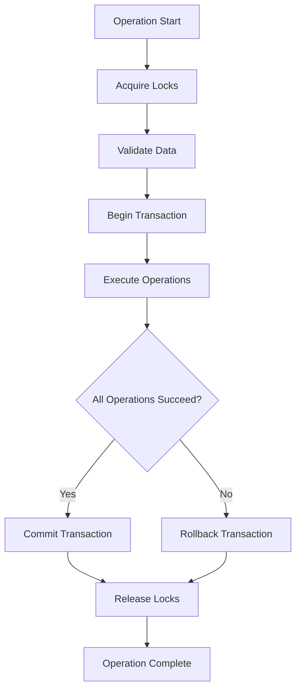
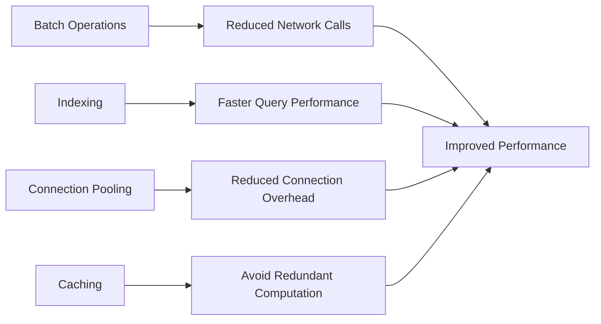
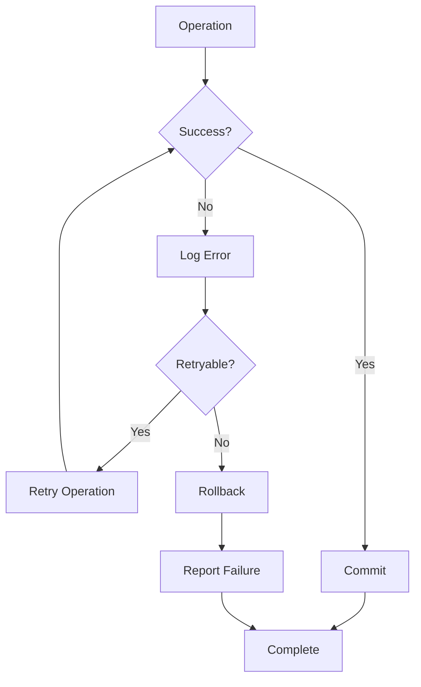

# Data Storage

<cite>
**Referenced Files in This Document**   
- [storage.py](file://mem0/memory/storage.py)
- [base.py](file://mem0/vector_stores/base.py)
- [main.py](file://mem0/memory/main.py)
- [graph_memory.py](file://mem0/memory/graph_memory.py)
- [kuzu_memory.py](file://mem0/memory/kuzu_memory.py)
- [neptunegraph.py](file://mem0/graphs/neptune/neptunegraph.py)
- [qdrant.py](file://mem0/vector_stores/qdrant.py)
- [chroma.py](file://mem0/vector_stores/chroma.py)
- [pinecone.py](file://mem0/vector_stores/pinecone.py)
- [qdrant.py](file://mem0/configs/vector_stores/qdrant.py)
- [chroma.py](file://mem0/configs/vector_stores/chroma.py)
- [pinecone.py](file://mem0/configs/vector_stores/pinecone.py)
</cite>

## Table of Contents
1. [Introduction](#introduction)
2. [Storage Architecture Overview](#storage-architecture-overview)
3. [Vector Database Storage](#vector-database-storage)
4. [Graph Database Storage](#graph-database-storage)
5. [History Tracking with SQLite](#history-tracking-with-sqlite)
6. [Storage Workflow](#storage-workflow)
7. [Configuration Options](#configuration-options)
8. [Data Persistence and Transaction Management](#data-persistence-and-transaction-management)
9. [Consistency Guarantees](#consistency-guarantees)
10. [Storage Optimization Techniques](#storage-optimization-techniques)
11. [Indexing Strategies](#indexing-strategies)
12. [Failure Recovery Procedures](#failure-recovery-procedures)
13. [Conclusion](#conclusion)

## Introduction
Mem0 implements a sophisticated multi-layered storage architecture designed to efficiently manage memories across different systems. The architecture combines vector databases for semantic retrieval, graph databases for relationship mapping, and SQLite for history tracking. This document provides a comprehensive analysis of Mem0's data storage mechanisms, detailing how memories are stored, retrieved, and managed across these systems. The storage system is designed to support complex memory operations while maintaining data consistency, performance, and reliability.

## Storage Architecture Overview
Mem0's storage architecture is built around three primary components that work together to provide comprehensive memory management:

1. **Vector Databases**: Handle semantic retrieval of memories through vector embeddings, enabling similarity-based search and retrieval.
2. **Graph Databases**: Manage relationship mapping between memories, entities, and concepts, allowing for complex relationship queries and knowledge graph construction.
3. **SQLite Database**: Tracks memory history, providing an audit trail of memory changes and supporting temporal queries.

The architecture follows a modular design pattern where each storage component can be independently configured and replaced. The system uses a factory pattern to instantiate storage providers based on configuration, allowing for flexibility in choosing different implementations for each storage layer. This design enables Mem0 to support multiple vector stores (Qdrant, Chroma, Pinecone) and graph stores (Kuzu, Neptune, Memgraph) while maintaining a consistent interface.



**Diagram sources**
- [main.py](file://mem0/memory/main.py#L132-L158)
- [base.py](file://mem0/vector_stores/base.py#L4-L58)
- [graph_memory.py](file://mem0/memory/graph_memory.py#L29-L699)

## Vector Database Storage
Mem0's vector database storage system is designed for efficient semantic retrieval of memories through vector embeddings. The system supports multiple vector store implementations through a common interface defined in the `VectorStoreBase` class, which specifies essential operations including creation, insertion, search, deletion, update, and retrieval of vectors.

The vector storage workflow begins with vectorization, where text memories are converted into high-dimensional vectors using embedding models. These vectors are then indexed in the chosen vector database, enabling fast similarity-based searches. The system supports various distance metrics (cosine similarity being the default) to measure vector similarity.

Each vector store implementation follows a consistent pattern while leveraging the specific features of its underlying database. For example, the Qdrant implementation creates payload indexes for commonly used filter fields like user_id, agent_id, and run_id to enable efficient filtering. The ChromaDB implementation handles metadata through its metadatas parameter, while Pinecone supports both dense and sparse vectors for hybrid search capabilities.



**Diagram sources**
- [base.py](file://mem0/vector_stores/base.py#L4-L58)
- [qdrant.py](file://mem0/vector_stores/qdrant.py#L22-L271)
- [chroma.py](file://mem0/vector_stores/chroma.py#L23-L268)
- [pinecone.py](file://mem0/vector_stores/pinecone.py#L25-L383)

**Section sources**
- [base.py](file://mem0/vector_stores/base.py#L4-L58)
- [qdrant.py](file://mem0/vector_stores/qdrant.py#L22-L271)
- [chroma.py](file://mem0/vector_stores/chroma.py#L23-L268)
- [pinecone.py](file://mem0/vector_stores/pinecone.py#L25-L383)

## Graph Database Storage
Mem0's graph database storage system manages relationship mapping between memories, entities, and concepts. The system supports multiple graph store implementations through a factory pattern that creates the appropriate graph store based on configuration. The primary implementations include Kuzu, Neptune, and Memgraph, each providing graph-based memory management capabilities.

The graph storage system extracts entities and relationships from text memories using LLM-powered tools. When a memory is added, the system first identifies entities mentioned in the text, then establishes relationships between these entities. These relationships are stored as edges in the graph database, with nodes representing entities and edges representing relationships between them.

The graph storage workflow involves several key steps:
1. Entity extraction from text using LLM tools
2. Relationship establishment between extracted entities
3. Graph search to find similar nodes and their relationships
4. Conflict resolution when updating existing relationships
5. Storage of the resulting graph structure

The system uses cosine similarity to find semantically similar nodes when establishing relationships, ensuring that related concepts are properly connected in the knowledge graph. This approach enables complex relationship queries and provides context-aware memory retrieval.



**Diagram sources**
- [graph_memory.py](file://mem0/memory/graph_memory.py#L29-L699)
- [kuzu_memory.py](file://mem0/memory/kuzu_memory.py#L29-L711)
- [neptunegraph.py](file://mem0/graphs/neptune/neptunegraph.py#L14-L475)

**Section sources**
- [graph_memory.py](file://mem0/memory/graph_memory.py#L29-L699)
- [kuzu_memory.py](file://mem0/memory/kuzu_memory.py#L29-L711)
- [neptunegraph.py](file://mem0/graphs/neptune/neptunegraph.py#L14-L475)

## History Tracking with SQLite
Mem0 uses SQLite for history tracking, providing an audit trail of memory changes and supporting temporal queries. The SQLiteManager class implements a robust history management system that records all memory operations, including additions, updates, and deletions.

The history database schema includes essential fields for tracking memory changes:
- id: Unique identifier for the history record
- memory_id: Reference to the memory being modified
- old_memory: Previous value of the memory (for updates)
- new_memory: New value of the memory
- event: Type of operation (ADD, UPDATE, DELETE)
- created_at: Timestamp when the change occurred
- updated_at: Timestamp when the record was last updated
- is_deleted: Flag indicating if the memory was deleted
- actor_id: Identifier of the entity that made the change
- role: Role of the actor (user, assistant, etc.)

The system includes comprehensive migration capabilities to handle schema changes, ensuring backward compatibility when the history table structure evolves. The migration process safely renames existing tables, creates new schemas, copies intersecting data, and drops old tables, all within a transaction to maintain data integrity.



**Diagram sources**
- [storage.py](file://mem0/memory/storage.py#L10-L219)

**Section sources**
- [storage.py](file://mem0/memory/storage.py#L10-L219)

## Storage Workflow
The storage workflow in Mem0 follows a comprehensive process that integrates vectorization, indexing, and graph relationship creation. When a memory is added to the system, it undergoes several stages of processing before being stored across the different storage layers.

The workflow begins with the add operation, which accepts messages (text or structured data) along with optional metadata and filters. The system first validates the input and constructs appropriate metadata and filters based on session identifiers (user_id, agent_id, run_id). If inference is enabled, the system uses an LLM to extract key facts from the messages and determine whether to add, update, or delete related memories.

For vector storage, the system processes the extracted facts by generating embeddings using the configured embedding model. These embeddings are then inserted into the vector database along with metadata that includes session identifiers and other contextual information. The vector store handles the indexing of these vectors, making them available for semantic search.

Simultaneously, the system processes the data for graph storage by extracting entities and establishing relationships between them. This involves using LLM tools to identify entities in the text and determine the relationships between them. The resulting graph structure is stored in the configured graph database, creating nodes for entities and edges for relationships.



**Diagram sources**
- [main.py](file://mem0/memory/main.py#L195-L308)
- [storage.py](file://mem0/memory/storage.py#L126-L167)
- [graph_memory.py](file://mem0/memory/graph_memory.py#L75-L93)

## Configuration Options
Mem0 provides extensive configuration options for both vector stores and graph stores, allowing users to customize the storage system to their specific requirements. The configuration system uses Pydantic models to validate and structure configuration parameters, ensuring type safety and proper validation.

For vector stores, Mem0 supports multiple providers with specific configuration options:

**Qdrant Configuration Options:**
- collection_name: Name of the collection
- embedding_model_dims: Dimensions of the embedding model
- host/port: Connection details for remote Qdrant server
- path: Path for local Qdrant database
- url: Full URL for Qdrant server
- api_key: API key for Qdrant server
- on_disk: Enables persistent storage

**Chroma Configuration Options:**
- collection_name: Name of the collection
- client: Existing ChromaDB client instance
- path: Path to the database directory
- host/port: Database connection remote host and port
- api_key: ChromaDB Cloud API key
- tenant: ChromaDB Cloud tenant ID

**Pinecone Configuration Options:**
- collection_name: Name of the index/collection
- embedding_model_dims: Dimensions of the embedding model
- api_key: API key for Pinecone
- environment: Pinecone environment
- serverless_config: Configuration for serverless deployment
- pod_config: Configuration for pod-based deployment
- hybrid_search: Whether to enable hybrid search
- metric: Distance metric for vector similarity
- batch_size: Batch size for operations
- namespace: Namespace for the collection

For graph stores, the configuration options vary by provider but generally include connection details, authentication credentials, and provider-specific settings. The system validates configurations at initialization time, ensuring that required fields are present and properly formatted.



**Diagram sources**
- [qdrant.py](file://mem0/configs/vector_stores/qdrant.py#L6-L48)
- [chroma.py](file://mem0/configs/vector_stores/chroma.py#L6-L59)
- [pinecone.py](file://mem0/configs/vector_stores/pinecone.py#L7-L56)

**Section sources**
- [qdrant.py](file://mem0/configs/vector_stores/qdrant.py#L6-L48)
- [chroma.py](file://mem0/configs/vector_stores/chroma.py#L6-L59)
- [pinecone.py](file://mem0/configs/vector_stores/pinecone.py#L7-L56)

## Data Persistence and Transaction Management
Mem0 implements robust data persistence and transaction management across its storage layers to ensure data integrity and consistency. Each storage component handles persistence according to its underlying database capabilities, with appropriate transaction management to prevent data corruption.

In the vector stores, operations are designed to be atomic and durable. For example, the Qdrant implementation uses the upsert operation to insert or update vectors, ensuring that each vector operation is completed successfully or fails entirely. The ChromaDB implementation leverages the atomicity of its add operation, while Pinecone uses upsert operations within transactions.

The graph stores implement transaction management at the database level. For Neo4j-based implementations, the system uses explicit transaction management with BEGIN and COMMIT/ROLLBACK statements to ensure that graph operations are atomic. The Kuzu implementation uses connection-level transactions, while Neptune leverages its native transaction capabilities.

The SQLite history manager implements thread-safe operations with explicit locking to prevent race conditions. The system uses a threading.Lock to synchronize access to the database connection, ensuring that concurrent operations do not interfere with each other. Each operation is wrapped in a transaction, with automatic rollback on errors to maintain data consistency.



**Diagram sources**
- [qdrant.py](file://mem0/vector_stores/qdrant.py#L131-L139)
- [kuzu_memory.py](file://mem0/memory/kuzu_memory.py#L107-L109)
- [storage.py](file://mem0/memory/storage.py#L139-L167)

## Consistency Guarantees
Mem0 provides strong consistency guarantees across its storage layers through careful design and implementation of its data management operations. The system ensures that data remains consistent even in the face of concurrent operations and potential failures.

For vector stores, consistency is maintained through atomic operations and proper indexing. Each vector operation (insert, update, delete) is designed to be atomic, ensuring that the vector database remains in a consistent state. The system also maintains consistency between vector data and metadata by storing them together in the same record.

The graph stores implement consistency through transactional operations and relationship validation. When adding or updating relationships, the system ensures that both source and destination nodes exist before creating the relationship. The system also handles conflicts by updating existing relationships rather than creating duplicates, maintaining a clean and consistent graph structure.

The history tracking system provides an additional layer of consistency by recording all memory operations in a sequential, immutable log. This audit trail allows for reconstruction of the memory state at any point in time and provides a mechanism for detecting and resolving inconsistencies.



**Diagram sources**
- [storage.py](file://mem0/memory/storage.py#L139-L167)
- [graph_memory.py](file://mem0/memory/graph_memory.py#L357-L410)
- [qdrant.py](file://mem0/vector_stores/qdrant.py#L131-L139)

## Storage Optimization Techniques
Mem0 employs several storage optimization techniques to improve performance and efficiency across its storage layers. These optimizations are designed to reduce latency, improve query performance, and minimize resource usage.

For vector stores, the system implements batch operations to reduce the number of database calls. For example, the Pinecone implementation batches vector insertions and processes them in chunks according to the configured batch_size parameter. The Qdrant implementation also supports batch operations through its upsert method.

Indexing strategies are optimized for the most common query patterns. The system creates indexes on frequently queried fields such as user_id, agent_id, and run_id to enable fast filtering. For graph stores, the system creates composite indexes on node properties to accelerate relationship queries.

Memory management optimizations include connection pooling and caching. The system maintains persistent connections to external databases to avoid the overhead of establishing new connections for each operation. The embedding model results are also cached to avoid redundant computation when the same text is processed multiple times.



**Diagram sources**
- [pinecone.py](file://mem0/vector_stores/pinecone.py#L138-L159)
- [qdrant.py](file://mem0/vector_stores/qdrant.py#L131-L139)
- [storage.py](file://mem0/memory/storage.py#L13-L15)

## Indexing Strategies
Mem0 implements sophisticated indexing strategies across its storage layers to optimize query performance and data retrieval. The indexing approach varies by storage type but follows common principles of indexing frequently queried fields and optimizing for the most common access patterns.

For vector stores, the system creates payload indexes on commonly used filter fields such as user_id, agent_id, and run_id. These indexes enable efficient filtering during vector searches, allowing the system to quickly narrow down the search space before performing the computationally expensive vector similarity calculations.

The graph stores implement indexing on node properties to accelerate relationship queries. For example, the Neo4j implementation creates indexes on user_id and composite indexes on (name, user_id) to optimize queries that filter by user and search for specific entities. The Kuzu implementation leverages its native indexing capabilities to create indexes on frequently queried properties.

The SQLite history manager uses a primary key index on the id field and potentially additional indexes on frequently queried fields like memory_id and created_at to optimize history retrieval operations.

```mermaid
erDiagram
VECTOR_STORE {
string memory_id PK
float[] embedding
string user_id
string agent_id
string run_id
string data
datetime created_at
}
GRAPH_STORE {
string node_id PK
string name
string user_id
float[] embedding
string type
}
RELATIONSHIP {
string source_id PK, FK
string destination_id PK, FK
string relationship_type
datetime created_at
}
HISTORY_STORE {
string id PK
string memory_id FK
text old_memory
text new_memory
string event
datetime created_at
string user_id
string agent_id
}
INDEX "user_id, agent_id, run_id" ON VECTOR_STORE(user_id, agent_id, run_id)
INDEX "user_id, name" ON GRAPH_STORE(user_id, name)
INDEX "memory_id, created_at" ON HISTORY_STORE(memory_id, created_at)
```

**Diagram sources**
- [qdrant.py](file://mem0/vector_stores/qdrant.py#L108-L120)
- [graph_memory.py](file://mem0/memory/graph_memory.py#L47-L56)
- [storage.py](file://mem0/memory/storage.py#L106-L117)

## Failure Recovery Procedures
Mem0 implements comprehensive failure recovery procedures to ensure data durability and system reliability. The system is designed to handle various failure scenarios, including database connection issues, network interruptions, and application crashes.

For vector stores, the system implements retry mechanisms and error handling to recover from transient failures. For example, the Qdrant implementation includes error handling around its upsert operations, logging errors and re-raising exceptions to allow higher-level recovery logic to handle them.

The graph stores implement transactional operations with automatic rollback on errors. When an operation fails, the system ensures that any partial changes are rolled back, maintaining data consistency. The system also includes connection retry logic to handle temporary network issues.

The SQLite history manager implements robust error handling with explicit transaction management. Each operation is wrapped in a try-catch block with explicit rollback on exceptions, ensuring that the database remains in a consistent state even when operations fail.



**Diagram sources**
- [qdrant.py](file://mem0/vector_stores/qdrant.py#L136-L149)
- [storage.py](file://mem0/memory/storage.py#L140-L167)
- [graph_memory.py](file://mem0/memory/graph_memory.py#L357-L410)

## Conclusion
Mem0's data storage architecture provides a comprehensive solution for managing memories across multiple systems. By combining vector databases for semantic retrieval, graph databases for relationship mapping, and SQLite for history tracking, the system offers a powerful and flexible approach to memory management.

The architecture's modular design allows for easy configuration and replacement of storage components, supporting multiple vector stores (Qdrant, Chroma, Pinecone) and graph stores (Kuzu, Neptune, Memgraph). This flexibility enables users to choose the storage solutions that best fit their requirements and infrastructure.

The system implements robust data persistence, transaction management, and consistency guarantees to ensure data integrity. Optimization techniques such as batch operations, indexing, and connection pooling improve performance and efficiency. Comprehensive failure recovery procedures ensure reliability even in the face of errors and system failures.

Overall, Mem0's storage system provides a solid foundation for building applications that require sophisticated memory management capabilities, combining the strengths of different storage paradigms to deliver a comprehensive solution for semantic, relational, and historical data management.