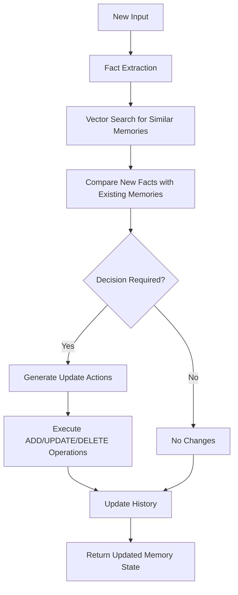
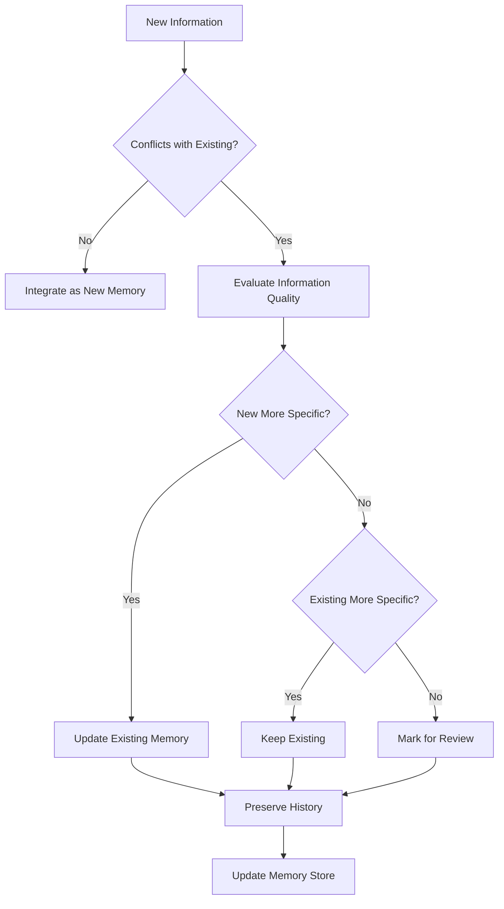
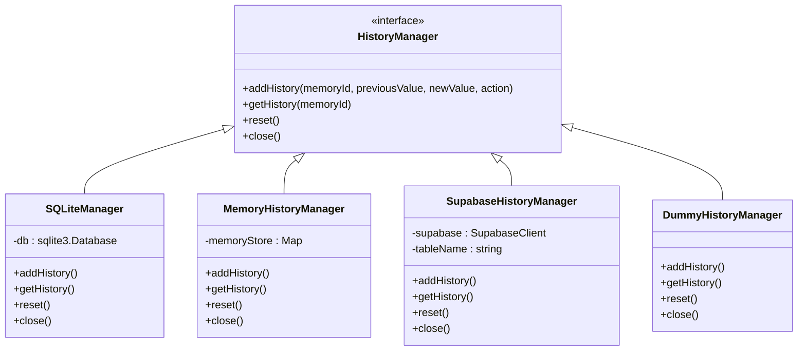

# Data Update Workflow

<cite>
**Referenced Files in This Document**   
- [main.py](file://mem0/memory/main.py)
- [storage.py](file://mem0/memory/storage.py)
- [prompts.py](file://mem0/configs/prompts.py)
- [SQLiteManager.ts](file://mem0-ts/src/oss/src/storage/SQLiteManager.ts)
- [MemoryHistoryManager.ts](file://mem0-ts/src/oss/src/storage/MemoryHistoryManager.ts)
- [base.ts](file://mem0-ts/src/oss/src/storage/base.ts)
- [utils.py](file://mem0/graphs/utils.py)
- [utils.ts](file://mem0-ts/src/oss/src/graphs/utils.ts)
</cite>

## Table of Contents
1. [Introduction](#introduction)
2. [Update Decision Pipeline](#update-decision-pipeline)
3. [Memory Matching and Change Detection](#memory-matching-and-change-detection)
4. [Merge Logic and Conflict Resolution](#merge-logic-and-conflict-resolution)
5. [History Tracking Mechanism](#history-tracking-mechanism)
6. [Configuration Options](#configuration-options)
7. [Update Scenarios](#update-scenarios)
8. [Consistency Challenges and Audit Trail](#consistency-challenges-and-audit-trail)

## Introduction
The Mem0 data update workflow manages how existing memories are updated through both direct modifications and LLM-driven inference when new information conflicts or complements stored memories. The system employs a sophisticated pipeline that handles memory matching, change detection, merge logic, and history tracking to maintain accurate and coherent knowledge representation over time. This documentation details the complete workflow, including the decision pipeline, storage mechanisms, configuration options, and strategies for handling consistency and conflicts.

**Section sources**
- [main.py](file://mem0/memory/main.py#L1200-L1539)
- [prompts.py](file://mem0/configs/prompts.py#L58-L345)

## Update Decision Pipeline
The update decision pipeline in Mem0 follows a systematic process to determine how new information should affect existing memories. When new input is received, the system first extracts relevant facts through LLM processing. These facts are then compared against existing memories to determine appropriate actions: ADD, UPDATE, DELETE, or NONE (no change).

The pipeline begins with fact extraction using a specialized prompt that identifies user preferences and factual information from conversation history. Extracted facts are then used to search for similar existing memories through vector similarity search. For each matching memory, the system evaluates whether the new information should be added as a new memory, update an existing memory, delete a memory, or require no change.

The decision-making process is guided by specific rules:
- **ADD**: When new information is not present in existing memories
- **UPDATE**: When existing information needs modification or enhancement
- **DELETE**: When information should be removed or contradicted
- **NONE**: When information is already present or irrelevant

This pipeline ensures that memory updates are intentional and based on semantic analysis rather than simple overwrite operations.

**Diagram sources**
- [main.py](file://mem0/memory/main.py#L1208-L1263)
- [prompts.py](file://mem0/configs/prompts.py#L61-L345)

**Section sources**
- [main.py](file://mem0/memory/main.py#L1200-L1399)
- [prompts.py](file://mem0/configs/prompts.py#L58-L345)

## Memory Matching and Change Detection
Memory matching in Mem0 is accomplished through vector similarity search, which identifies existing memories that are semantically related to new information. When a new fact is extracted, the system generates an embedding for that fact and searches the vector store for memories within a specified similarity threshold.

The change detection process involves comparing the content of new facts with existing memories to identify conflicts or complementary information. This comparison is performed by the LLM using a specialized prompt that guides the analysis of whether new information should be added, updated, or deleted from the memory store.

Key aspects of memory matching include:
- Using embeddings to find semantically similar memories
- Applying filters based on user_id, agent_id, or run_id to scope the search
- Limiting results to a configurable number of matches (default: 5)
- Removing duplicates from search results to prevent redundant processing

Change detection evaluates not just exact matches but semantic equivalence. For example, "Likes cheese pizza" and "Loves cheese pizza" may be considered equivalent information, while "Likes cheese pizza" and "Dislikes cheese pizza" represent a direct conflict requiring resolution.

**Section sources**
- [main.py](file://mem0/memory/main.py#L1228-L1244)
- [prompts.py](file://mem0/configs/prompts.py#L104-L108)

## Merge Logic and Conflict Resolution
The merge logic in Mem0 determines how conflicting or complementary information is integrated into existing memories. When conflicts are detected between new information and existing memories, the system applies specific rules to resolve these conflicts and maintain data consistency.

For update operations, the system follows these guidelines:
- When new information provides additional details about an existing fact, the memory is updated to incorporate the new information
- When new information contradicts existing information, the system evaluates which information is more recent or accurate
- When information is redundant or equivalent, no changes are made to avoid unnecessary updates

The conflict resolution strategy prioritizes information based on recency and specificity. More detailed information takes precedence over less detailed information when both convey the same general meaning. For example, "Loves to play cricket with friends" would update "Likes to play cricket" as it provides more specific information.

The merge process also handles UUID management, using temporary ID mapping to prevent hallucination of memory IDs during the update process. This ensures that updates reference the correct memory records even when the LLM processes simplified ID representations.

**Diagram sources**
- [prompts.py](file://mem0/configs/prompts.py#L101-L199)
- [main.py](file://mem0/memory/main.py#L1300-L1313)

**Section sources**
- [prompts.py](file://mem0/configs/prompts.py#L101-L199)
- [main.py](file://mem0/memory/main.py#L1300-L1313)

## History Tracking Mechanism
Mem0 implements a comprehensive history tracking mechanism that preserves previous versions of memories in SQLite, providing a complete audit trail of memory evolution over time. The history system records all changes to memories, including additions, updates, and deletions, allowing for full traceability of how information has changed.

The SQLite-based history store maintains a table with the following schema:
- id: Unique identifier for the history record
- memory_id: Reference to the memory being modified
- old_memory: Previous content of the memory (for updates/deletes)
- new_memory: New content of the memory (for adds/updates)
- event: Type of operation (ADD, UPDATE, DELETE)
- created_at: Timestamp of the change
- updated_at: Optional timestamp of subsequent updates
- is_deleted: Flag indicating if the memory was deleted
- actor_id: Identifier of the entity making the change
- role: Role of the actor (e.g., user, system)

The system supports multiple history store implementations through a common interface, including:
- SQLiteManager: Persistent storage using SQLite database
- MemoryHistoryManager: In-memory storage for temporary sessions
- SupabaseHistoryManager: Cloud-based storage using Supabase
- DummyHistoryManager: Null implementation for testing

History records are automatically created during memory operations and can be retrieved to reconstruct the evolution of any memory over time. This audit trail is essential for debugging, compliance, and understanding how the system's knowledge has developed.

**Diagram sources**
- [base.ts](file://mem0-ts/src/oss/src/storage/base.ts#L1-L14)
- [SQLiteManager.ts](file://mem0-ts/src/oss/src/storage/SQLiteManager.ts#L1-L85)
- [MemoryHistoryManager.ts](file://mem0-ts/src/oss/src/storage/MemoryHistoryManager.ts#L1-L58)

**Section sources**
- [storage.py](file://mem0/memory/storage.py#L1-L200)
- [SQLiteManager.ts](file://mem0-ts/src/oss/src/storage/SQLiteManager.ts#L1-L85)
- [base.ts](file://mem0-ts/src/oss/src/storage/base.ts#L1-L14)

## Configuration Options
Mem0 provides several configuration options that affect update behavior, allowing customization of the memory management system to suit different use cases and requirements. These options control various aspects of the update workflow, from history tracking to graph integration.

Key configuration options include:
- **disableHistory**: Boolean flag to disable history tracking (default: false)
- **historyDbPath**: Path to the SQLite database file for history storage (default: .mem0/memory_history.db)
- **enableGraph**: Boolean flag to enable graph-based memory storage (default: false)
- **custom_update_memory_prompt**: Custom prompt template for the update decision process
- **custom_fact_extraction_prompt**: Custom prompt template for fact extraction

The configuration system uses a merge strategy where user-provided settings override default values. This allows for flexible customization while maintaining sensible defaults. The configuration manager validates all settings to ensure they conform to the expected schema.

Additional configuration options in the vector store, LLM, and embedder components can also indirectly affect update behavior by changing how memories are stored, retrieved, and processed.

**Section sources**
- [manager.ts](file://mem0-ts/src/oss/src/config/manager.ts#L1-L116)
- [main.py](file://mem0/memory/main.py#L1340-L1345)

## Update Scenarios
The Mem0 system handles various update scenarios that demonstrate its capability to manage evolving information. These scenarios illustrate how the system processes different types of changes to memories.

### Addition Scenario
When new information is introduced that doesn't exist in the current memory, the system adds it as a new memory entry. For example, if the existing memory contains "User is a software engineer" and new information "Name is John" is provided, the system will add this as a new memory with an ADD event.

### Update Scenario
When existing information needs to be modified, the system updates the memory content while preserving the memory ID. For example, if the memory contains "I really like cheese pizza" and new information "Loves chicken pizza" is provided, the system may update the memory to "Loves cheese and chicken pizza" with an UPDATE event, preserving the history of the change.

### Deletion Scenario
When information should be removed or contradicted, the system marks the memory for deletion. For example, if the memory contains "Loves cheese pizza" and new information "Dislikes cheese pizza" is provided, the system may delete the existing memory and potentially add a new memory reflecting the updated preference.

### No Change Scenario
When information is already present or redundant, the system makes no changes. For example, if the memory contains "Likes cheese pizza" and new information "Loves cheese pizza" is provided, the system may determine that these convey the same information and require no update.

These scenarios demonstrate the system's ability to handle nuanced information updates while maintaining data integrity and providing a clear audit trail.

**Section sources**
- [prompts.py](file://mem0/configs/prompts.py#L74-L240)
- [main.py](file://mem0/memory/main.py#L1300-L1335)

## Consistency Challenges and Audit Trail
The Mem0 system addresses several consistency challenges inherent in dynamic memory management, particularly when dealing with conflicting information from multiple sources over time. The primary challenges include maintaining semantic coherence, preventing contradictory information from coexisting, and ensuring that updates reflect the most current understanding.

The audit trail requirements are met through the comprehensive history tracking system, which provides several key capabilities:
- **Traceability**: Every change to a memory is recorded with timestamps and context
- **Reproducibility**: The evolution of any memory can be reconstructed from the history
- **Accountability**: Changes are attributed to specific actors or sources
- **Recovery**: Previous states can be restored if needed

To address consistency challenges, the system employs several strategies:
- Using vector similarity search to identify potentially conflicting memories before updates
- Applying semantic analysis to determine if new information truly contradicts existing information
- Maintaining a single source of truth for each piece of information
- Providing clear conflict resolution rules in the update prompts

The combination of the update decision pipeline, history tracking, and configuration options ensures that Mem0 can maintain consistent and reliable memories over time, even as new information continuously updates the knowledge base.

**Section sources**
- [storage.py](file://mem0/memory/storage.py#L1-L200)
- [utils.py](file://mem0/graphs/utils.py#L1-L16)
- [utils.ts](file://mem0-ts/src/oss/src/graphs/utils.ts#L1-L16)