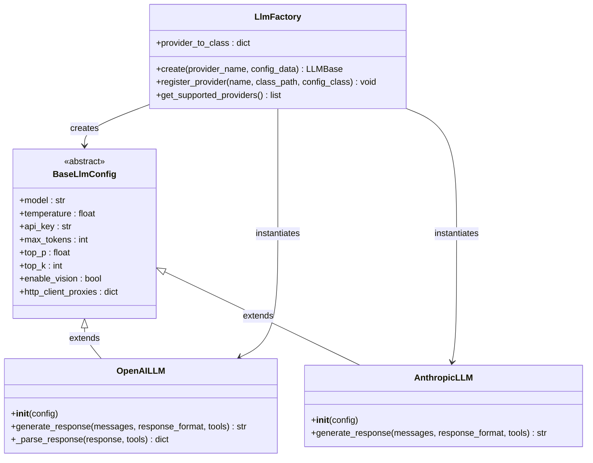
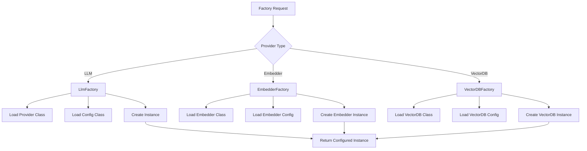
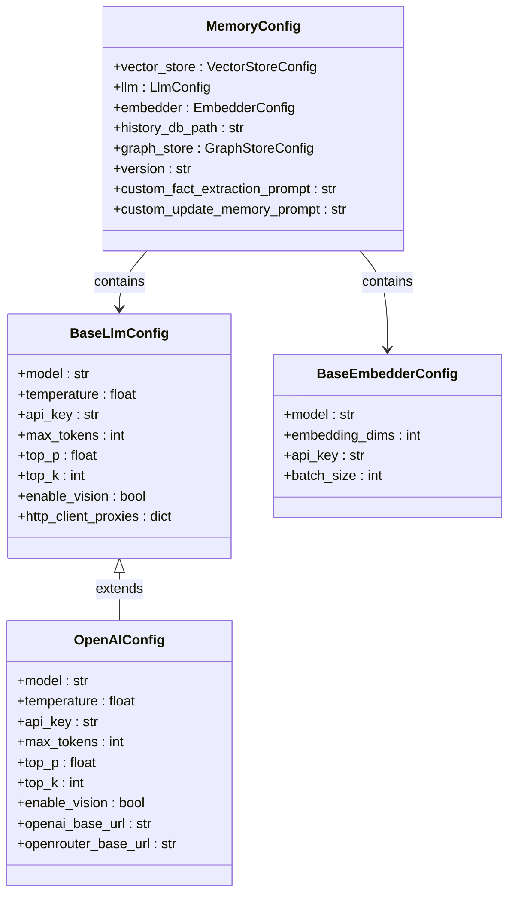
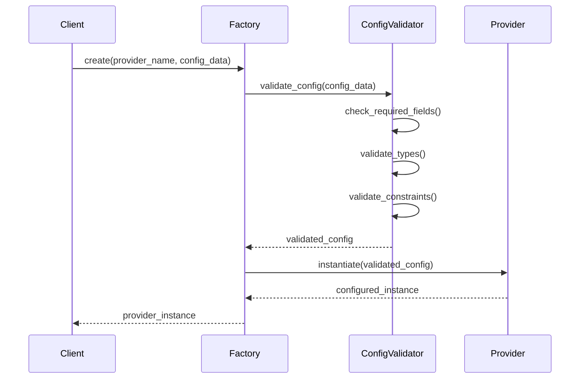
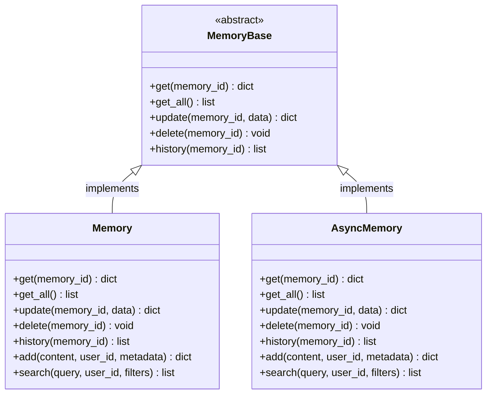
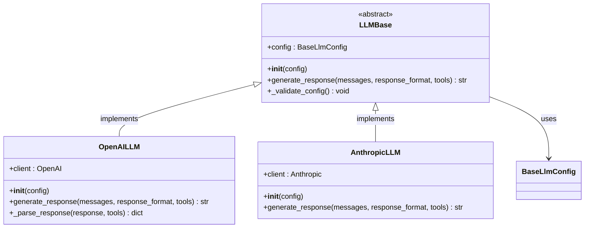
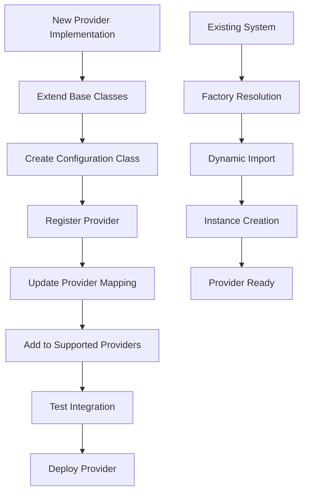
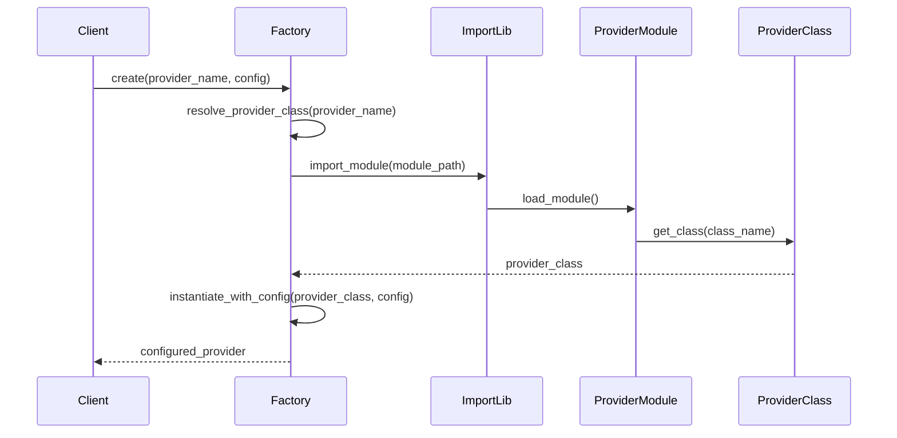
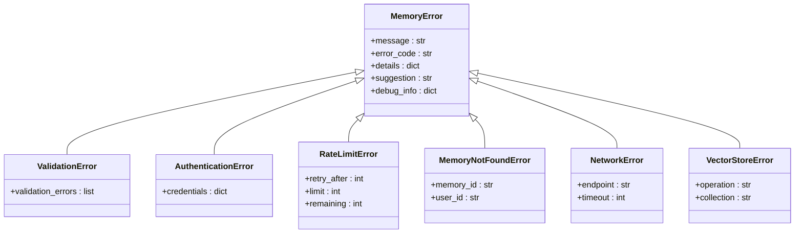
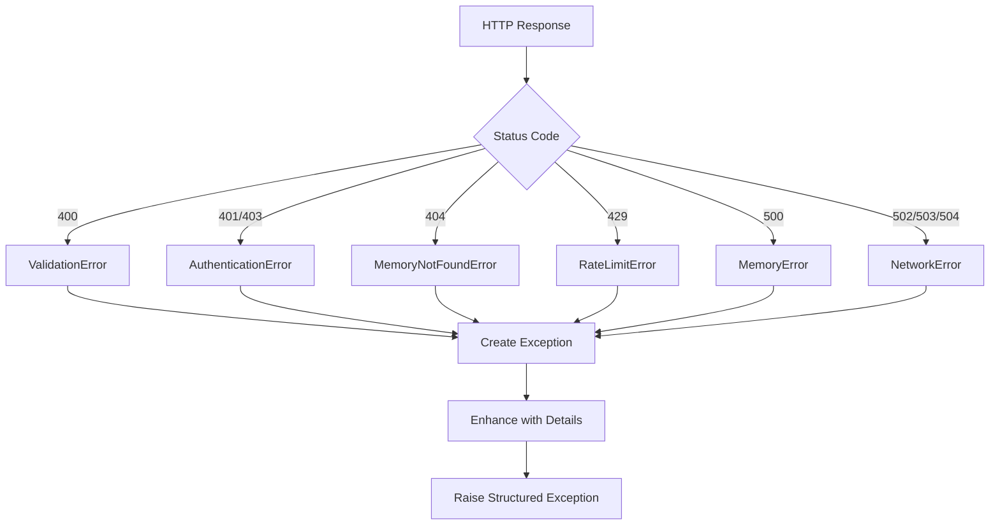

# Design Patterns

<cite>
**Referenced Files in This Document**
- [embedchain/factory.py](file://embedchain/embedchain/factory.py)
- [mem0/utils/factory.py](file://mem0/utils/factory.py)
- [mem0/memory/base.py](file://mem0/memory/base.py)
- [mem0/configs/base.py](file://mem0/configs/base.py)
- [embedchain/embedchain/config/base_config.py](file://embedchain/embedchain/config/base_config.py)
- [mem0/configs/llms/base.py](file://mem0/configs/llms/base.py)
- [mem0/llms/base.py](file://mem0/llms/base.py)
- [mem0/llms/openai.py](file://mem0/llms/openai.py)
- [mem0/embeddings/openai.py](file://mem0/embeddings/openai.py)
- [mem0/vector_stores/chroma.py](file://mem0/vector_stores/chroma.py)
- [embedchain/tests/test_factory.py](file://embedchain/tests/test_factory.py)
- [mem0/exceptions.py](file://mem0/exceptions.py)
- [mem0/client/utils.py](file://mem0/client/utils.py)
</cite>

## Table of Contents
1. [Introduction](#introduction)
2. [Factory Pattern Implementation](#factory-pattern-implementation)
3. [Dependency Injection Architecture](#dependency-injection-architecture)
4. [Abstract Base Classes and Interfaces](#abstract-base-classes-and-interfaces)
5. [Plugin Architecture](#plugin-architecture)
6. [Error Handling and Exception Management](#error-handling-and-exception-management)
7. [Best Practices for Extending Patterns](#best-practices-for-extending-patterns)
8. [Common Pitfalls and Solutions](#common-pitfalls-and-solutions)
9. [Conclusion](#conclusion)

## Introduction

The Mem0 system employs a sophisticated design pattern architecture that promotes flexibility, extensibility, and maintainability. This documentation explores the key design patterns implemented throughout the system, focusing on the Factory Pattern for provider instantiation, Dependency Injection through configuration objects, Abstract Base Classes for extensibility, and a robust Plugin Architecture for seamless provider integration.

The system's design philosophy centers around loose coupling and high cohesion, enabling developers to easily integrate new providers while maintaining backward compatibility and consistent interfaces across all components.

## Factory Pattern Implementation

### LLM Factory Pattern

The LLM Factory Pattern serves as the cornerstone of provider instantiation in the Mem0 system. This pattern encapsulates the complexity of creating LLM instances while providing a unified interface for all supported providers.



**Diagram sources**
- [embedchain/embedchain/factory.py](file://embedchain/embedchain/factory.py#L10-L48)
- [mem0/configs/llms/base.py](file://mem0/configs/llms/base.py#L7-L36)
- [mem0/llms/base.py](file://mem0/llms/base.py#L7-L39)

The Factory Pattern implementation provides several key benefits:

- **Centralized Provider Management**: All provider mappings are maintained in a single location
- **Type Safety**: Strong typing ensures correct provider instantiation
- **Extensibility**: New providers can be added without modifying existing code
- **Configuration Abstraction**: Providers receive appropriately typed configuration objects

**Section sources**
- [embedchain/embedchain/factory.py](file://embedchain/embedchain/factory.py#L10-L48)
- [mem0/utils/factory.py](file://mem0/utils/factory.py#L23-L128)

### Embedder and Vector Store Factories

Similar Factory Pattern implementations exist for embedders and vector stores, following the same architectural principles:



**Diagram sources**
- [embedchain/embedchain/factory.py](file://embedchain/embedchain/factory.py#L51-L89)
- [embedchain/embedchain/factory.py](file://embedchain/embedchain/factory.py#L91-L123)

**Section sources**
- [embedchain/embedchain/factory.py](file://embedchain/embedchain/factory.py#L51-L123)

## Dependency Injection Architecture

### Configuration-Based Dependency Injection

The Mem0 system employs a sophisticated dependency injection mechanism through configuration objects. This approach decouples components from their dependencies while maintaining type safety and configuration validation.



**Diagram sources**
- [mem0/configs/base.py](file://mem0/configs/base.py#L29-L62)
- [mem0/configs/llms/base.py](file://mem0/configs/llms/base.py#L7-L36)

### Configuration Validation and Type Safety

The system implements comprehensive configuration validation through Pydantic models, ensuring type safety and providing meaningful error messages:



**Diagram sources**
- [mem0/utils/factory.py](file://mem0/utils/factory.py#L51-L104)
- [mem0/configs/base.py](file://mem0/configs/base.py#L16-L27)

**Section sources**
- [mem0/configs/base.py](file://mem0/configs/base.py#L29-L62)
- [mem0/configs/llms/base.py](file://mem0/configs/llms/base.py#L7-L36)

## Abstract Base Classes and Interfaces

### MemoryBase Abstract Class

The MemoryBase class defines the fundamental interface for all memory storage implementations, establishing a contract that ensures consistency across different storage backends.



**Diagram sources**
- [mem0/memory/base.py](file://mem0/memory/base.py#L4-L63)

### LLM Base Class Architecture

The LLM base class provides a standardized foundation for all language model implementations:



**Diagram sources**
- [mem0/llms/base.py](file://mem0/llms/base.py#L7-L39)
- [mem0/llms/openai.py](file://mem0/llms/openai.py#L14-L148)

### Configuration Base Classes

The system provides specialized base classes for different configuration types:

| Configuration Type | Base Class | Purpose | Key Features |
|-------------------|------------|---------|--------------|
| LLM Configuration | `BaseLlmConfig` | Common LLM parameters | Model, temperature, API keys, token limits |
| Embedder Configuration | `BaseEmbedderConfig` | Embedding model settings | Model selection, dimensionality, batch sizes |
| Vector Store Configuration | `VectorStoreConfig` | Vector database parameters | Connection settings, indexing options |
| Graph Store Configuration | `GraphStoreConfig` | Graph database parameters | Relationship types, query optimization |

**Section sources**
- [mem0/memory/base.py](file://mem0/memory/base.py#L4-L63)
- [mem0/llms/base.py](file://mem0/llms/base.py#L7-L39)
- [mem0/configs/llms/base.py](file://mem0/configs/llms/base.py#L7-L36)

## Plugin Architecture

### Provider Registration System

The plugin architecture enables seamless integration of new providers through a registration system that maintains loose coupling between the core system and provider implementations.



**Diagram sources**
- [mem0/utils/factory.py](file://mem0/utils/factory.py#L106-L118)

### Dynamic Provider Resolution

The system supports dynamic provider resolution through Python's importlib module, enabling runtime provider discovery and instantiation:



**Diagram sources**
- [embedchain/embedchain/factory.py](file://embedchain/embedchain/factory.py#L4-L8)
- [mem0/utils/factory.py](file://mem0/utils/factory.py#L17-L21)

### Provider Compatibility Matrix

| Provider Category | Current Support | Extension Points | Integration Complexity |
|------------------|-----------------|------------------|----------------------|
| LLM Providers | 15+ providers | Custom config classes | Low |
| Embedding Providers | 10+ providers | Dimension customization | Medium |
| Vector Stores | 15+ providers | Index optimization | Medium |
| Graph Stores | 5+ providers | Relationship modeling | High |

**Section sources**
- [mem0/utils/factory.py](file://mem0/utils/factory.py#L106-L118)
- [embedchain/embedchain/factory.py](file://embedchain/embedchain/factory.py#L4-L8)

## Error Handling and Exception Management

### Structured Exception Hierarchy

The Mem0 system implements a comprehensive exception hierarchy that provides detailed error information and actionable suggestions:



**Diagram sources**
- [mem0/exceptions.py](file://mem0/exceptions.py#L34-L56)

### HTTP Status Code Mapping

The system provides automatic exception creation based on HTTP status codes, ensuring consistent error handling across all API interactions:



**Diagram sources**
- [mem0/exceptions.py](file://mem0/exceptions.py#L424-L503)

**Section sources**
- [mem0/exceptions.py](file://mem0/exceptions.py#L34-L503)
- [mem0/client/utils.py](file://mem0/client/utils.py#L23-L103)

## Best Practices for Extending Patterns

### Creating New LLM Providers

When implementing new LLM providers, follow these established patterns:

1. **Extend the Base Class**: Always inherit from `LLMBase` to ensure consistent behavior
2. **Create Configuration Class**: Define a provider-specific configuration class inheriting from `BaseLlmConfig`
3. **Implement Required Methods**: Override `generate_response()` and `_validate_config()` as needed
4. **Add to Factory**: Register the provider in the appropriate factory class
5. **Write Tests**: Include comprehensive tests following the existing test patterns

```python
# Example provider implementation pattern
class CustomLLM(LLMBase):
    def __init__(self, config: Optional[Union[BaseLlmConfig, CustomConfig, Dict]] = None):
        # Configuration handling follows established patterns
        if isinstance(config, dict):
            config = CustomConfig(**config)
        super().__init__(config)
    
    def generate_response(self, messages: List[Dict], **kwargs):
        # Implementation following the established pattern
        pass
```

### Embedding Provider Guidelines

For embedding providers, maintain consistency with the existing architecture:

1. **Inherit from EmbeddingBase**: Use the established base class for embedding implementations
2. **Handle Configuration**: Support both dictionary and configuration object inputs
3. **Implement Standard Methods**: Provide the required `embed()` method with proper error handling
4. **Test Thoroughly**: Ensure compatibility with various text inputs and edge cases

### Vector Store Provider Implementation

Vector store providers require careful attention to the established interface:

1. **Extend VectorStoreBase**: Inherit from the base vector store class
2. **Implement Required Operations**: Support all required CRUD operations
3. **Handle Collections**: Manage collection creation and lifecycle
4. **Optimize Performance**: Implement efficient search and insertion operations
5. **Error Handling**: Provide meaningful error messages for common failure modes

**Section sources**
- [mem0/llms/openai.py](file://mem0/llms/openai.py#L14-L148)
- [mem0/embeddings/openai.py](file://mem0/embeddings/openai.py#L11-L50)
- [mem0/vector_stores/chroma.py](file://mem0/vector_stores/chroma.py#L23-L268)

## Common Pitfalls and Solutions

### Configuration Management Pitfalls

**Pitfall**: Mixing configuration types (BaseConfig vs provider-specific)
**Solution**: Always use the appropriate configuration class for each provider

**Pitfall**: Missing required configuration fields
**Solution**: Implement comprehensive validation in provider-specific config classes

**Pitfall**: Hardcoding API keys or sensitive information
**Solution**: Use environment variables and provide fallback mechanisms

### Factory Registration Issues

**Pitfall**: Incorrect class path specification
**Solution**: Verify module paths and class names in factory mappings

**Pitfall**: Missing configuration class registration
**Solution**: Ensure both provider class and configuration class are registered

**Pitfall**: Circular dependencies in imports
**Solution**: Use lazy imports and dynamic loading where appropriate

### Memory Management Concerns

**Pitfall**: Memory leaks in long-running applications
**Solution**: Implement proper cleanup in provider implementations

**Pitfall**: Inconsistent memory state across providers
**Solution**: Follow the established MemoryBase interface strictly

**Pitfall**: Thread safety issues in concurrent environments
**Solution**: Use thread-safe patterns and provide clear concurrency guidelines

### Testing Challenges

**Pitfall**: Incomplete test coverage for new providers
**Solution**: Follow the established test patterns and include edge case testing

**Pitfall**: Mocking dependencies incorrectly
**Solution**: Use the existing mocking patterns and ensure realistic test scenarios

**Pitfall**: Ignoring error conditions
**Solution**: Test all error paths and ensure proper exception handling

### Performance Considerations

**Pitfall**: Blocking operations in async contexts
**Solution**: Implement proper async/await patterns where applicable

**Pitfall**: Inefficient resource utilization
**Solution**: Monitor and optimize resource usage in provider implementations

**Pitfall**: Lack of connection pooling
**Solution**: Implement connection pooling for external API calls

**Section sources**
- [embedchain/tests/test_factory.py](file://embedchain/tests/test_factory.py#L18-L67)
- [mem0/exceptions.py](file://mem0/exceptions.py#L1-L503)

## Conclusion

The Mem0 system demonstrates sophisticated design pattern implementation that promotes flexibility, maintainability, and extensibility. The Factory Pattern enables seamless provider instantiation, Dependency Injection through configuration objects ensures loose coupling, Abstract Base Classes establish clear interfaces, and the Plugin Architecture facilitates easy integration of new providers.

Key architectural strengths include:

- **Type Safety**: Comprehensive type checking and validation
- **Extensibility**: Easy addition of new providers without core modifications
- **Maintainability**: Clear separation of concerns and consistent interfaces
- **Reliability**: Robust error handling and exception management
- **Performance**: Efficient resource management and optimization opportunities

The system's design patterns serve as excellent examples for building scalable, maintainable AI/ML infrastructure systems. Developers implementing custom providers should follow the established patterns and best practices to ensure compatibility and maintain system integrity.

Future enhancements could include asynchronous factory operations, provider health monitoring, and enhanced configuration validation to further improve the system's reliability and developer experience.