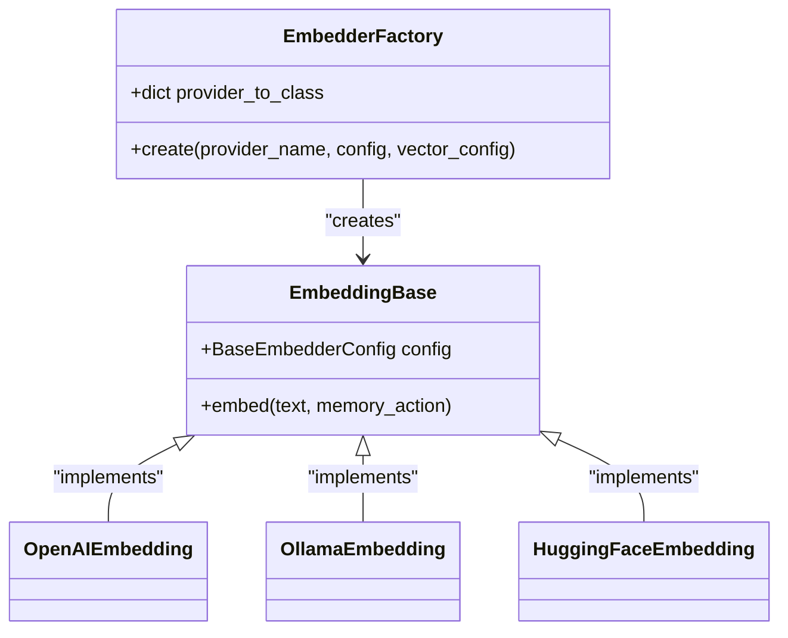
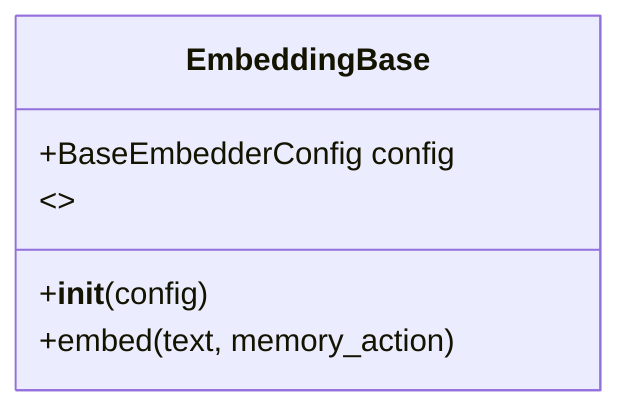
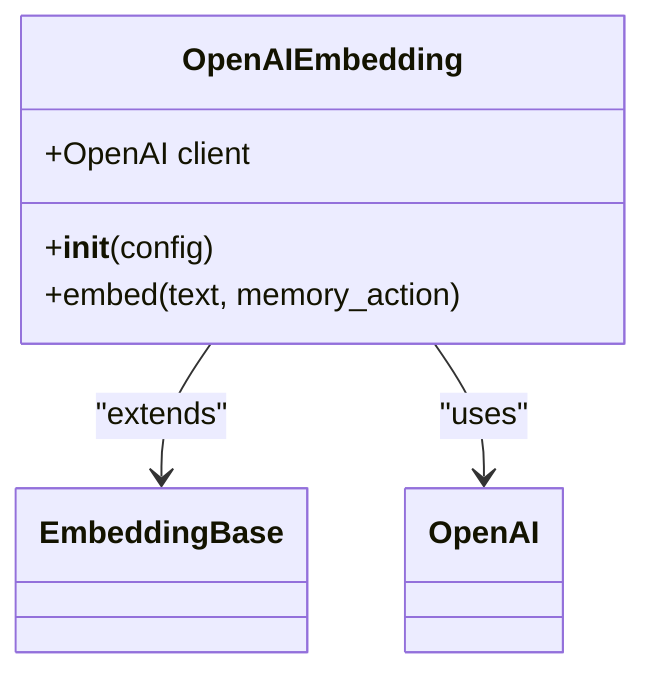
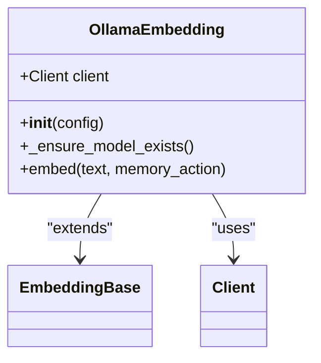
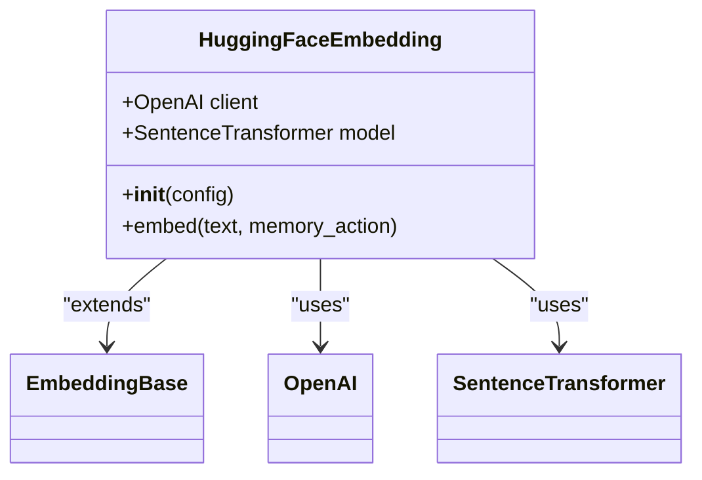
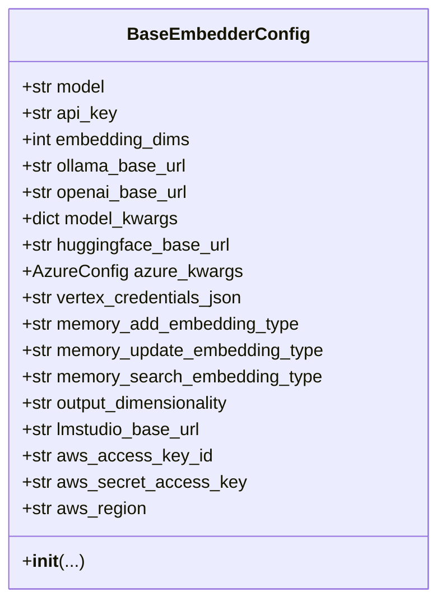
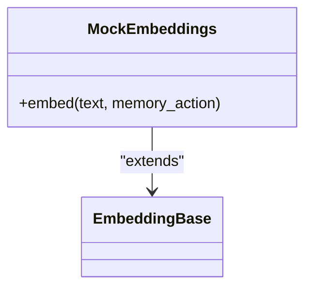
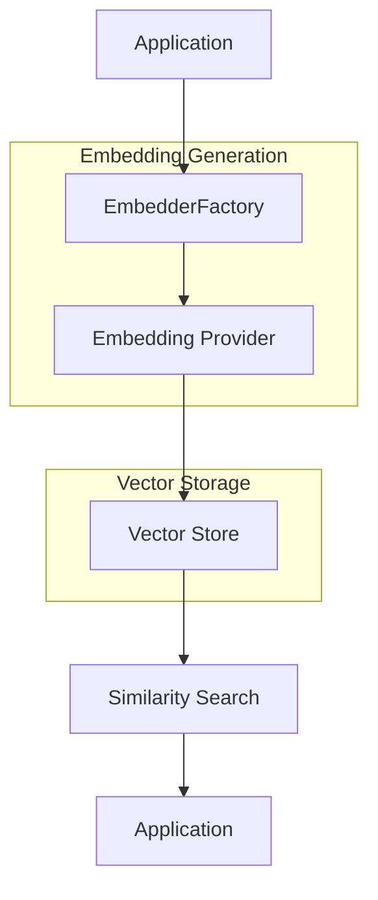

# Embedding Model Integration

<cite>
**Referenced Files in This Document**   
- [EmbedderFactory.py](file://mem0/utils/factory.py#L131-L157)
- [EmbeddingBase.py](file://mem0/embeddings/base.py#L7-L32)
- [BaseEmbedderConfig.py](file://mem0/configs/embeddings/base.py#L10-L111)
- [OpenAIEmbedding.py](file://mem0/embeddings/openai.py#L11-L50)
- [OllamaEmbedding.py](file://mem0/embeddings/ollama.py#L24-L54)
- [HuggingFaceEmbedding.py](file://mem0/embeddings/huggingface.py#L15-L42)
- [MockEmbeddings.py](file://mem0/embeddings/mock.py#L6-L12)
- [UpstashVector.py](file://mem0/vector_stores/upstash_vector.py#L50-L74)
- [EmbedderConfig.py](file://mem0/embeddings/configs.py#L6-L32)
</cite>

## Table of Contents
1. [Introduction](#introduction)
2. [EmbedderFactory and Provider Management](#embedderfactory-and-provider-management)
3. [Base Embedding Interface](#base-embedding-interface)
4. [Provider Implementations](#provider-implementations)
5. [Configuration System](#configuration-system)
6. [Special Case: Upstash Vector](#special-case-upstash-vector)
7. [Testing Considerations](#testing-considerations)
8. [Custom Embedder Implementation](#custom-embedder-implementation)
9. [Architecture and Integration](#architecture-and-integration)
10. [Conclusion](#conclusion)

## Introduction
The Mem0 framework provides a comprehensive embedding model integration system that supports multiple embedding providers through a flexible factory pattern. This document details the architecture and implementation of the embedding system, focusing on the EmbedderFactory class, provider implementations, configuration management, and integration with vector stores. The system is designed to be extensible, allowing for easy addition of new embedding providers while maintaining a consistent interface across all implementations.

**Section sources**
- [EmbedderFactory.py](file://mem0/utils/factory.py#L131-L157)

## EmbedderFactory and Provider Management

The EmbedderFactory class serves as the central component for creating and managing embedding providers in the Mem0 system. Implemented as a factory pattern, it provides a unified interface for instantiating different embedding providers while abstracting away the specific implementation details.

The factory maintains a provider-to-class mapping that supports 14 different embedding providers, including OpenAI, Ollama, HuggingFace, Azure OpenAI, Gemini, VertexAI, Together, LM Studio, Langchain, AWS Bedrock, and GitHub Copilot. This mapping is defined in the `provider_to_class` dictionary within the EmbedderFactory class.



**Diagram sources**
- [EmbedderFactory.py](file://mem0/utils/factory.py#L131-L157)
- [EmbeddingBase.py](file://mem0/embeddings/base.py#L7-L32)

The factory's `create` method takes three parameters: `provider_name`, `config`, and `vector_config`. The `provider_name` specifies which embedding provider to instantiate, while `config` contains the provider-specific configuration options. The `vector_config` parameter is used for special case handling, particularly with the upstash_vector provider.

**Section sources**
- [EmbedderFactory.py](file://mem0/utils/factory.py#L131-L157)

## Base Embedding Interface

The base embedding interface is defined by the `EmbeddingBase` abstract class, which establishes a consistent contract for all embedding providers. This abstract base class uses Python's ABC (Abstract Base Class) module to enforce implementation of the required methods.



**Diagram sources**
- [EmbeddingBase.py](file://mem0/embeddings/base.py#L7-L32)

The interface defines a single abstract method `embed` that takes two parameters:
- `text`: The text to be embedded as a string
- `memory_action`: An optional parameter specifying the type of memory operation (add, search, or update)

The `EmbeddingBase` class also includes a configuration property that holds the `BaseEmbedderConfig` object, providing access to provider-specific settings. All concrete embedding implementations must inherit from this base class and implement the `embed` method according to their specific provider's API.

**Section sources**
- [EmbeddingBase.py](file://mem0/embeddings/base.py#L7-L32)

## Provider Implementations

### OpenAI Embedding Provider
The OpenAI embedding provider implements the `EmbeddingBase` interface to integrate with OpenAI's embedding API. It handles authentication through API keys, supports custom base URLs, and manages model selection with sensible defaults.



**Diagram sources**
- [OpenAIEmbedding.py](file://mem0/embeddings/openai.py#L11-L50)

### Ollama Embedding Provider
The Ollama embedding provider enables local embedding generation using Ollama models. It includes automatic model downloading functionality and manages the Ollama client connection.



**Diagram sources**
- [OllamaEmbedding.py](file://mem0/embeddings/ollama.py#L24-L54)

### HuggingFace Embedding Provider
The HuggingFace embedding provider supports both local sentence transformer models and remote Text Embeddings Inference (TEI) endpoints. It provides flexibility in model selection and handles different embedding dimensions.



**Diagram sources**
- [HuggingFaceEmbedding.py](file://mem0/embeddings/huggingface.py#L15-L42)

**Section sources**
- [OpenAIEmbedding.py](file://mem0/embeddings/openai.py#L11-L50)
- [OllamaEmbedding.py](file://mem0/embeddings/ollama.py#L24-L54)
- [HuggingFaceEmbedding.py](file://mem0/embeddings/huggingface.py#L15-L42)

## Configuration System

The configuration system for embeddings is centered around the `BaseEmbedderConfig` class, which provides a comprehensive set of options for customizing embedding behavior. This configuration class supports provider-specific settings while maintaining a consistent interface.



**Diagram sources**
- [BaseEmbedderConfig.py](file://mem0/configs/embeddings/base.py#L10-L111)

The configuration system supports various provider-specific options:
- **Ollama**: Base URL for the Ollama API
- **OpenAI**: Custom base URL for OpenAI-compatible APIs
- **HuggingFace**: Model keyword arguments and TEI endpoint URL
- **Azure OpenAI**: Azure-specific configuration including deployment, endpoint, and API version
- **VertexAI**: Path to credentials JSON file
- **AWS Bedrock**: AWS credentials and region configuration

Configuration validation is handled through the `EmbedderConfig` Pydantic model, which ensures that only supported providers are used and validates the configuration structure.

**Section sources**
- [BaseEmbedderConfig.py](file://mem0/configs/embeddings/base.py#L10-L111)
- [EmbedderConfig.py](file://mem0/embeddings/configs.py#L6-L32)

## Special Case: Upstash Vector

The upstash_vector provider includes special handling through the `enable_embeddings` flag. When this flag is enabled, the system uses a MockEmbeddings instance instead of generating actual embeddings. This optimization leverages Upstash Vector's built-in embedding capabilities, avoiding redundant embedding generation.

```mermaid
flowchart TD
A[EmbedderFactory.create] --> B{provider_name == "upstash_vector"?}
B --> |Yes| C{vector_config.enable_embeddings?}
C --> |True| D[Return MockEmbeddings()]
C --> |False| E[Create actual embedder]
B --> |No| E
```

**Diagram sources**
- [EmbedderFactory.py](file://mem0/utils/factory.py#L148-L156)
- [UpstashVector.py](file://mem0/vector_stores/upstash_vector.py#L50-L74)

This special case handling is implemented in the EmbedderFactory's create method, which checks for the upstash_vector provider and the enable_embeddings flag in the vector configuration. When both conditions are met, a MockEmbeddings instance is returned instead of creating the actual embedding provider.

**Section sources**
- [EmbedderFactory.py](file://mem0/utils/factory.py#L148-L156)
- [UpstashVector.py](file://mem0/vector_stores/upstash_vector.py#L50-L74)

## Testing Considerations

The testing framework includes a `MockEmbeddings` class specifically designed for testing scenarios. This class implements the `EmbeddingBase` interface but returns a fixed mock embedding vector, enabling reliable and fast testing without external API calls.



**Diagram sources**
- [MockEmbeddings.py](file://mem0/embeddings/mock.py#L6-L12)

The MockEmbeddings class returns a consistent 10-dimensional vector `[0.1, 0.2, 0.3, 0.4, 0.5, 0.6, 0.7, 0.8, 0.9, 1.0]` for all inputs, ensuring predictable behavior in tests. This approach allows for comprehensive testing of the embedding integration without relying on external services or incurring API costs.

Unit tests for embedding providers typically use mocking to isolate the provider implementation from external dependencies, focusing on the correct configuration and parameter passing to the underlying API clients.

**Section sources**
- [MockEmbeddings.py](file://mem0/embeddings/mock.py#L6-L12)

## Custom Embedder Implementation

Implementing custom embedders in the Mem0 system follows a straightforward pattern. Developers need to create a new class that inherits from `EmbeddingBase` and implement the `embed` method according to their specific requirements.

Key considerations for custom embedder implementation include:
- **Vector Dimensions**: Properly configure the embedding dimensions based on the model being used
- **Authentication**: Handle authentication through API keys, tokens, or other mechanisms as required by the provider
- **Error Handling**: Implement robust error handling for network issues and API errors
- **Configuration**: Extend the configuration system as needed for provider-specific options

The factory pattern makes it easy to register new providers by adding an entry to the `provider_to_class` mapping in the EmbedderFactory. This extensibility allows the system to support a wide range of embedding providers while maintaining a consistent interface.

**Section sources**
- [EmbeddingBase.py](file://mem0/embeddings/base.py#L7-L32)
- [EmbedderFactory.py](file://mem0/utils/factory.py#L131-L157)

## Architecture and Integration

The embedding system is tightly integrated with the vector store architecture in Mem0. Embeddings are generated as part of the data ingestion process and stored in vector databases for efficient similarity search.



**Diagram sources**
- [EmbedderFactory.py](file://mem0/utils/factory.py#L131-L157)
- [vector_stores](file://mem0/vector_stores/)

The relationship between embedders and vector stores is crucial for the overall functionality of the memory system. When data is added to the system, it is first processed by the selected embedding provider to generate vector representations. These vectors are then stored in the configured vector database, enabling efficient retrieval through similarity search operations.

This architecture allows for flexible combinations of embedding providers and vector stores, enabling optimization for different use cases based on performance, cost, and accuracy requirements.

**Section sources**
- [EmbedderFactory.py](file://mem0/utils/factory.py#L131-L157)
- [vector_stores](file://mem0/vector_stores/)

## Conclusion
The embedding model integration in Mem0 provides a robust, extensible framework for working with multiple embedding providers. The factory pattern implementation enables easy switching between providers while maintaining a consistent interface. The comprehensive configuration system supports provider-specific options, and the special case handling for upstash_vector demonstrates thoughtful optimization. The testing infrastructure with MockEmbeddings ensures reliable testing, and the clear architecture facilitates integration with vector stores for efficient similarity search. This system provides a solid foundation for building applications that require flexible and powerful embedding capabilities.