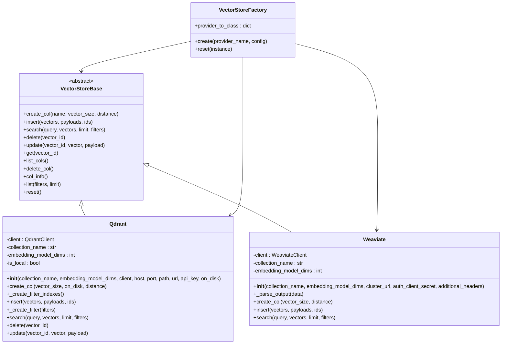
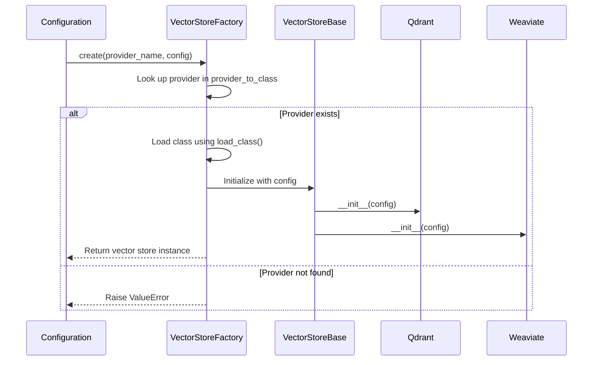
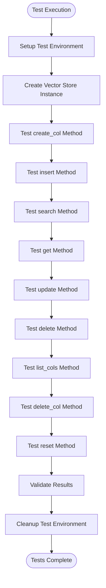

# Extensibility Model

<cite>
**Referenced Files in This Document**   
- [vector_stores/base.py](file://mem0/vector_stores/base.py)
- [utils/factory.py](file://mem0/utils/factory.py)
- [vector_stores/qdrant.py](file://mem0/vector_stores/qdrant.py)
- [vector_stores/weaviate.py](file://mem0/vector_stores/weaviate.py)
- [configs/base.py](file://mem0/configs/base.py)
- [configs/vector_stores/base.py](file://mem0/configs/vector_stores/base.py)
- [tests/vector_stores/test_qdrant.py](file://tests/vector_stores/test_qdrant.py)
- [tests/vector_stores/test_weaviate.py](file://tests/vector_stores/test_weaviate.py)
</cite>

## Table of Contents
1. [Introduction](#introduction)
2. [Architecture Overview](#architecture-overview)
3. [Core Components](#core-components)
4. [Implementation Guide](#implementation-guide)
5. [Configuration Requirements](#configuration-requirements)
6. [Testing and Validation](#testing-and-validation)
7. [Version Compatibility](#version-compatibility)
8. [Conclusion](#conclusion)

## Introduction
The Mem0 framework provides a robust extensibility model that enables developers to integrate new LLM providers, embedding models, vector databases, and graph stores through a plugin-style architecture. This document details the factory pattern and abstract base classes that form the foundation of this extensibility, with a focus on implementing new vector store integrations. The system is designed to be modular, maintainable, and backward compatible, allowing third-party developers to extend functionality without modifying core code.

## Architecture Overview

**Diagram sources**
- [vector_stores/base.py](file://mem0/vector_stores/base.py#L4-L58)
- [vector_stores/qdrant.py](file://mem0/vector_stores/qdrant.py#L22-L200)
- [vector_stores/weaviate.py](file://mem0/vector_stores/weaviate.py#L31-L200)
- [utils/factory.py](file://mem0/utils/factory.py#L159-L200)

**Section sources**
- [vector_stores/base.py](file://mem0/vector_stores/base.py#L4-L58)
- [utils/factory.py](file://mem0/utils/factory.py#L159-L200)

## Core Components

The extensibility model in Mem0 is built around two key design patterns: the factory pattern and abstract base classes. The `VectorStoreBase` abstract class defines the contract that all vector store implementations must follow, ensuring consistency across different providers. The `VectorStoreFactory` class implements the factory pattern, providing a centralized mechanism for creating instances of vector stores based on configuration.

The factory pattern enables plugin-style development by decoupling the creation of vector store instances from their implementation. This allows new vector stores to be integrated by simply extending the base class and registering with the factory, without requiring changes to the core application logic. The factory maintains a mapping of provider names to their corresponding class paths, enabling dynamic instantiation based on configuration.

**Section sources**
- [vector_stores/base.py](file://mem0/vector_stores/base.py#L4-L58)
- [utils/factory.py](file://mem0/utils/factory.py#L159-L200)

## Implementation Guide

### Step-by-Step Vector Store Implementation

To implement a new vector store in Mem0, developers must extend the `VectorStoreBase` abstract class and implement all required methods. The following steps outline the process:

1. Create a new Python file in the `mem0/vector_stores/` directory named after the vector database (e.g., `myvectordb.py`).
2. Import the `VectorStoreBase` class and any required external dependencies.
3. Define a new class that inherits from `VectorStoreBase`.
4. Implement all abstract methods defined in the base class.
5. Add any provider-specific configuration parameters to the `__init__` method.
6. Register the new vector store with the `VectorStoreFactory`.

The `VectorStoreBase` class defines the following abstract methods that must be implemented:
- `create_col`: Creates a new collection with specified parameters
- `insert`: Inserts vectors into the collection
- `search`: Searches for similar vectors
- `delete`: Deletes a vector by ID
- `update`: Updates a vector and its payload
- `get`: Retrieves a vector by ID
- `list_cols`: Lists all collections
- `delete_col`: Deletes a collection
- `col_info`: Gets information about a collection
- `list`: Lists all memories
- `reset`: Resets the collection by deleting and recreating it

### Example Implementation Patterns

The Qdrant and Weaviate implementations demonstrate common patterns for integrating vector databases. Both implementations handle connection management in the `__init__` method, supporting both direct client instances and connection parameters. They also implement collection creation with appropriate indexing for commonly used filter fields.

The Qdrant implementation includes a `_create_filter_indexes` method that creates indexes for fields like `user_id`, `agent_id`, and `run_id` to optimize filtering performance. The Weaviate implementation uses a batch insertion pattern to improve performance when inserting multiple vectors.

**Diagram sources**
- [utils/factory.py](file://mem0/utils/factory.py#L186-L194)
- [vector_stores/qdrant.py](file://mem0/vector_stores/qdrant.py#L23-L76)
- [vector_stores/weaviate.py](file://mem0/vector_stores/weaviate.py#L32-L84)

**Section sources**
- [vector_stores/qdrant.py](file://mem0/vector_stores/qdrant.py#L23-L76)
- [vector_stores/weaviate.py](file://mem0/vector_stores/weaviate.py#L32-L84)
- [utils/factory.py](file://mem0/utils/factory.py#L186-L194)

## Configuration Requirements

Vector store configurations in Mem0 are managed through the `VectorStoreConfig` class, which extends the base configuration model. The configuration must include provider-specific parameters required for initialization. For example, the Qdrant implementation requires parameters such as `collection_name`, `embedding_model_dims`, `host`, `port`, `path`, `url`, and `api_key`.

Configuration parameters are passed to the vector store constructor as keyword arguments, allowing for flexible initialization patterns. The factory handles the conversion of configuration objects to dictionaries before passing them to the constructor, ensuring compatibility across different configuration formats.

The configuration system supports both local and remote deployments, with parameters for connection details, authentication, and storage options. For local deployments, a `path` parameter specifies the directory for persistent storage, while remote deployments use `host` and `port` or a `url` parameter for connection details.

**Section sources**
- [configs/base.py](file://mem0/configs/base.py#L29-L58)
- [configs/vector_stores/base.py](file://mem0/configs/vector_stores/base.py#L6-L37)

## Testing and Validation

The Mem0 framework includes comprehensive testing for vector store implementations, with test files for each supported provider. The test suite validates both the factory pattern and the specific implementation details of each vector store.

Testing considerations include:
- Connection establishment and error handling
- Collection creation and management
- Vector insertion, search, update, and deletion operations
- Filter application and performance
- Batch operations and error recovery
- Reset functionality and state management

The test suite uses pytest with parameterized tests to validate functionality across different configurations. Integration tests verify end-to-end operation, while unit tests focus on specific methods and edge cases. Test containers are used for integration testing with actual database instances, ensuring compatibility with real-world deployments.

**Diagram sources**
- [tests/vector_stores/test_qdrant.py](file://tests/vector_stores/test_qdrant.py)
- [tests/vector_stores/test_weaviate.py](file://tests/vector_stores/test_weaviate.py)

**Section sources**
- [tests/vector_stores/test_qdrant.py](file://tests/vector_stores/test_qdrant.py)
- [tests/vector_stores/test_weaviate.py](file://tests/vector_stores/test_weaviate.py)

## Version Compatibility

The Mem0 extensibility model is designed with backward compatibility in mind, ensuring that third-party integrations continue to work across framework updates. The factory pattern and abstract base classes provide a stable interface that minimizes breaking changes.

Version compatibility is maintained through:
- Semantic versioning for the core framework
- Stable abstract base class interfaces
- Backward-compatible configuration formats
- Deprecation warnings before removing features
- Comprehensive test coverage for existing functionality

Third-party integrations are expected to follow similar practices, maintaining backward compatibility within major versions. The framework provides mechanisms for registering providers programmatically, allowing developers to extend functionality without modifying core code.

When introducing breaking changes, the framework follows a deprecation process that includes:
1. Adding deprecation warnings to affected methods
2. Providing alternative implementations
3. Maintaining backward compatibility for at least one major version
4. Documenting changes in release notes

**Section sources**
- [utils/factory.py](file://mem0/utils/factory.py#L107-L119)
- [vector_stores/base.py](file://mem0/vector_stores/base.py#L4-L58)

## Conclusion

The Mem0 extensibility model provides a robust foundation for integrating new LLM providers, embedding models, vector databases, and graph stores. By leveraging the factory pattern and abstract base classes, the framework enables plugin-style development that is both flexible and maintainable. Developers can implement new vector stores by extending the `VectorStoreBase` class and registering with the `VectorStoreFactory`, following established patterns demonstrated by existing implementations like Qdrant and Weaviate.

The configuration system, testing framework, and version compatibility practices ensure that third-party integrations are reliable and maintainable. By following the guidelines outlined in this document, developers can create high-quality extensions that integrate seamlessly with the Mem0 ecosystem.