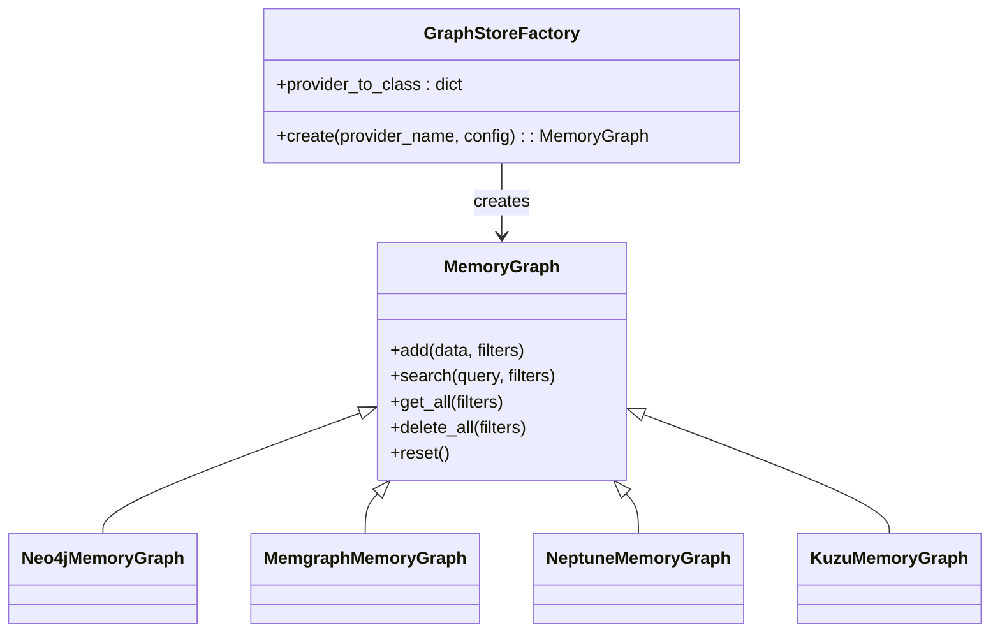
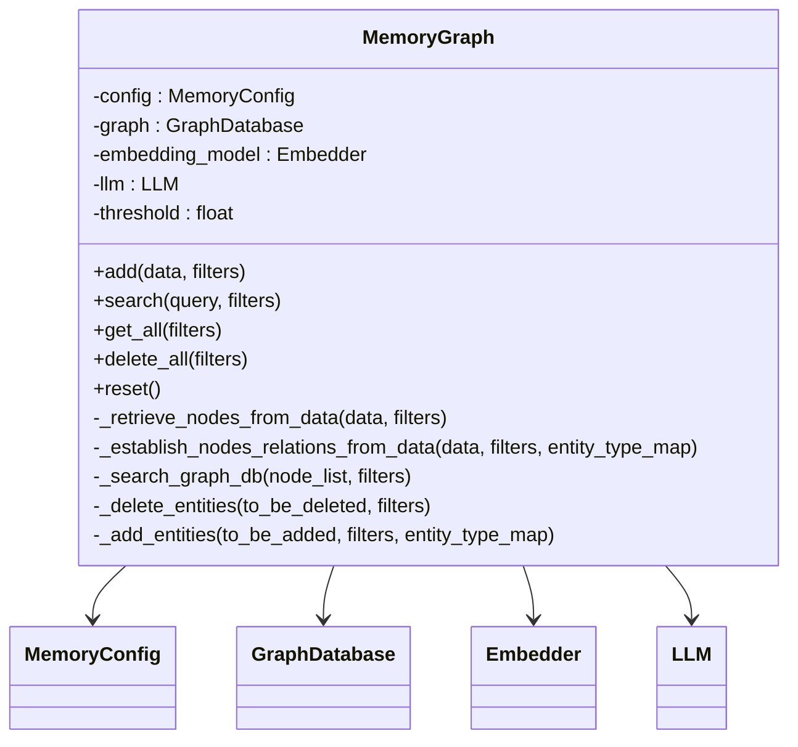
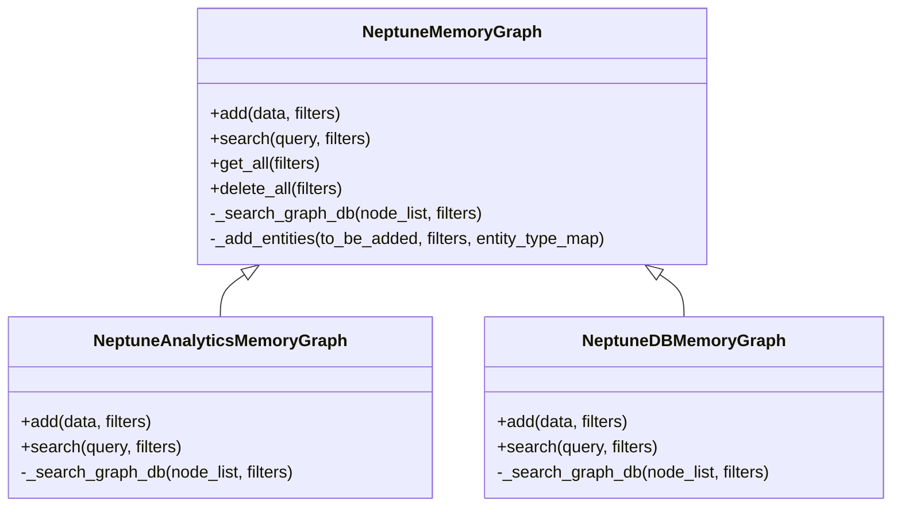
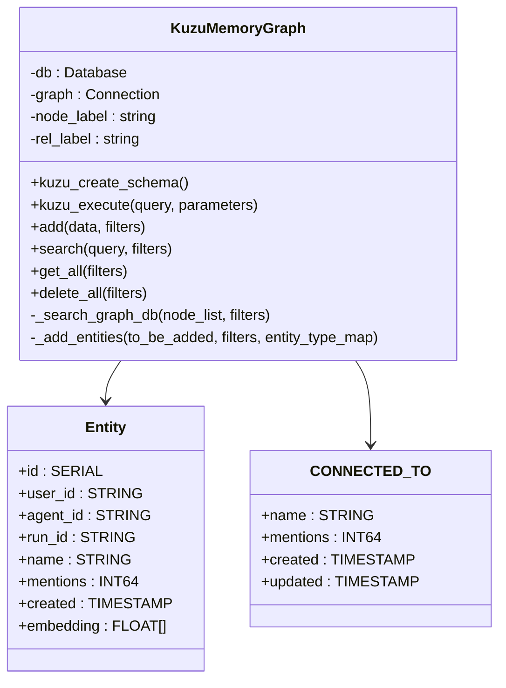
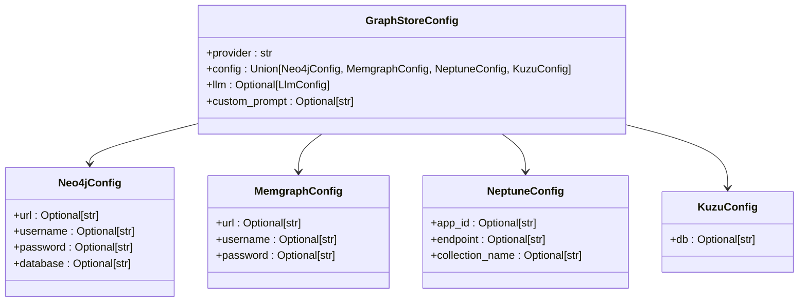
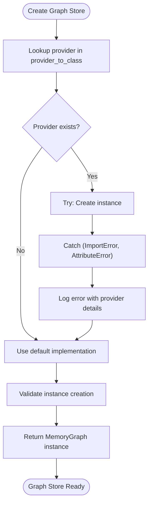
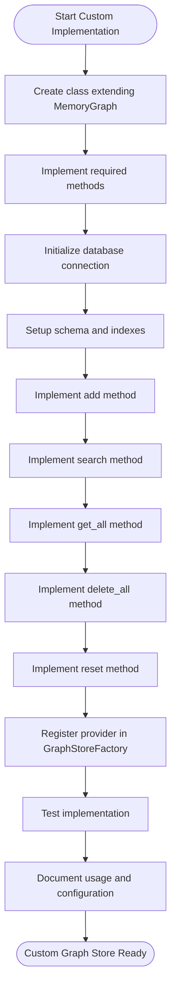
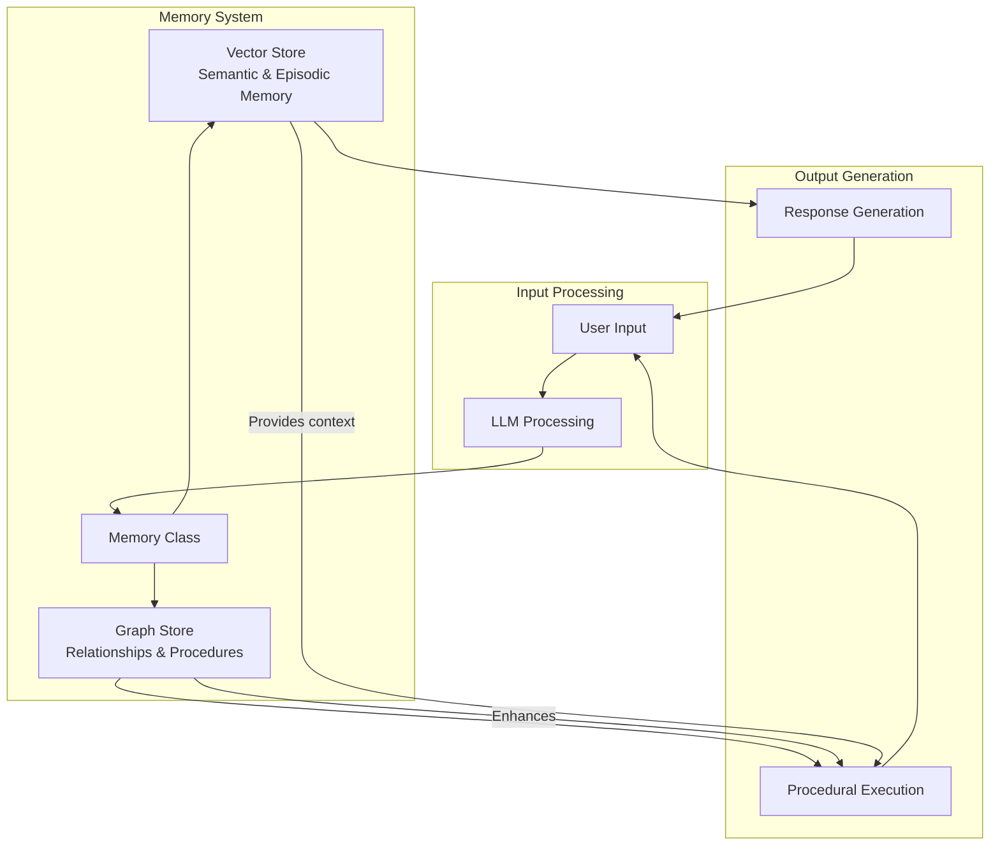

# Graph Store Integration

<cite>
**Referenced Files in This Document**   
- [GraphStoreFactory.py](file://mem0/utils/factory.py#L202-L223)
- [MemoryGraph.py](file://mem0/memory/graph_memory.py#L29-L699)
- [MemgraphMemory.py](file://mem0/memory/memgraph_memory.py#L29-L639)
- [KuzuMemory.py](file://mem0/memory/kuzu_memory.py#L29-L711)
- [NeptuneGraph.py](file://mem0/graphs/neptune/neptunegraph.py)
- [NeptuneDB.py](file://mem0/graphs/neptune/neptunedb.py)
- [GraphsConfig.py](file://mem0/graphs/configs.py#L80-L106)
- [MemoryMain.py](file://mem0/memory/main.py#L131-L180)
- [NeptuneExample.ipynb](file://examples/graph-db-demo/neptune-example.ipynb)
- [KuzuExample.ipynb](file://examples/graph-db-demo/kuzu-example.ipynb)
</cite>

## Table of Contents
1. [Graph Store Factory and Provider Mapping](#graph-store-factory-and-provider-mapping)
2. [MemoryGraph Interface and Base Implementation](#memorygraph-interface-and-base-implementation)
3. [Neptune Graph Store Implementation](#neptune-graph-store-implementation)
4. [Kuzu Graph Store Implementation](#kuzu-graph-store-implementation)
5. [Configuration Requirements](#configuration-requirements)
6. [Fallback Mechanism and Error Handling](#fallback-mechanism-and-error-handling)
7. [Custom Graph Store Implementation Guide](#custom-graph-store-implementation-guide)
8. [Relationship with Procedural Memory](#relationship-with-procedural-memory)
9. [Testing Considerations](#testing-considerations)

## Graph Store Factory and Provider Mapping

The GraphStoreFactory class serves as the central factory for creating MemoryGraph instances across different graph database providers. It implements a provider-to-class mapping that supports Memgraph, Neptune, Kuzu, and other graph databases through a standardized interface. The factory pattern enables seamless integration of various graph stores while maintaining a consistent API for memory operations.

The provider_to_class dictionary in the GraphStoreFactory maps provider names to their corresponding fully qualified class paths. This mapping includes "memgraph" for Memgraph database integration, "neptune" for Neptune Analytics, "neptunedb" for Neptune DB clusters, "kuzu" for the Kuzu graph database, and "default" for the base Neo4j implementation. When a client requests a graph store instance, the factory uses the provider name to look up the appropriate class and instantiate it with the provided configuration.

This design allows for easy extensibility, as new graph database providers can be added to the mapping without modifying the core factory logic. The factory also implements a fallback mechanism where requests for unsupported providers default to the "default" implementation, ensuring graceful degradation when a specific provider is unavailable.

**Diagram sources**
- [GraphStoreFactory.py](file://mem0/utils/factory.py#L202-L223)
- [MemoryGraph.py](file://mem0/memory/graph_memory.py#L29-L699)

**Section sources**
- [GraphStoreFactory.py](file://mem0/utils/factory.py#L202-L223)

## MemoryGraph Interface and Base Implementation

The MemoryGraph interface defines the contract for all graph store implementations in Mem0, providing a consistent API for memory operations. This interface extends the core MemoryBase class and adds graph-specific functionality for managing relationships between entities. The base implementation in graph_memory.py serves as the reference implementation and provides common functionality that can be shared across different graph database providers.

The MemoryGraph class implements several key methods: add for creating new memories and relationships, search for retrieving contextually relevant memories, get_all for listing all memories with their relationships, delete_all for removing all memories for a specific user or agent, and reset for clearing the entire graph store. These methods work in conjunction with LLMs to extract entities and relationships from natural language input, then persist them in the graph database.

The implementation uses a combination of vector similarity search and graph traversal to provide rich context for memory retrieval. When adding memories, the system first extracts entities from the input text using an LLM, then establishes relationships between these entities based on the context. During search operations, the system performs vector similarity search to find relevant nodes, then traverses the graph to retrieve related entities and relationships, providing a more comprehensive context than simple vector search alone.

**Diagram sources**
- [MemoryGraph.py](file://mem0/memory/graph_memory.py#L29-L699)

**Section sources**
- [MemoryGraph.py](file://mem0/memory/graph_memory.py#L29-L699)

## Neptune Graph Store Implementation

The Neptune graph store implementation provides integration with Amazon Neptune, supporting both Neptune Analytics and Neptune DB clusters. The implementation is split into two classes: neptunegraph.MemoryGraph for Neptune Analytics and neptunedb.MemoryGraph for Neptune DB clusters, each optimized for the specific capabilities of their respective services.

For Neptune Analytics, the implementation leverages the Neptune vector search capabilities to perform efficient similarity searches on embedded entities. The system creates vector indexes on entity nodes, allowing for fast retrieval of similar concepts based on their embeddings. When adding memories, the implementation uses Neptune Analytics' built-in vector similarity functions to find existing entities that match the new input, then establishes relationships between them.

For Neptune DB clusters, the implementation uses a different approach, storing embeddings as properties on nodes and calculating similarity using Cypher queries. The system implements a hybrid search strategy that combines exact label matching with vector similarity to provide accurate results. The implementation also takes advantage of Neptune DB's support for Gremlin and SPARQL query languages, providing flexibility in how relationships are traversed and queried.

Both implementations share common functionality for entity extraction and relationship establishment, using LLMs to interpret natural language input and convert it into structured graph data. The system handles the differences between the two Neptune services transparently, allowing clients to switch between them by simply changing the provider configuration.

**Diagram sources**
- [NeptuneGraph.py](file://mem0/graphs/neptune/neptunegraph.py)
- [NeptuneDB.py](file://mem0/graphs/neptune/neptunedb.py)

**Section sources**
- [NeptuneGraph.py](file://mem0/graphs/neptune/neptunegraph.py)
- [NeptuneDB.py](file://mem0/graphs/neptune/neptunedb.py)

## Kuzu Graph Store Implementation

The Kuzu graph store implementation provides integration with the Kuzu graph database, a lightweight, high-performance graph database designed for analytical workloads. The implementation in kuzu_memory.py demonstrates several unique characteristics that leverage Kuzu's specific features and architecture.

One of the key characteristics of the Kuzu implementation is its use of a single, unified schema for all entities and relationships. The system creates two main tables: an Entity node table and a CONNECTED_TO relationship table. All entities, regardless of type, are stored in the Entity table with a type property to distinguish them. This approach simplifies the schema while maintaining flexibility for different entity types.

The implementation takes advantage of Kuzu's support for array data types by storing embeddings directly as FLOAT[] arrays in the entity nodes. This allows for efficient vector operations within the database itself, reducing the need for data transfer between the application and database. The system implements custom similarity functions using Kuzu's array operations to calculate cosine similarity between embeddings.

Another unique characteristic is the use of Kuzu's internal_id function for efficient node lookups. Instead of using traditional graph traversal, the implementation stores and retrieves node identifiers directly, enabling faster access to frequently used entities. The system also leverages Kuzu's support for property graphs, storing metadata such as user_id, agent_id, and run_id as properties on both nodes and relationships to support fine-grained filtering.

**Diagram sources**
- [KuzuMemory.py](file://mem0/memory/kuzu_memory.py#L29-L711)

**Section sources**
- [KuzuMemory.py](file://mem0/memory/kuzu_memory.py#L29-L711)

## Configuration Requirements

The graph store integration in Mem0 requires specific configuration parameters that vary depending on the provider. These configurations are defined in the GraphStoreConfig class and validated through provider-specific configuration classes such as Neo4jConfig, MemgraphConfig, NeptuneConfig, and KuzuConfig.

For all providers, the configuration includes a provider field that specifies which graph database to use, and a config field that contains provider-specific settings. The configuration also supports optional LLM configuration for querying the graph store and a custom_prompt field for customizing entity extraction.

Provider-specific configurations include:
- **Memgraph**: Requires url, username, and password for database connection
- **Neptune**: Requires endpoint with format 'neptune-db://<host>' or 'neptune-graph://<graphid>', and optionally app_id and collection_name
- **Kuzu**: Requires db path, with ':memory:' as default for in-memory database
- **Neo4j**: Requires url, username, password, and optionally database name

The configuration system implements validation through Pydantic models, ensuring that required fields are present and properly formatted. The GraphStoreConfig class uses a field validator to dynamically select the appropriate configuration class based on the provider field, providing type safety and validation for each provider's specific requirements.

**Diagram sources**
- [GraphsConfig.py](file://mem0/graphs/configs.py#L80-L106)

**Section sources**
- [GraphsConfig.py](file://mem0/graphs/configs.py#L80-L106)

## Fallback Mechanism and Error Handling

The GraphStoreFactory implements a robust fallback mechanism and comprehensive error handling to ensure reliable operation across different environments and configurations. When creating a graph store instance, the factory uses a try-catch block to handle potential import and attribute errors, providing meaningful error messages and graceful degradation.

The fallback mechanism works by first attempting to create an instance of the requested provider. If the provider is not supported or there are issues with the import, the factory falls back to the "default" implementation, which is based on Neo4j. This ensures that graph functionality remains available even when a specific provider cannot be instantiated, preventing complete failure of the memory system.

Error handling is implemented at multiple levels. At the factory level, import errors are caught and wrapped in ImportError exceptions with descriptive messages that include the provider name and original error. At the instance level, database operations are wrapped in try-catch blocks that handle connection issues, query errors, and data integrity problems. The system also implements retry logic for transient failures, particularly for cloud-based services like Neptune.

The error handling strategy includes detailed logging of errors and warnings, which helps with debugging and monitoring. The system logs the provider name, configuration details, and error context, making it easier to diagnose issues. For critical errors that prevent graph store operation, the system falls back to vector store-only operation, maintaining core memory functionality while disabling graph-based features.

**Section sources**
- [GraphStoreFactory.py](file://mem0/utils/factory.py#L202-L223)

## Custom Graph Store Implementation Guide

Implementing a custom graph store for an unsupported database requires extending the MemoryGraph interface and registering the new provider with the GraphStoreFactory. The implementation should follow a structured approach to ensure compatibility with the existing system and maintain the same API contract.

To create a custom graph store, first define a new class that inherits from MemoryGraph and implements all required methods: add, search, get_all, delete_all, and reset. The class should accept a configuration object in its constructor and initialize the database connection using the provided settings. It should also set up any required indexes or schema elements during initialization.

The implementation should follow the same pattern for entity extraction and relationship establishment as the existing providers. This includes using the configured LLM to extract entities from text, calculating embeddings for similarity search, and establishing relationships between entities based on context. The system should support the same filtering parameters (user_id, agent_id, run_id) to maintain consistency across providers.

To register the new provider, add an entry to the provider_to_class dictionary in GraphStoreFactory with the provider name as the key and the fully qualified class path as the value. The class should be importable from the specified path. After registration, the new provider can be used by specifying its name in the graph_store configuration.

When designing the schema for memory relationships, consider using a flexible, extensible model that can accommodate different types of entities and relationships. Efficient traversal patterns should be implemented using appropriate indexes and query optimization techniques specific to the target database. For example, graph databases should use native graph traversal, while document databases might use embedded references or separate relationship collections.

**Section sources**
- [MemoryGraph.py](file://mem0/memory/graph_memory.py#L29-L699)
- [GraphStoreFactory.py](file://mem0/utils/factory.py#L202-L223)

## Relationship with Procedural Memory

The graph store integration in Mem0 plays a crucial role in the overall architecture, particularly in relation to procedural memory. While the vector store handles semantic and episodic memories, the graph store manages the relationships between entities, providing a structured representation of knowledge that supports more sophisticated reasoning and planning.

Procedural memory in Mem0 refers to the system's ability to learn and execute sequences of actions or behaviors. The graph store enhances procedural memory by representing these procedures as sequences of connected nodes, where each node represents a step or decision point, and the edges represent the flow of execution. This allows the system to reason about procedures, identify patterns, and adapt to new situations by traversing the graph of related procedures.

The integration between graph stores and procedural memory is evident in the Memory class, which coordinates between the vector store and graph store. When adding memories, the system processes the input through both stores in parallel, with the vector store capturing the semantic content and the graph store capturing the relationships. During search operations, the system combines results from both stores, providing a richer context that includes both similar memories and their related entities.

This architecture enables the system to support complex use cases such as goal-directed behavior, where the graph store can be used to plan a sequence of actions to achieve a goal, while the vector store provides the contextual knowledge needed to execute each step. The combination of vector and graph storage creates a powerful memory system that can handle both associative recall and structured reasoning.

**Section sources**
- [MemoryMain.py](file://mem0/memory/main.py#L131-L180)

## Testing Considerations

Testing the graph store integration requires a comprehensive approach that covers unit testing, integration testing, and end-to-end testing. The test suite should validate both the individual components and their interactions within the larger system.

Unit tests should focus on verifying the correctness of individual methods in the MemoryGraph implementations. This includes testing the add method with various input scenarios, the search method with different query types, and the get_all and delete_all methods with various filter combinations. Tests should also verify error handling and edge cases, such as empty inputs, invalid configurations, and database connection failures.

Integration tests should validate the interaction between the graph store and other components of the system, particularly the LLM and vector store. These tests should verify that entities are correctly extracted from text, relationships are properly established, and search results combine information from both the graph and vector stores. The tests should also validate the configuration system, ensuring that provider-specific settings are correctly applied and validated.

End-to-end tests should simulate real-world usage scenarios, such as the movie recommendation example demonstrated in the Neptune and Kuzu notebooks. These tests should verify that the system can handle a sequence of interactions, maintain context across multiple turns, and provide coherent responses based on the stored memories. Performance testing should also be included to measure the impact of graph operations on response time and resource usage.

The testing framework should support multiple graph database providers, allowing tests to be run against different implementations. This ensures that the system behaves consistently across providers and helps identify provider-specific issues. The test suite should also include tests for the fallback mechanism, verifying that the system gracefully handles provider failures by falling back to the default implementation.

**Section sources**
- [NeptuneExample.ipynb](file://examples/graph-db-demo/neptune-example.ipynb)
- [KuzuExample.ipynb](file://examples/graph-db-demo/kuzu-example.ipynb)