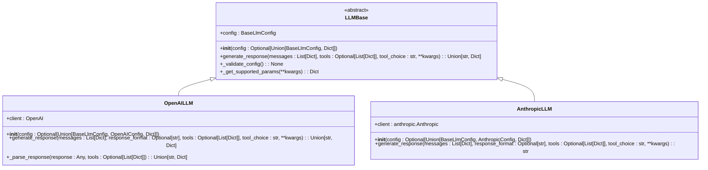

# LLM Provider Integration

<cite>
**Referenced Files in This Document**   
- [mem0/utils/factory.py](file://mem0/utils/factory.py)
- [mem0/llms/base.py](file://mem0/llms/base.py)
- [mem0/llms/openai.py](file://mem0/llms/openai.py)
- [mem0/llms/anthropic.py](file://mem0/llms/anthropic.py)
- [mem0/llms/openai_structured.py](file://mem0/llms/openai_structured.py)
- [mem0/configs/llms/base.py](file://mem0/configs/llms/base.py)
- [mem0/configs/llms/openai.py](file://mem0/configs/llms/openai.py)
- [mem0/configs/llms/anthropic.py](file://mem0/configs/llms/anthropic.py)
- [mem0/llms/azure_openai.py](file://mem0/llms/azure_openai.py)
- [mem0/llms/groq.py](file://mem0/llms/groq.py)
</cite>

## Table of Contents
1. [Introduction](#introduction)
2. [LlmFactory Implementation](#llmfactory-implementation)
3. [LLM Provider Registration](#llm-provider-registration)
4. [Creating Custom LLM Providers](#creating-custom-llm-providers)
5. [Configuration Management](#configuration-management)
6. [Structured Output Handling](#structured-output-handling)
7. [Testing Considerations](#testing-considerations)
8. [Base URL Configuration](#base-url-configuration)
9. [Conclusion](#conclusion)

## Introduction
The Mem0 framework provides a flexible and extensible architecture for integrating various Large Language Model (LLM) providers. This document details the implementation of the LlmFactory class and the process of creating and registering custom LLM providers. The system is designed to support multiple LLM providers through a consistent interface while allowing for provider-specific configurations and behaviors.

The integration system follows a factory pattern that decouples the creation of LLM instances from their usage, enabling easy extension and configuration. The architecture supports both standard and structured output scenarios, with comprehensive configuration options and testing capabilities.

## LlmFactory Implementation

The LlmFactory class is the central component for creating LLM instances in the Mem0 framework. It uses a provider-to-class mapping to instantiate the appropriate LLM provider based on the requested provider name.

```mermaid
classDiagram
class LlmFactory {
+provider_to_class : Dict[str, Tuple[str, Type]]
+create(provider_name : str, config : Optional[Union[BaseLlmConfig, Dict]], **kwargs) : LLMBase
+register_provider(name : str, class_path : str, config_class : Optional[Type])
+get_supported_providers() : List[str]
}
class LLMBase {
+config : BaseLlmConfig
+__init__(config : Optional[Union[BaseLlmConfig, Dict]])
+generate_response(messages : List[Dict], tools : Optional[List[Dict]], tool_choice : str, **kwargs) : Union[str, Dict]
+_validate_config() : None
+_get_supported_params(**kwargs) : Dict
+_is_reasoning_model(model : str) : bool
}
LlmFactory --> LLMBase : "creates"
LlmFactory --> "mem0.llms.*" : "instantiates"
```

**Diagram sources**
- [mem0/utils/factory.py](file://mem0/utils/factory.py#L23-L129)
- [mem0/llms/base.py](file://mem0/llms/base.py#L7-L132)

The LlmFactory maintains a `provider_to_class` dictionary that maps provider names to tuples containing the fully qualified class path and the corresponding configuration class. When creating an LLM instance, the factory:

1. Validates that the requested provider is supported
2. Retrieves the class path and configuration class from the mapping
3. Loads the LLM class dynamically using importlib
4. Handles configuration in three scenarios:
   - No config provided: creates a default config with kwargs
   - Dict config provided: merges with kwargs and instantiates config class
   - BaseLlmConfig provided: converts to provider-specific config if needed

The factory supports both provider-specific configuration classes and the generic BaseLlmConfig, providing flexibility for different integration scenarios.

**Section sources**
- [mem0/utils/factory.py](file://mem0/utils/factory.py#L23-L129)

## LLM Provider Registration

The LlmFactory provides a mechanism for registering custom LLM providers through the `register_provider` method. This allows for dynamic extension of the supported providers without modifying the core factory code.


**Diagram sources**
- [mem0/utils/factory.py](file://mem0/utils/factory.py#L106-L119)

The registration process involves:
- Provider name: A unique identifier for the provider
- Class path: The fully qualified path to the LLM implementation class
- Config class: The configuration class for the provider (defaults to BaseLlmConfig)

Once registered, the provider can be instantiated using the same interface as built-in providers. The factory automatically handles configuration creation and class instantiation.

The current implementation supports a wide range of providers including OpenAI, Anthropic, Groq, Together, AWS Bedrock, Azure OpenAI, and various open-source models through Ollama and vLLM. Each provider follows the same interface pattern while implementing provider-specific logic in the generate_response method.

**Section sources**
- [mem0/utils/factory.py](file://mem0/utils/factory.py#L106-L119)

## Creating Custom LLM Providers

To create a custom LLM provider, developers must extend the LLMBase abstract class and implement the generate_response method. The base class provides common functionality while allowing for provider-specific implementations.



**Diagram sources**
- [mem0/llms/base.py](file://mem0/llms/base.py#L7-L132)
- [mem0/llms/openai.py](file://mem0/llms/openai.py#L14-L148)
- [mem0/llms/anthropic.py](file://mem0/llms/anthropic.py#L14-L88)

The LLMBase class provides several key features:
- Configuration handling and validation
- Common parameter extraction through _get_supported_params
- Reasoning model detection through _is_reasoning_model
- Abstract generate_response method that must be implemented by subclasses

When implementing a custom provider, the following steps should be followed:

1. Create a new class that extends LLMBase
2. Implement the __init__ method to handle configuration and initialize the provider client
3. Implement the generate_response method to handle the actual API calls
4. Optionally override _validate_config for provider-specific validation

The OpenAI and Anthropic implementations serve as excellent examples of this pattern. The OpenAILLM class handles OpenAI-specific features like response parsing and tool calls, while the AnthropicLLM class manages Anthropic-specific requirements like system message separation.

**Section sources**
- [mem0/llms/base.py](file://mem0/llms/base.py#L7-L132)
- [mem0/llms/openai.py](file://mem0/llms/openai.py#L14-L148)
- [mem0/llms/anthropic.py](file://mem0/llms/anthropic.py#L14-L88)

## Configuration Management

The Mem0 framework uses a hierarchical configuration system with provider-specific configuration classes that inherit from BaseLlmConfig. This approach allows for both common parameters across all providers and provider-specific settings.


**Diagram sources**
- [mem0/configs/llms/base.py](file://mem0/configs/llms/base.py#L7-L63)
- [mem0/configs/llms/openai.py](file://mem0/configs/llms/openai.py#L6-L80)
- [mem0/configs/llms/anthropic.py](file://mem0/configs/llms/anthropic.py#L6-L57)

The BaseLlmConfig class defines common parameters that are applicable to most LLM providers:
- model: The model identifier to use
- temperature: Controls randomness of output
- api_key: API key for authentication
- max_tokens: Maximum tokens to generate
- top_p and top_k: Sampling parameters
- enable_vision and vision_details: Vision capabilities
- http_client: HTTP client configuration for proxies

Provider-specific configuration classes extend BaseLlmConfig and add additional parameters:
- OpenAIConfig includes settings for OpenAI and OpenRouter
- AnthropicConfig includes the anthropic_base_url parameter
- AzureOpenAIConfig includes Azure-specific parameters like deployment and endpoint

The configuration system supports three ways of providing configuration:
1. Direct instantiation of the config class
2. Dictionary-based configuration
3. Keyword arguments passed to the factory

The LlmFactory handles the conversion between these formats, ensuring consistent configuration across different usage patterns.

**Section sources**
- [mem0/configs/llms/base.py](file://mem0/configs/llms/base.py#L7-L63)
- [mem0/configs/llms/openai.py](file://mem0/configs/llms/openai.py#L6-L80)
- [mem0/configs/llms/anthropic.py](file://mem0/configs/llms/anthropic.py#L6-L57)

## Structured Output Handling

The Mem0 framework provides specialized support for structured output through the OpenAIStructuredLLM class. This implementation leverages OpenAI's beta chat completions parsing API to generate structured responses.


**Diagram sources**
- [mem0/llms/openai_structured.py](file://mem0/llms/openai_structured.py#L10-L53)
- [mem0/llms/openai.py](file://mem0/llms/openai.py#L14-L148)

The OpenAIStructuredLLM class is specifically designed for scenarios where structured output is required. Key features include:

1. Uses the beta chat completions parsing API endpoint
2. Simplified response handling that returns only the content
3. Default model optimized for structured output (gpt-4o-2024-08-06)
4. Direct integration with OpenAI's response format parameter

The implementation differs from the standard OpenAILLM in several ways:
- Uses `client.beta.chat.completions.parse` instead of `client.chat.completions.create`
- Returns only the message content rather than a structured response with tool calls
- Has a simpler parameter set focused on structured output
- Does not include the complex response parsing logic needed for tool calls

This specialized implementation allows for cleaner integration when the primary use case is generating structured data rather than engaging in tool-enabled conversations.

**Section sources**
- [mem0/llms/openai_structured.py](file://mem0/llms/openai_structured.py#L10-L53)

## Testing Considerations

The Mem0 framework includes comprehensive testing support for LLM providers, with mock-based testing patterns that verify both configuration and API interaction.


**Diagram sources**
- [mem0/llms/ollama.py](file://mem0/llms/ollama.py)
- [mem0/llms/vllm.py](file://mem0/llms/vllm.py)
- [mem0/llms/groq.py](file://mem0/llms/groq.py)

Testing strategies include:
- Mocking the underlying API client (e.g., OpenAI, anthropic, Groq)
- Verifying that the correct parameters are passed to the API
- Testing both tool-enabled and standard response scenarios
- Validating configuration handling and conversion

The test patterns follow a consistent structure:
1. Create a mock of the provider's client library
2. Configure the mock to return expected responses
3. Create the LLM instance with the mock client
4. Call generate_response with test messages
5. Verify that the API was called with correct parameters
6. Check that the response is properly processed

For providers like Ollama, vLLM, and Groq, tests verify that the LLMBase's parameter handling works correctly and that provider-specific requirements are met. The tests also ensure that the factory pattern correctly instantiates providers and handles configuration in various formats.

**Section sources**
- [mem0/llms/ollama.py](file://mem0/llms/ollama.py)
- [mem0/llms/vllm.py](file://mem0/llms/vllm.py)
- [mem0/llms/groq.py](file://mem0/llms/groq.py)

## Base URL Configuration

The Mem0 framework implements a three-tiered base URL configuration system that provides flexibility in API endpoint configuration. This system allows for provider-specific base URLs to be specified at multiple levels.


**Diagram sources**
- [mem0/llms/openai.py](file://mem0/llms/openai.py#L40-L51)
- [mem0/llms/anthropic.py](file://mem0/llms/anthropic.py#L40-L41)
- [mem0/llms/azure_openai.py](file://mem0/llms/azure_openai.py#L43-L46)

The base URL resolution follows this priority order:
1. Configuration object: The base URL specified in the provider's configuration class
2. Environment variable: The URL specified in environment variables
3. Default URL: The hardcoded default URL for the provider

For example, in the OpenAILLM implementation:
- The `openai_base_url` parameter in OpenAIConfig takes highest precedence
- If not specified, it checks for `OPENAI_BASE_URL` environment variable
- If neither is set, it defaults to "https://api.openai.com/v1"

Similarly, the AnthropicLLM checks for:
- `anthropic_base_url` in the configuration
- No specific environment variable (uses default)
- Defaults to the standard Anthropic API endpoint

The AzureOpenAILLM implementation demonstrates a more complex configuration with multiple Azure-specific parameters that can be set via configuration, environment variables, or defaults.

This three-tiered approach provides maximum flexibility, allowing users to:
- Set defaults in code
- Override via environment variables (useful for different deployment environments)
- Specify per-instance configuration (useful for testing or multi-tenant scenarios)

**Section sources**
- [mem0/llms/openai.py](file://mem0/llms/openai.py#L40-L51)
- [mem0/llms/anthropic.py](file://mem0/llms/anthropic.py#L40-L41)
- [mem0/llms/azure_openai.py](file://mem0/llms/azure_openai.py#L43-L46)

## Conclusion
The LLM provider integration system in Mem0 provides a robust, extensible framework for working with multiple LLM providers. The LlmFactory class serves as the central component, using a provider-to-class mapping to instantiate the appropriate LLM implementation based on the requested provider.

Key features of the system include:
- Flexible factory pattern for LLM instantiation
- Support for both provider-specific and generic configurations
- Easy registration of custom providers
- Comprehensive configuration management with three-tiered base URL resolution
- Specialized support for structured output scenarios
- Consistent testing patterns across providers

The architecture follows sound object-oriented principles, with a clear separation of concerns between the factory, base classes, and provider implementations. The LLMBase abstract class provides common functionality while allowing for provider-specific behaviors in the generate_response method.

Developers can extend the system by creating new provider classes that extend LLMBase and registering them with the factory. The configuration system supports both common parameters across providers and provider-specific settings, ensuring flexibility while maintaining consistency.

This integration approach enables Mem0 to support a wide range of LLM providers while providing a consistent interface for applications, making it easy to switch between providers or support multiple providers simultaneously.

**Section sources**
- [mem0/utils/factory.py](file://mem0/utils/factory.py)
- [mem0/llms/base.py](file://mem0/llms/base.py)
- [mem0/llms/openai.py](file://mem0/llms/openai.py)
- [mem0/llms/anthropic.py](file://mem0/llms/anthropic.py)