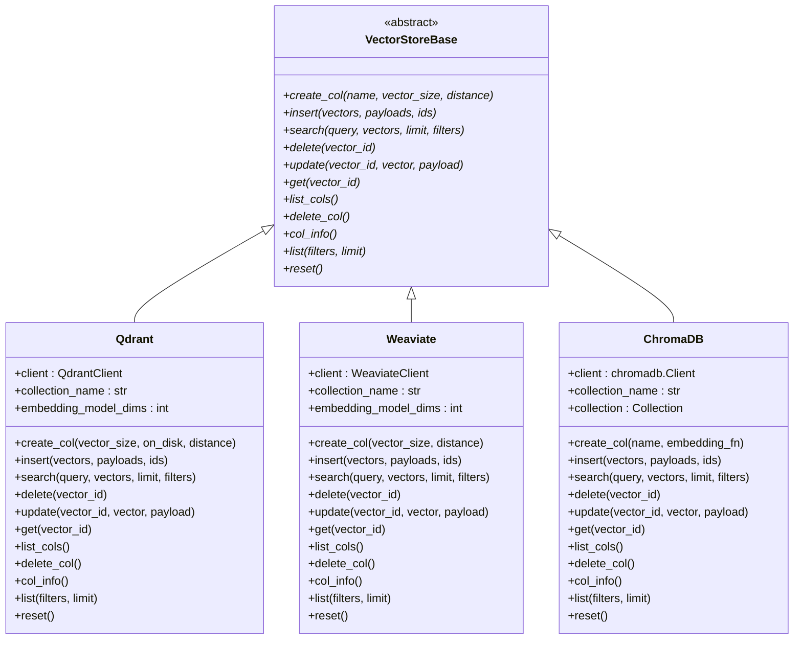
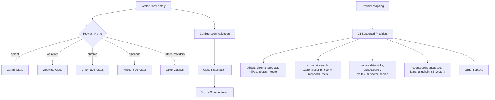
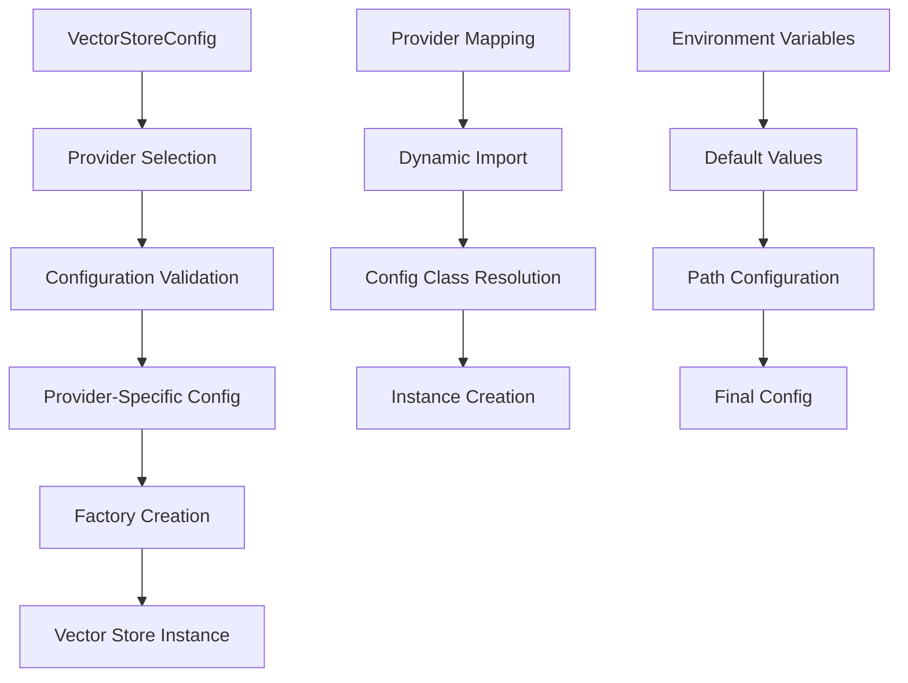

# Vector Store Integration

<cite>
**Referenced Files in This Document**
- [base.py](file://mem0/vector_stores/base.py)
- [factory.py](file://mem0/utils/factory.py)
- [qdrant.py](file://mem0/vector_stores/qdrant.py)
- [weaviate.py](file://mem0/vector_stores/weaviate.py)
- [chroma.py](file://mem0/vector_stores/chroma.py)
- [pinecone.py](file://mem0/vector_stores/pinecone.py)
- [configs.py](file://mem0/vector_stores/configs.py)
- [test_qdrant.py](file://tests/vector_stores/test_qdrant.py)
- [test_weaviate.py](file://tests/vector_stores/test_weaviate.py)
</cite>

## Table of Contents
1. [Introduction](#introduction)
2. [VectorStoreBase Abstract Class](#vectorstorebase-abstract-class)
3. [VectorStoreFactory Implementation](#vectorstorefactory-implementation)
4. [Supported Vector Databases](#supported-vector-databases)
5. [Configuration Management](#configuration-management)
6. [Implementation Examples](#implementation-examples)
7. [Testing Considerations](#testing-considerations)
8. [Custom Vector Store Implementation](#custom-vector-store-implementation)
9. [Edge Cases and Best Practices](#edge-cases-and-best-practices)
10. [Troubleshooting Guide](#troubleshooting-guide)

## Introduction

Mem0's vector store integration provides a unified abstraction layer for interacting with various vector databases. This system enables seamless switching between different vector storage solutions while maintaining consistent functionality across all providers. The architecture follows a factory pattern with an abstract base class that defines the standard interface for all vector store implementations.

The vector store system supports 21 different vector databases, ranging from cloud-native solutions like Weaviate and Qdrant to traditional databases like PostgreSQL with pgvector extension. Each implementation handles provider-specific configurations, authentication, and optimization strategies while adhering to the common interface defined by VectorStoreBase.

## VectorStoreBase Abstract Class

The VectorStoreBase class serves as the foundation for all vector store implementations in Mem0. It defines a comprehensive set of abstract methods that must be implemented by concrete vector store classes.



**Diagram sources**
- [base.py](file://mem0/vector_stores/base.py#L4-L58)
- [qdrant.py](file://mem0/vector_stores/qdrant.py#L22-L271)
- [weaviate.py](file://mem0/vector_stores/weaviate.py#L31-L344)
- [chroma.py](file://mem0/vector_stores/chroma.py#L23-L268)

### Core Methods Overview

The VectorStoreBase defines nine essential methods that form the complete CRUD interface for vector operations:

| Method | Purpose | Parameters | Return Type |
|--------|---------|------------|-------------|
| `create_col` | Creates a new collection/index | `name`, `vector_size`, `distance` | None |
| `insert` | Adds vectors to the collection | `vectors`, `payloads`, `ids` | None |
| `search` | Performs similarity search | `query`, `vectors`, `limit`, `filters` | List of results |
| `delete` | Removes a vector by ID | `vector_id` | None |
| `update` | Modifies vector and/or payload | `vector_id`, `vector`, `payload` | None |
| `get` | Retrieves vector by ID | `vector_id` | Single result or None |
| `list_cols` | Lists all collections | None | Collection list |
| `delete_col` | Removes a collection | None | None |
| `col_info` | Gets collection metadata | None | Collection info |
| `list` | Lists all vectors with filtering | `filters`, `limit` | Results with count |
| `reset` | Recreates collection | None | None |

**Section sources**
- [base.py](file://mem0/vector_stores/base.py#L4-L58)

## VectorStoreFactory Implementation

The VectorStoreFactory manages the instantiation and configuration of vector store providers. It maintains a mapping between provider names and their corresponding implementation classes, enabling dynamic selection and creation of vector stores.



**Diagram sources**
- [factory.py](file://mem0/utils/factory.py#L160-L183)

### Provider-to-Class Mapping

The factory maintains a comprehensive mapping of 21 supported vector database providers:

| Provider | Implementation Class | Description |
|----------|---------------------|-------------|
| `qdrant` | `mem0.vector_stores.qdrant.Qdrant` | Qdrant vector database |
| `chroma` | `mem0.vector_stores.chroma.ChromaDB` | ChromaDB vector store |
| `pgvector` | `mem0.vector_stores.pgvector.PGVector` | PostgreSQL with pgvector extension |
| `milvus` | `mem0.vector_stores.milvus.MilvusDB` | Milvus vector database |
| `upstash_vector` | `mem0.vector_stores.upstash_vector.UpstashVector` | Upstash vector database |
| `azure_ai_search` | `mem0.vector_stores.azure_ai_search.AzureAISearch` | Azure AI Search |
| `azure_mysql` | `mem0.vector_stores.azure_mysql.AzureMySQL` | Azure MySQL with vector support |
| `pinecone` | `mem0.vector_stores.pinecone.PineconeDB` | Pinecone vector database |
| `mongodb` | `mem0.vector_stores.mongodb.MongoDB` | MongoDB with vector search |
| `redis` | `mem0.vector_stores.redis.RedisDB` | Redis with RediSearch |
| `valkey` | `mem0.vector_stores.valkey.ValkeyDB` | Valkey vector database |
| `databricks` | `mem0.vector_stores.databricks.Databricks` | Databricks vector search |
| `elasticsearch` | `mem0.vector_stores.elasticsearch.ElasticsearchDB` | Elasticsearch vector search |
| `vertex_ai_vector_search` | `mem0.vector_stores.vertex_ai_vector_search.GoogleMatchingEngine` | Google Vertex AI Matching Engine |
| `opensearch` | `mem0.vector_stores.opensearch.OpenSearchDB` | OpenSearch vector search |
| `supabase` | `mem0.vector_stores.supabase.Supabase` | Supabase vector search |
| `weaviate` | `mem0.vector_stores.weaviate.Weaviate` | Weaviate vector database |
| `faiss` | `mem0.vector_stores.faiss.FAISS` | FAISS vector index |
| `langchain` | `mem0.vector_stores.langchain.Langchain` | LangChain vector store |
| `s3_vectors` | `mem0.vector_stores.s3_vectors.S3Vectors` | S3-based vector storage |
| `baidu` | `mem0.vector_stores.baidu.BaiduDB` | Baidu vector database |
| `neptune` | `mem0.vector_stores.neptune_analytics.NeptuneAnalyticsVector` | Amazon Neptune Analytics |

**Section sources**
- [factory.py](file://mem0/utils/factory.py#L160-L183)

## Supported Vector Databases

Mem0 supports a diverse ecosystem of vector databases, each optimized for different use cases and deployment scenarios. The following sections provide detailed coverage of the most prominent implementations.

### Qdrant Implementation

Qdrant is a cloud-native vector database known for its high performance and advanced filtering capabilities. The Qdrant implementation demonstrates sophisticated filtering mechanisms and payload indexing.

Key features:
- Advanced payload filtering with automatic index creation
- Support for multiple distance metrics (Cosine, Euclidean, Dot)
- Persistent storage options with on-disk vectors
- Automatic payload index creation for common filter fields
- Comprehensive collection management

**Section sources**
- [qdrant.py](file://mem0/vector_stores/qdrant.py#L22-L271)

### Weaviate Implementation

Weaviate provides a GraphQL-based vector database with native machine learning capabilities. The implementation showcases hybrid search combining vector and keyword search.

Key features:
- Hybrid search combining vector and text search
- Native machine learning capabilities
- Schema-first approach with property definitions
- Automatic UUID generation and validation
- Batch insertion with configurable batch sizes

**Section sources**
- [weaviate.py](file://mem0/vector_stores/weaviate.py#L31-L344)

### ChromaDB Implementation

ChromaDB offers a simple, lightweight vector database suitable for development and small-scale production deployments. The implementation emphasizes ease of use and local deployment flexibility.

Key features:
- Local and server deployment options
- ChromaDB Cloud integration
- Automatic collection creation and management
- Flexible where clause generation for filtering
- Built-in telemetry control

**Section sources**
- [chroma.py](file://mem0/vector_stores/chroma.py#L23-L268)

### Pinecone Implementation

Pinecone specializes in managed vector search with advanced features like hybrid search and serverless deployments. The implementation demonstrates enterprise-grade vector search capabilities.

Key features:
- Hybrid search with sparse vectors
- Serverless and pod-based deployment options
- Automatic batch processing for large datasets
- Namespace support for multi-tenancy
- Sparse vector encoding for text search

**Section sources**
- [pinecone.py](file://mem0/vector_stores/pinecone.py#L25-L383)

## Configuration Management

Vector store configuration in Mem0 follows a structured approach using Pydantic models and factory patterns. The configuration system ensures type safety and provides sensible defaults for all supported providers.



**Diagram sources**
- [configs.py](file://mem0/vector_stores/configs.py#L6-L65)

### Configuration Structure

The VectorStoreConfig class provides a unified interface for configuring all vector store providers:

| Field | Type | Description | Default |
|-------|------|-------------|---------|
| `provider` | `str` | Provider identifier | `"qdrant"` |
| `config` | `Optional[Dict]` | Provider-specific configuration | `None` |

The configuration system automatically resolves provider-specific configuration classes and validates input parameters. It supports environment variable fallbacks and provides default values for common parameters like database paths.

**Section sources**
- [configs.py](file://mem0/vector_stores/configs.py#L6-L65)

## Implementation Examples

### Basic Vector Store Setup

Here's how to create and configure a vector store instance:

```python
# Example configuration for Qdrant
config = {
    "provider": "qdrant",
    "config": {
        "collection_name": "memories",
        "embedding_model_dims": 768,
        "host": "localhost",
        "port": 6333,
        "on_disk": True
    }
}

# Create vector store instance
from mem0.utils.factory import VectorStoreFactory
vector_store = VectorStoreFactory.create("qdrant", config)
```

### Advanced Configuration with Filters

```python
# Example with filtering capabilities
filters = {
    "user_id": "user123",
    "agent_id": "agent456",
    "timestamp": {"gte": 1640995200, "lte": 1641081600}
}

# Perform filtered search
results = vector_store.search(
    query_vector,
    vectors=[query_vector],
    limit=10,
    filters=filters
)
```

**Section sources**
- [factory.py](file://mem0/utils/factory.py#L185-L193)

## Testing Considerations

Testing vector store implementations requires careful consideration of mocking strategies, edge cases, and provider-specific behaviors. The test suite demonstrates comprehensive coverage of all major functionality areas.

### Test Coverage Areas

The vector store test implementations cover several critical areas:

1. **Basic CRUD Operations**: Insert, search, update, delete, and get operations
2. **Filtering Capabilities**: Single filter, multiple filters, and range queries
3. **Collection Management**: Creation, deletion, listing, and information retrieval
4. **Error Handling**: Edge cases, invalid inputs, and network failures
5. **Performance Testing**: Large dataset operations and batch processing

### Mock Strategies

Vector store tests employ sophisticated mocking strategies to isolate functionality:

```python
# Example from Qdrant tests
def test_search_with_filters(self):
    """Test search with agent_id and run_id filters."""
    vectors = [[0.1, 0.2]]
    mock_point = MagicMock(
        id=str(uuid.uuid4()), 
        score=0.95, 
        payload={"user_id": "alice", "agent_id": "agent1", "run_id": "run1"}
    )
    self.client_mock.query_points.return_value = MagicMock(points=[mock_point])
    
    filters = {"user_id": "alice", "agent_id": "agent1", "run_id": "run1"}
    results = self.qdrant.search(query="", vectors=vectors, limit=1, filters=filters)
    
    # Verify filter construction and query execution
    self.client_mock.query_points.assert_called_once()
    call_args = self.client_mock.query_points.call_args[1]
    query_filter = call_args["query_filter"]
    self.assertIsInstance(query_filter, Filter)
    self.assertEqual(len(query_filter.must), 3)  # user_id, agent_id, run_id
```

**Section sources**
- [test_qdrant.py](file://tests/vector_stores/test_qdrant.py#L73-L102)
- [test_weaviate.py](file://tests/vector_stores/test_weaviate.py#L121-L146)

## Custom Vector Store Implementation

Creating a custom vector store implementation involves extending the VectorStoreBase class and implementing all required abstract methods. Here's the step-by-step process:

### Step 1: Define the Implementation Class

```python
from mem0.vector_stores.base import VectorStoreBase

class CustomVectorStore(VectorStoreBase):
    def __init__(self, collection_name: str, **kwargs):
        # Initialize connection and configuration
        pass
    
    def create_col(self, name, vector_size, distance):
        # Create collection with specified parameters
        pass
    
    def insert(self, vectors, payloads=None, ids=None):
        # Insert vectors with optional payloads and IDs
        pass
    
    def search(self, query, vectors, limit=5, filters=None):
        # Perform similarity search with optional filtering
        pass
    
    def delete(self, vector_id):
        # Remove vector by ID
        pass
    
    def update(self, vector_id, vector=None, payload=None):
        # Update vector and/or payload
        pass
    
    def get(self, vector_id):
        # Retrieve vector by ID
        pass
    
    def list_cols(self):
        # List all collections
        pass
    
    def delete_col(self):
        # Delete collection
        pass
    
    def col_info(self):
        # Get collection information
        pass
    
    def list(self, filters=None, limit=None):
        # List all vectors with optional filtering
        pass
    
    def reset(self):
        # Reset collection by deleting and recreating
        pass
```

### Step 2: Register with Factory

Add the custom implementation to the factory provider mapping:

```python
from mem0.utils.factory import VectorStoreFactory

VectorStoreFactory.provider_to_class["custom_provider"] = \
    "path.to.custom.CustomVectorStore"
```

### Step 3: Configuration Support

Create a configuration class for your custom provider:

```python
from pydantic import BaseModel

class CustomVectorStoreConfig(BaseModel):
    # Define configuration parameters
    host: str = "localhost"
    port: int = 8080
    api_key: Optional[str] = None
    # Add other provider-specific parameters
```

**Section sources**
- [base.py](file://mem0/vector_stores/base.py#L4-L58)
- [factory.py](file://mem0/utils/factory.py#L160-L183)

## Edge Cases and Best Practices

### Partial Updates

Vector stores handle partial updates differently based on provider capabilities:

- **Qdrant**: Supports updating individual fields while preserving others
- **Weaviate**: Allows selective field updates with automatic UUID handling
- **ChromaDB**: Requires complete payload replacement for updates
- **Pinecone**: Supports sparse updates with optional vector or metadata changes

### Filtered Searches

Different vector stores implement filtering with varying capabilities:

| Provider | Filter Types | Performance | Use Cases |
|----------|--------------|-------------|-----------|
| Qdrant | Exact match, range, nested | High | Production systems |
| Weaviate | Property-based, nested | Medium | Semantic search |
| ChromaDB | Exact match, logical AND | Medium | Development |
| Pinecone | Metadata, vector similarity | High | Enterprise |

### Error Handling Patterns

Robust vector store implementations should handle common error scenarios:

1. **Connection Failures**: Implement retry logic with exponential backoff
2. **Rate Limiting**: Respect provider rate limits and implement queuing
3. **Data Corruption**: Validate vector dimensions and payload structures
4. **Network Issues**: Provide graceful degradation and offline caching

### Performance Optimization

Key optimization strategies for vector store implementations:

1. **Batch Operations**: Group multiple operations for improved throughput
2. **Index Management**: Create appropriate indexes for frequently queried fields
3. **Connection Pooling**: Reuse connections to reduce overhead
4. **Caching**: Implement intelligent caching for frequently accessed data
5. **Async Operations**: Use asynchronous APIs where supported

**Section sources**
- [qdrant.py](file://mem0/vector_stores/qdrant.py#L141-L160)
- [weaviate.py](file://mem0/vector_stores/weaviate.py#L236-L257)
- [chroma.py](file://mem0/vector_stores/chroma.py#L172-L186)

## Troubleshooting Guide

### Common Issues and Solutions

| Issue | Symptoms | Solution |
|-------|----------|----------|
| Connection Failures | Timeout errors, authentication failures | Verify credentials, check network connectivity |
| Dimension Mismatches | Vector shape errors, search failures | Ensure embedding model dimensions match |
| Filter Performance | Slow search queries | Create appropriate indexes, optimize filter complexity |
| Memory Issues | Out of memory errors | Implement pagination, reduce batch sizes |
| Rate Limiting | 429 HTTP errors | Implement exponential backoff, reduce request frequency |

### Debugging Techniques

1. **Enable Logging**: Set appropriate log levels for detailed operation tracking
2. **Monitor Metrics**: Track query performance and resource utilization
3. **Validate Data**: Ensure vector dimensions and payload structures are correct
4. **Test Connectivity**: Verify network connectivity and authentication
5. **Review Configuration**: Double-check provider-specific settings

### Performance Monitoring

Key metrics to monitor for vector store performance:

- **Query Latency**: Time taken for search operations
- **Throughput**: Number of operations per second
- **Memory Usage**: Resource consumption patterns
- **Error Rates**: Frequency of failed operations
- **Cache Hit Rates**: Effectiveness of caching strategies

**Section sources**
- [test_qdrant.py](file://tests/vector_stores/test_qdrant.py#L138-L187)
- [test_weaviate.py](file://tests/vector_stores/test_weaviate.py#L148-L171)