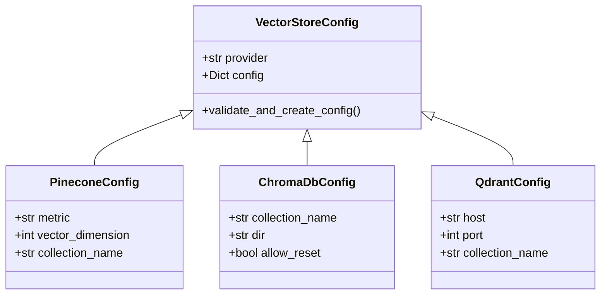
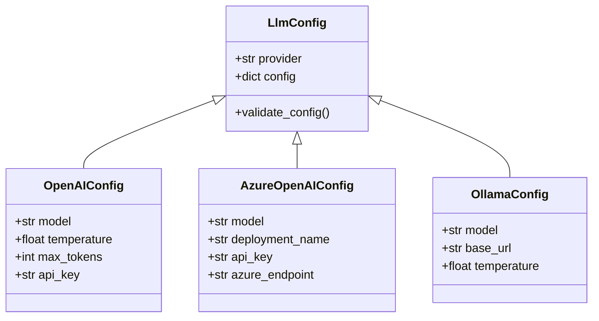
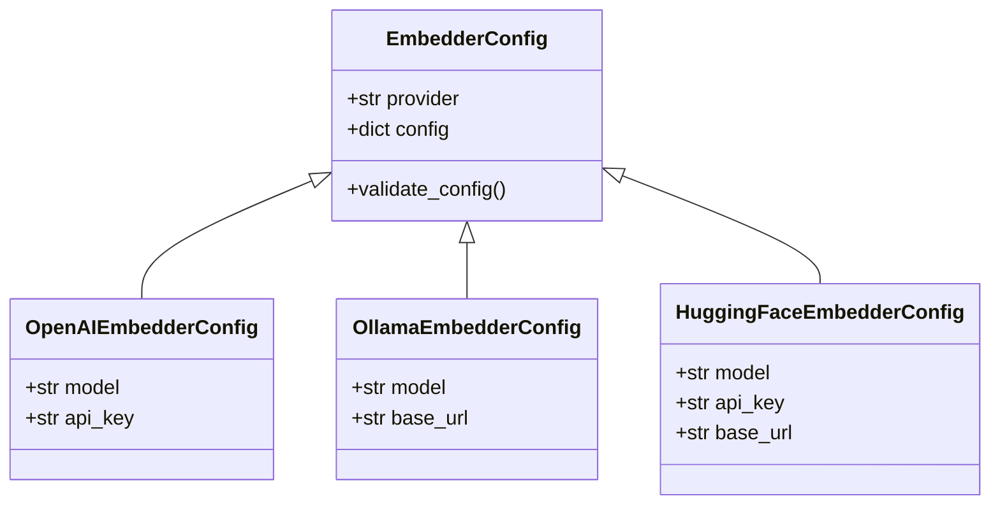
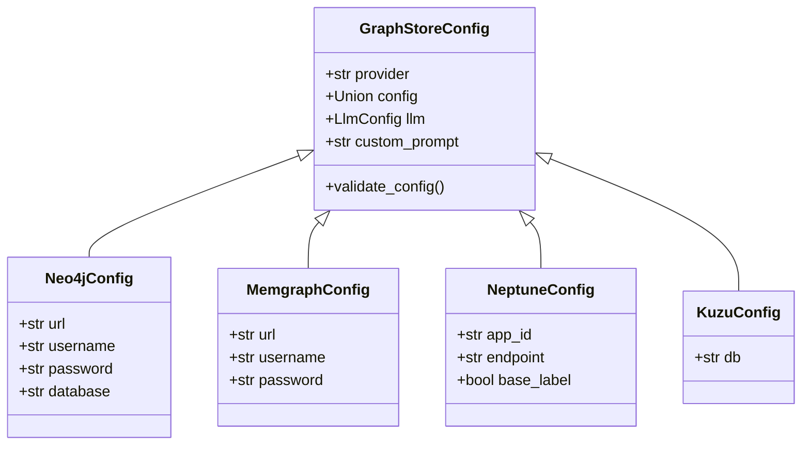
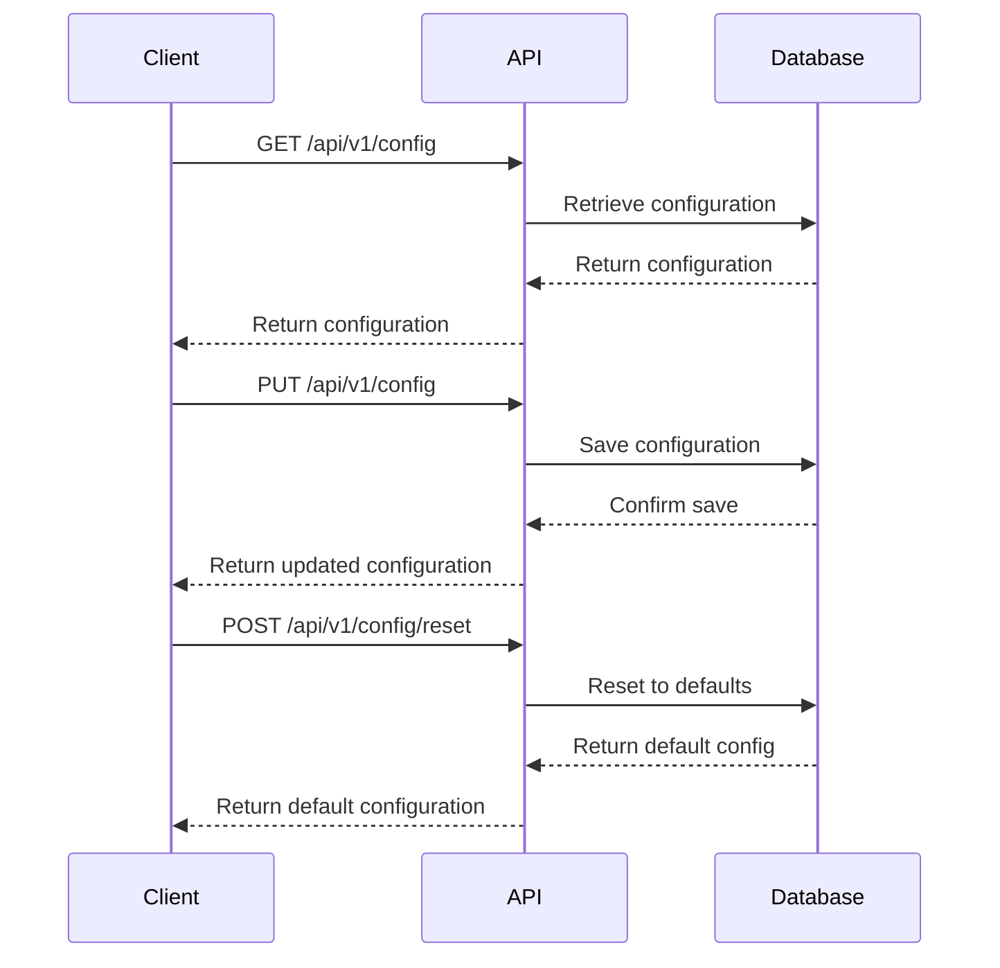

# Configuration

<cite>
**Referenced Files in This Document**   
- [base.py](file://mem0/configs/base.py)
- [vector_stores/configs.py](file://mem0/vector_stores/configs.py)
- [llms/configs.py](file://mem0/llms/configs.py)
- [embeddings/configs.py](file://mem0/embeddings/configs.py)
- [graphs/configs.py](file://mem0/graphs/configs.py)
- [pinecone.yaml](file://embedchain/configs/pinecone.yaml)
- [chroma.yaml](file://embedchain/configs/chroma.yaml)
- [azure_openai.yaml](file://embedchain/configs/azure_openai.yaml)
- [ollama.yaml](file://embedchain/configs/ollama.yaml)
- [useConfig.ts](file://openmemory/ui/hooks/useConfig.ts)
- [config.py](file://openmemory/api/app/routers/config.py)
- [memory.py](file://openmemory/api/app/utils/memory.py)
</cite>

## Table of Contents
1. [Configuration Hierarchy](#configuration-hierarchy)
2. [Vector Store Configuration](#vector-store-configuration)
3. [LLM Configuration](#llm-configuration)
4. [Embedding Model Configuration](#embedding-model-configuration)
5. [Graph Store Setup](#graph-store-setup)
6. [Environment Variables and Configuration Patterns](#environment-variables-and-configuration-patterns)
7. [Common Configuration Issues and Best Practices](#common-configuration-issues-and-best-practices)

## Configuration Hierarchy

The configuration system follows a hierarchical structure with global, per-operation, and provider-specific settings. The core configuration is defined in the `MemoryConfig` class, which contains four main components: vector store, LLM, embedder, and graph store configurations. Each component can be configured independently, allowing for flexible setup across different environments and use cases.

Global configuration settings are defined at the top level of the configuration object, while provider-specific settings are nested within the `config` field of each component. This hierarchical approach enables users to override default settings for specific providers while maintaining consistent global behavior.

**Section sources**
- [base.py](file://mem0/configs/base.py#L29-L63)

## Vector Store Configuration

The system supports multiple vector store providers including Qdrant, Chroma, Pinecone, and others. Each provider has its own configuration schema that extends the base `VectorStoreConfig` class. The configuration includes provider selection and provider-specific parameters.

For Pinecone, the configuration includes metric type, vector dimension, and collection name:
```yaml
vectordb:
  provider: pinecone
  config:
    metric: cosine
    vector_dimension: 1536
    collection_name: my-pinecone-index
```

For Chroma, additional parameters like directory path and reset permissions can be specified:
```yaml
vectordb:
  provider: chroma
  config:
    collection_name: 'my-app'
    dir: db
    allow_reset: true
```

Qdrant configuration supports host, port, and collection name settings, with environment variables taking precedence when available.



**Diagram sources**
- [vector_stores/configs.py](file://mem0/vector_stores/configs.py#L6-L66)
- [pinecone.yaml](file://embedchain/configs/pinecone.yaml#L1-L7)
- [chroma.yaml](file://embedchain/configs/chroma.yaml#L14-L20)

**Section sources**
- [vector_stores/configs.py](file://mem0/vector_stores/configs.py#L6-L66)
- [pinecone.yaml](file://embedchain/configs/pinecone.yaml)
- [chroma.yaml](file://embedchain/configs/chroma.yaml)

## LLM Configuration

The system supports multiple LLM providers including OpenAI, Anthropic, Azure, and self-hosted options like Ollama. The LLM configuration is managed through the `LlmConfig` class, which validates provider support and ensures proper configuration.

For OpenAI and Azure OpenAI, the configuration includes model specification, temperature, and token limits:
```yaml
llm:
  provider: azure_openai
  config:
    model: gpt-35-turbo
    deployment_name: your_llm_deployment_name
    temperature: 0.5
    max_tokens: 1000
```

For self-hosted models like Ollama, the base URL and model name are specified:
```yaml
llm:
  provider: ollama
  config:
    model: 'llama2'
    temperature: 0.5
    base_url: http://localhost:11434
```

The LLM factory system automatically validates configurations and creates appropriate instances based on the provider specification.



**Diagram sources**
- [llms/configs.py](file://mem0/llms/configs.py#L6-L35)
- [azure_openai.yaml](file://embedchain/configs/azure_openai.yaml#L5-L13)
- [ollama.yaml](file://embedchain/configs/ollama.yaml#L1-L8)

**Section sources**
- [llms/configs.py](file://mem0/llms/configs.py#L6-L35)
- [azure_openai.yaml](file://embedchain/configs/azure_openai.yaml)
- [ollama.yaml](file://embedchain/configs/ollama.yaml)

## Embedding Model Configuration

Embedding model configuration follows the same pattern as LLM configuration, with provider-specific settings nested within the base `EmbedderConfig` class. Supported providers include OpenAI, Hugging Face, Vertex AI, and others.

The configuration system validates provider support and ensures that required parameters are present. For cloud providers, API keys and endpoints can be specified, while for self-hosted options like Ollama, the base URL is required.



**Diagram sources**
- [embeddings/configs.py](file://mem0/embeddings/configs.py#L6-L32)

**Section sources**
- [embeddings/configs.py](file://mem0/embeddings/configs.py#L6-L32)

## Graph Store Setup

The graph store configuration supports multiple providers including Neo4j, Memgraph, Neptune, and Kuzu. Each provider has specific connection parameters that must be configured.

The `GraphStoreConfig` class manages provider selection and configuration validation. For Neo4j and Memgraph, URL, username, and password are required. For Neptune, the endpoint must follow a specific format indicating whether it's a Neptune DB or Analytics instance.



**Diagram sources**
- [graphs/configs.py](file://mem0/graphs/configs.py#L80-L106)

**Section sources**
- [graphs/configs.py](file://mem0/graphs/configs.py#L80-L106)

## Environment Variables and Configuration Patterns

The system supports configuration through both configuration files and environment variables. Environment variables take precedence over file-based configuration, allowing for easy environment-specific overrides.

Common environment variable patterns include:
- `CHROMA_HOST` and `CHROMA_PORT` for Chroma configuration
- `QDRANT_HOST` and `QDRANT_PORT` for Qdrant configuration
- `WEAVIATE_HOST` and `WEAVIATE_PORT` for Weaviate configuration
- `REDIS_URL` for Redis configuration

The configuration system automatically detects available environment variables and uses them to configure the appropriate vector store provider. This allows for seamless deployment across different environments without modifying configuration files.

Configuration can also be managed through API endpoints, with CRUD operations for reading, updating, and resetting configuration values. The configuration is stored in a database and can be accessed through REST endpoints.



**Diagram sources**
- [config.py](file://openmemory/api/app/routers/config.py#L132-L167)
- [memory.py](file://openmemory/api/app/utils/memory.py#L145-L174)
- [useConfig.ts](file://openmemory/ui/hooks/useConfig.ts#L52-L67)

**Section sources**
- [config.py](file://openmemory/api/app/routers/config.py#L132-L167)
- [memory.py](file://openmemory/api/app/utils/memory.py#L145-L174)
- [useConfig.ts](file://openmemory/ui/hooks/useConfig.ts#L52-L67)

## Common Configuration Issues and Best Practices

When configuring the system, several common issues may arise. For vector stores, ensure that the collection name is unique and that the vector dimension matches the embedding model's output dimension. For LLMs, verify that API keys are correctly set and that the specified models are available in your subscription.

Best practices for managing credentials securely include:
- Using environment variables instead of hardcoding credentials in configuration files
- Implementing secret management systems for production deployments
- Regularly rotating API keys and access credentials
- Using provider-specific authentication methods like Azure Managed Identities when available

For production deployments, consider the following:
- Use persistent vector stores like Pinecone or Chroma with remote storage instead of in-memory options
- Configure appropriate rate limiting and retry policies for LLM calls
- Monitor vector store performance and scale resources as needed
- Implement proper error handling and fallback mechanisms

Configuration validation occurs at multiple levels, from schema validation using Pydantic to runtime validation in factory classes. This ensures that invalid configurations are caught early and appropriate error messages are provided.

**Section sources**
- [base.py](file://mem0/configs/base.py)
- [vector_stores/configs.py](file://mem0/vector_stores/configs.py)
- [llms/configs.py](file://mem0/llms/configs.py)
- [embeddings/configs.py](file://mem0/embeddings/configs.py)
- [graphs/configs.py](file://mem0/graphs/configs.py)