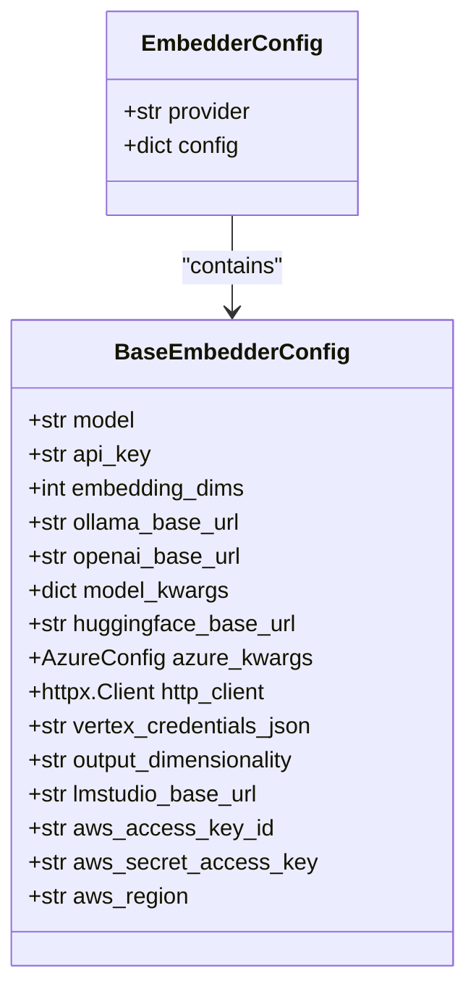
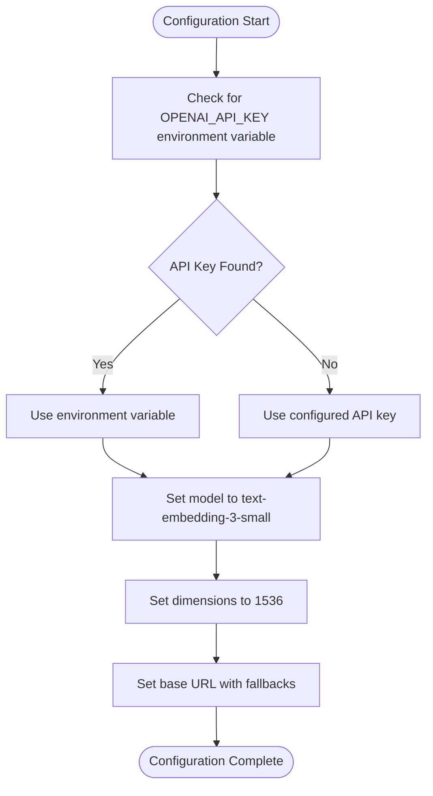
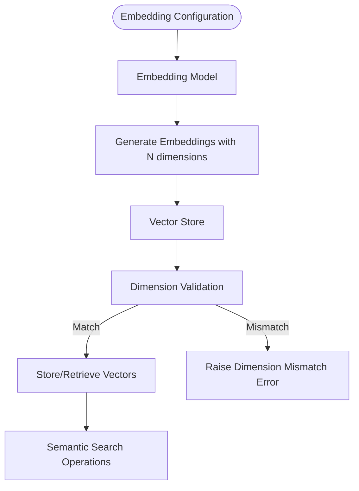
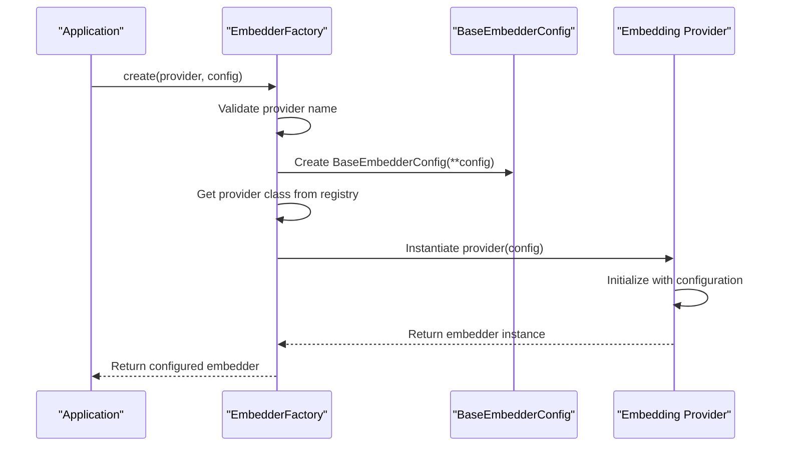

# Embedding Model Configuration

<cite>
**Referenced Files in This Document**   
- [base.py](file://mem0/configs/embeddings/base.py)
- [configs.py](file://mem0/embeddings/configs.py)
- [openai.py](file://mem0/embeddings/openai.py)
- [azure_openai.py](file://mem0/embeddings/azure_openai.py)
- [gemini.py](file://mem0/embeddings/gemini.py)
- [huggingface.py](file://mem0/embeddings/huggingface.py)
- [ollama.py](file://mem0/embeddings/ollama.py)
- [factory.py](file://mem0/utils/factory.py)
- [defaults.ts](file://mem0-ts/src/oss/src/config/defaults.ts)
</cite>

## Table of Contents
1. [Introduction](#introduction)
2. [Role of Embeddings in Semantic Memory](#role-of-embeddings-in-semantic-memory)
3. [Embedding Model Configuration Structure](#embedding-model-configuration-structure)
4. [Provider-Specific Configuration](#provider-specific-configuration)
5. [Embedding Dimensions and Vector Store Compatibility](#embedding-dimensions-and-vector-store-compatibility)
6. [Performance and Cost Considerations](#performance-and-cost-considerations)
7. [EmbedderFactory and Provider Instantiation](#embedderfactory-and-provider-instantiation)
8. [Best Practices and Troubleshooting](#best-practices-and-troubleshooting)

## Introduction

Embedding models play a crucial role in semantic memory systems by converting text into numerical representations that capture semantic meaning. These vector representations enable efficient similarity matching and retrieval operations in memory systems. This document provides comprehensive guidance on configuring embedding models from various providers including OpenAI, Azure, Google Gemini, Hugging Face, Ollama, and others. The configuration system supports flexible setup of embedding dimensions, API endpoints, authentication credentials, and provider-specific parameters to optimize performance, accuracy, and cost efficiency.

## Role of Embeddings in Semantic Memory

Embeddings serve as the foundation for semantic memory matching and retrieval by transforming text into high-dimensional vector representations that capture semantic meaning. In the mem0 system, embeddings enable the system to understand the conceptual similarity between different pieces of information rather than relying solely on keyword matching. When a user query is processed, it is converted into an embedding vector and compared against stored memory embeddings using similarity metrics like cosine similarity. This allows the system to retrieve relevant memories even when the exact words don't match, enabling more natural and context-aware interactions.

The embedding process involves several key steps: text preprocessing, vector generation through the embedding model, and storage in a vector database optimized for similarity search. Different embedding models vary in their ability to capture nuanced semantic relationships, with larger models generally providing more accurate representations at the cost of increased computational requirements. The choice of embedding model significantly impacts both the accuracy of memory retrieval and the overall system performance.

**Section sources**
- [base.py](file://mem0/embeddings/base.py#L7-L32)
- [openai.py](file://mem0/embeddings/openai.py#L34-L49)

## Embedding Model Configuration Structure

The embedding configuration system is built around a hierarchical structure that provides both default values and extensive customization options. The core configuration is defined in the `BaseEmbedderConfig` class, which serves as the foundation for all embedding providers. This configuration includes universal parameters such as model selection, API keys, embedding dimensions, and provider-specific settings.

The configuration structure supports environment variable fallbacks for sensitive information like API keys, allowing secure deployment across different environments. For example, the OpenAI embedding configuration will use the `OPENAI_API_KEY` environment variable if no explicit API key is provided. Similarly, Azure OpenAI configurations support both explicit API keys and Azure's DefaultAzureCredential for managed identity authentication.

Configuration parameters are organized into logical groups based on provider requirements. Common parameters include the model name, API endpoint URL, and embedding dimensions. Provider-specific parameters handle unique requirements, such as Azure's deployment configuration, Hugging Face's model kwargs, or Ollama's base URL. This modular approach allows for consistent configuration patterns while accommodating the specific needs of each embedding provider.

**Diagram sources**
- [base.py](file://mem0/configs/embeddings/base.py#L10-L111)
- [configs.py](file://mem0/embeddings/configs.py#L6-L31)

**Section sources**
- [base.py](file://mem0/configs/embeddings/base.py#L10-L111)
- [configs.py](file://mem0/embeddings/configs.py#L6-L31)

## Provider-Specific Configuration

### OpenAI Configuration

The OpenAI embedding configuration provides seamless integration with OpenAI's embedding models, with sensible defaults that minimize setup requirements. By default, the system uses the `text-embedding-3-small` model with 1536 dimensions, which offers an excellent balance of performance, accuracy, and cost. The configuration automatically detects API keys from the `OPENAI_API_KEY` environment variable, falling back to explicit configuration when provided.

**Diagram sources**
- [openai.py](file://mem0/embeddings/openai.py#L11-L50)

**Section sources**
- [openai.py](file://mem0/embeddings/openai.py#L11-L50)

### Azure OpenAI Configuration

Azure OpenAI configuration requires additional parameters to accommodate Azure's deployment model. The system supports both API key authentication and Azure's managed identity through DefaultAzureCredential. Key configuration parameters include the deployment name, endpoint URL, and API version, which can be specified directly or through environment variables prefixed with `EMBEDDING_`.

The configuration intelligently handles authentication by automatically switching to DefaultAzureCredential when no API key is provided or when a placeholder value is detected. This enables secure deployment in Azure environments without requiring explicit credential management. The system also supports proxy configuration through the `http_client_proxies` parameter for enterprise network requirements.

**Section sources**
- [azure_openai.py](file://mem0/embeddings/azure_openai.py#L13-L56)

### Google Gemini Configuration

The Google Gemini embedding configuration centers around the `models/text-embedding-004` model with a default dimensionality of 768. The configuration supports API key authentication through the `GOOGLE_API_KEY` environment variable or explicit configuration. A unique feature of the Gemini configuration is the `output_dimensionality` parameter, which allows users to specify reduced embedding dimensions for cost and performance optimization.

The system automatically handles the Google Generative AI client initialization and manages the embedding content configuration, including the ability to specify custom output dimensionality for the embeddings. This flexibility enables users to balance between embedding quality and storage/computation costs based on their specific use case requirements.

**Section sources**
- [gemini.py](file://mem0/embeddings/gemini.py#L11-L40)

### Hugging Face Configuration

Hugging Face embedding configuration offers two distinct modes of operation: local embedding generation using Sentence Transformers and remote inference through Hugging Face's Text Embeddings Inference (TEI) service. When no `huggingface_base_url` is provided, the system uses local Sentence Transformers with the default `multi-qa-MiniLM-L6-cos-v1` model, automatically determining the embedding dimensions from the model.

For remote inference, users can specify a Hugging Face TEI endpoint URL, enabling access to larger models and GPU acceleration without local resource requirements. The configuration also supports custom model kwargs for fine-tuning the Sentence Transformers behavior, such as pooling strategies and normalization options. This dual-mode approach provides flexibility between local privacy and performance versus cloud scalability.

**Section sources**
- [huggingface.py](file://mem0/embeddings/huggingface.py#L15-L42)

### Ollama Configuration

Ollama embedding configuration enables local, self-hosted embedding generation with automatic model management. The system defaults to the `nomic-embed-text` model with 512 dimensions and automatically ensures the specified model is available by pulling it from the Ollama registry if not already present locally. This eliminates manual model management and ensures consistent behavior across deployments.

The configuration requires the `ollama_base_url` parameter to connect to the Ollama server, with a default value that assumes Ollama is running on the same host. The system includes automatic dependency management, prompting users to install the Ollama Python package if not already available. This makes Ollama an excellent choice for offline or privacy-sensitive applications where data cannot leave the local environment.

**Section sources**
- [ollama.py](file://mem0/embeddings/ollama.py#L24-L54)

## Embedding Dimensions and Vector Store Compatibility

Embedding dimensions represent a critical configuration parameter that must be consistent across the embedding model and vector store components. The system automatically propagates dimension information from the embedding configuration to the vector store, ensuring compatibility and preventing runtime errors. When a dimension mismatch occurs, the system will raise a validation error during initialization rather than allowing inconsistent state.

The default dimension values vary by provider, reflecting the native output dimensions of their respective models: OpenAI (1536), Ollama (512), Gemini (768), and Hugging Face (384 for the default model). These defaults can be overridden in the configuration, but doing so may impact embedding quality as it typically involves dimensionality reduction.

Vector stores perform dimension validation during both insertion and search operations. For example, the Langchain vector store implementation checks that all vectors in a batch have the expected dimensionality before insertion, and validates query vector dimensions before search operations. This prevents silent failures that could lead to incorrect similarity results.

**Diagram sources**
- [langchain.ts](file://mem0-ts/src/oss/src/vector_stores/langchain.ts#L69-L77)
- [supabase.py](file://mem0/vector_stores/supabase.py#L81-L85)

**Section sources**
- [langchain.ts](file://mem0-ts/src/oss/src/vector_stores/langchain.ts#L69-L77)
- [supabase.py](file://mem0/vector_stores/supabase.py#L81-L85)

## Performance and Cost Considerations

Different embedding models present distinct performance and cost trade-offs that should guide selection based on application requirements. OpenAI's `text-embedding-3-small` offers excellent performance at a low cost, making it ideal for most applications. Larger models like `text-embedding-3-large` provide higher accuracy but at significantly increased cost and latency.

Self-hosted options like Ollama and local Hugging Face models eliminate per-token costs but require local computational resources. These are particularly cost-effective for high-volume applications or when data privacy requirements prevent cloud usage. The performance of local models depends heavily on available hardware, with GPU acceleration providing substantial speed improvements.

Cloud-based providers like Azure OpenAI and Google Gemini offer predictable pricing models but introduce network latency. The choice between regional endpoints can significantly impact latency, with closer geographic proximity reducing round-trip times. For latency-sensitive applications, local models or edge-optimized cloud endpoints may be preferable despite higher operational complexity.

Cost optimization strategies include using smaller dimension embeddings when full precision isn't required, batching multiple embedding requests, and implementing caching for frequently accessed content. The system's modular design allows easy switching between providers to find the optimal balance of cost, performance, and accuracy for specific use cases.

**Section sources**
- [openai.py](file://mem0/embeddings/openai.py#L15-L16)
- [ollama.py](file://mem0/embeddings/ollama.py#L28-L29)
- [gemini.py](file://mem0/embeddings/gemini.py#L16-L17)

## EmbedderFactory and Provider Instantiation

The EmbedderFactory class provides a unified interface for instantiating embedding providers based on configuration, implementing the factory pattern to decouple provider creation from the core application logic. The factory maintains a registry of provider classes mapped to their string identifiers, enabling dynamic instantiation without hard-coded dependencies.

When creating an embedder instance, the factory first validates the provider name against its registry, then instantiates the appropriate configuration class with the provided parameters. It then creates the embedder instance, passing the configuration object. This process ensures consistent initialization across all providers while allowing for provider-specific behavior.

The factory also handles special cases, such as the `upstash_vector` provider with embeddings enabled, which returns a `MockEmbeddings` instance. This flexibility allows the system to adapt to different deployment scenarios and requirements without modifying the core embedding interface.

**Diagram sources**
- [factory.py](file://mem0/utils/factory.py#L131-L157)

**Section sources**
- [factory.py](file://mem0/utils/factory.py#L131-L157)

## Best Practices and Troubleshooting

### Configuration Best Practices

1. **Environment Variables**: Use environment variables for sensitive credentials like API keys to enhance security and simplify deployment across environments.
2. **Dimension Consistency**: Ensure embedding dimensions match between the embedder configuration and vector store to prevent runtime errors.
3. **Provider Selection**: Choose providers based on latency, cost, and privacy requirements, considering local options for sensitive data.
4. **Model Selection**: Select embedding models appropriate for your use case, balancing accuracy needs with performance requirements.

### Common Configuration Issues

**Dimension Mismatches**: Occur when the embedding model's output dimensions don't match the vector store's expected dimensions. Resolve by ensuring consistent dimension configuration across components.

**Authentication Failures**: Typically caused by missing or incorrect API keys. Verify credentials and check for environment variable conflicts.

**Model Availability**: For Ollama and Hugging Face local models, ensure required models are downloaded and available before initialization.

**Network Connectivity**: For cloud providers, verify network access to API endpoints and configure proxies if required by your network environment.

The system's default configurations, as defined in `DEFAULT_MEMORY_CONFIG`, provide a solid starting point for most applications, using OpenAI's `text-embedding-3-small` model with 1536 dimensions and appropriate vector store settings. These defaults can be overridden through explicit configuration or environment variables to customize behavior for specific requirements.

**Section sources**
- [defaults.ts](file://mem0-ts/src/oss/src/config/defaults.ts#L3-L50)
- [base.py](file://mem0/configs/embeddings/base.py#L10-L111)