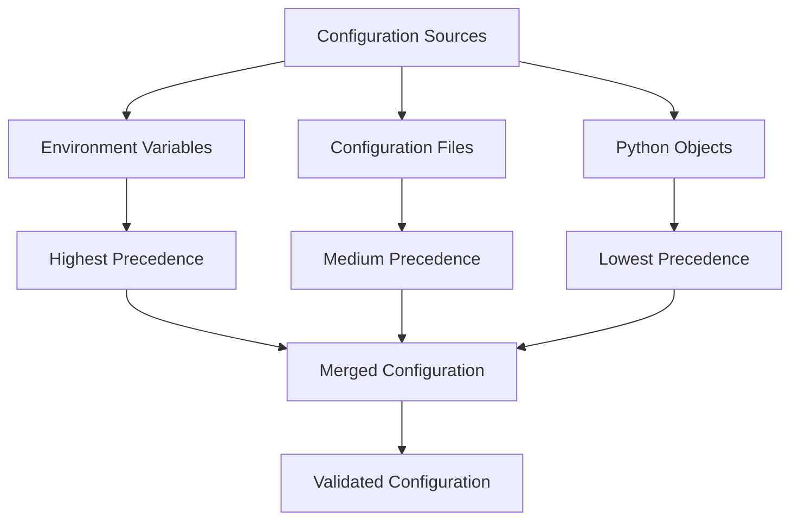
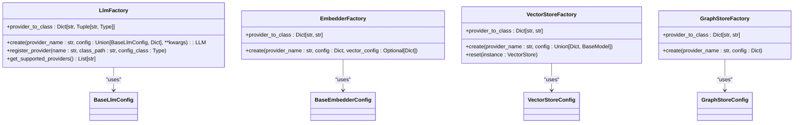

# Environment and Configuration Management

<cite>
**Referenced Files in This Document**   
- [base.py](file://mem0/configs/llms/base.py)
- [base.py](file://mem0/configs/embeddings/base.py)
- [base.py](file://mem0/configs/vector_stores/base.py)
- [base.py](file://mem0/configs/graphs/base.py)
- [base.py](file://mem0/configs/base.py)
- [enums.py](file://mem0/configs/enums.py)
- [prompts.py](file://mem0/configs/prompts.py)
- [factory.py](file://mem0/utils/factory.py)
- [azure_openai.yaml](file://embedchain/configs/azure_openai.yaml)
- [app.py](file://embedchain/embedchain/app.py)
- [mem0_config.py](file://embedchain/embedchain/config/mem0_config.py)
- [app_config.py](file://embedchain/embedchain/config/app_config.py)
- [add_config.py](file://embedchain/embedchain/config/add_config.py)
</cite>

## Table of Contents
1. [Configuration Hierarchy](#configuration-hierarchy)
2. [Configuration Sources](#configuration-sources)
3. [Pydantic Models for Validation](#pydantic-models-for-validation)
4. [Enums for Allowed Values](#enums-for-allowed-values)
5. [Secure Handling of Sensitive Credentials](#secure-handling-of-sensitive-credentials)
6. [Configuration Composition and Merging](#configuration-composition-and-merging)
7. [Configuration Validation and Debugging](#configuration-validation-and-debugging)
8. [Factory Integration for Pluggable Architecture](#factory-integration-for-pluggable-architecture)

## Configuration Hierarchy

The configuration system implements a hierarchical structure with multiple levels of configuration that cascade from global defaults to instance-specific settings and runtime overrides. At the foundation is the `MemoryConfig` class in `mem0/configs/base.py`, which serves as the root configuration object containing default values for all components. This base configuration establishes sensible defaults for vector stores, language models, embedders, and other system components.

The hierarchy allows for progressive specialization, where global defaults can be overridden at the instance level through configuration files or Python objects, and further modified at runtime through environment variables or direct API calls. This multi-layered approach ensures that applications can be easily configured for different environments (development, staging, production) while maintaining consistency in core functionality.

The configuration system follows a clear precedence order: environment variables take precedence over configuration files, which in turn override Python object configurations, with global defaults serving as the fallback for any unset values. This design enables flexible deployment scenarios where sensitive credentials can be securely managed through environment variables while structural configuration can be version-controlled in configuration files.

**Section sources**
- [base.py](file://mem0/configs/base.py#L29-L63)
- [base.py](file://mem0/configs/llms/base.py#L16-L63)
- [base.py](file://mem0/configs/embeddings/base.py#L16-L111)

## Configuration Sources

Configuration values can be set through multiple sources, providing flexibility for different deployment scenarios and development workflows. The primary sources include Python objects, environment variables, and configuration files in YAML or JSON format.

Python objects provide the most programmatic approach to configuration, allowing developers to create and modify configuration instances directly in code. This method is particularly useful for dynamic configuration scenarios and testing environments. The configuration classes are designed to be instantiated and manipulated like regular Python objects, with all configuration parameters exposed as accessible attributes.

Environment variables offer a secure and deployment-friendly method for configuration, especially for sensitive information like API keys and connection strings. The system automatically detects and applies environment variables that follow the naming convention for each configuration parameter, allowing for seamless integration with containerized environments and cloud platforms.

Configuration files in YAML or JSON format provide a structured way to define complex configurations that can be easily version-controlled and shared across teams. The embedchain system supports loading configuration from files through the `app.py` module, which can parse both YAML and JSON formats. These files follow a hierarchical structure that mirrors the configuration object model, making them intuitive to create and maintain.

**Section sources**
- [app.py](file://embedchain/embedchain/app.py#L349-L379)
- [base.py](file://mem0/configs/base.py#L11-L14)
- [azure_openai.yaml](file://embedchain/configs/azure_openai.yaml#L1-L20)

## Pydantic Models for Validation

The configuration system leverages Pydantic models extensively to ensure type safety and validate configuration values. Each configuration component is defined as a Pydantic BaseModel with field-level type annotations and validation rules. This approach provides compile-time type checking and runtime validation, preventing configuration errors before they can impact system behavior.

The base configuration classes like `BaseLlmConfig`, `BaseEmbedderConfig`, and `VectorStoreConfig` inherit from Pydantic's BaseModel and define their parameters as typed fields with optional default values. Field validators ensure that values fall within acceptable ranges and formats, raising descriptive errors for invalid configurations. For example, the `BaseLlmConfig` class validates that temperature values are within the acceptable range of 0.0 to 2.0.

Pydantic's model validator decorators enable complex cross-field validation, ensuring that related configuration parameters are consistent with each other. The system implements `@model_validator` methods that check for required field combinations and reject configurations with extraneous fields. This comprehensive validation framework prevents common configuration errors and provides clear feedback to developers when invalid configurations are detected.

**Section sources**
- [base.py](file://mem0/configs/llms/base.py#L7-L63)
- [base.py](file://mem0/configs/embeddings/base.py#L10-L111)
- [vector_stores/azure_mysql.py](file://mem0/configs/vector_stores/azure_mysql.py#L67-L84)
- [vector_stores/faiss.py](file://mem0/configs/vector_stores/faiss.py#L28-L37)

## Enums for Allowed Values

The configuration system uses Python's Enum class to define allowed values for various configuration parameters, ensuring consistency and preventing invalid settings. The `enums.py` file in the mem0/configs directory contains the `MemoryType` enum, which defines the three supported memory types: SEMANTIC, EPISODIC, and PROCEDURAL.

These enumerated types are used throughout the configuration system to restrict configuration options to predefined values, eliminating the possibility of typos or invalid string values. When a configuration parameter accepts an enum value, the system performs type checking to ensure that only valid enum members are used, providing both runtime safety and clear documentation of available options.

The use of enums extends beyond simple value restriction; they also enable better code completion in development environments and improve error messages by providing context about valid options. This approach enhances developer experience while maintaining system integrity, as configuration errors are caught early in the development process rather than manifesting as runtime failures.

**Section sources**
- [enums.py](file://mem0/configs/enums.py#L4-L8)
- [base.py](file://mem0/configs/base.py#L29-L53)

## Secure Handling of Sensitive Credentials

The configuration system implements secure handling of API keys and sensitive credentials through multiple mechanisms. Environment variables are the primary method for managing sensitive information, allowing credentials to be kept out of version control and configuration files. The system automatically detects API keys from environment variables when they are not explicitly provided in configuration objects or files.

For providers that require API keys, the configuration classes accept the key as an optional parameter with a default value of None. When no key is provided, the system attempts to retrieve it from environment variables using provider-specific naming conventions. This approach ensures that credentials are never stored in plaintext within configuration files while still providing flexibility for different deployment scenarios.

The system also supports configuration through secure credential files for certain providers, such as the Vertex AI credentials JSON file specified by the `vertex_credentials_json` parameter. This allows for integration with cloud provider IAM systems and managed service accounts, further enhancing security in production environments.

**Section sources**
- [base.py](file://mem0/configs/llms/base.py#L20-L21)
- [base.py](file://mem0/configs/embeddings/base.py#L19-L20)
- [base.py](file://mem0/configs/base.py#L76-L85)

## Configuration Composition and Merging

The configuration system supports sophisticated composition and merging strategies that enable flexible and modular configuration management. Configuration objects can be composed hierarchically, with the root `MemoryConfig` containing nested configurations for vector stores, language models, embedders, and other components.

When multiple configuration sources are used, the system implements a merging strategy that respects the precedence hierarchy. Configuration from environment variables takes precedence over configuration files, which in turn override default values and programmatic configurations. This merging process is handled automatically by the configuration factories, which combine settings from different sources into a cohesive configuration object.

The factory pattern enables dynamic configuration composition at runtime, allowing different components to be configured independently and then assembled into a complete system configuration. This approach supports use cases like A/B testing of different LLM providers or dynamically switching vector databases based on workload characteristics.

**Diagram sources**
- [base.py](file://mem0/configs/base.py#L29-L53)
- [factory.py](file://mem0/utils/factory.py#L50-L104)

**Section sources**
- [base.py](file://mem0/configs/base.py#L29-L63)
- [factory.py](file://mem0/utils/factory.py#L50-L104)
- [app.py](file://embedchain/embedchain/app.py#L349-L379)

## Configuration Validation and Debugging

The configuration system includes comprehensive validation and debugging capabilities to ensure configuration integrity and assist developers in troubleshooting issues. Validation occurs at multiple levels, from field-level type checking to cross-field consistency verification and provider-specific requirements.

When configuration validation fails, the system provides detailed error messages that identify the specific issue and suggest possible solutions. For example, if required fields are missing for a database configuration, the error message will list the missing fields and explain their purpose. This descriptive feedback helps developers quickly resolve configuration issues without needing to consult external documentation.

For debugging purposes, configuration objects can be serialized to dictionaries using the `as_dict()` method, enabling easy inspection of the complete configuration state. The system also supports validation of configuration files through the `validate_config()` function, which can be used in testing and deployment pipelines to catch configuration errors before they impact production systems.

**Section sources**
- [base_config.py](file://embedchain/embedchain/config/base_config.py#L15-L21)
- [app.py](file://embedchain/embedchain/app.py#L375)
- [test_utils.py](file://embedchain/tests/test_utils.py#L27-L38)

## Factory Integration for Pluggable Architecture

The configuration system integrates with factory classes to enable a pluggable architecture where components can be dynamically instantiated based on configuration. The `LlmFactory`, `EmbedderFactory`, `VectorStoreFactory`, and `GraphStoreFactory` classes in `mem0/utils/factory.py` use configuration objects to create and configure instances of their respective components.

This factory pattern allows the system to support multiple providers for each component type while maintaining a consistent interface. The configuration specifies the provider name (e.g., "openai", "azure_openai", "ollama"), and the appropriate factory uses this information to instantiate the correct implementation with the provided configuration parameters.

The factory system also supports registration of custom providers, enabling extension of the system with new components without modifying core code. This extensibility is crucial for supporting emerging technologies and specialized deployment requirements while maintaining a clean separation between configuration and implementation.

**Diagram sources**
- [factory.py](file://mem0/utils/factory.py#L23-L224)

**Section sources**
- [factory.py](file://mem0/utils/factory.py#L23-L224)
- [base.py](file://mem0/configs/base.py#L29-L53)
- [base.py](file://mem0/configs/llms/base.py#L7-L63)