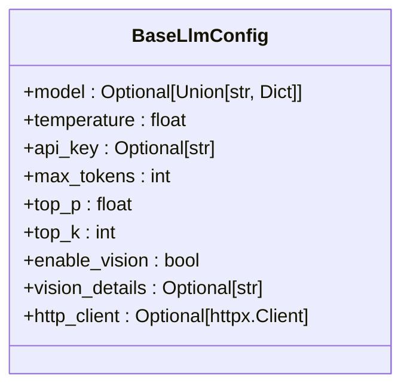
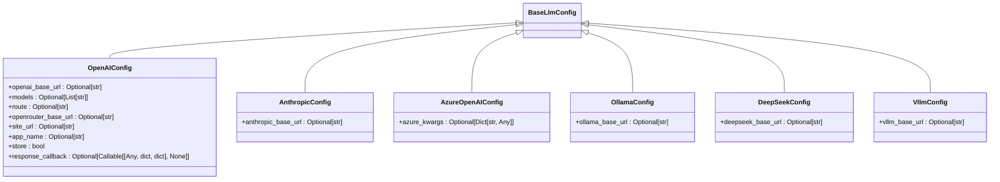
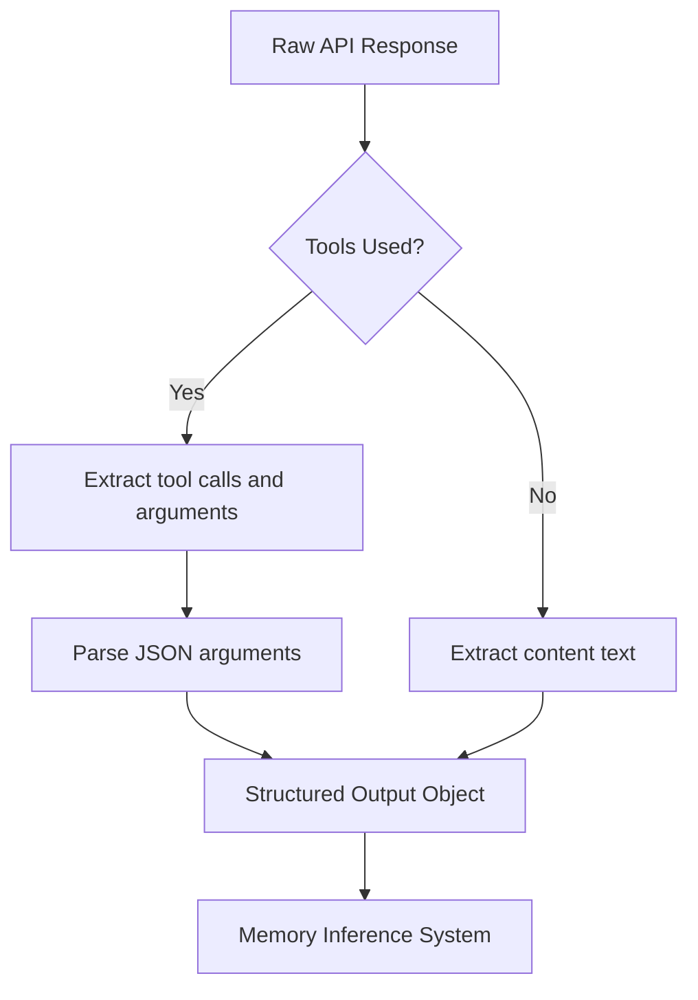
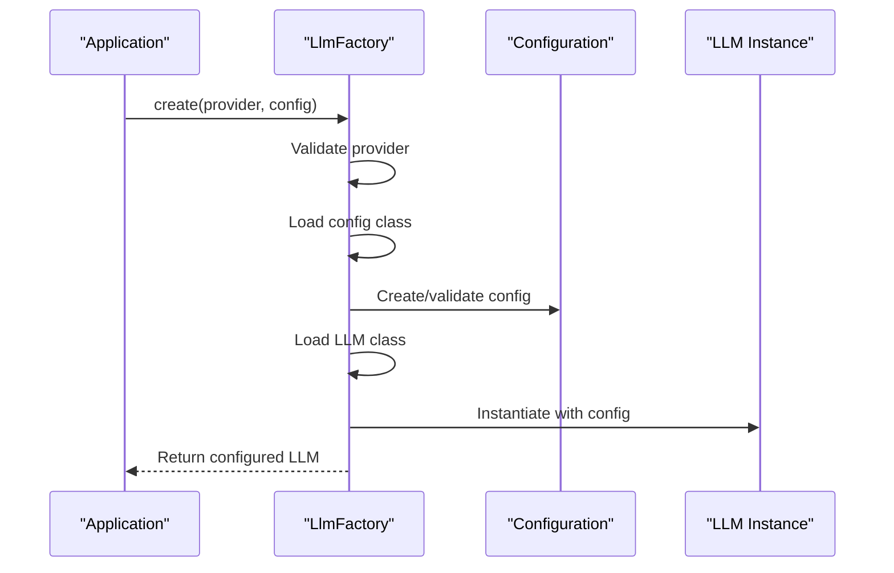

# LLM Configuration

<cite>
**Referenced Files in This Document**   
- [LlmFactory.py](file://mem0/utils/factory.py)
- [BaseLlmConfig.py](file://mem0/configs/llms/base.py)
- [OpenAIConfig.py](file://mem0/configs/llms/openai.py)
- [AnthropicConfig.py](file://mem0/configs/llms/anthropic.py)
- [AzureOpenAIConfig.py](file://mem0/configs/llms/azure.py)
- [OllamaConfig.py](file://mem0/configs/llms/ollama.py)
- [DeepSeekConfig.py](file://mem0/configs/llms/deepseek.py)
- [VllmConfig.py](file://mem0/configs/llms/vllm.py)
- [OpenAILLM.py](file://mem0/llms/openai.py)
- [AnthropicLLM.py](file://mem0/llms/anthropic.py)
- [AzureOpenAILLM.py](file://mem0/llms/azure_openai.py)
- [OllamaLLM.py](file://mem0/llms/ollama.py)
- [azure_openai.yaml](file://embedchain/configs/azure_openai.yaml)
- [vllm.yaml](file://embedchain/configs/vllm.yaml)
- [ollama.yaml](file://embedchain/configs/ollama.yaml)
</cite>

## Table of Contents
1. [Introduction](#introduction)
2. [Core Configuration Parameters](#core-configuration-parameters)
3. [Provider-Specific Configurations](#provider-specific-configurations)
4. [Configuration for Cloud-Hosted LLMs](#configuration-for-cloud-hosted-llms)
5. [Configuration for Local/Self-Hosted LLMs](#configuration-for-localself-hosted-llms)
6. [Structured Output Configuration](#structured-output-configuration)
7. [LlmFactory and Configuration Management](#llmfactory-and-configuration-management)
8. [Security Considerations for Credential Management](#security-considerations-for-credential-management)
9. [Troubleshooting Common Issues](#troubleshooting-common-issues)
10. [Configuration Examples](#configuration-examples)

## Introduction

This document provides comprehensive guidance on configuring language models (LLMs) for optimal performance in memory inference, fact extraction, and update decisions. The configuration system supports multiple LLM providers including OpenAI, Anthropic, Azure OpenAI, Ollama, vLLM, DeepSeek, and others. The configuration framework enables fine-tuning of model behavior through parameters that affect randomness, response length, and processing characteristics.

The system uses a factory pattern to create appropriate LLM instances based on provider-specific configurations, allowing for consistent interfaces across different providers while maintaining access to provider-specific features. Configuration can be managed through code, environment variables, or YAML configuration files, providing flexibility for different deployment scenarios.

**Section sources**
- [LlmFactory.py](file://mem0/utils/factory.py#L23-L126)
- [BaseLlmConfig.py](file://mem0/configs/llms/base.py#L7-L63)

## Core Configuration Parameters

The LLM configuration system is built around a hierarchical structure with base parameters common to all providers and provider-specific extensions. The core parameters affect fundamental aspects of model behavior including memory inference, fact extraction, and decision-making processes.

### Base Configuration Parameters

All LLM configurations inherit from `BaseLlmConfig` which defines the following core parameters:



**Diagram sources**
- [BaseLlmConfig.py](file://mem0/configs/llms/base.py#L7-L63)

#### Temperature
The temperature parameter controls the randomness of the model's output. Lower values (closer to 0) make the output more deterministic and focused, which is beneficial for fact extraction and consistent memory updates. Higher values (closer to 2.0) increase creativity and diversity, which may be useful for exploratory memory inference but can reduce factual accuracy.

#### Max Tokens
This parameter sets the maximum number of tokens to generate in the response. It directly impacts the length of memory updates and the comprehensiveness of fact extraction. Longer responses may capture more context but increase processing time and token costs.

#### Top-p (Nucleus Sampling)
Top-p sampling controls diversity by considering only the most probable tokens that sum to the specified probability. Lower values (closer to 0) make the model more conservative in word selection, while higher values (closer to 1) allow for more diverse responses.

#### Top-k Sampling
This parameter limits the number of tokens considered for each generation step. A lower top-k value focuses on the most likely options, improving consistency in memory updates, while a higher value allows for more diverse responses.

**Section sources**
- [BaseLlmConfig.py](file://mem0/configs/llms/base.py#L7-L63)

## Provider-Specific Configurations

Each LLM provider has specific configuration requirements and extended parameters that build upon the base configuration. The system supports multiple providers through dedicated configuration classes that inherit from `BaseLlmConfig`.



**Diagram sources**
- [OpenAIConfig.py](file://mem0/configs/llms/openai.py#L6-L80)
- [AnthropicConfig.py](file://mem0/configs/llms/anthropic.py#L6-L57)
- [AzureOpenAIConfig.py](file://mem0/configs/llms/azure.py#L7-L58)
- [OllamaConfig.py](file://mem0/configs/llms/ollama.py#L6-L57)
- [DeepSeekConfig.py](file://mem0/configs/llms/deepseek.py#L6-L57)
- [VllmConfig.py](file://mem0/configs/llms/vllm.py#L6-L57)

**Section sources**
- [OpenAIConfig.py](file://mem0/configs/llms/openai.py#L6-L80)
- [AnthropicConfig.py](file://mem0/configs/llms/anthropic.py#L6-L57)
- [AzureOpenAIConfig.py](file://mem0/configs/llms/azure.py#L7-L58)
- [OllamaConfig.py](file://mem0/configs/llms/ollama.py#L6-L57)

## Configuration for Cloud-Hosted LLMs

Cloud-hosted LLMs require specific configuration approaches to handle API access, authentication, and service-specific parameters.

### OpenAI Configuration

The OpenAI configuration supports both direct OpenAI API access and OpenRouter routing. Key parameters include:

- **openai_base_url**: Override the default API endpoint for custom deployments or proxies
- **response_callback**: Optional callback function for monitoring LLM responses
- **store**: When using OpenRouter, controls whether to store queries for analytics

Authentication can be provided through the `api_key` parameter or via the `OPENAI_API_KEY` environment variable.

### Anthropic Configuration

Anthropic configuration includes:

- **anthropic_base_url**: Custom API endpoint for Anthropic services
- Authentication via `api_key` parameter or `ANTHROPIC_API_KEY` environment variable

### Azure OpenAI Configuration

Azure OpenAI requires additional authentication and deployment parameters through the `azure_kwargs` dictionary:

- **api_key**: Azure API key
- **azure_deployment**: Deployment name in Azure
- **azure_endpoint**: Service endpoint URL
- **api_version**: API version to use
- **default_headers**: Additional HTTP headers

The configuration supports both API key authentication and Azure Active Directory authentication via `DefaultAzureCredential`.

**Section sources**
- [OpenAIConfig.py](file://mem0/configs/llms/openai.py#L6-L80)
- [AnthropicConfig.py](file://mem0/configs/llms/anthropic.py#L6-L57)
- [AzureOpenAIConfig.py](file://mem0/configs/llms/azure.py#L7-L58)
- [OpenAILLM.py](file://mem0/llms/openai.py#L14-L148)
- [AnthropicLLM.py](file://mem0/llms/anthropic.py#L14-L88)
- [AzureOpenAILLM.py](file://mem0/llms/azure_openai.py#L16-L142)

## Configuration for Local/Self-Hosted LLMs

Local and self-hosted LLMs require configuration for local service access and resource management.

### Ollama Configuration

Ollama configuration focuses on local service connectivity:

- **ollama_base_url**: URL of the Ollama server (default: http://localhost:11434)
- The configuration automatically converts standard parameters like `max_tokens` to Ollama-specific equivalents (`num_predict`)

### vLLM Configuration

vLLM configuration includes:

- **vllm_base_url**: URL of the vLLM inference server
- Support for advanced inference parameters through the configuration object
- Integration with Hugging Face model repositories

Local LLM configurations typically use the `api_key` field for local authentication tokens or leave it empty for unauthenticated local services.

**Section sources**
- [OllamaConfig.py](file://mem0/configs/llms/ollama.py#L6-L57)
- [VllmConfig.py](file://mem0/configs/llms/vllm.py#L6-L57)
- [OllamaLLM.py](file://mem0/llms/ollama.py#L13-L115)

## Structured Output Configuration

Structured output configuration is critical for reliable memory parsing and fact extraction. The system supports multiple approaches to ensure consistent JSON output.

### Response Parsing Mechanisms

Each LLM implementation includes a `_parse_response` method that processes raw API responses into structured formats:



**Diagram sources**
- [OpenAILLM.py](file://mem0/llms/openai.py#L53-L82)
- [AzureOpenAILLM.py](file://mem0/llms/azure_openai.py#L70-L98)
- [OllamaLLM.py](file://mem0/llms/ollama.py#L41-L66)

### JSON Output Handling

For providers that support structured output (like OpenAI), the `response_format` parameter can be set to request JSON responses. For providers without native JSON support (like Ollama), the system appends instructions to the user prompt:

```
"Please respond with valid JSON only."
```

This ensures consistent output formatting regardless of the underlying provider's capabilities.

**Section sources**
- [OpenAILLM.py](file://mem0/llms/openai.py#L53-L82)
- [OllamaLLM.py](file://mem0/llms/ollama.py#L94-L101)

## LlmFactory and Configuration Management

The `LlmFactory` class provides a unified interface for creating configured LLM instances across all supported providers.



**Diagram sources**
- [LlmFactory.py](file://mem0/utils/factory.py#L23-L126)

### Factory Creation Process

The factory follows a standardized creation process:

1. **Provider Validation**: Check if the requested provider is supported
2. **Configuration Handling**: Process the configuration input (None, dict, or config object)
3. **Class Loading**: Dynamically load the appropriate LLM and config classes
4. **Instance Creation**: Instantiate the LLM with the processed configuration

The factory supports multiple configuration input methods:
- No config (uses defaults)
- Dictionary of parameters
- Pre-configured config object
- Mixed approach with kwargs overriding config values

**Section sources**
- [LlmFactory.py](file://mem0/utils/factory.py#L23-L126)

## Security Considerations for Credential Management

Proper credential management is essential for secure LLM integration.

### Environment Variable Usage

The system prioritizes environment variables for API keys:
- OpenAI: `OPENAI_API_KEY`
- Anthropic: `ANTHROPIC_API_KEY`
- Azure: `LLM_AZURE_OPENAI_API_KEY`

This approach prevents credentials from being hardcoded in configuration files.

### Secure Configuration Patterns

Recommended practices include:
- Using environment variables instead of hardcoded keys
- Implementing the `response_callback` parameter for monitoring and auditing
- Using Azure AD authentication for Azure services in production environments
- Setting appropriate HTTP proxies for network security

### Credential Fallback Strategy

The system implements a secure fallback strategy:
1. Check configuration object for API key
2. Check environment variables
3. Allow empty keys for local/self-hosted models
4. Raise error if no valid authentication method is found

**Section sources**
- [OpenAILLM.py](file://mem0/llms/openai.py#L48-L51)
- [AnthropicLLM.py](file://mem0/llms/anthropic.py#L40-L41)
- [AzureOpenAILLM.py](file://mem0/llms/azure_openai.py#L43-L58)

## Troubleshooting Common Issues

This section addresses common configuration issues and their solutions.

### Rate Limits

**Symptoms**: HTTP 429 errors, slow responses
**Solutions**:
- Implement retry logic with exponential backoff
- Monitor token usage and adjust `max_tokens` accordingly
- Use caching for repeated queries
- Consider upgrading to higher-tier plans for cloud providers

### Timeouts

**Symptoms**: Connection timeouts, incomplete responses
**Solutions**:
- Adjust `http_client_proxies` configuration for network issues
- Increase timeout settings in the HTTP client
- Verify network connectivity to the LLM service
- For local models, ensure adequate system resources

### Model Not Found Errors

**Symptoms**: HTTP 404 errors, model loading failures
**Solutions**:
- Verify model names are correct and available
- For Azure, ensure deployment names match exactly
- For local models, confirm the model is downloaded and available
- Check service status for cloud providers

### Authentication Failures

**Symptoms**: HTTP 401/403 errors
**Solutions**:
- Verify API keys are correct and have appropriate permissions
- Check environment variable names and values
- For Azure, validate AD credentials and token scopes
- Ensure no trailing spaces in API keys

**Section sources**
- [OpenAILLM.py](file://mem0/llms/openai.py#L40-L51)
- [AnthropicLLM.py](file://mem0/llms/anthropic.py#L40-L41)
- [AzureOpenAILLM.py](file://mem0/llms/azure_openai.py#L43-L58)

## Configuration Examples

### YAML Configuration Examples

Azure OpenAI configuration:
```yaml
llm:
  provider: azure_openai
  config:
    model: gpt-35-turbo
    deployment_name: your_llm_deployment_name
    temperature: 0.5
    max_tokens: 1000
    top_p: 1
    stream: false
```

vLLM configuration:
```yaml
llm:
  provider: vllm
  config:
    model: 'meta-llama/Llama-2-70b-hf'
    temperature: 0.5
    top_p: 1
    top_k: 10
    stream: true
    trust_remote_code: true
```

Ollama configuration:
```yaml
llm:
  provider: ollama
  config:
    model: 'llama2'
    temperature: 0.5
    top_p: 1
    stream: true
    base_url: http://localhost:11434
```

### Programmatic Configuration

Creating an OpenAI LLM instance:
```python
from mem0.utils.factory import LlmFactory
from mem0.configs.llms.openai import OpenAIConfig

config = OpenAIConfig(
    model="gpt-4o-mini",
    temperature=0.1,
    max_tokens=2000,
    openai_base_url="https://api.openai.com/v1"
)

llm = LlmFactory.create("openai", config)
```

Creating an Ollama LLM instance:
```python
config = OllamaConfig(
    model="llama3.1:70b",
    temperature=0.7,
    ollama_base_url="http://localhost:11434"
)

llm = LlmFactory.create("ollama", config)
```

**Section sources**
- [azure_openai.yaml](file://embedchain/configs/azure_openai.yaml#L1-L20)
- [vllm.yaml](file://embedchain/configs/vllm.yaml#L1-L15)
- [ollama.yaml](file://embedchain/configs/ollama.yaml#L1-L15)
- [LlmFactory.py](file://mem0/utils/factory.py#L51-L104)