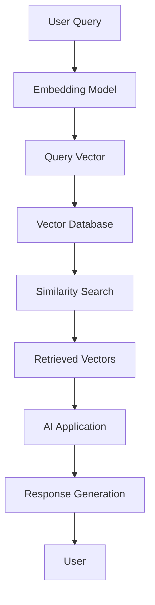
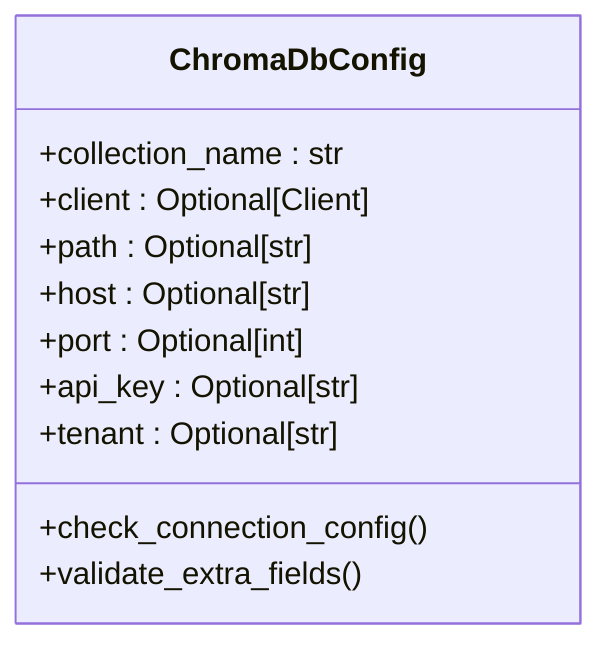
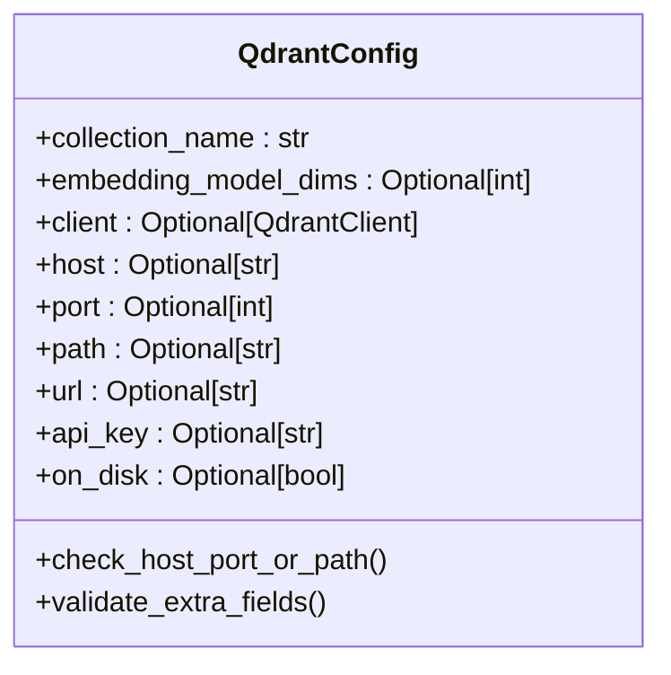
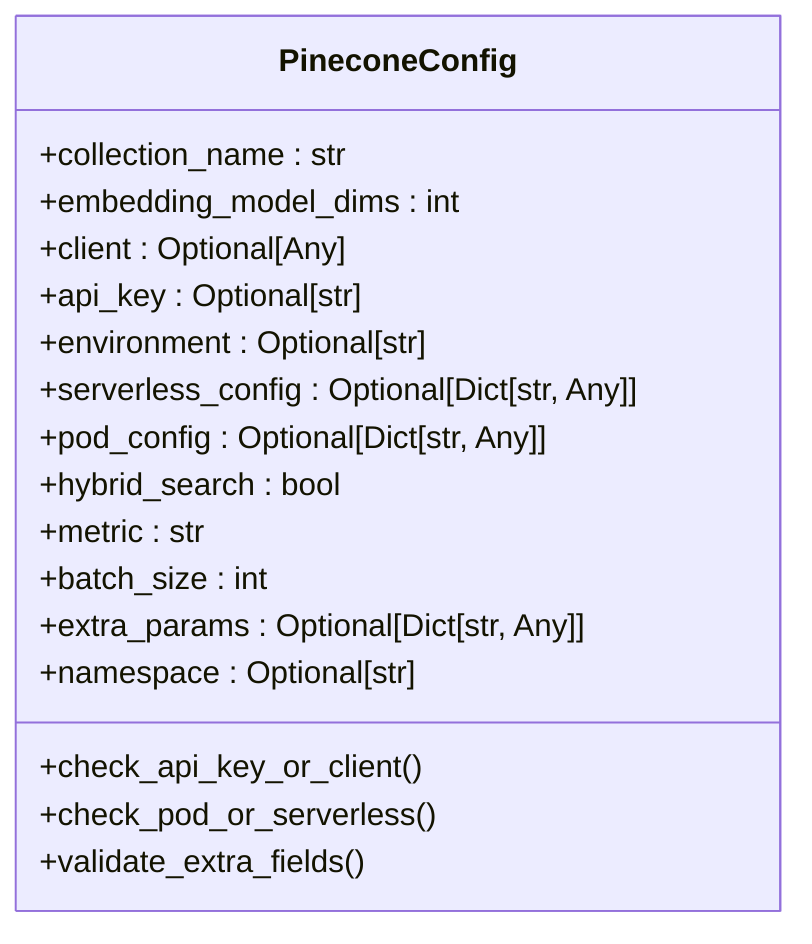
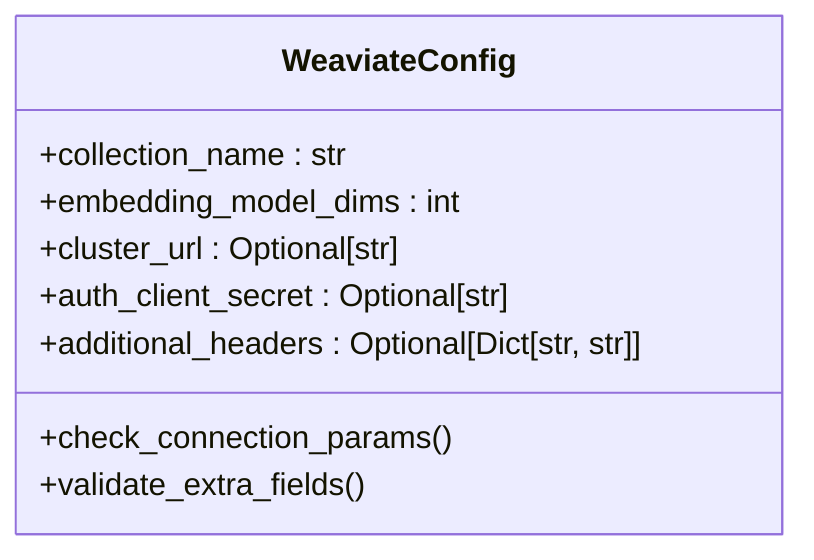
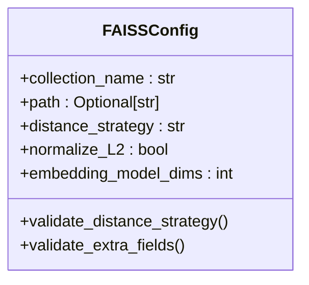
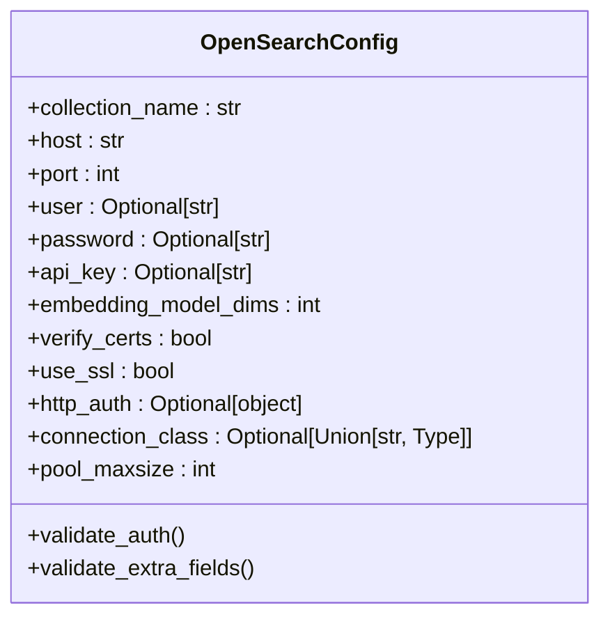
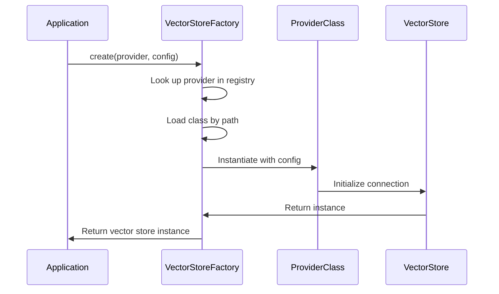

# Vector Store Configuration

<cite>
**Referenced Files in This Document**   
- [configs.py](file://mem0/vector_stores/configs.py)
- [base.py](file://mem0/vector_stores/base.py)
- [chroma.py](file://mem0/vector_stores/chroma.py)
- [qdrant.py](file://mem0/vector_stores/qdrant.py)
- [pinecone.py](file://mem0/vector_stores/pinecone.py)
- [weaviate.py](file://mem0/vector_stores/weaviate.py)
- [faiss.py](file://mem0/vector_stores/faiss.py)
- [opensearch.py](file://mem0/vector_stores/opensearch.py)
- [chroma.py](file://mem0/configs/vector_stores/chroma.py)
- [qdrant.py](file://mem0/configs/vector_stores/qdrant.py)
- [pinecone.py](file://mem0/configs/vector_stores/pinecone.py)
- [weaviate.py](file://mem0/configs/vector_stores/weaviate.py)
- [faiss.py](file://mem0/configs/vector_stores/faiss.py)
- [opensearch.py](file://mem0/configs/vector_stores/opensearch.py)
- [factory.py](file://mem0/utils/factory.py)
- [memory.py](file://openmemory/api/app/utils/memory.py)
</cite>

## Table of Contents
1. [Introduction](#introduction)
2. [Vector Database Fundamentals](#vector-database-fundamentals)
3. [Configuration Parameters by Provider](#configuration-parameters-by-provider)
   - [Chroma](#chroma)
   - [Qdrant](#qdrant)
   - [Pinecone](#pinecone)
   - [Weaviate](#weaviate)
   - [FAISS](#faiss)
   - [OpenSearch](#opensearch)
4. [VectorStoreFactory and Dynamic Instantiation](#vectorstorefactory-and-dynamic-instantiation)
5. [Performance, Scalability, and Deployment Models](#performance-scalability-and-deployment-models)
6. [Best Practices for Vector Store Selection](#best-practices-for-vector-store-selection)
7. [Common Issues and Troubleshooting](#common-issues-and-troubleshooting)
8. [Conclusion](#conclusion)

## Introduction

Vector databases play a crucial role in modern AI applications by enabling efficient storage and retrieval of high-dimensional vector embeddings. These databases are optimized for similarity search operations, allowing applications to find semantically related content based on vector proximity rather than exact matches. In the context of memory retrieval systems, vector stores serve as the backbone for implementing retrieval-augmented generation (RAG), recommendation systems, and personalized AI assistants.

This document provides comprehensive guidance on configuring various vector store providers within the Mem0 ecosystem. It covers the configuration parameters for each supported provider, including Chroma, Qdrant, Pinecone, Weaviate, FAISS, and OpenSearch, along with code examples for initialization and provider-specific settings. The document also addresses performance characteristics, scalability considerations, and best practices for selecting the appropriate vector store based on specific use case requirements.

**Section sources**
- [configs.py](file://mem0/vector_stores/configs.py)
- [base.py](file://mem0/vector_stores/base.py)

## Vector Database Fundamentals

Vector databases are specialized data stores designed to efficiently handle high-dimensional vector data, typically generated by machine learning models for text, images, audio, and other modalities. Unlike traditional databases that rely on exact matching of discrete values, vector databases perform similarity searches using distance metrics such as cosine similarity, Euclidean distance, or inner product to find vectors that are close to a query vector in the embedding space.

The primary function of a vector database in memory retrieval systems is to enable fast and accurate similarity search. When a user query is received, it is first converted into a vector embedding using an embedding model. This query vector is then compared against the stored vectors in the database to find the most similar matches. The retrieved vectors and their associated metadata are used to provide context for downstream AI operations, such as generating responses in a chatbot or making recommendations.

Key operations supported by vector databases include:
- **Insert**: Adding new vectors and their associated metadata to the database
- **Search**: Finding vectors similar to a query vector within a specified distance threshold
- **Get**: Retrieving a specific vector by its unique identifier
- **Update**: Modifying existing vectors and their metadata
- **Delete**: Removing vectors from the database
- **List**: Retrieving all vectors that match certain criteria
- **Reset**: Clearing and reinitializing the database

The effectiveness of a vector database depends on several factors, including the choice of distance metric, indexing strategy, and hardware resources. Different vector stores implement various optimization techniques such as approximate nearest neighbor (ANN) algorithms, quantization, and distributed computing to balance search accuracy with performance and scalability.

**Diagram sources **
- [base.py](file://mem0/vector_stores/base.py)

**Section sources**
- [base.py](file://mem0/vector_stores/base.py)

## Configuration Parameters by Provider

### Chroma

Chroma is an open-source vector database designed for AI applications with a focus on ease of use and developer experience. It supports both in-memory and persistent storage options, making it suitable for development and production environments.

Key configuration parameters:
- **collection_name**: Name of the collection (default: "mem0")
- **client**: Existing ChromaDB client instance
- **path**: Path to the database directory for local storage
- **host**: Database connection remote host
- **port**: Database connection remote port
- **api_key**: ChromaDB Cloud API key
- **tenant**: ChromaDB Cloud tenant ID

Chroma configuration enforces mutual exclusivity between cloud and local/server configurations. When using ChromaDB Cloud, both api_key and tenant must be provided, while local configurations require either a path or host/port combination. The configuration validation prevents mixing cloud and local settings.

**Diagram sources **
- [chroma.py](file://mem0/configs/vector_stores/chroma.py)

**Section sources**
- [chroma.py](file://mem0/configs/vector_stores/chroma.py)
- [chroma.py](file://mem0/vector_stores/chroma.py)

### Qdrant

Qdrant is a vector similarity search engine with extended filtering support, written in Rust and available as both a cloud service and self-hosted solution. It offers high performance and scalability with support for distributed deployments.

Key configuration parameters:
- **collection_name**: Name of the collection (default: "mem0")
- **embedding_model_dims**: Dimensions of the embedding model (default: 1536)
- **client**: Existing Qdrant client instance
- **host**: Host address for Qdrant server
- **port**: Port for Qdrant server
- **path**: Path for local Qdrant database (default: "/tmp/qdrant")
- **url**: Full URL for Qdrant server
- **api_key**: API key for Qdrant server
- **on_disk**: Enables persistent storage (default: False)

Qdrant configuration requires one of three connection methods: host and port, URL and API key, or local path. The on_disk parameter controls whether vectors are stored persistently on disk, which can impact performance but provides durability. When running locally without on_disk persistence, the database directory is automatically cleared on initialization.

**Diagram sources **
- [qdrant.py](file://mem0/configs/vector_stores/qdrant.py)

**Section sources**
- [qdrant.py](file://mem0/configs/vector_stores/qdrant.py)
- [qdrant.py](file://mem0/vector_stores/qdrant.py)

### Pinecone

Pinecone is a fully managed vector database service designed for production-scale applications. It offers serverless and pod-based deployment options with automatic scaling and high availability.

Key configuration parameters:
- **collection_name**: Name of the index/collection (default: "mem0")
- **embedding_model_dims**: Dimensions of the embedding model (default: 1536)
- **client**: Existing Pinecone client instance
- **api_key**: API key for Pinecone
- **environment**: Pinecone environment
- **serverless_config**: Configuration for serverless deployment
- **pod_config**: Configuration for pod-based deployment
- **hybrid_search**: Whether to enable hybrid search (default: False)
- **metric**: Distance metric for vector similarity (default: "cosine")
- **batch_size**: Batch size for operations (default: 100)
- **extra_params**: Additional parameters for Pinecone client
- **namespace**: Namespace for the collection

Pinecone configuration enforces mutual exclusivity between serverless and pod-based deployments. The hybrid_search feature enables combining dense and sparse vector representations for improved search quality, requiring the pinecone-text package. The API key can be provided directly or through the PINECONE_API_KEY environment variable.

**Diagram sources **
- [pinecone.py](file://mem0/configs/vector_stores/pinecone.py)

**Section sources**
- [pinecone.py](file://mem0/configs/vector_stores/pinecone.py)
- [pinecone.py](file://mem0/vector_stores/pinecone.py)

### Weaviate

Weaviate is an open-source vector database that combines vector search with a graph-based object store, enabling hybrid search capabilities and complex data relationships.

Key configuration parameters:
- **collection_name**: Name of the collection (default: "mem0")
- **embedding_model_dims**: Dimensions of the embedding model (default: 1536)
- **cluster_url**: URL for Weaviate server
- **auth_client_secret**: API key for Weaviate authentication
- **additional_headers**: Additional headers for requests

Weaviate requires the cluster_url parameter to establish a connection to the server. Authentication is handled through the auth_client_secret parameter, which contains the API key. The configuration is relatively minimal compared to other providers, focusing on essential connection parameters.

**Diagram sources **
- [weaviate.py](file://mem0/configs/vector_stores/weaviate.py)

**Section sources**
- [weaviate.py](file://mem0/configs/vector_stores/weaviate.py)
- [weaviate.py](file://mem0/vector_stores/weaviate.py)

### FAISS

FAISS (Facebook AI Similarity Search) is a library for efficient similarity search and clustering of dense vectors, developed by Meta. It is designed for high-performance applications and can be used as an in-memory vector store.

Key configuration parameters:
- **collection_name**: Default name for the collection (default: "mem0")
- **path**: Path to store FAISS index and metadata
- **distance_strategy**: Distance strategy to use ("euclidean", "inner_product", "cosine") (default: "euclidean")
- **normalize_L2**: Whether to normalize L2 vectors (default: False)
- **embedding_model_dims**: Dimension of the embedding vector (default: 1536)

FAISS configuration includes options for different distance metrics and L2 normalization. The distance_strategy parameter determines the similarity calculation method, with cosine similarity being particularly effective for semantic search. The path parameter specifies where to persist the index and metadata, with automatic loading of existing data if available.

**Diagram sources **
- [faiss.py](file://mem0/configs/vector_stores/faiss.py)

**Section sources**
- [faiss.py](file://mem0/configs/vector_stores/faiss.py)
- [faiss.py](file://mem0/vector_stores/faiss.py)

### OpenSearch

OpenSearch is an open-source search and analytics suite that includes vector search capabilities through its k-NN (k-nearest neighbor) plugin. It can be self-hosted or used as a managed service.

Key configuration parameters:
- **collection_name**: Name of the index (default: "mem0")
- **host**: OpenSearch host (default: "localhost")
- **port**: OpenSearch port (default: 9200)
- **user**: Username for authentication
- **password**: Password for authentication
- **api_key**: API key for authentication
- **embedding_model_dims**: Dimension of the embedding vector (default: 1536)
- **verify_certs**: Verify SSL certificates (default: False)
- **use_ssl**: Use SSL for connection (default: False)
- **http_auth**: HTTP authentication method / AWS SigV4
- **connection_class**: Connection class for OpenSearch (default: "RequestsHttpConnection")
- **pool_maxsize**: Maximum number of connections in the pool (default: 20)

OpenSearch configuration includes standard connection parameters along with security settings for authentication and encryption. The index creation process includes specific settings for k-NN search, including the dimensionality of vectors and the underlying search algorithm (nmslib with HNSW method).

**Diagram sources **
- [opensearch.py](file://mem0/configs/vector_stores/opensearch.py)

**Section sources**
- [opensearch.py](file://mem0/configs/vector_stores/opensearch.py)
- [opensearch.py](file://mem0/vector_stores/opensearch.py)

## VectorStoreFactory and Dynamic Instantiation

The VectorStoreFactory pattern enables dynamic instantiation of vector store providers based on configuration, providing a unified interface for different backend implementations. This factory pattern abstracts the complexity of provider-specific initialization and configuration, allowing applications to switch between vector stores with minimal code changes.

The factory implementation uses a registry pattern where each provider is mapped to its corresponding class path. When a vector store is requested, the factory looks up the provider in the registry, loads the appropriate class, and instantiates it with the provided configuration. This approach supports extensibility, allowing new providers to be added without modifying the core factory logic.

**Diagram sources **
- [factory.py](file://mem0/utils/factory.py)

**Section sources**
- [factory.py](file://mem0/utils/factory.py)

## Performance, Scalability, and Deployment Models

Different vector store providers offer varying performance characteristics, scalability options, and deployment models, making them suitable for different use cases and requirements.

**Cloud vs. Self-Hosted Considerations:**
- **Cloud providers** (Pinecone, Chroma Cloud, Weaviate Cloud): Offer managed services with automatic scaling, high availability, and reduced operational overhead. They are ideal for production applications where reliability and scalability are critical.
- **Self-hosted solutions** (Qdrant, OpenSearch, FAISS): Provide greater control over infrastructure, data privacy, and customization. They are suitable for applications with specific security requirements or those needing to optimize costs at scale.

**Performance Characteristics:**
- **Latency**: Cloud providers typically offer lower latency due to optimized infrastructure and global distribution.
- **Throughput**: Distributed systems like Qdrant and OpenSearch can handle higher query volumes through horizontal scaling.
- **Indexing Speed**: FAISS and Qdrant are optimized for fast indexing operations, making them suitable for real-time ingestion scenarios.

**Scalability Options:**
- **Vertical Scaling**: Increasing resources (CPU, memory) on a single node, supported by most providers.
- **Horizontal Scaling**: Distributing data across multiple nodes, available in Qdrant, OpenSearch, and Pinecone's pod-based deployments.
- **Auto-scaling**: Automatic adjustment of resources based on load, offered by cloud providers like Pinecone.

**Resource Requirements:**
- **Memory**: Vector databases are memory-intensive, with larger collections requiring proportionally more RAM.
- **Storage**: Persistent storage requirements depend on the vector dimensionality and collection size.
- **Network**: High-bandwidth connections are beneficial for distributed deployments and cloud services.

The choice between providers should consider the specific performance requirements, expected data volume, query patterns, and budget constraints of the application.

**Section sources**
- [configs.py](file://mem0/vector_stores/configs.py)
- [base.py](file://mem0/vector_stores/base.py)

## Best Practices for Vector Store Selection

Selecting the appropriate vector store depends on several factors related to the specific use case, performance requirements, and operational constraints. The following guidelines can help in making an informed decision:

**For Development and Prototyping:**
- **FAISS**: Ideal for local development and testing due to its simplicity and in-memory operation.
- **Chroma**: Suitable for development with persistent storage options and easy setup.
- **Considerations**: Focus on ease of use, quick setup, and compatibility with development workflows.

**For Production Applications:**
- **Pinecone**: Recommended for production applications requiring high availability, automatic scaling, and managed infrastructure.
- **Qdrant**: Suitable for production deployments needing distributed architecture and high performance.
- **Considerations**: Prioritize reliability, scalability, and operational support.

**For Large-Scale Applications:**
- **OpenSearch**: Appropriate for organizations already using the Elastic stack or needing integration with existing search infrastructure.
- **Qdrant**: Effective for applications with very large datasets requiring horizontal scaling.
- **Considerations**: Evaluate data volume, query patterns, and long-term growth projections.

**For Privacy-Sensitive Applications:**
- **Self-hosted solutions** (Qdrant, OpenSearch, FAISS): Preferred when data privacy and regulatory compliance are paramount.
- **Considerations**: Assess data residency requirements, security policies, and compliance obligations.

**Cost Considerations:**
- **Cloud providers**: Typically operate on a consumption-based pricing model, which can be cost-effective for variable workloads.
- **Self-hosted solutions**: Require upfront infrastructure investment but may offer better long-term cost efficiency at scale.

**Integration Requirements:**
- Evaluate compatibility with existing technology stack, monitoring tools, and deployment pipelines.
- Consider the availability of client libraries and SDKs for the target programming languages.

The optimal vector store selection balances technical requirements with operational and business considerations, ensuring the solution meets both current needs and future growth.

**Section sources**
- [configs.py](file://mem0/vector_stores/configs.py)
- [base.py](file://mem0/vector_stores/base.py)

## Common Issues and Troubleshooting

When working with vector stores, several common issues may arise related to configuration, connectivity, and data management. Understanding these issues and their solutions can help maintain reliable operation.

**Connection Failures:**
- **Cause**: Incorrect host, port, or URL configuration; network connectivity issues; firewall restrictions.
- **Solution**: Verify connection parameters, check network connectivity, ensure required ports are open, and validate that the vector store service is running.

**Authentication Errors:**
- **Cause**: Missing or incorrect API keys, tokens, or credentials; expired authentication tokens.
- **Solution**: Verify authentication credentials, check for typos, ensure credentials have appropriate permissions, and refresh expired tokens.

**Schema Mismatches:**
- **Cause**: Incompatible vector dimensions between the embedding model and vector store; mismatched data types in metadata.
- **Solution**: Ensure consistent vector dimensions across the pipeline, validate metadata schema, and use proper data type conversions.

**Performance Issues:**
- **Cause**: Insufficient resources (memory, CPU); suboptimal indexing strategy; high query volume.
- **Solution**: Monitor resource utilization, optimize indexing parameters, implement caching, and consider scaling the infrastructure.

**Data Consistency Problems:**
- **Cause**: Failed writes or updates; network interruptions during operations; improper error handling.
- **Solution**: Implement proper error handling and retry logic, use transactions where supported, and verify data integrity through validation checks.

**Configuration Validation:**
Many vector store configurations include validation logic to prevent common errors. For example, Chroma enforces mutual exclusivity between cloud and local configurations, while Pinecone validates that either an API key or client instance is provided. These validations help catch configuration issues early in the initialization process.

**Monitoring and Logging:**
Implement comprehensive logging and monitoring to detect and diagnose issues promptly. Key metrics to monitor include query latency, error rates, resource utilization, and data ingestion rates.

**Section sources**
- [configs.py](file://mem0/vector_stores/configs.py)
- [base.py](file://mem0/vector_stores/base.py)

## Conclusion

Vector store configuration is a critical aspect of building effective memory retrieval and similarity search systems. The choice of vector database and its configuration parameters significantly impacts the performance, scalability, and reliability of AI applications. By understanding the capabilities and requirements of different providers such as Chroma, Qdrant, Pinecone, Weaviate, FAISS, and OpenSearch, developers can make informed decisions that align with their specific use cases.

The VectorStoreFactory pattern provides a flexible and extensible approach to managing multiple vector store providers, enabling dynamic instantiation based on configuration. This abstraction simplifies the integration of different backends and supports future expansion with additional providers.

When selecting a vector store, consider factors such as deployment model (cloud vs. self-hosted), performance requirements, scalability needs, data privacy concerns, and cost implications. Each provider offers unique strengths that make it suitable for particular scenarios, from development and prototyping to large-scale production deployments.

Proper configuration, monitoring, and troubleshooting practices are essential for maintaining reliable operation. By following best practices and understanding common issues, developers can build robust vector database implementations that effectively support their AI applications' memory retrieval and similarity search requirements.