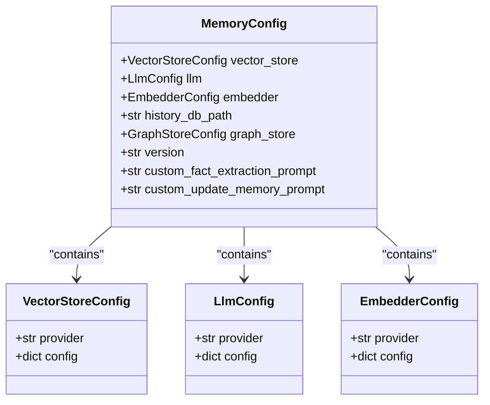
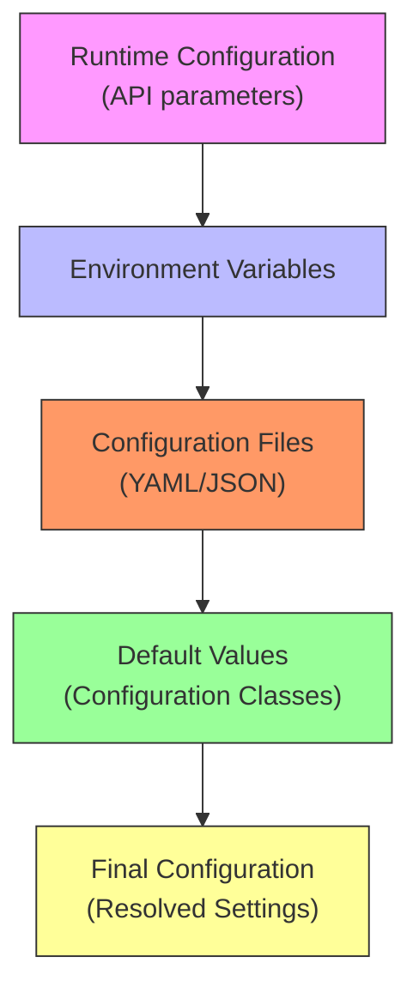
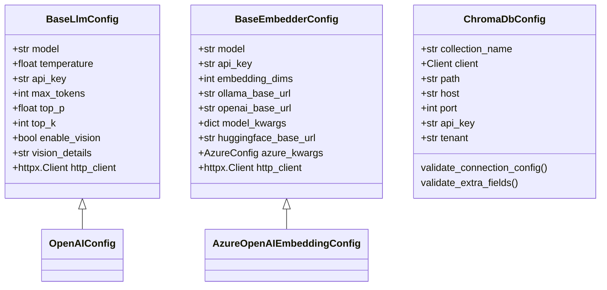
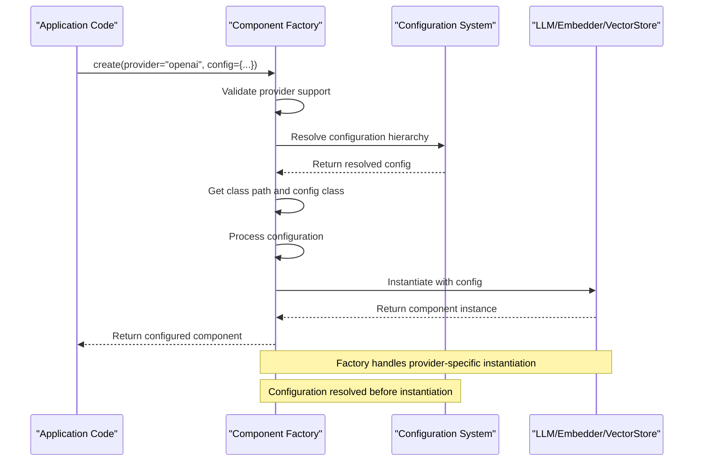
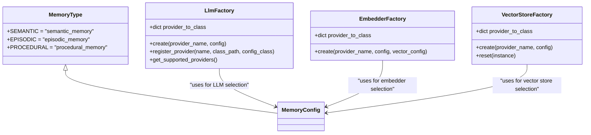
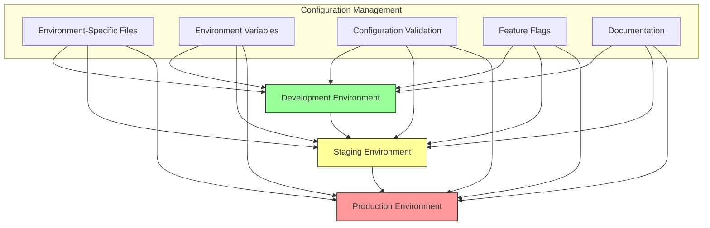
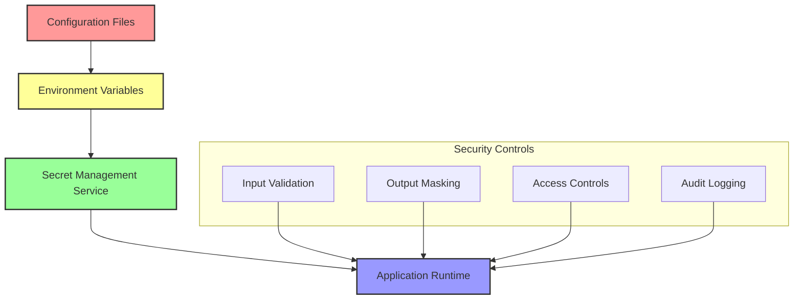
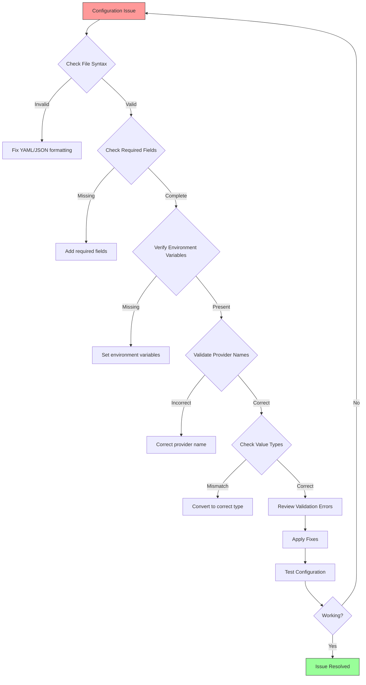

# Configuration Hierarchy

<cite>
**Referenced Files in This Document**   
- [base.py](file://mem0/configs/base.py)
- [enums.py](file://mem0/configs/enums.py)
- [factory.py](file://mem0/utils/factory.py)
- [base.py](file://mem0/configs/llms/base.py)
- [openai.py](file://mem0/configs/llms/openai.py)
- [base.py](file://mem0/configs/embeddings/base.py)
- [chroma.py](file://mem0/configs/vector_stores/chroma.py)
- [azure_openai.yaml](file://embedchain/configs/azure_openai.yaml)
- [chroma.yaml](file://embedchain/configs/chroma.yaml)
- [mem0_config.py](file://embedchain/embedchain/config/mem0_config.py)
</cite>

## Table of Contents
1. [Introduction](#introduction)
2. [Core Configuration Structure](#core-configuration-structure)
3. [Configuration Precedence System](#configuration-precedence-system)
4. [Configuration Validation and Defaults](#configuration-validation-and-defaults)
5. [Component Instantiation Process](#component-instantiation-process)
6. [Provider Selection with Type Safety](#provider-selection-with-type-safety)
7. [Runtime Configuration Examples](#runtime-configuration-examples)
8. [Best Practices for Environment Management](#best-practices-for-environment-management)
9. [Security Considerations for Sensitive Credentials](#security-considerations-for-sensitive-credentials)
10. [Troubleshooting Configuration Issues](#troubleshooting-configuration-issues)

## Introduction
The hierarchical configuration system provides a structured approach to managing settings across the Mem0 platform. This system enables flexible configuration through multiple layers including global defaults, component-specific settings, and runtime overrides. The architecture is designed to support various LLM providers, embedding models, and vector stores while maintaining type safety and validation. The system uses Pydantic models for configuration definition, enum classes for provider selection, and factory patterns for component instantiation. Configuration can be specified through YAML files, environment variables, or direct API calls, with a clear precedence order determining which values take priority.

## Core Configuration Structure

The configuration system is built around a hierarchical structure defined in the base configuration files. The `MemoryConfig` class in `base.py` serves as the root configuration object, containing nested configurations for vector stores, LLMs, embedders, and other components. Each component has its own configuration class that inherits from base configuration classes, allowing for both common parameters and provider-specific settings.



**Diagram sources**
- [base.py](file://mem0/configs/base.py#L29-L62)

**Section sources**
- [base.py](file://mem0/configs/base.py#L1-L86)

## Configuration Precedence System

The configuration system follows a clear precedence order that determines how settings are resolved when multiple sources are available. The hierarchy from highest to lowest precedence is: runtime configurations, environment variables, configuration files, and default values. This allows developers to override settings at different levels depending on their needs.

When a configuration is loaded, the system first checks for runtime parameters passed directly to the constructor or factory methods. If not present, it looks for environment variables that match the configuration keys. Next, it checks for values in YAML configuration files. Finally, if no value is found in the previous sources, it falls back to the default values defined in the configuration classes.



**Diagram sources**
- [mem0_config.py](file://embedchain/embedchain/config/mem0_config.py#L9-L21)
- [base.py](file://mem0/configs/base.py#L42-L44)

## Configuration Validation and Defaults

The configuration system implements robust validation using Pydantic models to ensure settings are correct before components are instantiated. Each configuration class defines field validators that check data types, ranges, and required values. The system also handles default values intelligently, providing sensible defaults while allowing easy customization.

For example, the `BaseLlmConfig` class defines default values for parameters like temperature (0.1), max_tokens (2000), and top_p (0.1). These defaults can be overridden at any level of the configuration hierarchy. The validation system also checks for provider-specific requirements, such as ensuring Azure configurations include necessary deployment names and endpoints.



**Diagram sources**
- [base.py](file://mem0/configs/llms/base.py#L7-L63)
- [base.py](file://mem0/configs/embeddings/base.py#L10-L111)
- [chroma.py](file://mem0/configs/vector_stores/chroma.py#L6-L59)

**Section sources**
- [base.py](file://mem0/configs/llms/base.py#L1-L63)
- [base.py](file://mem0/configs/embeddings/base.py#L1-L111)
- [chroma.py](file://mem0/configs/vector_stores/chroma.py#L1-L59)

## Component Instantiation Process

The factory pattern implemented in `factory.py` handles the instantiation of components based on the resolved configuration. The system uses provider mappings to determine which class to instantiate for each component type. When a component is requested, the factory looks up the provider in its registry and creates an instance with the appropriate configuration.

The instantiation process follows these steps: first, the factory checks if the requested provider is supported; then, it retrieves the corresponding class path and configuration class; next, it processes the configuration (merging defaults, handling dictionaries, etc.); finally, it instantiates the component with the processed configuration. This process ensures that components are created consistently and with the correct settings.



**Diagram sources**
- [factory.py](file://mem0/utils/factory.py#L23-L224)

**Section sources**
- [factory.py](file://mem0/utils/factory.py#L1-L224)

## Provider Selection with Type Safety

The system uses the `MemoryType` enum in `enums.py` to provide type safety for provider selection and memory categorization. This enum-based approach ensures that only valid memory types can be specified, preventing configuration errors. The enum values (SEMANTIC, EPISODIC, PROCEDURAL) represent different types of memory that the system can manage.

For provider selection, the factory classes maintain registries of supported providers, which are validated against the available implementations. This ensures that only registered providers can be instantiated, preventing runtime errors due to misspelled provider names or unsupported services. The type-safe approach extends to configuration validation, where Pydantic models ensure that configuration parameters match the expected types and constraints.



**Diagram sources**
- [enums.py](file://mem0/configs/enums.py#L4-L8)
- [factory.py](file://mem0/utils/factory.py#L23-L157)

**Section sources**
- [enums.py](file://mem0/configs/enums.py#L1-L8)
- [factory.py](file://mem0/utils/factory.py#L23-L157)

## Runtime Configuration Examples

The configuration system supports various methods for specifying settings at runtime. These include direct API calls with configuration objects, environment variable overrides, and YAML file loading. The examples below demonstrate different approaches to configuring the system for various scenarios.

For Azure OpenAI configuration:
```yaml
app:
  config:
    id: azure-openai-app

llm:
  provider: azure_openai
  config:
    model: gpt-35-turbo
    deployment_name: your_llm_deployment_name
    temperature: 0.5
    max_tokens: 1000
    top_p: 1
    stream: false

embedder:
  provider: azure_openai
  config:
    model: text-embedding-ada-002
    deployment_name: you_embedding_model_deployment_name
```

For Chroma vector database configuration:
```yaml
app:
  config:
    id: 'my-app'

llm:
  provider: openai
  config:
    model: 'gpt-4o-mini'
    temperature: 0.5
    max_tokens: 1000
    top_p: 1
    stream: false

vectordb:
  provider: chroma
  config:
    collection_name: 'my-app'
    dir: db
    allow_reset: true

embedder:
  provider: openai
  config:
    model: 'text-embedding-ada-002'
```

**Section sources**
- [azure_openai.yaml](file://embedchain/configs/azure_openai.yaml#L1-L20)
- [chroma.yaml](file://embedchain/configs/chroma.yaml#L1-L25)

## Best Practices for Environment Management

Effective environment management requires following several best practices to ensure consistent and secure operation across different deployment scenarios. First, use environment-specific configuration files (e.g., development.yaml, staging.yaml, production.yaml) to manage settings that vary between environments. Second, leverage environment variables for sensitive information and deployment-specific settings, using the "env:" prefix pattern to reference them in configuration files.

Third, establish a clear naming convention for configuration parameters that indicates their scope and purpose. Fourth, implement configuration validation in CI/CD pipelines to catch errors before deployment. Fifth, use feature flags to enable or disable functionality in different environments without changing core configuration. Finally, document all configuration options and their valid values to ensure team members understand the available settings.



**Section sources**
- [base.py](file://mem0/configs/base.py#L11-L13)
- [mem0_config.py](file://embedchain/embedchain/config/mem0_config.py#L264-L286)

## Security Considerations for Sensitive Credentials

The configuration system includes several security features to protect sensitive credentials. API keys and other sensitive information should never be hardcoded in configuration files but should be provided through environment variables or secure secret management systems. The system supports the "env:" prefix pattern to reference environment variables in configuration files, ensuring that sensitive values are not exposed in version control.

Additionally, the configuration classes use Pydantic's field validation to ensure that sensitive fields are properly handled. The system should be configured to mask sensitive values in logs and error messages. For production deployments, consider using dedicated secret management services like Hashicorp Vault, AWS Secrets Manager, or Azure Key Vault to store and retrieve credentials securely.



**Section sources**
- [base.py](file://mem0/configs/base.py#L76-L78)
- [openai.py](file://mem0/configs/llms/openai.py#L17-L18)
- [base.py](file://mem0/configs/embeddings/base.py#L18-L19)

## Troubleshooting Configuration Issues

When encountering configuration-related issues, follow a systematic approach to identify and resolve problems. First, check the configuration file syntax and structure, ensuring it matches the expected format. Second, verify that all required fields are present and correctly spelled. Third, confirm that environment variables are properly set and accessible to the application.

Common issues include provider name mismatches, missing required fields for specific providers, and type mismatches in configuration values. The system's validation errors typically provide specific information about what went wrong. For complex issues, enable debug logging to trace the configuration resolution process and see exactly which values are being used at each step.



**Section sources**
- [chroma.py](file://mem0/configs/vector_stores/chroma.py#L22-L44)
- [base.py](file://mem0/configs/llms/base.py#L54-L62)
- [base.py](file://mem0/configs/embeddings/base.py#L77-L111)