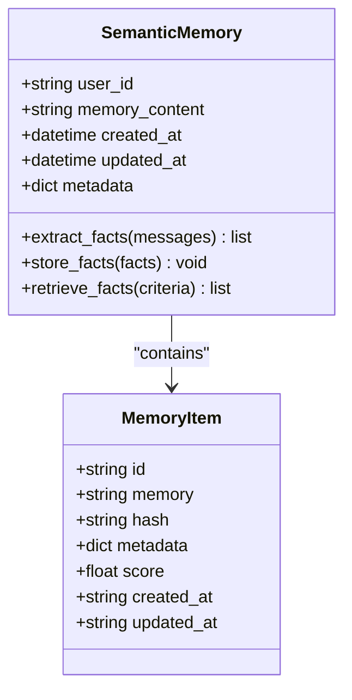
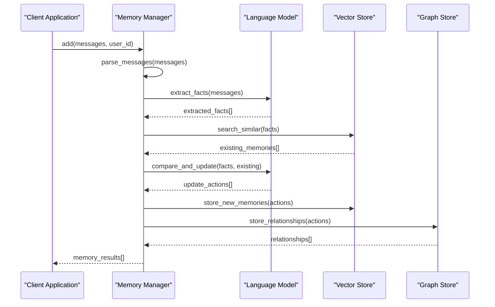
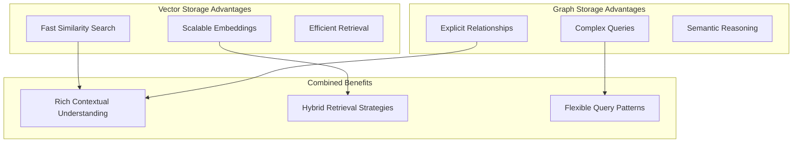
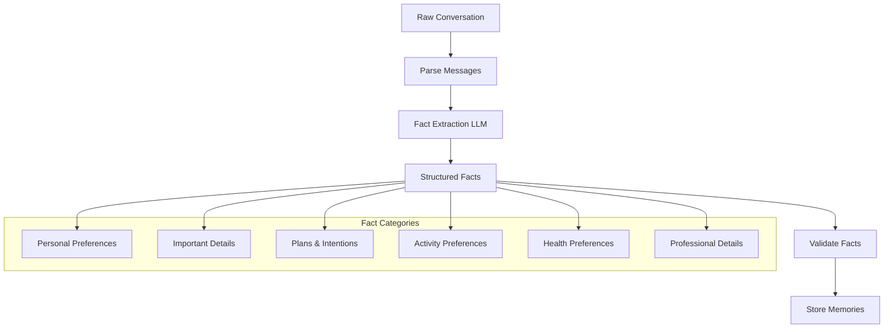
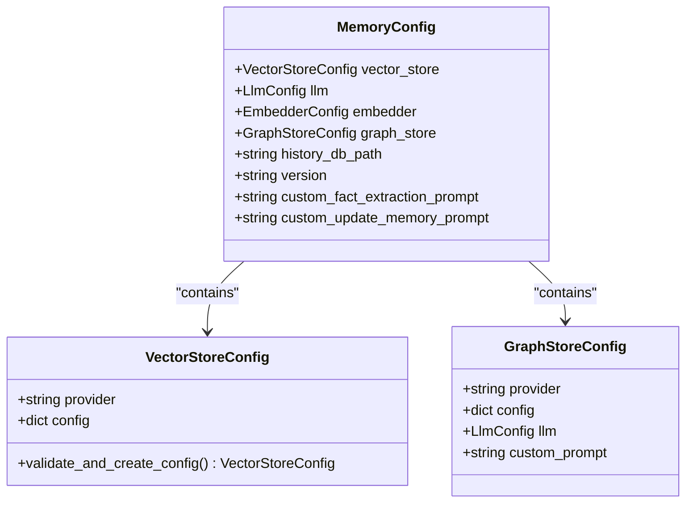
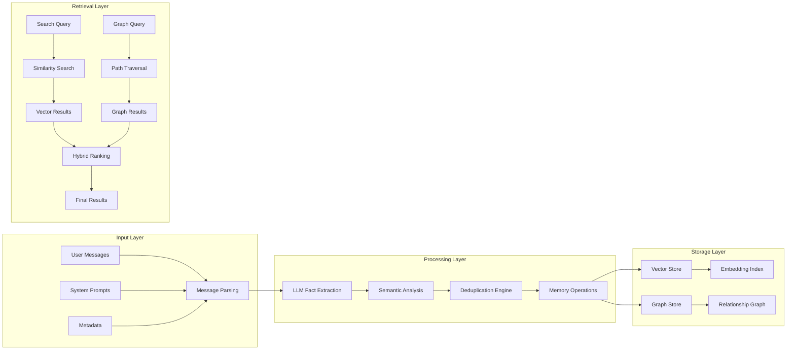

# Core Concepts

<cite>
**Referenced Files in This Document**
- [mem0/memory/main.py](file://mem0/memory/main.py)
- [mem0/client/main.py](file://mem0/client/main.py)
- [mem0/configs/base.py](file://mem0/configs/base.py)
- [mem0/memory/base.py](file://mem0/memory/base.py)
- [mem0/configs/enums.py](file://mem0/configs/enums.py)
- [mem0/configs/prompts.py](file://mem0/configs/prompts.py)
- [mem0/vector_stores/configs.py](file://mem0/vector_stores/configs.py)
- [mem0/graphs/configs.py](file://mem0/graphs/configs.py)
- [examples/rest-api/main.py](file://examples/rest-api/main.py)
- [cookbooks/customer-support-chatbot.ipynb](file://cookbooks/customer-support-chatbot.ipynb)
</cite>

## Table of Contents
1. [Introduction](#introduction)
2. [Memory Types](#memory-types)
3. [Memory Lifecycle](#memory-lifecycle)
4. [Storage Systems](#storage-systems)
5. [Memory Inference Process](#memory-inference-process)
6. [Configuration Hierarchy](#configuration-hierarchy)
7. [Data Flow Architecture](#data-flow-architecture)
8. [Long-term Personalization](#long-term-personalization)
9. [Implementation Examples](#implementation-examples)
10. [Best Practices](#best-practices)

## Introduction

Mem0 is a sophisticated memory management system designed to enable long-term personalization in AI applications. At its core, Mem0 provides a unified framework for storing, retrieving, and managing contextual information across different types of interactions. The system operates on three fundamental building blocks: Memory Types, Memory Lifecycle operations, and dual storage systems (Vector and Graph), all orchestrated through intelligent LLM-powered inference processes.

The architecture enables AI applications to maintain persistent, context-aware conversations while learning from user interactions over time. This foundation supports everything from simple chatbots to complex multi-agent systems requiring sophisticated memory management capabilities.

## Memory Types

Mem0 organizes memories into three distinct categories, each serving specific purposes in the memory ecosystem:

### Semantic Memory
Semantic memories represent factual knowledge and general information about users, environments, and contexts. These memories store declarative knowledge that can be explicitly recalled and articulated.

**Diagram sources**
- [mem0/configs/base.py](file://mem0/configs/base.py#L16-L27)
- [mem0/configs/enums.py](file://mem0/configs/enums.py#L4-L8)

### Episodic Memory
Episodic memories capture specific events, experiences, and interactions from a user's history. These memories are time-stamped and contextually rich, enabling temporal awareness and pattern recognition.

### Procedural Memory
Procedural memories store learned behaviors, skills, and operational procedures. These memories are particularly valuable for agent-based systems where repeated tasks and workflows need to be optimized.

**Section sources**
- [mem0/configs/enums.py](file://mem0/configs/enums.py#L4-L8)
- [mem0/memory/main.py](file://mem0/memory/main.py#L274-L276)

## Memory Lifecycle

The memory lifecycle encompasses four fundamental operations that manage the complete journey of memories from creation to deletion:

### Add Operation
The add operation creates new memories by processing incoming messages through LLM-powered fact extraction and deduplication processes.

**Diagram sources**
- [mem0/memory/main.py](file://mem0/memory/main.py#L195-L308)
- [mem0/configs/prompts.py](file://mem0/configs/prompts.py#L14-L56)

### Search Operation
Search retrieves relevant memories based on query similarity and contextual filtering, supporting both vector similarity and graph traversal approaches.

### Update Operation
Updates modify existing memories while maintaining historical context and preserving relationships between related memories.

### Delete Operation
Deletes remove memories while ensuring proper cleanup of associated relationships and maintaining data integrity.

**Section sources**
- [mem0/memory/main.py](file://mem0/memory/main.py#L494-L800)
- [mem0/memory/base.py](file://mem0/memory/base.py#L1-L64)

## Storage Systems

Mem0 employs a dual-storage architecture combining vector embeddings with graph relationships, offering complementary strengths for different use cases:

### Vector Storage
Vector stores provide efficient similarity search through dense vector embeddings, enabling fast retrieval of semantically similar memories.

| Feature | Description | Benefits |
|---------|-------------|----------|
| **Similarity Search** | Cosine similarity between vectors | Fast retrieval of semantically related memories |
| **Scalability** | Optimized for large-scale embeddings | Handles millions of memories efficiently |
| **Dimensionality** | Configurable embedding dimensions | Balances precision and performance |
| **Providers** | Multiple vector store implementations | Supports Qdrant, Chroma, Pinecone, FAISS |

### Graph Storage
Graph stores maintain explicit relationships between entities, enabling complex queries and reasoning about connections.

| Feature | Description | Benefits |
|---------|-------------|----------|
| **Relationships** | Explicit entity-to-entity connections | Enables complex queries and reasoning |
| **Contextual Awareness** | Maintains semantic relationships | Supports sophisticated inference |
| **Provider Options** | Neo4j, Memgraph, Neptune, Kuzu | Flexible deployment options |
| **Query Capabilities** | Cypher-like graph queries | Powerful relationship-based retrieval |

### Trade-off Analysis

**Diagram sources**
- [mem0/vector_stores/configs.py](file://mem0/vector_stores/configs.py#L6-L36)
- [mem0/graphs/configs.py](file://mem0/graphs/configs.py#L80-L106)

**Section sources**
- [mem0/vector_stores/configs.py](file://mem0/vector_stores/configs.py#L1-L66)
- [mem0/graphs/configs.py](file://mem0/graphs/configs.py#L1-L106)

## Memory Inference Process

The memory inference process leverages Large Language Models to intelligently extract, deduplicate, and organize information from user interactions:

### Fact Extraction
LLMs analyze conversations to identify and extract meaningful facts, preferences, and patterns that should be stored as memories.

**Diagram sources**
- [mem0/configs/prompts.py](file://mem0/configs/prompts.py#L14-L56)

### Deduplication and Conflict Resolution
The system compares new facts against existing memories to prevent redundancy and resolve conflicts through intelligent decision-making.

### Memory Operations
Extracted facts are processed through four primary operations: ADD, UPDATE, DELETE, and NONE, determined by semantic similarity and contextual relevance.

**Section sources**
- [mem0/configs/prompts.py](file://mem0/configs/prompts.py#L1-L346)
- [mem0/memory/main.py](file://mem0/memory/main.py#L347-L474)

## Configuration Hierarchy

Mem0's configuration system provides granular control over all components through a hierarchical structure:

### Base Configuration Classes
The configuration hierarchy starts with base classes that define common patterns and validation rules.

**Diagram sources**
- [mem0/configs/base.py](file://mem0/configs/base.py#L29-L61)

### Provider-Specific Configurations
Each storage provider has dedicated configuration classes that handle provider-specific settings and validations.

### Environment-Based Overrides
Configuration values can be overridden through environment variables, enabling flexible deployment scenarios.

**Section sources**
- [mem0/configs/base.py](file://mem0/configs/base.py#L1-L86)

## Data Flow Architecture

Understanding the complete data flow helps developers optimize their Mem0 implementations:

**Diagram sources**
- [mem0/memory/main.py](file://mem0/memory/main.py#L195-L308)
- [mem0/memory/main.py](file://mem0/memory/main.py#L494-L800)

## Long-term Personalization

Mem0 enables sophisticated long-term personalization through several key mechanisms:

### Persistent Context Management
Memories maintain temporal context and evolve over time as users interact with the system, creating rich, evolving profiles.

### Adaptive Learning
The system learns from user interactions, refining its understanding of preferences, patterns, and behavioral tendencies.

### Cross-Session Continuity
Memories persist across sessions, enabling seamless transitions between different interaction contexts.

### Multi-Modal Understanding
Support for various input formats (text, vision, structured data) enables comprehensive understanding of user behavior.

## Implementation Examples

Practical examples demonstrate Mem0's capabilities in real-world scenarios:

### Basic Memory Operations
Simple examples show fundamental add, search, and update operations.

### Advanced Configuration
Complex configurations demonstrate integration with multiple providers and custom prompts.

### Production Deployment
Examples from the REST API showcase production-ready implementations.

**Section sources**
- [examples/rest-api/main.py](file://examples/rest-api/main.py)
- [cookbooks/customer-support-chatbot.ipynb](file://cookbooks/customer-support-chatbot.ipynb#L1-L200)

## Best Practices

### Memory Management
- Implement proper memory lifecycle management
- Use appropriate memory types for different use cases
- Monitor memory growth and implement cleanup policies

### Performance Optimization
- Choose optimal vector store providers for your scale
- Configure appropriate embedding dimensions
- Implement caching strategies for frequently accessed memories

### Security and Privacy
- Implement proper access controls
- Consider data retention policies
- Ensure compliance with privacy regulations

### Monitoring and Maintenance
- Track memory quality metrics
- Monitor storage costs and performance
- Implement automated maintenance procedures