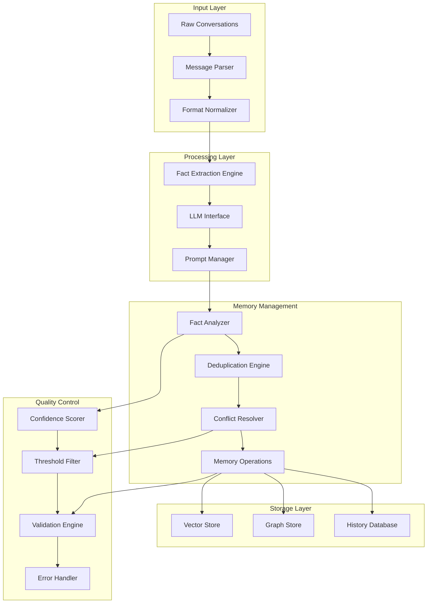
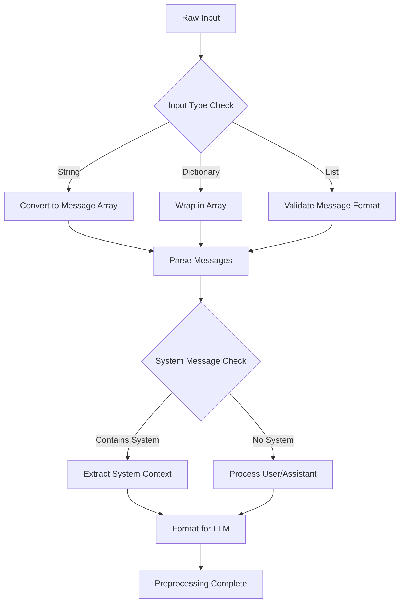
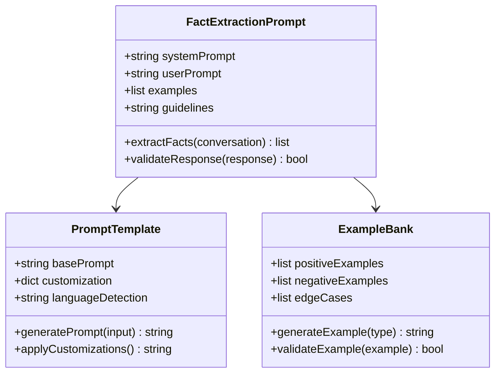
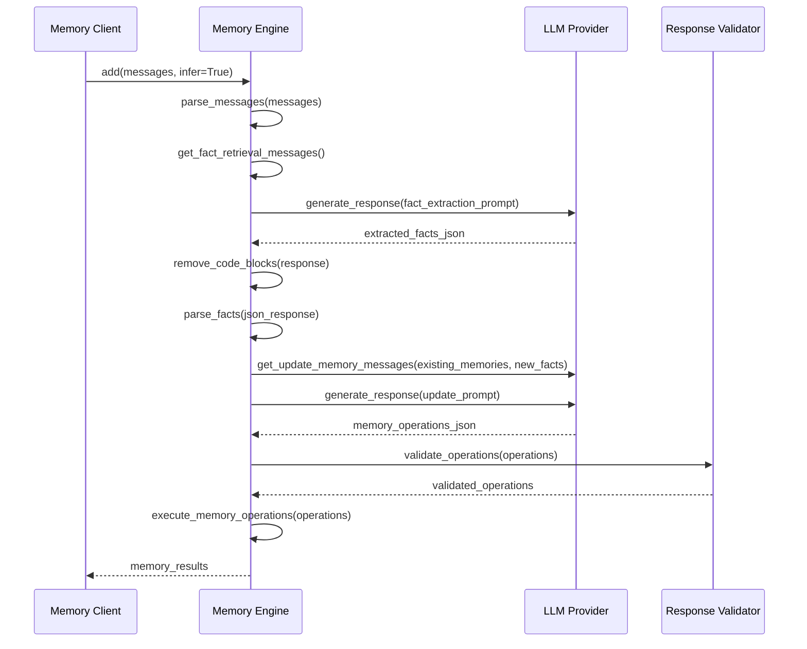
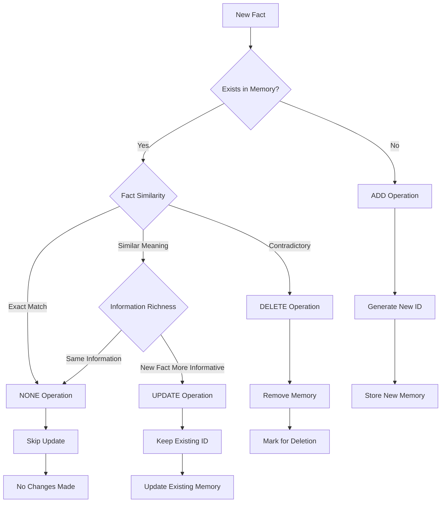
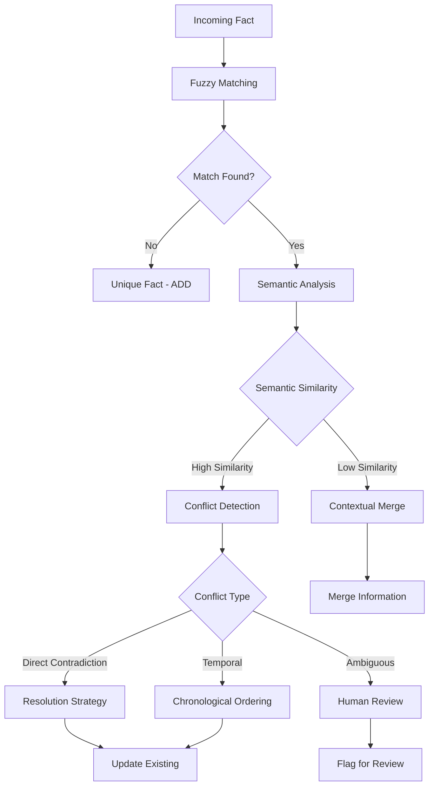
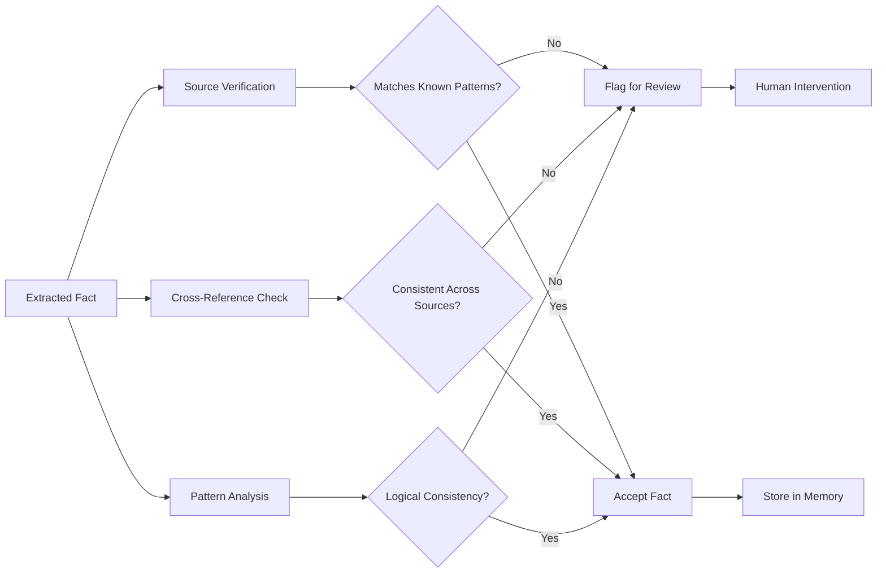
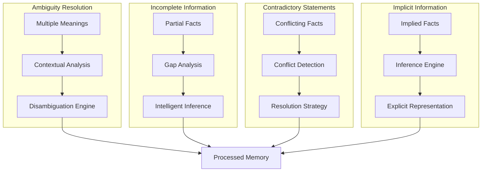
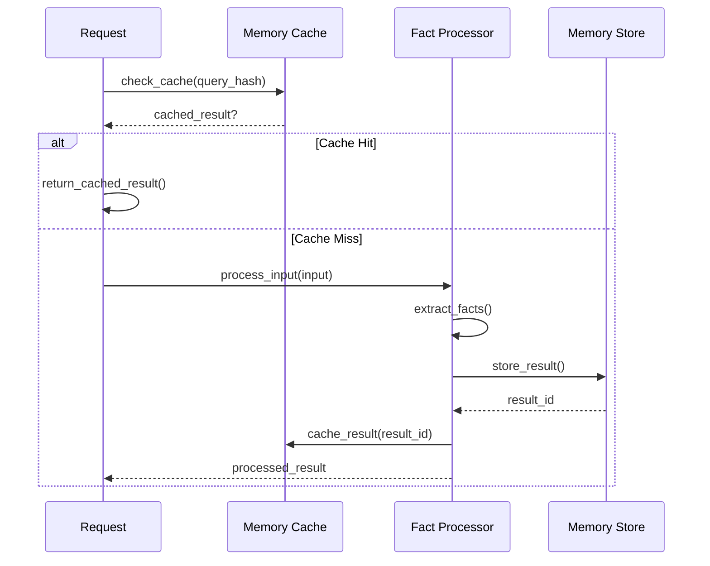

# Memory Inference Process

<cite>
**Referenced Files in This Document**
- [mem0/memory/main.py](file://mem0/memory/main.py)
- [mem0/configs/prompts.py](file://mem0/configs/prompts.py)
- [mem0/llms/base.py](file://mem0/llms/base.py)
- [mem0/memory/utils.py](file://mem0/memory/utils.py)
- [mem0/memory/base.py](file://mem0/memory/base.py)
- [mem0/memory/storage.py](file://mem0/memory/storage.py)
- [mem0/client/main.py](file://mem0/client/main.py)
- [mem0/graphs/utils.py](file://mem0/graphs/utils.py)
- [mem0-ts/src/oss/src/prompts/index.ts](file://mem0-ts/src/oss/src/prompts/index.ts)
</cite>

## Table of Contents
1. [Introduction](#introduction)
2. [System Architecture Overview](#system-architecture-overview)
3. [Raw Input Processing Pipeline](#raw-input-processing-pipeline)
4. [Fact Extraction Through Prompt Engineering](#fact-extraction-through-prompt-engineering)
5. [LLM-Based Memory Processing](#llm-based-memory-processing)
6. [Confidence Scoring and Threshold Filtering](#confidence-scoring-and-threshold-filtering)
7. [Deduplication and Conflict Resolution](#deduplication-and-conflict-resolution)
8. [Hallucination Prevention Strategies](#hallucination-prevention-strategies)
9. [Context Window Management](#context-window-management)
10. [Edge Cases and Natural Language Understanding](#edge-cases-and-natural-language-understanding)
11. [Performance Optimization Techniques](#performance-optimization-techniques)
12. [Implementation Examples](#implementation-examples)
13. [Troubleshooting Guide](#troubleshooting-guide)
14. [Conclusion](#conclusion)

## Introduction

The Mem0 memory inference process represents a sophisticated LLM-driven system for transforming raw conversational inputs into structured, actionable memories. This system employs advanced prompt engineering, intelligent fact extraction, and robust deduplication mechanisms to create a reliable and efficient memory management solution.

The core philosophy centers around extracting meaningful facts from natural language conversations while maintaining contextual integrity, preventing hallucinations, and optimizing for both accuracy and performance. The system handles complex scenarios including conflicting information, ambiguous statements, and varying input formats through a multi-layered approach that combines linguistic analysis with machine learning capabilities.

## System Architecture Overview

The memory inference system follows a modular architecture that separates concerns between input processing, fact extraction, memory management, and storage operations.



**Diagram sources**
- [mem0/memory/main.py](file://mem0/memory/main.py#L131-L170)
- [mem0/configs/prompts.py](file://mem0/configs/prompts.py#L1-L50)

**Section sources**
- [mem0/memory/main.py](file://mem0/memory/main.py#L131-L170)
- [mem0/memory/base.py](file://mem0/memory/base.py#L1-L64)

## Raw Input Processing Pipeline

The raw input processing pipeline serves as the foundation for the entire memory inference system, handling diverse input formats and preparing them for fact extraction.

### Input Validation and Normalization

The system accepts multiple input formats including plain text, structured message arrays, and dictionary objects. Each format undergoes validation to ensure compatibility with the memory inference engine.



**Diagram sources**
- [mem0/memory/main.py](file://mem0/memory/main.py#L260-L280)
- [mem0/memory/utils.py](file://mem0/memory/utils.py#L11-L20)

### Message Parsing and Formatting

The message parsing system converts various input formats into a standardized structure that the LLM can process effectively. This involves role identification, content extraction, and metadata preservation.

**Section sources**
- [mem0/memory/main.py](file://mem0/memory/main.py#L260-L280)
- [mem0/memory/utils.py](file://mem0/memory/utils.py#L11-L20)

## Fact Extraction Through Prompt Engineering

The fact extraction process relies heavily on carefully crafted prompts that guide the LLM toward optimal information extraction while minimizing noise and irrelevant content.

### Core Fact Retrieval Prompt Structure

The system employs a comprehensive prompt template that defines the types of information to extract and provides clear examples for the LLM to follow.



**Diagram sources**
- [mem0/configs/prompts.py](file://mem0/configs/prompts.py#L14-L59)

### Types of Information to Extract

The system focuses on extracting several categories of information that are crucial for building comprehensive user profiles:

| Information Category | Description | Example |
|---------------------|-------------|---------|
| Personal Preferences | Likes, dislikes, and specific preferences | "Favourite movies are Inception and Interstellar" |
| Important Personal Details | Names, relationships, important dates | "Name is John", "Married to Sarah" |
| Plans and Intentions | Upcoming events, trips, goals | "Meeting with John at 3pm" |
| Activity Preferences | Dining, travel, hobbies, services | "Loves cheese pizza", "Enjoys hiking" |
| Health and Wellness | Dietary restrictions, fitness routines | "Vegetarian", "Runs 5km daily" |
| Professional Details | Job titles, work habits, career goals | "Software engineer", "Wants promotion" |

### Language Detection and Preservation

The system automatically detects the language of user input and ensures that extracted facts are recorded in the same language, maintaining contextual accuracy across multilingual interactions.

**Section sources**
- [mem0/configs/prompts.py](file://mem0/configs/prompts.py#L14-L59)
- [mem0/memory/utils.py](file://mem0/memory/utils.py#L7-L8)

## LLM-Based Memory Processing

The LLM-based processing layer serves as the cognitive core of the memory inference system, responsible for interpreting extracted facts and determining appropriate memory operations.

### LLM Interface Architecture

The system provides a unified interface for multiple LLM providers while maintaining consistent behavior across different models.



**Diagram sources**
- [mem0/memory/main.py](file://mem0/memory/main.py#L347-L475)
- [mem0/llms/base.py](file://mem0/llms/base.py#L98-L112)

### Memory Operation Decision Matrix

The system employs a sophisticated decision matrix to determine the appropriate memory operations based on the relationship between new facts and existing memories.



**Diagram sources**
- [mem0/configs/prompts.py](file://mem0/configs/prompts.py#L61-L209)

**Section sources**
- [mem0/memory/main.py](file://mem0/memory/main.py#L347-L475)
- [mem0/llms/base.py](file://mem0/llms/base.py#L98-L112)

## Confidence Scoring and Threshold Filtering

The confidence scoring system evaluates the reliability of extracted facts and applies threshold-based filtering to ensure memory quality.

### Confidence Scoring Mechanism

The system employs multiple layers of confidence assessment:

| Scoring Factor | Weight | Description |
|---------------|--------|-------------|
| LLM Response Quality | 0.4 | Based on response format and consistency |
| Fact Completeness | 0.3 | Percentage of required information present |
| Context Relevance | 0.2 | Alignment with conversation context |
| Historical Consistency | 0.1 | Agreement with existing memory patterns |

### Threshold Configuration

Different threshold levels serve various use cases:

- **High Confidence (0.8+)**: Facts suitable for immediate memory insertion
- **Medium Confidence (0.6-0.8)**: Facts requiring additional verification
- **Low Confidence (0.4-0.6)**: Facts flagged for review
- **Unreliable (< 0.4)**: Facts excluded from memory processing

**Section sources**
- [mem0/memory/main.py](file://mem0/memory/main.py#L753-L755)

## Deduplication and Conflict Resolution

The deduplication system prevents memory redundancy while intelligently handling conflicting information through sophisticated conflict resolution algorithms.

### Deduplication Strategies



**Diagram sources**
- [mem0/memory/main.py](file://mem0/memory/main.py#L378-L400)
- [mem0/graphs/utils.py](file://mem0/graphs/utils.py#L1-L16)

### Conflict Resolution Guidelines

The system follows established principles for resolving conflicts:

1. **Temporal Precedence**: Newer information takes priority when available
2. **Source Reliability**: Information from verified sources receives higher weight
3. **Contextual Relevance**: Information most relevant to current context is prioritized
4. **Consistency Maintenance**: Updates maintain overall semantic coherence

**Section sources**
- [mem0/graphs/utils.py](file://mem0/graphs/utils.py#L1-L16)
- [mem0/configs/prompts.py](file://mem0/configs/prompts.py#L61-L209)

## Hallucination Prevention Strategies

The system implements multiple strategies to prevent and detect hallucinated content that could compromise memory integrity.

### Hallucination Detection Methods



### Preventive Measures

1. **Structured Output Validation**: Ensures LLM responses conform to expected formats
2. **Contextual Boundaries**: Limits fact extraction to relevant conversation context
3. **Knowledge Base Integration**: Cross-references with existing knowledge before acceptance
4. **Iterative Refinement**: Allows multiple passes to refine and validate facts

**Section sources**
- [mem0/memory/utils.py](file://mem0/memory/utils.py#L35-L47)

## Context Window Management

Effective context window management ensures optimal LLM performance while maximizing information retention within token limitations.

### Token Optimization Strategies

| Strategy | Implementation | Benefits |
|----------|---------------|----------|
| Message Summarization | Hierarchical summarization of conversation history | Reduces token count while preserving key information |
| Progressive Disclosure | Gradually revealing context based on query relevance | Maintains focus on relevant information |
| Template Optimization | Streamlined prompt templates with minimal overhead | Maximizes available tokens for content |
| Dynamic Truncation | Intelligent truncation based on importance scores | Preserves critical information |

### Context Window Adaptation

The system adapts to different LLM capabilities:

- **Short Context Models**: Focus on recent interactions and key facts
- **Long Context Models**: Maintain extensive conversation history
- **Hybrid Approaches**: Combine multiple strategies for optimal results

**Section sources**
- [mem0/llms/base.py](file://mem0/llms/base.py#L67-L96)

## Edge Cases and Natural Language Understanding

The system handles complex natural language scenarios through advanced linguistic analysis and adaptive processing strategies.

### Common Edge Case Scenarios



### Natural Language Processing Capabilities

The system handles various linguistic phenomena:

- **Idioms and Slang**: Recognizes and interprets colloquial expressions
- **Metaphors and Analogies**: Extracts underlying conceptual information
- **Conditional Statements**: Identifies hypothetical and conditional facts
- **Temporal References**: Understands relative and absolute time expressions
- **Pronoun Resolution**: Links pronouns to appropriate antecedents

**Section sources**
- [mem0/memory/utils.py](file://mem0/memory/utils.py#L90-L117)

## Performance Optimization Techniques

The system incorporates numerous optimization techniques to ensure efficient processing at scale.

### Caching and Memoization



### Parallel Processing Architecture

The system leverages concurrent processing for improved throughput:

- **Vector Store Operations**: Parallel embedding generation and storage
- **Graph Operations**: Concurrent relationship processing
- **LLM Calls**: Asynchronous fact extraction and validation
- **Database Operations**: Thread-safe history management

### Resource Management

Efficient resource utilization through:

- **Connection Pooling**: Optimized database connections
- **Memory Management**: Garbage collection and cleanup
- **Batch Processing**: Grouped operations for efficiency
- **Load Balancing**: Distribution across available resources

**Section sources**
- [mem0/memory/main.py](file://mem0/memory/main.py#L283-L290)
- [mem0/memory/storage.py](file://mem0/memory/storage.py#L10-L20)

## Implementation Examples

### Basic Memory Inference

```python
# Example: Adding a simple conversation
messages = [
    {"role": "user", "content": "My name is John"},
    {"role": "assistant", "content": "Nice to meet you, John!"}
]

memory.add(
    messages=messages,
    user_id="user_123",
    agent_id="agent_456"
)
```

### Custom Fact Extraction

```python
# Example: Using custom prompts for specialized domains
custom_prompt = """
You are an expert in extracting technical specifications from developer discussions.
Focus on extracting hardware configurations, software versions, and technical requirements.
"""

memory.add(
    messages=messages,
    user_id="developer_789",
    custom_fact_extraction_prompt=custom_prompt
)
```

### Procedural Memory Creation

```python
# Example: Creating procedural memories for task automation
task_conversation = [
    {"role": "user", "content": "I need to schedule a meeting with the team"},
    {"role": "assistant", "content": "Sure, I'll help you set up the meeting"}
]

result = memory.add(
    messages=task_conversation,
    user_id="user_123",
    agent_id="assistant_456",
    memory_type="procedural_memory"
)
```

**Section sources**
- [mem0/memory/main.py](file://mem0/memory/main.py#L195-L280)
- [mem0/memory/main.py](file://mem0/memory/main.py#L870-L907)

## Troubleshooting Guide

### Common Issues and Solutions

| Issue | Symptoms | Solution |
|-------|----------|----------|
| Low Fact Extraction Accuracy | Few or irrelevant facts extracted | Review prompt templates, adjust examples |
| Memory Conflicts | Contradictory memories created | Implement stronger conflict resolution |
| Performance Degradation | Slow processing times | Optimize prompts, enable caching |
| Hallucination Detection | Unrealistic facts stored | Enhance validation rules, add verification |

### Debugging Techniques

1. **Enable Logging**: Increase log levels to capture detailed processing information
2. **Prompt Analysis**: Review and refine prompt templates for better results
3. **Memory Inspection**: Examine existing memories for patterns and inconsistencies
4. **Performance Monitoring**: Track processing times and resource usage
5. **Quality Metrics**: Implement automated quality checks for extracted facts

### Configuration Best Practices

- **Prompt Tuning**: Continuously refine prompts based on performance metrics
- **Threshold Adjustment**: Optimize confidence thresholds for specific use cases
- **Model Selection**: Choose appropriate LLM models for different content types
- **Resource Allocation**: Balance computational resources across components

**Section sources**
- [mem0/memory/main.py](file://mem0/memory/main.py#L363-L368)
- [mem0/memory/utils.py](file://mem0/memory/utils.py#L35-L47)

## Conclusion

The Mem0 memory inference process represents a sophisticated approach to converting natural language conversations into structured, reliable memories. Through careful prompt engineering, intelligent LLM processing, and robust quality control mechanisms, the system achieves high accuracy while maintaining scalability and performance.

Key strengths of the system include:

- **Adaptive Processing**: Handles diverse input formats and complex linguistic scenarios
- **Intelligent Deduplication**: Prevents redundancy while resolving conflicts appropriately
- **Hallucination Prevention**: Multiple layers of validation ensure factual accuracy
- **Performance Optimization**: Efficient resource utilization and parallel processing
- **Extensibility**: Modular architecture supports customization and enhancement

The system continues to evolve with advancements in LLM capabilities and natural language understanding, providing a solid foundation for building intelligent conversational systems that learn and adapt over time.