# Memory Lifecycle

<cite>
**Referenced Files in This Document**
- [main.py](file://mem0/memory/main.py)
- [storage.py](file://mem0/memory/storage.py)
- [exceptions.py](file://mem0/exceptions.py)
- [base.py](file://mem0/memory/base.py)
- [utils.py](file://mem0/memory/utils.py)
- [setup.py](file://mem0/memory/setup.py)
- [telemetry.py](file://mem0/memory/telemetry.py)
- [main.py](file://mem0/client/main.py)
</cite>

## Table of Contents
1. [Introduction](#introduction)
2. [Memory Lifecycle Overview](#memory-lifecycle-overview)
3. [Add Operation](#add-operation)
4. [Search Operation](#search-operation)
5. [Update Operation](#update-operation)
6. [Delete Operation](#delete-operation)
7. [Storage and Persistence](#storage-and-persistence)
8. [Error Handling Patterns](#error-handling-patterns)
9. [Event Sequencing and State Transitions](#event-sequencing-and-state-transitions)
10. [Race Conditions and Consistency Models](#race-conditions-and-consistency-models)
11. [Performance Considerations](#performance-considerations)
12. [Best Practices for Production Systems](#best-practices-for-production-systems)

## Introduction

The Mem0 memory lifecycle encompasses a comprehensive system for managing persistent memory across multiple storage backends, including vector databases, graph stores, and traditional relational databases. This system provides atomic operations for adding, searching, updating, and deleting memories while maintaining consistency, tracking history, and ensuring data integrity across distributed environments.

The memory lifecycle operates through a sophisticated architecture that combines fact extraction, deduplication, embedding generation, and multi-modal storage capabilities. Each operation follows strict protocols for input validation, processing, persistence, and audit trail maintenance.

## Memory Lifecycle Overview

The memory lifecycle consists of four primary operations, each with distinct phases and state transitions:

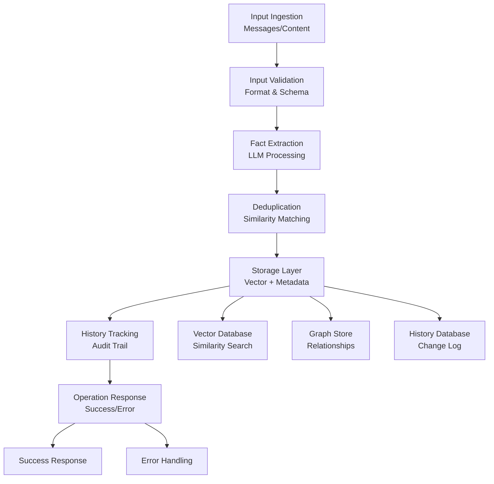

**Diagram sources**
- [main.py](file://mem0/memory/main.py#L195-L308)
- [storage.py](file://mem0/memory/storage.py#L126-L167)

Each operation maintains strict consistency guarantees through transactional patterns and implements comprehensive error handling for production reliability.

**Section sources**
- [main.py](file://mem0/memory/main.py#L195-L308)
- [base.py](file://mem0/memory/base.py#L1-L64)

## Add Operation

The add operation represents the most complex memory lifecycle phase, involving multiple subsystems and sophisticated processing logic.

### Method Signature and Flow Control

The [`add`](file://mem0/memory/main.py#L195-L308) method serves as the primary entry point for memory creation:

```python
def add(
    self,
    messages,
    *,
    user_id: Optional[str] = None,
    agent_id: Optional[str] = None,
    run_id: Optional[str] = None,
    metadata: Optional[Dict[str, Any]] = None,
    infer: bool = True,
    memory_type: Optional[str] = None,
    prompt: Optional[str] = None,
):
```

### Step-by-Step Process

#### 1. Input Validation and Filtering Construction

The operation begins with comprehensive input validation and metadata construction:

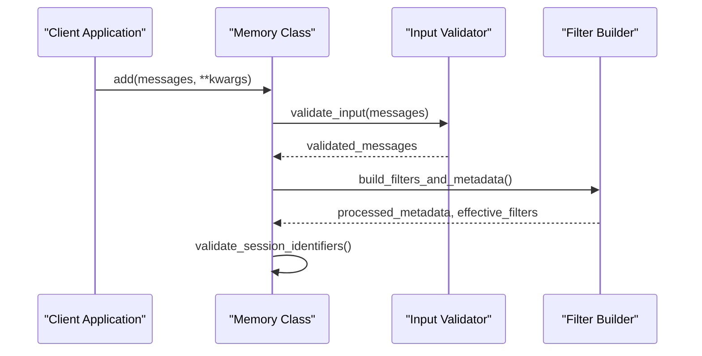

**Diagram sources**
- [main.py](file://mem0/memory/main.py#L245-L258)

#### 2. Fact Extraction and Processing

When `infer=True` (default), the system employs LLM-based fact extraction:

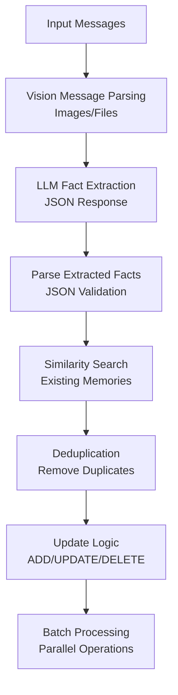

**Diagram sources**
- [main.py](file://mem0/memory/main.py#L347-L479)

#### 3. Parallel Processing Architecture

The add operation utilizes concurrent processing for optimal performance:

```python
with concurrent.futures.ThreadPoolExecutor() as executor:
    future1 = executor.submit(self._add_to_vector_store, messages, processed_metadata, effective_filters, infer)
    future2 = executor.submit(self._add_to_graph, messages, effective_filters)
    
    concurrent.futures.wait([future1, future2])
    
    vector_store_result = future1.result()
    graph_result = future2.result()
```

#### 4. Memory Creation and Embedding Generation

The [`_create_memory`](file://mem0/memory/main.py#L840-L868) method handles the core persistence logic:

```python
def _create_memory(self, data, existing_embeddings, metadata=None):
    if data in existing_embeddings:
        embeddings = existing_embeddings[data]
    else:
        embeddings = self.embedding_model.embed(data, memory_action="add")
    
    memory_id = str(uuid.uuid4())
    metadata = metadata or {}
    metadata["data"] = data
    metadata["hash"] = hashlib.md5(data.encode()).hexdigest()
    metadata["created_at"] = datetime.now(pytz.timezone("US/Pacific")).isoformat()
    
    self.vector_store.insert(
        vectors=[embeddings],
        ids=[memory_id],
        payloads=[metadata],
    )
    
    self.db.add_history(
        memory_id,
        None,
        data,
        "ADD",
        created_at=metadata.get("created_at"),
        actor_id=metadata.get("actor_id"),
        role=metadata.get("role"),
    )
```

**Section sources**
- [main.py](file://mem0/memory/main.py#L195-L308)
- [main.py](file://mem0/memory/main.py#L840-L868)

## Search Operation

The search operation enables efficient retrieval of relevant memories through vector similarity and metadata filtering.

### Method Signature and Capabilities

```python
def search(
    self,
    query: str,
    *,
    user_id: Optional[str] = None,
    agent_id: Optional[str] = None,
    run_id: Optional[str] = None,
    limit: int = 100,
    filters: Optional[Dict[str, Any]] = None,
    threshold: Optional[float] = None,
):
```

### Search Workflow

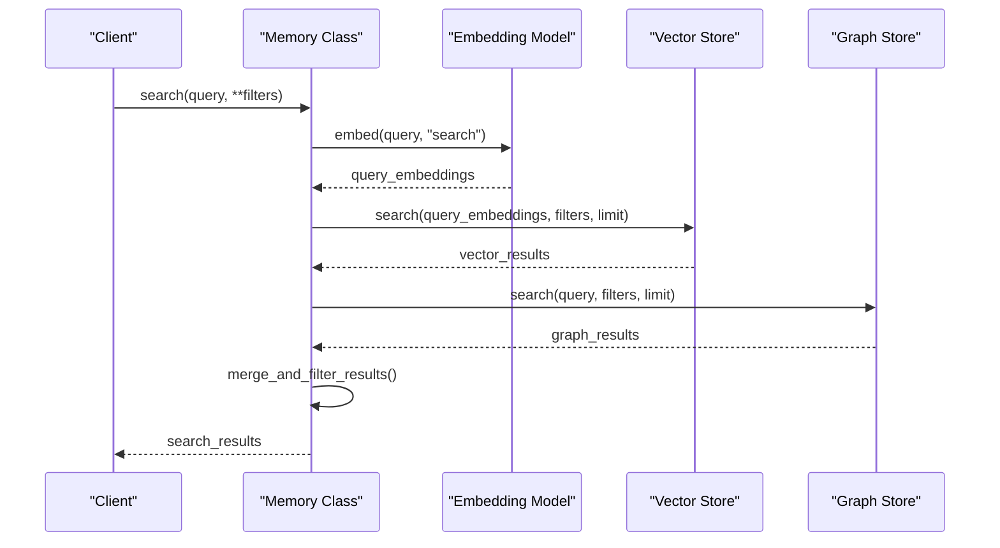

**Diagram sources**
- [main.py](file://mem0/memory/main.py#L644-L718)

### Result Processing and Scoring

The search operation returns structured results with confidence scores:

```python
def _search_vector_store(self, query, filters, limit, threshold: Optional[float] = None):
    embeddings = self.embedding_model.embed(query, "search")
    memories = self.vector_store.search(query=query, vectors=embeddings, limit=limit, filters=filters)
    
    original_memories = []
    for mem in memories:
        memory_item_dict = MemoryItem(
            id=mem.id,
            memory=mem.payload.get("data", ""),
            hash=mem.payload.get("hash"),
            created_at=mem.payload.get("created_at"),
            updated_at=mem.payload.get("updated_at"),
            score=mem.score,
        ).model_dump()
        
        if threshold is None or mem.score >= threshold:
            original_memories.append(memory_item_dict)
    
    return original_memories
```

**Section sources**
- [main.py](file://mem0/memory/main.py#L644-L718)
- [main.py](file://mem0/memory/main.py#L720-L756)

## Update Operation

The update operation modifies existing memories while maintaining historical records and consistency.

### Method Signature and Validation

```python
def update(self, memory_id, data):
    """
    Update a memory by ID.
    
    Args:
        memory_id (str): ID of the memory to update.
        data (str): New content to update the memory with.
    
    Returns:
        dict: Success message indicating the memory was updated.
    """
```

### Update Process Flow

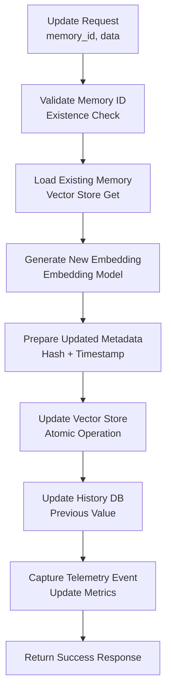

**Diagram sources**
- [main.py](file://mem0/memory/main.py#L909-L961)

### Implementation Details

The [`_update_memory`](file://mem0/memory/main.py#L909-L961) method ensures atomic updates:

```python
def _update_memory(self, memory_id, data, existing_embeddings, metadata=None):
    try:
        existing_memory = self.vector_store.get(vector_id=memory_id)
    except Exception:
        logger.error(f"Error getting memory with ID {memory_id} during update.")
        raise ValueError(f"Error getting memory with ID {memory_id}. Please provide a valid 'memory_id'")
    
    prev_value = existing_memory.payload.get("data")
    
    new_metadata = deepcopy(metadata) if metadata is not None else {}
    new_metadata["data"] = data
    new_metadata["hash"] = hashlib.md5(data.encode()).hexdigest()
    new_metadata["created_at"] = existing_memory.payload.get("created_at")
    new_metadata["updated_at"] = datetime.now(pytz.timezone("US/Pacific")).isoformat()
    
    if data in existing_embeddings:
        embeddings = existing_embeddings[data]
    else:
        embeddings = self.embedding_model.embed(data, "update")
    
    self.vector_store.update(
        vector_id=memory_id,
        vector=embeddings,
        payload=new_metadata,
    )
    
    self.db.add_history(
        memory_id,
        prev_value,
        data,
        "UPDATE",
        created_at=new_metadata["created_at"],
        updated_at=new_metadata["updated_at"],
        actor_id=new_metadata.get("actor_id"),
        role=new_metadata.get("role"),
    )
```

**Section sources**
- [main.py](file://mem0/memory/main.py#L758-L778)
- [main.py](file://mem0/memory/main.py#L909-L961)

## Delete Operation

The delete operation removes memories while preserving historical records and maintaining referential integrity.

### Method Signature and Safety Checks

```python
def delete(self, memory_id):
    """
    Delete a memory by ID.
    
    Args:
        memory_id (str): ID of the memory to delete.
    """
```

### Delete Process Implementation

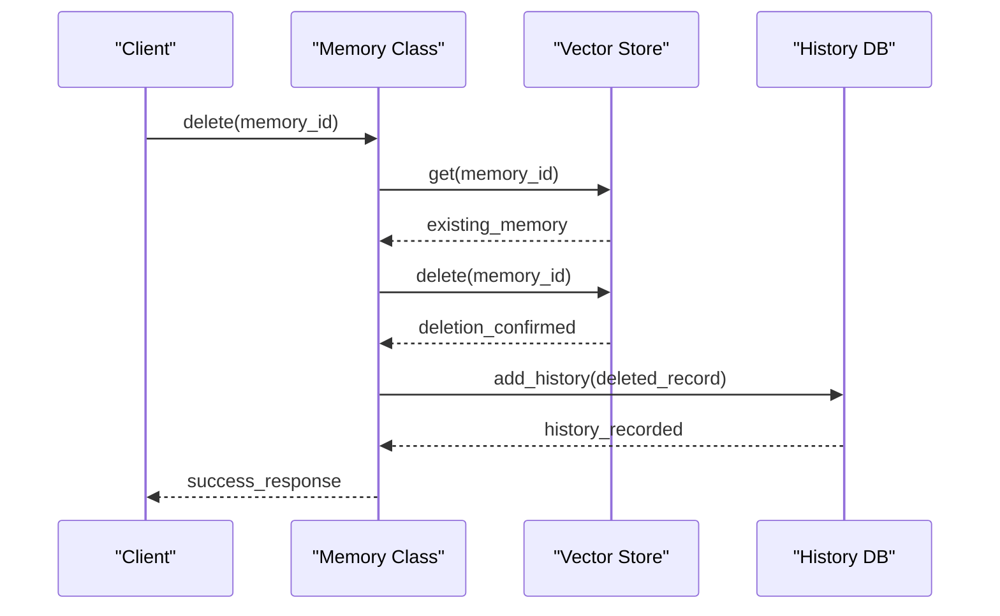

**Diagram sources**
- [main.py](file://mem0/memory/main.py#L962-L978)

### Delete Implementation

The [`_delete_memory`](file://mem0/memory/main.py#L962-L978) method ensures complete cleanup:

```python
def _delete_memory(self, memory_id):
    logger.info(f"Deleting memory with {memory_id=}")
    existing_memory = self.vector_store.get(vector_id=memory_id)
    prev_value = existing_memory.payload.get("data", "")
    self.vector_store.delete(vector_id=memory_id)
    self.db.add_history(
        memory_id,
        prev_value,
        None,
        "DELETE",
        actor_id=existing_memory.payload.get("actor_id"),
        role=existing_memory.payload.get("role"),
        is_deleted=1,
    )
    return memory_id
```

**Section sources**
- [main.py](file://mem0/memory/main.py#L780-L788)
- [main.py](file://mem0/memory/main.py#L962-L978)

## Storage and Persistence

The storage layer provides robust persistence through multiple mechanisms, ensuring data durability and consistency.

### SQLiteManager Architecture

The [`SQLiteManager`](file://mem0/memory/storage.py#L10-L219) class handles history tracking and metadata persistence:

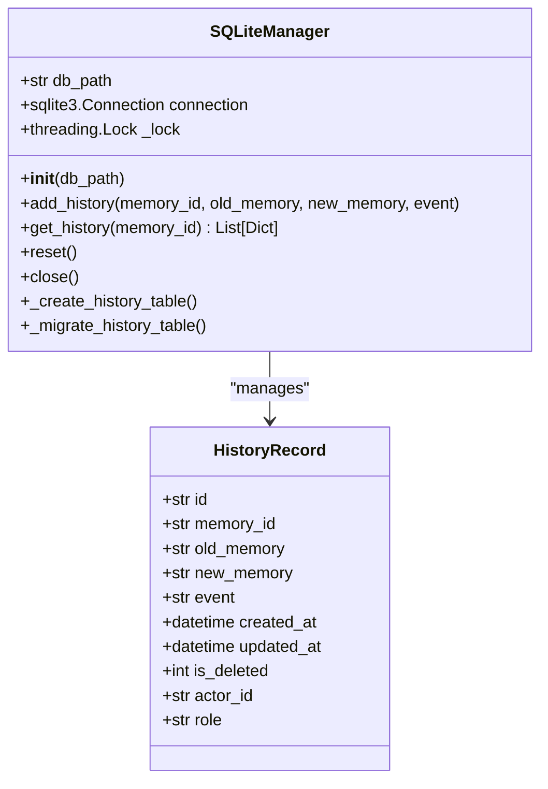

**Diagram sources**
- [storage.py](file://mem0/memory/storage.py#L10-L219)

### Transaction Management

The storage system implements robust transaction management:

```python
def add_history(self, memory_id: str, old_memory: Optional[str], new_memory: Optional[str], event: str, **kwargs):
    with self._lock:
        try:
            self.connection.execute("BEGIN")
            self.connection.execute(
                """
                INSERT INTO history (
                    id, memory_id, old_memory, new_memory, event,
                    created_at, updated_at, is_deleted, actor_id, role
                )
                VALUES (?, ?, ?, ?, ?, ?, ?, ?, ?, ?)
                """,
                (
                    str(uuid.uuid4()),
                    memory_id,
                    old_memory,
                    new_memory,
                    event,
                    kwargs.get("created_at"),
                    kwargs.get("updated_at"),
                    kwargs.get("is_deleted", 0),
                    kwargs.get("actor_id"),
                    kwargs.get("role"),
                ),
            )
            self.connection.execute("COMMIT")
        except Exception as e:
            self.connection.execute("ROLLBACK")
            logger.error(f"Failed to add history record: {e}")
            raise
```

### Migration and Schema Evolution

The system supports automatic schema migration for backward compatibility:

```python
def _migrate_history_table(self) -> None:
    """Migrate history table to new schema"""
    with self._lock:
        try:
            self.connection.execute("BEGIN")
            # Check if migration needed
            cur.execute("PRAGMA table_info(history)")
            old_cols = {row[1] for row in cur.fetchall()}
            
            expected_cols = {
                "id", "memory_id", "old_memory", "new_memory", "event",
                "created_at", "updated_at", "is_deleted", "actor_id", "role"
            }
            
            if old_cols != expected_cols:
                # Perform migration steps...
                self.connection.execute("COMMIT")
        except Exception as e:
            self.connection.execute("ROLLBACK")
            raise
```

**Section sources**
- [storage.py](file://mem0/memory/storage.py#L10-L219)

## Error Handling Patterns

The system implements comprehensive error handling through structured exception classes and retry mechanisms.

### Exception Hierarchy

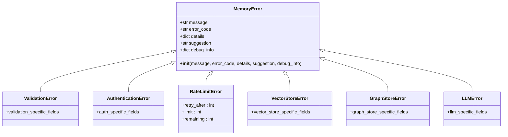

**Diagram sources**
- [exceptions.py](file://mem0/exceptions.py#L34-L503)

### Error Handling Implementation

The [`create_exception_from_response`](file://mem0/exceptions.py#L442-L503) function provides HTTP status code mapping:

```python
def create_exception_from_response(
    status_code: int,
    response_text: str,
    error_code: Optional[str] = None,
    details: Optional[Dict[str, Any]] = None,
    debug_info: Optional[Dict[str, Any]] = None,
) -> MemoryError:
    """Create appropriate exception based on HTTP response."""
    exception_class = HTTP_STATUS_TO_EXCEPTION.get(status_code, MemoryError)
    
    # Generate error code if not provided
    if not error_code:
        error_code = f"HTTP_{status_code}"
    
    # Create suggestion based on status code
    suggestions = {
        400: "Please check your request parameters and try again",
        401: "Please check your API key and authentication credentials",
        403: "You don't have permission to perform this operation",
        404: "The requested resource was not found",
        429: "Rate limit exceeded. Please wait before making more requests",
        500: "Internal server error. Please try again later",
    }
    
    suggestion = suggestions.get(status_code, "Please try again later")
    
    return exception_class(
        message=response_text or f"HTTP {status_code} error",
        error_code=error_code,
        details=details or {},
        suggestion=suggestion,
        debug_info=debug_info or {},
    )
```

### Retry and Backoff Patterns

Production systems implement exponential backoff for transient failures:

```python
def handle_rate_limit(exception: RateLimitError, max_retries: int = 3):
    """Handle rate limiting with exponential backoff."""
    retry_after = exception.debug_info.get('retry_after', 60)
    for attempt in range(max_retries):
        try:
            # Wait with exponential backoff
            wait_time = retry_after * (2 ** attempt)
            time.sleep(wait_time)
            
            # Retry operation
            return perform_operation()
        except RateLimitError as e:
            if attempt == max_retries - 1:
                raise
            retry_after = e.debug_info.get('retry_after', 60)
```

**Section sources**
- [exceptions.py](file://mem0/exceptions.py#L34-L503)

## Event Sequencing and State Transitions

The memory lifecycle implements comprehensive event tracking and state management through telemetry and audit trails.

### Event Capture Architecture

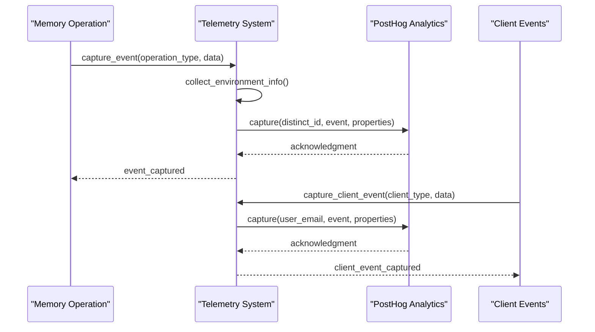

**Diagram sources**
- [telemetry.py](file://mem0/memory/telemetry.py#L58-L91)

### State Transition Patterns

Each memory operation follows specific state transition patterns:

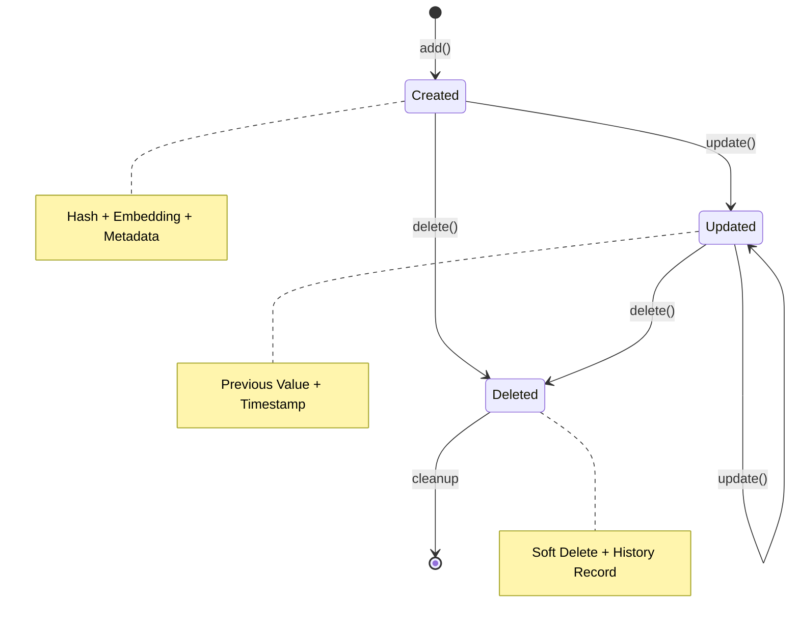

### Telemetry Data Collection

The telemetry system captures comprehensive operational metrics:

```python
def capture_event(event_name, memory_instance, additional_data=None):
    event_data = {
        "collection": memory_instance.collection_name,
        "vector_size": memory_instance.embedding_model.config.embedding_dims,
        "history_store": "sqlite",
        "graph_store": f"{memory_instance.graph.__class__.__module__}.{memory_instance.graph.__class__.__name__}"
        if memory_instance.config.graph_store.config
        else None,
        "vector_store": f"{memory_instance.vector_store.__class__.__module__}.{memory_instance.vector_store.__class__.__name__}",
        "llm": f"{memory_instance.llm.__class__.__module__}.{memory_instance.llm.__class__.__name__}",
        "embedding_model": f"{memory_instance.embedding_model.__class__.__module__}.{memory_instance.embedding_model.__class__.__name__}",
        "function": f"{memory_instance.__class__.__module__}.{memory_instance.__class__.__name__}.{memory_instance.api_version}",
    }
    if additional_data:
        event_data.update(additional_data)
    
    oss_telemetry.capture_event(event_name, event_data)
```

**Section sources**
- [telemetry.py](file://mem0/memory/telemetry.py#L58-L91)

## Race Conditions and Consistency Models

The system implements multiple consistency models and race condition prevention mechanisms.

### Consistency Guarantees

#### ACID Properties Implementation

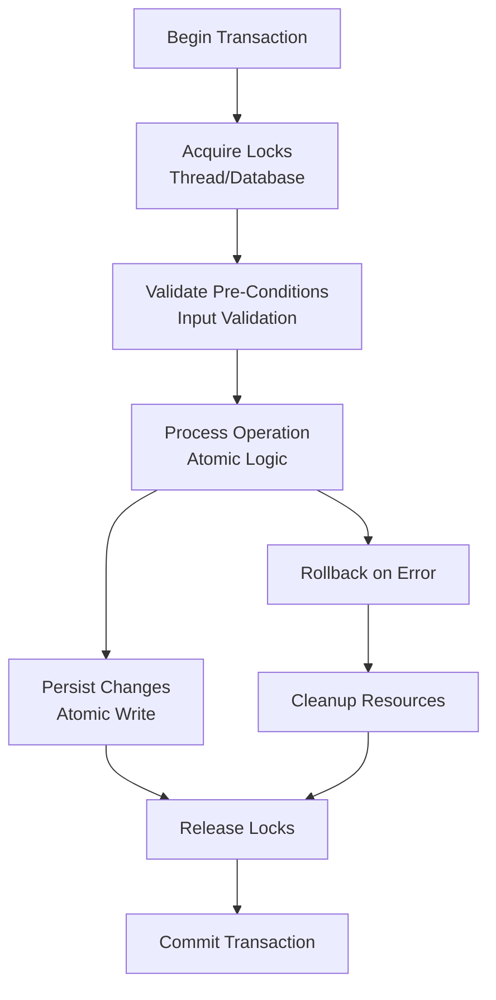

#### Concurrent Processing Safety

The system uses thread-safe patterns for concurrent operations:

```python
# Thread-safe history recording
def add_history(self, memory_id: str, old_memory: Optional[str], new_memory: Optional[str], event: str, **kwargs):
    with self._lock:  # Global lock for thread safety
        try:
            self.connection.execute("BEGIN")
            # Atomic history insertion
            self.connection.execute(...)
            self.connection.execute("COMMIT")
        except Exception as e:
            self.connection.execute("ROLLBACK")
            raise
```

### Race Condition Prevention

#### UUID-Based Deduplication

The system prevents duplicate memory creation through UUID-based deduplication:

```python
def _create_memory(self, data, existing_embeddings, metadata=None):
    memory_id = str(uuid.uuid4())  # Guaranteed unique per operation
    
    # Prevent duplicate processing
    if data in existing_embeddings:
        embeddings = existing_embeddings[data]
    else:
        embeddings = self.embedding_model.embed(data, memory_action="add")
    
    # Atomic insertion with uniqueness constraint
    self.vector_store.insert(
        vectors=[embeddings],
        ids=[memory_id],
        payloads=[metadata],
    )
```

#### Optimistic Concurrency Control

For update operations, the system implements optimistic concurrency:

```python
def _update_memory(self, memory_id, data, existing_embeddings, metadata=None):
    # Load current state
    existing_memory = self.vector_store.get(vector_id=memory_id)
    current_hash = existing_memory.payload.get("hash")
    
    # Calculate expected hash
    expected_hash = hashlib.md5(data.encode()).hexdigest()
    
    # Compare and update atomically
    if current_hash == expected_hash:
        # Proceed with update
        self.vector_store.update(...)
    else:
        # Conflict detected - handle appropriately
        raise ValueError("Memory has been modified by another process")
```

**Section sources**
- [storage.py](file://mem0/memory/storage.py#L126-L167)
- [main.py](file://mem0/memory/main.py#L840-L868)

## Performance Considerations

High-frequency memory operations require careful optimization across multiple dimensions.

### Embedding Generation Optimization

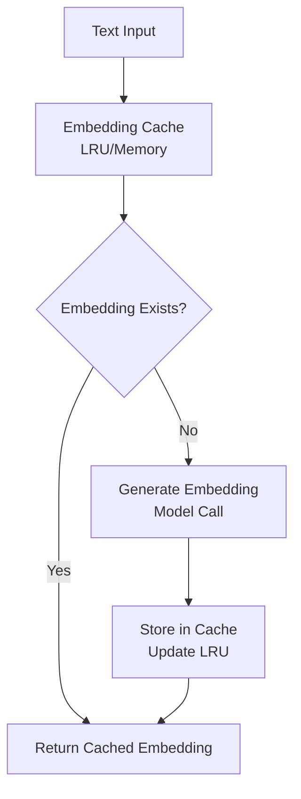

### Batch Processing Strategies

For high-frequency operations, batch processing provides significant performance improvements:

```python
def batch_add(self, messages_list, **kwargs):
    """Optimized batch add operation for high-frequency scenarios."""
    with concurrent.futures.ThreadPoolExecutor(max_workers=4) as executor:
        futures = []
        for messages in messages_list:
            future = executor.submit(self.add, messages, **kwargs)
            futures.append(future)
        
        results = []
        for future in concurrent.futures.as_completed(futures):
            results.append(future.result())
    
    return results
```

### Caching Strategies

The system implements multi-level caching:

```python
class MemoryCache:
    def __init__(self, max_size=1000, ttl=300):
        self.cache = {}
        self.timestamps = {}
        self.max_size = max_size
        self.ttl = ttl
    
    def get(self, key):
        if key in self.cache:
            if time.time() - self.timestamps[key] < self.ttl:
                return self.cache[key]
            else:
                del self.cache[key]
                del self.timestamps[key]
        return None
    
    def set(self, key, value):
        if len(self.cache) >= self.max_size:
            # Remove oldest entry
            oldest_key = min(self.timestamps, key=lambda k: self.timestamps[k])
            del self.cache[oldest_key]
            del self.timestamps[oldest_key]
        
        self.cache[key] = value
        self.timestamps[key] = time.time()
```

### Vector Store Optimization

#### Indexing Strategies

Different vector stores implement optimized indexing:

```python
# FAISS optimized indexing
class FaissVectorStore:
    def __init__(self, dimension, index_type="IVF"):
        if index_type == "IVF":
            # Inverted File index for large datasets
            quantizer = faiss.IndexFlatL2(dimension)
            self.index = faiss.IndexIVFFlat(quantizer, dimension, 100)
        elif index_type == "HNSW":
            # Hierarchical Navigable Small World for fast search
            self.index = faiss.IndexHNSWFlat(dimension, 32)
```

#### Query Optimization

```python
def optimized_search(self, query, filters=None, limit=100):
    """Optimized search with pre-filtering and batch processing."""
    # Pre-filter based on metadata
    filtered_ids = self.apply_filters(filters)
    
    # Batch embedding generation
    batch_embeddings = self.embedding_model.batch_embed(queries)
    
    # Parallel similarity computation
    with ThreadPoolExecutor() as executor:
        futures = [
            executor.submit(self.compute_similarity, query_emb, filtered_ids)
            for query_emb in batch_embeddings
        ]
        
        results = []
        for future in as_completed(futures):
            results.extend(future.result())
    
    return sorted(results, key=lambda x: x['score'], reverse=True)[:limit]
```

**Section sources**
- [main.py](file://mem0/memory/main.py#L283-L291)
- [utils.py](file://mem0/memory/utils.py#L120-L135)

## Best Practices for Production Systems

### Configuration Management

```python
# Production configuration example
production_config = {
    "vector_store": {
        "provider": "chroma",
        "config": {
            "host": "vector-db.example.com",
            "port": 8000,
            "collection_name": "production_memories",
            "distance_function": "cosine"
        }
    },
    "embedder": {
        "provider": "openai",
        "config": {
            "model": "text-embedding-3-small",
            "dimensions": 1536
        }
    },
    "llm": {
        "provider": "openai",
        "config": {
            "model": "gpt-4",
            "temperature": 0.1
        }
    },
    "graph_store": {
        "provider": "neo4j",
        "config": {
            "uri": "bolt://graph-db.example.com:7687",
            "database": "memories"
        }
    }
}
```

### Monitoring and Alerting

```python
class MemoryMonitor:
    def __init__(self):
        self.metrics = {
            "operations_per_second": [],
            "average_latency": [],
            "error_rate": [],
            "cache_hit_rate": []
        }
    
    def track_operation(self, operation_type, latency, success=True):
        """Track memory operation metrics."""
        self.metrics["operations_per_second"].append({
            "timestamp": time.time(),
            "operation_type": operation_type,
            "success": success
        })
        
        self.metrics["average_latency"].append(latency)
        
        if not success:
            self.metrics["error_rate"].append(1)
        else:
            self.metrics["error_rate"].append(0)
    
    def alert_on_thresholds(self):
        """Alert on performance thresholds."""
        avg_latency = sum(self.metrics["average_latency"]) / len(self.metrics["average_latency"])
        error_rate = sum(self.metrics["error_rate"]) / len(self.metrics["error_rate"])
        
        if avg_latency > 1.0:  # 1 second threshold
            self.send_alert("High memory operation latency")
        
        if error_rate > 0.05:  # 5% error rate threshold
            self.send_alert("High memory operation error rate")
```

### Data Retention Policies

```python
class MemoryRetentionPolicy:
    def __init__(self, retention_days=30, cleanup_interval_hours=24):
        self.retention_days = retention_days
        self.cleanup_interval = timedelta(hours=cleanup_interval_hours)
    
    def cleanup_expired_memories(self):
        """Clean up memories older than retention period."""
        cutoff_date = datetime.now() - timedelta(days=self.retention_days)
        
        # Find expired memories
        expired_memories = self.db.find_expired(cutoff_date)
        
        # Batch delete for efficiency
        batch_size = 1000
        for i in range(0, len(expired_memories), batch_size):
            batch = expired_memories[i:i + batch_size]
            self.batch_delete(batch)
        
        # Vacuum database
        self.db.vacuum()
```

### Security Considerations

```python
class MemorySecurity:
    def __init__(self):
        self.encryption_key = self.generate_encryption_key()
        self.access_control = AccessControl()
    
    def encrypt_memory_content(self, content):
        """Encrypt memory content before storage."""
        cipher = Fernet(self.encryption_key)
        return cipher.encrypt(content.encode()).decode()
    
    def decrypt_memory_content(self, encrypted_content):
        """Decrypt memory content for retrieval."""
        cipher = Fernet(self.encryption_key)
        return cipher.decrypt(encrypted_content.encode()).decode()
    
    def enforce_access_control(self, user_id, memory_id):
        """Enforce access control policies."""
        if not self.access_control.can_access(user_id, memory_id):
            raise PermissionError("Access denied to memory")
```

### Disaster Recovery

```python
class MemoryDisasterRecovery:
    def __init__(self, backup_interval_hours=24):
        self.backup_interval = timedelta(hours=backup_interval_hours)
        self.last_backup = None
    
    def create_backup(self):
        """Create comprehensive backup of memory system."""
        backup_data = {
            "vector_store": self.export_vector_store(),
            "graph_store": self.export_graph_store(),
            "history_database": self.export_history_database(),
            "configuration": self.export_configuration(),
            "timestamp": datetime.now().isoformat()
        }
        
        # Compress and encrypt backup
        compressed_backup = gzip.compress(json.dumps(backup_data).encode())
        encrypted_backup = self.encrypt_backup(compressed_backup)
        
        # Store in secure location
        self.store_backup(encrypted_backup)
        
        self.last_backup = datetime.now()
    
    def restore_from_backup(self, backup_id):
        """Restore memory system from backup."""
        encrypted_backup = self.retrieve_backup(backup_id)
        compressed_backup = self.decrypt_backup(encrypted_backup)
        backup_data = json.loads(gzip.decompress(compressed_backup))
        
        # Restore in order to maintain consistency
        self.restore_configuration(backup_data["configuration"])
        self.restore_history_database(backup_data["history_database"])
        self.restore_vector_store(backup_data["vector_store"])
        self.restore_graph_store(backup_data["graph_store"])
```

These best practices ensure reliable, scalable, and secure memory operations in production environments, with comprehensive monitoring, automated maintenance, and disaster recovery capabilities.