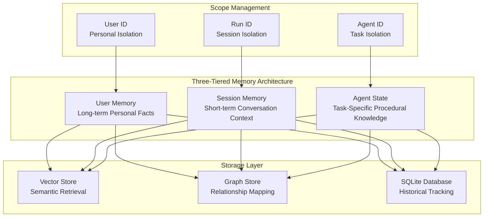
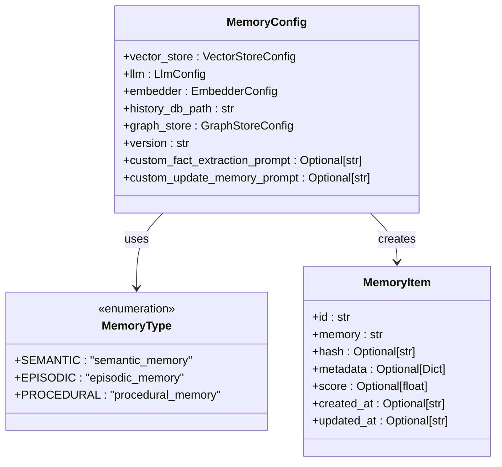
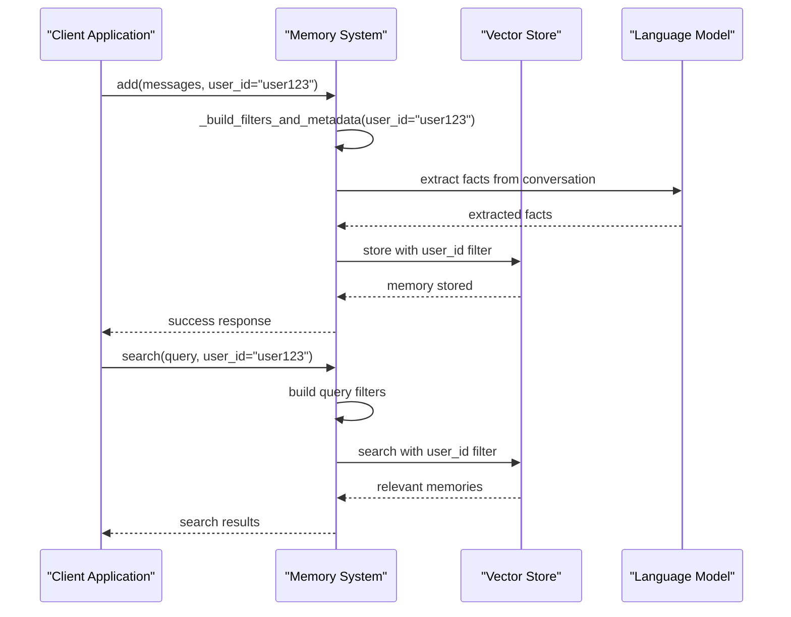
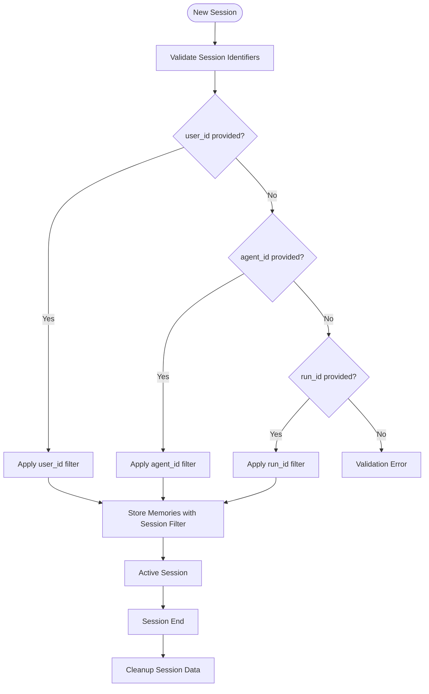
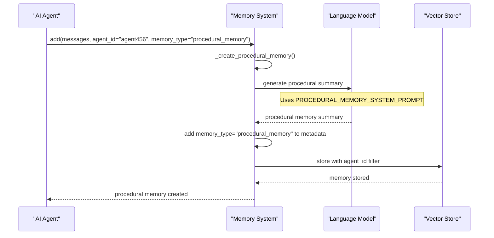
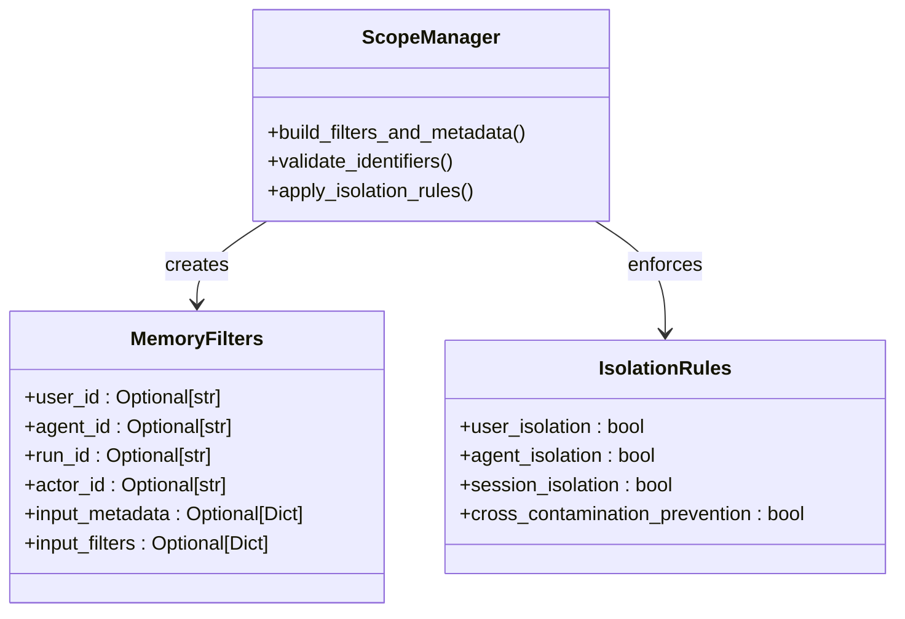
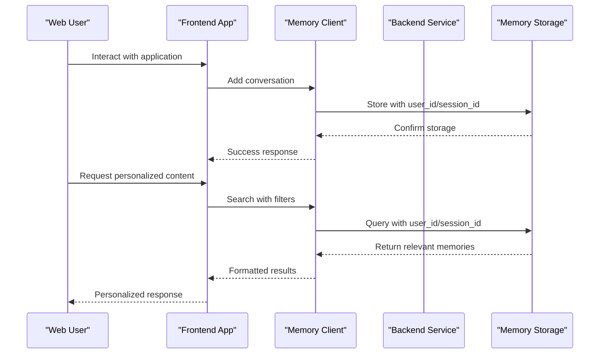

# Memory Types

<cite>
**Referenced Files in This Document**
- [mem0/memory/main.py](file://mem0/memory/main.py)
- [mem0/memory/base.py](file://mem0/memory/base.py)
- [mem0/client/main.py](file://mem0/client/main.py)
- [mem0/configs/base.py](file://mem0/configs/base.py)
- [mem0/configs/enums.py](file://mem0/configs/enums.py)
- [mem0/configs/prompts.py](file://mem0/configs/prompts.py)
- [examples/multimodal-demo/src/hooks/useChat.ts](file://examples/multimodal-demo/src/hooks/useChat.ts)
- [LLM.md](file://LLM.md)
</cite>

## Table of Contents
1. [Introduction](#introduction)
2. [Three-Tiered Memory Architecture](#three-tiered-memory-architecture)
3. [Memory Types Overview](#memory-types-overview)
4. [User Memory System](#user-memory-system)
5. [Session Memory System](#session-memory-system)
6. [Agent State Management](#agent-state-management)
7. [Configuration and Scope Management](#configuration-and-scope-management)
8. [Implementation Examples](#implementation-examples)
9. [Integration Patterns](#integration-patterns)
10. [Best Practices and Troubleshooting](#best-practices-and-troubleshooting)
11. [Conclusion](#conclusion)

## Introduction

The Mem0 memory system implements a sophisticated three-tiered architecture designed to manage different types of information persistence in AI applications. This system enables intelligent personalization, contextual awareness, and task-specific knowledge management through distinct memory layers: User memory for long-term personal facts, Session memory for short-term conversation context, and Agent state for procedural knowledge.

The memory system operates on the principle of scope-based isolation, where each memory type serves specific purposes while maintaining clear boundaries to prevent data leakage and ensure appropriate information retrieval. This architecture supports both real-time conversation management and long-term learning capabilities, making it suitable for diverse AI applications from personal assistants to complex multi-agent systems.

## Three-Tiered Memory Architecture

The Mem0 memory system is built around three fundamental memory types, each serving distinct purposes in the overall architecture:



**Diagram sources**
- [mem0/memory/main.py](file://mem0/memory/main.py#L46-L126)
- [mem0/configs/enums.py](file://mem0/configs/enums.py#L4-L8)

Each memory tier operates independently while maintaining coordination through the scope management system. The architecture ensures that memories are appropriately isolated based on their intended use case, preventing cross-contamination of different memory types.

**Section sources**
- [mem0/memory/main.py](file://mem0/memory/main.py#L46-L126)
- [mem0/configs/enums.py](file://mem0/configs/enums.py#L4-L8)

## Memory Types Overview

The Mem0 system defines three primary memory types, each with specific characteristics and use cases:

| Memory Type | Purpose | Duration | Scope | Use Cases |
|-------------|---------|----------|-------|-----------|
| **User Memory** | Long-term personal facts and preferences | Persistent | User-wide | Personalized recommendations, user profiling, preference learning |
| **Session Memory** | Short-term conversation context | Temporary | Session-specific | Current conversation state, recent interactions, immediate context |
| **Agent State** | Task-specific procedural knowledge | Persistent | Agent-specific | Workflow automation, task execution, procedural memory |

### Memory Type Definitions

The memory types are formally defined in the system's enumeration structure:



**Diagram sources**
- [mem0/configs/enums.py](file://mem0/configs/enums.py#L4-L8)
- [mem0/configs/base.py](file://mem0/configs/base.py#L16-L30)

**Section sources**
- [mem0/configs/enums.py](file://mem0/configs/enums.py#L4-L8)
- [mem0/configs/base.py](file://mem0/configs/base.py#L16-L30)

## User Memory System

User memory serves as the foundation for long-term personalization, storing persistent facts about individuals that inform all interactions across different sessions and contexts.

### User Memory Characteristics

User memory exhibits several key characteristics that distinguish it from other memory types:

- **Persistence**: Memories persist across sessions and are retained until explicitly modified or deleted
- **Personalization**: Focuses exclusively on individual user attributes, preferences, and historical interactions
- **Semantic Storage**: Utilizes semantic embeddings for meaningful retrieval based on concept rather than exact match
- **Privacy Isolation**: Strict isolation ensures user data remains confidential and accessible only to authorized contexts

### User Memory Implementation

The user memory system operates through a sophisticated filtering mechanism that ensures proper scope isolation:



**Diagram sources**
- [mem0/memory/main.py](file://mem0/memory/main.py#L46-L126)
- [mem0/memory/main.py](file://mem0/memory/main.py#L195-L308)

### User Memory Use Cases

User memory excels in scenarios requiring long-term personalization and contextual understanding:

1. **Personalized Recommendations**: Learning user preferences for content, products, or services
2. **Contextual Awareness**: Maintaining awareness of user relationships, roles, and organizational context
3. **Preference Learning**: Gradually building understanding of user tastes and habits
4. **Knowledge Accumulation**: Storing important personal information and experiences

**Section sources**
- [mem0/memory/main.py](file://mem0/memory/main.py#L46-L126)
- [mem0/memory/main.py](file://mem0/memory/main.py#L195-L308)

## Session Memory System

Session memory manages short-term conversation context, providing temporary storage for the current interaction while maintaining appropriate isolation from other sessions.

### Session Memory Architecture

Session memory operates through a dynamic scope management system that automatically handles session lifecycle:



**Diagram sources**
- [mem0/memory/main.py](file://mem0/memory/main.py#L46-L126)

### Session Memory Management

The session memory system provides automatic lifecycle management through scope-based filtering:

- **Automatic Creation**: Sessions are automatically created when memory operations include session identifiers
- **Temporary Storage**: Memories are retained only for the duration of the session
- **Isolation**: Each session maintains complete isolation from other sessions
- **Cleanup**: Automatic cleanup occurs when sessions terminate

### Session Memory Patterns

Common patterns for session memory utilization include:

1. **Conversation Context**: Maintaining context for multi-turn conversations
2. **Workflow Tracking**: Tracking progress through multi-step processes
3. **Temporary State**: Storing intermediate results during complex operations
4. **Real-time Interaction**: Supporting immediate response capabilities

**Section sources**
- [mem0/memory/main.py](file://mem0/memory/main.py#L46-L126)
- [mem0/memory/main.py](file://mem0/memory/main.py#L309-L481)

## Agent State Management

Agent state manages task-specific procedural knowledge, enabling agents to maintain awareness of their current tasks, progress, and execution context.

### Procedural Memory Creation

Procedural memory creation involves sophisticated processing to extract task-relevant information:



**Diagram sources**
- [mem0/memory/main.py](file://mem0/memory/main.py#L878-L908)
- [mem0/configs/prompts.py](file://mem0/configs/prompts.py#L211-L288)

### Agent State Characteristics

Agent state exhibits unique characteristics suited for task management:

- **Task-Specific**: Focused exclusively on current task execution and progress
- **Procedural Focus**: Emphasizes actions, decisions, and execution sequences
- **Persistent Within Session**: Retains state across related operations within a session
- **Execution Context**: Maintains awareness of current execution context and progress

### Procedural Memory Structure

Procedural memories follow a structured format that captures execution history comprehensively:

| Component | Description | Example |
|-----------|-------------|---------|
| **Task Objective** | Overall goal being accomplished | "Scrape blog post titles and content" |
| **Progress Status** | Current completion percentage and milestones | "75% complete - 15 out of 20 blog posts processed" |
| **Agent Actions** | Specific actions taken by the agent | "Clicked on 'Blog' link", "Extracted post URLs" |
| **Action Results** | Exact outputs from agent actions | "Navigated to https://site.com/blog/" |
| **Embedded Metadata** | Additional context and findings | "Visited 3 blog pages, extracted 15 posts" |

**Section sources**
- [mem0/memory/main.py](file://mem0/memory/main.py#L878-L908)
- [mem0/configs/prompts.py](file://mem0/configs/prompts.py#L211-L288)

## Configuration and Scope Management

The memory system's behavior is controlled through comprehensive configuration parameters that affect memory isolation, retrieval, and persistence.

### Scope-Based Filtering System

The scope management system provides sophisticated filtering capabilities:



**Diagram sources**
- [mem0/memory/main.py](file://mem0/memory/main.py#L46-L126)

### Configuration Parameters

Key configuration parameters that affect memory behavior include:

| Parameter | Type | Purpose | Default |
|-----------|------|---------|---------|
| **user_id** | Optional[str] | User identification for personal memory | None |
| **agent_id** | Optional[str] | Agent identification for procedural memory | None |
| **run_id** | Optional[str] | Session identification for conversation memory | None |
| **actor_id** | Optional[str] | Actor identification for fine-grained filtering | None |
| **memory_type** | Optional[str] | Type of memory to create | None |
| **infer** | bool | Enable automatic fact extraction | True |
| **threshold** | Optional[float] | Similarity threshold for retrieval | None |

### Memory Isolation Strategies

The system employs multiple isolation strategies to ensure proper memory separation:

1. **User Isolation**: Prevents cross-user data access
2. **Agent Isolation**: Maintains separate state for different agents
3. **Session Isolation**: Ensures session boundaries are respected
4. **Temporal Isolation**: Manages memory lifecycle and cleanup

**Section sources**
- [mem0/memory/main.py](file://mem0/memory/main.py#L46-L126)
- [mem0/configs/base.py](file://mem0/configs/base.py#L30-L61)

## Implementation Examples

### Basic Memory Operations

Here are practical examples of how to implement different memory types in real applications:

#### User Memory Example

```python
# Initialize memory system
memory = Memory()

# Add user-specific information
memory.add([
    {"role": "user", "content": "My name is John Smith"},
    {"role": "user", "content": "I work as a software engineer"}
], user_id="john_doe_123")

# Retrieve user memories
memories = memory.search("personal information", user_id="john_doe_123")
```

#### Session Memory Example

```python
# Session-based conversation
conversation_history = [
    {"role": "user", "content": "What's the weather like today?"},
    {"role": "assistant", "content": "It's sunny with a high of 72°F."}
]

# Store session context
memory.add(conversation_history, run_id="session_456")

# Search within session context
contextual_results = memory.search("weather", run_id="session_456")
```

#### Agent State Example

```python
# Create procedural memory for agent task
agent_task = [
    {"role": "user", "content": "Scrape blog posts from website"},
    {"role": "assistant", "content": "Navigated to homepage"},
    {"role": "assistant", "content": "Located blog section"}
]

memory.add(agent_task, 
          agent_id="scraping_agent_001", 
          memory_type="procedural_memory")
```

### Advanced Integration Patterns

#### Multi-Agent Coordination

```python
# Agent 1: Planning
planning_agent.add([
    {"role": "user", "content": "Plan a trip to Paris"},
    {"role": "assistant", "content": "Identified key attractions"}
], agent_id="planner_001", memory_type="procedural_memory")

# Agent 2: Booking
booking_agent.add([
    {"role": "user", "content": "Book flights to Paris"},
    {"role": "assistant", "content": "Found available flights"}
], agent_id="booker_002", memory_type="procedural_memory")

# Agent 3: Coordination
coordination_agent.search("trip planning", agent_id="coordinator_003")
```

#### Personalized Recommendation System

```python
# User memory for preferences
user_preferences = [
    {"role": "user", "content": "I prefer Italian cuisine"},
    {"role": "user", "content": "Avoid spicy food"}
]

memory.add(user_preferences, user_id="user_789")

# Session memory for current context
current_session = [
    {"role": "user", "content": "Find restaurants near me"}
]

memory.add(current_session, run_id="session_abc")

# Retrieve combined context
combined_context = memory.search("restaurant recommendations", 
                               user_id="user_789", 
                               run_id="session_abc")
```

**Section sources**
- [examples/multimodal-demo/src/hooks/useChat.ts](file://examples/multimodal-demo/src/hooks/useChat.ts#L38-L61)
- [mem0/memory/main.py](file://mem0/memory/main.py#L195-L308)

## Integration Patterns

### Web Application Integration

Modern web applications benefit from seamless memory integration patterns:



### Microservice Architecture

In microservice environments, memory systems integrate through standardized APIs:

| Service | Memory Responsibility | Integration Pattern |
|---------|----------------------|-------------------|
| **User Service** | User profile and preferences | User memory operations |
| **Session Service** | Conversation context | Session memory management |
| **Agent Service** | Task execution state | Agent state maintenance |
| **Memory Service** | Centralized storage | Unified API access |

### Real-Time Applications

Real-time applications require efficient memory management for responsive interactions:

1. **Streaming Memory Updates**: Real-time synchronization of memory changes
2. **Caching Strategies**: Intelligent caching of frequently accessed memories
3. **Batch Operations**: Efficient processing of multiple memory operations
4. **Conflict Resolution**: Handling concurrent memory modifications

**Section sources**
- [mem0/client/main.py](file://mem0/client/main.py#L131-L169)
- [examples/multimodal-demo/src/hooks/useChat.ts](file://examples/multimodal-demo/src/hooks/useChat.ts#L38-L61)

## Best Practices and Troubleshooting

### Choosing the Appropriate Memory Type

Selecting the right memory type depends on several factors:

#### Decision Matrix

| Scenario | Recommended Memory Type | Rationale |
|----------|------------------------|-----------|
| **Personal Preferences** | User Memory | Long-lasting, user-specific |
| **Current Conversation** | Session Memory | Temporary, context-dependent |
| **Task Execution** | Agent State | Procedural, task-specific |
| **Cross-Session Learning** | User Memory | Persistent across sessions |
| **Real-time Interaction** | Session Memory | Immediate context availability |

### Common Use Cases and Solutions

#### Personal Assistant Implementation

```python
# Best practice for personal assistant
class PersonalAssistant:
    def __init__(self):
        self.memory = Memory()
    
    def process_request(self, user_input: str, user_id: str, session_id: str):
        # Retrieve relevant user context
        user_memories = self.memory.search(user_input, user_id=user_id, limit=5)
        
        # Store current interaction
        self.memory.add([
            {"role": "user", "content": user_input},
            {"role": "assistant", "content": self.generate_response(user_input)}
        ], user_id=user_id, run_id=session_id)
```

#### Multi-Agent System

```python
# Best practice for multi-agent coordination
class MultiAgentSystem:
    def __init__(self):
        self.agents = {}
        self.memory = Memory()
    
    def coordinate_agents(self, task_description: str, agent_ids: List[str]):
        # Create procedural memory for task
        self.memory.add([
            {"role": "user", "content": task_description}
        ], agent_id=task_description, memory_type="procedural_memory")
        
        # Distribute task to agents
        for agent_id in agent_ids:
            self.agents[agent_id].receive_task(task_description)
```

### Troubleshooting Scope-Related Issues

#### Memory Isolation Problems

Common issues and solutions:

1. **Cross-User Access**
   - **Problem**: User data accessible by other users
   - **Solution**: Verify user_id filtering is properly applied
   - **Code Check**: Ensure `user_id` parameter is consistently passed

2. **Session Contamination**
   - **Problem**: Session data leaking between conversations
   - **Solution**: Properly manage session lifecycle
   - **Code Check**: Verify `run_id` is unique per session

3. **Agent State Confusion**
   - **Problem**: Agent state mixed between different tasks
   - **Solution**: Use distinct agent_id for different contexts
   - **Code Check**: Ensure `agent_id` reflects current task

#### Performance Optimization

Memory system performance can be optimized through several strategies:

1. **Indexing**: Proper indexing of memory filters
2. **Caching**: Intelligent caching of frequently accessed memories
3. **Batching**: Grouping related memory operations
4. **Cleanup**: Regular cleanup of expired or unused memories

### Error Handling Patterns

Robust error handling ensures system reliability:

```python
def safe_memory_operation(operation_func, *args, **kwargs):
    try:
        return operation_func(*args, **kwargs)
    except Mem0ValidationError as e:
        logger.error(f"Memory validation error: {e}")
        return {"error": "Invalid memory operation", "details": str(e)}
    except Exception as e:
        logger.error(f"Unexpected memory error: {e}")
        return {"error": "Memory system unavailable", "retry_after": 30}
```

**Section sources**
- [LLM.md](file://LLM.md#L692-L1252)
- [mem0/memory/main.py](file://mem0/memory/main.py#L111-L117)

## Conclusion

The Mem0 three-tiered memory system provides a comprehensive solution for managing different types of information persistence in AI applications. Through careful separation of User, Session, and Agent memory types, the system enables sophisticated personalization, contextual awareness, and task management capabilities.

Key benefits of this architecture include:

- **Clear Separation of Concerns**: Each memory type serves specific purposes without overlap
- **Strong Isolation**: Robust scope management prevents data leakage between contexts
- **Flexible Configuration**: Extensive configuration options accommodate diverse use cases
- **Scalable Architecture**: Designed to handle both simple and complex memory management needs

The system's design supports modern AI applications ranging from personal assistants to complex multi-agent systems, providing the foundation for intelligent, context-aware interactions. By following the established patterns and best practices outlined in this documentation, developers can effectively leverage the memory system to create powerful, personalized AI experiences.

Future enhancements to the memory system will likely focus on expanded integration capabilities, improved performance optimization, and enhanced privacy controls to meet evolving AI application requirements.