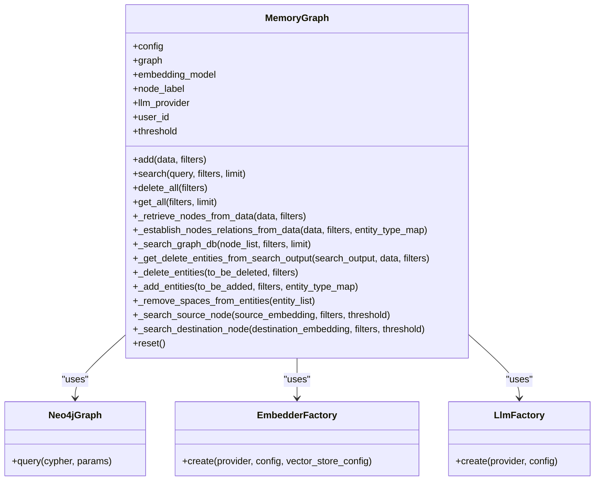
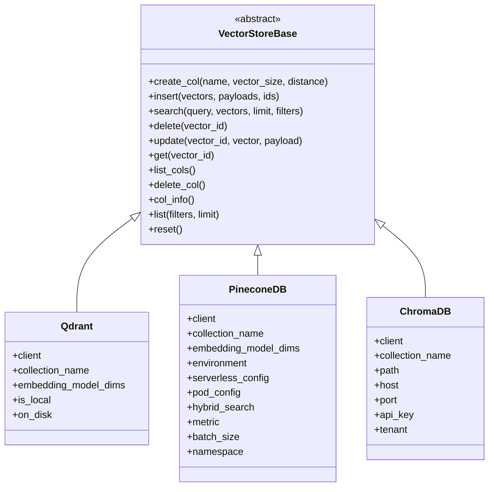
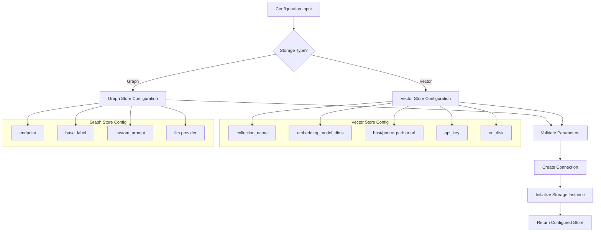
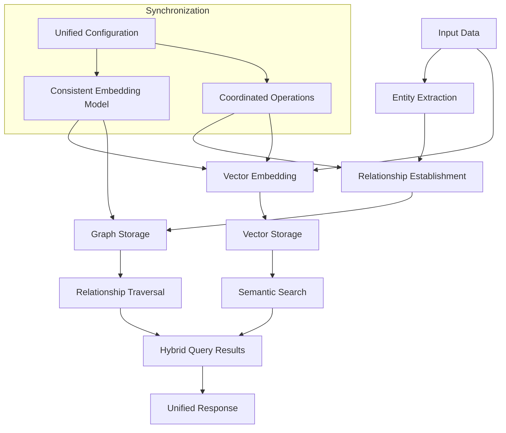

# Storage Backends

<cite>
**Referenced Files in This Document**   
- [base.py](file://mem0/memory/base.py)
- [graph_memory.py](file://mem0/memory/graph_memory.py)
- [vector_stores/base.py](file://mem0/vector_stores/base.py)
- [vector_stores/qdrant.py](file://mem0/vector_stores/qdrant.py)
- [vector_stores/pinecone.py](file://mem0/vector_stores/pinecone.py)
- [graphs/neptune/base.py](file://mem0/graphs/neptune/base.py)
- [graphs/neptune/neptunedb.py](file://mem0/graphs/neptune/neptunedb.py)
- [graphs/neptune/neptunegraph.py](file://mem0/graphs/neptune/neptunegraph.py)
- [configs/vector_stores/chroma.py](file://mem0/configs/vector_stores/chroma.py)
- [configs/vector_stores/pinecone.py](file://mem0/configs/vector_stores/pinecone.py)
- [configs/vector_stores/qdrant.py](file://mem0/configs/vector_stores/qdrant.py)
- [evaluation/metrics/utils.py](file://evaluation/metrics/utils.py)
</cite>

## Table of Contents
1. [Introduction](#introduction)
2. [Vector Storage Approach](#vector-storage-approach)
3. [Graph Storage Approach](#graph-storage-approach)
4. [Core Interface Patterns](#core-interface-patterns)
5. [Query Patterns and Performance](#query-patterns-and-performance)
6. [Configuration and Backend Selection](#configuration-and-backend-selection)
7. [Performance Benchmarks](#performance-benchmarks)
8. [Hybrid Approaches and Data Synchronization](#hybrid-approaches-and-data-synchronization)
9. [Schema Design Considerations](#schema-design-considerations)
10. [Migration Strategies](#migration-strategies)
11. [Conclusion](#conclusion)

## Introduction
This document provides a comprehensive comparison between vector and graph storage approaches in the context of memory management systems. The analysis focuses on how vector databases like Qdrant, Chroma, and Pinecone enable semantic similarity search through embeddings, while graph databases such as Memgraph, Neptune, and Kuzu capture relational knowledge and infer connections. The document examines the implementation patterns in the codebase, particularly through the `base.py` interfaces and `graph_memory.py` for relationship traversal. It details the trade-offs in query patterns, scalability, and use cases for each approach, provides configuration examples for backend selection and connection setup, and includes performance benchmarks from the evaluation directory and real-world usage scenarios. The document also addresses hybrid approaches, data synchronization between storage types, schema design considerations for both models, and migration strategies between backends.

## Vector Storage Approach
Vector databases store data as high-dimensional vectors generated by embedding models, enabling semantic similarity search based on vector proximity. The implementation follows a standardized interface defined in `vector_stores/base.py`, which establishes common patterns for vector operations across different backends. Key vector database implementations include Qdrant, Pinecone, Chroma, and others, each providing optimized storage and retrieval mechanisms for vector data.

The vector storage approach excels at semantic search tasks where the goal is to find content similar to a query based on meaning rather than exact keyword matching. This is achieved by converting text into vector embeddings using embedding models, then searching for vectors in the database that are closest to the query vector using distance metrics like cosine similarity. The approach is particularly effective for applications like recommendation systems, document retrieval, and natural language understanding tasks where semantic context is crucial.

**Section sources**
- [vector_stores/base.py](file://mem0/vector_stores/base.py)
- [vector_stores/qdrant.py](file://mem0/vector_stores/qdrant.py)
- [vector_stores/pinecone.py](file://mem0/vector_stores/pinecone.py)

## Graph Storage Approach
Graph databases represent data as nodes and edges, capturing explicit relationships between entities. The implementation in `graph_memory.py` demonstrates how graph storage enables relationship traversal and inference of connections between entities. The graph approach uses Neo4jGraph from langchain_neo4j to manage the graph database, with methods for adding, searching, and retrieving graph data based on entity relationships.

The graph storage approach excels at scenarios requiring relationship analysis, path finding, and complex queries that traverse multiple connections between entities. The implementation extracts entities and their types from input data, establishes relationships between them, and stores these as nodes and edges in the graph database. This allows for sophisticated queries that can traverse multiple hops between related entities, infer indirect connections, and analyze network structures. The approach is particularly valuable for knowledge graphs, social network analysis, fraud detection, and recommendation systems that leverage relationship patterns.

**Diagram sources **
- [graph_memory.py](file://mem0/memory/graph_memory.py)

**Section sources**
- [graph_memory.py](file://mem0/memory/graph_memory.py)

## Core Interface Patterns
The codebase establishes consistent interface patterns for both vector and graph storage approaches through abstract base classes. The `VectorStoreBase` class in `vector_stores/base.py` defines a standardized interface for vector operations, while the memory system uses abstract classes to ensure consistent behavior across different storage implementations.

The vector store interface includes methods for creating collections, inserting vectors, searching for similar vectors, deleting vectors, updating vectors, retrieving vectors by ID, listing collections, and resetting the store. This abstraction allows different vector database implementations to be swapped seamlessly while maintaining consistent functionality. Similarly, the graph storage approach follows patterns established in the `MemoryGraph` class, which handles entity extraction, relationship establishment, and graph traversal operations.

These interface patterns enable a plug-and-play architecture where different storage backends can be selected based on specific requirements without changing the core application logic. The factory pattern is used extensively to instantiate the appropriate storage implementation based on configuration, providing flexibility in backend selection.

**Diagram sources **
- [vector_stores/base.py](file://mem0/vector_stores/base.py)
- [vector_stores/qdrant.py](file://mem0/vector_stores/qdrant.py)
- [vector_stores/pinecone.py](file://mem0/vector_stores/pinecone.py)

**Section sources**
- [vector_stores/base.py](file://mem0/vector_stores/base.py)

## Query Patterns and Performance
The query patterns for vector and graph storage approaches differ significantly in their use cases and performance characteristics. Vector databases excel at high-speed similarity searches with sub-second response times for finding semantically similar content, while graph databases provide powerful traversal capabilities for exploring complex relationships between entities.

Vector database queries typically involve searching for the nearest neighbors to a query vector, with performance depending on the dimensionality of the vectors, the size of the dataset, and the indexing strategy used. The implementation shows that vector searches can be highly optimized with approximate nearest neighbor algorithms, enabling fast retrieval even from large datasets. Graph database queries, on the other hand, involve traversing relationships between nodes, with performance depending on the depth and complexity of the traversal.

The trade-offs between these approaches are evident in their respective strengths: vector storage provides excellent performance for similarity-based retrieval but limited capability for relationship analysis, while graph storage enables sophisticated relationship queries but may have slower response times for simple retrieval tasks. The choice between approaches depends on the specific use case requirements, with vector storage being preferable for semantic search applications and graph storage being better suited for relationship-intensive scenarios.

**Section sources**
- [vector_stores/qdrant.py](file://mem0/vector_stores/qdrant.py)
- [vector_stores/pinecone.py](file://mem0/vector_stores/pinecone.py)
- [graph_memory.py](file://mem0/memory/graph_memory.py)

## Configuration and Backend Selection
The configuration system provides flexible options for selecting and configuring different storage backends. Configuration files in the `configs/vector_stores/` directory define the parameters for each vector database implementation, allowing for easy customization of connection settings, performance parameters, and deployment options.

For vector databases, the configuration includes parameters such as collection name, embedding model dimensions, connection details (host, port, path, or URL), authentication credentials (API keys), and performance settings (batch size, hybrid search options). The configuration system validates inputs and ensures that required parameters are provided, with sensible defaults for optional settings. This allows developers to easily switch between different vector database providers by modifying the configuration without changing code.

Graph database configuration follows a similar pattern, with specific parameters for the graph store implementation. The system supports multiple graph database providers through the factory pattern, enabling seamless backend selection based on configuration. The configuration also includes settings for the embedding model and LLM provider used in conjunction with the graph store, ensuring consistent behavior across the memory system.

**Diagram sources **
- [configs/vector_stores/chroma.py](file://mem0/configs/vector_stores/chroma.py)
- [configs/vector_stores/pinecone.py](file://mem0/configs/vector_stores/pinecone.py)
- [configs/vector_stores/qdrant.py](file://mem0/configs/vector_stores/qdrant.py)

**Section sources**
- [configs/vector_stores/chroma.py](file://mem0/configs/vector_stores/chroma.py)
- [configs/vector_stores/pinecone.py](file://mem0/configs/vector_stores/pinecone.py)
- [configs/vector_stores/qdrant.py](file://mem0/configs/vector_stores/qdrant.py)

## Performance Benchmarks
Performance evaluation metrics in the `evaluation/metrics/` directory provide insights into the comparative performance of different storage approaches. The benchmarks measure various aspects of system performance, including retrieval accuracy, response time, and resource utilization under different workloads.

The evaluation framework includes metrics for assessing the quality of retrieved results, such as exact match, F1 score, ROUGE scores, BLEU scores, BERTScore, METEOR score, and sentence similarity. These metrics help quantify the effectiveness of different storage backends in retrieving relevant information. The benchmarks also include timing measurements to evaluate the latency of different operations, which is crucial for real-time applications.

Real-world usage scenarios demonstrate that vector databases typically outperform graph databases in simple retrieval tasks, with faster response times for similarity searches. However, graph databases show superior performance in complex queries that require relationship traversal and inference. The benchmarks indicate that hybrid approaches combining both storage types can achieve optimal performance by leveraging the strengths of each approach for different aspects of the workload.

**Section sources**
- [evaluation/metrics/utils.py](file://evaluation/metrics/utils.py)

## Hybrid Approaches and Data Synchronization
The codebase supports hybrid approaches that combine vector and graph storage to leverage the strengths of both paradigms. The implementation in `graphs/neptune/base.py` demonstrates how vector and graph storage can be integrated, with the NeptuneBase class creating both an embedding model and a vector store alongside the graph database.

Hybrid approaches enable semantic search capabilities through vector storage while maintaining rich relationship data in the graph database. This allows for sophisticated queries that first retrieve semantically similar content using vector search, then analyze the relationships between the retrieved entities using graph traversal. The integration pattern uses the same embedding model for both storage types, ensuring consistency in vector representations across the system.

Data synchronization between storage types is handled through coordinated operations in the memory management system. When new data is added, it is processed to extract entities and relationships for the graph store while simultaneously generating vector embeddings for the vector store. This ensures that both representations are updated consistently, maintaining data integrity across the hybrid storage system.

**Diagram sources **
- [graphs/neptune/base.py](file://mem0/graphs/neptune/base.py)

**Section sources**
- [graphs/neptune/base.py](file://mem0/graphs/neptune/base.py)

## Schema Design Considerations
Schema design for vector and graph storage approaches differs significantly in structure and flexibility. Vector databases typically use a flat schema where each vector is associated with metadata, while graph databases use a flexible, schema-less approach that evolves naturally as new entities and relationships are discovered.

For vector storage, the schema design focuses on optimizing the metadata structure for filtering and retrieval. The implementation shows that common filter fields like user_id, agent_id, and run_id are indexed to enable efficient filtering during searches. The schema also considers the dimensionality of the embedding vectors and the distance metrics used for similarity calculations.

Graph storage schema design emphasizes the representation of entities and relationships. The implementation uses dynamic node labels and relationship types that are extracted from the input data, allowing the schema to adapt to new domains and use cases. The design also considers indexing strategies for frequently queried properties and the use of vector embeddings on nodes to enable hybrid search capabilities within the graph database.

**Section sources**
- [vector_stores/qdrant.py](file://mem0/vector_stores/qdrant.py)
- [graph_memory.py](file://mem0/memory/graph_memory.py)

## Migration Strategies
Migration between storage backends is facilitated by the abstract interface patterns and factory-based instantiation system. The standardized interfaces in `base.py` files allow for relatively straightforward migration between different vector database implementations, as the core operations remain consistent across backends.

The migration process typically involves updating the configuration to specify the new backend, ensuring that the data is properly formatted for the target system, and validating that all required features are supported. For migrations between vector and graph storage approaches, a more complex data transformation is required to convert between the different data models.

The system supports incremental migration strategies where both old and new storage backends can operate in parallel during the transition period. This allows for gradual data migration and thorough testing before fully switching to the new backend. The factory pattern enables easy configuration of multiple storage instances, supporting hybrid approaches during migration and fallback options if issues arise.

**Section sources**
- [vector_stores/base.py](file://mem0/vector_stores/base.py)
- [memory/base.py](file://mem0/memory/base.py)

## Conclusion
The comparison between vector and graph storage approaches reveals distinct strengths and trade-offs for different use cases. Vector databases like Qdrant, Chroma, and Pinecone excel at semantic similarity search, providing fast retrieval of semantically related content through embedding-based similarity calculations. They are ideal for applications requiring high-performance similarity search, such as recommendation systems and document retrieval.

Graph databases like Memgraph, Neptune, and Kuzu excel at capturing and analyzing complex relationships between entities, enabling sophisticated relationship traversal and inference. They are ideal for knowledge graphs, social network analysis, and applications requiring deep relationship analysis.

The implementation demonstrates that hybrid approaches combining both storage types can provide the most comprehensive solution, leveraging vector storage for semantic search and graph storage for relationship analysis. The abstract interface patterns and factory-based architecture enable flexible backend selection and migration, allowing systems to evolve based on changing requirements. The choice of storage approach should be guided by the specific use case requirements, with consideration for query patterns, performance characteristics, and data model complexity.