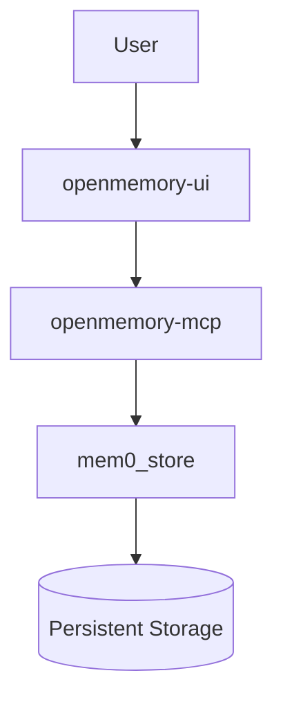
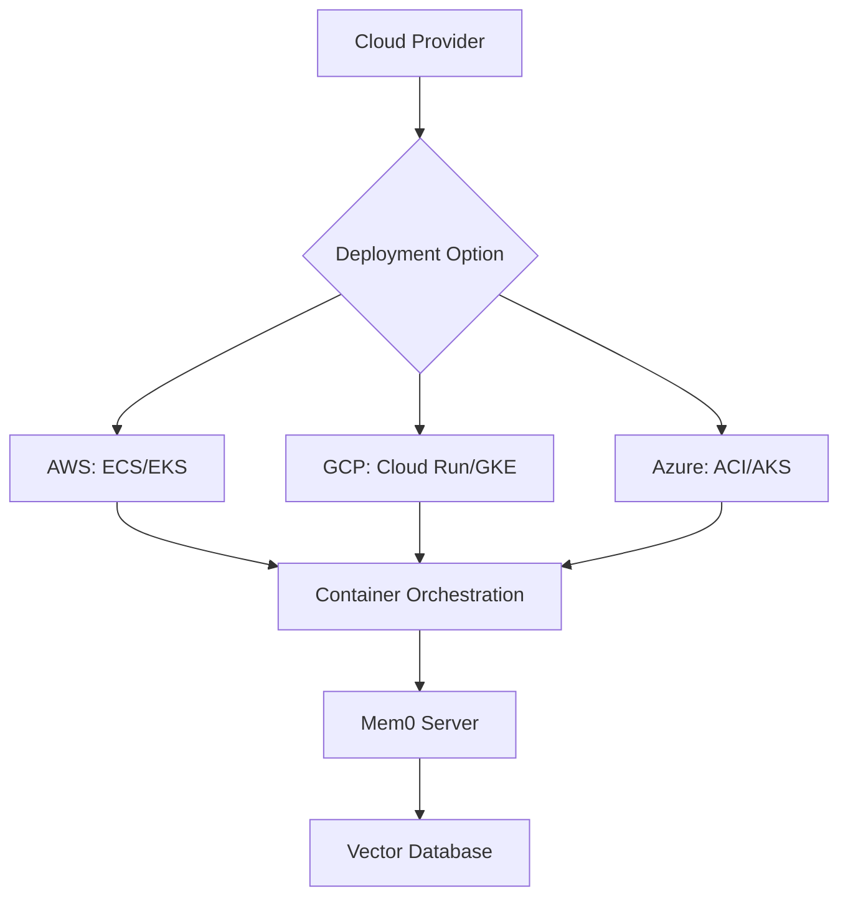
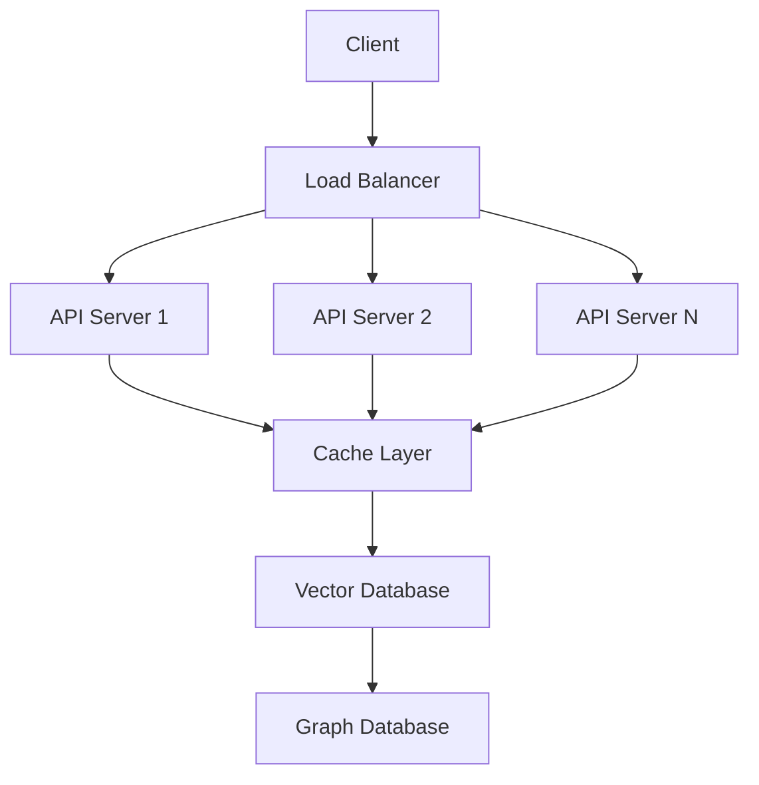
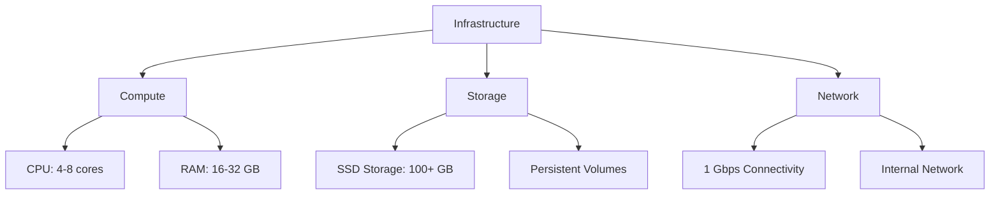
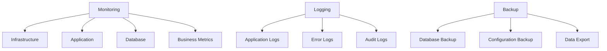
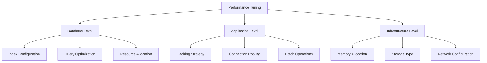

# Deployment Options

<cite>
**Referenced Files in This Document**   
- [main.py](file://server/main.py)
- [Dockerfile](file://server/Dockerfile)
- [docker-compose.yaml](file://server/docker-compose.yaml)
- [requirements.txt](file://server/requirements.txt)
- [docker-compose.yml](file://openmemory/docker-compose.yml)
- [chroma.yml](file://openmemory/compose/chroma.yml)
- [elasticsearch.yml](file://openmemory/compose/elasticsearch.yml)
- [faiss.yml](file://openmemory/compose/faiss.yml)
- [milvus.yml](file://openmemory/compose/milvus.yml)
- [opensearch.yml](file://openmemory/compose/opensearch.yml)
- [pgvector.yml](file://openmemory/compose/pgvector.yml)
- [qdrant.yml](file://openmemory/compose/qdrant.yml)
- [redis.yml](file://openmemory/compose/redis.yml)
- [weaviate.yml](file://openmemory/compose/weaviate.yml)
- [main.py](file://openmemory/api/main.py)
</cite>

## Table of Contents
1. [Introduction](#introduction)
2. [Self-Hosted Open-Source Deployment](#self-hosted-open-source-deployment)
3. [Docker Deployment Instructions](#docker-deployment-instructions)
4. [Cloud Deployment Options](#cloud-deployment-options)
5. [Configuration Examples](#configuration-examples)
6. [Scaling Considerations](#scaling-considerations)
7. [Infrastructure Requirements](#infrastructure-requirements)
8. [Production Best Practices](#production-best-practices)
9. [Monitoring, Logging, and Backup Strategies](#monitoring-logging-and-backup-strategies)
10. [Performance Tuning Tips](#performance-tuning-tips)

## Introduction
This document provides comprehensive guidance on deploying the Mem0 memory platform across various environments. It covers self-hosted open-source deployment using Docker and docker-compose, hosted platform setup, cloud deployment options for major providers, and essential operational considerations for production environments. The documentation includes detailed configuration examples, scaling strategies, infrastructure requirements, and performance optimization techniques to ensure successful deployment and operation of the Mem0 platform.

## Self-Hosted Open-Source Deployment
The Mem0 platform supports self-hosted deployment through Docker and docker-compose configurations, enabling users to deploy the system on their own infrastructure. The openmemory/compose directory contains specialized configuration files for various vector database backends, allowing users to select the most appropriate storage solution for their needs.

The deployment architecture consists of three main components:
- **Vector Store**: Various vector database options including Qdrant, Chroma, Elasticsearch, and others
- **API Server**: Backend service that handles memory operations and provides REST APIs
- **UI**: Frontend interface for interacting with the memory system

Each vector database configuration is provided as a separate YAML file in the openmemory/compose directory, allowing users to easily switch between different storage backends based on their requirements for performance, scalability, and feature set.

**Section sources**
- [docker-compose.yml](file://openmemory/docker-compose.yml)
- [chroma.yml](file://openmemory/compose/chroma.yml)
- [elasticsearch.yml](file://openmemory/compose/elasticsearch.yml)
- [faiss.yml](file://openmemory/compose/faiss.yml)
- [milvus.yml](file://openmemory/compose/milvus.yml)
- [opensearch.yml](file://openmemory/compose/opensearch.yml)
- [pgvector.yml](file://openmemory/compose/pgvector.yml)
- [qdrant.yml](file://openmemory/compose/qdrant.yml)
- [redis.yml](file://openmemory/compose/redis.yml)
- [weaviate.yml](file://openmemory/compose/weaviate.yml)

## Docker Deployment Instructions
The Mem0 platform can be deployed using Docker and docker-compose with straightforward instructions. The deployment process involves configuring environment variables, selecting the appropriate vector database backend, and starting the services.

### Step-by-Step Deployment Process
1. Clone the repository and navigate to the openmemory directory
2. Configure environment variables in the .env file, including API keys and user identifiers
3. Choose the desired vector database configuration from the compose directory
4. Start the services using docker-compose

The main docker-compose.yml file defines three services:
- **mem0_store**: The vector database service (default: Qdrant)
- **openmemory-mcp**: The API server that handles memory operations
- **openmemory-ui**: The web interface for user interaction



**Diagram sources**
- [docker-compose.yml](file://openmemory/docker-compose.yml)

**Section sources**
- [docker-compose.yml](file://openmemory/docker-compose.yml)

## Cloud Deployment Options
The Mem0 platform can be deployed on major cloud providers including AWS, GCP, and Azure using the provided Dockerfiles and server implementation. The deployment approach leverages containerization for consistency across different cloud environments.

### AWS Deployment
For AWS deployment, users can utilize Amazon ECS (Elastic Container Service) or EKS (Elastic Kubernetes Service) to run the Docker containers. The platform can be integrated with AWS RDS for PostgreSQL (for pgvector) or Amazon OpenSearch Service for vector storage. AWS ECS Fargate provides a serverless option that eliminates the need to manage underlying infrastructure.

### Google Cloud Platform Deployment
On GCP, the platform can be deployed using Google Cloud Run for serverless execution or Google Kubernetes Engine (GKE) for more control over the deployment environment. For vector storage, users can leverage Cloud SQL for PostgreSQL (with pgvector extension) or Vertex AI Matching Engine for high-performance vector similarity search.

### Azure Deployment
For Azure deployment, users can utilize Azure Container Instances (ACI) for simple deployments or Azure Kubernetes Service (AKS) for more complex, scalable deployments. Azure Database for PostgreSQL with the pgvector extension provides a managed option for vector storage, while Azure Cognitive Search offers vector search capabilities.

The server/Dockerfile provides the foundation for cloud deployments, containing all necessary dependencies and configuration for the Mem0 server application.



**Diagram sources**
- [Dockerfile](file://server/Dockerfile)

**Section sources**
- [Dockerfile](file://server/Dockerfile)
- [docker-compose.yaml](file://server/docker-compose.yaml)

## Configuration Examples
The Mem0 platform provides flexible configuration options through environment variables and configuration files. The server/main.py file contains the default configuration that can be overridden by environment variables or runtime configuration.

### Server Configuration
The DEFAULT_CONFIG dictionary in server/main.py defines the default settings for the Mem0 instance, including:
- Vector store provider and configuration
- Graph store provider and configuration
- LLM provider and configuration
- Embedder provider and configuration
- History database path

Users can override these settings through environment variables or by calling the /configure endpoint with a custom configuration.

### Environment Variables
Key environment variables for configuration include:
- POSTGRES_HOST, POSTGRES_PORT, POSTGRES_DB, POSTGRES_USER, POSTGRES_PASSWORD: For pgvector database connection
- NEO4J_URI, NEO4J_USERNAME, NEO4J_PASSWORD: For Neo4j graph database connection
- OPENAI_API_KEY: For OpenAI LLM and embedder services
- HISTORY_DB_PATH: For specifying the path to the history database

### Runtime Configuration
The platform supports dynamic configuration through the /configure endpoint, allowing users to modify the memory configuration without restarting the service. This enables switching between different vector stores, LLM providers, or embedding models at runtime.

```mermaid
graph TD
A[Configuration Sources] --> B[Environment Variables]
A --> C[Default Config in Code]
A --> D[Runtime API Configuration]
B --> E[POSTGRES_* Variables]
B --> F[NEO4J_* Variables]
B --> G[OPENAI_API_KEY]
C --> H[DEFAULT_CONFIG in main.py]
D --> I[/configure API Endpoint]
E --> J[Final Configuration]
F --> J
G --> J
H --> J
I --> J
```

**Diagram sources**
- [main.py](file://server/main.py)

**Section sources**
- [main.py](file://server/main.py)

## Scaling Considerations
When deploying the Mem0 platform in production environments, several scaling considerations must be addressed to ensure optimal performance and reliability.

### Horizontal Scaling
The API server component can be horizontally scaled by running multiple instances behind a load balancer. Since the state is stored in the vector database and graph database, the API servers are stateless and can be easily scaled out.

### Vertical Scaling
For the vector database components, vertical scaling involves increasing the resources (CPU, memory, storage) allocated to the database instances. This is particularly important for databases like Elasticsearch, OpenSearch, and Milvus, which benefit from increased memory for caching and query performance.

### Database-Specific Scaling
Different vector databases have specific scaling characteristics:
- **Qdrant**: Scales well with increased memory and SSD storage
- **Chroma**: Best suited for smaller deployments; scaling requires careful resource management
- **Elasticsearch/OpenSearch**: Requires significant memory allocation and benefits from dedicated master/data nodes in larger deployments
- **Milvus**: Designed for large-scale deployments with support for distributed architecture
- **Pgvector**: Leverages PostgreSQL scaling capabilities, including read replicas and connection pooling

### Caching Strategy
Implementing a caching layer (e.g., Redis) can significantly improve performance for frequently accessed memories. The platform can be configured to use Redis as a cache layer between the API server and the vector database.



**Section sources**
- [docker-compose.yml](file://openmemory/docker-compose.yml)
- [main.py](file://server/main.py)

## Infrastructure Requirements
The infrastructure requirements for the Mem0 platform vary depending on the chosen vector database backend and expected workload.

### Minimum Requirements
For development and small-scale deployments:
- 2 CPU cores
- 4 GB RAM
- 20 GB storage
- 1 Gbps network connectivity

### Production Requirements
For production deployments with moderate usage:
- 4-8 CPU cores
- 16-32 GB RAM (higher for Elasticsearch/OpenSearch deployments)
- 100+ GB storage (SSD recommended)
- 1 Gbps network connectivity

### Database-Specific Requirements
- **Qdrant**: 8 GB+ RAM recommended for optimal performance
- **Elasticsearch/OpenSearch**: 16 GB+ RAM with proper heap size configuration
- **Milvus**: 16 GB+ RAM with dedicated nodes for different components
- **Pgvector**: Standard PostgreSQL requirements with additional considerations for the pgvector extension
- **Chroma**: 4 GB+ RAM with sufficient storage for embeddings

The docker-compose.yaml file in the server directory provides an example development environment with PostgreSQL and Neo4j services, including health checks and proper networking configuration.



**Diagram sources**
- [docker-compose.yaml](file://server/docker-compose.yaml)

**Section sources**
- [docker-compose.yaml](file://server/docker-compose.yaml)

## Production Best Practices
Deploying the Mem0 platform in production environments requires adherence to several best practices to ensure security, reliability, and maintainability.

### Security Considerations
- Use environment variables or secret management systems for sensitive information (API keys, database credentials)
- Implement proper authentication and authorization mechanisms
- Use HTTPS for all external communications
- Regularly update dependencies to address security vulnerabilities

### Configuration Management
- Use configuration files for non-sensitive settings
- Implement version control for configuration files
- Use environment-specific configuration (development, staging, production)
- Document all configuration options and their impact

### Monitoring and Alerting
- Implement comprehensive monitoring for all components
- Set up alerts for critical metrics (CPU, memory, disk usage, error rates)
- Monitor database performance and query patterns
- Track API usage and response times

### Backup and Disaster Recovery
- Implement regular backups of all persistent data
- Test backup restoration procedures regularly
- Store backups in geographically separate locations
- Document disaster recovery procedures

### Deployment Strategy
- Use blue-green or canary deployment strategies for zero-downtime updates
- Implement proper health checks for all services
- Use infrastructure as code (IaC) for consistent deployments
- Automate deployment processes to reduce human error

The openmemory/api/main.py file demonstrates several production best practices, including database initialization, default user creation, and proper error handling.

**Section sources**
- [main.py](file://openmemory/api/main.py)
- [docker-compose.yml](file://openmemory/docker-compose.yml)

## Monitoring, Logging, and Backup Strategies
Effective monitoring, logging, and backup strategies are essential for maintaining a reliable Mem0 deployment.

### Monitoring
The platform should be monitored at multiple levels:
- **Infrastructure monitoring**: CPU, memory, disk, and network usage
- **Application monitoring**: API response times, error rates, request volumes
- **Database monitoring**: Query performance, connection counts, storage usage
- **Business metrics**: Memory creation rates, search patterns, user engagement

### Logging
The server/main.py implementation includes basic logging configuration with the following characteristics:
- Log level set to INFO by default
- Timestamps included in all log entries
- Structured log format for easier parsing
- Error logging with full stack traces for debugging

For production deployments, consider:
- Centralized log collection (e.g., ELK stack, Splunk)
- Log rotation and retention policies
- Structured logging with JSON format
- Correlation IDs for tracing requests across services

### Backup Strategies
The platform provides several mechanisms for data backup:
- **Database backups**: Regular backups of the vector database and any associated graph databases
- **Configuration backups**: Version-controlled configuration files
- **Export scripts**: The openmemory/backup-scripts/export_openmemory.sh script provides a mechanism for exporting data

Recommended backup practices:
- Schedule regular automated backups
- Store backups in multiple locations (on-premises and cloud)
- Test backup restoration regularly
- Encrypt backups containing sensitive data



**Diagram sources**
- [main.py](file://server/main.py)
- [export_openmemory.sh](file://openmemory/backup-scripts/export_openmemory.sh)

**Section sources**
- [main.py](file://server/main.py)
- [export_openmemory.sh](file://openmemory/backup-scripts/export_openmemory.sh)

## Performance Tuning Tips
Optimizing the performance of the Mem0 platform requires attention to several key areas, depending on the deployment scenario and workload characteristics.

### Vector Database Optimization
- **Qdrant**: Adjust HNSW parameters (ef_construct, M) based on data size and query patterns
- **Elasticsearch/OpenSearch**: Optimize shard count, refresh intervals, and cache settings
- **Milvus**: Configure index types and parameters based on data characteristics
- **Pgvector**: Create appropriate indexes and optimize PostgreSQL configuration
- **Chroma**: Ensure sufficient memory allocation for the Chroma server

### Application-Level Optimization
- **Caching**: Implement response caching for frequently accessed memories
- **Connection pooling**: Use connection pooling for database connections
- **Batch operations**: Use batch APIs for bulk memory operations
- **Asynchronous processing**: Offload long-running operations to background workers

### Resource Allocation
- Allocate sufficient memory for the vector database (critical for performance)
- Use SSD storage for faster I/O operations
- Ensure adequate CPU resources for embedding generation and search operations
- Configure appropriate JVM heap sizes for Java-based databases

### Query Optimization
- Use appropriate filters to reduce search scope
- Implement pagination for large result sets
- Optimize embedding models for the specific use case
- Consider hybrid search approaches (keyword + vector) for improved relevance

The server/main.py file demonstrates several performance considerations, including the use of environment variables for configuration, proper error handling, and structured API endpoints that support efficient data retrieval.



**Diagram sources**
- [main.py](file://server/main.py)

**Section sources**
- [main.py](file://server/main.py)