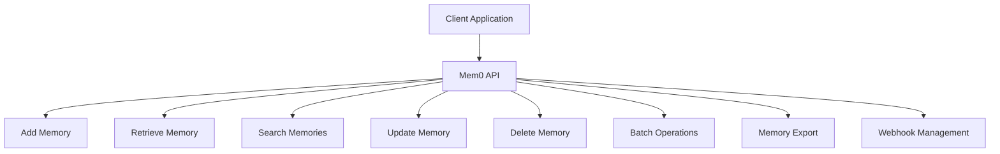
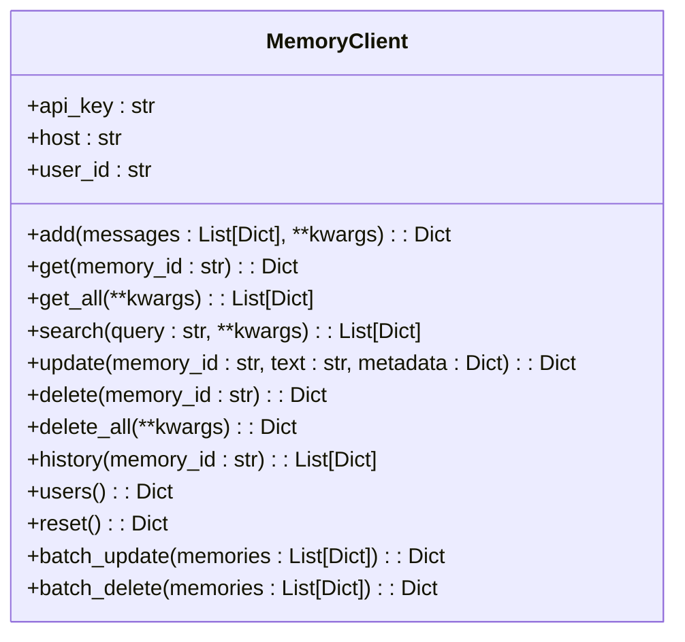
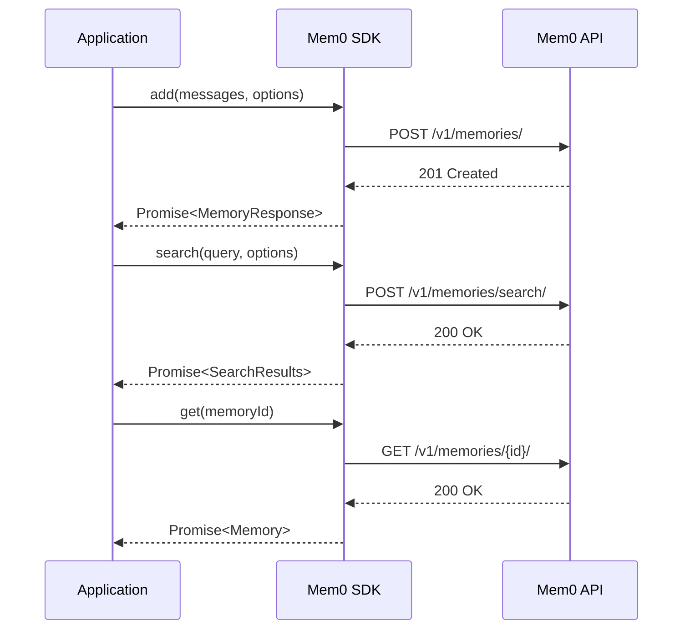
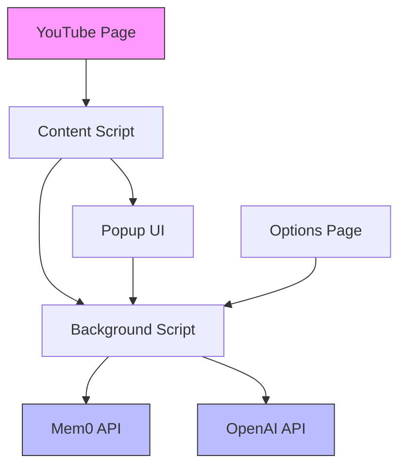
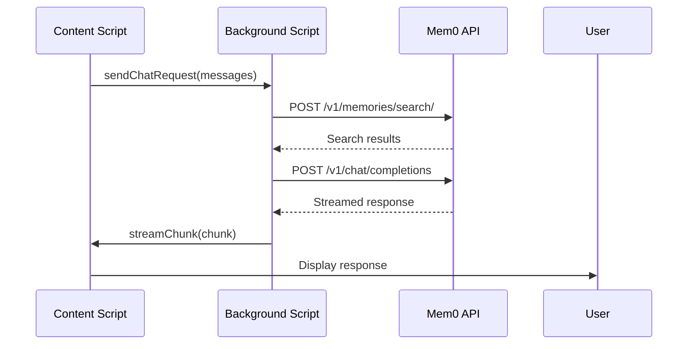

# Integration Guide

<cite>
**Referenced Files in This Document**   
- [main.py](file://mem0/client/main.py)
- [mem0.ts](file://mem0-ts/src/client/mem0.ts)
- [index.ts](file://vercel-ai-sdk/src/index.ts)
- [mem0-provider.ts](file://vercel-ai-sdk/src/mem0-provider.ts)
- [background.js](file://examples/yt-assistant-chrome/src/background.js)
- [utils.py](file://mem0/client/utils.py)
- [exceptions.py](file://mem0/exceptions.py)
- [customer-support-chatbot.ipynb](file://cookbooks/customer-support-chatbot.ipynb)
</cite>

## Table of Contents
1. [REST API Integration](#rest-api-integration)
2. [Python SDK Usage](#python-sdk-usage)
3. [JavaScript/TypeScript SDK Implementation](#javascripttypescript-sdk-implementation)
4. [Vercel AI SDK Wrapper](#vercel-ai-sdk-wrapper)
5. [Framework Integrations](#framework-integrations)
6. [Browser Extension Integration](#browser-extension-integration)
7. [Authentication Methods](#authentication-methods)
8. [Rate Limiting Considerations](#rate-limiting-considerations)
9. [Deployment Integration Patterns](#deployment-integration-patterns)
10. [Security Best Practices](#security-best-practices)
11. [Common Integration Challenges](#common-integration-challenges)
12. [Debugging Techniques](#debugging-techniques)

## REST API Integration

The Mem0 REST API provides comprehensive endpoints for memory management operations. The API follows standard REST conventions with JSON request/response payloads and proper HTTP status codes.

### Core Endpoints

The REST API exposes the following key endpoints for memory operations:



**Diagram sources**
- [main.py](file://mem0/client/main.py#L131-L543)

**Section sources**
- [main.py](file://mem0/client/main.py#L131-L543)

### Request/Response Schemas

The API uses consistent request and response schemas across endpoints. All requests require authentication via API key in the Authorization header.

#### Memory Creation Request
```json
{
  "messages": [
    {
      "role": "user",
      "content": "User message content"
    }
  ],
  "user_id": "optional-user-id",
  "agent_id": "optional-agent-id",
  "app_id": "optional-app-id",
  "metadata": {
    "custom_key": "custom_value"
  }
}
```

#### Memory Response
```json
{
  "id": "memory-unique-id",
  "memory": "processed memory content",
  "created_at": "timestamp",
  "updated_at": "timestamp",
  "metadata": {
    "source": "origin",
    "tags": ["array", "of", "tags"]
  },
  "history": [
    {
      "id": "history-entry-id",
      "content": "previous version content",
      "updated_at": "timestamp"
    }
  ]
}
```

The API supports both synchronous and asynchronous operations, with appropriate status codes indicating success (200-201) or various error conditions (4xx-5xx).

**Section sources**
- [main.py](file://mem0/client/main.py#L131-L543)

## Python SDK Usage

The Python SDK provides a convenient interface for interacting with the Mem0 API, abstracting away HTTP details and providing type-safe methods.

### Client Initialization

```python
from mem0.client.main import MemoryClient

# Initialize with API key
client = MemoryClient(api_key="your-api-key")

# Or use environment variable
import os
os.environ["MEM0_API_KEY"] = "your-api-key"
client = MemoryClient()
```

The client automatically handles authentication, error handling, and telemetry.

### Core Operations

The SDK provides methods for all major memory operations:



**Diagram sources**
- [main.py](file://mem0/client/main.py#L24-L802)

**Section sources**
- [main.py](file://mem0/client/main.py#L24-L802)

### Practical Examples

```python
# Add a new memory
messages = [{"role": "user", "content": "I enjoy hiking on weekends"}]
result = client.add(messages, user_id="user-123")

# Search for relevant memories
results = client.search("hiking trails", user_id="user-123")

# Update an existing memory
client.update(result["id"], text="I enjoy hiking in the mountains on weekends")

# Delete a memory
client.delete(result["id"])
```

The SDK includes comprehensive error handling with specific exception types for different error categories.

**Section sources**
- [main.py](file://mem0/client/main.py#L131-L543)

## JavaScript/TypeScript SDK Implementation

The JavaScript/TypeScript SDK provides a modern, promise-based interface for browser and Node.js environments.

### Client Setup

```typescript
import { MemoryClient } from '@mem0/client';

// Initialize the client
const client = new MemoryClient({
  apiKey: 'your-api-key',
  host: 'https://api.mem0.ai',
  organizationId: 'org-id',
  projectId: 'project-id'
});
```

### Key Methods

The TypeScript SDK mirrors the Python SDK functionality with type safety:



**Diagram sources**
- [mem0.ts](file://mem0-ts/src/client/mem0.ts#L87-L490)

**Section sources**
- [mem0.ts](file://mem0-ts/src/client/mem0.ts#L87-L490)

### Type Definitions

The SDK includes comprehensive type definitions for all operations:

```typescript
interface MemoryOptions {
  userId?: string;
  agentId?: string;
  appId?: string;
  metadata?: Record<string, any>;
  filters?: Record<string, any>;
}

interface Memory {
  id: string;
  memory: string;
  createdAt: string;
  updatedAt: string;
  metadata: Record<string, any>;
}
```

These types ensure type safety and provide excellent IDE support.

**Section sources**
- [index.ts](file://mem0-ts/src/client/index.ts#L1-L27)

## Vercel AI SDK Wrapper

The Vercel AI SDK wrapper integrates Mem0 functionality with the Vercel AI ecosystem, enabling seamless memory management in AI applications.

### Provider Configuration

```typescript
import { createMem0, mem0 } from '@ai-sdk/mem0';

// Create a Mem0 provider
const mem0Provider = createMem0({
  mem0ApiKey: process.env.MEM0_API_KEY,
  apiKey: process.env.OPENAI_API_KEY,
  provider: 'openai',
  mem0Config: {
    // Mem0 configuration
    llm: {
      provider: 'openai',
      config: {
        model: 'gpt-4'
      }
    }
  }
});

// Use with Vercel AI SDK
const model = mem0Provider('gpt-4-turbo');
```

### Core Functions

The wrapper provides utility functions for memory operations:

```typescript
import { addMemories, retrieveMemories, searchMemories, getMemories } from '@ai-sdk/mem0';

// Add memories during AI interactions
await addMemories([
  {
    content: "User prefers morning meetings",
    userId: "user-123"
  }
]);

// Retrieve relevant memories for context
const memories = await retrieveMemories({
  query: "meeting preferences",
  userId: "user-123"
});
```

The integration handles authentication, error handling, and telemetry automatically.

**Section sources**
- [mem0-provider.ts](file://vercel-ai-sdk/src/mem0-provider.ts#L1-L142)
- [index.ts](file://vercel-ai-sdk/src/index.ts#L1-L5)

## Framework Integrations

Mem0 provides integrations with popular AI frameworks to enhance their memory and context management capabilities.

### Langchain Integration

```python
from langchain_aws import NeptuneAnalyticsGraph
from mem0.graphs.neptune.neptunegraph import MemoryGraph

# Configure Mem0 with Langchain
config = {
    "llm": {
        "provider": "openai",
        "config": {
            "model": "gpt-4"
        }
    },
    "graph_store": {
        "config": {
            "endpoint": "neptune-graph://your-endpoint",
            "app_id": "your-app-id"
        }
    }
}

# Create memory graph
memory_graph = MemoryGraph(config)
```

The integration enables persistent memory storage and retrieval within Langchain applications.

**Section sources**
- [neptunegraph.py](file://mem0/graphs/neptune/neptunegraph.py#L1-L36)

### CrewAI and Langgraph Integration

```python
# In customer support chatbot example
from mem0 import Memory

class SupportChatbot:
    def __init__(self):
        # Initialize Mem0 with Anthropic's Claude
        self.config = {
            "llm": {
                "provider": "anthropic",
                "config": {
                    "model": "claude-3-5-sonnet-latest",
                    "temperature": 0.1,
                    "max_tokens": 2000,
                },
            }
        }
        self.memory = Memory.from_config(self.config)
    
    def handle_customer_query(self, user_id: str, query: str) -> str:
        # Get relevant past interactions
        relevant_history = self.memory.search(
            query=query,
            user_id=user_id,
            limit=5
        )
        
        # Store new interaction
        self.memory.add([
            {"role": "user", "content": query},
            {"role": "assistant", "content": response}
        ], user_id=user_id)
```

These integrations enable stateful AI agents that remember past interactions and maintain context across conversations.

**Section sources**
- [customer-support-chatbot.ipynb](file://cookbooks/customer-support-chatbot.ipynb#L1-L226)

## Browser Extension Integration

The YouTube assistant browser extension demonstrates how to integrate Mem0 functionality into browser-based applications.

### Architecture Overview



**Diagram sources**
- [background.js](file://examples/yt-assistant-chrome/src/background.js#L1-L256)

**Section sources**
- [background.js](file://examples/yt-assistant-chrome/src/background.js#L1-L256)

### Key Components

The extension consists of several components working together:

1. **Content Script**: Injects UI into YouTube pages and communicates with the background script
2. **Background Script**: Handles API calls and manages extension state
3. **Popup UI**: Provides user interface for configuration and interaction
4. **Options Page**: Allows users to configure API keys and settings

### Message Flow



The extension uses Chrome's messaging system to communicate between components and implements streaming for real-time responses.

**Section sources**
- [background.js](file://examples/yt-assistant-chrome/src/background.js#L1-L256)

## Authentication Methods

Mem0 supports multiple authentication methods to secure API access and protect user data.

### API Key Authentication

The primary authentication method uses API keys sent in the Authorization header:

```
Authorization: Token your-api-key-here
```

```python
# Python SDK handles this automatically
client = MemoryClient(api_key="your-api-key")
```

### User Identification

Each request includes a user identifier derived from the API key:

```python
# Create MD5 hash of API key for user_id
self.user_id = hashlib.md5(self.api_key.encode()).hexdigest()
```

This ensures that memories are properly scoped to users while maintaining security.

### Security Headers

The API validates and processes several security-related headers:

```python
headers = {
    "Authorization": f"Token {self.api_key}",
    "Mem0-User-ID": self.user_id,
    "Content-Type": "application/json"
}
```

These headers are automatically managed by the SDKs.

**Section sources**
- [main.py](file://mem0/client/main.py#L73-L85)

## Rate Limiting Considerations

The Mem0 API implements rate limiting to ensure fair usage and system stability.

### Rate Limit Headers

The API provides rate limit information in response headers:

- `X-RateLimit-Limit`: Total requests allowed in the time window
- `X-RateLimit-Remaining`: Remaining requests in the current window
- `X-RateLimit-Reset`: Time when the rate limit resets
- `Retry-After`: Seconds to wait before retrying after rate limit exceeded

### Error Handling

When rate limits are exceeded, the API returns a 429 status code:

```python
# SDK automatically handles rate limit errors
try:
    response = client.add(messages)
except RateLimitError as e:
    retry_after = e.debug_info.get("retry_after", 60)
    # Implement exponential backoff
    time.sleep(retry_after)
```

### Best Practices

1. Implement exponential backoff for retry logic
2. Cache responses when appropriate
3. Batch operations to reduce request volume
4. Monitor rate limit headers to anticipate limits
5. Handle 429 errors gracefully with user-friendly messages

The SDKs include built-in error handling for rate limiting scenarios.

**Section sources**
- [utils.py](file://mem0/client/utils.py#L64-L77)
- [exceptions.py](file://mem0/exceptions.py#L488)

## Deployment Integration Patterns

Mem0 supports various deployment patterns for different hosting environments and use cases.

### Environment Configuration

Applications should use environment variables for configuration:

```bash
MEM0_API_KEY=your-api-key
OPENAI_API_KEY=your-openai-key
MEM0_HOST=https://api.mem0.ai
```

### Deployment Scripts

The system includes deployment helpers for popular platforms:

```python
def deploy_fly():
    # Set secrets and deploy to Fly.io
    secrets_command = ["flyctl", "secrets", "set", "-a", app_name] + [f"{k}={v}" for k, v in env_vars.items()]
    deploy_command = ["fly", "deploy"]
```

### Container Deployment

For containerized deployments, ensure proper environment variable injection:

```dockerfile
# Example Docker run command
docker run -e MEM0_API_KEY=xxx -e OPENAI_API_KEY=xxx mem0/application:latest
```

The deployment process includes environment variable replacement and secret management.

**Section sources**
- [cli.py](file://embedchain/embedchain/utils/cli.py#L199-L234)
- [entrypoint.sh](file://openmemory/ui/entrypoint.sh#L1-L20)

## Security Best Practices

Implementing proper security practices is essential when integrating with the Mem0 API.

### API Key Management

- Store API keys in environment variables, not in code
- Use different API keys for different environments (development, staging, production)
- Rotate API keys periodically
- Never expose API keys in client-side code

### Data Privacy

- Use appropriate metadata to categorize sensitive information
- Implement proper access controls for memory operations
- Regularly audit memory access patterns
- Comply with relevant data protection regulations

### Secure Communication

- Always use HTTPS for API communication
- Validate SSL certificates
- Implement proper error handling to avoid information leakage
- Use secure storage for sensitive data

### Input Validation

- Validate all input data before sending to the API
- Sanitize user input to prevent injection attacks
- Implement proper error handling for invalid data

These practices help ensure the security and privacy of user data.

**Section sources**
- [main.py](file://mem0/client/main.py#L70-L71)
- [elasticsearch.py](file://mem0/configs/vector_stores/elasticsearch.py#L22-L53)

## Common Integration Challenges

Several common challenges may arise when integrating with the Mem0 platform.

### Authentication Issues

Common problems include:
- Missing or invalid API keys
- Incorrect authorization header format
- Expired API keys
- Insufficient permissions

Solutions:
- Verify API key format and placement
- Check environment variables
- Regenerate API keys if needed
- Verify account permissions

### Rate Limiting

Symptoms:
- 429 status codes
- Intermittent failures
- Slow response times

Solutions:
- Implement exponential backoff
- Cache responses
- Batch operations
- Monitor rate limit headers

### Data Serialization

Issues with:
- JSON formatting
- Special characters
- Large payloads
- Binary data

Solutions:
- Validate JSON structure
- Use proper escaping
- Implement chunking for large data
- Convert binary data to appropriate formats

### Network Connectivity

Problems with:
- Timeout errors
- Connection failures
- DNS resolution

Solutions:
- Implement retry logic
- Check firewall settings
- Verify network connectivity
- Use appropriate timeout values

The SDKs include built-in handling for many of these common issues.

**Section sources**
- [utils.py](file://mem0/client/utils.py#L88-L113)
- [exceptions.py](file://mem0/exceptions.py#L74-L104)

## Debugging Techniques

Effective debugging is essential for successful integration with the Mem0 platform.

### Logging and Monitoring

Enable detailed logging to track API interactions:

```python
import logging
logging.basicConfig(level=logging.INFO)
logger = logging.getLogger(__name__)
```

The SDKs include comprehensive logging for:
- API requests and responses
- Error conditions
- Performance metrics
- Authentication events

### Error Analysis

The system provides detailed error information:

```python
try:
    result = client.add(messages)
except MemoryError as e:
    print(f"Error: {e.message}")
    print(f"Error code: {e.error_code}")
    print(f"Details: {e.details}")
    print(f"Suggestion: {e.suggestion}")
    print(f"Debug info: {e.debug_info}")
```

This structured error information helps quickly identify and resolve issues.

### Debug Tools

Use these tools for debugging:
- API request/response inspection
- Network traffic monitoring
- Log analysis
- Performance profiling

The SDKs include built-in telemetry that can be used for debugging and optimization.

### Common Debugging Scenarios

1. **Authentication failures**: Check API key, headers, and network connectivity
2. **Rate limiting**: Monitor rate limit headers and implement backoff
3. **Data issues**: Validate input data and check response formats
4. **Performance problems**: Analyze response times and optimize queries

The comprehensive error handling and logging make debugging integrations more efficient.

**Section sources**
- [utils.py](file://mem0/client/utils.py#L45-L115)
- [exceptions.py](file://mem0/exceptions.py#L64-L104)