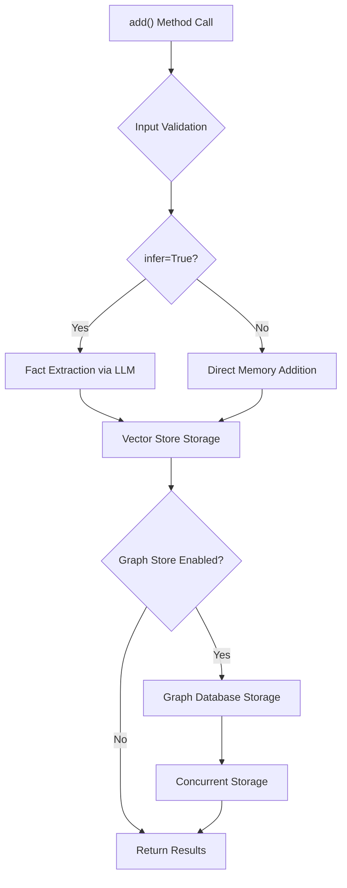
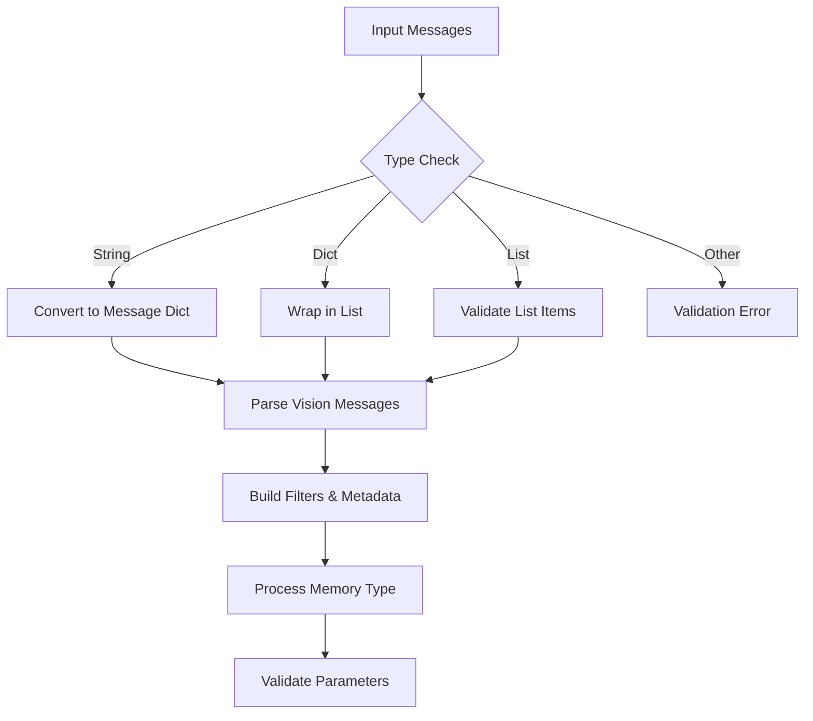
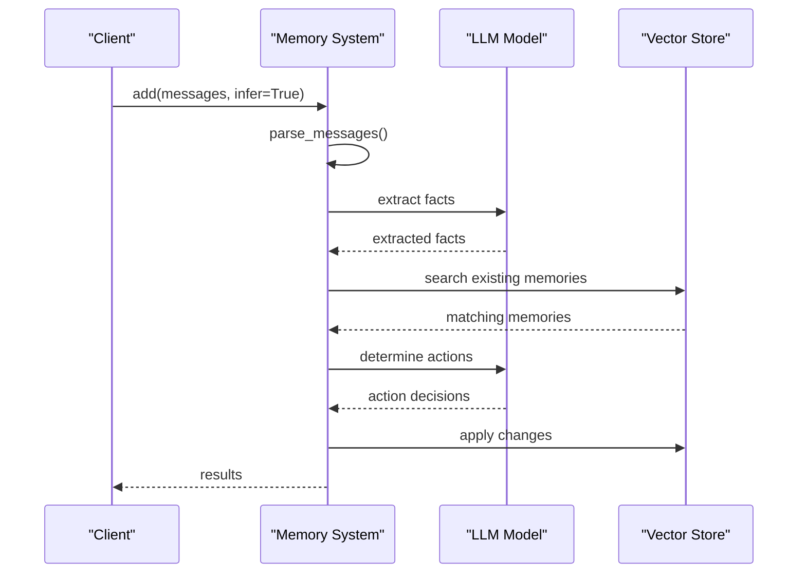
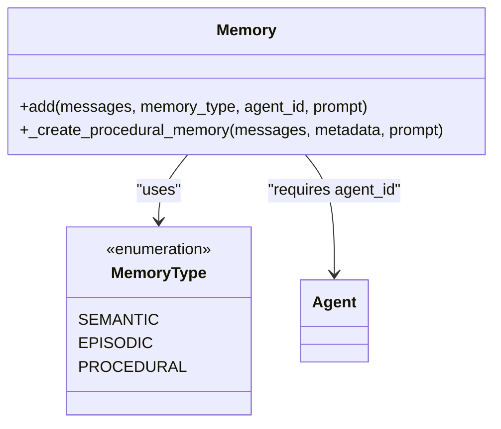
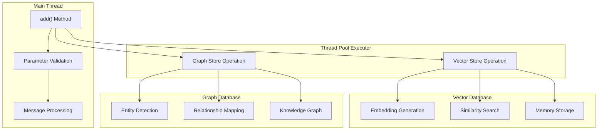
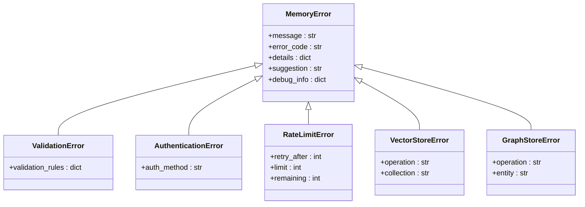
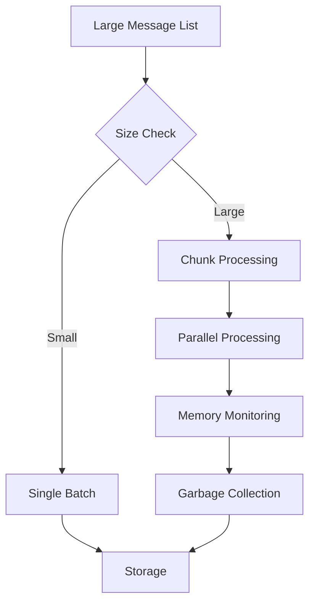

# Adding Memories

<cite>
**Referenced Files in This Document**
- [mem0/memory/main.py](file://mem0/memory/main.py)
- [mem0/client/main.py](file://mem0/client/main.py)
- [mem0/exceptions.py](file://mem0/exceptions.py)
- [mem0/memory/utils.py](file://mem0/memory/utils.py)
- [mem0/configs/prompts.py](file://mem0/configs/prompts.py)
- [mem0/configs/enums.py](file://mem0/configs/enums.py)
- [examples/rest-api/main.py](file://examples/rest-api/main.py)
- [mem0-ts/src/client/mem0.ts](file://mem0-ts/src/client/mem0.ts)
- [mem0-ts/src/oss/src/memory/index.ts](file://mem0-ts/src/oss/src/memory/index.ts)
</cite>

## Table of Contents
1. [Introduction](#introduction)
2. [The add() Method Overview](#the-add-method-overview)
3. [Parameters and Their Roles](#parameters-and-their-roles)
4. [Inference vs Direct Memory Addition](#inference-vs-direct-memory-addition)
5. [Procedural Memory Creation](#procedural-memory-creation)
6. [Internal Workflow Architecture](#internal-workflow-architecture)
7. [Practical Usage Examples](#practical-usage-examples)
8. [Error Handling and Validation](#error-handling-and-validation)
9. [Performance Considerations](#performance-considerations)
10. [Common Issues and Solutions](#common-issues-and-solutions)
11. [Best Practices](#best-practices)

## Introduction

The Mem0 memory system provides sophisticated memory management capabilities through its `add()` method, which serves as the primary interface for creating and managing memories. This method supports both automated fact extraction via Large Language Models (LLMs) and direct memory insertion, offering flexibility for different use cases from simple chatbots to complex AI agents.

The memory system operates on multiple storage layers including vector databases for semantic search and graph databases for relationship modeling, ensuring efficient retrieval and contextual understanding of stored information.

## The add() Method Overview

The `add()` method is the cornerstone of memory creation in the Mem0 system, designed to handle various memory types and operational modes. It accepts diverse input formats and provides intelligent memory management through configurable inference mechanisms.



**Diagram sources**
- [mem0/memory/main.py](file://mem0/memory/main.py#L195-L307)
- [mem0/memory/main.py](file://mem0/memory/main.py#L310-L481)

**Section sources**
- [mem0/memory/main.py](file://mem0/memory/main.py#L194-L307)

## Parameters and Their Roles

The `add()` method accepts several parameters that control memory creation behavior and provide fine-grained control over the storage process:

### Core Parameters

| Parameter | Type | Description | Default |
|-----------|------|-------------|---------|
| `messages` | `str \| List[Dict[str, str]]` | The content to be processed and stored | Required |
| `user_id` | `Optional[str]` | User identifier for memory scoping | `None` |
| `agent_id` | `Optional[str]` | Agent identifier for memory scoping | `None` |
| `run_id` | `Optional[str]` | Run/session identifier for memory scoping | `None` |
| `metadata` | `Optional[Dict[str, Any]]` | Additional metadata to store with memory | `None` |
| `infer` | `bool` | Enable automatic fact extraction | `True` |
| `memory_type` | `Optional[str]` | Type of memory to create | `None` |
| `prompt` | `Optional[str]` | Custom prompt for memory creation | `None` |

### Parameter Validation and Processing

The method performs comprehensive input validation and preprocessing:



**Diagram sources**
- [mem0/memory/main.py](file://mem0/memory/main.py#L259-L272)
- [mem0/memory/utils.py](file://mem0/memory/utils.py#L90-L117)

**Section sources**
- [mem0/memory/main.py](file://mem0/memory/main.py#L244-L272)

## Inference vs Direct Memory Addition

The `infer` parameter determines how the system processes input messages, offering two distinct operational modes:

### Inferred Fact Extraction Mode (infer=True)

When `infer=True` (default), the system employs sophisticated LLM-based fact extraction:

1. **Message Parsing**: Converts input into structured format for LLM consumption
2. **Fact Extraction**: Uses predefined prompts to extract key facts from conversations
3. **Memory Comparison**: Searches existing memories to identify duplicates or updates
4. **Action Determination**: Decides whether to ADD, UPDATE, DELETE, or IGNORE memories
5. **Batch Processing**: Handles multiple facts efficiently



**Diagram sources**
- [mem0/memory/main.py](file://mem0/memory/main.py#L347-L481)
- [mem0/configs/prompts.py](file://mem0/configs/prompts.py#L58-L345)

### Direct Memory Addition Mode (infer=False)

When `infer=False`, messages are stored as-is without LLM intervention:

1. **Raw Processing**: Messages are processed without fact extraction
2. **Individual Storage**: Each message becomes a separate memory entry
3. **Role-Based Classification**: Messages are classified by role (user, assistant, system)
4. **Metadata Attachment**: Additional metadata is attached to each memory

**Section sources**
- [mem0/memory/main.py](file://mem0/memory/main.py#L310-L481)

## Procedural Memory Creation

Procedural memory creation enables the system to capture step-by-step procedures and workflows, particularly useful for AI agents and task automation systems.

### Memory Type Configuration

Procedural memories require specific configuration:



**Diagram sources**
- [mem0/configs/enums.py](file://mem0/configs/enums.py#L4-L8)
- [mem0/memory/main.py](file://mem0/memory/main.py#L870-L907)

### Procedural Memory Workflow

The procedural memory creation process follows a specialized workflow:

1. **System Prompt Injection**: Uses predefined procedural memory system prompt
2. **Message Enhancement**: Adds explicit procedural memory creation request
3. **LLM Generation**: Generates comprehensive procedural summary
4. **Metadata Assignment**: Tags memory with procedural type
5. **Storage Integration**: Stores in vector database with appropriate metadata

**Section sources**
- [mem0/memory/main.py](file://mem0/memory/main.py#L870-L907)
- [mem0/configs/prompts.py](file://mem0/configs/prompts.py#L211-L222)

## Internal Workflow Architecture

The `add()` method orchestrates a sophisticated multi-stage workflow involving concurrent operations across different storage systems.

### Concurrent Storage Architecture



**Diagram sources**
- [mem0/memory/main.py](file://mem0/memory/main.py#L283-L290)
- [mem0/memory/main.py](file://mem0/memory/main.py#L310-L320)

### Vector Store Operations

The vector store handles embedding generation and similarity search:

1. **Embedding Generation**: Converts text to high-dimensional vectors
2. **Similarity Search**: Finds semantically similar existing memories
3. **Duplicate Detection**: Identifies near-duplicate content
4. **Batch Processing**: Optimizes multiple operations concurrently

### Graph Store Operations

When enabled, the graph store manages entity relationships:

1. **Entity Recognition**: Identifies named entities and concepts
2. **Relationship Extraction**: Detects connections between entities
3. **Knowledge Graph Construction**: Builds interconnected knowledge representation
4. **Query Optimization**: Enables complex relationship-based queries

**Section sources**
- [mem0/memory/main.py](file://mem0/memory/main.py#L283-L290)
- [mem0/memory/main.py](file://mem0/memory/main.py#L310-L481)

## Practical Usage Examples

### Basic Memory Addition

Simple memory addition with automatic inference:

```python
# Basic usage with string input
result = memory.add(
    "User mentioned they like coffee in the morning",
    user_id="user123"
)

# Using list of message dictionaries
messages = [
    {"role": "user", "content": "I prefer dark chocolate"},
    {"role": "assistant", "content": "Got it, dark chocolate preference noted"}
]
result = memory.add(messages, user_id="user123")
```

### Direct Memory Addition

Bypassing inference for raw content storage:

```python
# Direct addition without fact extraction
result = memory.add(
    "Today's weather: sunny, 75°F, light breeze",
    user_id="user123",
    infer=False
)
```

### Procedural Memory Creation

Creating step-by-step procedure memories:

```python
# Procedural memory for deployment workflow
result = memory.add(
    "To deploy the app: 1. Run tests 2. Build Docker image 3. Push to registry 4. Update k8s manifests",
    user_id="developer123",
    agent_id="deploy_agent",
    memory_type="procedural_memory"
)
```

### Chatbot Memory Management

Managing conversation history with user preferences:

```python
# Chatbot memory with metadata
chat_history = [
    {"role": "user", "content": "My favorite color is blue"},
    {"role": "assistant", "content": "Okay, I'll remember your favorite color is blue"}
]

result = memory.add(
    chat_history,
    user_id="customer123",
    metadata={"session_start": "2024-01-01T10:00:00Z"},
    infer=True
)
```

**Section sources**
- [examples/rest-api/main.py](file://examples/rest-api/main.py#L1-L150)

## Error Handling and Validation

The Mem0 system provides comprehensive error handling with structured exception classes that offer detailed error information and actionable suggestions.

### Validation Errors

Common validation scenarios and their handling:

| Error Type | Scenario | Solution |
|------------|----------|----------|
| `Mem0ValidationError` | Invalid memory_type | Use "procedural_memory" for procedural memories |
| `Mem0ValidationError` | Missing user_id/agent_id/run_id | Provide at least one session identifier |
| `Mem0ValidationError` | Invalid messages format | Ensure messages are str, dict, or list[dict] |
| `Mem0ValidationError` | Invalid metadata format | Use valid JSON-serializable data |

### Exception Hierarchy



**Diagram sources**
- [mem0/exceptions.py](file://mem0/exceptions.py#L34-L503)

### Error Recovery Strategies

```python
try:
    result = memory.add(messages, user_id=user_id)
except ValidationError as e:
    # Handle validation errors with user-friendly messages
    logger.error(f"Validation failed: {e.message}")
    # Implement input sanitization or user feedback
except RateLimitError as e:
    # Implement exponential backoff
    wait_time = e.debug_info.get('retry_after', 60)
    time.sleep(wait_time)
except VectorStoreError as e:
    # Fallback to direct storage mode
    result = memory.add(messages, user_id=user_id, infer=False)
```

**Section sources**
- [mem0/exceptions.py](file://mem0/exceptions.py#L138-L158)
- [mem0/memory/main.py](file://mem0/memory/main.py#L251-L272)

## Performance Considerations

### Batch Operations

For optimal performance with large datasets, consider these strategies:

1. **Message Grouping**: Process related messages together
2. **Concurrent Execution**: Leverage the built-in ThreadPoolExecutor
3. **Memory Limits**: Monitor memory usage during batch operations
4. **Rate Limiting**: Implement client-side rate limiting

### Memory Optimization



### Vector Database Performance

- **Embedding Caching**: Cache frequently used embeddings
- **Index Optimization**: Configure appropriate vector indices
- **Batch Size Tuning**: Optimize batch sizes for your vector store
- **Connection Pooling**: Use connection pooling for database operations

### Graph Database Performance

- **Relationship Batching**: Process relationships in batches
- **Entity Deduplication**: Avoid duplicate entity creation
- **Query Optimization**: Use appropriate graph query patterns
- **Index Management**: Maintain graph indices for fast traversal

**Section sources**
- [mem0/memory/main.py](file://mem0/memory/main.py#L283-L290)

## Common Issues and Solutions

### Message Format Validation Errors

**Issue**: Invalid message format causing validation failures

**Solution**: Ensure messages conform to expected structure:

```python
# Correct message format
messages = [
    {"role": "user", "content": "Hello"},
    {"role": "assistant", "content": "Hi there!"}
]

# Alternative formats
messages = "Single message string"
messages = {"role": "user", "content": "Hello"}
```

### Procedural Memory Configuration Issues

**Issue**: Attempting procedural memory creation without agent_id

**Solution**: Provide required agent_id for procedural memories:

```python
# Correct procedural memory creation
result = memory.add(
    "Deployment steps...",
    user_id="user123",
    agent_id="deploy_agent",  # Required for procedural memory
    memory_type="procedural_memory"
)
```

### Memory Type Validation Errors

**Issue**: Using incorrect memory_type parameter

**Solution**: Use valid memory types from the enumeration:

```python
from mem0.configs.enums import MemoryType

# Correct usage
result = memory.add(
    "Procedure content...",
    user_id="user123",
    agent_id="agent123",
    memory_type=MemoryType.PROCEDURAL.value
)
```

### Concurrent Operation Failures

**Issue**: Thread pool execution failures

**Solution**: Implement graceful fallback mechanisms:

```python
try:
    result = memory.add(messages, user_id=user_id)
except Exception as e:
    # Fallback to direct storage
    result = memory.add(messages, user_id=user_id, infer=False)
    logger.warning(f"Fallback to direct storage: {e}")
```

### Memory Quota Exceeded

**Issue**: Storage quota limitations

**Solution**: Implement quota monitoring and cleanup:

```python
try:
    result = memory.add(messages, user_id=user_id)
except MemoryQuotaExceededError as e:
    # Implement cleanup or upgrade logic
    logger.info(f"Quota exceeded: {e.message}")
    # Trigger quota management workflow
```

**Section sources**
- [mem0/memory/main.py](file://mem0/memory/main.py#L251-L272)
- [mem0/exceptions.py](file://mem0/exceptions.py#L224-L242)

## Best Practices

### Memory Design Patterns

1. **Hierarchical Scoping**: Use user_id, agent_id, and run_id appropriately
2. **Metadata Enrichment**: Include relevant metadata for better retrieval
3. **Content Granularity**: Balance between detailed and concise memory content
4. **Temporal Organization**: Consider temporal aspects in memory organization

### Performance Optimization

1. **Batch Processing**: Group related operations for efficiency
2. **Caching Strategy**: Cache embeddings and LLM responses
3. **Connection Management**: Reuse database connections
4. **Monitoring**: Track memory growth and performance metrics

### Error Handling Best Practices

1. **Graceful Degradation**: Provide fallback mechanisms
2. **Logging Strategy**: Comprehensive logging for debugging
3. **User Feedback**: Clear error messages for user-facing applications
4. **Retry Logic**: Implement intelligent retry mechanisms

### Security Considerations

1. **Input Sanitization**: Validate all user inputs
2. **Access Control**: Properly scope memory access
3. **Data Privacy**: Handle sensitive information appropriately
4. **Audit Logging**: Maintain audit trails for compliance

### Testing Strategies

1. **Unit Testing**: Test individual components
2. **Integration Testing**: Test complete workflows
3. **Performance Testing**: Validate under load
4. **Error Scenario Testing**: Test error conditions comprehensively