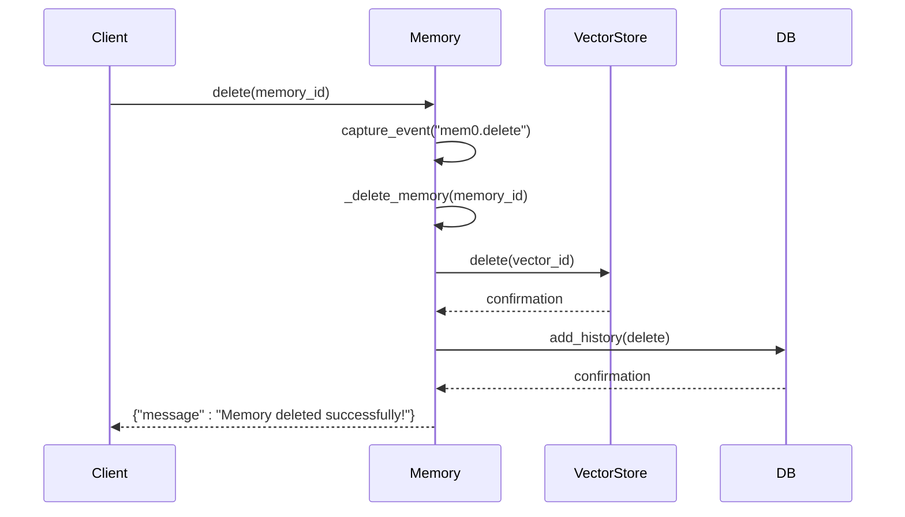
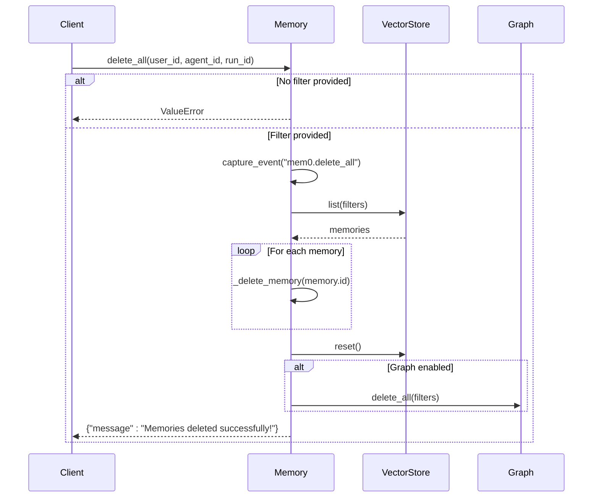
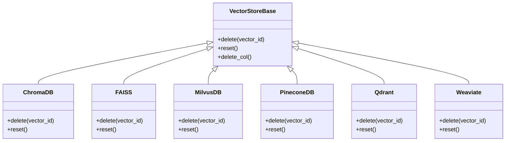
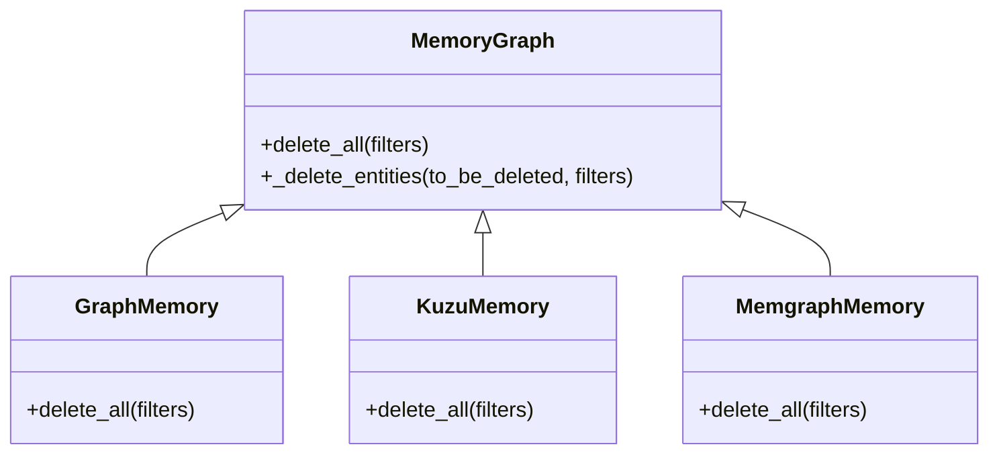
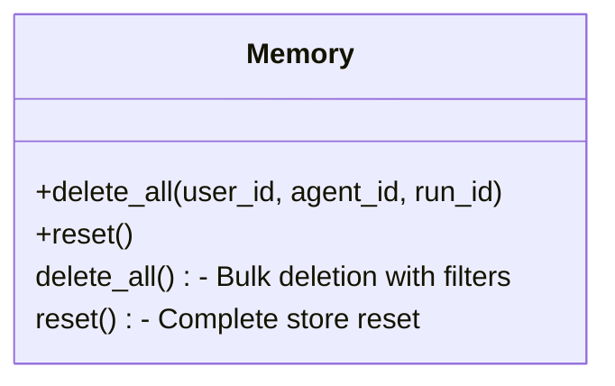
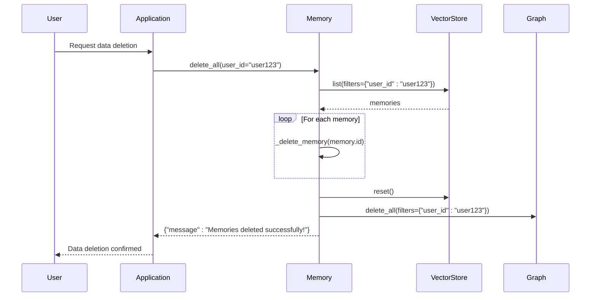

# Deleting Memories

<cite>
**Referenced Files in This Document**   
- [main.py](file://mem0/memory/main.py)
- [client.py](file://mem0/client/main.py)
- [vector_stores/base.py](file://mem0/vector_stores/base.py)
- [vector_stores/chroma.py](file://mem0/vector_stores/chroma.py)
- [vector_stores/faiss.py](file://mem0/vector_stores/faiss.py)
- [vector_stores/milvus.py](file://mem0/vector_stores/milvus.py)
- [vector_stores/pinecone.py](file://mem0/vector_stores/pinecone.py)
- [vector_stores/qdrant.py](file://mem0/vector_stores/qdrant.py)
- [vector_stores/weaviate.py](file://mem0/vector_stores/weaviate.py)
- [vector_stores/supabase.py](file://mem0/vector_stores/supabase.py)
- [vector_stores/pgvector.py](file://mem0/vector_stores/pgvector.py)
- [vector_stores/databricks.py](file://mem0/vector_stores/databricks.py)
- [vector_stores/redis.py](file://mem0/vector_stores/redis.py)
- [vector_stores/langchain.py](file://mem0/vector_stores/langchain.py)
- [vector_stores/baidu.py](file://mem0/vector_stores/baidu.py)
- [vector_stores/elasticsearch.py](file://mem0/vector_stores/elasticsearch.py)
- [vector_stores/opensearch.py](file://mem0/vector_stores/opensearch.py)
- [vector_stores/azure_mysql.py](file://mem0/vector_stores/azure_mysql.py)
- [vector_stores/azure_ai_search.py](file://mem0/vector_stores/azure_ai_search.py)
- [vector_stores/s3_vectors.py](file://mem0/vector_stores/s3_vectors.py)
- [vector_stores/upstash_vector.py](file://mem0/vector_stores/upstash_vector.py)
- [vector_stores/valkey.py](file://mem0/vector_stores/valkey.py)
- [vector_stores/neptune_analytics.py](file://mem0/vector_stores/neptune_analytics.py)
- [memory/graph_memory.py](file://mem0/memory/graph_memory.py)
- [memory/kuzu_memory.py](file://mem0/memory/kuzu_memory.py)
- [memory/memgraph_memory.py](file://mem0/memory/memgraph_memory.py)
- [graphs/neptune/base.py](file://mem0/graphs/neptune/base.py)
- [graphs/neptune/neptunegraph.py](file://mem0/graphs/neptune/neptunegraph.py)
- [graphs/neptune/neptunedb.py](file://mem0/graphs/neptune/neptunedb.py)
- [utils/factory.py](file://mem0/utils/factory.py)
- [exceptions.py](file://mem0/exceptions.py)
</cite>

## Table of Contents
1. [Introduction](#introduction)
2. [Core Deletion Methods](#core-deletion-methods)
   - [delete() Method](#delete-method)
   - [delete_all() Method](#delete_all-method)
3. [Implementation Details](#implementation-details)
   - [Vector Store Deletion](#vector-store-deletion)
   - [Graph Store Cleanup](#graph-store-cleanup)
   - [Collection Reset](#collection-reset)
4. [Safety Mechanisms and Filter Requirements](#safety-mechanisms-and-filter-requirements)
5. [Distinction from reset() Method](#distinction-from-reset-method)
6. [Usage Patterns and Examples](#usage-patterns-and-examples)
   - [Privacy Compliance (GDPR Right to be Forgotten)](#privacy-compliance-gdpr-right-to-be-forgotten)
   - [Memory Cleanup](#memory-cleanup)
7. [Performance Considerations](#performance-considerations)
8. [Common Issues and Troubleshooting](#common-issues-and-troubleshooting)
9. [Conclusion](#conclusion)

## Introduction
This document provides a comprehensive guide to deleting memories in the mem0 system. It covers the implementation and usage of the `delete()` and `delete_all()` methods, which are essential for managing memory data in applications. The document explains how to delete individual memories by ID and perform bulk deletions using filters such as user_id, agent_id, or run_id. It also details the safety mechanisms that require at least one filter for bulk deletion operations and distinguishes these operations from the `reset()` method, which has different implications for data management.

The deletion functionality is critical for privacy compliance, particularly for implementing the GDPR right to be forgotten, and for general memory cleanup operations. The document includes concrete examples from the codebase to illustrate usage patterns and addresses common issues that may arise during deletion operations, providing troubleshooting guidance to ensure successful implementation.

**Section sources**
- [main.py](file://mem0/memory/main.py#L780-L825)
- [main.py](file://mem0/memory/main.py#L1655-L1703)

## Core Deletion Methods

### delete() Method
The `delete()` method is used to remove a single memory from the system by its unique identifier. This method takes a memory_id parameter and permanently deletes the corresponding memory entry from both the vector store and the history database.



**Diagram sources**
- [main.py](file://mem0/memory/main.py#L780-L789)
- [main.py](file://mem0/memory/main.py#L963-L978)

**Section sources**
- [main.py](file://mem0/memory/main.py#L780-L789)
- [main.py](file://mem0/memory/main.py#L963-L978)

### delete_all() Method
The `delete_all()` method enables bulk deletion of memories based on specific filters. This method requires at least one filter parameter (user_id, agent_id, or run_id) to prevent accidental deletion of all memories in the system. The method first retrieves all memories matching the filter criteria, then deletes each memory individually, and finally resets the vector store collection.



**Diagram sources**
- [main.py](file://mem0/memory/main.py#L790-L825)
- [main.py](file://mem0/memory/main.py#L1666-L1703)

**Section sources**
- [main.py](file://mem0/memory/main.py#L790-L825)
- [main.py](file://mem0/memory/main.py#L1666-L1703)

## Implementation Details

### Vector Store Deletion
The vector store deletion process is implemented consistently across various vector database providers. Each vector store implementation provides a `delete()` method that removes a specific vector by its ID. The base interface in `vector_stores/base.py` defines this method, and concrete implementations handle the provider-specific deletion logic.



**Diagram sources**
- [vector_stores/base.py](file://mem0/vector_stores/base.py#L20-L22)
- [vector_stores/chroma.py](file://mem0/vector_stores/chroma.py#L162-L169)
- [vector_stores/faiss.py](file://mem0/vector_stores/faiss.py#L294-L318)
- [vector_stores/milvus.py](file://mem0/vector_stores/milvus.py#L162-L169)
- [vector_stores/pinecone.py](file://mem0/vector_stores/pinecone.py#L243-L250)
- [vector_stores/qdrant.py](file://mem0/vector_stores/qdrant.py#L183-L195)
- [vector_stores/weaviate.py](file://mem0/vector_stores/weaviate.py#L225-L233)

**Section sources**
- [vector_stores/base.py](file://mem0/vector_stores/base.py#L20-L22)
- [vector_stores/chroma.py](file://mem0/vector_stores/chroma.py#L162-L169)
- [vector_stores/faiss.py](file://mem0/vector_stores/faiss.py#L294-L318)
- [vector_stores/milvus.py](file://mem0/vector_stores/milvus.py#L162-L169)
- [vector_stores/pinecone.py](file://mem0/vector_stores/pinecone.py#L243-L250)
- [vector_stores/qdrant.py](file://mem0/vector_stores/qdrant.py#L183-L195)
- [vector_stores/weaviate.py](file://mem0/vector_stores/weaviate.py#L225-L233)

### Graph Store Cleanup
When the graph store is enabled, memory deletion involves additional cleanup operations to maintain data consistency. The graph store implementations provide `delete_all()` methods that remove nodes and relationships based on filter criteria. These methods use Cypher queries to match and delete entities in the graph database.



**Diagram sources**
- [memory/graph_memory.py](file://mem0/memory/graph_memory.py#L130-L148)
- [memory/kuzu_memory.py](file://mem0/memory/kuzu_memory.py#L147-L165)
- [memory/memgraph_memory.py](file://mem0/memory/memgraph_memory.py#L137-L151)

**Section sources**
- [memory/graph_memory.py](file://mem0/memory/graph_memory.py#L130-L148)
- [memory/kuzu_memory.py](file://mem0/memory/kuzu_memory.py#L147-L165)
- [memory/memgraph_memory.py](file://mem0/memory/memgraph_memory.py#L137-L151)

### Collection Reset
After bulk deletion operations, the vector store collection is reset to ensure a clean state. The reset process varies by vector store provider but generally involves deleting the existing collection and recreating it. The `VectorStoreFactory` provides a `reset()` method that handles this operation consistently across different providers.

```mermaid
flowchart TD
A[Start Reset] --> B{Has reset method?}
B --> |Yes| C[Call reset()]
B --> |No| D[Call delete_col()]
D --> E[Recreate collection]
C --> F[End Reset]
E --> F
```

**Diagram sources**
- [utils/factory.py](file://mem0/utils/factory.py#L196-L199)
- [vector_stores/supabase.py](file://mem0/vector_stores/supabase.py#L233-L237)
- [vector_stores/azure_mysql.py](file://mem0/vector_stores/azure_mysql.py#L451-L455)

**Section sources**
- [utils/factory.py](file://mem0/utils/factory.py#L196-L199)
- [vector_stores/supabase.py](file://mem0/vector_stores/supabase.py#L233-L237)
- [vector_stores/azure_mysql.py](file://mem0/vector_stores/azure_mysql.py#L451-L455)

## Safety Mechanisms and Filter Requirements
The `delete_all()` method implements a critical safety mechanism that requires at least one filter parameter (user_id, agent_id, or run_id) to be specified. This prevents accidental deletion of all memories in the system, which could have severe consequences for data integrity and user privacy.

```mermaid
flowchart TD
A[delete_all() called] --> B{Filters provided?}
B --> |No| C[Raise ValueError]
B --> |Yes| D[Proceed with deletion]
C --> E["Error: At least one filter is required to delete all memories. If you want to delete all memories, use the `reset()` method."]
D --> F[Delete memories matching filters]
```

This safety mechanism is implemented in the `delete_all()` method, which checks if any filters are provided and raises a `ValueError` if none are specified. The error message explicitly guides users to use the `reset()` method if they intend to delete all memories in the system.

**Section sources**
- [main.py](file://mem0/memory/main.py#L807-L810)

## Distinction from reset() Method
The `delete_all()` method is distinct from the `reset()` method in both purpose and implementation. While `delete_all()` removes memories based on specific filters, the `reset()` method completely resets the entire memory store, including deleting the vector store collection, resetting the database, and recreating the vector store with a new client.



The `reset()` method is more comprehensive and affects the entire memory system, while `delete_all()` is targeted and preserves the overall structure of the memory store. This distinction is important for understanding when to use each method: `delete_all()` for targeted cleanup operations and `reset()` for complete system initialization or testing scenarios.

**Section sources**
- [main.py](file://mem0/memory/main.py#L979-L1003)
- [main.py](file://mem0/memory/main.py#L1883-L1907)

## Usage Patterns and Examples

### Privacy Compliance (GDPR Right to be Forgotten)
The deletion methods are essential for implementing privacy compliance, particularly for the GDPR right to be forgotten. When a user requests deletion of their data, the system can use the `delete_all()` method with the user_id filter to remove all memories associated with that user.



This pattern ensures that all user data is completely removed from the system, satisfying GDPR requirements for data erasure.

**Section sources**
- [main.py](file://mem0/memory/main.py#L790-L825)

### Memory Cleanup
Memory cleanup operations can be performed using the `delete_all()` method with various filter combinations. For example, an application might clean up memories associated with a specific agent or run to free up resources or prepare for a new session.

```python
# Example: Clean up memories for a specific agent
memory_instance.delete_all(agent_id="agent456")

# Example: Clean up memories for a specific run
memory_instance.delete_all(run_id="run789")

# Example: Clean up memories for a user and agent combination
memory_instance.delete_all(user_id="user123", agent_id="agent456")
```

These cleanup operations help maintain system performance and ensure that only relevant memories are retained.

**Section sources**
- [main.py](file://mem0/memory/main.py#L790-L825)

## Performance Considerations
Bulk deletion operations on large datasets can have significant performance implications. The `delete_all()` method processes deletions sequentially, which may result in longer execution times for large numbers of memories. Performance can be optimized by:

1. Using appropriate indexing in the vector store
2. Ensuring efficient filter operations
3. Monitoring system resources during bulk operations

For very large datasets, consider implementing batch processing or asynchronous deletion to avoid timeouts and maintain system responsiveness.

**Section sources**
- [main.py](file://mem0/memory/main.py#L816-L818)

## Common Issues and Troubleshooting
Common issues that may arise during memory deletion operations include:

1. **Incomplete deletions**: Ensure that both vector store and graph store (if enabled) operations complete successfully.
2. **Filter errors**: Verify that filter parameters are correctly specified and match existing data.
3. **Permission issues**: Check that the application has appropriate permissions to delete memories.
4. **Connection problems**: Ensure stable connections to vector and graph stores.

Troubleshooting steps:
- Check logs for error messages
- Verify filter criteria
- Test with small datasets first
- Monitor system resources during operations

**Section sources**
- [main.py](file://mem0/memory/main.py#L807-L810)
- [main.py](file://mem0/memory/main.py#L963-L978)

## Conclusion
The deletion functionality in the mem0 system provides robust methods for managing memory data through the `delete()` and `delete_all()` methods. These methods enable precise control over memory removal, with safety mechanisms to prevent accidental data loss. The implementation supports various vector and graph store providers, ensuring flexibility and compatibility across different deployment scenarios. Understanding the distinction between `delete_all()` and `reset()` is crucial for proper system management, and the provided usage patterns demonstrate how to effectively implement privacy compliance and memory cleanup operations.