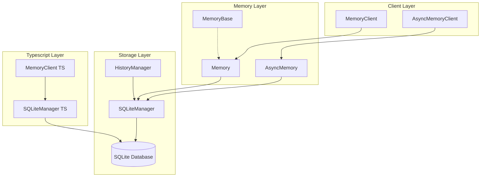
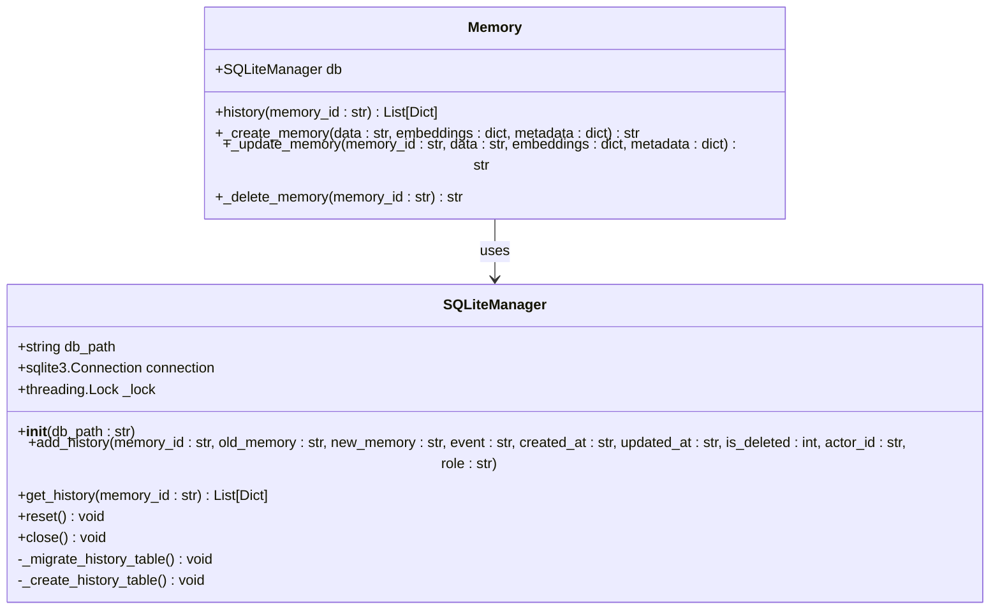
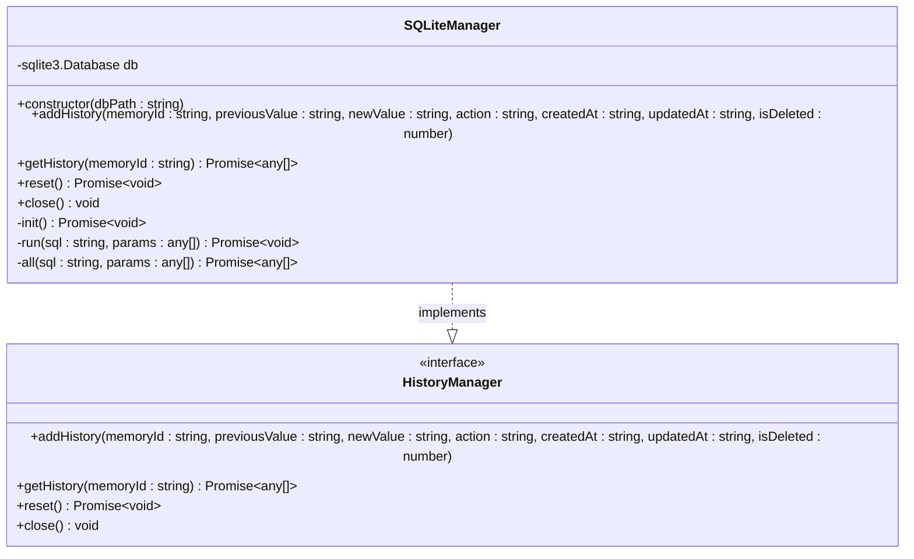
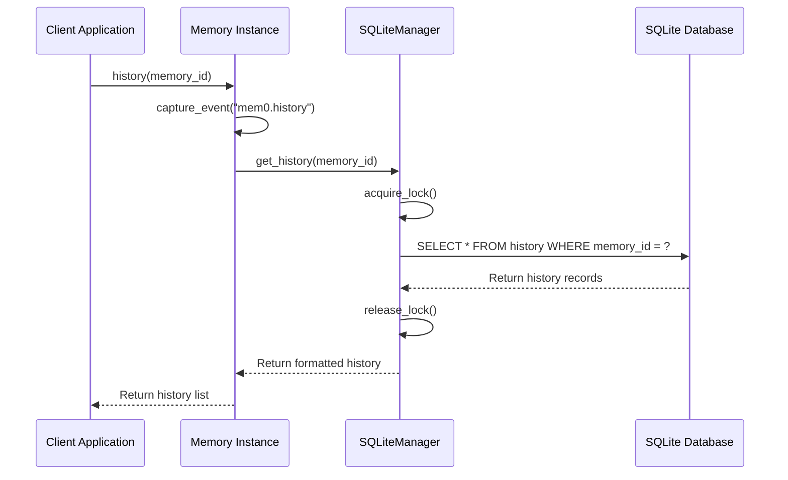
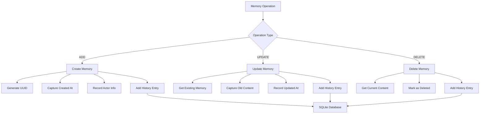
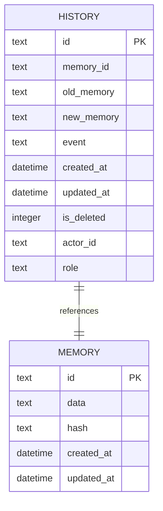
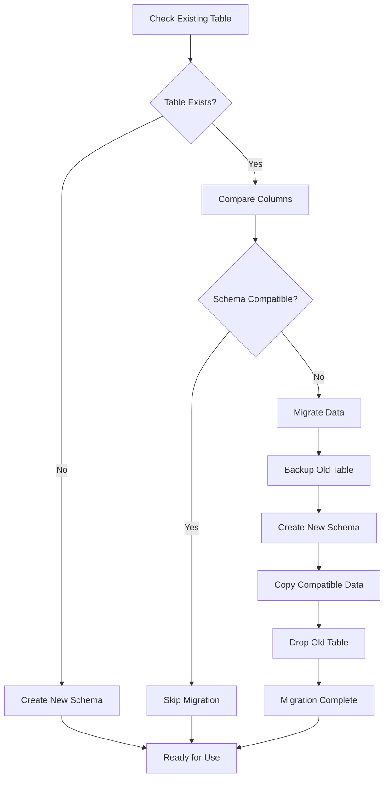
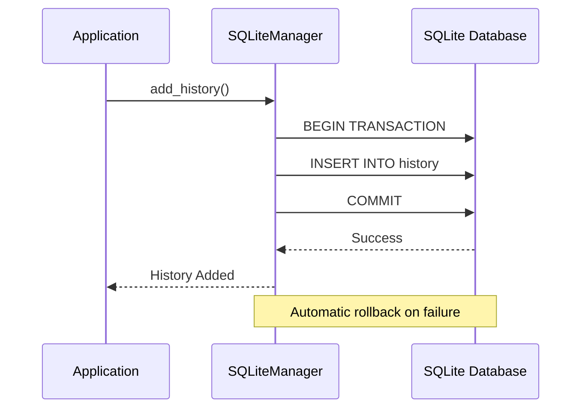

# Memory History Tracking

<cite>
**Referenced Files in This Document**
- [storage.py](file://mem0/memory/storage.py)
- [main.py](file://mem0/memory/main.py)
- [base.py](file://mem0/client/main.py)
- [SQLiteManager.ts](file://mem0-ts/src/oss/src/storage/SQLiteManager.ts)
- [MemoryHistoryManager.ts](file://mem0-ts/src/oss/src/storage/MemoryHistoryManager.ts)
- [test_storage.py](file://tests/memory/test_storage.py)
- [SQLiteManager.ts](file://mem0-ts/src/oss/src/storage/SQLiteManager.ts)
- [test_memoryClient.test.ts](file://mem0-ts/src/client/tests/memoryClient.test.ts)
</cite>

## Table of Contents
1. [Introduction](#introduction)
2. [Architecture Overview](#architecture-overview)
3. [Core Components](#core-components)
4. [History Method Implementation](#history-method-implementation)
5. [Audit Trail Functionality](#audit-trail-functionality)
6. [Database Schema and Storage](#database-schema-and-storage)
7. [Usage Patterns and Examples](#usage-patterns-and-examples)
8. [Performance Considerations](#performance-considerations)
9. [Troubleshooting Guide](#troubleshooting-guide)
10. [Best Practices](#best-practices)

## Introduction

Memory history tracking is a critical feature in the Mem0 system that provides comprehensive audit trails for all memory operations. This functionality enables organizations to maintain compliance, debug issues, and understand the evolution of memory content over time. The system tracks every change made to memories, including additions, updates, and deletions, with full contextual information about who made changes and when.

The history tracking system operates through a sophisticated SQLite-based storage mechanism that maintains chronological records of all memory modifications. This ensures data integrity while providing powerful debugging and compliance capabilities for enterprise applications.

## Architecture Overview

The memory history tracking system follows a layered architecture that separates concerns between the client interface, business logic, and persistent storage:



**Diagram sources**
- [main.py](file://mem0/memory/main.py#L130-L1005)
- [storage.py](file://mem0/memory/storage.py#L10-L219)
- [base.py](file://mem0/client/main.py#L23-L907)

## Core Components

### MemoryHistoryManager Classes

The system provides multiple implementations of the history management interface:

#### Python Implementation (SQLiteManager)
The primary implementation uses SQLite for persistent storage with thread-safe operations:



**Diagram sources**
- [storage.py](file://mem0/memory/storage.py#L10-L219)
- [main.py](file://mem0/memory/main.py#L130-L1005)

#### Typescript Implementation (SQLiteManager TS)
The Typescript version provides similar functionality with modern JavaScript features:



**Diagram sources**
- [SQLiteManager.ts](file://mem0-ts/src/oss/src/storage/SQLiteManager.ts#L4-L85)
- [base.ts](file://mem0-ts/src/oss/./src/storage/base.ts#L1-L14)

**Section sources**
- [storage.py](file://mem0/memory/storage.py#L10-L219)
- [SQLiteManager.ts](file://mem0-ts/src/oss/src/storage/SQLiteManager.ts#L4-L85)

## History Method Implementation

### Method Signature and Parameters

The `history()` method serves as the primary interface for retrieving memory change logs:



**Diagram sources**
- [main.py](file://mem0/memory/main.py#L827-L839)
- [storage.py](file://mem0/memory/storage.py#L169-L197)

### Parameter Details

| Parameter | Type | Required | Description |
|-----------|------|----------|-------------|
| `memory_id` | string | Yes | Unique identifier of the memory to retrieve history for |

### Return Value Structure

The method returns a list of history entries with the following structure:

| Field | Type | Description |
|-------|------|-------------|
| `id` | string | Unique identifier for the history entry |
| `memory_id` | string | Reference to the memory being tracked |
| `old_memory` | string \| null | Previous content before the change |
| `new_memory` | string \| null | New content after the change |
| `event` | string | Type of operation: "ADD", "UPDATE", or "DELETE" |
| `created_at` | string | Timestamp when the change occurred |
| `updated_at` | string \| null | Timestamp when the change was recorded |
| `is_deleted` | boolean | Flag indicating if the memory was deleted |
| `actor_id` | string \| null | Identifier of the user/agent performing the action |
| `role` | string \| null | Role of the actor (e.g., "user", "assistant") |

**Section sources**
- [main.py](file://mem0/memory/main.py#L827-L839)
- [storage.py](file://mem0/memory/storage.py#L169-L197)

## Audit Trail Functionality

### Change Event Recording

The system automatically captures comprehensive audit information for each memory operation:



**Diagram sources**
- [main.py](file://mem0/memory/main.py#L858-L867)
- [main.py](file://mem0/memory/main.py#L950-L959)
- [main.py](file://mem0/memory/main.py#L968-L976)

### Automatic History Tracking

The system integrates history tracking seamlessly with memory operations:

#### Memory Creation Tracking
When a new memory is created, the system records:
- **Event Type**: "ADD"
- **Old Memory**: `null` (no previous content)
- **New Memory**: The content being added
- **Actor Information**: User ID, Agent ID, or Run ID
- **Timestamp**: Creation time

#### Memory Update Tracking
When a memory is updated, the system records:
- **Event Type**: "UPDATE"
- **Old Memory**: Previous content
- **New Memory**: Updated content
- **Actor Information**: Who performed the update
- **Timestamp**: Update time

#### Memory Deletion Tracking
When a memory is deleted, the system records:
- **Event Type**: "DELETE"
- **Old Memory**: Content before deletion
- **New Memory**: `null` (deleted)
- **Actor Information**: Who performed the deletion
- **Is Deleted**: `true` flag
- **Timestamp**: Deletion time

**Section sources**
- [main.py](file://mem0/memory/main.py#L858-L867)
- [main.py](file://mem0/memory/main.py#L950-L959)
- [main.py](file://mem0/memory/main.py#L968-L976)

## Database Schema and Storage

### SQLite Schema Design

The history tracking system uses a well-designed SQLite schema optimized for audit trails:



**Diagram sources**
- [storage.py](file://mem0/memory/storage.py#L105-L118)

### Schema Features

| Column | Type | Constraints | Purpose |
|--------|------|-------------|---------|
| `id` | TEXT | PRIMARY KEY, UNIQUE | Auto-generated UUID for each history entry |
| `memory_id` | TEXT | NOT NULL | Foreign key linking to the memory |
| `old_memory` | TEXT | NULLABLE | Previous content before change |
| `new_memory` | TEXT | NULLABLE | New content after change |
| `event` | TEXT | NOT NULL | Operation type (ADD/UPDATE/DELETE) |
| `created_at` | DATETIME | NOT NULL | When the change occurred |
| `updated_at` | DATETIME | NULLABLE | When the record was updated |
| `is_deleted` | INTEGER | DEFAULT 0 | Boolean flag for deleted memories |
| `actor_id` | TEXT | NULLABLE | User/agent identifier |
| `role` | TEXT | NULLABLE | Actor's role designation |

### Migration and Compatibility

The system includes robust migration capabilities to handle schema evolution:



**Diagram sources**
- [storage.py](file://mem0/memory/storage.py#L18-L98)

**Section sources**
- [storage.py](file://mem0/memory/storage.py#L105-L118)
- [storage.py](file://mem0/memory/storage.py#L18-L98)

## Usage Patterns and Examples

### Basic History Retrieval

Here are practical examples of how to use the history tracking functionality:

#### Python Usage Pattern
```python
# Initialize memory client
memory = Memory()

# Add a memory
result = memory.add(
    "User mentioned they like coffee",
    user_id="user_123",
    metadata={"category": "preferences"}
)

# Retrieve memory ID from result
memory_id = result["results"][0]["id"]

# Get complete history of the memory
history = memory.history(memory_id)

# Process history entries
for entry in history:
    print(f"Change: {entry['event']} at {entry['created_at']}")
    print(f"From: {entry['old_memory']}")
    print(f"To: {entry['new_memory']}")
    print(f"By: {entry['actor_id']} ({entry['role']})")
```

#### Typescript Usage Pattern
```typescript
// Initialize memory client
const memory = new MemoryClient();

// Add a memory
const result = await memory.add({
    role: "user",
    content: "User mentioned they like coffee"
}, {
    userId: "user_123",
    metadata: { category: "preferences" }
});

// Get memory ID
const memoryId = result.results[0].id;

// Retrieve history
const history = await memory.history(memoryId);

// Process history entries
history.forEach(entry => {
    console.log(`Change: ${entry.event} at ${entry.created_at}`);
    console.log(`From: ${entry.old_memory}`);
    console.log(`To: ${entry.new_memory}`);
    console.log(`By: ${entry.actor_id} (${entry.role})`);
});
```

### Compliance and Auditing Scenarios

#### Regulatory Compliance Tracking
```python
def audit_compliance(memory_client, user_id, regulation="GDPR"):
    """Track compliance-related memory changes."""
    # Get all memories for user
    all_memories = memory_client.get_all(user_id=user_id)
    
    # Track sensitive information changes
    compliance_history = []
    
    for memory in all_memories["results"]:
        memory_history = memory_client.history(memory["id"])
        
        for entry in memory_history:
            if entry["event"] in ["UPDATE", "DELETE"]:
                compliance_entry = {
                    "memory_id": entry["memory_id"],
                    "change_type": entry["event"],
                    "timestamp": entry["created_at"],
                    "actor": entry["actor_id"],
                    "role": entry["role"],
                    "regulation": regulation,
                    "content_changes": {
                        "before": entry["old_memory"],
                        "after": entry["new_memory"]
                    }
                }
                compliance_history.append(compliance_entry)
    
    return compliance_history
```

#### Debugging Memory Evolution
```python
def debug_memory_evolution(memory_client, memory_id):
    """Debug the complete evolution of a memory."""
    history = memory_client.history(memory_id)
    
    print(f"Memory Evolution for ID: {memory_id}")
    print("=" * 50)
    
    for i, entry in enumerate(history):
        print(f"\nVersion {i+1}: {entry['event']} at {entry['created_at']}")
        print(f"Actor: {entry['actor_id']} ({entry['role']})")
        
        if entry["event"] == "ADD":
            print(f"Content: {entry['new_memory']}")
        elif entry["event"] == "UPDATE":
            print(f"Changed from: {entry['old_memory']}")
            print(f"Changed to: {entry['new_memory']}")
        elif entry["event"] == "DELETE":
            print(f"Deleted content: {entry['old_memory']}")
```

### Enterprise Integration Patterns

#### Audit Log Integration
```python
class AuditLogger:
    def __init__(self, memory_client):
        self.memory_client = memory_client
    
    def log_memory_change(self, memory_id, change_type, actor_id, role, metadata=None):
        """Log memory changes to external audit system."""
        history = self.memory_client.history(memory_id)
        
        audit_entry = {
            "timestamp": datetime.now().isoformat(),
            "memory_id": memory_id,
            "change_type": change_type,
            "actor_id": actor_id,
            "role": role,
            "versions": len(history),
            "metadata": metadata or {}
        }
        
        # Send to external audit system
        self.send_to_audit_system(audit_entry)
    
    def send_to_audit_system(self, entry):
        # Implementation for sending to external audit system
        pass
```

**Section sources**
- [test_storage.py](file://tests/memory/test_storage.py#L92-L102)
- [test_memoryClient.test.ts](file://mem0-ts/src/client/tests/memoryClient.test.ts#L290-L329)

## Performance Considerations

### Storage Efficiency

The history tracking system is designed with several performance optimizations:

#### Indexing Strategy
- **Primary Key**: UUIDs provide optimal distribution for the `id` column
- **Foreign Key**: `memory_id` is indexed for efficient lookups
- **Composite Indexes**: Consider adding composite indexes for frequently queried combinations

#### Transaction Management
The system uses proper transaction handling to ensure data consistency:



**Diagram sources**
- [storage.py](file://mem0/memory/storage.py#L139-L167)

### High-Frequency Update Optimization

For systems with frequent memory updates, consider these optimization strategies:

#### Batch Operations
```python
def batch_track_changes(memory_client, changes_list):
    """Optimize tracking for high-frequency updates."""
    # Group related changes
    grouped_changes = {}
    
    for change in changes_list:
        memory_id = change["memory_id"]
        if memory_id not in grouped_changes:
            grouped_changes[memory_id] = []
        grouped_changes[memory_id].append(change)
    
    # Process groups separately
    for memory_id, changes in grouped_changes.items():
        # Use bulk operations where possible
        memory_client.track_multiple_changes(memory_id, changes)
```

#### Connection Pooling
For high-concurrency environments, implement connection pooling:

```python
import threading
from queue import Queue

class HistoryConnectionPool:
    def __init__(self, max_connections=10):
        self.max_connections = max_connections
        self.pool = Queue(max_connections)
        self.lock = threading.Lock()
        
        # Pre-populate pool
        for _ in range(max_connections):
            conn = sqlite3.connect(":memory:", check_same_thread=False)
            self.pool.put(conn)
    
    def get_connection(self):
        return self.pool.get()
    
    def release_connection(self, conn):
        self.pool.put(conn)
```

### Memory Management

#### Garbage Collection Considerations
- History entries are stored in memory until persisted
- Large history datasets may require periodic cleanup
- Consider implementing TTL (Time-To-Live) for old entries

#### Database Maintenance
Regular maintenance tasks for optimal performance:

```python
def maintain_history_database(db_path):
    """Perform routine maintenance on history database."""
    conn = sqlite3.connect(db_path)
    
    # Vacuum to reclaim space
    conn.execute("VACUUM")
    
    # Analyze to update statistics
    conn.execute("ANALYZE")
    
    # Cleanup old entries (optional)
    cutoff_date = datetime.now() - timedelta(days=30)
    conn.execute("""
        DELETE FROM history 
        WHERE created_at < ? AND is_deleted = 1
    """, (cutoff_date.isoformat(),))
    
    conn.close()
```

**Section sources**
- [storage.py](file://mem0/memory/storage.py#L139-L167)
- [storage.py](file://mem0/memory/storage.py#L199-L211)

## Troubleshooting Guide

### Common Issues and Solutions

#### Missing History Entries

**Problem**: History entries are not appearing for memory operations.

**Possible Causes**:
1. Database connection issues
2. Transaction failures
3. Incorrect memory ID references
4. Migration failures

**Diagnostic Steps**:
```python
def diagnose_missing_history(memory_client, memory_id):
    """Diagnose why history entries might be missing."""
    
    # Check if memory exists
    try:
        memory = memory_client.get(memory_id)
        if not memory:
            print(f"Memory ID {memory_id} does not exist")
            return
    except Exception as e:
        print(f"Error accessing memory: {e}")
        return
    
    # Check history
    try:
        history = memory_client.history(memory_id)
        print(f"Found {len(history)} history entries")
        
        if not history:
            print("No history found - check database connection")
            # Verify database file exists
            db_path = memory_client.config.history_db_path
            if not os.path.exists(db_path):
                print(f"Database file not found: {db_path}")
    except Exception as e:
        print(f"Error retrieving history: {e}")
        # Check database integrity
        import sqlite3
        try:
            conn = sqlite3.connect(db_path)
            conn.execute("PRAGMA integrity_check")
            conn.close()
            print("Database integrity check passed")
        except Exception as db_err:
            print(f"Database integrity issue: {db_err}")
```

#### Database Connection Problems

**Problem**: SQLite database connection errors or timeouts.

**Solutions**:
1. **File Permissions**: Ensure the application has write permissions to the database directory
2. **Disk Space**: Check available disk space for database growth
3. **Concurrent Access**: Use connection pooling for high-concurrency scenarios
4. **Database Locking**: Implement retry logic for locked databases

```python
def robust_history_operation(memory_client, memory_id, operation_func):
    """Execute history operation with retry logic."""
    max_retries = 3
    retry_delay = 1  # seconds
    
    for attempt in range(max_retries):
        try:
            return operation_func(memory_client, memory_id)
        except sqlite3.OperationalError as e:
            if "database is locked" in str(e) and attempt < max_retries - 1:
                time.sleep(retry_delay * (attempt + 1))
                continue
            raise
        except Exception as e:
            print(f"Operation failed: {e}")
            raise
```

#### Performance Issues

**Problem**: Slow history retrieval or excessive database growth.

**Optimization Strategies**:
1. **Query Optimization**: Use appropriate indexes and limit result sets
2. **Database Maintenance**: Regular vacuum and analyze operations
3. **Cleanup Policies**: Implement retention policies for old history entries
4. **Caching**: Cache frequently accessed history data

```python
def optimize_history_queries(memory_client, memory_id, limit=100):
    """Optimize history queries with caching and limits."""
    
    # Check cache first
    cache_key = f"history_{memory_id}"
    cached_history = cache.get(cache_key)
    
    if cached_history:
        return cached_history[:limit]
    
    # Fetch from database
    history = memory_client.history(memory_id)[:limit]
    
    # Cache for future requests
    cache.set(cache_key, history, timeout=300)  # 5 minutes
    
    return history
```

### Debugging Tools

#### History Validation Script
```python
def validate_history_integrity(memory_client):
    """Validate the integrity of history records."""
    all_memories = memory_client.get_all()
    
    issues = []
    
    for memory in all_memories["results"]:
        memory_id = memory["id"]
        history = memory_client.history(memory_id)
        
        # Check chronological ordering
        timestamps = [entry["created_at"] for entry in history]
        if timestamps != sorted(timestamps):
            issues.append(f"Memory {memory_id}: History not chronologically ordered")
        
        # Check for gaps in events
        events = [entry["event"] for entry in history]
        if "ADD" not in events:
            issues.append(f"Memory {memory_id}: No ADD event found")
        
        # Check content consistency
        for i, entry in enumerate(history):
            if i > 0:
                prev_entry = history[i-1]
                if entry["old_memory"] != prev_entry["new_memory"]:
                    issues.append(f"Memory {memory_id}: Content mismatch at entry {i}")
    
    return issues
```

**Section sources**
- [storage.py](file://mem0/memory/storage.py#L139-L167)
- [storage.py](file://mem0/memory/storage.py#L199-L211)

## Best Practices

### Implementation Guidelines

#### 1. Proper Error Handling
Always implement comprehensive error handling for history operations:

```python
def safe_history_access(memory_client, memory_id):
    """Safely access memory history with proper error handling."""
    try:
        history = memory_client.history(memory_id)
        return {
            "success": True,
            "history": history,
            "count": len(history)
        }
    except MemoryNotFoundError:
        return {
            "success": False,
            "error": "Memory not found",
            "memory_id": memory_id
        }
    except DatabaseError as e:
        return {
            "success": False,
            "error": f"Database error: {str(e)}",
            "memory_id": memory_id
        }
    except Exception as e:
        return {
            "success": False,
            "error": f"Unexpected error: {str(e)}",
            "memory_id": memory_id
        }
```

#### 2. Security Considerations
- **Access Control**: Implement proper authorization checks before accessing history
- **Data Privacy**: Mask sensitive information in history logs
- **Audit Trails**: Maintain separate audit trails for administrative actions

```python
def secure_history_access(memory_client, memory_id, requesting_user):
    """Secure access to memory history with authorization checks."""
    
    # Check if user has permission to access this memory
    if not has_permission(requesting_user, memory_id):
        raise UnauthorizedAccessError("Insufficient permissions")
    
    # Sanitize history data
    history = memory_client.history(memory_id)
    
    # Remove sensitive information
    for entry in history:
        if is_sensitive_content(entry["new_memory"]):
            entry["new_memory"] = "[REDACTED]"
        if is_sensitive_content(entry["old_memory"]):
            entry["old_memory"] = "[REDACTED]"
    
    return history
```

#### 3. Monitoring and Alerting
Implement monitoring for history system health:

```python
def monitor_history_system(memory_client):
    """Monitor history system health and performance."""
    
    metrics = {
        "total_memories": 0,
        "total_history_entries": 0,
        "average_history_per_memory": 0,
        "database_size_mb": 0,
        "last_cleanup": None
    }
    
    try:
        # Get database size
        db_path = memory_client.config.history_db_path
        if os.path.exists(db_path):
            metrics["database_size_mb"] = os.path.getsize(db_path) / 1024 / 1024
        
        # Count total memories and history entries
        all_memories = memory_client.get_all()
        metrics["total_memories"] = len(all_memories["results"])
        
        for memory in all_memories["results"]:
            history = memory_client.history(memory["id"])
            metrics["total_history_entries"] += len(history)
        
        if metrics["total_memories"] > 0:
            metrics["average_history_per_memory"] = (
                metrics["total_history_entries"] / metrics["total_memories"]
            )
        
        # Alert thresholds
        alerts = []
        if metrics["database_size_mb"] > 1000:  # 1GB
            alerts.append("Database size exceeds 1GB")
        if metrics["average_history_per_memory"] > 10:
            alerts.append("Average history entries per memory exceeds 10")
        
        return {
            "metrics": metrics,
            "alerts": alerts
        }
        
    except Exception as e:
        return {
            "error": f"Monitoring failed: {str(e)}",
            "metrics": metrics
        }
```

#### 4. Data Retention Policies
Implement appropriate data retention for compliance:

```python
def implement_retention_policy(memory_client, retention_days=365):
    """Implement data retention policy for history entries."""
    
    cutoff_date = datetime.now() - timedelta(days=retention_days)
    
    # Get all memories older than retention period
    all_memories = memory_client.get_all()
    
    expired_memories = []
    
    for memory in all_memories["results"]:
        memory_id = memory["id"]
        history = memory_client.history(memory_id)
        
        # Check if any recent activity
        recent_activity = any(
            datetime.fromisoformat(entry["created_at"]) > cutoff_date
            for entry in history
        )
        
        if not recent_activity:
            expired_memories.append(memory_id)
    
    # Archive or delete expired memories
    for memory_id in expired_memories:
        # Option 1: Archive to another table
        # Option 2: Soft delete with is_deleted flag
        # Option 3: Hard delete (be cautious)
        memory_client.delete(memory_id)
    
    return len(expired_memories)
```

### Development Best Practices

#### 1. Testing History Functionality
Comprehensive testing ensures reliability:

```python
def test_history_functionality():
    """Test history functionality comprehensively."""
    
    # Setup
    memory_client = MemoryClient()
    
    # Test 1: Basic history creation
    memory_id = create_test_memory(memory_client)
    history = memory_client.history(memory_id)
    assert len(history) == 1
    
    # Test 2: Multiple operations
    memory_client.update(memory_id, "Updated content")
    memory_client.update(memory_id, "Final content")
    history = memory_client.history(memory_id)
    assert len(history) == 3
    
    # Test 3: Chronological ordering
    timestamps = [entry["created_at"] for entry in history]
    assert timestamps == sorted(timestamps)
    
    # Test 4: Different actors
    memory_client.add("System generated content", actor_id="system")
    new_memory_id = create_test_memory(memory_client, actor_id="admin")
    
    # Cleanup
    memory_client.delete(memory_id)
    memory_client.delete(new_memory_id)
    
    print("All history tests passed!")
```

#### 2. Documentation Standards
Maintain clear documentation for history usage:

```python
"""
Memory History Tracking API

Methods:
    history(memory_id: str) -> List[Dict]
        Retrieves complete change history for a memory
        
Parameters:
    memory_id (str): Unique identifier of the memory
    
Returns:
    List[Dict]: History entries with the following structure:
        - id: str (UUID)
        - memory_id: str
        - old_memory: str | None
        - new_memory: str | None
        - event: str ("ADD", "UPDATE", "DELETE")
        - created_at: str (ISO format)
        - updated_at: str | None
        - is_deleted: bool
        - actor_id: str | None
        - role: str | None

Example:
    >>> history = memory.history("mem_123")
    >>> for entry in history:
    ...     print(f"{entry['event']} at {entry['created_at']}")
    ...     print(f"From: {entry['old_memory']}")
    ...     print(f"To: {entry['new_memory']}")
"""
```

**Section sources**
- [test_storage.py](file://tests/memory/test_storage.py#L92-L207)
- [storage.py](file://mem0/memory/storage.py#L139-L167)