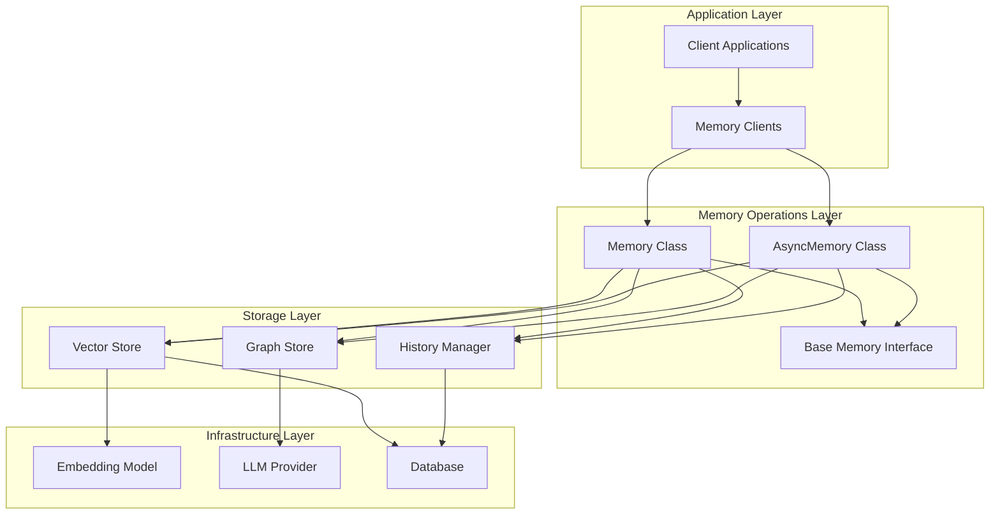

# Memory Operations

<cite>
**Referenced Files in This Document**
- [mem0/memory/main.py](file://mem0/memory/main.py)
- [mem0/client/main.py](file://mem0/client/main.py)
- [mem0/memory/base.py](file://mem0/memory/base.py)
- [cookbooks/helper/mem0_teachability.py](file://cookbooks/helper/mem0_teachability.py)
- [examples/misc/personal_assistant_agno.py](file://examples/misc/personal_assistant_agno.py)
- [examples/misc/study_buddy.py](file://examples/misc/study_buddy.py)
</cite>

## Table of Contents
1. [Introduction](#introduction)
2. [Architecture Overview](#architecture-overview)
3. [Core Memory Operations](#core-memory-operations)
4. [Synchronous vs Asynchronous Implementations](#synchronous-vs-asynchronous-implementations)
5. [Memory Types and Categories](#memory-types-and-categories)
6. [Advanced Operations](#advanced-operations)
7. [Usage Patterns and Examples](#usage-patterns-and-examples)
8. [Error Handling and Edge Cases](#error-handling-and-edge-cases)
9. [Performance Considerations](#performance-considerations)
10. [Best Practices](#best-practices)

## Introduction

Mem0 provides a comprehensive memory management system that enables applications to store, retrieve, and manage contextual information across conversations and interactions. The system supports multiple memory types, sophisticated search capabilities, and both synchronous and asynchronous operations to accommodate various use cases from simple chatbots to complex AI agents.

The memory operations framework is built around three core components:
- **Vector Store**: Persistent storage for embeddings and metadata
- **Graph Store**: Optional relationship modeling for complex knowledge graphs
- **History Manager**: Transactional logging for memory lifecycle tracking

## Architecture Overview

The memory system follows a layered architecture that separates concerns between storage, computation, and application logic:



**Diagram sources**
- [mem0/memory/main.py](file://mem0/memory/main.py#L131-L1000)
- [mem0/client/main.py](file://mem0/client/main.py#L24-L100)

**Section sources**
- [mem0/memory/main.py](file://mem0/memory/main.py#L131-L170)
- [mem0/client/main.py](file://mem0/client/main.py#L24-L50)

## Core Memory Operations

### Adding Memories

The `add` operation is the primary method for creating new memories in the system. It supports both basic and procedural memory types with intelligent inference capabilities.

#### Basic Memory Addition

```python
# Single message
memory.add("My favorite color is blue", user_id="user_123")

# Multiple messages
memory.add([
    {"role": "user", "content": "What's your favorite food?"},
    {"role": "assistant", "content": "I love pizza!"}
], user_id="user_123")
```

#### Procedural Memory Creation

Procedural memories capture skills and procedures learned through interactions:

```python
memory.add([
    {"role": "user", "content": "How do I bake a cake?"},
    {"role": "assistant", "content": "First, preheat oven to 350°F..."}
], agent_id="recipe_agent", memory_type="procedural_memory")
```

#### Method Signature and Parameters

```python
def add(self, messages, *, user_id=None, agent_id=None, run_id=None, 
        metadata=None, infer=True, memory_type=None, prompt=None):
```

**Parameters:**
- `messages`: String, dictionary, or list of message dictionaries
- `user_id`: Optional user identifier for session scoping
- `agent_id`: Optional agent identifier for procedural memories
- `run_id`: Optional run identifier for conversation tracking
- `metadata`: Optional metadata dictionary
- `infer`: Boolean flag for automatic fact extraction
- `memory_type`: Memory type specification ("procedural_memory")
- `prompt`: Custom prompt for memory creation

**Return Value:**
Dictionary containing operation results with memory IDs and events.

**Section sources**
- [mem0/memory/main.py](file://mem0/memory/main.py#L195-L308)
- [mem0/memory/main.py](file://mem0/memory/main.py#L870-L907)

### Searching Memories

The search operation enables semantic retrieval of relevant memories based on query content and optional filters.

#### Semantic Search

```python
# Basic semantic search
results = memory.search("favorite color", user_id="user_123")

# Search with scoring threshold
results = memory.search("favorite color", user_id="user_123", threshold=0.7)

# Search with additional filters
results = memory.search("food preferences", user_id="user_123", 
                       filters={"category": "preferences"})
```

#### Method Signature and Parameters

```python
def search(self, query, *, user_id=None, agent_id=None, run_id=None, 
           limit=100, filters=None, threshold=None):
```

**Parameters:**
- `query`: Search query string
- `user_id`: User identifier for scoping
- `agent_id`: Agent identifier for scoping
- `run_id`: Run identifier for scoping
- `limit`: Maximum number of results (default: 100)
- `filters`: Additional filter conditions
- `threshold`: Minimum similarity score threshold

**Return Value:**
Dictionary containing search results with scores and metadata.

**Section sources**
- [mem0/memory/main.py](file://mem0/memory/main.py#L644-L718)
- [mem0/client/main.py](file://mem0/client/main.py#L242-L278)

### Updating Memories

Direct memory updates allow modification of existing memory content while maintaining history tracking.

#### Direct Updates

```python
# Update memory content
memory.update("mem_123", "My favorite color is green")

# Update with new metadata
memory.update("mem_123", metadata={"color": "green", "timestamp": "2024-01-15"})
```

#### Method Signature and Parameters

```python
def update(self, memory_id, data):
```

**Parameters:**
- `memory_id`: Unique identifier of the memory to update
- `data`: New content or metadata for the memory

**Return Value:**
Success message dictionary.

**Section sources**
- [mem0/memory/main.py](file://mem0/memory/main.py#L758-L778)
- [mem0/client/main.py](file://mem0/client/main.py#L281-L314)

### Deleting Memories

Memory deletion supports both individual and bulk operations with transactional safety.

#### Single Memory Deletion

```python
# Delete individual memory
memory.delete("mem_123")
```

#### Bulk Memory Deletion

```python
# Delete all memories for a user
memory.delete_all(user_id="user_123")

# Delete all memories for an agent
memory.delete_all(agent_id="recipe_agent")
```

#### Method Signature and Parameters

```python
def delete(self, memory_id):
def delete_all(self, user_id=None, agent_id=None, run_id=None):
```

**Parameters:**
- `memory_id`: Individual memory identifier
- `user_id`: User identifier for bulk deletion
- `agent_id`: Agent identifier for bulk deletion
- `run_id`: Run identifier for bulk deletion

**Return Value:**
Success message dictionary.

**Section sources**
- [mem0/memory/main.py](file://mem0/memory/main.py#L780-L826)
- [mem0/client/main.py](file://mem0/client/main.py#L317-L367)

## Synchronous vs Asynchronous Implementations

Mem0 provides both synchronous and asynchronous variants of all memory operations to accommodate different application architectures.

### Synchronous Operations

Synchronous operations are suitable for traditional blocking applications and simpler use cases:

```python
# Synchronous memory operations
memory = Memory()

# Add memory synchronously
result = memory.add("Hello world", user_id="user_123")

# Search synchronously  
results = memory.search("hello", user_id="user_123")

# Update synchronously
update_result = memory.update("mem_123", "Hello universe")
```

### Asynchronous Operations

Asynchronous operations enable non-blocking execution and improved concurrency:

```python
# Asynchronous memory operations
async_memory = AsyncMemory()

# Add memory asynchronously
result = await async_memory.add("Hello world", user_id="user_123")

# Search asynchronously
results = await async_memory.search("hello", user_id="user_123")

# Update asynchronously
update_result = await async_memory.update("mem_123", "Hello universe")
```

### Performance Comparison

| Operation Type | Latency | Throughput | Use Case |
|----------------|---------|------------|----------|
| Synchronous | Low | Medium | Simple applications, CLI tools |
| Asynchronous | Medium | High | Web applications, APIs |
| Batch | Variable | Very High | Bulk operations |

**Section sources**
- [mem0/memory/main.py](file://mem0/memory/main.py#L1009-L1100)
- [mem0/memory/main.py](file://mem0/memory/main.py#L1160-L1346)

## Memory Types and Categories

Mem0 supports multiple memory types to capture different kinds of information:

### Conversational Memories

Standard memories capturing factual information from conversations:

```python
# User preferences
memory.add("User likes spicy food", user_id="user_123")

# Personal facts
memory.add("User's favorite color is blue", user_id="user_123")
```

### Procedural Memories

Skills and procedures learned through interactions:

```python
# Recipe knowledge
memory.add([
    {"role": "user", "content": "How to make pasta?"},
    {"role": "assistant", "content": "Boil water, add pasta, cook for 10 minutes..."}
], agent_id="cooking_agent", memory_type="procedural_memory")
```

### Episodic Memories

Contextual memories tied to specific events or conversations:

```python
# Event memories
memory.add("Had coffee with Sarah on Monday", user_id="user_123", 
           metadata={"event_type": "social", "context": "coffee_meeting"})
```

### Semantic Memories

General knowledge and concepts:

```python
# Conceptual knowledge
memory.add("Photosynthesis is the process by which plants convert sunlight into energy", 
           user_id="user_123", metadata={"knowledge_domain": "biology"})
```

**Section sources**
- [mem0/memory/main.py](file://mem0/memory/main.py#L870-L907)
- [mem0/memory/main.py](file://mem0/memory/main.py#L223-L226)

## Advanced Operations

### Batch Operations

Efficient bulk operations for large-scale memory management:

```python
# Batch add multiple memories
memories_to_add = [
    {"memory_id": "mem_1", "text": "User likes hiking", "metadata": {"hobby": "outdoor"}},
    {"memory_id": "mem_2", "text": "User prefers dogs", "metadata": {"pet_preference": "dogs"}}
]

client.batch_update(memories_to_add)

# Batch delete multiple memories
memories_to_delete = [
    {"memory_id": "mem_1"},
    {"memory_id": "mem_2"}
]

client.batch_delete(memories_to_delete)
```

### Memory History Tracking

Complete audit trail of memory modifications:

```python
# Get memory history
history = memory.history("mem_123")
for entry in history:
    print(f"Action: {entry['action']}, Timestamp: {entry['created_at']}")
```

### Graph Relationships

Optional graph store for modeling relationships between memories:

```python
# Graph relationships are automatically maintained when enabled
# Entities and relationships are extracted from conversation content
```

**Section sources**
- [mem0/client/main.py](file://mem0/client/main.py#L493-L542)
- [mem0/memory/main.py](file://mem0/memory/main.py#L828-L840)

## Usage Patterns and Examples

### Chatbot Memory Management

Integrating memory operations into conversational AI systems:

```python
class ChatbotWithMemory:
    def __init__(self):
        self.memory = Memory()
        self.conversation_history = []
    
    def process_message(self, user_input, user_id):
        # Retrieve relevant context
        context_memories = self.memory.search(user_input, user_id=user_id, limit=5)
        
        # Build conversation context
        context = "\n".join([f"- {mem['memory']}" for mem in context_memories['results']])
        
        # Generate response with context
        response = self.generate_response(user_input, context)
        
        # Store conversation
        self.memory.add([
            {"role": "user", "content": user_input},
            {"role": "assistant", "content": response}
        ], user_id=user_id)
        
        return response
```

### User Preference Tracking

Building personalized experiences through memory persistence:

```python
class PersonalizedAssistant:
    def __init__(self):
        self.memory = Memory()
    
    def get_personalized_recommendation(self, user_id, category):
        # Get user preferences
        preferences = self.memory.search(f"user preferences {category}", user_id=user_id)
        
        # Get recent interactions
        recent = self.memory.search(f"recent {category} interactions", user_id=user_id)
        
        # Generate recommendation based on memory
        recommendation = self.generate_recommendation(preferences, recent)
        
        # Store the interaction
        self.memory.add([
            {"role": "user", "content": f"Ask for {category} recommendation"},
            {"role": "assistant", "content": recommendation}
        ], user_id=user_id)
        
        return recommendation
```

### Study Assistant Implementation

Educational applications leveraging memory for spaced repetition:

```python
class StudyAssistant:
    def __init__(self):
        self.memory = Memory()
    
    def study_topic(self, user_id, topic, query):
        # Retrieve learning history
        history = self.memory.search(topic, user_id=user_id, limit=10)
        
        # Check for weaknesses
        weaknesses = self.detect_weaknesses(history)
        
        # Generate personalized response
        response = self.generate_study_response(topic, query, history, weaknesses)
        
        # Store the interaction
        self.memory.add([
            {"role": "user", "content": f"Study {topic}: {query}"},
            {"role": "assistant", "content": response}
        ], user_id=user_id, metadata={"topic": topic, "difficulty": weaknesses})
        
        return response
```

**Section sources**
- [cookbooks/helper/mem0_teachability.py](file://cookbooks/helper/mem0_teachability.py#L57-L140)
- [examples/misc/personal_assistant_agno.py](file://examples/misc/personal_assistant_agno.py#L31-L75)
- [examples/misc/study_buddy.py](file://examples/misc/study_buddy.py#L38-L60)

## Error Handling and Edge Cases

### Validation Errors

Common validation errors and their solutions:

```python
try:
    # Invalid memory type
    memory.add("Test", memory_type="invalid_type")
except Mem0ValidationError as e:
    print(f"Validation error: {e}")

try:
    # Missing required identifier
    memory.add("Test")  # No user_id, agent_id, or run_id
except Mem0ValidationError as e:
    print(f"Missing identifier: {e}")
```

### Network and Storage Errors

Robust error handling for production applications:

```python
def safe_memory_operation(operation, *args, **kwargs):
    try:
        return operation(*args, **kwargs)
    except ValidationError as e:
        logger.error(f"Validation failed: {e}")
        return {"error": "validation_failed", "details": str(e)}
    except AuthenticationError as e:
        logger.error(f"Authentication failed: {e}")
        return {"error": "authentication_failed", "details": str(e)}
    except RateLimitError as e:
        logger.error(f"Rate limit exceeded: {e}")
        return {"error": "rate_limit_exceeded", "details": str(e)}
    except MemoryQuotaExceededError as e:
        logger.error(f"Memory quota exceeded: {e}")
        return {"error": "quota_exceeded", "details": str(e)}
    except NetworkError as e:
        logger.error(f"Network error: {e}")
        return {"error": "network_error", "details": str(e)}
    except MemoryNotFoundError as e:
        logger.error(f"Memory not found: {e}")
        return {"error": "memory_not_found", "details": str(e)}
    except Exception as e:
        logger.error(f"Unexpected error: {e}")
        return {"error": "internal_error", "details": str(e)}
```

### Memory Cleanup Strategies

Managing memory growth and performance:

```python
def cleanup_old_memories(memory_client, days_old=90):
    """Remove memories older than specified days."""
    cutoff_date = datetime.now() - timedelta(days=days_old)
    
    all_memories = memory_client.get_all()
    for memory in all_memories:
        created_at = datetime.fromisoformat(memory['created_at'])
        if created_at < cutoff_date:
            memory_client.delete(memory['id'])

def archive_important_memories(memory_client, memory_ids):
    """Mark memories as archived."""
    for memory_id in memory_ids:
        memory = memory_client.get(memory_id)
        memory_client.update(memory_id, metadata={
            **memory.get('metadata', {}),
            'archived': True,
            'archive_date': datetime.now().isoformat()
        })
```

**Section sources**
- [mem0/memory/main.py](file://mem0/memory/main.py#L1117-L1122)
- [mem0/client/main.py](file://mem0/client/main.py#L130-L168)

## Performance Considerations

### Scalability Guidelines

For applications managing large memory sets:

| Memory Count | Recommended Approach | Performance Notes |
|--------------|---------------------|-------------------|
| < 1,000 | Single vector store | Good performance |
| 1,000 - 10,000 | Indexed vector store | Optimal for search |
| 10,000+ | Partitioned storage | Consider sharding |
| 100,000+ | Distributed vector store | Use clustering |

### Search Optimization

Optimizing search performance for large datasets:

```python
# Use appropriate limits
results = memory.search("query", user_id="user_123", limit=10)

# Apply filters to reduce search space
results = memory.search("query", user_id="user_123", 
                       filters={"category": "important"})

# Set thresholds to filter low-relevance results
results = memory.search("query", user_id="user_123", threshold=0.7)
```

### Batch Operation Efficiency

Optimizing bulk operations:

```python
# Process in batches for large datasets
def batch_process_memories(memory_client, memories, batch_size=100):
    for i in range(0, len(memories), batch_size):
        batch = memories[i:i + batch_size]
        memory_client.batch_update(batch)
```

### Memory Management Best Practices

- **Regular cleanup**: Remove outdated memories periodically
- **Index optimization**: Maintain vector store indices
- **Connection pooling**: Reuse database connections
- **Caching**: Cache frequently accessed memories
- **Monitoring**: Track memory usage and performance metrics

## Best Practices

### Memory Design Principles

1. **Granularity**: Store memories at appropriate granularity
   ```python
   # Good: Specific facts
   memory.add("User's favorite color is blue", user_id="user_123")
   
   # Avoid: Overly broad statements
   memory.add("User likes things", user_id="user_123")  # Too vague
   ```

2. **Context Preservation**: Include relevant context
   ```python
   memory.add("User prefers Italian food", user_id="user_123", 
              metadata={"context": "meal_preferences", "priority": "high"})
   ```

3. **Temporal Awareness**: Track when memories were formed
   ```python
   memory.add("Learned about quantum physics", user_id="user_123",
              metadata={"timestamp": datetime.now().isoformat()})
   ```

### Security and Privacy

1. **Data Classification**: Classify memory content appropriately
2. **Access Control**: Implement proper access controls
3. **Data Retention**: Define retention policies
4. **Anonymization**: Anonymize sensitive information

### Monitoring and Maintenance

1. **Performance Monitoring**: Track operation latency
2. **Error Rates**: Monitor failure rates
3. **Storage Growth**: Track memory storage usage
4. **Quality Metrics**: Measure search relevance

**Section sources**
- [mem0/memory/main.py](file://mem0/memory/main.py#L195-L242)
- [mem0/client/main.py](file://mem0/client/main.py#L131-L168)