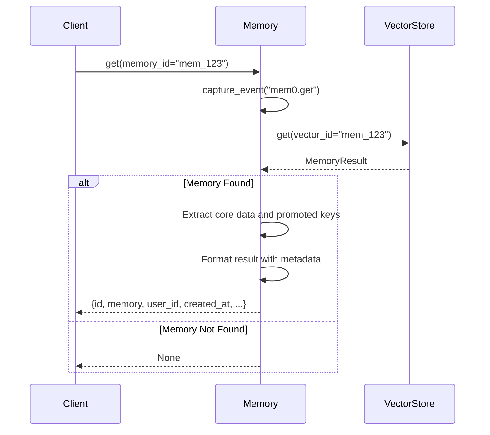
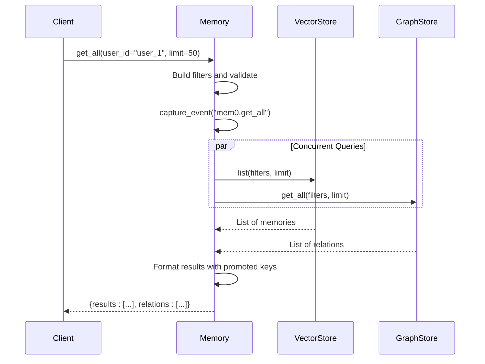
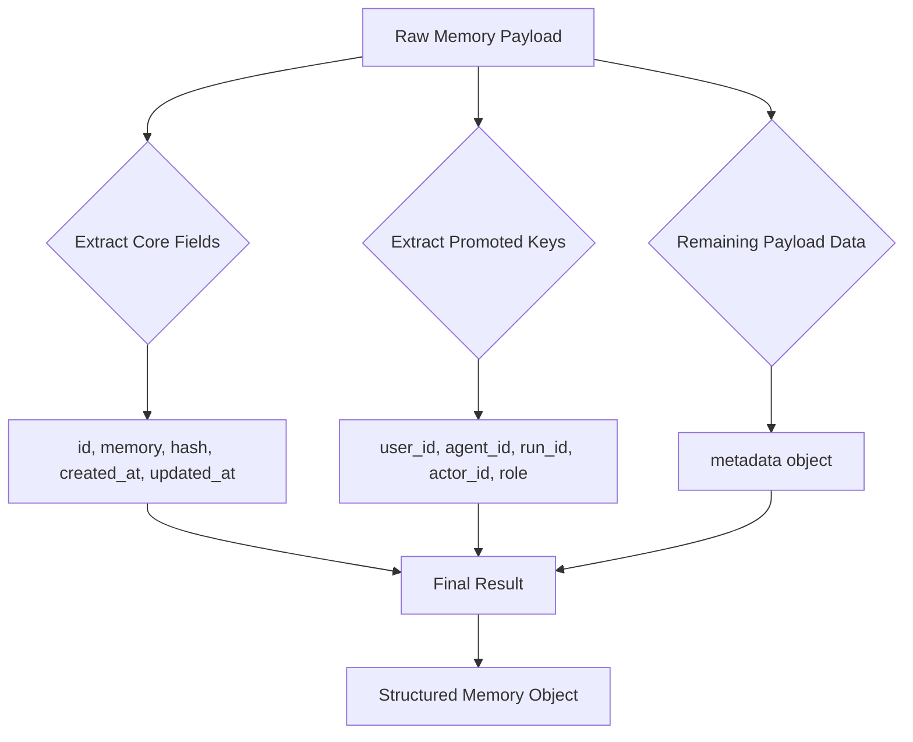
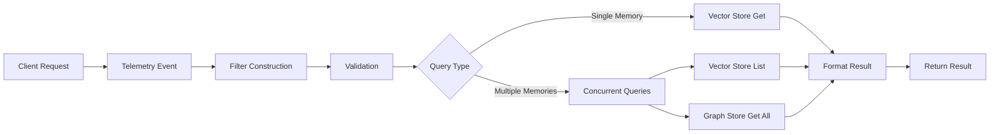

# Retrieving Memories

<cite>
**Referenced Files in This Document**   
- [main.py](file://mem0/memory/main.py)
- [base.py](file://mem0/memory/base.py)
- [client/main.py](file://mem0/client/main.py)
</cite>

## Table of Contents
1. [Introduction](#introduction)
2. [Core Retrieval Methods](#core-retrieval-methods)
3. [Single Memory Retrieval with get()](#single-memory-retrieval-with-get)
4. [Comprehensive Memory Listing with get_all()](#comprehensive-memory-listing-with-get_all)
5. [Payload Key Promotion and Metadata Handling](#payload-key-promotion-and-metadata-handling)
6. [Internal Workflow and Data Flow](#internal-workflow-and-data-flow)
7. [Usage Examples and Debugging Patterns](#usage-examples-and-debugging-patterns)
8. [Common Issues and Solutions](#common-issues-and-solutions)
9. [Performance Considerations](#performance-considerations)
10. [Conclusion](#conclusion)

## Introduction
This document provides a comprehensive analysis of memory retrieval functionality in the Mem0 system. The focus is on the `get()` and `get_all()` methods, which are fundamental for accessing stored memories. These methods enable both targeted retrieval of individual memories by ID and comprehensive listing of multiple memories with filtering capabilities. The implementation involves a sophisticated workflow that integrates vector store retrieval, payload parsing, and concurrent graph store queries. The system is designed to handle various session identifiers (user_id, agent_id, run_id) and provides robust metadata handling for flexible memory organization and retrieval. This documentation will explore the technical details, usage patterns, performance characteristics, and best practices for effectively retrieving memories from the system.

## Core Retrieval Methods
The Mem0 system provides two primary methods for retrieving memories: `get()` for single memory retrieval by ID and `get_all()` for comprehensive listing of memories with filtering capabilities. Both methods are implemented in the Memory class and follow a consistent pattern of operation. The `get()` method is designed for precise retrieval of a specific memory, while `get_all()` enables broader queries with optional filtering parameters. These methods are available in both synchronous and asynchronous variants, allowing for flexible integration into different application architectures. The implementation leverages a vector store for efficient memory storage and retrieval, with additional support for graph-based relationships when enabled. The methods return structured data that includes core memory information, promoted payload keys, and additional metadata, providing a comprehensive view of the retrieved memories.

**Section sources**
- [main.py](file://mem0/memory/main.py#L493-L535)
- [main.py](file://mem0/memory/main.py#L537-L603)

## Single Memory Retrieval with get()
The `get()` method enables retrieval of a specific memory by its unique identifier. This method takes a single parameter, `memory_id`, which is a string representing the ID of the memory to retrieve. When called, the method first captures a telemetry event for monitoring purposes, then queries the vector store using the provided ID. If a memory is found, it is processed to extract core information and promoted payload keys. The method returns a dictionary containing the retrieved memory data, including the memory ID, content, hash, timestamps, and any promoted keys such as user_id, agent_id, or run_id. If no memory is found with the specified ID, the method returns None. The implementation includes error handling to manage cases where the memory ID is invalid or the memory cannot be retrieved from the vector store.



**Diagram sources **
- [main.py](file://mem0/memory/main.py#L493-L535)

**Section sources**
- [main.py](file://mem0/memory/main.py#L493-L535)
- [base.py](file://mem0/memory/base.py#L5-L15)

## Comprehensive Memory Listing with get_all()
The `get_all()` method provides functionality for retrieving multiple memories with optional filtering. This method accepts several parameters including user_id, agent_id, run_id, custom filters, and a limit parameter to control the number of results returned. The method first constructs effective filters using the provided session identifiers and custom filters, then validates that at least one session identifier is specified. It captures telemetry data for monitoring, then executes concurrent queries to both the vector store and graph store (if enabled). The vector store query retrieves memories based on the constructed filters, while the graph store query retrieves related entities. The results are then formatted to include core memory data, promoted payload keys, and additional metadata. The method returns a dictionary with a "results" key containing the list of memories and, if the graph store is enabled, a "relations" key containing the related entities. For API version v1.0, a deprecation warning is issued as the return format differs from the newer v1.1 standard.



**Diagram sources **
- [main.py](file://mem0/memory/main.py#L537-L603)

**Section sources**
- [main.py](file://mem0/memory/main.py#L537-L603)
- [main.py](file://mem0/memory/main.py#L605-L642)

## Payload Key Promotion and Metadata Handling
The memory retrieval system implements a sophisticated payload key promotion mechanism to elevate important contextual information to the top level of the result structure. The promoted payload keys include user_id, agent_id, run_id, actor_id, and role, which are extracted from the memory payload and included directly in the result dictionary. This promotion enhances usability by making these commonly accessed identifiers readily available without requiring navigation into nested metadata structures. Any remaining payload data that is not part of the core fields or promoted keys is consolidated into a "metadata" field in the result. This approach provides a clean separation between essential memory data and additional contextual information. The system handles metadata parsing defensively, ensuring that missing or malformed data does not cause retrieval failures. When processing the payload, the implementation checks for the presence of each promoted key and only includes it in the result if it exists in the source data, maintaining data integrity while providing a consistent result structure.



**Diagram sources **
- [main.py](file://mem0/memory/main.py#L517-L533)
- [main.py](file://mem0/memory/main.py#L613-L639)

**Section sources**
- [main.py](file://mem0/memory/main.py#L517-L533)
- [main.py](file://mem0/memory/main.py#L613-L639)

## Internal Workflow and Data Flow
The memory retrieval process follows a well-defined internal workflow that ensures efficient and reliable data access. For single memory retrieval via the `get()` method, the workflow begins with telemetry event capture, followed by a direct query to the vector store using the memory ID. The retrieved memory object is then processed to extract core data fields and promoted payload keys, with any remaining payload data consolidated into a metadata object. For comprehensive listing via the `get_all()` method, the workflow is more complex, involving filter construction, validation, and concurrent execution of vector and graph store queries. The system uses thread pools to execute these queries in parallel, improving performance for requests that involve both vector and graph data. The results from both stores are then combined and formatted into a consistent structure. Throughout this process, the system maintains data integrity by handling missing or malformed data gracefully and providing meaningful error messages when issues occur. The workflow is designed to be extensible, allowing for additional data sources or processing steps to be incorporated without disrupting the core retrieval functionality.



**Diagram sources **
- [main.py](file://mem0/memory/main.py#L493-L535)
- [main.py](file://mem0/memory/main.py#L537-L603)

**Section sources**
- [main.py](file://mem0/memory/main.py#L493-L535)
- [main.py](file://mem0/memory/main.py#L537-L603)

## Usage Examples and Debugging Patterns
The memory retrieval methods can be used in various patterns for debugging and auditing memory content. For single memory retrieval, a common pattern is to retrieve a specific memory by ID to verify its content and metadata:
```python
memory = memory_instance.get("mem_123")
print(f"Memory content: {memory['memory']}")
print(f"Created at: {memory['created_at']}")
print(f"User ID: {memory.get('user_id')}")
```
For comprehensive memory listing, developers can retrieve all memories for a specific user to audit memory content:
```python
memories = memory_instance.get_all(user_id="user_1", limit=100)
for memory in memories['results']:
    print(f"ID: {memory['id']}, Content: {memory['memory']}, Created: {memory['created_at']}")
```
When debugging memory state, developers can combine retrieval with history inspection:
```python
memory = memory_instance.get("mem_123")
history = memory_instance.history("mem_123")
print(f"Current state: {memory['memory']}")
print(f"History length: {len(history)}")
```
These patterns enable thorough inspection of memory content and state, facilitating debugging and system verification. The client library also provides convenience methods for these operations, making it easy to integrate memory retrieval into application workflows.

**Section sources**
- [main.py](file://mem0/memory/main.py#L493-L535)
- [main.py](file://mem0/memory/main.py#L537-L603)
- [client/main.py](file://mem0/client/main.py#L171-L193)

## Common Issues and Solutions
Several common issues may arise when retrieving memories, along with corresponding solutions. One frequent issue is attempting to retrieve a memory with an incorrect or non-existent ID, which results in a None return value. The solution is to validate the memory ID before retrieval and handle the None case appropriately in the calling code. Another issue is missing memories due to incorrect session identifiers (user_id, agent_id, run_id) in the filters, which can be resolved by verifying the correct session context is being used. Performance issues may occur when retrieving large numbers of memories without proper limiting, which can be addressed by using the limit parameter effectively. When the graph store is enabled but not properly configured, relation data may be missing from results, requiring verification of the graph store configuration. Finally, metadata parsing errors can occur with malformed payload data, which the system handles defensively by skipping problematic fields while preserving the rest of the memory data.

**Section sources**
- [main.py](file://mem0/memory/main.py#L493-L535)
- [main.py](file://mem0/memory/main.py#L537-L603)
- [main.py](file://mem0/memory/main.py#L912-L916)

## Performance Considerations
Performance optimization is critical when retrieving memories, particularly for full collection scans and large result sets. The `get()` method for single memory retrieval is generally efficient as it uses a direct ID-based lookup in the vector store. However, the `get_all()` method can become a performance bottleneck when retrieving large numbers of memories, especially without proper limiting. The limit parameter should be used judiciously to control result set size and prevent excessive memory usage and network transfer. For applications requiring pagination, implementing client-side pagination with appropriate limit values is recommended. When the graph store is enabled, the concurrent execution of vector and graph queries can impact performance, so it should be disabled when relation data is not needed. Caching frequently accessed memories can significantly improve performance for read-heavy workloads. Additionally, ensuring proper indexing on the vector store and optimizing the underlying database configuration can enhance retrieval performance for large datasets.

**Section sources**
- [main.py](file://mem0/memory/main.py#L537-L603)
- [main.py](file://mem0/memory/main.py#L544-L545)
- [main.py](file://mem0/memory/main.py#L577-L581)

## Conclusion
The memory retrieval system in Mem0 provides robust functionality for accessing stored memories through the `get()` and `get_all()` methods. These methods enable both precise single memory retrieval and comprehensive listing with filtering capabilities, supporting various use cases from debugging to auditing. The implementation leverages a sophisticated workflow that integrates vector store retrieval, payload parsing, and concurrent graph store queries, providing a comprehensive view of memory data. The payload key promotion mechanism enhances usability by elevating important contextual information to the top level of the result structure, while metadata handling ensures data integrity and flexibility. By understanding the internal workflow, usage patterns, and performance considerations, developers can effectively utilize these methods to build applications that leverage persistent memory storage and retrieval. The system's design balances functionality, performance, and extensibility, making it suitable for a wide range of applications requiring persistent memory management.