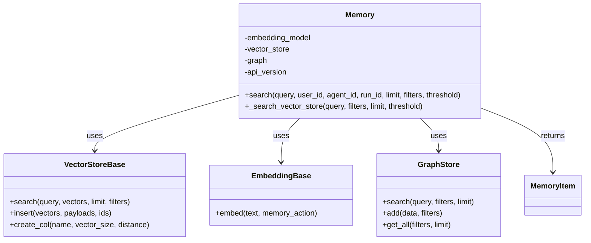
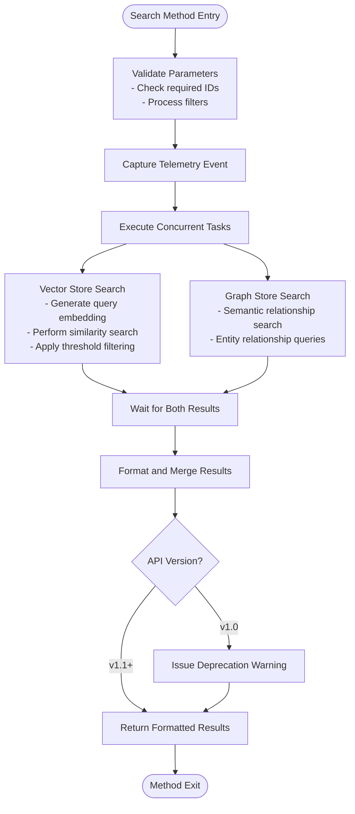
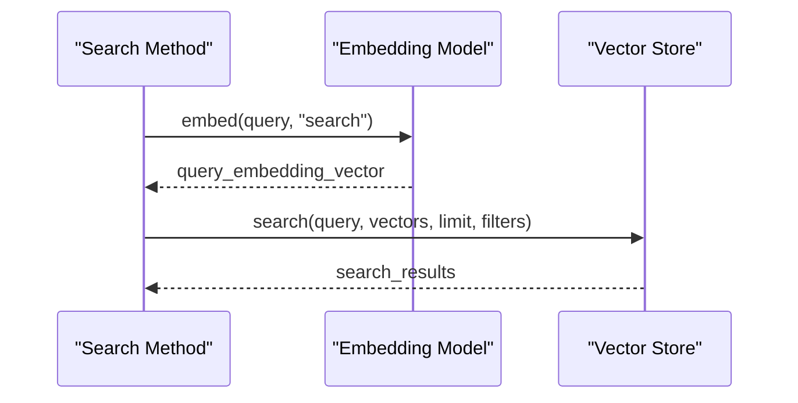
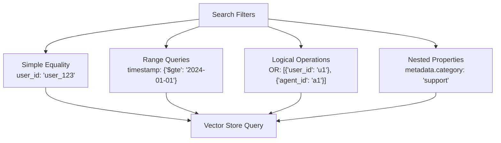
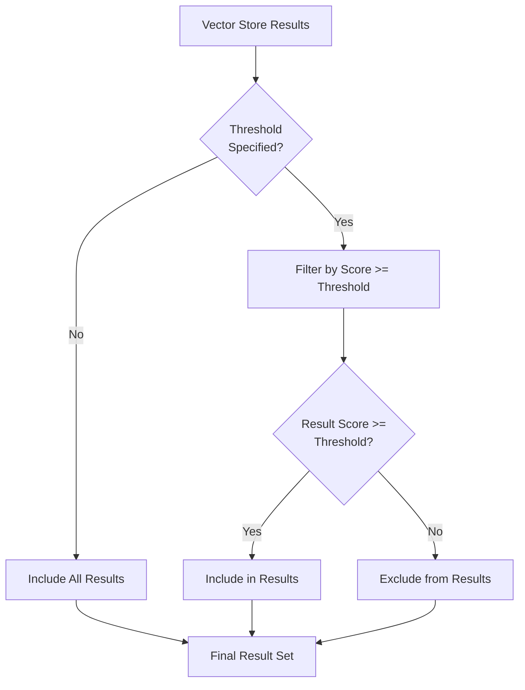
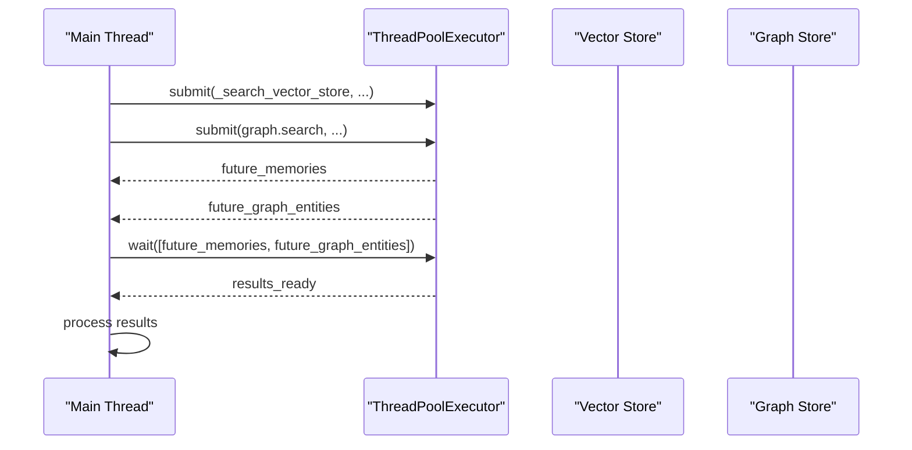

# Searching Memories

<cite>
**Referenced Files in This Document**
- [mem0/memory/main.py](file://mem0/memory/main.py)
- [mem0/client/main.py](file://mem0/client/main.py)
- [mem0/vector_stores/base.py](file://mem0/vector_stores/base.py)
- [mem0/embeddings/base.py](file://mem0/embeddings/base.py)
- [mem0/memory/base.py](file://mem0/memory/base.py)
- [mem0/graphs/tools.py](file://mem0/graphs/tools.py)
- [mem0/configs/base.py](file://mem0/configs/base.py)
- [mem0-ts/src/oss/src/memory/index.ts](file://mem0-ts/src/oss/src/memory/index.ts)
- [mem0-ts/src/oss/src/vector_stores/base.ts](file://mem0-ts/src/oss/src/vector_stores/base.ts)
- [mem0-ts/src/client/tests/memoryClient.test.ts](file://mem0-ts/src/client/tests/memoryClient.test.ts)
- [LLM.md](file://LLM.md)
</cite>

## Table of Contents
1. [Introduction](#introduction)
2. [Search Method Architecture](#search-method-architecture)
3. [Parameter Specifications](#parameter-specifications)
4. [Internal Workflow](#internal-workflow)
5. [Vector Similarity Search](#vector-similarity-search)
6. [Filtered Search Implementation](#filtered-search-implementation)
7. [Threshold-Based Filtering](#threshold-based-filtering)
8. [Concurrent Processing](#concurrent-processing)
9. [Usage Examples](#usage-examples)
10. [Performance Considerations](#performance-considerations)
11. [Common Issues and Solutions](#common-issues-and-solutions)
12. [Best Practices](#best-practices)

## Introduction

The Mem0 search functionality provides sophisticated memory retrieval capabilities through semantic similarity search and metadata filtering. The system combines vector-based semantic search with traditional metadata filtering to deliver highly relevant results for AI conversations and knowledge retrieval tasks.

The search implementation supports multiple vector stores, concurrent processing of vector and graph searches, and configurable relevance scoring through threshold-based filtering. This dual-layer approach ensures both semantic relevance and precise contextual targeting.

## Search Method Architecture

The search functionality is implemented through the `search()` method in the Memory class, which orchestrates a sophisticated workflow combining vector similarity search with optional graph store queries.



**Diagram sources**
- [mem0/memory/main.py](file://mem0/memory/main.py#L644-L756)
- [mem0/vector_stores/base.py](file://mem0/vector_stores/base.py#L4-L59)
- [mem0/embeddings/base.py](file://mem0/embeddings/base.py#L7-L32)

**Section sources**
- [mem0/memory/main.py](file://mem0/memory/main.py#L644-L756)

## Parameter Specifications

The search method accepts several parameters that control the search behavior and result filtering:

### Core Parameters

| Parameter | Type | Description | Default |
|-----------|------|-------------|---------|
| `query` | `str` | The search query string for semantic similarity | Required |
| `user_id` | `Optional[str]` | User identifier for memory scoping | `None` |
| `agent_id` | `Optional[str]` | Agent identifier for memory scoping | `None` |
| `run_id` | `Optional[str]` | Run/session identifier for memory scoping | `None` |
| `limit` | `int` | Maximum number of results to return | `100` |
| `filters` | `Optional[Dict[str, Any]]` | Additional metadata filters | `None` |
| `threshold` | `Optional[float]` | Minimum relevance score for inclusion | `None` |

### Parameter Validation and Processing

The search method validates that at least one of `user_id`, `agent_id`, or `run_id` is provided, ensuring proper memory scoping. The `_build_filters_and_metadata` function processes these parameters into effective filters for both vector store and graph store queries.

**Section sources**
- [mem0/memory/main.py](file://mem0/memory/main.py#L644-L670)

## Internal Workflow

The search method follows a structured workflow that ensures optimal performance and result quality:



**Diagram sources**
- [mem0/memory/main.py](file://mem0/memory/main.py#L678-L718)

The workflow begins with parameter validation and telemetry capture, followed by concurrent execution of vector store and graph store searches. Results are then formatted and returned based on the API version specification.

**Section sources**
- [mem0/memory/main.py](file://mem0/memory/main.py#L678-L718)

## Vector Similarity Search

Vector similarity search forms the core of the semantic search capability. The process involves several key steps:

### Query Embedding Generation

The search method generates embeddings for the query using the configured embedding model:



**Diagram sources**
- [mem0/memory/main.py](file://mem0/memory/main.py#L720-L722)

### Similarity Calculation

Different vector stores implement various similarity metrics:

| Vector Store | Similarity Metric | Distance Formula |
|--------------|-------------------|------------------|
| PostgreSQL/pgvector | Cosine Similarity | `1 - (A ⋅ B) / (||A|| × ||B||)` |
| Redis | Euclidean Distance | `√Σ(ai - bi)²` |
| Qdrant | Dot Product | `A ⋅ B` |
| Pinecone | Cosine/Angle | Various configurable options |
| Milvus | L2/Cosine/IP | Configurable distance functions |

### Search Execution

The vector store performs the similarity search using the generated query embedding against the stored vector database. The search returns results sorted by similarity score, with configurable limits.

**Section sources**
- [mem0/memory/main.py](file://mem0/memory/main.py#L720-L722)

## Filtered Search Implementation

Filtered search allows for precise targeting of memories based on metadata attributes. The filtering system supports multiple approaches:

### Metadata Scoping

The search method automatically applies session-based scoping through the `user_id`, `agent_id`, and `run_id` parameters. These identifiers are combined with any additional filters to create effective query filters.

### Advanced Filtering Patterns

The system supports complex filtering scenarios:



**Diagram sources**
- [mem0-ts/src/client/tests/memoryClient.test.ts](file://mem0-ts/src/client/tests/memoryClient.test.ts#L162-L170)

### Filter Processing

The `_build_filters_and_metadata` function processes input filters and merges them with session identifiers, ensuring proper scoping and filtering for both vector store and graph store queries.

**Section sources**
- [mem0/memory/main.py](file://mem0/memory/main.py#L671-L672)

## Threshold-Based Filtering

Threshold-based filtering provides fine-grained control over result relevance by applying minimum similarity score requirements:

### Relevance Scoring

Each vector store calculates relevance scores based on its similarity metric:

- **Cosine Similarity**: Range 0.0 to 1.0 (higher = more similar)
- **Euclidean Distance**: Lower values indicate higher similarity
- **Dot Product**: Higher positive values indicate stronger association

### Threshold Application

The search method applies threshold filtering in the `_search_vector_store` method:



**Diagram sources**
- [mem0/memory/main.py](file://mem0/memory/main.py#L753-L754)

### Impact on Result Quality

Threshold filtering significantly impacts result quality and quantity:

- **Low Threshold (0.3-0.5)**: Broader results, higher recall, potential noise
- **Medium Threshold (0.6-0.7)**: Balanced results, good precision/recall tradeoff
- **High Threshold (0.8-0.9)**: Precise results, lower recall, reduced noise

**Section sources**
- [mem0/memory/main.py](file://mem0/memory/main.py#L753-L754)

## Concurrent Processing

The search implementation leverages concurrent processing to optimize performance and reduce latency:

### ThreadPoolExecutor Usage

The search method uses `concurrent.futures.ThreadPoolExecutor` to execute vector store and graph store searches in parallel:



**Diagram sources**
- [mem0/memory/main.py](file://mem0/memory/main.py#L692-L700)

### Benefits of Concurrency

- **Reduced Latency**: Vector and graph searches execute simultaneously
- **Resource Efficiency**: Better utilization of CPU and I/O resources
- **Scalability**: Handles larger result sets more effectively
- **Fault Isolation**: Failure in one store doesn't affect the other

### Conditional Graph Search

Graph store search is executed only when graph store is enabled, avoiding unnecessary overhead for applications that don't require graph capabilities.

**Section sources**
- [mem0/memory/main.py](file://mem0/memory/main.py#L692-L700)

## Usage Examples

### Basic Search Operation

```python
# Simple semantic search
results = memory.search(
    query="What is my name?",
    user_id="user_123"
)

# Search with result limiting
results = memory.search(
    query="technical issues",
    user_id="user_123",
    limit=10
)
```

### Advanced Filtering Examples

```python
# Multi-criteria search with threshold
results = memory.search(
    query="login problems",
    user_id="user_123",
    agent_id="support_agent",
    threshold=0.7,
    limit=5
)

# Complex filter combinations
results = memory.search(
    query="account management",
    filters={
        "metadata.category": "billing",
        "metadata.priority": {"$gte": 2}
    },
    limit=20
)
```

### Client API Usage

```python
# Using the client API
client = MemoryClient(api_key="your-api-key")

# Search with filters
search_options = {
    "query": "What do you know about me?",
    "filters": {
        "OR": [{"user_id": "user_123"}, {"agent_id": "shopping-assistant"}],
        "threshold": 0.1
    }
}

results = client.search("What do you know about me?", search_options)
```

**Section sources**
- [mem0-ts/src/client/tests/memoryClient.test.ts](file://mem0-ts/src/client/tests/memoryClient.test.ts#L162-L170)
- [LLM.md](file://LLM.md#L184-L187)

## Performance Considerations

### High-Dimensional Vector Searches

Vector search performance depends on several factors:

#### Dimensionality Impact

- **Lower Dimensions (128-384)**: Faster computation, potentially less accurate
- **Standard Dimensions (768-1536)**: Good balance of speed and accuracy
- **Higher Dimensions (2048+)**: More accurate but slower computation

#### Vector Store Optimizations

| Vector Store | Optimization Strategies |
|--------------|------------------------|
| FAISS | Index types (IVF, HNSW), quantization |
| Pinecone | Index configuration, hybrid search |
| Qdrant | Sharding, replication, quantization |
| Redis | Memory vs disk storage, clustering |

### Large Result Sets

For applications dealing with large result sets:

#### Pagination Strategies

```python
# Implement pagination for large result sets
def search_with_pagination(memory, query, user_id, page=1, page_size=50):
    results = memory.search(
        query=query,
        user_id=user_id,
        limit=page_size,
        offset=(page - 1) * page_size
    )
    return results
```

#### Streaming Results

Consider implementing streaming for very large result sets to improve responsiveness.

### Memory Management

The search implementation includes automatic garbage collection and resource cleanup to handle large-scale operations efficiently.

**Section sources**
- [mem0/memory/main.py](file://mem0/memory/main.py#L692-L700)

## Common Issues and Solutions

### Insufficient Results Due to Strict Thresholds

**Problem**: Search returns few or no results despite having relevant memories.

**Causes**:
- Threshold set too high for available data
- Poor embedding quality affecting similarity scores
- Insufficient training data for the embedding model

**Solutions**:
```python
# Solution 1: Lower the threshold gradually
results = memory.search(
    query="problem",
    user_id="user_123",
    threshold=0.3  # Start with lower threshold
)

# Solution 2: Use threshold=None to get all results
results = memory.search(
    query="problem",
    user_id="user_123",
    threshold=None
)

# Solution 3: Combine multiple searches with different thresholds
low_threshold_results = memory.search(
    query="problem",
    user_id="user_123",
    threshold=0.3,
    limit=50
)

high_threshold_results = memory.search(
    query="problem",
    user_id="user_123",
    threshold=0.7,
    limit=20
)
```

### Performance Degradation

**Problem**: Search operations become slow with increasing data volume.

**Solutions**:
- Implement result limiting with appropriate `limit` parameter
- Use threshold filtering to reduce result set size
- Consider vector store indexing optimizations
- Implement caching for frequently searched queries

### Embedding Dimension Mismatches

**Problem**: Vector dimension mismatches causing search failures.

**Solution**: Ensure consistent embedding model configuration across the system. Check that the embedding model dimensions match the vector store expectations.

**Section sources**
- [mem0/memory/main.py](file://mem0/memory/main.py#L753-L754)

## Best Practices

### Search Query Optimization

1. **Use Specific Keywords**: More specific queries yield better results
2. **Context-Aware Queries**: Include relevant context from the conversation
3. **Iterative Refinement**: Start with broader queries and narrow down with filters

### Threshold Selection Guidelines

```python
# Adaptive threshold selection based on use case
def get_optimal_threshold(use_case):
    thresholds = {
        "general_conversation": 0.5,
        "technical_support": 0.7,
        "personal_assistance": 0.6,
        "knowledge_retrieval": 0.4
    }
    return thresholds.get(use_case, 0.5)
```

### Filter Design Patterns

1. **Hierarchical Filtering**: Apply broad filters first, then refine
2. **Temporal Scoping**: Use timestamps for recent content prioritization
3. **Category-Based Filtering**: Organize memories by functional categories

### Monitoring and Analytics

Implement monitoring for search performance and effectiveness:

```python
# Track search effectiveness
def monitor_search_effectiveness(memory, query, expected_results):
    results = memory.search(query=query, user_id="user_123")
    
    # Calculate hit rate
    hit_rate = len(results) / len(expected_results) if expected_results else 0
    
    # Monitor average score
    avg_score = sum(result.get('score', 0) for result in results) / len(results) if results else 0
    
    return {
        "hit_rate": hit_rate,
        "average_score": avg_score,
        "result_count": len(results)
    }
```

These best practices ensure optimal search performance and result quality across different use cases and data volumes.