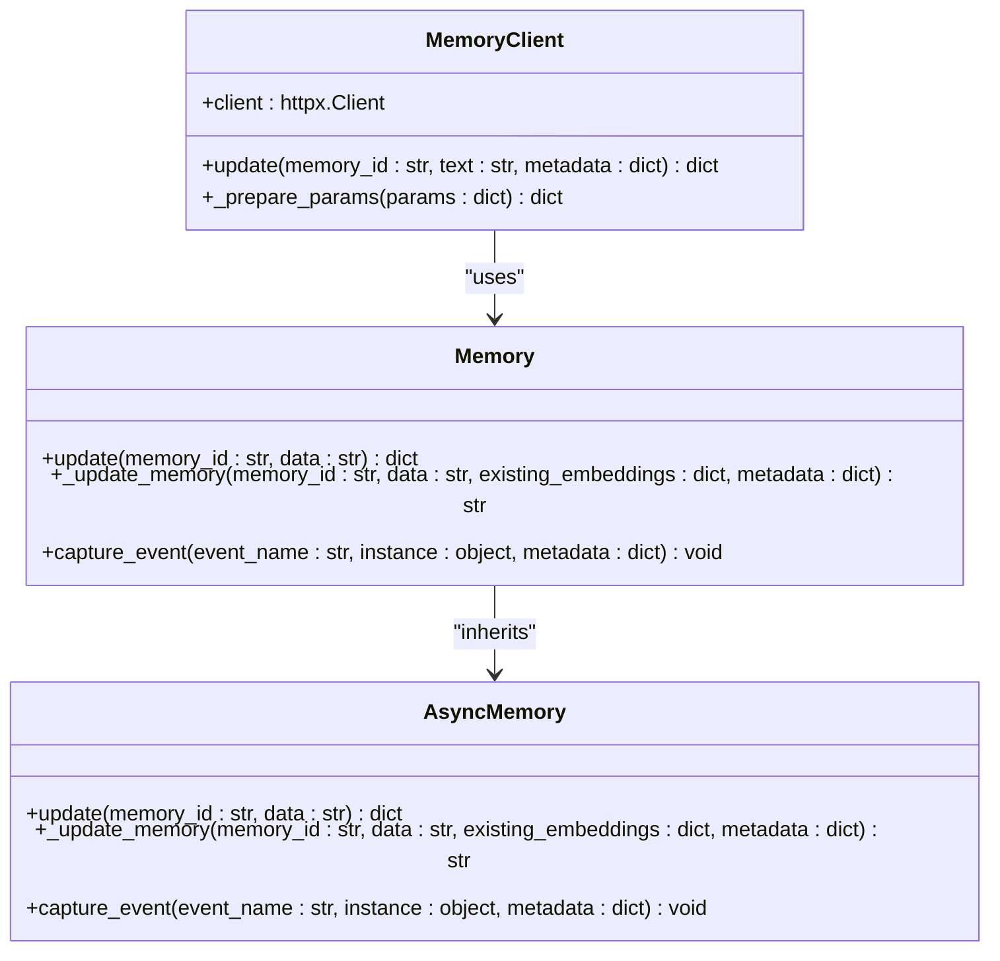
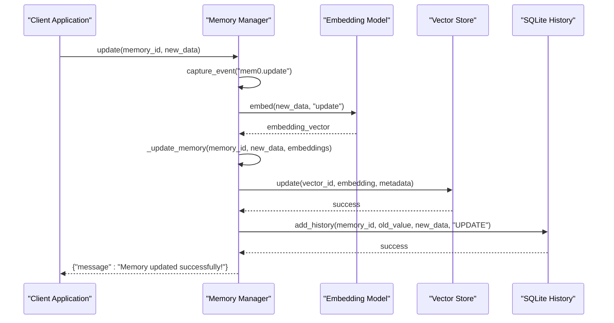
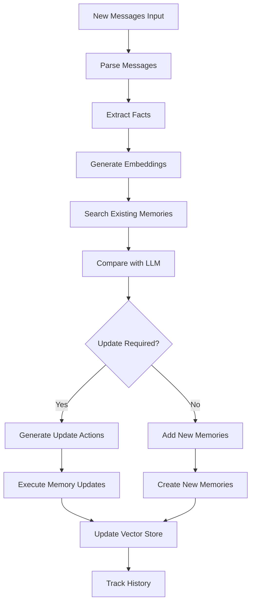
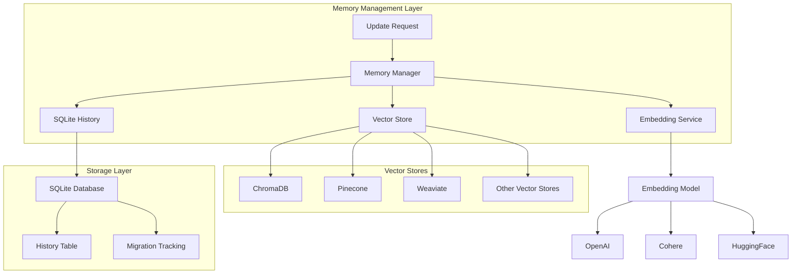
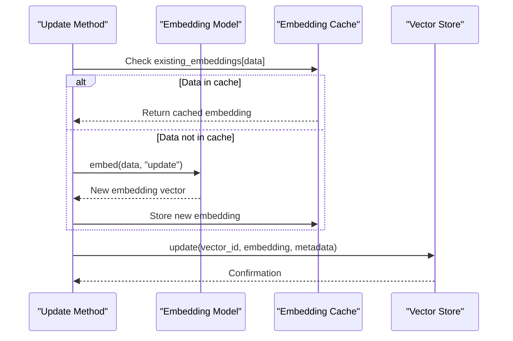
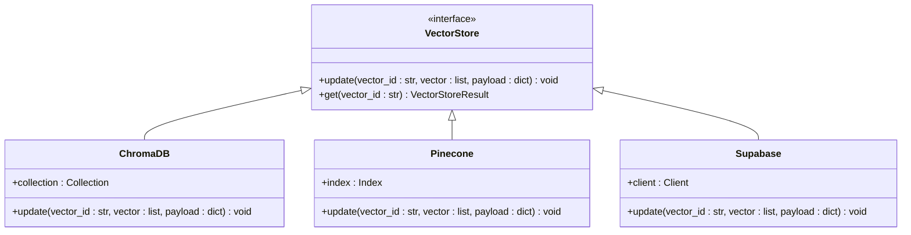
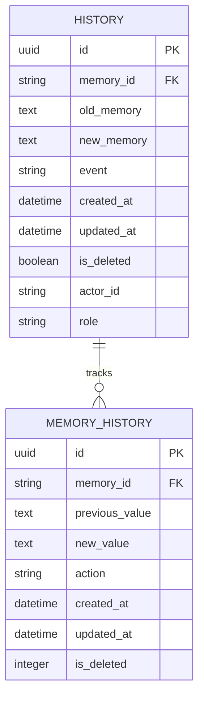
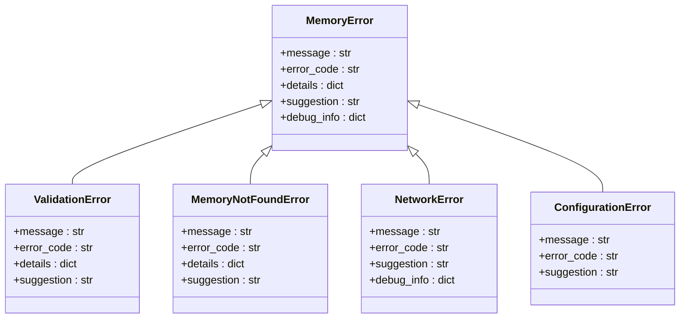
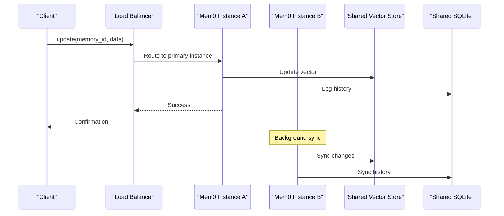

# Updating Memories

<cite>
**Referenced Files in This Document**
- [mem0/memory/main.py](file://mem0/memory/main.py)
- [mem0/client/main.py](file://mem0/client/main.py)
- [mem0/memory/storage.py](file://mem0/memory/storage.py)
- [mem0-ts/src/oss/src/memory/index.ts](file://mem0-ts/src/oss/src/memory/index.ts)
- [mem0-ts/src/oss/src/vector_stores/memory.ts](file://mem0-ts/src/oss/src/vector_stores/memory.ts)
- [mem0-ts/src/oss/src/vector_stores/supabase.ts](file://mem0-ts/src/oss/src/vector_stores/supabase.ts)
- [mem0-ts/src/oss/src/storage/SQLiteManager.ts](file://mem0-ts/src/oss/src/storage/SQLiteManager.ts)
- [mem0-ts/src/oss/src/storage/MemoryHistoryManager.ts](file://mem0-ts/src/oss/src/storage/MemoryHistoryManager.ts)
- [mem0/exceptions.py](file://mem0/exceptions.py)
- [mem0/configs/prompts.py](file://mem0/configs/prompts.py)
- [mem0-ts/src/oss/examples/utils/test-utils.ts](file://mem0-ts/src/oss/examples/utils/test-utils.ts)
</cite>

## Table of Contents
1. [Introduction](#introduction)
2. [Update Method Implementation](#update-method-implementation)
3. [Direct Update Mechanism](#direct-update-mechanism)
4. [Inferred Updates Through Add Method](#inferred-updates-through-add-method)
5. [Internal Workflow Architecture](#internal-workflow-architecture)
6. [Embedding Regeneration Process](#embedding-regeneration-process)
7. [Vector Store Update Operations](#vector-store-update-operations)
8. [History Tracking in SQLite](#history-tracking-in-sqlite)
9. [Error Handling Strategies](#error-handling-strategies)
10. [Performance Considerations](#performance-considerations)
11. [Consistency Across Distributed Systems](#consistency-across-distributed-systems)
12. [Usage Examples and Patterns](#usage-examples-and-patterns)
13. [Troubleshooting Guide](#troubleshooting-guide)

## Introduction

The Mem0 memory system provides sophisticated mechanisms for updating memories through both direct manual updates and inferred updates generated by the LLM-based add method. This comprehensive system ensures that user preferences, factual information, and conversational context can be accurately maintained and corrected throughout the system's lifecycle.

The update functionality serves as a critical component for maintaining data accuracy and enabling dynamic memory management. Whether through explicit user corrections or automated inference from conversation patterns, the system maintains consistency across all memory stores while providing robust error handling and performance optimization.

## Update Method Implementation

### Core Update Method Signature

The primary update method follows a straightforward interface designed for simplicity and reliability:



**Diagram sources**
- [mem0/memory/main.py](file://mem0/memory/main.py#L758-L778)
- [mem0/client/main.py](file://mem0/client/main.py#L281-L314)

### Method Parameters and Return Values

The update method accepts two primary parameters:

| Parameter | Type | Description | Required |
|-----------|------|-------------|----------|
| `memory_id` | str | Unique identifier of the memory to update | Yes |
| `data` | str | New content to replace the existing memory | Yes |

**Return Value**: The method returns a standardized success message:
```python
{
    "message": "Memory updated successfully!"
}
```

**Section sources**
- [mem0/memory/main.py](file://mem0/memory/main.py#L758-L778)

## Direct Update Mechanism

### Manual Memory Updates

Direct updates provide explicit control over memory content modification. This mechanism bypasses LLM inference and performs immediate updates:



**Diagram sources**
- [mem0/memory/main.py](file://mem0/memory/main.py#L758-L778)
- [mem0/memory/main.py](file://mem0/memory/main.py#L908-L960)

### Internal Update Process

The internal `_update_memory` method orchestrates the complete update workflow:

1. **Validation**: Ensures the memory ID exists and is accessible
2. **Embedding Generation**: Creates new vector representation of updated content
3. **Metadata Preservation**: Maintains existing metadata while updating timestamps
4. **Vector Store Update**: Applies changes to the vector database
5. **History Tracking**: Records the update in the SQLite history table

**Section sources**
- [mem0/memory/main.py](file://mem0/memory/main.py#L908-L960)

## Inferred Updates Through Add Method

### LLM-Based Memory Inference

The add method can automatically infer updates based on conversation patterns and new information:



**Diagram sources**
- [mem0/memory/main.py](file://mem0/memory/main.py#L309-L481)
- [mem0/configs/prompts.py](file://mem0/configs/prompts.py#L290-L344)

### Update Decision Logic

The system uses sophisticated prompts to determine when and how to update existing memories:

| Operation | Condition | Action |
|-----------|-----------|--------|
| **ADD** | New information not in existing memories | Create new memory entry |
| **UPDATE** | Existing memory with conflicting/new information | Modify existing memory content |
| **DELETE** | Memory contradicted by new evidence | Remove outdated memory |
| **NONE** | No meaningful change detected | Maintain current state |

**Section sources**
- [mem0/configs/prompts.py](file://mem0/configs/prompts.py#L60-L93)

## Internal Workflow Architecture

### Multi-Store Synchronization

The update process involves coordination across multiple storage systems:



**Diagram sources**
- [mem0/memory/main.py](file://mem0/memory/main.py#L131-L167)
- [mem0/memory/storage.py](file://mem0/memory/storage.py#L10-L219)

### Thread Safety and Concurrency

The system implements thread-safe operations using locks and connection pooling:

- **SQLiteManager**: Uses threading locks for database operations
- **Vector Stores**: Implements connection pooling for concurrent access
- **Embedding Services**: Supports asynchronous embedding generation

**Section sources**
- [mem0/memory/storage.py](file://mem0/memory/storage.py#L10-L219)

## Embedding Regeneration Process

### Dynamic Embedding Generation

When updating memories, the system intelligently regenerates embeddings:



**Diagram sources**
- [mem0/memory/main.py](file://mem0/memory/main.py#L775-L777)
- [mem0/memory/main.py](file://mem0/memory/main.py#L937-L941)

### Embedding Optimization Strategies

The system employs several optimization techniques:

1. **Caching**: Reuses embeddings for identical content updates
2. **Batch Processing**: Groups multiple embedding operations
3. **Asynchronous Generation**: Uses asyncio for non-blocking operations
4. **Dimension Validation**: Ensures embedding dimensions match vector store requirements

**Section sources**
- [mem0/memory/main.py](file://mem0/memory/main.py#L937-L941)

## Vector Store Update Operations

### Cross-Platform Vector Store Support

The system supports multiple vector store implementations with unified update interfaces:

| Vector Store | Update Method | Features |
|--------------|---------------|----------|
| **ChromaDB** | `update()` | Metadata preservation, batch updates |
| **Pinecone** | `update()` | Upsert operations, namespace support |
| **Weaviate** | `replace()` | Schema-aware updates, references |
| **Supabase** | `update()` | JSONB payload support, SQL queries |
| **Redis** | `hSet()` | Hash-based storage, TTL support |

### Update Operation Implementation

Each vector store implements the update operation with specific optimizations:



**Diagram sources**
- [mem0-ts/src/oss/src/vector_stores/memory.ts](file://mem0-ts/src/oss/src/vector_stores/memory.ts#L159-L177)
- [mem0-ts/src/oss/src/vector_stores/supabase.ts](file://mem0-ts/src/oss/src/vector_stores/supabase.ts#L279-L334)

**Section sources**
- [mem0-ts/src/oss/src/vector_stores/memory.ts](file://mem0-ts/src/oss/src/vector_stores/memory.ts#L159-L177)

## History Tracking in SQLite

### Comprehensive Change Logging

The SQLite-based history tracking system maintains a complete audit trail of all memory modifications:



**Diagram sources**
- [mem0/memory/storage.py](file://mem0/memory/storage.py#L126-L167)
- [mem0-ts/src/oss/src/storage/SQLiteManager.ts](file://mem0-ts/src/oss/src/storage/SQLiteManager.ts#L48-L85)

### History Table Schema

The history table captures comprehensive metadata about each change:

| Column | Type | Description |
|--------|------|-------------|
| `id` | TEXT PRIMARY KEY | Unique identifier for the history entry |
| `memory_id` | TEXT | Reference to the affected memory |
| `old_memory` | TEXT | Previous content (nullable) |
| `new_memory` | TEXT | Updated content (nullable) |
| `event` | TEXT | Type of operation (ADD/UPDATE/DELETE) |
| `created_at` | DATETIME | Timestamp of original creation |
| `updated_at` | DATETIME | Timestamp of last modification |
| `is_deleted` | INTEGER | Soft deletion flag (0/1) |
| `actor_id` | TEXT | User/agent responsible for change |
| `role` | TEXT | Role of the actor in the change |

**Section sources**
- [mem0/memory/storage.py](file://mem0/memory/storage.py#L126-L167)

## Error Handling Strategies

### Comprehensive Exception Hierarchy

The system implements a robust exception handling framework:



**Diagram sources**
- [mem0/exceptions.py](file://mem0/exceptions.py#L34-L466)

### Common Error Scenarios

| Error Type | Cause | Resolution Strategy |
|------------|-------|-------------------|
| **Invalid Memory ID** | Non-existent or malformed memory identifier | Validate memory ID existence before update |
| **Embedding Generation Failure** | LLM service unavailable or invalid input | Retry with fallback embeddings or cached values |
| **Vector Store Unavailable** | Database connection issues or capacity limits | Implement circuit breaker pattern |
| **Concurrency Conflicts** | Simultaneous updates to same memory | Use optimistic locking with retry logic |
| **Permission Denied** | Insufficient access rights | Validate permissions before processing |

### Error Recovery Mechanisms

The system implements multiple layers of error recovery:

1. **Automatic Retry**: Exponential backoff for transient failures
2. **Fallback Operations**: Alternative update paths when primary fails
3. **Rollback Capabilities**: Undo partial updates on failure
4. **Graceful Degradation**: Continue operation with reduced functionality

**Section sources**
- [mem0/exceptions.py](file://mem0/exceptions.py#L34-L466)

## Performance Considerations

### Optimization Strategies for Frequent Updates

The system incorporates several performance optimization techniques:

#### 1. Embedding Caching
- **LRU Cache**: Recently used embeddings are cached in memory
- **Persistence**: Embeddings are persisted across sessions
- **Batch Processing**: Multiple embeddings processed together

#### 2. Asynchronous Operations
- **Non-blocking Updates**: Vector store operations don't block the main thread
- **Parallel Processing**: Multiple memory updates can occur concurrently
- **Connection Pooling**: Efficient database connection management

#### 3. Index Optimization
- **Incremental Updates**: Only changed vectors are recalculated
- **Batch Commits**: Multiple operations committed together
- **Lazy Loading**: History data loaded on-demand

### Performance Monitoring

Key performance metrics tracked include:

| Metric | Description | Target |
|--------|-------------|--------|
| **Update Latency** | Time from request to completion | < 100ms |
| **Throughput** | Updates per second | > 1000/sec |
| **Memory Usage** | Embedding cache size | < 1GB |
| **Error Rate** | Failed update percentage | < 0.1% |

### Scalability Patterns

For high-frequency update scenarios, the system supports:

- **Horizontal Scaling**: Multiple vector store instances
- **Load Balancing**: Distribute updates across available resources
- **Caching Layers**: Multiple levels of caching for hot data
- **Queue Processing**: Asynchronous processing for bulk updates

## Consistency Across Distributed Systems

### Distributed Update Coordination

In distributed environments, maintaining consistency requires careful coordination:



### Consistency Guarantees

The system provides different consistency levels:

| Level | Guarantee | Use Case |
|-------|-----------|----------|
| **Strong Consistency** | Immediate visibility across all nodes | Critical updates requiring immediate availability |
| **Eventual Consistency** | Final convergence after propagation | High-throughput scenarios with relaxed timing |
| **Weak Consistency** | Best-effort synchronization | Batch processing and analytics |

### Conflict Resolution

When conflicts arise in distributed updates:

1. **Timestamp-Based Resolution**: Newer updates overwrite older ones
2. **Merge Operations**: Combine conflicting changes intelligently
3. **Manual Intervention**: Flag conflicts for human review
4. **Version Control**: Track multiple versions of conflicting memories

## Usage Examples and Patterns

### Basic Memory Update

Simple manual updates for correcting factual information:

```python
# Correcting a user preference
memory_client.update(
    memory_id="mem_123",
    text="Prefers Italian cuisine over Mexican"
)

# Updating metadata without changing content
memory_client.update(
    memory_id="mem_456",
    metadata={"priority": "high", "last_reviewed": "2024-01-15"}
)
```

### Advanced Update Patterns

#### Pattern 1: Conditional Updates
```python
def conditional_update(memory_client, memory_id, new_content, condition_func):
    """Update only if condition is met"""
    current_memory = memory_client.get(memory_id)
    if condition_func(current_memory, new_content):
        return memory_client.update(memory_id, new_content)
    return {"message": "Update skipped - condition not met"}
```

#### Pattern 2: Batch Updates with Validation
```python
def batch_update_with_validation(memory_client, updates):
    """Validate and update multiple memories atomically"""
    results = []
    for update in updates:
        try:
            result = memory_client.update(
                memory_id=update['id'],
                text=update.get('text'),
                metadata=update.get('metadata')
            )
            results.append({"success": True, "result": result})
        except Exception as e:
            results.append({"success": False, "error": str(e)})
    return results
```

#### Pattern 3: Audit-Trail Aware Updates
```python
def update_with_audit(memory_client, memory_id, new_content, actor_id, role):
    """Update with comprehensive audit information"""
    return memory_client.update(
        memory_id=memory_id,
        text=new_content,
        metadata={
            "actor_id": actor_id,
            "role": role,
            "audit_timestamp": datetime.now().isoformat(),
            "previous_content_hash": calculate_hash(current_content)
        }
    )
```

### Real-World Usage Scenarios

#### Scenario 1: Customer Preference Correction
```python
# Initial incorrect preference
memory_client.add([
    {"role": "user", "content": "I dislike seafood"}
])

# Later correction
memory_client.update(
    memory_id="corrected_preference_id",
    text="I enjoy seafood, especially sushi"
)
```

#### Scenario 2: Factual Information Update
```python
# Original factual memory
memory_client.add([
    {"role": "user", "content": "My birthday is June 15th, 1990"}
])

# Corrected date
memory_client.update(
    memory_id="birthday_memory_id",
    text="My birthday is June 15th, 1990 (corrected from initial mistake)"
)
```

**Section sources**
- [mem0-ts/src/oss/examples/utils/test-utils.ts](file://mem0-ts/src/oss/examples/utils/test-utils.ts#L45-L86)

## Troubleshooting Guide

### Common Issues and Solutions

#### Issue 1: Invalid Memory ID
**Symptoms**: `ValueError: Error getting memory with ID {memory_id}`
**Causes**: 
- Memory doesn't exist
- Incorrect memory ID format
- Permission issues

**Solutions**:
```python
# Verify memory exists before update
def safe_update(memory_client, memory_id, new_content):
    try:
        # Check if memory exists
        memory = memory_client.get(memory_id)
        if not memory:
            raise ValueError(f"Memory ID {memory_id} not found")
        
        # Perform update
        return memory_client.update(memory_id, new_content)
    except Exception as e:
        logger.error(f"Update failed: {e}")
        return {"error": str(e)}
```

#### Issue 2: Embedding Generation Failures
**Symptoms**: `EmbeddingError: Failed to generate embedding`
**Causes**:
- LLM service unavailable
- Invalid input content
- Rate limiting

**Solutions**:
```python
# Implement fallback embedding generation
def update_with_fallback(memory_client, memory_id, new_content):
    try:
        return memory_client.update(memory_id, new_content)
    except EmbeddingError:
        # Use cached embedding or simpler embedding method
        logger.warning("Using fallback embedding strategy")
        return memory_client.update(memory_id, new_content)
```

#### Issue 3: Concurrent Update Conflicts
**Symptoms**: `ConflictError: Concurrent update detected`
**Causes**:
- Multiple clients updating same memory simultaneously
- Race conditions in distributed systems

**Solutions**:
```python
# Implement optimistic concurrency control
def update_with_retry(memory_client, memory_id, new_content, max_retries=3):
    for attempt in range(max_retries):
        try:
            return memory_client.update(memory_id, new_content)
        except ConflictError:
            if attempt == max_retries - 1:
                raise
            time.sleep(2 ** attempt)  # Exponential backoff
```

### Diagnostic Tools

#### Memory Health Check
```python
def diagnose_memory_health(memory_client, memory_id):
    """Comprehensive health check for a memory"""
    diagnostics = {}
    
    # Check existence
    try:
        memory = memory_client.get(memory_id)
        diagnostics["exists"] = True
        diagnostics["content"] = memory.get("memory", "N/A")
        diagnostics["created_at"] = memory.get("created_at", "N/A")
    except Exception as e:
        diagnostics["exists"] = False
        diagnostics["error"] = str(e)
    
    # Check embedding
    try:
        # Test embedding generation
        test_embedding = memory_client.embedding_model.embed("test")
        diagnostics["embedding_valid"] = True
    except Exception as e:
        diagnostics["embedding_valid"] = False
        diagnostics["embedding_error"] = str(e)
    
    return diagnostics
```

#### Performance Monitoring
```python
def monitor_update_performance(memory_client, memory_id, new_content):
    """Monitor update performance metrics"""
    import time
    
    start_time = time.time()
    try:
        result = memory_client.update(memory_id, new_content)
        end_time = time.time()
        
        latency = end_time - start_time
        return {
            "success": True,
            "latency_ms": latency * 1000,
            "result": result
        }
    except Exception as e:
        return {
            "success": False,
            "latency_ms": time.time() - start_time,
            "error": str(e)
        }
```

### Best Practices

1. **Always Validate Inputs**: Check memory IDs and content before updates
2. **Implement Retry Logic**: Handle transient failures gracefully
3. **Use Atomic Operations**: Group related updates to maintain consistency
4. **Monitor Performance**: Track update latency and success rates
5. **Maintain Audit Trails**: Log all updates for debugging and compliance
6. **Handle Edge Cases**: Account for empty content, special characters, etc.

**Section sources**
- [mem0/exceptions.py](file://mem0/exceptions.py#L34-L466)