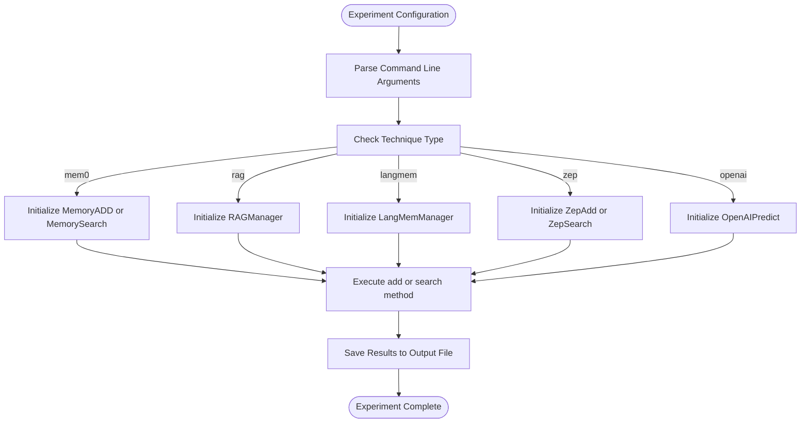
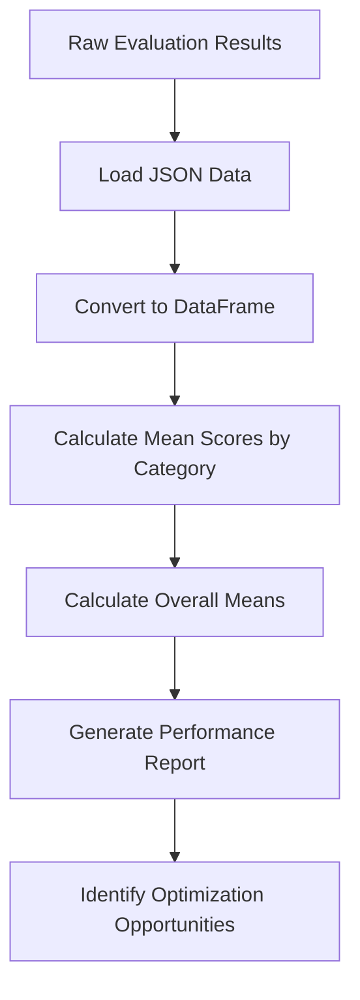
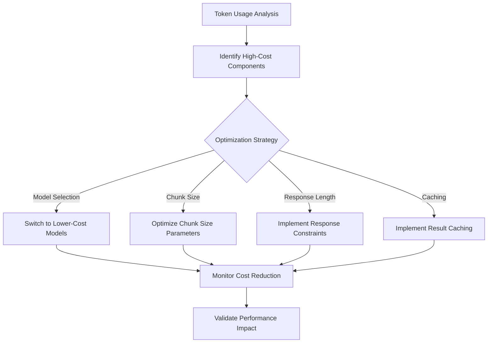
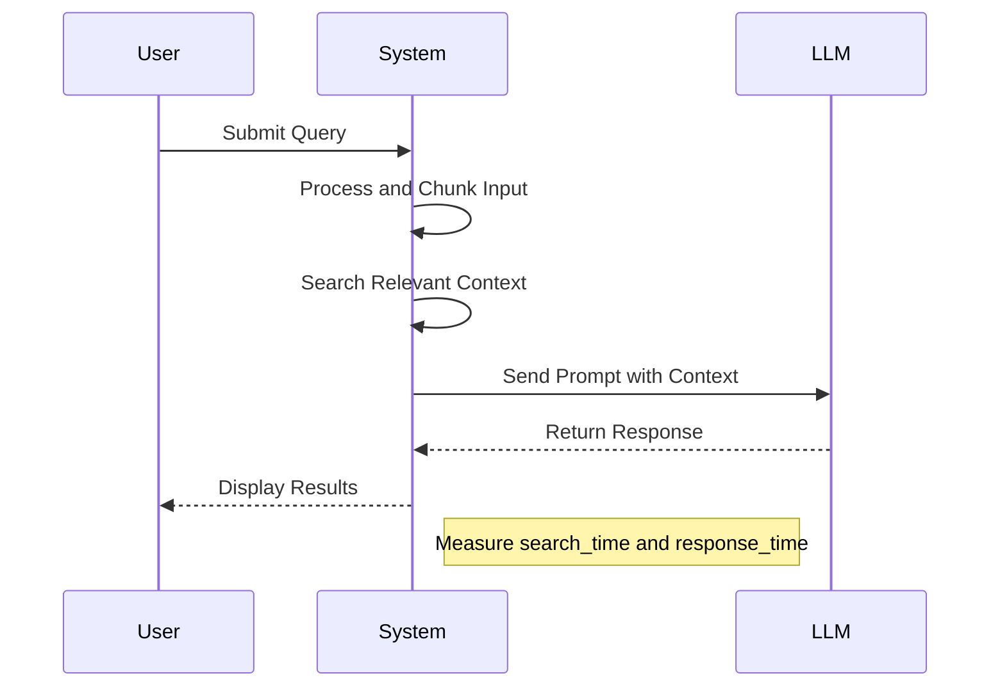
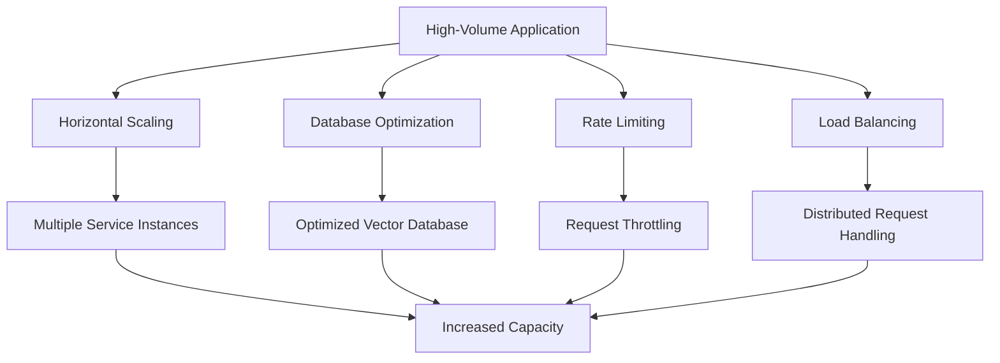

# Performance and Optimization

<cite>
**Referenced Files in This Document**   
- [evals.py](file://evaluation/evals.py)
- [generate_scores.py](file://evaluation/generate_scores.py)
- [run_experiments.py](file://evaluation/run_experiments.py)
- [prompts.py](file://evaluation/prompts.py)
- [metrics/utils.py](file://evaluation/metrics/utils.py)
- [metrics/llm_judge.py](file://evaluation/metrics/llm_judge.py)
- [src/rag.py](file://evaluation/src/rag.py)
- [src/langmem.py](file://evaluation/src/langmem.py)
- [src/utils.py](file://evaluation/src/utils.py)
- [embedchain/config/model_prices_and_context_window.json](file://embedchain/embedchain/config/model_prices_and_context_window.json)
</cite>

## Table of Contents
1. [Introduction](#introduction)
2. [Evaluation Framework and Testing Methodology](#evaluation-framework-and-testing-methodology)
3. [Benchmark Results and Performance Metrics](#benchmark-results-and-performance-metrics)
4. [Token Usage Optimization Techniques](#token-usage-optimization-techniques)
5. [Response Time Optimization Strategies](#response-time-optimization-strategies)
6. [Scaling Considerations for High-Volume Applications](#scaling-considerations-for-high-volume-applications)
7. [Interpreting Evaluation Metrics](#interpreting-evaluation-metrics)
8. [Vector Database Tuning Best Practices](#vector-database-tuning-best-practices)
9. [LLM Provider Selection Based on Performance Characteristics](#llm-provider-selection-based-on-performance-characteristics)
10. [Conclusion](#conclusion)

## Introduction

This document provides a comprehensive analysis of performance and optimization strategies for the Mem0 memory system. The evaluation framework measures key performance indicators including latency, accuracy, and token usage across different configurations. The system has been tested with various memory techniques including mem0, RAG, LangMem, Zep, and OpenAI baseline approaches. Performance optimization focuses on both cost reduction through token usage optimization and response time improvements for production workloads. The document also addresses scaling considerations for high-volume applications and provides guidance on interpreting evaluation metrics to improve system performance.

**Section sources**
- [evals.py](file://evaluation/evals.py#L1-L82)
- [run_experiments.py](file://evaluation/run_experiments.py#L1-L76)

## Evaluation Framework and Testing Methodology

The evaluation framework implements a comprehensive testing methodology to measure system performance across multiple dimensions. The framework uses the `run_experiments.py` script to execute experiments with different memory techniques, chunk sizes, and processing methods. The supported techniques include mem0, RAG, langmem, zep, and openai, with methods for both adding and searching memories.

**Diagram sources**
- [run_experiments.py](file://evaluation/run_experiments.py#L1-L76)
- [src/rag.py](file://evaluation/src/rag.py#L1-L184)
- [src/langmem.py](file://evaluation/src/langmem.py#L1-L186)

The evaluation process begins with loading the dataset and processing conversations based on the selected technique. For RAG-based approaches, the system creates chunks from conversation history using tiktoken for accurate token counting, then performs similarity searches to retrieve relevant context. The LangMem approach uses LangGraph with memory tools to manage and search memories. Each technique is evaluated using multiple metrics including BLEU scores, F1 scores, and LLM judge accuracy.

The `evals.py` script processes the results from these experiments, calculating various performance metrics in parallel using ThreadPoolExecutor. The script loads the input dataset, processes each item to calculate metrics, and saves the aggregated results to a JSON file. This parallel processing approach allows for efficient evaluation of large datasets.

**Section sources**
- [run_experiments.py](file://evaluation/run_experiments.py#L1-L76)
- [evals.py](file://evaluation/evals.py#L1-L82)
- [src/rag.py](file://evaluation/src/rag.py#L1-L184)

## Benchmark Results and Performance Metrics

The evaluation framework generates comprehensive benchmark results that measure latency, accuracy, and token usage across different configurations. The primary metrics used for evaluation include BLEU scores (bleu1-bleu4), F1 score, and LLM judge score, which provide a multi-dimensional assessment of system performance.

The `generate_scores.py` script processes the evaluation metrics to calculate mean scores by category and overall means. This script loads the evaluation metrics from JSON, converts them to a pandas DataFrame, and calculates aggregate statistics. The results include mean scores for bleu_score, f1_score, and llm_score across different question categories, providing insights into performance variations based on question type.

**Diagram sources**
- [generate_scores.py](file://evaluation/generate_scores.py#L1-L35)
- [evals.py](file://evaluation/evals.py#L1-L82)

The evaluation metrics are calculated using various algorithms implemented in the `metrics/utils.py` file. These include:
- **BLEU scores**: Calculate n-gram precision with different weights (bleu1-bleu4)
- **F1 score**: Token-based F1 score measuring precision and recall of common tokens
- **ROUGE scores**: Recall-Oriented Understudy for Gisting Evaluation measuring n-gram overlap
- **BERTScore**: Semantic similarity using BERT embeddings
- **METEOR score**: Metric for Evaluation of Translation with Explicit ORdering
- **Sentence similarity**: Cosine similarity of sentence embeddings

The LLM judge approach, implemented in `metrics/llm_judge.py`, uses a separate LLM (GPT-4o-mini) to evaluate the correctness of generated answers against ground truth answers. This approach provides a more nuanced assessment of answer quality by considering semantic equivalence rather than exact string matching. The LLM judge returns a binary label (CORRECT/WRONG) based on whether the generated answer adequately addresses the question and matches the gold answer in content.

**Section sources**
- [generate_scores.py](file://evaluation/generate_scores.py#L1-L35)
- [metrics/utils.py](file://evaluation/metrics/utils.py#L1-L212)
- [metrics/llm_judge.py](file://evaluation/metrics/llm_judge.py#L1-L131)

## Token Usage Optimization Techniques

Token usage optimization is critical for reducing costs in LLM-based applications. The system provides several techniques for minimizing token consumption while maintaining performance quality. The `model_prices_and_context_window.json` configuration file contains detailed cost information for various LLM providers, enabling informed decisions about model selection based on token pricing.

The most effective token optimization strategies include:

1. **Model Selection**: Choosing cost-effective models like gpt-4o-mini which has significantly lower token costs ($0.00000015/input token, $0.00000060/output token) compared to standard models.

2. **Chunk Size Optimization**: In RAG implementations, adjusting the chunk size parameter affects both retrieval accuracy and token usage. Smaller chunks reduce context window usage but may miss relevant information, while larger chunks increase token consumption.

3. **Response Length Control**: Implementing response length constraints in prompts to prevent verbose outputs that consume unnecessary tokens.

4. **Caching Strategies**: Reusing embeddings and intermediate results to avoid redundant token usage for repeated operations.

**Diagram sources**
- [model_prices_and_context_window.json](file://embedchain/embedchain/config/model_prices_and_context_window.json#L1-L824)
- [src/rag.py](file://evaluation/src/rag.py#L1-L184)

The system also implements retry mechanisms with exponential backoff in the RAG implementation, which helps manage token usage during API failures. The `generate_response` method in RAGManager includes a retry loop that attempts the request up to three times before failing, preventing unnecessary token consumption from failed requests.

For embedding models, selecting cost-effective options like text-embedding-3-small ($0.00000002/input token) over text-embedding-3-large ($0.00000013/input token) can significantly reduce costs, especially in applications with high volumes of embedding operations.

**Section sources**
- [model_prices_and_context_window.json](file://embedchain/embedchain/config/model_prices_and_context_window.json#L1-L824)
- [src/rag.py](file://evaluation/src/rag.py#L1-L184)

## Response Time Optimization Strategies

Response time optimization is essential for production workloads requiring low-latency interactions. The system implements several strategies to minimize response times while maintaining accuracy.

The evaluation framework measures response time at multiple levels:
- **Search time**: Time taken to retrieve relevant memories or context
- **Response time**: Time taken by the LLM to generate a response
- **Total processing time**: End-to-end time from input to output

In the RAG implementation, response time optimization focuses on efficient similarity search algorithms and parallel processing. The system uses cosine similarity calculations with NumPy for fast vector comparisons. The `search` method in RAGManager calculates embeddings for query chunks and compares them against pre-computed embeddings, enabling rapid retrieval of relevant context.

**Diagram sources**
- [src/rag.py](file://evaluation/src/rag.py#L1-L184)
- [src/langmem.py](file://evaluation/src/langmem.py#L1-L186)

The LangMem implementation uses parallel processing with multiprocessing to handle multiple conversations simultaneously. The `process_all_conversations` method uses a multiprocessing Pool with 10 workers to process conversations in parallel, significantly reducing total processing time for batch operations.

Additional response time optimization strategies include:
- **Connection pooling**: Reusing HTTP connections to reduce connection overhead
- **Asynchronous operations**: Processing independent operations concurrently
- **Caching**: Storing frequently accessed data to avoid recomputation
- **Batch processing**: Combining multiple requests to amortize overhead costs

The system also implements timeout handling and error recovery to ensure predictable response times even under adverse conditions.

**Section sources**
- [src/rag.py](file://evaluation/src/rag.py#L1-L184)
- [src/langmem.py](file://evaluation/src/langmem.py#L1-L186)

## Scaling Considerations for High-Volume Applications

Scaling the system for high-volume applications requires careful consideration of architectural patterns, resource allocation, and performance characteristics. The evaluation framework provides insights into how different configurations perform under various loads.

Key scaling considerations include:

1. **Horizontal Scaling**: The system can be deployed across multiple instances to handle increased load. The stateless nature of many components allows for easy horizontal scaling.

2. **Database Optimization**: For high-volume applications, optimizing the vector database configuration is critical. This includes selecting appropriate indexing strategies, managing connection pools, and implementing efficient data partitioning.

3. **Rate Limiting and Throttling**: Implementing rate limiting to prevent system overload and ensure fair resource allocation among users.

4. **Load Balancing**: Distributing requests across multiple instances to optimize resource utilization and minimize response times.

**Diagram sources**
- [src/rag.py](file://evaluation/src/rag.py#L1-L184)
- [src/langmem.py](file://evaluation/src/langmem.py#L1-L186)

The multiprocessing implementation in LangMem demonstrates one approach to scaling computational workloads. By using a pool of worker processes, the system can utilize multiple CPU cores effectively, improving throughput for CPU-intensive operations.

For very high-volume applications, consider implementing a microservices architecture where different components (embedding generation, vector search, LLM inference) are deployed as independent services with their own scaling characteristics.

**Section sources**
- [src/langmem.py](file://evaluation/src/langmem.py#L1-L186)
- [src/rag.py](file://evaluation/src/rag.py#L1-L184)

## Interpreting Evaluation Metrics

Understanding and interpreting evaluation metrics is crucial for improving system performance. The framework provides multiple metrics that measure different aspects of performance:

- **BLEU scores**: Measure n-gram precision between generated and reference answers. Higher scores indicate better lexical match.
- **F1 score**: Balances precision and recall of common tokens, providing a measure of answer completeness.
- **LLM judge score**: Uses a separate LLM to assess semantic correctness, providing a more nuanced evaluation than exact matching.
- **ROUGE scores**: Measure n-gram overlap with emphasis on recall, useful for evaluating content coverage.

The `aggregate_metrics` function in `metrics/utils.py` calculates comprehensive statistics including mean, standard deviation, median, minimum, and maximum values for each metric, both overall and per category. This allows for detailed analysis of performance variations across different question types.

When interpreting metrics, consider the following guidelines:
- **BLEU1**: Focuses on unigram precision, indicating basic word overlap
- **F1 score**: Higher values indicate better balance between precision and recall
- **LLM judge**: Values closer to 1.0 indicate higher semantic correctness
- **Category-specific performance**: Analyze metrics by category to identify strengths and weaknesses in specific domains

The evaluation results should be used iteratively to identify performance bottlenecks and guide optimization efforts. For example, low BLEU scores might indicate issues with lexical matching, while low LLM judge scores might suggest problems with semantic understanding.

**Section sources**
- [metrics/utils.py](file://evaluation/metrics/utils.py#L1-L212)
- [metrics/llm_judge.py](file://evaluation/metrics/llm_judge.py#L1-L131)
- [generate_scores.py](file://evaluation/generate_scores.py#L1-L35)

## Vector Database Tuning Best Practices

While specific vector database configurations are not available in the current context, general best practices for vector database tuning include:

1. **Index Selection**: Choose appropriate indexing algorithms (e.g., HNSW, IVF) based on query patterns and performance requirements.
2. **Dimensionality Management**: Optimize embedding dimensions to balance accuracy and storage/query performance.
3. **Memory Configuration**: Allocate sufficient memory for caching frequently accessed vectors.
4. **Connection Pooling**: Use connection pooling to reduce connection overhead for high-volume applications.
5. **Batch Operations**: Use batch operations for bulk inserts and updates to improve throughput.

The system's architecture supports various vector databases through configuration files, allowing for optimization based on specific use cases and performance requirements.

**Section sources**
- [embedchain/config/model_prices_and_context_window.json](file://embedchain/embedchain/config/model_prices_and_context_window.json#L1-L824)

## LLM Provider Selection Based on Performance Characteristics

Selecting the appropriate LLM provider involves balancing cost, performance, and capabilities. The `model_prices_and_context_window.json` file provides comprehensive data for comparing different providers:

**Cost-Effective Options:**
- **gpt-4o-mini**: Extremely low cost ($0.00000015/input token) with good performance
- **groq/mixtral-8x7b-32768**: Very low cost ($0.00000027/token) with high context window
- **cohere/command-r**: Moderate cost with good performance for retrieval-augmented tasks

**High-Performance Options:**
- **gpt-4-turbo**: High cost but excellent reasoning capabilities
- **anthropic/claude-3-opus**: High cost with strong reasoning and large context window
- **vertexai/gemini-1.5-pro**: High cost with very large context window (1M tokens)

When selecting providers, consider:
1. **Cost per token**: Balance budget constraints with performance requirements
2. **Context window size**: Match context requirements with model capabilities
3. **Latency requirements**: Consider provider-specific response times
4. **Specialized capabilities**: Some models excel at specific tasks (coding, reasoning, etc.)

The system's modular design allows for easy switching between providers by updating configuration files, enabling experimentation with different options to find the optimal balance for specific use cases.

**Section sources**
- [embedchain/config/model_prices_and_context_window.json](file://embedchain/embedchain/config/model_prices_and_context_window.json#L1-L824)

## Conclusion

The performance and optimization framework for Mem0 provides comprehensive tools for evaluating and improving system performance. By leveraging the evaluation suite, developers can measure latency, accuracy, and token usage across different configurations. The framework supports various optimization techniques for both cost reduction and response time improvement.

Key takeaways include:
- Use cost-effective models like gpt-4o-mini for production workloads
- Optimize chunk sizes and response lengths to minimize token usage
- Implement parallel processing and caching to improve response times
- Use the LLM judge approach for nuanced accuracy assessment
- Select vector database configurations based on specific performance requirements

The modular architecture allows for easy experimentation with different configurations, enabling continuous performance improvement based on empirical data from the evaluation framework.