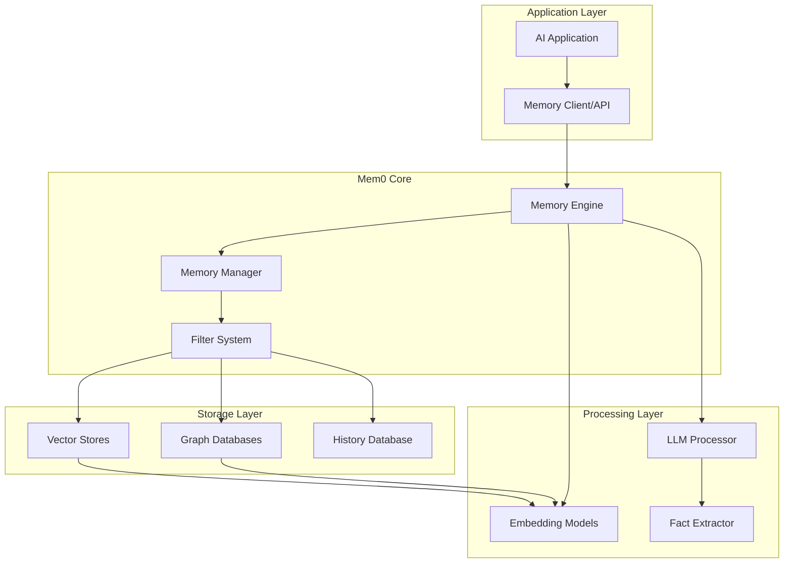
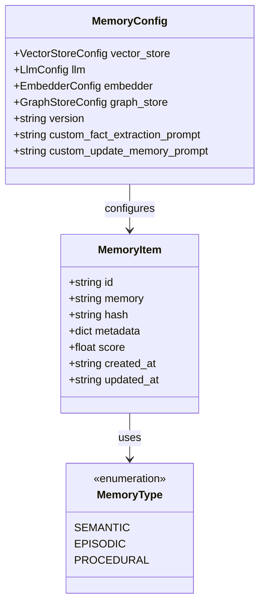
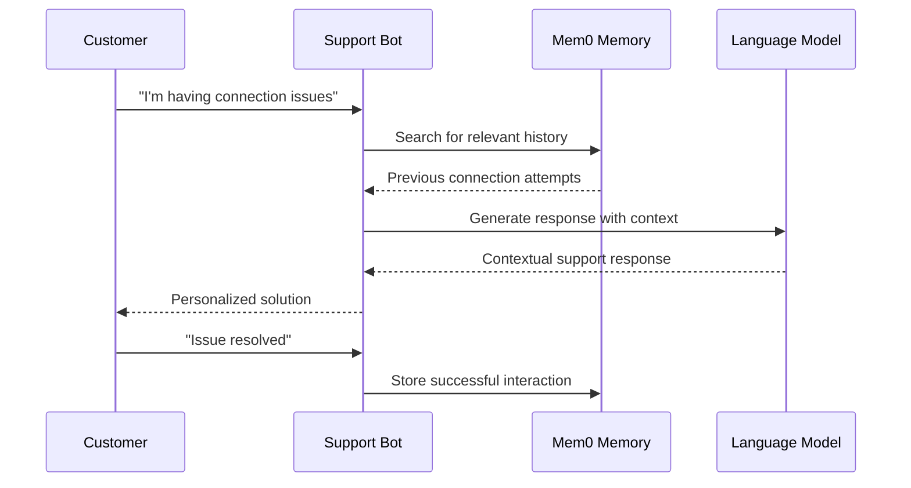
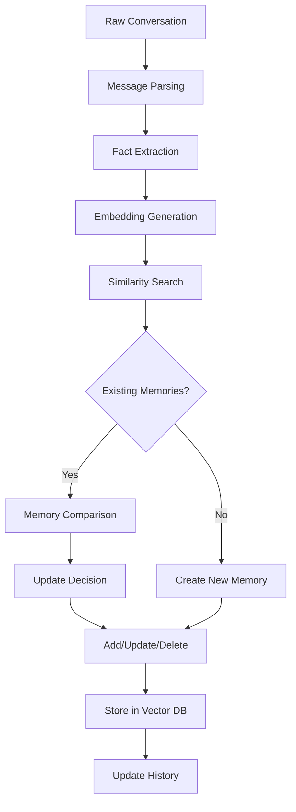

# Project Overview

<cite>
**Referenced Files in This Document**
- [README.md](file://README.md)
- [LLM.md](file://LLM.md)
- [mem0/__init__.py](file://mem0/__init__.py)
- [mem0/memory/main.py](file://mem0/memory/main.py)
- [mem0/configs/base.py](file://mem0/configs/base.py)
- [mem0/utils/factory.py](file://mem0/utils/factory.py)
- [mem0/exceptions.py](file://mem0/exceptions.py)
- [mem0/vector_stores/configs.py](file://mem0/vector_stores/configs.py)
- [mem0/graphs/configs.py](file://mem0/graphs/configs.py)
- [mem0/configs/enums.py](file://mem0/configs/enums.py)
- [mem0/configs/prompts.py](file://mem0/configs/prompts.py)
- [cookbooks/customer-support-chatbot.ipynb](file://cookbooks/customer-support-chatbot.ipynb)
- [tests/test_main.py](file://tests/test_main.py)
</cite>

## Table of Contents
1. [Introduction](#introduction)
2. [Core Value Proposition](#core-value-proposition)
3. [Architecture Overview](#architecture-overview)
4. [Memory Types and Concepts](#memory-types-and-concepts)
5. [Integration Architecture](#integration-architecture)
6. [Real-World Use Cases](#real-world-use-cases)
7. [Technical Implementation Details](#technical-implementation-details)
8. [Common Misconceptions](#common-misconceptions)
9. [Comparison with Standard RAG Systems](#comparison-with-standard-rag-systems)
10. [Getting Started](#getting-started)

## Introduction

Mem0 ("mem-zero") is an intelligent memory layer designed to enhance AI assistants and agents with persistent, personalized memory capabilities. It transforms stateless Large Language Models (LLMs) into context-aware assistants by providing seamless memory inference, multi-modal storage, and sophisticated relationship tracking across user interactions.

Built for production-ready AI agents, Mem0 enables AI systems to remember user preferences, adapt to individual needs, and continuously learn over time. The platform serves as a bridge between raw LLM capabilities and the sophisticated memory requirements of modern AI applications, making it ideal for customer support chatbots, AI assistants, and autonomous systems.

**Section sources**
- [README.md](file://README.md#L56-L71)
- [LLM.md](file://LLM.md#L1-L8)

## Core Value Proposition

### Transforming Stateless LLMs into Context-Aware Assistants

Mem0 addresses the fundamental limitation of traditional LLMs by providing intelligent memory inference capabilities. While LLMs excel at processing information, they lack inherent memory mechanisms. Mem0 solves this by:

- **Memory Inference**: Automatically extracting key facts from conversations using LLM-powered fact extraction
- **Adaptive Personalization**: Learning and adapting to individual user preferences over time
- **Persistent Context**: Maintaining conversation history and user-specific information across sessions

### Multi-Level Memory Architecture

Mem0 implements a sophisticated multi-level memory system that operates at three distinct scopes:

1. **User-Level Memory**: Personalized information about individual users
2. **Session-Level Memory**: Contextual information for specific interaction sessions
3. **Agent-Level Memory**: Shared knowledge and capabilities across AI agents

This hierarchical approach ensures that memories are appropriately scoped and accessible when needed, preventing information overload while maintaining contextual relevance.

**Section sources**
- [README.md](file://README.md#L62-L71)
- [mem0/memory/main.py](file://mem0/memory/main.py#L195-L227)

## Architecture Overview

Mem0's architecture integrates multiple specialized components to deliver comprehensive memory capabilities:



**Diagram sources**
- [mem0/memory/main.py](file://mem0/memory/main.py#L131-L168)
- [mem0/configs/base.py](file://mem0/configs/base.py#L29-L58)

### Core Components

The architecture consists of several interconnected layers:

1. **Memory Engine**: Central orchestrator that manages memory operations
2. **Storage Abstraction**: Unified interface for different storage backends
3. **Processing Pipeline**: Handles embedding generation and fact extraction
4. **Query System**: Sophisticated search and filtering mechanisms

**Section sources**
- [mem0/memory/main.py](file://mem0/memory/main.py#L131-L168)
- [mem0/utils/factory.py](file://mem0/utils/factory.py#L175-L223)

## Memory Types and Concepts

### Semantic Memory

Semantic memory stores factual information and general knowledge extracted from conversations. These memories represent declarative knowledge that can be explicitly recalled and queried.

### Episodic Memory

Episodic memory captures specific events and experiences from user interactions. These memories are tied to temporal contexts and provide rich contextual information for personalized responses.

### Procedural Memory

Procedural memory stores step-by-step procedures and workflows. This type of memory is particularly valuable for task-oriented applications and learning assistance systems.



**Diagram sources**
- [mem0/configs/enums.py](file://mem0/configs/enums.py#L4-L7)
- [mem0/configs/base.py](file://mem0/configs/base.py#L16-L27)
- [mem0/configs/base.py](file://mem0/configs/base.py#L29-L61)

**Section sources**
- [mem0/configs/enums.py](file://mem0/configs/enums.py#L4-L7)
- [mem0/memory/main.py](file://mem0/memory/main.py#L870-L907)

## Integration Architecture

### Vector Database Integration

Mem0 supports extensive vector database integrations for efficient similarity search and semantic memory storage:

| Provider | Type | Use Case |
|----------|------|----------|
| Qdrant | High-performance | Production deployments |
| Chroma | AI-native | Development and testing |
| Pinecone | Managed | Cloud-scale applications |
| FAISS | Facebook AI | Local and offline scenarios |
| Weaviate | Open-source | Self-hosted solutions |

### Graph Database Integration

For relationship tracking and complex entity interactions, Mem0 integrates with specialized graph databases:

| Provider | Type | Strengths |
|----------|------|-----------|
| Neo4j | Full-featured | Enterprise features, Cypher queries |
| Memgraph | High-performance | In-memory processing |
| Neptune | AWS-managed | Cloud-native, scalable |
| Kuzu | Open-source | Lightweight, easy deployment |

### Embedding Model Integration

Mem0 supports various embedding providers for converting text into vector representations:

| Provider | Model Quality | Deployment Options |
|----------|---------------|-------------------|
| OpenAI | Industry-leading | Cloud-based |
| HuggingFace | Open-source | Local deployment |
| Google AI | Enterprise-grade | Cloud and on-premise |
| AWS Bedrock | Managed | Enterprise-scale |

**Section sources**
- [mem0/vector_stores/configs.py](file://mem0/vector_stores/configs.py#L13-L36)
- [mem0/graphs/configs.py](file://mem0/graphs/configs.py#L80-L106)
- [mem0/utils/factory.py](file://mem0/utils/factory.py#L175-L223)

## Real-World Use Cases

### Customer Support Chatbots

Mem0 excels in customer support applications by maintaining comprehensive user histories and resolving recurring issues efficiently:



**Diagram sources**
- [cookbooks/customer-support-chatbot.ipynb](file://cookbooks/customer-support-chatbot.ipynb#L26-L112)

### Healthcare Assistants

In healthcare applications, Mem0 maintains sensitive patient information while ensuring privacy and compliance:

- **Patient Preference Tracking**: Remembering dietary restrictions, medication preferences
- **Treatment History**: Maintaining chronological records of medical interventions
- **Appointment Scheduling**: Coordinating future appointments based on patient availability

### Productivity Tools

Mem0 enhances productivity applications by learning user workflows and automating repetitive tasks:

- **Workflow Automation**: Recognizing and automating frequently used processes
- **Context-Aware Assistance**: Providing relevant suggestions based on current tasks
- **Knowledge Base Integration**: Building comprehensive organizational knowledge repositories

**Section sources**
- [cookbooks/customer-support-chatbot.ipynb](file://cookbooks/customer-support-chatbot.ipynb#L26-L112)
- [README.md](file://README.md#L67-L70)

## Technical Implementation Details

### Memory Inference Process

Mem0 employs a sophisticated memory inference system that automatically extracts and organizes information from conversations:



**Diagram sources**
- [mem0/memory/main.py](file://mem0/memory/main.py#L348-L400)

### Procedural Memory Creation

Procedural memories are created using specialized prompts and processing:


**Diagram sources**
- [mem0/memory/main.py](file://mem0/memory/main.py#L870-L907)

### Multi-Modal Memory Support

Mem0 supports various content types beyond plain text:

- **Text Documents**: Standard conversation transcripts
- **Images**: Visual context and screenshots
- **PDF Documents**: Structured document analysis
- **Audio Transcripts**: Voice interaction processing

**Section sources**
- [mem0/memory/main.py](file://mem0/memory/main.py#L348-L400)
- [mem0/memory/main.py](file://mem0/memory/main.py#L870-L907)

## Common Misconceptions

### Misconception 1: Mem0 Replaces LLMs

**Reality**: Mem0 enhances LLMs by providing memory capabilities, not replacing them. LLMs remain the core reasoning engine while Mem0 handles memory management.

### Misconception 2: Memory is Always Persistent

**Reality**: Mem0 provides configurable persistence levels. Memories can be ephemeral for session-specific contexts or persistent for long-term learning.

### Misconception 3: Graph Memory is Always Necessary

**Reality**: Graph memory is optional and primarily useful for applications requiring relationship tracking. Many use cases benefit from vector-only memory systems.

### Misconception 4: Mem0 Requires Constant LLM Calls

**Reality**: Mem0 optimizes LLM usage by caching embeddings and minimizing redundant calls. The system intelligently decides when LLM intervention is necessary.

## Comparison with Standard RAG Systems

### Key Differences

| Aspect | Mem0 | Traditional RAG |
|--------|------|-----------------|
| **Memory Type** | Persistent, evolving memories | Static document chunks |
| **Context Awareness** | Dynamic, adaptive context | Fixed retrieval context |
| **Learning Capability** | Continuous learning and adaptation | One-time retrieval |
| **Personalization** | User-specific memory evolution | Generic document retrieval |
| **Relationship Tracking** | Built-in graph memory | No inherent relationship modeling |

### Advantages of Mem0

1. **Scalable Learning**: Mem0's memory system evolves naturally with user interactions
2. **Context Preservation**: Maintains rich contextual information across conversations
3. **Personalization**: Adapts to individual user preferences and patterns
4. **Efficiency**: Optimized for real-time applications with minimal latency

### When to Choose Mem0

- Applications requiring long-term user engagement
- Systems needing personalized responses over time
- Scenarios involving complex relationship tracking
- Use cases benefiting from continuous learning

## Getting Started

### Basic Setup

Mem0 offers both hosted and self-hosted deployment options:

```python
# Hosted Platform
from mem0 import MemoryClient
client = MemoryClient(api_key="your-api-key")

# Self-Hosted
from mem0 import Memory
memory = Memory()
```

### Essential Operations

The core Mem0 API provides intuitive methods for memory management:

- **Add Memories**: `memory.add(messages, user_id="user123")`
- **Search Memories**: `memory.search(query, user_id="user123")`
- **Retrieve Memories**: `memory.get(memory_id)`
- **Manage Memories**: `memory.update(memory_id, data)`
- **Delete Memories**: `memory.delete(memory_id)`

### Configuration Options

Mem0 supports extensive customization through configuration objects:

```python
from mem0.configs.base import MemoryConfig

config = MemoryConfig(
    vector_store={"provider": "qdrant", "config": {"host": "localhost"}},
    llm={"provider": "openai", "config": {"model": "gpt-4o-mini"}},
    embedder={"provider": "openai", "config": {"model": "text-embedding-3-small"}}
)
memory = Memory(config)
```

**Section sources**
- [README.md](file://README.md#L72-L137)
- [LLM.md](file://LLM.md#L22-L88)
- [mem0/configs/base.py](file://mem0/configs/base.py#L29-L61)